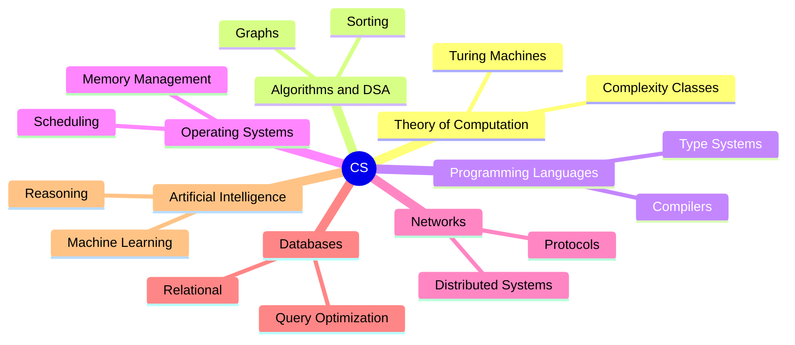
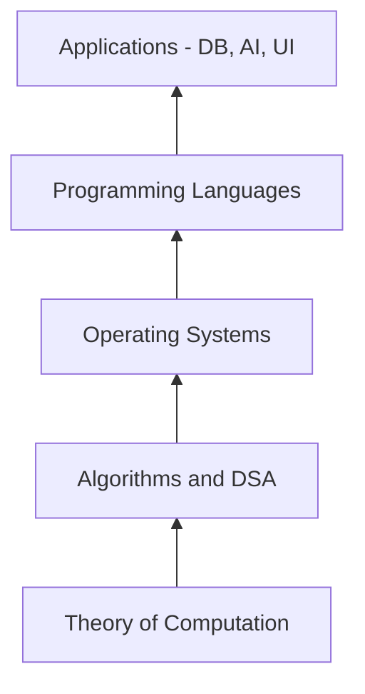

⚡ TL;DR - Computer Science is the formal study of computation,
algorithms, and information systems - organized into seven
major branches that all practicing engineers draw from daily.

| #001 | Category: CS Fundamentals - Paradigms | Difficulty: ★☆☆ |
|:---|:---|:---|
| **Depends on:** | None - orientation entry | |
| **Used by:** | All CS Fundamentals entries | |
| **Related:** | DSA-001 (Algorithms), OSY-001 (OS), NET-001 (Networking) | |

---

### 🔥 The Problem This Solves

**WORLD WITHOUT IT:**

Before CS was formalized as a discipline, "programming"
was ad hoc craft. Engineers built working systems without
shared vocabulary, formal proofs of correctness, or any
framework for comparing solutions. Why does one sorting
approach work faster than another? Nobody had language
to answer systematically. Hiring, teaching, and reasoning
about software were guesswork.

**THE BREAKING POINT:**

As machines became commercially critical in the 1960s,
the cost of software bugs and inefficiencies exploded.
The 1968 NATO Software Engineering Conference named the
"software crisis" - projects overrun, systems unreliable,
complexity unmanaged. Without a science of computation,
there was no way to reason about correctness, scalability,
or even why one design outperformed another.

**THE INVENTION MOMENT:**

Turing, Church, Godel, and Dijkstra formalized computation
as a mathematical object. This created CS as a discipline:
a body of theory about what problems are solvable, how
efficiently, and by what methods. A shared language let
engineers stop reinventing wheels and start building on
proven foundations.

**EVOLUTION:**

From pure theory (computability, logic) in the 1930s-50s,
CS expanded into systems (OS, networks, compilers) in the
60s-70s, applications (databases, AI, graphics) in the
80s-90s, and platform-scale engineering (cloud, distributed
systems, ML) in the 2000s-present. The discipline is still
expanding - quantum computing, formal verification of ML
systems, and AI safety are active frontiers.

---

### 📘 Textbook Definition

Computer Science is the systematic study of algorithms,
computation, data structures, programming languages,
operating systems, and the mathematical foundations
underlying them. It encompasses both theoretical computer
science (computability, complexity theory, formal languages)
and applied computer science (software engineering, databases,
artificial intelligence, computer networks). CS asks three
fundamental questions: what can be computed, how efficiently,
and how do we build reliable systems that compute it?

---

### ⏱️ Understand It in 30 Seconds

**One line:**
CS is the science of making computers solve problems
correctly, efficiently, and reliably.

**One analogy:**

> CS is to software engineering what physics is to
> mechanical engineering. A mechanical engineer builds
> bridges; physics tells them why bridges hold or fall.
> A software engineer builds systems; CS tells them why
> systems are correct, fast, or broken. You can build
> without the science - until you encounter a problem
> that requires it. Then it is the only tool that works.

**One insight:**

The map matters because CS has seven major branches and
most production failures touch exactly one. A performance
problem is almost always an algorithms/data structures
problem (wrong time complexity). A security breach is
almost always an operating systems or networking problem
(trust boundary violation). Knowing the map tells you
which branch holds the answer.

---

### 🔩 First Principles Explanation

**THE SEVEN BRANCHES:**

```
┌─────────────────────────────────────────┐
│       Computer Science Map              │
├─────────────────────────────────────────┤
│  1. Theory of Computation               │
│     (what IS computable?)               │
│  2. Algorithms & Data Structures        │
│     (HOW to compute efficiently?)       │
│  3. Programming Languages & Compilers   │
│     (HOW to express computation?)       │
│  4. Operating Systems & Architecture    │
│     (WHERE does computation run?)       │
│  5. Computer Networks                   │
│     (HOW do systems communicate?)       │
│  6. Databases & Information Systems     │
│     (HOW to store & retrieve at scale?) │
│  7. Artificial Intelligence             │
│     (HOW to compute what we cannot      │
│      explicitly program?)               │
└─────────────────────────────────────────┘
```



**WHY THESE SEVEN:**

Each branch answers a distinct question about computation.
They are not arbitrary categories - they map to distinct
mathematical foundations:
- Theory: formal logic, automata theory, computability
- Algorithms: combinatorics, graph theory, probability
- Languages: formal grammars, type theory, lambda calculus
- OS/Architecture: hardware-software interface, resource management
- Networks: information theory, protocol design, distributed computing
- Databases: relational algebra, transaction theory
- AI: statistics, optimization, knowledge representation

**THE TRADE-OFF IN LEARNING:**

**Gain:** A breadth map lets you locate problems in the right
branch and apply the right tools. Without the map, you apply
hammer to every screw.

**Cost:** True mastery of any branch takes years. The map is
orientation, not expertise. The risk of the map is the
Dunning-Kruger trap - knowing the labels without the depth.

**ESSENTIAL vs ACCIDENTAL COMPLEXITY:**

**Essential:** The seven branches each capture genuinely
separate domains. A networking expert and a compiler expert
use different math and different mental models.

**Accidental:** The boundaries between branches are blurry
in real systems. A database system requires OS knowledge
(memory, I/O), algorithms (B-trees, hash joins), and
networking (distributed queries). Real engineering crosses
branches constantly.

---

### 🧪 Thought Experiment

**SETUP:**

Your web service has a 2-second API response time.
Users are complaining. Where do you look first?

**WITHOUT THE MAP:**

You guess: add caching, upgrade hardware, refactor code,
change databases, switch frameworks. Each attempt is a coin
flip. You may fix it accidentally or never find the root cause.

**WITH THE MAP:**

You trace to the right branch:
- Is it a CPU-bound algorithm running in O(n^2)? Branch 2
- Is it an OS thread scheduling problem? Branch 4
- Is it a network round-trip issue? Branch 5
- Is it a slow database query - missing index? Branch 6
- Is it a machine learning model inference time? Branch 7

Each branch has specific diagnostic tools and known patterns.
The map turns "it's slow" into a targeted investigation.

**THE LESSON:**

The CS map is not academic decoration. It is a diagnostic
triage system for real engineering problems. Senior engineers
who have internalized it diagnose faster because they skip
the random guessing and head directly to the right branch.

---

### 🎯 Mental Model / Analogy

**THE HOSPITAL DEPARTMENTS ANALOGY:**

A hospital has departments: cardiology, neurology, oncology,
orthopedics. A patient presenting with chest pain goes to
cardiology, not oncology - even though both involve human
tissue. The departments reflect the natural structure of
the domain. Cross-referrals happen (cardiology + neurology
for stroke), but triage to the right department first
dramatically accelerates diagnosis.

CS branches work the same way. A slow JOIN sends you to
databases (Branch 6). A thread deadlock sends you to OS
(Branch 4). Cross-branch problems exist (a distributed
database query crosses branches 4, 5, and 6), but triage
to the primary branch first.

**MEMORY HOOK:**

"Theory - Algorithms - Languages - OS - Networks -
Databases - AI" - read top to bottom as a stack:
theory sits at the bottom (foundations), AI sits at the
top (applications). Systems that fail often fail at the
boundary between two adjacent layers.

---

### 📊 Gradual Depth - Five Levels

**Level 1 - Child:**
CS is how we teach computers to do things - like how a
recipe teaches a cook. CS is the science of writing recipes
that machines can follow.

**Level 2 - Student:**
CS covers algorithms (step-by-step problem solving),
data structures (organizing information), programming
languages (how we write instructions), operating systems
(how hardware runs code), and artificial intelligence
(making machines learn).

**Level 3 - Professional:**
CS has seven core branches that map to distinct mathematical
foundations. Algorithms and data structures determine
efficiency (O(n log n) vs O(n^2)). OS determines resource
management and concurrency. Networks determine distributed
communication. Databases determine persistent storage at
scale. Understanding which branch a problem belongs to
determines which mental models and tools apply.

**Level 4 - Senior Engineer:**
The map predicts failure modes. Performance degradation at
scale almost always traces to Algorithms (wrong complexity
class) or Systems (resource saturation). Security failures
trace to OS or Networks (boundary violations). Data
consistency failures trace to Databases (transaction
isolation). Knowing the branch tells you: what papers to
read, what metrics to collect, what tools exist, and what
the known failure modes are.

**Level 5 - Expert:**
The branches are not independent. Compilers inform OS
design (memory models, garbage collection). Network theory
drove distributed systems theory (CAP theorem, Byzantine
fault tolerance). Database theory informed streaming systems
(Dataflow, Flink). AI has rediscovered formal verification
(neural network correctness proofs). Expert-level work
lives at branch boundaries where established tools do not
quite fit - requiring theory from multiple branches
simultaneously.

*Expert Cues - Level 5:*
Theoretical computer science (computability, complexity)
provides worst-case guarantees. Practice-oriented CS
provides average-case reasoning and heuristics. When
you see "proven to be NP-hard" - that is Branch 1
telling Branch 2 that no algorithm will ever be fast
for all inputs; approximation algorithms are the only
path. This cross-branch signal changes every engineering
decision downstream.

---

### ⚙️ How It Works (Formal Basis)

**THE FOUNDATION: TURING-CHURCH THESIS**

All of CS rests on Turing and Church's 1936 proofs that
computation is a precisely definable mathematical object.
A Turing Machine is the theoretical minimum: tape, head,
state table. Any function that can be computed can be
computed by a Turing Machine. This foundation bounds the
entire discipline - it defines what CS can and cannot
solve.

**COMPLEXITY THEORY AS THE ENGINEERING BOUNDARY:**

Complexity theory (Branch 1) tells Branches 2-7 what is
feasible. Problems in P (polynomial time) are tractable;
problems in NP-hard require approximations or
heuristics. Every database query optimizer, every
compiler optimization, every AI training algorithm
operates under constraints established in Branch 1.

**THE ABSTRACTION HIERARCHY:**

```
┌─────────────────────────────────────────┐
│     CS Abstraction Stack                │
│                                         │
│  Application  (DB, AI, UI)              │
│      ^                                  │
│  Programming Languages / Compilers      │
│      ^                                  │
│  Operating Systems / Architecture       │
│      ^                                  │
│  Algorithms & Data Structures           │
│      ^                                  │
│  Theory of Computation (foundation)     │
└─────────────────────────────────────────┘
```



Each layer provides abstractions that the layer above uses
without caring about the layer below - until a boundary is
crossed. Application developers who do not know OS memory
models hit mysterious OOM errors. Database engineers who
do not know algorithms hit O(n^2) query plans.

---

### 🔄 System Design Implications

**THE MAP AS A SYSTEM DESIGN TOOL:**

System design interviews and real architecture reviews
require exactly this map. "Design a URL shortener" requires:
- Algorithms (hashing for short ID generation)
- Databases (storing billions of key-value pairs)
- Networks (HTTP redirects, global distribution)
- OS (caching at the process level)

Knowing the map means knowing which branch owns each
decision and which trade-offs apply.

**WHAT CHANGES AT SCALE:**

At 10x users: Algorithms problems appear (O(n^2) becomes
visible under load). At 100x: Database problems appear
(queries that worked at small scale hit index limits).
At 1000x: Network and distributed systems problems appear
(single-machine assumptions fail; CAP theorem becomes
operational reality).

**CROSS-BRANCH FAILURES:**

The most dangerous production failures often cross two
branches:
- Slow database query + high network latency = cascading
  timeout that looks like a network problem (actually DB)
- Memory leak in application + OS page fault storm =
  looks like CPU spike (actually memory)
- Wrong algorithm in ML inference + GPU scheduling
  latency = looks like network bottleneck

The map helps you not get fooled by surface symptoms.

---

### 💻 Code Example

**Example 1 - Recognition: The Branch of a Bug**

```java
// Which CS branch does each bug belong to?

// Bug 1: O(n^2) algorithm scanning users on every request
// Branch: 2 - Algorithms and Data Structures
// BAD: Linear scan - O(n) per call, O(n^2) total
public boolean userExists(String name, List<User> users) {
    for (User u : users) {
        if (u.getName().equals(name)) return true;
    }
    return false;
}

// GOOD (Branch 2 fix): Use HashMap - O(1) lookup
// Map<String, User> userIndex = new HashMap<>();
// userIndex.containsKey(name); // O(1)

// Bug 2: Thread not released back to pool
// Branch: 4 - Operating Systems (thread management)
// BAD: Connection never closed, pool exhausted under load
// Connection conn = dataSource.getConnection();
// executeQuery(conn); // forgot conn.close()

// GOOD: Use try-with-resources
// try (Connection conn = dataSource.getConnection()) {
//     executeQuery(conn);
// } // auto-closed

// Bug 3: Missing DB index on foreign key
// Branch: 6 - Databases
// BAD: SELECT * FROM orders WHERE customer_id = ?
// Without index: full table scan on 10M rows
// GOOD: CREATE INDEX idx_orders_customer
//        ON orders(customer_id)
```

**Example 2 - Production: Diagnosing by Branch**

```java
// Service is slow. Systematic diagnosis by CS branch.

// Step 1: Branch 2 check - is algorithm complexity wrong?
// Add timing per request size:
long start = System.nanoTime();
processRequest(request);
long elapsed = System.nanoTime() - start;
// If elapsed grows as O(n^2) with input size: Branch 2 fix

// Step 2: Branch 4 check - OS resource saturation?
// Linux: top -H -p <pid>
// High iowait% -> disk I/O bottleneck (OS/storage)
// High context switches -> lock contention (Branch 4)

// Step 3: Branch 6 check - database slow query?
// EXPLAIN SELECT * FROM orders WHERE customer_id = ?;
// type: ALL -> missing index (Branch 6 fix)
// type: ref -> index in use (look at other branches)
```

---

### ⚖️ Comparison Table

| CS Branch | Core Question | Primary Tools | Common Failure |
|---|---|---|---|
| Theory | What is computable? | Automata, proofs | NP-hard problem attempted as polynomial |
| Algorithms/DSA | How efficiently? | Big-O, trees, graphs | Wrong complexity class at scale |
| Languages | How to express? | Compilers, type systems | Type errors, memory unsafety |
| OS/Architecture | Where does it run? | Threads, memory, I/O | Race conditions, OOM, deadlock |
| Networks | How to communicate? | Protocols, TCP/IP | Timeout cascades, packet loss |
| Databases | How to store/query? | SQL, indexes, transactions | Missing index, N+1, lost updates |
| AI | How to learn? | Statistics, optimization | Overfitting, bias, hallucination |

---

### ⚠️ Common Misconceptions

| Misconception | Reality |
|---|---|
| CS = programming | Programming is one skill within CS. CS also includes theory, algorithms, systems, databases, AI - most requiring mathematical reasoning more than coding. |
| CS theory is only for academics | Every production performance crisis is solved using Big-O analysis (Branch 2). Every security audit applies OS and network principles (Branches 4-5). |
| The branches are separate disciplines | Distributed databases combine Branches 4, 5, and 6. ML compilers combine Branches 1, 2, and 3. The map helps triage; mastery crosses branches. |
| CS fundamentals are stable - learn once | Theory and algorithms are stable. Applications evolve rapidly - distributed systems, ML, quantum computing push new frontiers constantly. |
| Good engineers know all seven branches equally | No one masters all seven. Senior engineers have depth in 2-3 and literacy in the others. The map guides where to invest depth. |

---

### 🚨 Failure Modes & Diagnosis

**Failure Mode 1: Misdiagnosed Branch**

**Symptom:** Team spends two weeks optimizing database
queries; service is still slow after all changes.

**Root Cause:** The actual problem is an O(n^2) algorithm
in application code (Branch 2), but the team diagnosed
it as a database problem (Branch 6). DB queries improved
but overall latency unchanged.

**Diagnostic Signal:**
Profile application CPU usage before touching the database.
If profiler shows 80% time in a single in-memory loop -
it is an algorithms problem, not a database problem.

**Fix:** Correct branch identification first. Add APM
profiler instrumentation before any optimization attempt.

---

**Failure Mode 2: System Design Gaps**

**Symptom:** Engineer passes coding rounds but fails
system design. Can implement algorithms but cannot explain
why systems degrade under load.

**Root Cause:** Depth in Branch 2 without breadth across
Branches 4-6. System design requires cross-branch reasoning.

**Diagnostic Signal:**
Ask: "Which CS branch owns this failure?" Candidates who
cannot answer cannot diagnose real systems.

**Fix:** Study the map deliberately. Map every production
incident you encounter to its primary branch.

---

**Security Failure: SQL Injection (Branch 6)**

**Symptom:** Service accepts user input and passes it to
a database query. Attacker extracts full user table via
SQL injection.

**Root Cause:** Branch 6 failure - unvalidated input to
SQL interpreter. OWASP Top 10 #1 (Injection).

**Diagnostic Signal:**
Audit: trace every user input to every interpreter
(SQL, shell, HTML, XML). Parameterized queries prevent
SQL injection entirely.

**Fix:** Use prepared statements in every database-touching
code path. Never concatenate user input into SQL strings.

```java
// BAD: SQL injection vulnerability
String sql = "SELECT * FROM users WHERE name = '"
    + userInput + "'";

// GOOD: Parameterized query - injection impossible
PreparedStatement ps = conn.prepareStatement(
    "SELECT * FROM users WHERE name = ?");
ps.setString(1, userInput);
```

---

### 🔗 Related Keywords

**Prerequisites (understand these first):**
- `Variables, Types, and Scope` (CSF-006) - the minimum
  vocabulary to express any computation in any branch
- `Control Flow` (CSF-007) - the execution model underlying
  all CS branches

**Builds On This (learn these next):**
- `Why Programming Paradigms Exist` (CSF-002) - dives
  deeper into the programming languages branch
- `The CS Ecosystem Map` (CSF-003) - expands the overview
  into the practical tooling layer
- `How Code Becomes Execution` (CSF-004) - traces the
  path from source to machine through the CS stack

**Alternatives / Comparisons:**
- `Software Engineering vs Computer Science` - SE focuses
  on process and methodology; CS on formal foundations.
  Real professionals benefit from both.

---

### 📌 Quick Reference Card

```
┌────────────────────────────────────────────────────────┐
│ WHAT IT IS   │ Formal study of computation across      │
│              │ seven major branches                    │
├──────────────┼─────────────────────────────────────────┤
│ 7 BRANCHES   │ Theory, Algorithms, Languages, OS,      │
│              │ Networks, Databases, AI                 │
├──────────────┼─────────────────────────────────────────┤
│ KEY INSIGHT  │ The map is a diagnostic triage tool -   │
│              │ identify the branch before you fix      │
├──────────────┼─────────────────────────────────────────┤
│ SLOW SYSTEM  │ Algorithms first (complexity class),    │
│ CHECKLIST    │ then OS, then DB, then Network          │
├──────────────┼─────────────────────────────────────────┤
│ FOUNDATION   │ Turing-Church thesis: defines what is   │
│              │ computable and sets the hard limits     │
├──────────────┼─────────────────────────────────────────┤
│ TRADE-OFF    │ Breadth (map) vs depth (mastery) -      │
│              │ you need both; map guides depth invest  │
├──────────────┼─────────────────────────────────────────┤
│ ONE-LINER    │ "CS is the science of computation;      │
│              │ the map tells you which science to use" │
├──────────────┼─────────────────────────────────────────┤
│ NEXT EXPLORE │ CSF-002 (Paradigms), DSA-001, OSY-001   │
└────────────────────────────────────────────────────────┘
```

**If you remember only 3 things:**

1. CS has seven major branches, each with distinct
   mathematical foundations and diagnostic tools.
   Know the map or diagnose blindly.
2. Production failures almost always trace to exactly
   one branch - identifying it correctly saves 80% of
   investigation time.
3. The Turing-Church thesis defines what CS can and
   cannot solve - NP-hard problems require approximations,
   and this changes every downstream engineering decision.

**Interview one-liner:**
"Computer Science is the formal study of computation
organized into seven branches. The practical value is
triage: a slow system gets diagnosed by branch -
algorithms, OS, database, or network - rather than
guesswork. Engineers who know the map debug production
faster and design systems that scale."

---

### 💎 Transferable Wisdom

**Reusable Engineering Principle:**
Every complex domain benefits from a structural map that
organizes problems into categories with distinct tools.
The map is not memorization - it is orientation that
prevents applying the wrong tools to the wrong problems.

**Where else this pattern appears:**

- **Incident response triage** - SRE runbooks are branch
  decision trees: application, database, network, or
  infrastructure? Each path leads to different tools
- **Security threat modeling (STRIDE)** - categorizes
  threats into six types so teams apply branch-specific
  mitigations rather than generic responses
- **Medical diagnosis** - symptoms mapped to organ systems
  before tests ordered; wrong branch wastes time and
  harms patients

**Industry applications:**

- **SRE/On-call engineering** - first question is always
  "which tier/layer is failing?" - this IS the CS branch
  map applied to incident diagnosis
- **Technical interview prep** - system design interviews
  are structured by this map: algorithms, storage,
  networking, and scalability each get distinct treatment
- **Technology career planning** - the map lets you choose
  which branch to deepen based on problems you want to
  solve and roles that pay most in your chosen context

---

### 💡 The Surprising Truth

The problem that launched modern CS - Alan Turing's 1936
proof of the Halting Problem - showed that certain problems
are provably unsolvable by any algorithm, ever. Before this
proof, computer science did not exist as a formal discipline.
The Halting Problem established that computation has hard
theoretical limits, making it a science rather than just
engineering. Every modern CS graduate learns Turing's proof
not for historical interest, but because it still directly
matters: software verification tools, type systems, and
static analysis tools all navigate around the Halting Problem
daily. The limits of the theoretical foundation are visible
in every production tool you use.

---

### ✅ Mastery Checklist

**You've mastered this when you can:**

1. **[EXPLAIN]** Given any production incident description,
   identify which of the seven CS branches it primarily
   belongs to and explain which diagnostic tools apply.

2. **[DEBUG]** When presented with a slow API endpoint,
   perform branch-by-branch triage: rule out algorithm
   complexity, then OS resource saturation, then database
   query performance, with specific metrics at each step.

3. **[DECIDE]** In a system design discussion, map each
   major architectural decision to its CS branch and state
   the relevant constraints from that branch.

4. **[CONNECT]** Explain to a junior developer why knowing
   the Halting Problem matters for static analysis tools
   and why no linter can ever catch all bugs.

5. **[EXTEND]** Describe a production failure where the
   root cause was in a different branch than initially
   suspected, and explain what CS knowledge would have
   shortened the diagnosis.

---

### 🧠 Think About This Before We Continue

**Q1.** Your checkout endpoint degrades from 50ms to 8
seconds after a deployment adding discount calculation
that iterates all active promotions for every cart item.
The team proposes adding Redis cache. Is caching the right
fix? Which CS branch owns the root cause?

*Hint: If the algorithm is O(n x m) where n is cart items
and m is active promotions, what does caching buy you?
What does a branch-first diagnosis tell you?*

**Q2.** You are designing a URL shortener for 1 billion
URLs, 100,000 reads/second, global latency under 50ms.
Map each requirement to its CS branch and identify which
branch introduces the hardest constraint.

*Hint: 100K reads/second - which branch? Global 50ms
latency - which branch? 1 billion URLs with uniqueness -
which branch? Each points to a different design decision.*

**Q3.** The Halting Problem proves no algorithm can
determine for all programs whether they will halt. Your
static analysis tool checks Java for NullPointerExceptions.
What theoretical guarantee can this tool provide? What
does it mean for the false-positive/false-negative rate?

*Hint: What do "sound" and "complete" mean in formal
verification? The Halting Problem says you cannot have
both. Which one does your static analysis tool sacrifice?*

---

### 🎯 Interview Deep-Dive

**Q1: A junior engineer says "I don't need CS theory,
I just need React and Spring Boot to get hired." How
do you respond as a senior engineer?**

*Why they ask:* Tests understanding of CS fundamentals'
layered value for career longevity vs. immediate
job acquisition.

*Strong answer includes:*
- Acknowledge the short-term truth: many entry-level
  roles prioritize framework knowledge
- The inflection point: as scope and seniority grow,
  framework knowledge stops being the bottleneck -
  performance, scalability, reliability require CS
- Specific example: a slow query is a Branch 6 problem;
  a memory leak is a Branch 4 problem; neither is
  solvable by learning more React
- Reframe: frameworks are the daily vocabulary; CS
  branches are the grammar that makes new vocabularies
  learnable

**Q2: You are joining a team experiencing repeated
production incidents where no one does branch-based
diagnosis. What do you introduce and how?**

*Why they ask:* Tests ability to apply CS structure
to engineering process improvement.

*Strong answer includes:*
- Introduce incident templates with branch fields:
  was it algorithms, OS, network, database?
- Require metrics that distinguish branches: CPU profiler
  for algorithms, thread dump for OS, EXPLAIN for DB
- After 10 incidents: retrospective showing branch
  distribution - use data to justify deeper investment
- Goal: replace "it was slow" with "it was an O(n^2)
  algorithm in the cart discount engine"

**Q3: How does the Halting Problem limit what your
IDE's "Find all usages" feature can guarantee?**

*Why they ask:* Tests connection of theoretical CS
to practical tooling.

*Strong answer includes:*
- "Find all usages" performs static analysis - analyses
  code without running it
- Halting Problem: no static analysis can be simultaneously
  sound (no false negatives) and complete (no false
  positives) for all programs
- In practice, it may miss dynamic dispatch, reflection,
  and bytecode manipulation
- Real impact: refactoring using only IDE reference
  finding is not always safe - runtime errors after
  "safe" refactors exist because reflection bypasses
  static analysis