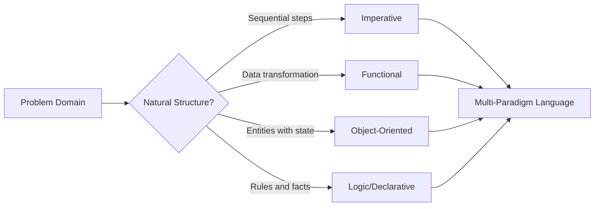

⚡ TL;DR - Paradigms exist because different problem
structures require different mental models - no single
way of expressing computation works best for all problems.

| #002 | Category: CS Fundamentals - Paradigms | Difficulty: ★☆☆ |
|:---|:---|:---|
| **Depends on:** | CSF-001 (What Is Computer Science) | |
| **Used by:** | CSF-011 through CSF-018 (all paradigm entries) | |
| **Related:** | CSF-005 (History of Languages), CSF-022 (Functional) | |

---

### 🔥 The Problem This Solves

**WORLD WITHOUT IT:**

In the 1950s, all programming was machine code or assembly:
explicit registers, memory addresses, and jump instructions.
As programs grew from hundreds to thousands of lines, the
absence of any organizing principle became catastrophic.
Every programmer invented their own structure - or had none.
Reading anyone else's code required reconstructing their
mental model from scratch.

**THE BREAKING POINT:**

The "software crisis" of the late 1960s: major projects
(operating systems, air traffic control, banking software)
were years late, massively over budget, and delivered with
critical bugs. The root cause: no shared way to organize
computation. FORTRAN solved arithmetic. COBOL solved records.
But neither gave engineers a systematic way to manage
complexity as programs scaled.

**THE INVENTION MOMENT:**

Researchers realized that different problem domains had
different natural structures. Data transformation problems
were naturally expressed as function composition
(mathematics). Simulations of real-world objects were
naturally expressed as interacting entities with state
(OOP). Rule-based reasoning was naturally expressed as
logical inference (logic programming). Each insight
crystallized into a paradigm.

**EVOLUTION:**

1950s-60s: Imperative and procedural (FORTRAN, COBOL, C).
1970s-80s: Object-oriented (Simula, Smalltalk, C++).
1980s-90s: Functional (ML, Haskell, Lisp proliferation).
1990s-2000s: Declarative/reactive (SQL-first thinking,
reactive extensions). 2010s-present: Multi-paradigm as
the norm - most production languages (Java, Python,
Scala, Kotlin, Swift) support imperative, OOP, and
functional styles simultaneously.

---

### 📘 Textbook Definition

A programming paradigm is a fundamental style or approach to
programming that defines how programmers structure, express,
and reason about computation. Each paradigm provides a set
of principles, constraints, and abstractions that guide how
programs are designed. The major paradigms are: imperative
(explicit sequences of state changes), declarative (specifying
desired results), object-oriented (computation as interacting
objects with encapsulated state), functional (computation as
pure function application and composition), and logic
(computation as logical inference). Most modern languages are
multi-paradigm, supporting elements of several simultaneously.

---

### ⏱️ Understand It in 30 Seconds

**One line:**
Paradigms are organized ways of thinking about computation -
each one makes certain problems easy and others harder.

**One analogy:**

> A paradigm is like a workshop tool layout. A carpenter's
> workshop, a welder's workshop, and an electronics bench
> all organize the same physical space for different tasks.
> Moving a carpenter's tools to a welding bench does not
> make welding impossible - it makes it awkward. Paradigms
> organize the programmer's mental workspace for different
> classes of problems. Using the wrong paradigm for a problem
> does not make it unsolvable - it makes it unnecessarily hard.

**One insight:**

The paradigm question is not "which is correct?" but "which
complexity do you want to manage?" OOP trades encapsulation
complexity for shared-state complexity. Functional trades
immutability discipline for mutation convenience. Every
paradigm is a deliberate trade of one kind of complexity
for another. Understanding this trade-off is what makes
a senior engineer's paradigm choices defensible, not
just preferential.

---

### 🔩 First Principles Explanation

**THE THREE ROOT QUESTIONS EVERY PARADIGM ANSWERS:**

1. **What is the unit of computation?**
   - Imperative: a statement that changes state
   - Functional: a function that transforms values
   - OOP: a message sent between objects
   - Logic: a query against a set of rules

2. **Where does state live?**
   - Imperative/OOP: mutable variables and object fields
   - Functional: immutable values; state is passed explicitly
   - Logic: a fact database queried by the runtime

3. **How is complexity managed?**
   - Imperative: procedures (decompose into subroutines)
   - OOP: encapsulation (hide state behind class boundaries)
   - Functional: composition (combine pure functions)
   - Logic: abstraction (declare facts; runtime handles search)

```
┌─────────────────────────────────────────┐
│    Paradigm Comparison Axes             │
├─────────────────────────────────────────┤
│                                         │
│  State:  Mutable ←----------→ Immutable │
│          (Imperative)   (Functional)    │
│                                         │
│  Unit:   Statements ←------→ Functions  │
│          (Imperative)   (Functional)    │
│                                         │
│  Org:    Procedures ←------→ Objects    │
│          (Procedural)       (OOP)       │
│                                         │
│  Style:  Explicit ←--------→ Declarative│
│          (Imperative)  (SQL/Prolog)     │
└─────────────────────────────────────────┘
```



**THE TRADE-OFFS:**

**Gain from OOP:** Encapsulation reduces the surface area of
shared mutable state. A class boundary is a contract about
what can change from outside. This scales to large teams.

**Cost of OOP:** Inheritance hierarchies become rigid.
Object graphs with circular references create memory
and reasoning complexity. Concurrent access to object
state requires explicit synchronization.

**Gain from Functional:** Immutability makes concurrency
trivial - no shared mutable state means no race conditions.
Pure functions are trivially testable and composable.

**Cost of Functional:** Immutability requires copying data
or using persistent data structures (efficient, but not
free). Translating inherently stateful problems (UI,
I/O, sensors) requires monads or effect systems that
add conceptual overhead.

**ESSENTIAL vs ACCIDENTAL COMPLEXITY:**

**Essential:** Different problems genuinely have different
structures. A compiler is naturally expressed as a sequence
of transformation passes (functional). A simulation of
vehicles in traffic is naturally expressed as interacting
objects (OOP). A payroll tax calculation is naturally
expressed as rules (declarative/logic).

**Accidental:** Language wars ("OOP is dead", "only
functional is correct") create artificial complexity.
Modern production systems are multi-paradigm by necessity.
The accidental complexity is choosing a paradigm
ideologically rather than problem-structurally.

---

### 🧪 Thought Experiment

**SETUP:**

You must write software to calculate the shortest path
between any two cities in a road network with 10,000 cities.
Three teams each use a different paradigm. What happens?

**IMPERATIVE TEAM:**

Implements Dijkstra's algorithm explicitly: maintains a
priority queue, a distance array, a visited set. Updates
them imperatively in a loop. Runs fast. Hard to verify
correctness without exhaustive testing. Any optimization
requires understanding the full state at every step.

**FUNCTIONAL TEAM:**

Expresses the algorithm as recursive graph traversal with
immutable sets. Easier to prove correct (no hidden state
mutations). Slightly higher memory use (immutable copies).
Parallelizing across multiple source nodes is trivial -
each call is independent with no shared state.

**DECLARATIVE TEAM:**

Writes the constraint: "find the minimum-weight path from
A to B." Uses a graph query library (e.g., Cypher on
Neo4j). Zero implementation. The query planner chooses
the algorithm. Fast to write; performance depends on
the library's optimizer.

**THE LESSON:**

Same problem, three valid solutions. The right choice
depends on: performance requirements (imperative wins
for raw speed), correctness requirements (functional
wins for proofs), and team context (declarative wins
for speed of development when the library is trusted).
Paradigm choice IS an engineering trade-off, not an
aesthetic preference.

---

### 🎯 Mental Model / Analogy

**THE GRAMMAR ANALOGY:**

A spoken language's grammar constrains what you can express
and how. English grammar allows "The dog bit the man" and
"The man was bitten by the dog" - two ways to express the
same fact with different emphasis. Some things are easy to
say in English but clumsy in Japanese (and vice versa). A
paradigm is the grammar of a programming language. It
constrains how you express computation and makes some
things natural and others awkward. Learning a new paradigm
is like learning a new language grammar - initially
everything feels wrong, then suddenly a new class of
expression becomes natural.

**MEMORY HOOK:**

"IFOL" - Imperative (how), Functional (transform), OOP
(who), Logic (what) - the four paradigm answers to the
question "what IS a program?" Each answer shapes everything
about how you structure code.

---

### 📊 Gradual Depth - Five Levels

**Level 1 - Child:**
There are many ways to tell a computer what to do. Some
ways are like giving step-by-step instructions. Other ways
are like describing the answer and letting the computer
figure out the steps.

**Level 2 - Student:**
Paradigms are programming styles. Imperative: write every
step. OOP: create objects that talk to each other. Functional:
transform data using functions without changing anything.
Most modern languages let you use all three.

**Level 3 - Professional:**
Each paradigm is a different answer to "how should programs
manage complexity?" OOP manages complexity through
encapsulation - hiding state behind class boundaries.
Functional manages it through immutability - eliminating
shared mutable state. Imperative manages it through
procedural decomposition. The choice determines what
kinds of bugs you will and will not encounter.

**Level 4 - Senior Engineer:**
Paradigms determine failure modes. OOP codebases tend
toward tight coupling through inheritance hierarchies
and god-object anti-patterns. Functional codebases tend
toward over-abstraction (monad towers) and performance
issues from immutable copy overhead. Imperative codebases
tend toward shared mutable state bugs and race conditions.
Knowing paradigms means knowing which failure modes to
watch for in code reviews.

**Level 5 - Expert:**
Modern type theory provides formal foundations for
paradigm properties. The Curry-Howard correspondence
shows that type systems (functional paradigm) are
isomorphic to logical proof systems. Linear types
(Rust's ownership model) formalize resource management
in imperative paradigms. Effect systems (Haskell's IO
monad, algebraic effects) formalize the boundary between
pure computation and state. Expert engineers use these
foundations to predict where type systems will and will
not catch bugs - and design APIs accordingly.

*Expert Cues - Level 5:*
Parametric polymorphism (generics) is a functional
paradigm concept that OOP languages adopted. Pattern
matching is a declarative paradigm concept that modern
imperative languages (Java 21, Python) are adopting.
Every "new" language feature is usually a paradigm
import. Recognizing the source paradigm tells you the
intended use case and the risks of misuse.

---

### ⚙️ How It Works (Formal Basis)

**COMPUTATIONAL COMPLETENESS:**

All major paradigms are Turing-complete - they can express
any computable function. The paradigm question is therefore
not "can I compute this?" but "how clearly and safely can
I express this?"

**THE LAMBDA CALCULUS FOUNDATION:**

Functional programming's formal basis is Church's lambda
calculus (1936): anonymous functions, application, and
variable binding. Lambda calculus is Turing-complete with
only three constructs. Haskell is essentially typed lambda
calculus. Java's lambdas (added in Java 8) are a direct
adoption of this foundation - every `x -> x + 1` is a
lambda term.

**THE OBJECT MODEL FOUNDATION:**

Alan Kay's Smalltalk (1972) established OOP's formal basis:
everything is an object, objects communicate only by
message-passing, each object has private state. Java, C++,
and Python approximate this model with varying fidelity.
Java's primitive types (`int`, `double`) break the "everything
is an object" rule for performance reasons - a deliberate
pragmatic compromise.

**LOGIC PROGRAMMING FOUNDATION:**

Prolog (1972) formalized logic programming: a program is
a set of facts and rules; execution is proof search. SQL
is a constrained form of this - a relational query is a
logical formula, and the query planner is a proof-search
engine. Every database query is logic programming whether
the programmer knows it or not.

---

### 🔄 System Design Implications

**PARADIGM CHOICE AFFECTS SYSTEM DESIGN:**

- **OOP-first systems** tend toward service-oriented
  architectures where services are objects writ large.
  State lives in databases (external object state).
  The boundary of each microservice IS an encapsulation
  boundary.

- **Functional-first systems** tend toward data pipeline
  architectures. Services are pure transformers with
  explicit inputs and outputs. State is pushed to the
  edges (databases, queues). This aligns naturally with
  event sourcing and CQRS.

- **Declarative systems** (SQL-first, configuration-based)
  push complexity into the engine. Kubernetes manifests
  and Terraform configs ARE declarative programs -
  describe desired state, let the runtime figure out
  how to get there.

**WHAT CHANGES AT SCALE:**

At 10x: OOP's mutable shared state becomes a lock
contention bottleneck. Functional architectures scale
more naturally - immutable data can be read concurrently
without locks. At 100x: Declarative systems (Kafka,
Flink, Spark) beat imperative data processing because
the declarative optimizer can distribute automatically
- the programmer's explicit algorithm cannot. At 1000x:
Paradigm choice at the component level is less important
than paradigm choice at the system boundary - whether
services communicate through shared mutable state (bad)
or immutable messages (good) determines whether the
system can scale further.

---

### 💻 Code Example

**Example 1 - Wrong vs Right: Paradigm Mismatch**

```java
// BAD: Imperative style for a data transformation
// (OOP or functional would be cleaner)
List<String> results = new ArrayList<>();
for (Order order : orders) {
    if (order.getStatus().equals("COMPLETED")
            && order.getAmount() > 100) {
        results.add(order.getCustomerId());
    }
}
// State mutation, loop, conditional mixed together.
// Intent is buried in mechanics.

// GOOD: Functional style for the same transformation
// Intent is immediately readable:
// "completed high-value orders -> customer IDs"
List<String> results = orders.stream()
    .filter(o -> "COMPLETED".equals(o.getStatus()))
    .filter(o -> o.getAmount() > 100)
    .map(Order::getCustomerId)
    .collect(Collectors.toList());
```

**Example 2 - Right Paradigm for Right Problem**

```java
// OOP is RIGHT for domain modeling with lifecycle:
// An Order HAS state (CREATED, PAID, SHIPPED).
// Behavior depends on state. State transitions
// are events. OOP encapsulates this naturally.
public class Order {
    private OrderStatus status;

    public void pay(Payment payment) {
        if (status != OrderStatus.CREATED) {
            throw new IllegalStateException(
                "Cannot pay order in state: " + status);
        }
        // validate payment, update status
        this.status = OrderStatus.PAID;
    }
}

// Functional IS RIGHT for stateless transforms:
// A price calculation has no state - same inputs,
// same outputs, no side effects. Pure function is
// simpler, testable, and thread-safe.
public static BigDecimal calculateTotal(
        List<LineItem> items, DiscountPolicy discount) {
    return items.stream()
        .map(LineItem::getUnitTotal)
        .reduce(BigDecimal.ZERO, BigDecimal::add)
        .multiply(discount.multiplier());
}
```

**Testing verification:**
OOP: test state transitions exhaustively (all valid
transitions and all invalid transitions that should throw).
Functional: property-based testing works naturally -
for any list of items and any discount, verify total
is non-negative and less than or equal to full price.

---

### ⚖️ Comparison Table

| Paradigm | State | Unit of Work | Best For | Failure Mode |
|---|---|---|---|---|
| Imperative | Explicit mutable | Statement | Protocol impl, perf paths | Shared state bugs, race conditions |
| OOP | Encapsulated mutable | Message/method call | Domain modeling, large codebases | Inheritance coupling, god objects |
| Functional | Immutable values | Function application | Concurrent data pipelines, transforms | Abstraction overhead, copy cost |
| Declarative | Implicit (runtime-managed) | Query/constraint | DB queries, config, data pipelines | Hidden costs, optimizer dependency |
| Logic | Fact database | Goal proof | Expert systems, constraint solving | Performance unpredictability |

---

### ⚠️ Common Misconceptions

| Misconception | Reality |
|---|---|
| One paradigm is objectively better | Each paradigm is better for specific problem shapes. OOP for stateful domain models. Functional for concurrent data transforms. Declarative for data queries. Multi-paradigm is the correct answer for production systems. |
| Modern languages chose one paradigm | Java (OOP + functional since Java 8), Python (imperative + OOP + functional), Scala (OOP + functional), Kotlin (same) - all are explicitly multi-paradigm. The war is over; multi-paradigm won. |
| Functional programming means no state | Functional programming means no *uncontrolled* mutable state. Haskell has the IO monad for controlled side effects. Real functional programs read databases, write logs, call APIs - they just make effects explicit and traceable. |
| OOP requires inheritance | Composition over inheritance is the modern OOP principle. Go has no inheritance at all and is considered OOP through interfaces. Inheritance is one OOP tool; it is not the defining feature. |
| Declarative is always simpler | Declarative systems hide complexity, not eliminate it. A SQL query that looks simple may execute a hash join over 10 million rows. Understanding what the declarative system does underneath is essential for performance. |

---

### 🚨 Failure Modes & Diagnosis

**Failure Mode 1: Wrong Paradigm for the Problem**

**Symptom:** Team writes 500-line OOP class hierarchy for
a data transformation pipeline. Changes require modifying
abstract base classes. Tests are fragile.

**Root Cause:** Imperative/OOP paradigm applied to a
problem that is naturally functional (input to output
transformation with no inherent entity state).

**Diagnostic Signal:**
Look for: abstract base classes with no instance state,
classes whose only methods take all inputs as parameters
and return results. These are functions masquerading
as classes.

**Fix:** Refactor to functional style. Each transformation
step becomes a pure function. The pipeline becomes a
composition of functions. Tests become property tests
on individual transforms.

---

**Failure Mode 2: Paradigm Purity in Production**

**Symptom:** Haskell or Scala team insists on pure
functional style for all code, including database access.
Monad stacks grow to 8 levels deep. New engineers spend
weeks learning the type system before writing a feature.

**Root Cause:** Paradigm ideology over pragmatism. Pure
functional databases access requires effect types that
compose poorly across team members with different FP depth.

**Diagnostic Signal:**
Onboarding time > 4 weeks. Code reviews blocked on type
theory discussions. More time spent on abstraction design
than feature delivery.

**Fix:** Apply functional style where it adds value
(stateless transforms, concurrent pipelines, testable
business logic). Use simple imperative or OOP for
infrastructure glue code. Codify the policy in
contribution guidelines.

---

**Security Note:**

Paradigm choice affects security properties. Functional
code with immutable data structures cannot have TOCTOU
(time-of-check-time-of-use) race conditions because the
data cannot change between check and use. OOP with shared
mutable objects is vulnerable to this class of bug in
concurrent systems. When security is a requirement for
concurrent code, prefer immutable data structures
regardless of paradigm.

---

### 🔗 Related Keywords

**Prerequisites (understand these first):**
- `What Is Computer Science - A Map` (CSF-001) - the
  seven branches establish context for why paradigms
  matter as a sub-discipline of CS

**Builds On This (learn these next):**
- `Imperative Programming` (CSF-011) - the foundational
  paradigm all others build on or react to
- `Declarative Programming` (CSF-012) - the direct
  counterpoint to imperative style
- `Functional Programming` (CSF-022) - the paradigm
  with the strongest formal foundation and growing
  production relevance

**Alternatives / Comparisons:**
- `Programming Language History` (CSF-005) - paradigms
  emerged through specific historical inventions;
  history explains why paradigm choices were made
- `OOP Core Concepts` (CSF-014-CSF-018) - paradigm
  principles applied to the most common production style

---

### 📌 Quick Reference Card

```
┌────────────────────────────────────────────────────────┐
│ WHAT IT IS   │ Organized styles for expressing         │
│              │ computation; different tradeoffs        │
├──────────────┼─────────────────────────────────────────┤
│ 4 PARADIGMS  │ Imperative (how), OOP (who), Functional │
│              │ (transform), Declarative (what)         │
├──────────────┼─────────────────────────────────────────┤
│ KEY INSIGHT  │ Each paradigm trades one complexity for │
│              │ another - no paradigm eliminates it     │
├──────────────┼─────────────────────────────────────────┤
│ OOP WINS     │ Stateful entities with lifecycle,       │
│              │ large teams with access control         │
├──────────────┼─────────────────────────────────────────┤
│ FUNCTIONAL   │ Concurrent data transforms, pipelines,  │
│ WINS         │ provably correct business logic         │
├──────────────┼─────────────────────────────────────────┤
│ DECLARATIVE  │ Queries, configuration, data pipelines  │
│ WINS         │ where the runtime optimizes well        │
├──────────────┼─────────────────────────────────────────┤
│ TRADE-OFF    │ OOP: encapsulation vs coupling cost     │
│              │ Functional: safety vs immutability cost │
├──────────────┼─────────────────────────────────────────┤
│ ONE-LINER    │ "Paradigms organize complexity;         │
│              │ choose based on the problem structure"  │
├──────────────┼─────────────────────────────────────────┤
│ NEXT EXPLORE │ CSF-011 (Imperative), CSF-022 (FP)      │
└────────────────────────────────────────────────────────┘
```

**If you remember only 3 things:**

1. Paradigms exist because different problem structures
   require different mental models - not because one
   is universally superior.
2. Every paradigm trades one type of complexity for
   another: OOP trades encapsulation complexity for
   shared-state complexity; functional trades immutability
   discipline for mutation convenience.
3. Modern production code is multi-paradigm by necessity.
   The skill is choosing the right paradigm for each
   component, not picking one and applying it everywhere.

**Interview one-liner:**
"Paradigms exist because different problems have different
natural structures. OOP maps well to stateful domain
models; functional maps well to concurrent data transforms;
declarative maps well to queries. The real skill is
recognizing which paradigm fits each component and
applying it deliberately rather than dogmatically."

---

### 💎 Transferable Wisdom

**Reusable Engineering Principle:**
Every organizational system - code, teams, processes -
imposes a mental model that makes some things natural
and others awkward. The choice of model is not value-
neutral; it determines which problems you will hit and
which you will not. Choosing deliberately, with full
awareness of trade-offs, is the difference between
engineering and cargo culting.

**Where else this pattern appears:**

- **Infrastructure as Code** - Ansible (imperative: do
  this, then that) vs Terraform (declarative: this is
  the desired state) is the exact paradigm trade-off
  applied to infrastructure management
- **Database query languages** - SQL (declarative) vs
  stored procedures (imperative) is the same choice
  at the data access layer; declarative wins for
  standard queries, imperative wins for complex
  multi-step business logic
- **Team organization** - functional organizations
  (HR, Finance, Engineering) encapsulate expertise
  like OOP; cross-functional teams expose interfaces
  like functional programming; neither is always right

**Industry applications:**

- **Financial systems** use both OOP (account objects
  with balance, lifecycle state) and functional (pure
  pricing calculations with no side effects and
  exact reproducibility requirements)
- **Stream processing** (Kafka Streams, Flink) is
  explicitly functional: immutable events, pure
  transformation functions, explicit state stores
- **Infrastructure** shifted to declarative (Kubernetes,
  Terraform) specifically because declarative desired-
  state management is idempotent - running it twice
  does not break things, unlike imperative scripts

---

### 💡 The Surprising Truth

The most widely used "functional" feature in Java - the
Stream API introduced in Java 8 - was implemented
using a fundamentally imperative technique underneath.
The Java compiler translates lambda expressions into
anonymous inner classes, and stream operations compile
to iterator loops in the JIT-compiled output. Functional
programming in Java is syntactic sugar over imperative
execution. The abstraction is real and valuable; the
underlying execution model never changed. This is why
performance reasoning about Java streams requires
understanding imperative execution, even when writing
functional-style code. The paradigm abstracts the
mental model; it does not change the machine.

---

### ✅ Mastery Checklist

**You've mastered this when you can:**

1. **[EXPLAIN]** Given a code review with a 200-line
   class that has three OOP patterns mixed with functional
   transforms, identify where each paradigm is appropriate
   and where it is not, with specific trade-off reasoning.

2. **[DEBUG]** When a Kafka Streams application produces
   incorrect results under concurrent message processing,
   identify whether the root cause is a shared mutable
   state violation (should use functional style) or a
   legitimate stateful aggregation that needs proper
   state store management.

3. **[DECIDE]** Choose between imperative, OOP, and
   functional style for three components: a payment
   calculator, an order management service, and a
   real-time analytics pipeline. Justify each choice
   with a single sentence about the problem structure.

4. **[BUILD]** Refactor a 50-line imperative data
   transformation (filter, map, aggregate) to functional
   style using Java streams, preserving all behavior
   while adding a test that verifies the transformation
   is referentially transparent.

5. **[EXTEND]** Explain why Kubernetes manifests (YAML)
   are declarative programs, what the "controller"
   is doing in programming paradigm terms, and why
   declarative infrastructure management is more
   robust than shell scripts for the same task.

---

### 🧠 Think About This Before We Continue

**Q1.** Your team is building a real-time fraud detection
system that must process 50,000 transactions per second.
Each transaction checks 12 rules against a shared
customer risk profile. Should the rule evaluation be
functional (pure functions, immutable input) or OOP
(risk profile objects with mutable state)? What changes
at 50,000 TPS that would not matter at 50 TPS?

*Hint: Think about what "concurrent rule evaluation"
means for shared mutable state vs immutable state.
Which paradigm eliminates a whole class of race conditions
by construction? What does that buy you at 50K TPS?*

**Q2.** A team claims their Terraform configuration is
"declarative" but one of the resources has a
`provisioner "local-exec"` block that runs a shell
script. Is the overall configuration still declarative?
What breaks in Terraform's idempotency guarantee when
imperative provisioners are added?

*Hint: Think about what "declarative" means: describe
desired state, let runtime determine operations. What
happens when an imperative script runs twice? Is it
still idempotent? What does this mean for `terraform apply`
being safe to re-run?*

**Q3.** Java generics (e.g., `List<T>`) use type erasure -
the generic type is removed at runtime, keeping only
`List`. Scala's generics preserve type information at
runtime. This is a consequence of paradigm heritage:
Java generics were added to an OOP language for
backward compatibility; Scala's were designed for
a functional-first type system. What are the practical
consequences of type erasure for a developer using
Java reflection to inspect generic types at runtime?

*Hint: `List<String>` and `List<Integer>` are the same
type at runtime in Java. What can you NOT do with
Java reflection that Scala's reified generics allow?
What production patterns work around this limitation?*

---

### 🎯 Interview Deep-Dive

**Q1: A colleague says "We should rewrite this service
in a functional language to eliminate all the bugs."
How do you evaluate this claim?**

*Why they ask:* Tests whether the candidate understands
paradigm as a trade-off rather than a silver bullet.

*Strong answer includes:*
- Ask what class of bugs the colleague believes are
  caused by the paradigm. Race conditions from shared
  mutable state? Yes, functional helps. Business logic
  errors? No, those are independent of paradigm.
- Functional does eliminate race conditions in data
  transforms; it does not eliminate incorrect business
  logic, incorrect API usage, or infrastructure failures
- Cost of rewrite: new onboarding curve, new failure
  modes (monad composition errors), rewrite risk
- Pragmatic alternative: introduce functional style
  for the components where it helps (stateless
  transforms) without a full rewrite

**Q2: Your team is reviewing a Kafka Streams application
where the topology has stateful transformations using
a `KTable`. A junior engineer says "let's just use an
in-memory HashMap instead - it's faster." What are the
paradigm and architectural risks of this suggestion?**

*Why they ask:* Tests cross-paradigm understanding
applied to distributed systems.

*Strong answer includes:*
- `KTable` is declarative state management - Kafka
  Streams handles partitioning, fault tolerance, and
  rebalancing automatically
- In-memory HashMap is imperative shared mutable state -
  concurrent access requires explicit synchronization
- Under partition rebalancing, in-memory state is lost.
  `KTable` state is durable in Kafka topics.
- The "faster" assumption is often wrong - `KTable` with
  RocksDB backing is optimized for high-throughput
  keyed lookups

**Q3: Java added records, sealed classes, and pattern
matching in Java 14-21. Which programming paradigm do
these features import, and what problem are they designed
to solve?**

*Why they ask:* Tests paradigm literacy applied to
language evolution.

*Strong answer includes:*
- Records import functional programming's algebraic
  data types (product types): immutable value objects
  with structural equality
- Sealed classes import functional programming's sum
  types (discriminated unions): a finite, exhaustive
  set of subtypes
- Pattern matching imports functional programming's
  case analysis: exhaustive matching over sealed
  hierarchies with compile-time completeness checking
- Problem solved: OOP's null-handling and polymorphism
  require null checks and instanceof casts; functional
  algebraic types eliminate these by making the type
  system carry the variant information