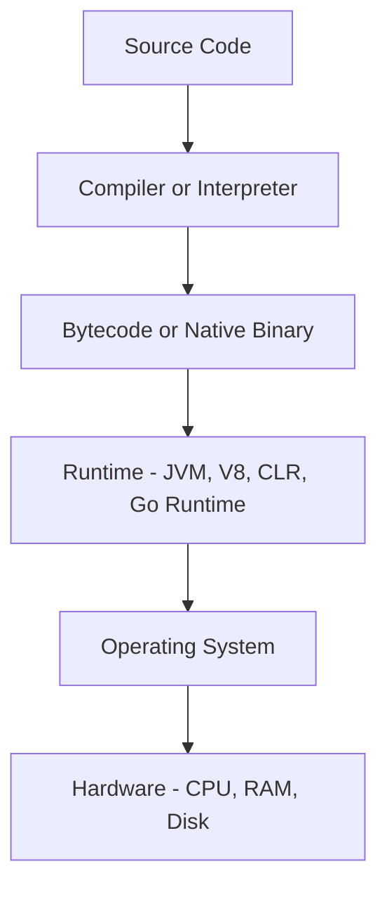
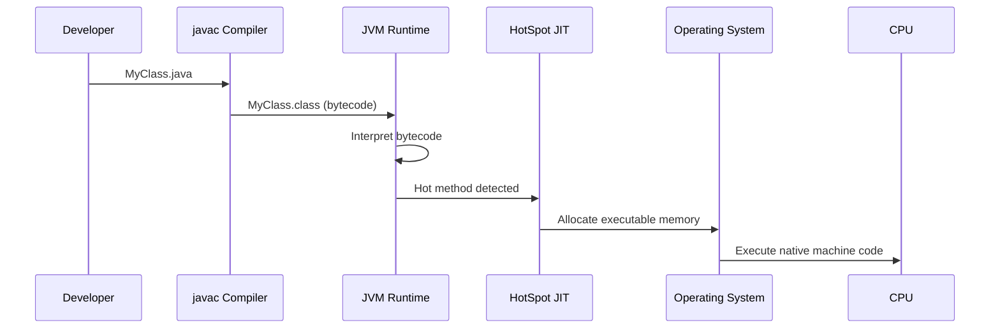

⚡ TL;DR - Every program runs through a stack: source code,
compiler/interpreter, runtime, OS kernel, and hardware -
understanding the stack tells you where failures live.

| #003 | Category: CS Fundamentals - Paradigms | Difficulty: ★☆☆ |
|:---|:---|:---|
| **Depends on:** | CSF-001 (CS Map), CSF-002 (Paradigms) | |
| **Used by:** | CSF-004 (Code to Execution), CSF-010 (Stack vs Heap) | |
| **Related:** | CSF-020 (Compiled vs Interpreted), JVM-001, OSY-001 | |

---

### 🔥 The Problem This Solves

**WORLD WITHOUT IT:**

A developer writes Python code that calls a database. The
service crashes with `SegmentationFault`. Without knowing
the ecosystem stack, they have no framework for where to
look: is it in the Python code? The Python runtime? The
OS? The database driver (C extension)? They guess randomly.

**THE BREAKING POINT:**

As soon as you use any technology beyond "hello world",
you are implicitly depending on a stack of 5-8 layers:
your source code, a compiler or interpreter, a runtime
with garbage collector or memory model, OS system calls,
kernel drivers, and hardware. Most bugs that are hard
to diagnose live at a layer boundary, not within a single
layer. Without the map, you cannot even ask the right
diagnostic question.

**THE INVENTION MOMENT:**

The layered model of systems software emerged from the
necessity of managing hardware diversity. IBM's OS/360
(1964) separated the OS from hardware. C (1972) created
a portable systems language that compiled to different
hardware. The JVM (1995) created a portable runtime
layer above the OS. Docker (2013) added a layer above
the OS for process isolation. Each addition to the stack
was an answer to a concrete problem in the layer below.

**EVOLUTION:**

1950s: Machine code only (one layer). 1960s: Assembly +
OS separation. 1970s: C + portable compilation. 1980s:
Interpreted languages (Shell, AWK, Lisp). 1990s: Managed
runtimes (JVM, CLR) adding GC and safety. 2000s: Bytecode
interpretation + JIT optimization. 2010s: WebAssembly
extends the stack to browsers. 2020s: Container runtimes
and serverless add isolation layers above the OS.

---

### 📘 Textbook Definition

The CS ecosystem consists of the complete vertical stack
through which source code becomes executing computation:
programming languages (the human-readable instruction set),
compilers and interpreters (translators from source to
executable form), runtimes (execution environments providing
memory management, type safety, and platform abstraction),
operating systems (resource managers between software and
hardware), and hardware (the physical execution substrate).
Each layer provides services to the layer above and
depends on services from the layer below. Failures at
layer boundaries produce the hardest-to-diagnose bugs.

---

### ⏱️ Understand It in 30 Seconds

**One line:**
Source code runs through a vertical stack - language,
compiler/interpreter, runtime, OS, hardware - and bugs
often live at the boundaries between layers.

**One analogy:**

> The ecosystem stack is like a postal system. You write
> a letter (source code). The postal service translates
> the address format (compiler/interpreter). A sorting
> center routes it (runtime/OS scheduler). A truck
> carries it on physical roads (hardware). If the letter
> gets lost, you need to know which layer failed - wrote
> the wrong address? sorting center error? truck breakdown?
> Without knowing the layers exist, you cannot investigate
> beyond "my letter was lost."

**One insight:**

The single most important debugging skill in software
engineering is knowing which layer of the stack a symptom
lives in. A NullPointerException is a language/runtime
layer event. An OutOfMemoryError is a runtime layer event.
A connection reset is an OS/network layer event. A CPU
spike is potentially any layer. The stack map is your
first diagnostic filter.

---

### 🔩 First Principles Explanation

**THE COMPLETE STACK:**

```
┌─────────────────────────────────────────┐
│          CS Ecosystem Stack             │
├─────────────────────────────────────────┤
│ Source Code                             │
│  Java, Python, Go, Rust, JavaScript     │
│           |                             │
│ Compiler / Interpreter / Transpiler     │
│  javac, CPython, gc, rustc, tsc         │
│           |                             │
│ Bytecode / Native Binary                │
│  .class files, .pyc, ELF binary         │
│           |                             │
│ Runtime                                 │
│  JVM, CPython runtime, Go runtime,      │
│  V8, .NET CLR                           │
│           |                             │
│ Operating System                        │
│  Linux, macOS, Windows                  │
│  (system calls, process model)          │
│           |                             │
│ Hardware                                │
│  CPU, RAM, disk, network card           │
└─────────────────────────────────────────┘
```



**WHAT EACH LAYER PROVIDES:**

- **Language layer:** Human-readable syntax, type system,
  abstractions (classes, functions, generics)
- **Compiler/Interpreter:** Translates source to machine-
  executable form. Compilers (ahead-of-time): javac, gcc.
  Interpreters: CPython executes bytecode. JIT compilers
  (both): JVM HotSpot, V8
- **Runtime:** Memory management (GC or manual), thread
  model, I/O abstractions, exception handling, standard
  library. The runtime is why your Java program does not
  need to know about Linux vs Windows memory allocation.
- **OS:** Process isolation, file system, networking,
  hardware scheduling, virtual memory. Provides POSIX/
  Win32 system call interface to runtimes.
- **Hardware:** Physical execution. Cache hierarchy,
  branch prediction, SIMD instructions - invisible most
  of the time and critical during performance optimization.

**THE TRADE-OFFS:**

**Gain from adding runtime layers:** Portability, safety,
and managed memory. Java runs on any JVM. Python avoids
manual memory errors. The runtime abstracts OS differences.

**Cost of additional runtime layers:** Performance
overhead (GC pauses, JIT warmup, interpretation overhead),
operational complexity (JVM tuning, heap sizing), and
debugging complexity (stack traces cross multiple layers).

**ESSENTIAL vs ACCIDENTAL COMPLEXITY:**

**Essential:** Every program must execute on hardware.
Some abstraction from hardware is genuinely necessary
for portability and developer productivity.

**Accidental:** Excessive layering creates problems:
a Docker container running a JVM inside a VM inside
a hypervisor adds four layers of memory management
that can interact in unpredictable ways under memory
pressure. The complexity of the interactions exceeds
the value of the abstraction in many cases.

---

### 🧪 Thought Experiment

**SETUP:**

Your Java service crashes with `java.lang.OutOfMemoryError:
GC overhead limit exceeded`. Where in the stack is the
problem, and at which layer should you investigate?

**WRONG APPROACH (without the map):**

"The service is broken. Restart it. Add more servers."
You fix the symptom without understanding the cause.
The crash recurs in two hours.

**CORRECT APPROACH (with the stack map):**

1. `OutOfMemoryError` is a JVM (runtime layer) event.
   The JVM ran out of heap space.
2. Root cause is at one of two layers:
   - **Application layer:** Program creates objects
     faster than GC can collect them (memory leak)
   - **Runtime configuration layer:** JVM heap is
     sized too small for the workload
3. Diagnosis: take a heap dump (`jmap -dump`),
   analyze with Eclipse MAT or VisualVM. Find the
   largest object graph. That reveals which layer
   owns the problem.
4. If heap is dominated by cached data: application
   layer problem (unbounded cache).
5. If heap is sized at 256MB for a 2GB workload:
   runtime configuration problem.

**THE LESSON:**

The symptom (`OutOfMemoryError`) names the layer
(JVM runtime). The layer tells you the diagnostic
tool (`jmap`, heap analyzer). Without the stack
map, you treat all errors as "something is broken"
rather than "layer X failed for reason Y."

---

### 🎯 Mental Model / Analogy

**THE BUILDING FLOORS ANALOGY:**

A skyscraper has floors: ground floor (hardware),
structural systems (OS), services floor (runtime),
office floors (application). A water leak on floor 20
might show up on floor 15 below it. You need to know
the building's plumbing layout (the stack) to trace
from symptom to source. An engineer who knows the
stack walks directly to the correct floor. One who
does not checks every floor randomly.

**MEMORY HOOK:**

"SBERT" - Source, Bytecode, Execution (runtime), Resources
(OS), Transistors (hardware). Bottom to top: transistors
run resources, resources run execution environments,
execution environments run bytecode, bytecode came from
source. Failures travel upward and downward through layers.

---

### 📊 Gradual Depth - Five Levels

**Level 1 - Child:**
Your code is like a recipe. The computer needs to
translate it into steps it can follow, then follow
those steps using its parts (memory, processor). The
layers are just the steps of that translation.

**Level 2 - Student:**
Source code is compiled or interpreted to run. A compiler
(like javac) translates code once to bytecode. An
interpreter (like Python) runs code line by line.
The OS gives your program access to memory and files.
Hardware does the actual calculation.

**Level 3 - Professional:**
The runtime layer is critical for most production
problems. JVM: manages heap (GC), threads, standard
library. CPython: GIL limits parallelism; C extensions
bypass it. Go runtime: built-in goroutine scheduler.
Node.js/V8: single-threaded event loop - blocking one
thread blocks all requests. Each runtime choice
determines your concurrency model and performance ceiling.

**Level 4 - Senior Engineer:**
JIT compilation crosses the interpreter/compiler boundary.
JVM HotSpot profiles running code (runtime layer),
compiles hot paths to native code (compiler layer), and
deoptimizes if assumptions break (back to interpretation).
This makes JVM performance non-deterministic for the first
few minutes (warmup). For services with p99 latency SLOs,
JVM warmup is a production problem solved by GraalVM
native image or careful traffic routing during deployments.

**Level 5 - Expert:**
Hardware-software co-design is where boundaries blur.
Java's Project Loom implements a user-space scheduler
in the JVM bypassing OS thread scheduling for I/O-bound
work. DPDK bypasses the OS network stack entirely for
high-throughput networking. Intel SGX creates trusted
execution enclaves the OS cannot inspect. At each case,
a layer was bypassed because the abstraction's cost
exceeded its value for that workload.

*Expert Cues - Level 5:*
The "reflection" feature in Java and Python provides
runtime access to the language/type system from within
the runtime layer. This is a deliberate poke through
the stack. This is why reflection breaks with GraalVM
native image - the language layer metadata is no longer
present at runtime in the ahead-of-time compiled binary.

---

### ⚙️ How It Works (Formal Basis)

**THE FORMAL MODEL:**

Each layer exposes an abstract interface to the layer
above and implements it using the layer below. This is
the principle of abstraction layering from Dijkstra's
"The Structure of the THE-Multiprogramming System" (1968).

The key property: layer N must not assume anything about
the internal implementation of layer N-1. Java code must
not assume it runs on Linux. The JVM must not assume it
runs on x86. Violations create portability bugs - code
that works on one machine and fails on another.

**JVM AS A CONCRETE EXAMPLE:**

```
┌─────────────────────────────────────────┐
│         JVM Internal Stack              │
├─────────────────────────────────────────┤
│ Java Source (.java)                     │
│      | javac                            │
│ Java Bytecode (.class)                  │
│      | ClassLoader                      │
│ JVM Interpreted Execution               │
│      | HotSpot profiler (JIT trigger)   │
│ JIT-Compiled Native Code                │
│      |                                  │
│ OS System Calls (mmap, mprotect)        │
│      |                                  │
│ CPU Instruction Execution               │
└─────────────────────────────────────────┘
```



---

### 🔄 System Design Implications

**RUNTIME CHOICE IS ARCHITECTURE:**

Choosing a runtime determines your operational model:

- **JVM:** Long startup (2-10s), mature GC, excellent
  throughput at steady state. Good for long-running
  services; bad for serverless/FaaS where cold start
  dominates.
- **Go runtime:** Fast startup (ms), simple GC (low
  latency), goroutine model for concurrency. Good for
  network services, CLI tools, containerized workloads.
- **Node.js/V8:** Non-blocking I/O by default, single
  thread. Good for I/O-bound APIs; bad for CPU-bound
  computation (blocks the event loop).
- **Native binary (Rust, C, C++):** No runtime overhead,
  predictable latency. Good for systems programming;
  bad for rapid application development.

**WHAT CHANGES AT SCALE:**

At 10x load: OS thread scheduling becomes a bottleneck
for Java thread-per-request models. At 100x: Runtime GC
pauses become visible in latency percentiles - JVM GC
tuning becomes a full-time concern. At 1000x: The
abstraction layers themselves become bottlenecks; teams
bypass runtimes for critical paths (DPDK, eBPF, kernel
bypass networking).

---

### 💻 Code Example

**Example 1 - Wrong vs Right: Layer-Crossing Assumption**

```java
// BAD: Assumes UNIX path separator (OS layer assumption)
// Breaks on Windows when deployed to Windows containers
String configPath = "/etc/app/config.properties";
File config = new File(configPath);

// GOOD: Use runtime abstraction (File.separator)
// Works on any OS - correct layer for portability
String configPath = System.getProperty("user.home")
    + File.separator + "app"
    + File.separator + "config.properties";

// BETTER: Use classpath resources (runtime layer only)
// No OS layer dependency at all:
InputStream is = MyClass.class
    .getResourceAsStream("/config.properties");
```

**Example 2 - Failure: Runtime Layer Diagnosis**

```java
// SYMPTOM: Service crashes with OutOfMemoryError
// LAYER: JVM runtime layer
// DIAGNOSTIC COMMANDS:

// 1. Identify live heap contents (JVM layer tool):
// jmap -dump:live,format=b,file=heap.hprof <pid>

// 2. If top object is HashMap with 10M entries:
//    APPLICATION layer bug - unbounded cache
// Fix: use Caffeine cache with size limit:
Cache<String, User> cache = Caffeine.newBuilder()
    .maximumSize(10_000)  // bounded - prevents OOM
    .expireAfterWrite(Duration.ofMinutes(10))
    .build();

// 3. If heap shows normal objects but GC thrashes:
//    JVM CONFIGURATION layer problem - heap too small
// Fix: -Xmx4g (set max heap appropriate to workload)

// 4. Verify after fix:
// jstat -gc <pid> 1000  (GC stats every 1 second)
// GCT (total GC time) should be < 5% of elapsed time
```

---

### ⚖️ Comparison Table

| Runtime | Startup | GC | Concurrency | Best For |
|---|---|---|---|---|
| JVM (Java/Kotlin) | 2-10s | Multiple GC algorithms, tunable | OS threads + virtual threads (Loom) | Long-running services, enterprise |
| Node.js (V8) | <1s | Mark-and-sweep (automatic) | Single-threaded event loop | I/O-bound APIs, real-time |
| Go runtime | <100ms | Tri-color concurrent | Goroutines (user-space) | Network services, CLI, containers |
| CPython | <500ms | Reference counting + GC | GIL limits parallelism | Scripting, data science, ML |
| .NET CLR | 1-3s | Multiple GC modes | OS threads + async/await | Windows enterprise, cross-platform |
| Native (Rust/C) | <10ms | None (manual or RAII) | OS threads (no overhead) | Systems, embedded, perf-critical |

---

### ⚠️ Common Misconceptions

| Misconception | Reality |
|---|---|
| The language IS the runtime | Java (language) and JVM (runtime) are separate. Kotlin, Scala, Clojure run on the JVM. Language and runtime are independent layers. |
| Interpreted languages are always slower | V8 JIT-compiles hot paths to native code and often outperforms naive C. The interpreter/compiler boundary is not a fixed performance wall. |
| Docker runs code in a VM | Docker containers share the host OS kernel - they are OS-layer isolation, not VM-layer isolation. VMs provide hardware-layer isolation with a separate kernel. |
| The OS is the foundation | Hardware is the bottom of the stack. Hypervisors and HSMs sit between hardware and OS in modern cloud environments. |
| GC eliminates all memory problems | GC eliminates use-after-free errors. It does not eliminate memory leaks - objects still referenced but logically unused are kept alive indefinitely. |

---

### 🚨 Failure Modes & Diagnosis

**Failure Mode 1: GC Pressure (Runtime Layer)**

**Symptom:** Latency spikes every 30-60 seconds.
`p99` latency is 10x `p50`. GC log shows Full GC events.

**Root Cause:** JVM runtime layer: heap nearly full,
triggering stop-the-world full GC. Service pauses for
1-5 seconds while GC runs.

**Diagnostic Signal:**
```bash
# Enable GC logging (JVM startup flag):
# -Xlog:gc*:file=gc.log:time,uptime:filecount=5

# Check GC overhead:
jstat -gcutil <pid> 1000
# Column GCT/ET > 5% = GC pressure
```

**Fix:** Switch to G1GC or ZGC (concurrent GC).
Or find and fix the memory leak causing heap exhaustion.

---

**Failure Mode 2: Thread Exhaustion (OS + Runtime)**

**Symptom:** Service stops responding to new requests
after sustained high load. Thread pool exhausted in logs.

**Root Cause:** OS thread count limit reached. Java thread-
per-request model: each request holds one OS thread;
blocking I/O keeps threads occupied; pool exhausts.

**Diagnostic Signal:**
```bash
# Count JVM threads:
jstack <pid> | grep "Thread.State" | wc -l

# Check thread states:
jstack <pid> | grep -A1 "Thread.State"
# Many WAITING threads = blocked on I/O
```

**Fix:** Use non-blocking I/O (Spring WebFlux, reactive
drivers) or Java virtual threads (Project Loom).

---

**Security Failure: JVM Deserialization (Runtime Layer)**

**Symptom:** Attacker sends crafted byte stream;
Java executes arbitrary code during deserialization.
This bypasses application-layer input validation.

**Root Cause:** Runtime layer security failure.
`ObjectInputStream` executes code during deserialization
before your application code can validate input.

**Fix:** Use `ObjectInputFilter` to whitelist allowed
classes. Never deserialize untrusted data with Java
serialization. Prefer JSON/Protobuf over Java serialization.

---

### 🔗 Related Keywords

**Prerequisites (understand these first):**
- `What Is Computer Science - A Map` (CSF-001) - the
  seven branches contextualize where the ecosystem
  stack fits in the broader discipline
- `Why Programming Paradigms Exist` (CSF-002) - paradigms
  determine which runtime model makes sense

**Builds On This (learn these next):**
- `How Code Becomes Execution` (CSF-004) - traces the
  exact path from source to running binary
- `Compiled vs Interpreted` (CSF-020) - deep dives
  the compiler/interpreter layer boundary
- `Stack vs Heap Memory` (CSF-010) - dives into the
  runtime memory model specifically

**Alternatives / Comparisons:**
- `JVM Internals` (JVM-001) - full detail on the JVM
  runtime layer
- `Operating Systems` (OSY-001) - full detail on the
  OS layer

---

### 📌 Quick Reference Card

```
┌────────────────────────────────────────────────────────┐
│ THE STACK    │ Source - Compiler - Bytecode -           │
│ (top-down)   │ Runtime - OS - Hardware                 │
├──────────────┼─────────────────────────────────────────┤
│ KEY INSIGHT  │ Bugs at layer boundaries are hardest;   │
│              │ identify the layer to find the tool     │
├──────────────┼─────────────────────────────────────────┤
│ OOM ERROR    │ Runtime layer (JVM heap); tool: jmap    │
├──────────────┼─────────────────────────────────────────┤
│ CONN RESET   │ OS/network layer; tool: tcpdump, ss     │
├──────────────┼─────────────────────────────────────────┤
│ CPU SPIKE    │ Could be any layer; start with profiler  │
├──────────────┼─────────────────────────────────────────┤
│ NPE          │ Application/language layer; stack trace  │
├──────────────┼─────────────────────────────────────────┤
│ TRADE-OFF    │ More layers = portability + safety but  │
│              │ more overhead + debugging complexity    │
├──────────────┼─────────────────────────────────────────┤
│ ONE-LINER    │ "Know your stack - the layer that breaks │
│              │ tells you which tool to use"            │
├──────────────┼─────────────────────────────────────────┤
│ NEXT EXPLORE │ CSF-004 (Code to Execution), JVM-001    │
└────────────────────────────────────────────────────────┘
```

**If you remember only 3 things:**

1. Every program runs through a 5-layer stack: source,
   compiler, runtime, OS, hardware. Each layer provides
   services to the one above.
2. Bugs at layer boundaries are hardest to diagnose.
   The error message names the layer; that determines
   the diagnostic tool.
3. Runtime choice is architecture: JVM, Go runtime,
   Node.js, and native each have different startup,
   GC, and concurrency models that affect system design.

**Interview one-liner:**
"The CS ecosystem is a 5-layer stack: source code,
compiler/interpreter, runtime, OS, hardware. Each layer
abstracts the one below. Production failures often live
at boundaries - an OOM names the runtime layer and
points to jmap; a connection reset names the OS layer
and points to tcpdump. Knowing the stack determines
which diagnostic tool applies."

---

### 💎 Transferable Wisdom

**Reusable Engineering Principle:**
Abstraction layers reduce complexity for the layer above
by hiding the layer below. Each boundary is a one-way
mirror: the upper layer sees an API; the lower layer
sees an implementation. Violations of this principle
create fragile, non-portable code that breaks when
any lower layer changes.

**Where else this pattern appears:**

- **Network OSI model** - seven layers from physical
  to application; each handles its concerns independently.
  TCP/IP is possible because layers do not know each
  other's implementation.
- **Cloud architecture** - IaaS (hardware + OS),
  PaaS (runtime + middleware), SaaS (application)
  is the CS ecosystem stack applied to cloud service models
- **HTTP request flow** - browser (application), TLS
  (security), TCP (transport), IP (network), Ethernet
  (physical) - five layers each hiding the one below

**Industry applications:**

- **SRE incident response** - runbooks organized by
  stack layer: application errors first, then runtime,
  then OS, then infrastructure
- **Performance engineering** - profiling tools are
  layer-specific: JProfiler for JVM layer, perf/eBPF
  for OS layer, VTune for CPU layer
- **Security defense-in-depth** - input validation
  (language), memory safety (runtime), OS sandboxing,
  network firewall, hardware security modules

---

### 💡 The Surprising Truth

The Java Virtual Machine - invented to solve "write once,
run anywhere" - is now one of the most thoroughly optimized
execution environments ever built. The JVM's HotSpot JIT
uses speculative deoptimization: it assumes optimistic
invariants (e.g., "this method has only one implementation")
and compiles fast native code based on them - then
deoptimizes back to bytecode interpretation if the
assumption breaks at runtime. This means JVM-compiled code
can be FASTER than equivalent ahead-of-time compiled C++
code for certain workloads, because the JVM has runtime
information that the C++ compiler did not have at compile
time. The "interpreted = slow" assumption was false for
JVM workloads after about 2005.

---

### ✅ Mastery Checklist

**You've mastered this when you can:**

1. **[EXPLAIN]** Given any JVM exception type
   (OutOfMemoryError, StackOverflowError,
   ClassNotFoundException, NullPointerException),
   identify which layer it originates from and which
   diagnostic tool addresses it.

2. **[DEBUG]** When a Java service has high latency
   spikes at regular intervals, use `jstat -gcutil` to
   confirm GC as the cause, read the GC log to identify
   GC type and pause duration, and propose a specific
   GC configuration change.

3. **[DECIDE]** For a new service requiring sub-10ms
   p99 latency and 10,000 concurrent connections,
   evaluate JVM thread-per-request vs Go goroutine
   model vs Node.js event loop, citing the runtime
   layer characteristics that determine the choice.

4. **[BUILD]** Write a Java class that correctly handles
   classpath resources (runtime layer) vs file system
   paths (OS layer) for configuration loading, with
   reasoning about what breaks in each approach under
   containerization.

5. **[EXTEND]** Explain why Docker containers have
   faster startup than VMs by pointing to the specific
   OS layer components each does and does not include.

---

### 🧠 Think About This Before We Continue

**Q1.** Your Java service is containerized in Docker on
Kubernetes. Under memory pressure, the container is
OOM-killed by Kubernetes, but JVM heap stats show only
40% utilization. How is this possible? Which layers are
involved and what are the two memory limits at play?

*Hint: What does "memory" mean at the JVM runtime layer
vs the container/OS layer? The JVM has its own heap, but
what else uses memory in a JVM process? What does the
container memory limit measure?*

**Q2.** A Python service is CPU-bound at 100% on a single
core even though the server has 32 cores. Adding more
threads does not improve throughput. Which layer causes
this and what is the architectural fix?

*Hint: CPython's GIL is a runtime layer constraint.
What does it prevent? What alternatives at the OS layer
(multiple processes), runtime layer (async), or language
layer (C extension) bypass it?*

**Q3.** GraalVM native image compiles Java to a native
binary with no JVM at runtime. What capabilities does
this gain and lose? Name two Java features that break
in GraalVM native image and explain which layer boundary
they cross.

*Hint: Reflection, dynamic class loading, and serialization
require runtime layer access to language layer metadata.
When the runtime layer is removed, which still work and
which require closed-world assumptions?*

---

### 🎯 Interview Deep-Dive

**Q1: Your Java service uses three times as much memory
in production as in load tests. What do you investigate
and at which layer?**

*Why they ask:* Tests runtime layer memory model
understanding beyond just heap.

*Strong answer includes:*
- JVM memory is more than heap: heap + metaspace +
  direct buffers + code cache + stack per thread
- Metaspace growth: dynamic class loading (Spring,
  CGLIB proxies). Monitor: `jstat -gcmetacapacity`
- Direct buffers: NIO libraries (Netty, JDBC) use
  off-heap memory not visible in heap dumps.
  Monitor: `BufferPoolMXBean`
- Native memory tracking: `-XX:NativeMemoryTracking=
  detail` then `jcmd <pid> VM.native_memory`

**Q2: Why does a Go microservice start in 50ms but
a Spring Boot service takes 8 seconds? Can the Spring
Boot service start faster?**

*Why they ask:* Tests runtime layer knowledge and
practical startup optimization.

*Strong answer includes:*
- Go runtime: minimal startup - goroutine scheduler
  init, small standard library, no JIT warmup
- Spring Boot: JVM startup, classpath scanning,
  application context creation, bean initialization,
  CGLIB proxy generation, JPA metamodel initialization
- GraalVM native image: 50-100ms startup, no JVM,
  with trade-off: no runtime reflection, slower
  throughput warmup
- Spring Boot 3+ with AOT moves classpath scanning
  to build time, reducing startup to 1-2 seconds

**Q3: A production incident report says "the service
crashed due to StackOverflowError." Which layer caused
this, what code pattern triggered it, and how do you
fix it without increasing stack size?**

*Why they ask:* Tests runtime layer understanding
combined with code diagnosis.

*Strong answer includes:*
- Layer: JVM runtime layer - each thread has a finite
  stack (default 256-512KB) for stack frames
- Code pattern: unbounded recursion - method calls
  itself without a guaranteed base case
- Wrong fix: `-Xss8m` (increase stack) - treats
  symptom; unbounded recursion exhausts any finite stack
- Right fix: convert recursion to iteration using
  an explicit stack data structure on the heap
- Production example: deep JSON parsing with recursive
  descent - convert to iterative using `Deque<JsonNode>`