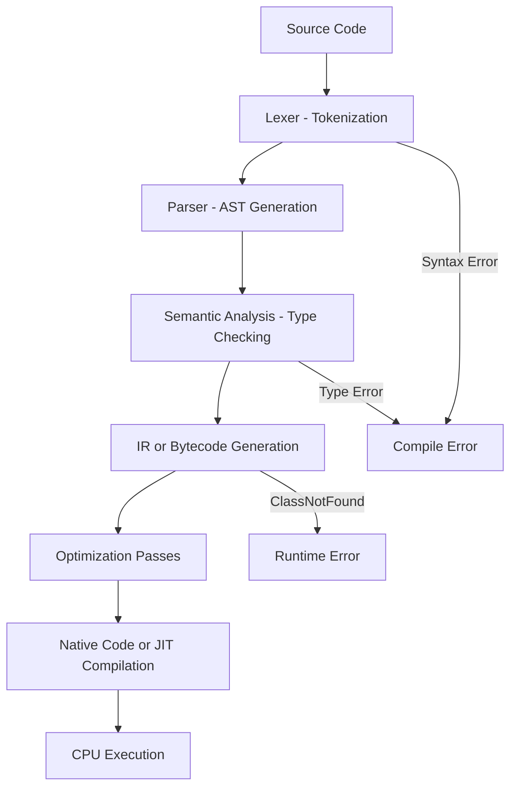
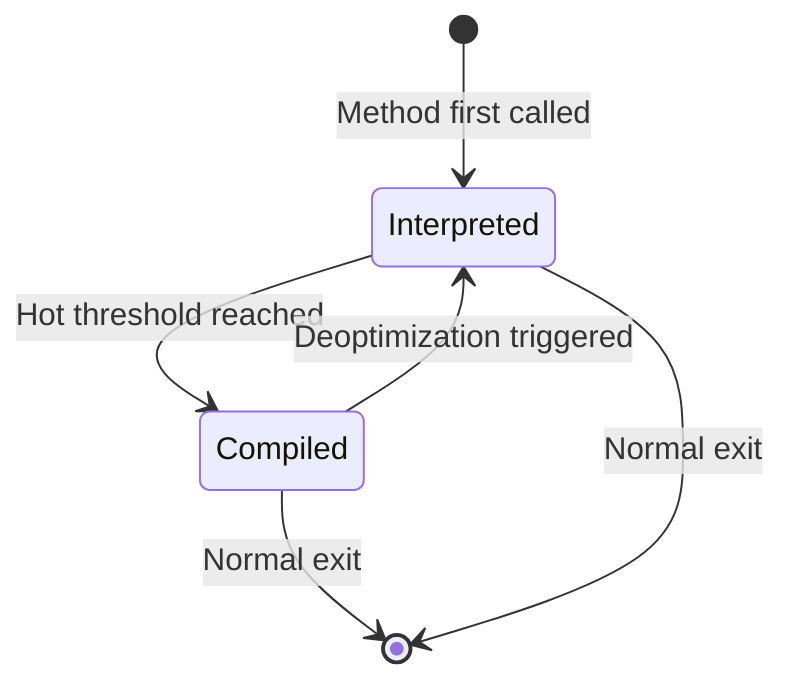

⚡ TL;DR - Source code passes through lexing, parsing,
semantic analysis, code generation, linking, loading, and
execution - knowing each phase tells you exactly where
build and runtime errors originate.

| #004 | Category: CS Fundamentals - Paradigms | Difficulty: ★☆☆ |
|:---|:---|:---|
| **Depends on:** | CSF-003 (CS Ecosystem Stack) | |
| **Used by:** | CSF-020 (Compiled vs Interpreted), JVM-001 | |
| **Related:** | CSF-010 (Stack vs Heap), OSY-001 (OS) | |

---

### 🔥 The Problem This Solves

**WORLD WITHOUT IT:**

A developer gets a `ClassNotFoundException` at runtime
for a class that clearly exists in the codebase. Without
understanding how code becomes execution, they have no
model for why a class that compiled successfully fails
to load at runtime. They try random fixes: rebuild,
restart, reinstall. Most of the time they get lucky.

**THE BREAKING POINT:**

Every build error, every linkage error, every runtime
class loading failure, every JIT deoptimization is a
symptom of a specific phase in the source-to-execution
pipeline failing. Without knowing the phases, you cannot
read error messages accurately, cannot predict where
failures will appear, and cannot design systems that
avoid them.

**THE INVENTION MOMENT:**

Compiler construction as a formal discipline was
established by Grace Hopper's A-0 compiler (1952) and
systematized by John Backus's FORTRAN compiler (1957).
The structured pipeline - lex, parse, optimize, generate
- was refined through the 1960s and remains the
architecture of every modern compiler.

**EVOLUTION:**

1950s: Assemblers (direct assembly-to-binary).
1957: First optimizing compiler (FORTRAN).
1970s: Structured compilers with formal grammars (LALR).
1995: JVM bytecode and class loading introduce a
separation between compilation and execution.
2000s: JIT compilation merges compile-time and runtime.
2015+: GraalVM makes the compiler itself a service
available at runtime (polyglot compilation-as-API).

---

### 📘 Textbook Definition

The source-to-execution pipeline transforms human-readable
source code into running machine instructions through seven
distinct phases: lexical analysis (tokenization), syntactic
analysis (parsing to AST), semantic analysis (type checking,
scope resolution), intermediate representation generation
(IR/bytecode), optimization, native code generation or
JIT compilation, and execution by the CPU. Each phase has
a distinct input, output, and failure mode. Errors in phases
1-4 produce compile-time errors; errors in phases 5-7
produce runtime errors. Understanding phase boundaries
is essential for diagnosing both types.

---

### ⏱️ Understand It in 30 Seconds

**One line:**
Source code goes through six distinct transformations
before any instruction runs - each transformation can
fail in its own specific way.

**One analogy:**

> Building software is like translating a book from
> English to Chinese for a specific printing machine.
> First you read the words (lex). Then you parse the
> grammar (parse). Then you check meaning (semantic
> analysis). Then you translate to an intermediate
> format (IR). Then you optimize for Chinese readers
> (optimize). Then you send to the printing machine
> (code gen). A "translation error" at step 2 (grammar)
> looks completely different from a "printing error"
> at step 6. Knowing which step failed changes
> everything about how you fix it.

**One insight:**

The single most valuable thing about knowing the pipeline
is reading error messages correctly. "Cannot find symbol"
is a semantic analysis error (the compiler resolved scope
but found no declaration). "ClassNotFoundException" is a
class loading error (compilation succeeded; the class
file was not on the runtime classpath). These are
different phases, different causes, different fixes.

---

### 🔩 First Principles Explanation

**THE COMPLETE PIPELINE:**

```
┌─────────────────────────────────────────┐
│     Source to Execution Pipeline        │
├─────────────────────────────────────────┤
│                                         │
│  Source Code                            │
│  "int x = a + b;"                       │
│           |                             │
│  [1] LEXER (Tokenizer)                  │
│  Tokens: INT, ID(x), EQ, ID(a), PLUS,  │
│          ID(b), SEMI                    │
│           |                             │
│  [2] PARSER                             │
│  AST: AssignNode(x, BinaryOp(+, a, b)) │
│           |                             │
│  [3] SEMANTIC ANALYSIS                  │
│  Check: x, a, b declared?              │
│  Check: types compatible?              │
│           |                             │
│  [4] IR / BYTECODE GENERATION           │
│  JVM: iload a, iload b, iadd, istore x │
│           |                             │
│  [5] OPTIMIZATION                       │
│  Constant folding, dead code elim.,    │
│  inlining                              │
│           |                             │
│  [6] NATIVE CODE / JIT                  │
│  x86: mov eax,[a]; add eax,[b];        │
│           |                             │
│  [7] CPU EXECUTION                      │
│  Fetch, decode, execute, writeback     │
└─────────────────────────────────────────┘
```



**JAVA-SPECIFIC PIPELINE:**

In Java, the pipeline has a clean split between compile
time and runtime. `javac` handles phases 1-4, producing
`.class` files. The JVM handles phases 5-7:
classloader (loads `.class` from classpath), bytecode
verifier (safety checks), interpreter (initial execution),
JIT (hot method compilation), and CPU execution.

**THE TRADE-OFFS:**

**Gain from separating compilation from execution:**
Portability. Java `.class` files run on any JVM. The
same compiled artifact runs on Linux, Windows, and
macOS. The compile phase is paid once; the runtime
phase runs anywhere.

**Cost of separating compilation from execution:**
Runtime errors for things that could have been caught
at compile time. Dynamic class loading means classpath
problems appear at runtime, not build time. This is
why static analysis tools (SpotBugs, error-prone)
try to push runtime failures earlier in the pipeline.

**ESSENTIAL vs ACCIDENTAL COMPLEXITY:**

**Essential:** Some pipeline phases are genuinely
necessary. Lexing and parsing are unavoidable (machines
do not read text natively). Type checking prevents
a whole class of runtime errors.

**Accidental:** Build systems add accidental complexity:
multiple classpaths (compile, test, runtime), module
systems (JPMS), annotation processors that run at
phase 3-4 and generate code for phases 1-4 of the
next pass. Maven's build lifecycle has 23 phases.

---

### 🧪 Thought Experiment

**SETUP:**

You run `mvn compile` - no errors. You run `mvn test` -
`ClassNotFoundException: com.example.OrderRepository`.
The class exists in your codebase. Why?

**WITHOUT PIPELINE KNOWLEDGE:**

"The build is broken. Clean and rebuild. Maybe reinstall
Maven." Three wasted hours.

**WITH PIPELINE KNOWLEDGE:**

1. `ClassNotFoundException` is a phase [classloader]
   error - after compilation, during runtime class
   loading. The class compiled fine. It is missing
   from the runtime classpath.
2. Root cause candidates:
   - The class is in `scope: provided` in pom.xml
     (present at compile time, not at test runtime)
   - The class is in a module that is not on the
     module-path at runtime
   - The class is loaded by a different ClassLoader
     than the one performing the lookup
3. Check: `mvn dependency:build-classpath` - is
   the JAR containing that class present?
4. Fix: ensure runtime scope dependency is correct.

**THE LESSON:**

Pipeline phase knowledge converts "the build is broken"
into a precise 3-step diagnosis. The phase name is
embedded in the error type.

---

### 🎯 Mental Model / Analogy

**THE MANUSCRIPT PRODUCTION ANALOGY:**

A book production pipeline: author writes draft
(source code) -> editor checks grammar (lexer/parser)
-> fact-checker checks meaning (semantic analysis) ->
typesetter creates layout (IR) -> printer prints
(code generation) -> reader reads (CPU execution).

A grammar error stops the editor. A factual error
stops the fact-checker. A printing error stops the
printer. The reader never sees grammar errors (compile-
time errors never reach runtime). But a fact that was
wrong when the book was printed is wrong when the reader
reads it (runtime bugs are phase-5+ errors).

**MEMORY HOOK:**

"LP-SA-IR-OPT-CG-EX" - Lex, Parse, Semantic Analysis,
Intermediate Representation, Optimize, Code Gen, Execute.
Or: "Lawyers Protect Smart Investors Or Companies Explode."
Each initial maps to a pipeline phase.

---

### 📊 Gradual Depth - Five Levels

**Level 1 - Child:**
Writing code is like writing a recipe. Before the
computer can follow it, it has to read the words,
understand the grammar, check that the ingredients
exist, and then actually cook. Each step can fail
in its own way.

**Level 2 - Student:**
Source code is first tokenized (words identified),
then parsed (grammar checked and tree built), then
type-checked (variables and types verified), then
converted to bytecode or machine code, then executed.
Compile errors happen in phases 1-3. Runtime errors
happen in phases 4+.

**Level 3 - Professional:**
The Java pipeline splits at the class file boundary:
`javac` produces class files (phases 1-4); the JVM
loads and executes them (phases 5+). `ClassNotFoundException`
is a classloader (phase 5) failure. `NoClassDefFoundError`
means the class was present at compile time but absent
at runtime. `VerifyError` means the bytecode failed
JVM safety verification (phase 5 checks). Each error
type tells you exactly which pipeline phase failed.

**Level 4 - Senior Engineer:**
JIT compilation (phase 6) is not a one-time event -
it is a continuous process. JVM HotSpot profiles
method call counts and backedge counts. A method
called more than ~10,000 times is JIT-compiled.
If the JIT's speculative assumptions break (e.g.,
a class previously always `ArrayList` is now a
`LinkedList`), the JIT deoptimizes back to
interpretation. This deoptimization cascade under
polymorphic call sites is a performance failure mode
invisible without JIT knowledge.

**Level 5 - Expert:**
Link-time optimization (LTO) in C++/Rust and GraalVM's
Graal compiler allow optimization across compilation
units. The JVM's escape analysis (phase 5 optimization)
determines if an object allocated on the heap can be
stack-allocated or scalar-replaced - eliminating GC
pressure for short-lived objects. Profile-guided
optimization (PGO) feeds runtime profiling data back
into compile-time optimization decisions. At the
expert level, the distinction between "compile time"
and "runtime" becomes a continuum, not a boundary.

*Expert Cues - Level 5:*
Annotation processors (javac APT) execute arbitrary
Java code during phase 3 (semantic analysis) of the
compiler pipeline. Lombok, MapStruct, and Dagger all
generate code this way. This is why annotation
processors can introduce build errors that look like
semantic errors but are actually generated code
interacting with your code. Debugging annotation
processor errors requires understanding which pass
runs when - and that the generated source is not
in your source tree.

---

### ⚙️ How It Works (Formal Basis)

**LEXICAL ANALYSIS (PHASE 1):**

A lexer uses a finite automaton (regex patterns) to
tokenize the input character stream into a token stream.
Each token has a type (KEYWORD, IDENTIFIER, LITERAL,
OPERATOR) and a value. The lexer is provably the fastest
phase - linear time, O(n) in input length.

**SYNTACTIC ANALYSIS (PHASE 2):**

A parser uses a context-free grammar (CFG) to recognize
the syntactic structure of token sequences and build
an Abstract Syntax Tree (AST). Java uses an LALR(1)
grammar. The AST represents the structure of the program
without the surface syntax - an `if` statement is an
`IfNode(condition, thenBlock, elseBlock)` regardless
of whitespace.

**SEMANTIC ANALYSIS (PHASE 3):**

Type checking and scope resolution - the compiler
enforces contracts that context-free grammars cannot
express (e.g., "a variable must be declared before
use" is context-sensitive, not context-free). The
result is a type-annotated AST where every expression
has a known type.

**BYTECODE/IR GENERATION (PHASE 4):**

The annotated AST is lowered to a linear intermediate
representation. JVM bytecode is a stack-based IR with
explicit type prefixes (`i` for int, `l` for long,
`a` for reference). This IR is platform-independent.

**JIT COMPILATION (PHASES 5-6):**

```
┌─────────────────────────────────────────┐
│        JVM JIT Compilation Loop         │
├─────────────────────────────────────────┤
│ 1. Method invoked (bytecode interpreted)│
│ 2. Invocation counter incremented       │
│ 3. Counter > threshold (10K calls)?     │
│    YES: compile to native code (C1/C2) │
│    NO:  continue interpretation         │
│ 4. Speculative optimizations applied:   │
│    - Inlining of monomorphic calls     │
│    - Null-check elimination            │
│    - Escape analysis -> stack alloc    │
│ 5. Assumption violated at runtime?     │
│    YES: deoptimize (back to interp.)   │
│    NO:  continue with native code      │
└─────────────────────────────────────────┘
```



---

### 🔄 System Design Implications

**PIPELINE AWARENESS IN CI/CD:**

Build pipelines should fail as early as possible -
push errors left toward compile time. Static analysis
(SpotBugs, SonarQube, error-prone, PMD) runs after
compilation and before deployment, catching runtime
errors at build time. This is the engineering
application of "fail fast" applied to the pipeline.

**WHAT CHANGES AT SCALE:**

At 10x code size: compilation time becomes a bottleneck.
Incremental compilation (avoid recompiling unchanged
classes) and build caching (Gradle build cache, Bazel
remote cache) become critical.

At 100x concurrent requests: JIT warmup becomes
measurable. The first 30-60 seconds of a JVM service's
life have higher latency than steady state. Rolling
deployments must account for this - a freshly deployed
node with 100% traffic before JIT warmup can cause
cascading latency increases.

At 1000x: Class loading under concurrent load can
cause lock contention in the system ClassLoader -
a non-obvious bottleneck in highly dynamic frameworks
(OSGi, plugin systems).

**ANNOTATION PROCESSING SECURITY:**

Annotation processors run arbitrary code at compile
time. A malicious dependency that includes an annotation
processor can execute code on your build server.
This is a supply chain attack vector. Verify all
annotation processor dependencies and their origins.

---

### 💻 Code Example

**Example 1 - Wrong vs Right: Classpath vs Modulepath**

```java
// BAD: Application assumes class is always on classpath.
// Works in development (fat JAR), fails in modular
// deployment (JPMS module-path).
try {
    Class<?> clazz = Class.forName(
        "com.example.OrderService");
} catch (ClassNotFoundException e) {
    // Assumes this never happens - wrong assumption
    throw new RuntimeException(
        "This should never fail", e);
}

// GOOD: Explicitly handle class loading failures
// with diagnostic information about which module
// or classpath entry was expected:
try {
    Class<?> clazz = Class.forName(
        "com.example.OrderService",
        true,
        Thread.currentThread().getContextClassLoader());
    return (OrderService) clazz
        .getDeclaredConstructor().newInstance();
} catch (ClassNotFoundException e) {
    throw new ServiceLoadException(
        "OrderService not found. Check module-path " +
        "includes order-service.jar. Error: "
        + e.getMessage(), e);
}
```

**Example 2 - Production: JIT Deoptimization Diagnosis**

```java
// SYMPTOM: Service runs fine for 5 minutes then
// gets 3x latency spike that slowly recovers.
// This is a JIT deoptimization pattern.

// DIAGNOSTIC: Enable JIT compilation log
// JVM flag: -XX:+PrintCompilation
// Look for lines like:
// 1234 56 4  com.example.OrderService::calculate
//            made not entrant  (deoptimized)

// ROOT CAUSE: Call site was previously monomorphic
// (only OrderService), JIT inlined it. A new
// OrderServiceV2 class was deployed; JIT assumption
// broke; deoptimization cascade for 1-2 minutes.

// PREVENTION: Design for polymorphism from the start:
// Use interface typing, not concrete class typing
// GOOD: Interface type enables stable call site
public interface OrderCalculator {
    BigDecimal calculate(Order order);
}
// JIT handles polymorphic call sites; adding a second
// implementation does not cause deoptimization
```

---

### ⚖️ Comparison Table

| Compilation Model | When Compiled | Portability | JIT Warmup | Error Discovery |
|---|---|---|---|---|
| Ahead-of-Time (C, Rust, Go) | At build time | Platform-specific binary | None (runs native immediately) | Some errors at link time |
| Bytecode + JIT (JVM, CLR) | javac at build; JIT at runtime | Any platform with runtime | Yes (1-5 min for full optimization) | Some errors deferred to class load |
| Pure Interpretation (CPython, Ruby) | Line by line at runtime | Any platform with interpreter | None | Errors only at runtime execution |
| AOT Native (GraalVM Native Image) | All at build time | Platform-specific | None | Closed-world: all referenced classes must be known |

---

### ⚠️ Common Misconceptions

| Misconception | Reality |
|---|---|
| "Compiled" languages are faster than "interpreted" | JVM bytecode with JIT often outperforms naive C code. V8-JIT JavaScript beats many compiled languages for specific workloads. The compiler/interpreter distinction is not a fixed performance ranking. |
| ClassNotFoundException means the class doesn't exist | It means the class wasn't on the classpath at the time and from the ClassLoader that tried to load it. The class may exist in a JAR that wasn't included in the runtime classpath scope. |
| Compile-time errors are worse than runtime errors | The opposite is true. A compile-time error is caught before deployment - zero user impact. A runtime error is caught in production. Push failures as early in the pipeline as possible. |
| The JVM compiles Java once | The JVM JIT compiles incrementally at runtime. Every method starts interpreted, is compiled when "hot," may be deoptimized if assumptions break, and recompiled again. Compilation is a continuous background process. |
| Build tools (Maven/Gradle) just run javac | Build tools manage the entire pipeline: dependency resolution (before lexing), annotation processing (during semantic analysis), bytecode instrumentation (after class generation), and test execution (after linking). |

---

### 🚨 Failure Modes & Diagnosis

**Failure Mode 1: ClassNotFoundException vs NoClassDefFoundError**

**Symptom:** Two different errors for "class not found" -
which is which?

**Root Cause distinction:**
- `ClassNotFoundException`: application code explicitly
  tried to load a class by name (`Class.forName()`) and
  the class wasn't on the classpath.
- `NoClassDefFoundError`: class was present at compile
  time and is referenced statically in code, but is
  absent from the runtime classpath. The JVM encountered
  it during class initialization, not explicit load.

**Diagnostic Signal:**
Stack trace for `ClassNotFoundException` shows your code
calling `Class.forName`. Stack trace for
`NoClassDefFoundError` shows JVM class initialization
(`<clinit>`), not your explicit load call.

**Fix:** In both cases: add the missing JAR to the
classpath. For `NoClassDefFoundError`: check that a
`provided` scope dependency has a runtime equivalent.

---

**Failure Mode 2: StackOverflowError**

**Symptom:** Service throws `StackOverflowError` under
specific inputs. Always happens with the same input
pattern.

**Root Cause:** Phase 7 (CPU execution) - unbounded
recursion exhausts the thread stack. Each method call
pushes a frame; the thread stack is finite (~256-512KB).

**Diagnostic Signal:**
Stack trace shows the same method repeated hundreds of
times. Always the same method name at every frame.

**Fix:** Convert recursion to iteration using an explicit
heap-allocated stack (`Deque`). Or ensure the recursive
algorithm has a provably bounded depth for all inputs.

---

**Security Note:**

Annotation processors execute code at compile time with
the same permissions as the compiler process. A malicious
annotation processor dependency in your build can:
- Exfiltrate source code to an external server
- Inject backdoors into generated code
- Read build environment secrets (API keys in env vars)

Mitigation: audit all annotation processor dependencies
(Lombok, MapStruct, Dagger) for known vulnerabilities.
Run annotation processors in a sandboxed build
environment. Use dependency hash pinning in pom.xml.

---

### 🔗 Related Keywords

**Prerequisites (understand these first):**
- `The CS Ecosystem Map` (CSF-003) - the layers through
  which code travels before execution
- `Compiled vs Interpreted` (CSF-020) - deep dives the
  compiler/interpreter phase boundary

**Builds On This (learn these next):**
- `Stack vs Heap Memory` (CSF-010) - how the execution
  phase manages memory
- `JVM Internals` (JVM-001) - the full Java pipeline
  in production-grade detail
- `Variables, Types, and Scope` (CSF-006) - what the
  semantic analysis phase checks

**Alternatives / Comparisons:**
- `History of Programming Languages` (CSF-005) - why
  different compilation models exist historically
- `Error vs Exception` (CSF-009) - the compile-time
  vs runtime error distinction in Java

---

### 📌 Quick Reference Card

```
┌────────────────────────────────────────────────────────┐
│ PIPELINE     │ Lex -> Parse -> Semantic -> IR ->       │
│              │ Optimize -> Code Gen -> Execute         │
├──────────────┼─────────────────────────────────────────┤
│ JAVA SPLIT   │ javac: phases 1-4 (compile time)        │
│              │ JVM: phases 5-7 (runtime)               │
├──────────────┼─────────────────────────────────────────┤
│ COMPILE ERR  │ Phases 1-3; caught before deployment    │
├──────────────┼─────────────────────────────────────────┤
│ ClassNFE     │ Phase 5 (classloader); wrong classpath  │
├──────────────┼─────────────────────────────────────────┤
│ StackOverflow│ Phase 7 (CPU); unbounded recursion      │
├──────────────┼─────────────────────────────────────────┤
│ OOM          │ Phase 5-6 (runtime heap); leak or small  │
│              │ heap                                    │
├──────────────┼─────────────────────────────────────────┤
│ KEY INSIGHT  │ Error type = phase name = diagnostic    │
│              │ tool; read the error type first         │
├──────────────┼─────────────────────────────────────────┤
│ ONE-LINER    │ "Source to execution is 7 phases;       │
│              │ every error belongs to exactly one"     │
├──────────────┼─────────────────────────────────────────┤
│ NEXT EXPLORE │ JVM-001 (full JVM), CSF-010 (memory)    │
└────────────────────────────────────────────────────────┘
```

**If you remember only 3 things:**

1. The pipeline has 7 phases from lex to CPU execution.
   Compile-time errors live in phases 1-3; runtime
   errors live in phases 4-7.
2. `ClassNotFoundException` is a classloader (phase 5)
   failure, not a missing source file. The class compiled
   fine; it is missing from the runtime classpath.
3. JIT compilation is continuous at runtime - methods
   start interpreted, get compiled when hot, and can
   deoptimize if speculative assumptions break.

**Interview one-liner:**
"Code becomes execution through 7 phases: lex, parse,
semantic analysis, IR generation, optimization, code
generation, execution. Each phase has its own error type.
ClassNotFoundException is a classloader failure (phase 5),
not a compile failure (phase 3). Knowing the pipeline
phase tells you which tool diagnoses the error."

---

### 💎 Transferable Wisdom

**Reusable Engineering Principle:**
Any complex transformation pipeline should fail as early
as possible. Errors caught in phase 1 (lex) are cheaper
than errors caught in phase 7 (production runtime).
This principle - shift-left testing - applies to
security (SAST early vs pen-test late), data pipelines
(schema validation before processing vs errors after),
and deployment pipelines (linting before deploy vs
production errors after).

**Where else this pattern appears:**

- **CI/CD pipelines** - linting -> compile -> test ->
  integration test -> staging -> production is the
  same "fail early" pipeline applied to deployment
- **Data engineering** - schema validation at ingestion
  (phase 1) catches format errors before expensive
  computation (phases 5-7)
- **SQL query execution** - parse -> analyze -> optimize
  -> execute is the same 4-phase structure; `EXPLAIN`
  shows the optimizer's plan (phase 3 output) before
  execution (phase 4)

**Industry applications:**

- **Android build pipeline** - Java -> .class -> D8
  (dex compiler) -> APK: an extra compile phase for
  device format; D8 errors are not javac errors even
  though both look like "compile errors"
- **Webpack** (JavaScript) - TypeScript source ->
  tsc (TS compiler) -> Webpack (bundler/optimizer) ->
  Babel (transpiler) -> minified JS: four "compile"
  phases, each with its own error types
- **Kubernetes admission webhooks** - manifest YAML
  (source) -> API schema validation (semantic analysis)
  -> etcd storage (IR) -> kubelet execution: pipeline
  failures at each phase produce different error types

---

### 💡 The Surprising Truth

Java's `javac` compiler deliberately does not optimize -
it produces essentially un-optimized bytecode. All
optimization in the Java ecosystem is done by the JVM's
JIT compiler at runtime. This was a deliberate design
choice by James Gosling: compile once to portable
bytecode; optimize at runtime with full knowledge of
the actual hardware and workload profile. The
consequence is that Java programs often get FASTER
as they run - a 10-minute old JVM process is typically
faster than a 1-minute old one because the JIT has
had time to observe and optimize hot paths. No static
compiler can replicate this, because it doesn't know
what the workload will be. GraalVM's ahead-of-time
compilation sacrifices this adaptive optimization for
faster startup - a trade-off that is correct for
serverless but wrong for long-running services.

---

### ✅ Mastery Checklist

**You've mastered this when you can:**

1. **[EXPLAIN]** Given any Java exception at runtime
   (`ClassNotFoundException`, `NoClassDefFoundError`,
   `VerifyError`, `StackOverflowError`, `OutOfMemoryError`),
   identify which pipeline phase it originates from and
   give one concrete cause and one diagnostic step.

2. **[DEBUG]** When a service has higher p99 latency
   in the first 5 minutes after deployment vs steady
   state, explain the JIT warmup cause and propose
   a traffic routing strategy to prevent user impact.

3. **[DECIDE]** Choose between GraalVM native image
   and standard JVM deployment for two services: a
   serverless function with 100ms cold-start budget,
   and a long-running order processing service with
   10K TPS steady state. Justify each choice using
   pipeline phase trade-offs.

4. **[BUILD]** Set up a Maven build with an annotation
   processor (e.g., MapStruct) and explain which phase
   the processor runs in, what it generates, and why
   `target/generated-sources` must be on the compile
   classpath for the generated code to be found.

5. **[EXTEND]** Explain to a team why adding a new
   `@Service` annotation to a class can cause a
   Spring Boot application to fail at runtime with
   `NoSuchBeanDefinitionException` even though the
   code compiles successfully - using pipeline phase
   reasoning.

---

### 🧠 Think About This Before We Continue

**Q1.** A Spring Boot application compiles and passes
all unit tests. When deployed to production, it fails
on startup with `NoSuchBeanDefinitionException` for
a service that was present in all test environments.
Using pipeline phase reasoning, what are the three
most likely causes and how would you diagnose each?

*Hint: Bean creation happens during Spring's application
context initialization - which pipeline phase is this?
What conditions in production differ from test? Think
about classpath scoping, conditional annotations, and
profile activation.*

**Q2.** Your team is building a Java microservice that
will be deployed as a Kubernetes FaaS (function-as-
a-service) with cold start budget of 200ms. Standard
Spring Boot takes 4-8 seconds to start. What changes
to the compilation model address this, and what do
you sacrifice?

*Hint: Which pipeline phases take most of the 4-8
second startup? GraalVM native image moves which
phases from runtime to build time? What dynamic
Java features become impossible when those phases
move to build time?*

**Q3.** A team is using Lombok annotations to generate
getters and setters. Their IntelliJ IDE shows no
errors but `mvn compile` fails with "cannot find symbol"
for Lombok-generated methods. Why does this happen
and what is the correct fix?

*Hint: IntelliJ has a Lombok plugin that understands
Lombok at the IDE's semantic analysis phase. `mvn compile`
runs javac's annotation processing. What happens if the
Lombok annotation processor is not configured as a
`<compilerArg>` in the Maven compiler plugin? Which
phase fails?*

---

### 🎯 Interview Deep-Dive

**Q1: Explain the difference between ClassNotFoundException
and NoClassDefFoundError. When would you see each in
production and what does each indicate about the
deployment?**

*Why they ask:* Tests pipeline phase knowledge applied
to real deployment diagnosis.

*Strong answer includes:*
- `ClassNotFoundException`: explicit `Class.forName()`
  call failed. The class was not on the classpath at
  runtime. Common cause: a `provided` scope dependency
  expected on the application server that was not present.
- `NoClassDefFoundError`: static reference to a class
  that was present at compile time but absent at runtime.
  JVM encounters it during class initialization, not
  explicit load. Common cause: JAR version mismatch
  between compile-time and runtime dependencies.
- `NCDFE` is more dangerous because it happens during
  class initialization, not at a predictable point in
  your code. A class that initializes at application
  startup will fail with `NCDFE` on every request,
  not just the ones that call the missing code.

**Q2: Your JVM service performs well for the first hour
of every deployment but becomes progressively slower
over 8 hours. Heap dumps show no memory leak. What
do you investigate?**

*Why they ask:* Tests runtime phase knowledge beyond
basic GC diagnostics.

*Strong answer includes:*
- JIT deoptimization accumulation: if speculative
  optimizations break over time (new class implementations
  loaded, polymorphic call sites observed), the JIT
  deoptimizes methods. Accumulated deoptimizations
  reduce the portion of code running as native
- Diagnosis: `-XX:+PrintCompilation` with timestamps.
  Look for "made not entrant" entries growing over time
- Code cache pressure: JIT-compiled code lives in the
  code cache. If the code cache fills, JIT stops
  compiling new hot methods. `-XX:ReservedCodeCacheSize`
  may need to be increased
- Alternative diagnosis: method inlining limit hit.
  Very large codebases can exceed HotSpot's inline
  budget, causing previously inlined methods to be
  un-inlined

**Q3: How does GraalVM Truffle work? What pipeline phase
does it collapse and what does it enable?**

*Why they ask:* Tests expert-level pipeline knowledge.

*Strong answer includes:*
- Truffle is a framework for writing language interpreters
  that automatically JIT-compile to native code via
  Partial Evaluation
- It collapses the distinction between "language
  interpreter" (phase 2-3) and "JIT compiler" (phase 6):
  you write an AST interpreter; Truffle's partial
  evaluator JIT-compiles the interpreter itself when
  it observes repeated execution of the same AST shape
- This means a language implementer writing a Truffle
  interpreter gets JIT-compiled performance for free
  without writing a separate compiler backend
- Enables: running Ruby (TruffleRuby), Python
  (GraalPy), R (FastR), and JavaScript inside the
  same JVM with near-native performance - the polyglot
  capability in GraalVM

> Entry stub. Generate full content using Master Prompt v4.0.