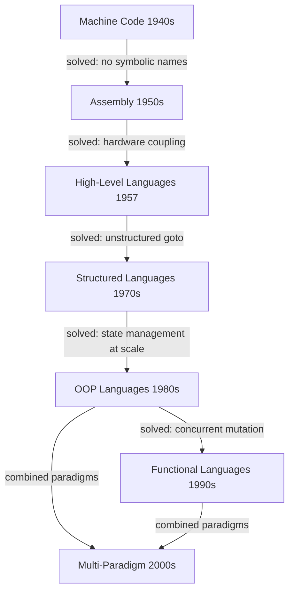
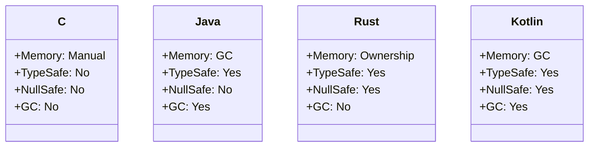

⚡ TL;DR - Programming languages evolved in five generations
from machine code to multi-paradigm - every feature in your
language today was invented to solve a specific failure in
the previous generation.

| #005 | Category: CS Fundamentals - Paradigms | Difficulty: ★☆☆ |
|:---|:---|:---|
| **Depends on:** | CSF-001 (CS Map), CSF-002 (Paradigms) | |
| **Used by:** | CSF-011 through CSF-023 (paradigm entries) | |
| **Related:** | CSF-004 (Code to Execution), CSF-020 (Compiled vs Interpreted) | |

---

### 🔥 The Problem This Solves

**WORLD WITHOUT IT:**

When a developer argues that "Java is too verbose" or
"Python is too slow" or "Rust is too complex," they are
making claims about language trade-offs without understanding
WHY those trade-offs exist. Without history, every language
feels arbitrary - a collection of someone's quirky design
choices. You have no framework for predicting what problems
a language was designed to solve, what it will fail at, or
why it makes the choices it does.

**THE BREAKING POINT:**

Every programming language exists because the previous
generation failed at something specific. FORTRAN failed
at portability. C failed at memory safety. C++ failed at
type safety and compilation speed. Java failed at startup
time and functional expressiveness. The history of languages
IS the history of discovering failure modes at scale and
inventing mitigations.

**THE INVENTION MOMENT:**

The 1950s-60s research at IBM, MIT, and Bell Labs established
that programs needed to be written in terms of problems, not
machine operations. John Backus's argument for FORTRAN (1957):
"programmers should be freed from the details of machine
operation." This principle - raise the abstraction level -
has driven every generation of language design since.

**EVOLUTION:**

Generation 1 (1940s): Machine code. Programs ARE the
hardware state. Generation 2 (1950s): Assembly. Symbolic
names for machine operations. Generation 3 (1957-1970s):
High-level languages (FORTRAN, COBOL, LISP, Algol, C).
Human-readable abstraction. Generation 4 (1980s-90s):
Type-safe languages (Ada, Modula, ML, Haskell, Java).
Safety enforced by the compiler. Generation 5 (2000s+):
Multi-paradigm, memory-safe, expressive (Scala, Kotlin,
Rust, Swift, Go, Elixir). No single paradigm.

---

### 📘 Textbook Definition

The history of programming languages charts the evolution
of formal notations for expressing computation, from
binary machine codes (1940s) through assembly, procedural,
object-oriented, and functional paradigms, to modern
multi-paradigm languages. Each generation addressed
failure modes of the previous: FORTRAN solved hardware
coupling, structured programming solved the goto problem,
OOP solved procedural state management at scale, functional
programming solved concurrent mutation, and modern languages
attempt to combine safety and expressiveness. The field
formally began with the FORTRAN compiler (1957) and has
produced approximately 8,000+ programming languages, of
which roughly 200-300 have significant usage.

---

### ⏱️ Understand It in 30 Seconds

**One line:**
Each programming language was invented to fix a specific
failure in the previous one - knowing the failure tells
you the language's strengths and limits.

**One analogy:**

> Language history is like the history of surgical tools.
> First surgery used whatever was available (machine code).
> Then tools were standardized (assembly). Then specialized
> instruments were invented for specific procedures
> (high-level languages). Each new tool exists because the
> previous one caused a specific class of harm. A surgeon
> who knows why forceps replaced fingers is a better surgeon
> than one who just knows how to hold forceps.

**One insight:**

Every feature Java added over C (garbage collection, type
safety, no pointers, exceptions) solved a specific C
failure mode at scale. Every feature Kotlin added over
Java (null safety, extension functions, coroutines) solved
a specific Java failure mode. Learning language history
means learning which failure modes each feature prevents -
and therefore which failure modes remain in the language
you are using today.

---

### 🔩 First Principles Explanation

**THE FIVE GENERATIONS:**

```
┌─────────────────────────────────────────┐
│  Programming Language Generations       │
├─────────────────────────────────────────┤
│  Gen 1: Machine Code (1940s)            │
│  Binary, hardware-specific, no abstraction│
│           |                             │
│  Gen 2: Assembly (1950s)                │
│  Symbolic names (MOV, ADD, JMP)         │
│  Still hardware-specific                │
│           |                             │
│  Gen 3: High-Level (1957-1980s)         │
│  FORTRAN, COBOL, LISP, C, Pascal        │
│  Human-readable; compiler generates asm │
│           |                             │
│  Gen 4: Type-Safe + Structured (1980s+) │
│  Ada, ML, Haskell, C++, Java            │
│  Compiler enforces safety constraints   │
│           |                             │
│  Gen 5: Multi-Paradigm (2000s+)         │
│  Scala, Kotlin, Rust, Swift, Go, TypeScript│
│  Safety + Expressiveness + Performance  │
└─────────────────────────────────────────┘
```



**THE KEY LANGUAGE INVENTIONS AND WHAT THEY FIXED:**

- **FORTRAN (1957)** - fixed: hardware-specific arithmetic
  code. First compiler. Introduced mathematical notation
  for computation. Engineers could write `Y = A * X + B`
  instead of load registers, multiply, add, store.

- **LISP (1958)** - fixed: rigid sequential computation.
  Introduced: S-expressions, recursive data structures,
  garbage collection, first-class functions, macros.
  All modern functional languages trace to LISP.

- **COBOL (1959)** - fixed: business data had no language.
  Introduced: record structures, file processing, self-
  documenting English-like syntax. Still processes most
  of the world's financial transactions.

- **Algol 60 (1960)** - fixed: no portable language for
  algorithms. Introduced: block structure, lexical scoping,
  call by value and by name. Influenced almost every
  later language.

- **C (1972)** - fixed: UNIX was written in assembly.
  Introduced: portable systems programming - write once,
  compile anywhere. Still powers OS kernels, embedded
  systems, and performance-critical code.

- **Smalltalk (1972)** - fixed: no clean model for OOP.
  Introduced: everything is an object, message-passing,
  live programming environment. Alan Kay's OOP vision.

- **ML (1973)** - fixed: no type system for functional
  programming. Introduced: Hindley-Milner type inference
  (the system behind Haskell, OCaml, Rust's type system).

- **C++ (1985)** - fixed: C had no OOP. Added: classes,
  inheritance, templates, RAII. Trade-off: massive
  complexity.

- **Haskell (1990)** - fixed: functional research needed
  a standard platform. Introduced: pure functional with
  monads for effects, lazy evaluation, type classes.

- **Java (1995)** - fixed: C++ memory safety and platform
  portability. Introduced: garbage collection, JVM
  portability, checked exceptions, no pointers.

- **Python (1991)** - fixed: scripting was either powerful
  or readable. Introduced: radical readability through
  indentation syntax, dynamic typing for scripting speed.

- **Ruby (1995)** - fixed: scripting was not developer-
  delightful. Introduced: "programmer happiness" as a
  design goal, blocks, metaprogramming.

- **Go (2009)** - fixed: large-scale systems in C++ were
  too complex. Introduced: fast compilation, goroutines,
  minimalist design, built-in tooling.

- **Rust (2010)** - fixed: C/C++ memory safety without
  GC was not possible. Introduced: ownership and borrow
  checker - memory safety provable at compile time with
  zero runtime overhead.

- **Kotlin (2011)** - fixed: Java verbosity and null
  unsafety. Added: null safety, extension functions,
  data classes, coroutines. Fully interoperable with Java.

- **TypeScript (2012)** - fixed: JavaScript at scale had
  no types. Added: static type checking compiled away -
  types at dev time, plain JavaScript at runtime.

**THE TRADE-OFFS:**

**Gain from higher abstraction:** Developer productivity,
fewer low-level bugs, portability. Writing web servers
in Java takes a fraction of the time required in C.

**Cost of higher abstraction:** Performance overhead
(GC, dynamic dispatch, JIT warmup), runtime complexity
(garbage collectors, virtual machines), and harder to
reason about what the machine actually does.

**ESSENTIAL vs ACCIDENTAL COMPLEXITY:**

**Essential:** Different problem domains have genuinely
different constraints. Embedded systems need C (no GC
pauses, deterministic timing). Web APIs need Java/Go/
Python (developer productivity, ecosystem). ML research
needs Python (NumPy, PyTorch ecosystem).

**Accidental:** Language wars and tribal loyalty. The
production-correct answer is almost always: use the
language whose ecosystem best fits the problem domain,
whose team knows it, and whose constraints match the
system requirements.

---

### 🧪 Thought Experiment

**SETUP:**

You need to write a device driver for a medical
sensor that must respond within 100 microseconds,
cannot crash, and has 64KB of memory. Your options
are Python, Java, and C. Which do you choose?

**PYTHON:**

Garbage collector pauses can be 10-100ms - 100-1000x
the latency budget. Python interpreter is not
certifiable for medical safety standards. Not a
viable choice.

**JAVA:**

GC pauses (even with ZGC) can be milliseconds.
JVM startup time is seconds. JVM requires megabytes
of overhead. Not a viable choice for 64KB constraint.

**C:**

No garbage collector (zero runtime pauses). Direct
hardware control (memory-mapped I/O). Deterministic
memory layout. 40 years of safety-critical certification
for medical devices. The only viable choice.

**THE LESSON:**

Language choice is a requirements-driven engineering
decision, not a preference. Knowing the history of why
each language was designed tells you exactly what
constraints it was optimized for and where it will fail.

---

### 🎯 Mental Model / Analogy

**THE TOOLS EVOLUTION ANALOGY:**

A stone chisel (machine code): works for everything;
requires total expertise; no safety. A wood plane (assembly):
specialized for a surface; still dangerous. A circular saw
(high-level language): powerful; guard protects user.
A laser cutter (modern language): precise, automated,
safe; requires power supply. Each generation is more
productive and safer - but requires more infrastructure
and fails in new ways (the laser cutter needs electricity;
the stone chisel works anywhere).

**MEMORY HOOK:**

"Machine - Assembly - High-Level - Type-Safe -
Multi-Paradigm." Or: "My Aunt Had To Move." Each level
added a safety net at the cost of a new dependency.

---

### 📊 Gradual Depth - Five Levels

**Level 1 - Child:**
Programming languages are like ways of giving instructions.
First people used numbers (machine code). Then they used
symbols (assembly). Then they used words we could read
(high-level languages). Each step made it easier to write
but the computer still ran the same kind of instructions.

**Level 2 - Student:**
Five generations of languages: machine code (binary),
assembly (symbolic), high-level (FORTRAN, C), object-
oriented (Java, C++), and modern (Python, Kotlin, Rust).
Each added abstraction. More abstraction means less
control but higher productivity.

**Level 3 - Professional:**
Each language generation fixed specific failures:
FORTRAN fixed hardware coupling; structured programming
fixed goto spaghetti; OOP fixed uncontrolled global
state; Java fixed C memory safety for enterprise; Python
fixed C for scripting; Rust fixed C memory safety without
GC. Your current language's weaknesses were the NEXT
language's motivation.

**Level 4 - Senior Engineer:**
Language features are crystallized solutions to known
problems. Java's checked exceptions were an attempt
to fix C's silent error codes - and introduced their
own failure mode (exception swallowing). Java's generic
type erasure was a backward-compatibility compromise
that created reflection limitations. Kotlin's null safety
is Hoare's apology for null pointers implemented 50 years
later. Every "annoying" language feature has a story that
explains its necessity and its trade-offs.

**Level 5 - Expert:**
Programming language theory (PLT) provides formal
foundations: type theory (Martin-Lof), operational
semantics (structural), denotational semantics (Scott-
Strachey), and categorical semantics (Lawvere). Rust's
ownership system is formalized in linear logic. Haskell's
type classes are formalized in System F with constraints.
Effect systems (algebraic effects) are the next frontier -
unifying Haskell's monads and Scala's implicit parameters
into a composable effect model that several next-
generation languages (Unison, Koka, OCaml 5) are
implementing.

*Expert Cues - Level 5:*
Substructural type systems (linear types, affine types,
ownership in Rust) prevent use-after-free by making
values "used exactly once" enforceable at the type level.
This is lambda calculus with resource constraints. The
Rust borrow checker is a decision procedure for these
constraints. Understanding the formal model explains
why the borrow checker rejects certain patterns - not
because Rust is arbitrary but because those patterns
violate linear type constraints.

---

### ⚙️ How It Works (Formal Basis)

**THE FORMAL FOUNDATIONS:**

Programming language design rests on three formal
foundations:

1. **Lambda Calculus (Church, 1936):** The formal
   foundation for functional languages. Every function,
   application, and abstraction in Haskell, ML, and
   Python's lambdas traces to Church's original notation.

2. **Turing Machines (Turing, 1936):** The formal
   foundation for imperative languages. Every assignment,
   loop, and state mutation traces to the Turing Machine
   model.

3. **Type Theory (Martin-Lof, 1975):** The formal
   foundation for type systems. Hindley-Milner type
   inference (Haskell, ML, Rust) is a decision procedure
   for a fragment of this theory.

**WHY TYPE SYSTEMS MATTER:**

A type system is a static verification of program
properties. ML's type inference (1973) proved that
types could be inferred without annotations - the
compiler could deduce that `f x = x + 1` takes an
int and returns an int. Rust extends this with
lifetime inference: the compiler infers not just types
but the lifetimes of borrows - whether a reference
remains valid at each point in the program. This is
the theoretical limit of what a compiler can verify
without requiring full program annotations.

```
┌─────────────────────────────────────────┐
│  Language Safety Properties             │
├─────────────────────────────────────────┤
│ Memory Safety? GC? | Type Safe? | Null? │
├─────────────────────────────────────────┤
│ C:    No  / No     | No        | Yes    │
│ C++:  No  / No     | Mostly    | Yes    │
│ Java: Yes / GC     | Yes       | Yes    │
│ Go:   Yes / GC     | Yes       | Yes    │
│ Rust: Yes / No-GC  | Yes       | No     │
│ Kotlin: Yes / GC   | Yes       | No     │
│ Haskell: Yes / GC  | Yes       | No     │
└─────────────────────────────────────────┘
```



---

### 🔄 System Design Implications

**LANGUAGE CHOICE IS SYSTEM DESIGN:**

The choice of language constrains your entire system
architecture:

- **Java/JVM:** Established ecosystem, long-running
  services, GC-managed memory. Forces: JVM tuning,
  classpath management, GC pause acceptance.
- **Go:** Statically compiled, fast startup, built-in
  goroutines. Suitable for: microservices, CLI tools,
  network servers. Forces: explicit error handling,
  no generics before 1.18, simple type system.
- **Python:** Dynamic typing, extensive scientific/ML
  libraries. Forces: GIL limits CPU parallelism;
  CPython performance requires C extensions for hot paths.
- **Rust:** Memory safety without GC, systems-level
  control. Forces: ownership/borrow learning curve;
  compile times; significant upfront complexity for
  teams new to linear types.

**WHAT CHANGES AT SCALE:**

At 10x code size: type system investment pays off.
Statically-typed languages (Java, Kotlin, TypeScript)
have refactoring tools; dynamically-typed languages
(Python, Ruby, JavaScript) require comprehensive tests
to maintain safely. At 100x team size: language
ecosystems and tooling matter more than language features.
Python has NumPy/PyTorch for ML; no other language
matches that. Java has Spring for enterprise; nothing
matches that ecosystem. At 1000x request volume:
language performance characteristics become architectural
constraints. Python's GIL forces process-based
parallelism (Gunicorn workers, not threads).

---

### 💻 Code Example

**Example 1 - Evolution: The Same Logic in Three Generations**

```java
// GENERATION 3 - C (1972): Manual memory, no safety
// Problem: forget free() -> memory leak
// Problem: use after free -> crash or security bug
char* createGreeting(const char* name) {
    char* buf = malloc(strlen(name) + 8);
    sprintf(buf, "Hello, %s", name);
    return buf;  // caller must free - easy to forget
}

// GENERATION 4 - Java (1995): GC, no pointer arithmetic
// Problem fixed: memory is managed automatically
// Problem remaining: null pointer - String can be null
public String createGreeting(String name) {
    return "Hello, " + name;  // NullPointerException risk
}

// GENERATION 5 - Kotlin (2011): null safety enforced
// Problem fixed: compiler rejects null unless explicit
// ? makes nullability visible in the type system
fun createGreeting(name: String): String {
    return "Hello, $name"
    // name is guaranteed non-null by the type system
    // caller: createGreeting(user.name ?: "World")
}
```

**Example 2 - Wrong vs Right: Language-Appropriate Idioms**

```java
// BAD: Java code written in a C style
// (using int error codes instead of exceptions)
// This fights the language - ignores what Java fixed
public int processOrder(Order order) {
    if (order == null) return -1;
    if (!order.isValid()) return -2;
    // ...
    return 0;
}

// GOOD: Java idiom - use what the language was built for
// Exceptions, validation, and proper null handling
public void processOrder(Order order) {
    Objects.requireNonNull(order, "Order must not be null");
    if (!order.isValid()) {
        throw new InvalidOrderException(
            "Order " + order.getId() + " failed validation");
    }
    // ...
}
```

---

### ⚖️ Comparison Table

| Language | Year | Invented To Fix | Key Innovation | Key Limitation |
|---|---|---|---|---|
| FORTRAN | 1957 | Hardware-coupled arithmetic | First compiler; math notation | No data structures |
| LISP | 1958 | Sequential rigid programs | GC, first-class functions, macros | Performance, unfamiliar syntax |
| C | 1972 | Assembly for portability | Portable systems language | Memory unsafety |
| Smalltalk | 1972 | No clean OOP model | Pure OOP, message-passing, live IDE | Performance, adoption |
| C++ | 1985 | C had no OOP | OOP + C performance | Massive complexity |
| Java | 1995 | C++ memory safety + portability | JVM portability, GC | Verbosity, startup time |
| Python | 1991 | Scripting was hard to read | Readability, rapid development | GIL, performance |
| Go | 2009 | Large C++ codebases too complex | Fast compilation, goroutines | Limited generics (pre-1.18) |
| Rust | 2010 | C memory safety without GC | Ownership/borrow checker | Steep learning curve |
| Kotlin | 2011 | Java verbosity and null safety | Null safety, extension functions | JVM startup |

---

### ⚠️ Common Misconceptions

| Misconception | Reality |
|---|---|
| Newer languages are always better | Each language was optimized for specific constraints. C is still correct for embedded systems. COBOL still runs financial transaction processing. "Better" depends entirely on the use case. |
| Java is verbose because of bad design | Java's verbosity was a deliberate design choice for readability at enterprise scale. The verbosity makes code structure explicit. Modern Java (14+, records, sealed classes) reduces verbosity while keeping explicit structure. |
| Python is slow, so it's bad for production | Python's C extension model (NumPy, PyTorch, TensorFlow) runs the computation in optimized C/CUDA while Python handles orchestration. The top ML training pipelines in the world run Python at the API layer. |
| Go has no generics (or had limited generics) | Go 1.18 (2022) added full generics. Go deliberately delayed them to get the type system right. The delay was a deliberate trade-off: simpler type system for faster compilation and learning curve. |
| Memory-safe languages are slower than unsafe ones | Rust is both memory-safe and competitive with C in benchmarks. GC-based memory safety (Java, Go) does add latency variance from GC pauses, but peak throughput is often comparable to C for I/O-bound workloads. |

---

### 🚨 Failure Modes & Diagnosis

**Failure Mode 1: Language Mismatch for Domain**

**Symptom:** Python ML inference service cannot handle
more than 100 requests/second on 16 CPU cores. Adding
threads provides zero improvement.

**Root Cause:** Python GIL (Global Interpreter Lock) -
a runtime-layer constraint inherited from CPython's design.
CPython was optimized for single-threaded scripting.
Threads share the GIL; only one thread executes Python
bytecode at a time.

**Diagnostic Signal:**
`top` shows 1 CPU core at 100%, 15 cores idle, even
with threading. This is the GIL signature.

**Fix:** Use multiple processes (Gunicorn with workers)
for CPU-bound Python. Or move the hot path to a
compiled language (C extension, Cython, or a separate
Go/Rust microservice).

---

**Failure Mode 2: Language Feature Misuse Across Generations**

**Symptom:** Java team writes null-returning methods,
spreads null checks everywhere, has regular NullPointerExceptions.

**Root Cause:** Applying Java's pre-Optional pattern
(null as "no value") to a codebase that should use
`Optional<T>` or Kotlin's nullable types.

**Diagnostic Signal:**
Grep for patterns: `if (x != null)` appearing 50+
times in a single service. NPE in production logs.

**Fix:** Adopt `Optional<T>` for return types that
may be absent. Or migrate to Kotlin for null-safe
type system at the language level.

---

**Security Note:**

C's lack of memory safety is directly responsible for
the largest class of security vulnerabilities: buffer
overflows, use-after-free, and integer overflow. These
vulnerabilities have caused billions of dollars in
breaches across the last 40 years. This is why CISA
and NSA have published guidance recommending memory-
safe languages (Rust, Java, Go, Swift, C#, Python) for
new systems development. "Language history" is not
academic - the choice between C and Rust is a security
architecture decision.

---

### 🔗 Related Keywords

**Prerequisites (understand these first):**
- `Why Programming Paradigms Exist` (CSF-002) - the
  paradigm shifts that drove each generation

**Builds On This (learn these next):**
- `Imperative Programming` (CSF-011) - the paradigm
  of the first three generations
- `Object-Oriented Programming` (CSF-014) - the paradigm
  of the fourth generation
- `Functional Programming` (CSF-022) - the paradigm
  gaining dominance in the fifth generation

**Alternatives / Comparisons:**
- `Compiled vs Interpreted` (CSF-020) - the execution
  model choice that cuts across generations
- `Strong vs Weak Typing` (CSF-019) - the type system
  choice that defines generation 4 languages

---

### 📌 Quick Reference Card

```
┌────────────────────────────────────────────────────────┐
│ 5 GENERATIONS│ Machine - Assembly - High-Level -       │
│              │ Type-Safe - Multi-Paradigm              │
├──────────────┼─────────────────────────────────────────┤
│ KEY INSIGHT  │ Each language fixed the previous gen's  │
│              │ failure - know the failure to know      │
│              │ the language's limits                   │
├──────────────┼─────────────────────────────────────────┤
│ C            │ Portable systems; no memory safety      │
├──────────────┼─────────────────────────────────────────┤
│ JAVA         │ Safe + portable; startup + verbosity    │
├──────────────┼─────────────────────────────────────────┤
│ PYTHON       │ Readable + fast dev; GIL + perf ceiling │
├──────────────┼─────────────────────────────────────────┤
│ RUST         │ C safety without GC; steep learning     │
├──────────────┼─────────────────────────────────────────┤
│ GO           │ Fast compile + goroutines; simple types │
├──────────────┼─────────────────────────────────────────┤
│ TRADE-OFF    │ Higher abstraction = higher safety,     │
│              │ lower control, more infrastructure      │
├──────────────┼─────────────────────────────────────────┤
│ ONE-LINER    │ "Languages evolve by solving the prev   │
│              │ generation's most painful failures"     │
├──────────────┼─────────────────────────────────────────┤
│ NEXT EXPLORE │ CSF-011 (Imperative), CSF-014 (OOP)     │
└────────────────────────────────────────────────────────┘
```

**If you remember only 3 things:**

1. Every language generation fixed specific failures
   from the previous one. FORTRAN fixed hardware coupling.
   Java fixed C memory unsafety. Rust fixed Java GC pauses.
2. Language choice is a requirements decision: C for
   deterministic embedded systems, Java for enterprise
   ecosystems, Python for ML/scripting, Rust for memory-
   safe systems code. There is no universally best language.
3. Language safety properties (memory safety, null safety,
   type safety) are not just convenience features - they
   are the primary security architecture decision for
   new systems development.

**Interview one-liner:**
"Programming languages evolved in five generations from
machine code to multi-paradigm. Each generation solved
the previous one's failures: FORTRAN solved hardware
coupling, Java solved C memory safety, Kotlin solved
Java null safety. Language choice is therefore a
requirements-driven decision based on which failure
modes you cannot accept in your domain."

---

### 💎 Transferable Wisdom

**Reusable Engineering Principle:**
Every technology generation solves the previous generation's
problems and introduces a new class of problems. Recognizing
this cycle lets you predict the next technology generation's
focus before it arrives. The failures visible in today's
dominant technologies are the opportunities for tomorrow's
replacements.

**Where else this pattern appears:**

- **Database evolution** - hierarchical (IMS) to relational
  (SQL) to document/key-value (NoSQL) to NewSQL (CockroachDB):
  each generation fixed specific failures at the cost of
  new ones
- **Infrastructure evolution** - physical servers to VMs to
  containers to serverless: each generation added abstraction
  and reduced operational overhead at the cost of control
  and visibility
- **Networking protocols** - FTP to HTTP to HTTPS to HTTP/2
  to QUIC: each version fixed the previous version's
  performance and security failures

**Industry applications:**

- **Security guidance** - NIST and NSA recommend memory-safe
  languages for new development. Understanding language
  history explains WHY: C's lack of safety has produced
  40 years of buffer overflow CVEs.
- **Career planning** - understanding language history
  helps predict which languages will become dominant.
  Rust's growth follows the same pattern as Java's growth
  over C++ - better safety at competitive performance.
- **Code review** - recognizing when code is written in
  one generation's idiom in a different generation's
  language ("C code in Java") is a code review skill that
  requires language history knowledge.

---

### 💡 The Surprising Truth

Tony Hoare, the inventor of null references (in Algol W,
1965), called it his "billion-dollar mistake" in a 2009
keynote - acknowledging that null has caused more
production failures and security vulnerabilities than
almost any other single language design decision. Null
references were added for convenience: it was easy to
implement and seemingly useful to have "no value"
represented as a special pointer. 44 years later, Hoare
apologized. Kotlin's `String?` notation (2011) and
Java's `Optional<T>` (2014) are the industry's formal
acknowledgment that a language feature beloved for its
convenience was a systematic source of failures. The
language history lesson: "convenient" features in the
1960s became production failure modes at scale. Every
convenience feature in today's languages should be
evaluated for the same risk.

---

### ✅ Mastery Checklist

**You've mastered this when you can:**

1. **[EXPLAIN]** For any production failure class (memory
   leak, null pointer, race condition, type error), name
   the language generation that first introduced a
   mitigation and the trade-off that mitigation introduced.

2. **[DEBUG]** When a Python service cannot utilize
   multiple CPU cores despite using threading, identify
   the GIL as the language-design root cause and propose
   three architectural fixes with their trade-offs.

3. **[DECIDE]** Given a new system requirement - a
   medical device controller (deterministic timing, 64KB
   memory), a web API (100 RPS, team of 5), an ML
   inference service (GPU-accelerated, Python ecosystem)
   - choose the language and justify using language
   history trade-off reasoning.

4. **[CONNECT]** Explain to a junior engineer why Java's
   generics use type erasure (a backward-compatibility
   compromise in 2004) and what production limitation
   it causes that Kotlin/Scala's reified generics solve.

5. **[EXTEND]** Describe the next likely language
   generation features by examining the current failures
   of dominant languages. What does the Rust/Go/Kotlin
   generation fail at that the next generation will fix?

---

### 🧠 Think About This Before We Continue

**Q1.** Java added records (Java 16), sealed classes
(Java 17), and pattern matching (Java 21). These are
functional programming features added to an OOP language.
What failures in Java's OOP design do these features
address? Which prior language already had these features
and for how long?

*Hint: Records map to functional algebraic data types
(product types). Sealed classes map to sum types.
Pattern matching maps to case analysis. Haskell had all
three in 1990. What did Java's OOP model lack that
required 25+ years to add these concepts?*

**Q2.** COBOL was written in 1959 and is estimated to
process $3 trillion in financial transactions daily.
What properties of COBOL make it impossible to replace
quickly, and what does this tell you about the real
cost of language choice in production systems?

*Hint: COBOL has fixed-point decimal arithmetic that
matches banking regulations exactly. Modern languages
use IEEE floating-point which has rounding errors
that are illegal in banking. What does this mean for
"just rewrite it in Java"?*

**Q3.** Rust prevents data races at compile time through
its ownership and borrow system. Java prevents them at
runtime through synchronized blocks and `java.util.concurrent`.
What is the fundamental difference in the failure modes
of each approach? Which approach provides stronger
safety guarantees and at what cost?

*Hint: Compile-time prevention (Rust) means data race
bugs are caught before deployment - zero user impact.
Runtime prevention (Java synchronized) means the
programmer must use the synchronization correctly -
forgotten sync = data race visible only under concurrent
load. What is the cost of the compile-time approach?*

---

### 🎯 Interview Deep-Dive

**Q1: Why does Java use type erasure for generics
when C# preserves generic type information at runtime?
What production limitation does type erasure cause?**

*Why they ask:* Tests language history and trade-off
reasoning.

*Strong answer includes:*
- Java added generics in 2004 (Java 5). The JVM was
  designed in 1995 without generics. To maintain backward
  compatibility with existing JVM bytecode, generic type
  information is erased after compilation - `List<String>`
  becomes `List` in the bytecode.
- C# was designed from scratch with generics in mind
  (2002, .NET 2.0) - type information is preserved at
  runtime (reified generics).
- Production limitation: Java reflection cannot distinguish
  `List<String>` from `List<Integer>` at runtime. Frameworks
  use `TypeToken` workarounds (Guava, Jackson). A Spring
  bean typed `List<String>` cannot be injected into a
  `List<Integer>` field via reflection alone.

**Q2: A startup is choosing between Python and Go for
a new microservice that will handle 50,000 API requests/second.
What language history factors determine this choice?**

*Why they ask:* Tests application of language history
to architecture decisions.

*Strong answer includes:*
- Python GIL: 50K RPS with CPU-bound work requires
  50K * processing_time threads or processes.
  GIL serializes CPU work. Multi-process Python
  (Gunicorn) is viable but adds process overhead.
- Python asyncio: for I/O-bound work (waiting on
  DB, downstream services), asyncio handles many
  concurrent requests on one thread - viable for
  50K I/O-bound RPS.
- Go goroutines: designed exactly for this - 50K
  concurrent goroutines is normal. Go's goroutine
  scheduler was invented to solve this scale problem.
- Decision: if I/O-bound -> either works (Python
  asyncio or Go). If CPU-bound -> Go wins due to GIL.

**Q3: What is the "billion-dollar mistake" and why
was null introduced despite its problems?**

*Why they ask:* Tests language history knowledge and
ability to reason about trade-offs.

*Strong answer includes:*
- Tony Hoare invented null references in Algol W (1965).
  He called it his "billion-dollar mistake" at QCon 2009,
  attributing countless bugs, vulnerabilities, and system
  failures to its convenience.
- WHY it was introduced: type systems in 1965 could not
  easily express "a value that may or may not be present."
  Null was a simple implementation: a special bit pattern
  meaning "nothing here." Fast to implement, immediately
  useful.
- THE COST: every reference type in every null-unsafe
  language (Java, C, C++) requires a null check before
  use - but the compiler does not enforce it. The result
  is NPEs in production.
- MODERN FIX: Kotlin `String?` - the type system
  distinguishes nullable from non-nullable at the language
  level. Attempting to dereference a `String?` without a
  null check is a compile error. This is Hoare's mistake
  fixed 46 years later in a language he never worked on.

> Entry stub. Generate full content using Master Prompt v4.0.