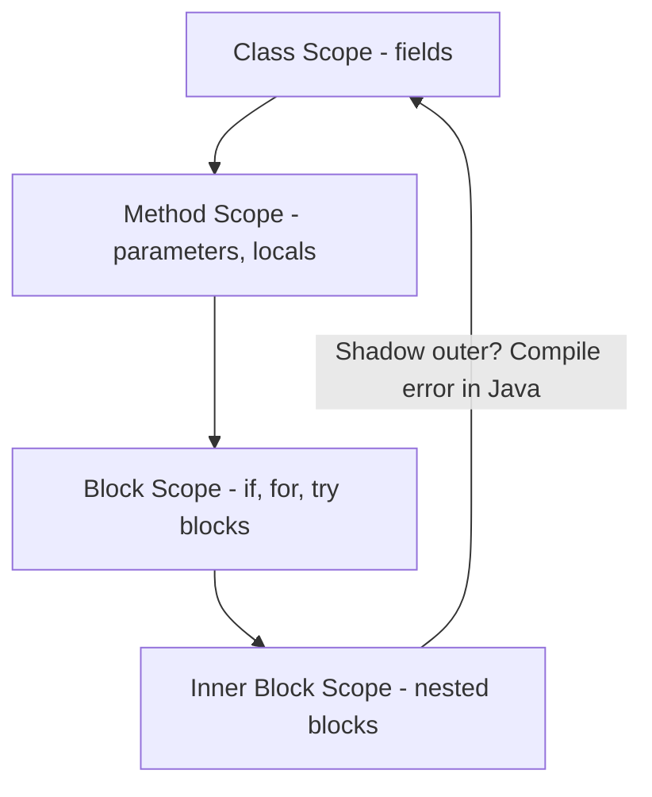
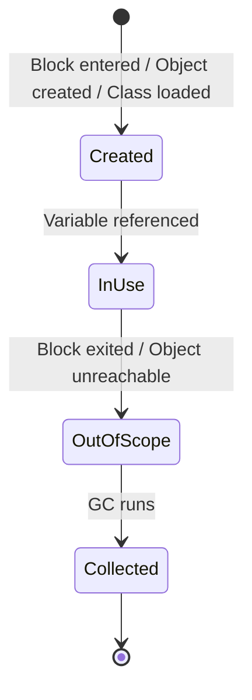

⚡ TL;DR - Variables are named storage locations; types
constrain their values; scope determines where they are
visible - misunderstanding any of the three is the most
common source of beginner bugs.

| #006 | Category: CS Fundamentals - Paradigms | Difficulty: ★☆☆ |
|:---|:---|:---|
| **Depends on:** | CSF-004 (How Code Becomes Execution) | |
| **Used by:** | CSF-007 (Control Flow), CSF-008 (Functions) | |
| **Related:** | CSF-019 (Strong vs Weak Typing), JLG-001 (Java Language) | |

---

### 🔥 The Problem This Solves

**WORLD WITHOUT IT:**

In early machine code, every value was stored at an
explicit memory address. To use a value, you specified
the exact address: `LOAD 0x004F2A`. If the program grew
and that value moved, every reference to `0x004F2A` broke.
No automatic safety. No way to say "this value should
only be readable from this part of the program."

**THE BREAKING POINT:**

Without named variables, programs were unmaintainable
beyond a few dozen instructions. Without types, a value
that was supposed to be a price could be accidentally
used as an index and corrupt data. Without scope, any
part of a program could accidentally modify any other
part's state - "action at a distance" bugs that were
almost impossible to trace.

**THE INVENTION MOMENT:**

FORTRAN (1957) introduced named variables (`X`, `Y`,
`COUNT`) and basic types (INTEGER, REAL, LOGICAL).
Algol 60 introduced lexical scoping - the rule that
a variable is visible only within the block where it
is declared. These two inventions - names and scope -
are the foundation of every programming language since.

**EVOLUTION:**

1957: Integer/real types (FORTRAN). 1960: Lexical scope
(Algol 60). 1970s: Type aliases and struct types (C).
1973: Type inference (ML). 1980s: Generic types (C++
templates). 1990s: Nullable types (Java reference types).
2011: Null safety in type system (Kotlin). 2015: Non-
nullable reference types (Swift, Kotlin, C# 8). Today:
Types encode security policies (sealed classes, refined
types, linear types in Rust).

---

### 📘 Textbook Definition

A variable is a named binding that associates a symbolic
identifier with a storage location holding a value.
A type is a classification of values that constrains
which operations are valid and what the value represents
(e.g., `int` values can be added; `String` values can
be concatenated). Scope is the syntactic region of a
program within which a variable binding is visible and
accessible. Variable resolution follows lexical scoping
rules: the compiler searches enclosing blocks outward
from the use site to find the declaration. Type checking
occurs at either compile time (static typing) or runtime
(dynamic typing). Variable lifetime (when memory is
allocated and freed) is governed by the language's
memory model - either GC, RAII, or manual management.

---

### ⏱️ Understand It in 30 Seconds

**One line:**
Variable = name + storage; type = constraint on the
storage's values; scope = visibility region of the name.

**One analogy:**

> A variable is a labeled box in a storage room (scope).
> The label is the name. The type is the rule written
> on the box: "only books" or "only integers." The
> storage room is the scope - the box only exists while
> you are in that room. Leave the room, and the box
> is gone. Try to put a number in the "only books" box
> and the type system stops you.

**One insight:**

Scope is what makes functions reusable. If variable
`x` in `calculateArea()` were visible from `calculatePerimeter()`,
the two functions would interfere. Lexical scope is
the mechanism that makes function composition safe.
Every time you call `calculateArea()`, it gets its own
`x` - invisible to everything else. This is the
fundamental mechanism that makes programs composable.

---

### 🔩 First Principles Explanation

**THREE INVARIANTS:**

1. **Names are bindings, not values.** A variable name
   is a compile-time promise: "at runtime, look up
   this name in this scope frame and you'll find a
   value of this type." The name itself takes no space
   at runtime - only the value does.

2. **Types constrain operations, not just values.**
   `int x = 5` does not just mean "x holds 5." It means:
   x can be added, multiplied, compared. x cannot be
   concatenated as a string. The type is a contract about
   which operations make sense.

3. **Scope determines lifetime in most languages.**
   In Java: a local variable's scope is its enclosing
   block; it is garbage-collected when no longer reachable.
   In C/C++: a local variable's scope is its enclosing
   block; it is stack-allocated and freed when the block
   exits. Scope is not just visibility - it often
   determines memory lifetime.

**SCOPE RULES:**

```
┌─────────────────────────────────────────┐
│     Scope Hierarchy (Java)              │
├─────────────────────────────────────────┤
│ Class scope                             │
│   String name;   // visible to all      │
│   int age;       // methods of class    │
│                                         │
│   void greet() {                        │
│     // Method scope                     │
│     String greeting;  // visible in     │
│                       // this method    │
│     if (true) {                         │
│       // Block scope                    │
│       int count = 0;  // visible        │
│     }                 // only here      │
│     // count NOT visible here           │
│   }                                     │
└─────────────────────────────────────────┘
```



**THE TRADE-OFFS:**

**Gain from narrow scope:** Easier reasoning. A variable
with method-level scope can only be affected by code
in that method. A variable with class-level scope can
be affected by every method in the class. Narrow scope
= fewer places to look when debugging.

**Cost of narrow scope:** More code to pass values
between functions. Narrowing scope requires explicit
parameter passing and return values, which adds
ceremony. Languages resolve this differently: closures
capture outer scope variables; classes capture instance
variables; global state is the escape hatch that should
be avoided.

**ESSENTIAL vs ACCIDENTAL COMPLEXITY:**

**Essential:** Names, types, and scope are genuinely
necessary for any non-trivial program to be maintainable.

**Accidental:** Dynamic typing debates, overly broad
scope (god classes), and type system complexity (deep
generic hierarchies) are accidental complexity -
engineering choices that could be made differently.

---

### 🧪 Thought Experiment

**SETUP:**

Two functions both declare a variable named `count`.
What happens?

```java
void methodA() {
    int count = 0;
    for (int i = 0; i < 10; i++) {
        count++;
    }
    System.out.println(count);  // prints 10
}

void methodB() {
    int count = 100;
    count += methodA(); // methodA returns nothing
    System.out.println(count);  // should print 100
}
```

**WITHOUT LEXICAL SCOPE:**

In early FORTRAN, using the same variable name in two
subroutines could cause them to share the same storage
- one function's `count` would corrupt the other's.
"Aliasing bugs" were a primary source of errors.

**WITH LEXICAL SCOPE:**

Each method's `count` is an independent binding. They
happen to share the same name but they occupy different
stack frames. There is no interference. The compiler
resolves each `count` to the nearest enclosing declaration.

**THE LESSON:**

Lexical scope is what makes function names reusable
across a codebase. Without it, you would need globally
unique variable names - a coordination nightmare in any
team codebase.

---

### 🎯 Mental Model / Analogy

**THE NESTED ROOMS ANALOGY:**

A house has rooms (scopes). Each room can have objects
(variables) labeled with names. When you're in a bedroom
(inner scope), you can also see objects in the living
room (outer scope). But you CANNOT see objects in the
neighbor's bedroom (different scope branch).

If you ask for "the key" (variable lookup), you first
look in the current room. Not found? Look in the room
containing this room. Not found? Look in the house
(class scope). Still not found? Compile error.

Two rooms at the same level can each have their own "key"
(same variable name) - they don't interfere. This is
lexical scoping.

**MEMORY HOOK:**

"NTS" - Name, Type, Scope. Name = the label. Type = the
constraint. Scope = the room. Every variable declaration
sets all three. Every variable USE looks up all three
to validate the reference.

---

### 📊 Gradual Depth - Five Levels

**Level 1 - Child:**
A variable is a box with a label and a rule ("only
numbers" or "only words"). The rule is the type. Scope
is which rooms in the program can see the box.

**Level 2 - Student:**
Variables store values; types say what kind of value
(int, String, boolean); scope says where in the code
you can use the variable. Local variables exist only
inside their `{}` block. Instance variables exist for
the life of the object. Static variables exist for
the life of the program.

**Level 3 - Professional:**
Variable scope in Java has four levels: local (method
block), instance (object lifetime), class (static,
JVM lifetime), and closure-captured (effectively final,
accessible from inner classes/lambdas). Types are
either primitive (value semantics, stack allocated) or
reference (object on heap, variable holds pointer).
Scope boundaries determine where GC root references
exist - a local reference going out of scope is a
potential GC root removal.

**Level 4 - Senior Engineer:**
Type inference (`var` in Java 10+, `val` in Kotlin)
does not change runtime behavior - it moves type
resolution to compile time. The compiler infers the
type from the right-hand side; the bytecode is identical
to explicit typing. Misuse of `var` obscures type
information at read time - `var result = service.process(x)`
is less readable than `ProcessResult result = service.process(x)`.
Scope rules interact with closures in subtle ways:
Java lambdas require captured variables to be effectively
final because mutable shared state between a lambda
and its enclosing scope creates thread-safety issues.

**Level 5 - Expert:**
Type systems encode security and correctness policies
that the compiler enforces. Rust's ownership types
(moved values, borrowed references) encode memory
lifetime as part of the type - the type system enforces
that memory is never accessed after it is freed.
Linear type systems (Rust) prevent aliasing of mutable
references by construction. Session types encode
protocol conformance - a type can represent "a socket
that must be written before it can be read." These
are not just types for values - they are policies
that the type system enforces at zero runtime cost.

*Expert Cues - Level 5:*
Variable shadowing (declaring a new variable with the
same name as an outer scope variable) is a scope rule
that different languages handle differently. Java
prohibits local variable shadowing of local variables
(compile error). JavaScript allows shadowing with `let`
(inner `let x` shadows outer `let x`). Python has no
block scope - all variables in a function share one
scope, so reassignment is shadowing by definition.
These differences cause real bugs when polyglot teams
write code in multiple languages with different rules.

---

### ⚙️ How It Works (Formal Basis)

**LEXICAL SCOPE RESOLUTION:**

The compiler maintains a symbol table for each scope.
When a variable is used, the compiler walks the scope
chain outward until it finds a declaration matching
the name. This is static/lexical resolution - the
resolution happens at compile time based on the static
structure of the code, not at runtime based on which
function called which.

**TYPE CHECKING:**

Static type checking (Java, Kotlin, TypeScript) verifies
that every operation is valid for the declared type at
compile time. `int x = "hello"` fails at compile time:
the type system checks that `String` is not assignable
to `int`.

Dynamic type checking (Python, JavaScript) verifies
type compatibility at runtime: `x + y` succeeds if
both are integers or strings at runtime; fails with
TypeError if one is an integer and one is a string.

**VARIABLE LIFETIME AND MEMORY:**

```
┌─────────────────────────────────────────┐
│   Java Variable Lifetime                │
├─────────────────────────────────────────┤
│  Local Variable:                        │
│  - Created: entering enclosing block    │
│  - Destroyed: GC when unreachable       │
│    (but typically short-lived)          │
│                                         │
│  Instance Variable (field):             │
│  - Created: object construction         │
│  - Destroyed: GC when object unreachable│
│                                         │
│  Static Variable:                       │
│  - Created: class loading               │
│  - Destroyed: class unloading           │
│    (typically JVM shutdown)             │
└─────────────────────────────────────────┘
```



---

### 🔄 System Design Implications

**SCOPE AND CONCURRENCY:**

Narrow scope = fewer shared variables = fewer concurrency
problems. A local variable is thread-safe by definition -
each thread has its own stack frame with its own copy.
An instance variable accessed by multiple threads requires
synchronization. A static variable accessed by multiple
threads requires explicit thread-safety.

System design implication: microservices design avoids
shared mutable state across services (equivalent to
restricting to local scope at the service level). Event-
driven architectures pass immutable events (equivalent
to passing values, not references).

**WHAT CHANGES AT SCALE:**

At 10x threads: static mutable variables become hotspots.
Thread-local variables (`ThreadLocal<T>`) are the scope
mechanism for per-thread state. At 100x code size: broad
scope (god classes with many fields) becomes a maintainability
bottleneck. Refactoring into smaller classes with narrower
scope is the engineering response. At 1000x: Type safety
becomes a scalability multiplier - statically typed code
is refactorable by IDE tooling; dynamically typed code
requires runtime testing for every change.

---

### 💻 Code Example

**Example 1 - Wrong vs Right: Variable Scope Too Broad**

```java
// BAD: Variable declared in outer scope for convenience.
// Reused across unrelated logic - easy to misuse.
// Reading 50 lines later, unclear what count means here.
int count = 0;
for (Order order : orders) {
    if (order.isActive()) {
        count++;
    }
}
System.out.println("Active: " + count);
count = 0; // reset for reuse - easy to forget
for (Order order : orders) {
    if (order.isPaid()) {
        count++;
    }
}
System.out.println("Paid: " + count);

// GOOD: Each variable has the narrowest possible scope.
// Impossible to accidentally reuse between loops.
long activeCount = orders.stream()
    .filter(Order::isActive).count();
long paidCount = orders.stream()
    .filter(Order::isPaid).count();
System.out.println("Active: " + activeCount);
System.out.println("Paid: " + paidCount);
```

**Example 2 - Wrong vs Right: Type Safety and Null**

```java
// BAD: Nullable type used without null check.
// NPE risk at line 3 - visible in static analysis.
public String formatUserName(User user) {
    String name = user.getName();   // may return null
    return name.toUpperCase();      // NPE if null
}

// GOOD: Explicit null handling with Optional
// Type system communicates the "might be absent" contract
public String formatUserName(User user) {
    return Optional.ofNullable(user.getName())
        .map(String::toUpperCase)
        .orElse("UNKNOWN");
}

// BETTER: Kotlin null-safe type system
// fun formatUserName(user: User): String {
//     return user.name?.uppercase() ?: "UNKNOWN"
// }
// Compiler enforces null handling - cannot forget it
```

**Testing/Verification:**
For scope: verify that variables declared in inner
blocks are not accessible in outer blocks (this is
a compile-time check). For types: property-based testing
checks type contract at boundaries - if `calculatePrice`
claims to return a positive `BigDecimal`, PBT generates
edge-case inputs to verify no negative return.

---

### ⚖️ Comparison Table

| Language | Typing | Scope Rules | Null Safety | Type Inference |
|---|---|---|---|---|
| Java | Static | Lexical, block-level | No (NPE risk) | Limited (`var` since Java 10) |
| Kotlin | Static | Lexical, block-level | Yes (`String?` vs `String`) | Full (`val x = 5` -> Int) |
| Python | Dynamic | Function-level (not block) | N/A (duck typing) | N/A (runtime types) |
| JavaScript | Dynamic | Block-level with `let`/`const`; function with `var` | No | N/A (TypeScript adds it) |
| TypeScript | Static | Block-level | Configurable (`strictNullChecks`) | Full |
| Rust | Static | Lexical, block-level | Yes (no null; `Option<T>`) | Full |

---

### ⚠️ Common Misconceptions

| Misconception | Reality |
|---|---|
| `var` in Java 10 is dynamic typing | `var` is static type inference. The compiler determines the type at compile time. The bytecode is identical to explicit typing. There is no runtime type lookup. |
| A variable's type can change at runtime | In statically typed languages (Java, Kotlin, TypeScript), it cannot. The reference can hold a different subtype (polymorphism), but the declared type constraint is fixed. Dynamic languages (Python) allow reassignment to a different type. |
| Wider scope is more flexible and therefore better | Wider scope creates more cognitive load and more opportunities for bugs. Narrow scope is a deliberate design choice that limits the surface area of potential interactions. |
| `null` and `undefined` are the same thing | `null` in Java means "explicitly no value here." `undefined` in JavaScript means "this variable was declared but never assigned." Different semantics from different language generations. |
| Static variables are thread-safe because they're shared | Static variables are the LEAST thread-safe precisely BECAUSE they're shared. One thread writing while another reads without synchronization = data race. Shared state requires explicit synchronization. |

---

### 🚨 Failure Modes & Diagnosis

**Failure Mode 1: Variable Escaping Scope (Closure Capture)**

**Symptom:** Lambda or inner class uses a loop variable
but all iterations produce the same value.

**Root Cause:**
```java
// BAD: i is modified after capture.
// All lambdas capture the same variable reference.
// By the time they execute, i == 10.
List<Runnable> tasks = new ArrayList<>();
for (int i = 0; i < 10; i++) {
    final int capturedI = i;  // FIX: capture in final local
    tasks.add(() -> System.out.println(i));  // BUG: i=10 always
    // tasks.add(() -> System.out.println(capturedI)); // CORRECT
}
```

**Diagnostic Signal:**
All lambda outputs print the same value (the final value
of the loop variable). Java compiler catches this for
non-effectively-final variables: "Variable used in lambda
expression should be final or effectively final."

**Fix:** Capture the current value in a new effectively-
final local variable before the lambda.

---

**Failure Mode 2: Type Mismatch at Runtime (Unchecked Cast)**

**Symptom:** `ClassCastException` at runtime in code
that compiled without errors.

**Root Cause:**
```java
// BAD: Unchecked cast - compiler warns, developer ignores
@SuppressWarnings("unchecked")
List<String> names = (List<String>) getFromCache("names");
String first = names.get(0); // ClassCastException if
                              // cache holds List<Integer>

// GOOD: Check type before cast
Object cached = getFromCache("names");
if (cached instanceof List<?> list && !list.isEmpty()
        && list.get(0) instanceof String) {
    List<String> names = (List<String>) cached; // safe
}
```

**Diagnostic Signal:**
`ClassCastException` in the stack trace. `@SuppressWarnings
("unchecked")` in the code is a signal that this path
was acknowledged and accepted. Review all such suppressions.

---

**Security Note:**

Type confusion vulnerabilities exploit cases where a program
treats a value as one type when it is actually another.
This is a type safety failure at the language or runtime
level. In Java deserialization: the runtime deserializes
bytes into objects of unexpected types, causing arbitrary
code execution. Mitigation: restrict types allowed in
deserialization using `ObjectInputFilter`. This is a
language-level type safety mechanism applied as a security
control.

---

### 🔗 Related Keywords

**Prerequisites (understand these first):**
- `How Code Becomes Execution` (CSF-004) - how the
  compiler resolves variable declarations (semantic
  analysis phase)

**Builds On This (learn these next):**
- `Control Flow` (CSF-007) - uses variables in conditions
  and loops; scope rules apply
- `Functions and Procedures` (CSF-008) - parameters and
  return values are the function scope's boundary
- `Stack vs Heap Memory` (CSF-010) - local variables on
  stack vs heap; scope determines when memory is freed

**Alternatives / Comparisons:**
- `Strong vs Weak Typing` (CSF-019) - deep dive into
  type system enforcement models
- `Java Language Fundamentals` (JLG-001) - Java-specific
  type and scope rules in production detail

---

### 📌 Quick Reference Card

```
┌────────────────────────────────────────────────────────┐
│ VARIABLE     │ Named binding to a storage location     │
├──────────────┼─────────────────────────────────────────┤
│ TYPE         │ Constraint on valid values + operations  │
├──────────────┼─────────────────────────────────────────┤
│ SCOPE        │ Region where the variable is visible    │
├──────────────┼─────────────────────────────────────────┤
│ SCOPE RULE   │ Narrow scope = fewer places to look when │
│              │ debugging; wider scope = more risk       │
├──────────────┼─────────────────────────────────────────┤
│ NULL SAFETY  │ Java: NPE risk. Kotlin: type-enforced.  │
│              │ Rust: no null (use Option<T>)            │
├──────────────┼─────────────────────────────────────────┤
│ var IN JAVA  │ Compile-time type inference, not dynamic │
│              │ typing - bytecode is identical           │
├──────────────┼─────────────────────────────────────────┤
│ CONCURRENCY  │ Local vars: thread-safe (own stack frame)│
│              │ Static vars: not thread-safe (shared)    │
├──────────────┼─────────────────────────────────────────┤
│ ONE-LINER    │ "Name the box, constrain its contents,  │
│              │ define which rooms can see it"          │
├──────────────┼─────────────────────────────────────────┤
│ NEXT EXPLORE │ CSF-007 (Control Flow), CSF-010 (Memory) │
└────────────────────────────────────────────────────────┘
```

**If you remember only 3 things:**

1. Variable = name + storage + lifetime; type = constraint
   on valid operations; scope = visibility region. All
   three must be correct for a variable to be safe.
2. Narrow scope is a deliberate engineering choice -
   the wider the scope, the more places to check when
   a variable holds an unexpected value.
3. Static variables are the hardest to reason about
   under concurrency because they are shared across
   all threads. Local variables are thread-safe by
   construction because each thread has its own stack.

**Interview one-liner:**
"Variables bind names to storage with type constraints
and scope visibility rules. The key engineering principle
is minimum scope: declare variables as close to their
use as possible, restrict types as tightly as the domain
allows, and never use nullable types where null is not
a meaningful value. These three disciplines eliminate
the most common classes of production bugs."

---

### 💎 Transferable Wisdom

**Reusable Engineering Principle:**
The principle of minimum scope - declare things as locally
and as restricted as possible - applies across all of
software engineering. API surface area, microservice
interfaces, module exports: all should be the minimum
necessary. Anything not explicitly public is unexposed.
This is scope applied to system design.

**Where else this pattern appears:**

- **Security principle of least privilege** - a process
  should have the minimum permissions necessary, just
  as a variable should have the minimum scope necessary.
  Both prevent "action at a distance" damage.
- **API design** - a well-designed API exposes only
  what clients need and hides implementation (like a
  class hiding its private fields from outer scope)
- **Database column access** - views and row-level
  security are scope mechanisms for database fields:
  define which users can see which data, analogous to
  which code can see which variables

**Industry applications:**

- **Secret management** - environment variables and
  Kubernetes secrets are scope-controlled: a secret
  available in one pod is not visible in another pod,
  implementing the scope principle at the infrastructure
  level
- **Feature flags** - a feature flag is a scoped boolean
  variable with a specific visibility policy (100% of
  users in region X see it; no one else does)
- **Distributed tracing** - trace context (trace ID,
  span ID) is a scope variable propagated through a
  request's call chain via thread-local storage or
  context propagation, not a global variable

---

### 💡 The Surprising Truth

JavaScript's `var` keyword (before 2015) had function
scope rather than block scope - one of the most
consequential language design decisions in history.
A `var` declared inside an `if` block was visible
throughout the entire function, contrary to every
other C-syntax language. This caused "hoisting" bugs:
variables appearing to be declared before the line
that declared them. ECMAScript 2015 (ES6) introduced
`let` and `const` with block scope specifically to fix
this. This single scope rule difference (function scope
vs block scope) was the primary reason `let`/`const`
were adopted so rapidly after their introduction. The
lesson: scope rules feel like a minor language syntax
detail but produce systemic, hard-to-debug production
issues when they are different from what programmers
expect.

---

### ✅ Mastery Checklist

**You've mastered this when you can:**

1. **[EXPLAIN]** Given a Java code snippet with three
   nested blocks, trace exactly which variables are
   visible at each point and which would cause "variable
   not found" compile errors if referenced outside their
   scope.

2. **[DEBUG]** When a lambda in a loop produces unexpected
   results (all iterations print the same value), identify
   the closure capture bug and fix it by introducing an
   effectively-final capture variable.

3. **[DECIDE]** Choose between instance field, method
   parameter, and local variable for a piece of state
   in a service class, with explicit reasoning about
   scope width and thread safety for each choice.

4. **[BUILD]** Refactor a method with a mutable local
   variable used across multiple loops into the narrowest-
   scope equivalent, demonstrating that the refactoring
   eliminates the possibility of reuse bugs between loops.

5. **[EXTEND]** Explain to a Python developer why Java's
   lambda requires captured variables to be effectively
   final, using the thread-safety rationale, and what
   Python's equivalent constraint is (and is not).

---

### 🧠 Think About This Before We Continue

**Q1.** In Java, a class field is initialized to `null`
by default. A local variable is not initialized and
using it before assignment is a compile error. Why
does Java have these two different behaviors for
"uninitialized"? What design principle drives the
difference?

*Hint: Class fields have a defined lifetime (object
creation to GC). Local variables have a shorter, well-
defined scope where the compiler can prove whether
assignment precedes use. Which can the compiler prove
a static invariant about?*

**Q2.** Python's global scope and local scope interact
through the `global` keyword. In Java, static fields
and local variables interact differently. A Python
function that reads a global variable without `global`
gets a local binding; a Python function that writes to
a name without `global` creates a local variable. What
production bug class does this asymmetry cause, and
what is the equivalent Java mechanism?

*Hint: Think about what happens when a Python function
tries to read a global, then modify it, in two
statements. What exception do you get and why?*

**Q3.** Rust has no null pointers - every value is
either `T` (definitely has a value) or `Option<T>`
(may or may not have a value). The `Option<T>` must
be explicitly handled before using the value. How
does this compare to Java's `Optional<T>`? What does
the Rust approach prevent that Java's `Optional<T>`
does not?

*Hint: In Java, you can always pass `null` where a
non-Optional type is expected - the compiler does not
prevent it. In Rust, you cannot pass `None` where a
`T` is required. Which part of the type system enforces
the difference?*

---

### 🎯 Interview Deep-Dive

**Q1: Explain variable shadowing, give a Java example
where it causes a subtle bug, and describe how the
Java compiler handles it.**

*Why they ask:* Tests nuanced scope knowledge with
real failure modes.

*Strong answer includes:*
- Variable shadowing: declaring a variable in inner
  scope with the same name as an outer scope variable
- Java allows field shadowing by local variables, but
  not local-to-local shadowing in the same block:
  ```java
  int count = 10; // field
  void method() {
      int count = 5; // shadows field (allowed)
      System.out.println(count); // prints 5
      System.out.println(this.count); // prints 10
  }
  ```
- Subtle bug: in a constructor, a parameter named same
  as a field and forgotten `this.` assignment - the
  parameter shadows the field, the field is never set.
  `this.name = name` vs `name = name` (no-op)

**Q2: When is it appropriate to use a ThreadLocal variable
in Java? What is the memory leak risk and how do you
prevent it?**

*Why they ask:* Tests scope + concurrency intersection.

*Strong answer includes:*
- `ThreadLocal<T>` provides per-thread scope for a variable
  - appropriate for: request context (correlation ID,
  user identity in web servers), per-thread formatting
  objects (`SimpleDateFormat` is not thread-safe),
  per-thread database connections (not recommended;
  use connection pool instead)
- Memory leak: `ThreadLocal` values in a thread pool
  are never automatically removed. If the web application
  sets a `ThreadLocal` and the thread returns to the
  pool, the value remains. Next request on the same
  thread sees the previous request's data (both a
  correctness bug and a potential data leak).
- Prevention: always `remove()` in a finally block or
  use Spring's `RequestContextHolder` which manages
  cleanup automatically

**Q3: Why does Java require captured variables in
lambdas to be effectively final? What would break
if this restriction were removed?**

*Why they ask:* Tests understanding of scope, closures,
and concurrency at the JVM level.

*Strong answer includes:*
- Java lambdas are compiled to anonymous inner classes
  or invokedynamic-backed objects. Captured variables
  are copied into the lambda's closure at creation time.
- If the outer variable were mutable and the lambda
  ran on a different thread, the outer change and the
  lambda's read would be unsynchronized - a data race.
- Specifically: `int count = 0; count++; lambda(() -> use(count))`
  - after `count++`, `count` is 1. The lambda captured
  the original 0. Which should the lambda see? There's
  no safe answer without synchronization.
- The effectively-final rule prevents this class of
  subtle concurrent bugs entirely by disallowing mutation
  of captured variables at the compiler level.

> Entry stub. Generate full content using Master Prompt v4.0.