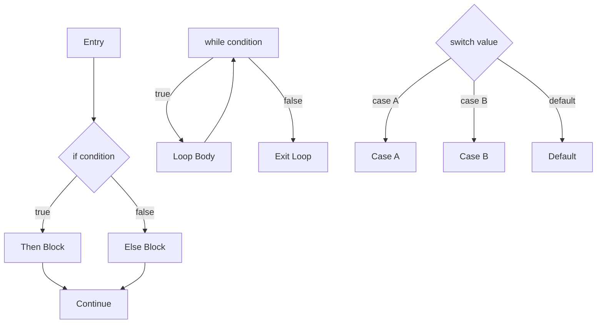
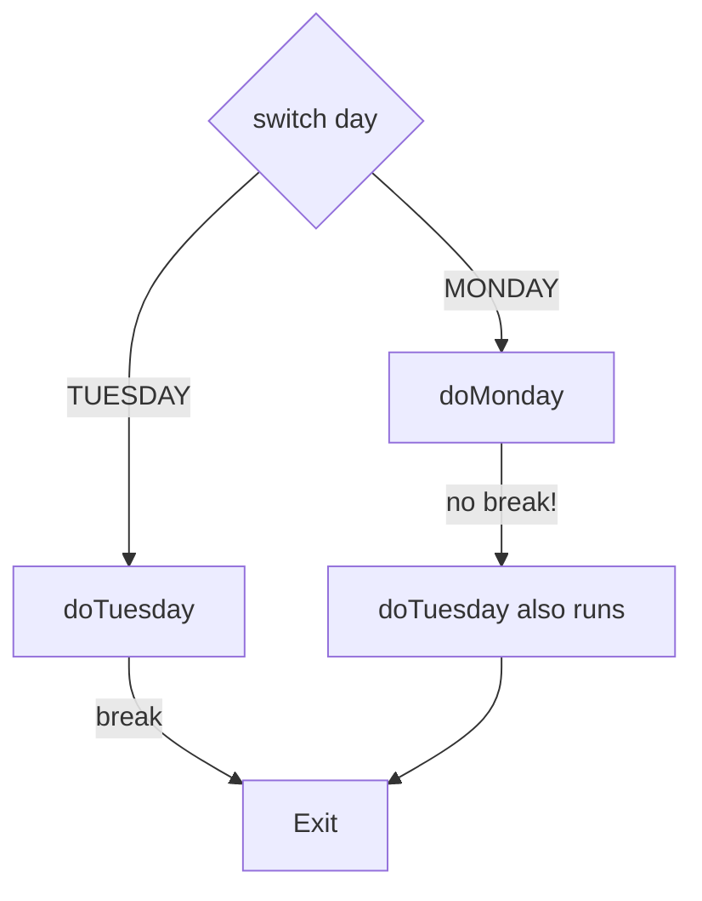

⚡ TL;DR - Control flow structures (if/else, loops, switch)
determine which code executes and how many times - getting
their boundaries and conditions wrong is the most common
source of logic bugs.

| #007 | Category: CS Fundamentals - Paradigms | Difficulty: ★☆☆ |
|:---|:---|:---|
| **Depends on:** | CSF-006 (Variables, Types, Scope) | |
| **Used by:** | CSF-008 (Functions), CSF-011 (Imperative) | |
| **Related:** | CSF-013 (Procedural), JLG-003, DSA-001 | |

---

### 🔥 The Problem This Solves

**WORLD WITHOUT IT:**

Machine code was purely sequential: execute instruction 1,
then 2, then 3. The only "control" was an unconditional
jump (`GOTO 0x004F2A`). To say "if the balance is
negative, do this; otherwise, do that," you had to
manually check a register, set a flag, and jump to
the right address. There was no concept of "skip this
block unless the condition is true."

**THE BREAKING POINT:**

Without structured control flow, programs were spaghetti.
Edsger Dijkstra's famous 1968 letter "Go To Statement
Considered Harmful" documented the engineering crisis:
programs with arbitrary GOTOs were unmaintainable,
unverifiable, and catastrophically error-prone. There
was no way to reason about what state a program was
in at any given point because any instruction could
jump anywhere.

**THE INVENTION MOMENT:**

Algol 60 (1960) formalized structured programming:
`if/then/else`, `while`, `for`, and `case`. These
constructs replaced arbitrary GOTOs with structured
blocks that always had a single entry point and a
single exit point. You could now reason about a block
of code in isolation - a foundational requirement for
building large programs.

**EVOLUTION:**

1960: Structured if/while (Algol 60). 1972: C adds
`for`, `break`, `continue`, `switch`. 1990s: Java
adds labeled break/continue for nested loops. 2014:
Java 8 adds streams as a declarative alternative to
imperative loops. 2019: Java 14 adds switch expressions
(not just statements). 2021: Java 17 adds pattern
matching in `instanceof`. 2021: Java 21 adds pattern
matching in `switch` - the most powerful evolution
of switch in 60 years.

---

### 📘 Textbook Definition

Control flow refers to the mechanisms by which a
programming language specifies the order in which
statements are executed. The three fundamental control
flow constructs are: selection (if/else, switch/case -
choosing between alternative paths based on a condition),
iteration (for, while, do-while - repeating a block of
code while a condition holds), and transfer (break,
continue, return, throw - unconditional changes in
execution path). Structured programming requires that
every control flow construct have a single entry point
and a single exit point, enabling local reasoning about
program state. Modern languages additionally support
declarative iteration through higher-order functions
(map, filter, reduce) as an alternative to explicit loops.

---

### ⏱️ Understand It in 30 Seconds

**One line:**
If/else chooses a path; loops repeat a path; switch
dispatches to one of many paths - each has exact rules
about when it runs and when it exits.

**One analogy:**

> Control flow is the railroad switching system. A
> straight track runs without decisions (sequential
> execution). A switch (if/else) routes the train to
> one of two tracks based on a signal. A loop is a
> circular track the train stays on until a condition
> is met. A switch/case is a yard with multiple tracks
> radiating from a central hub. Getting the switching
> logic wrong sends the train to the wrong destination.

**One insight:**

The most dangerous control flow bug is an off-by-one
error in a loop boundary. It does not crash the program -
it silently produces wrong results. A loop that runs
9 times instead of 10 processes 90% of the data with
100% apparent success. This is why loop boundary
conditions deserve more review attention than any other
control flow construct.

---

### 🔩 First Principles Explanation

**THE THREE CONSTRUCTS:**

```
┌─────────────────────────────────────────┐
│   Control Flow Taxonomy                 │
├─────────────────────────────────────────┤
│ SELECTION (branching)                   │
│   if (cond) { A } else { B }            │
│   switch (val) { case X: ... }          │
│   cond ? A : B  (ternary)              │
│                                         │
│ ITERATION (looping)                     │
│   for (init; cond; update) { body }     │
│   while (cond) { body }                 │
│   do { body } while (cond)              │
│   for (T item : collection) { body }    │
│                                         │
│ TRANSFER (exits and redirects)          │
│   return value;   // exit method        │
│   break;         // exit loop/switch    │
│   continue;      // next iteration     │
│   throw ex;      // exit to handler    │
└─────────────────────────────────────────┘
```



**IF/ELSE INVARIANTS:**

1. Exactly one branch executes for any input.
2. Both branches share the same post-condition context.
3. The `else` is optional - but leaving it out is
   implicitly "else: do nothing," which should be
   a deliberate choice, not an oversight.

**LOOP INVARIANTS:**

1. `while (cond)` - zero or more iterations. Condition
   checked BEFORE each iteration. May never execute.
2. `do/while (cond)` - one or more iterations.
   Condition checked AFTER first iteration. Always
   executes at least once.
3. `for (init; cond; update)` - equivalent to while
   with explicit initialization and update. Scope of
   the loop variable is the loop body.
4. Enhanced for (`for (T item : collection)`) -
   iterator-based; cannot modify the collection
   during iteration (ConcurrentModificationException).

**THE TRADE-OFFS:**

**Gain from structured control flow:** Reasoning
about program state becomes local. If you see
`if (balance < 0) { debit(); }`, you know exactly
what the condition is and what executes. No hidden
GOTOs.

**Cost:** Explicit control flow at large scale creates
verbosity. A 50-line method with 8 nested ifs is
correct but unreadable. Declarative alternatives
(stream pipeline) reduce verbosity for data transformations
at the cost of stack traces being harder to read.

**ESSENTIAL vs ACCIDENTAL COMPLEXITY:**

**Essential:** Selection and iteration are essential
- any non-trivial algorithm requires both.

**Accidental:** Deep nesting of if/else (more than
3 levels) is accidental complexity - early return
patterns, guard clauses, or extraction into named
methods reduce nesting without losing logic.

---

### 🧪 Thought Experiment

**SETUP:**

A payroll system must calculate overtime pay:
- Regular rate for first 40 hours
- 1.5x rate for hours 41-60
- 2x rate for hours over 60

Three engineers write the conditional logic differently.
Which is correct and which has a subtle bug?

```java
// Engineer 1:
if (hours > 40) {
    pay = 40 * rate + (hours - 40) * 1.5 * rate;
}
// BUG: Ignores 2x tier entirely

// Engineer 2:
if (hours <= 40) {
    pay = hours * rate;
} else if (hours <= 60) {
    pay = 40 * rate + (hours - 40) * 1.5 * rate;
} else {
    pay = 40 * rate + 20 * 1.5 * rate
        + (hours - 60) * 2 * rate;
}
// CORRECT: Handles all three tiers exactly

// Engineer 3:
pay = Math.min(hours, 40) * rate
    + Math.min(Math.max(hours - 40, 0), 20) * 1.5 * rate
    + Math.max(hours - 60, 0) * 2 * rate;
// CORRECT: Declarative, no branching (all paths active)
```

**THE LESSON:**

Engineer 1's bug is invisible at first read. The code
"looks complete" but silently omits the 2x tier. Boundary
conditions in conditionals are the most error-prone part
of any business logic. Engineer 3's approach eliminates
conditional branching by making all three terms always
evaluate - zero opportunity for missing a tier.

---

### 🎯 Mental Model / Analogy

**THE TRAFFIC CONTROL ANALOGY:**

A city's traffic system controls flow (vehicles = execution).
An intersection light is an `if/else` - one set of roads
flows, the other waits. A traffic circle is a `for` loop -
vehicles flow continuously until they reach their exit.
A roundabout is a `while` loop - keep circling until the
right exit appears. A one-way street is sequential
execution. Getting a light's timing wrong (off-by-one
in loop boundary) sends vehicles to the wrong road
at the wrong time.

**MEMORY HOOK:**

"SIT" - Selection (if/switch), Iteration (loops),
Transfer (break/return/throw). Every control flow
construct is one of these three. When debugging control
flow, ask: which S, I, or T is executing when it
should not, or not executing when it should?

---

### 📊 Gradual Depth - Five Levels

**Level 1 - Child:**
Control flow tells the computer when to make choices
(if/else), when to repeat something (loops), and when
to stop (break/return). Without it, every program would
do the same thing every time.

**Level 2 - Student:**
`if (cond)` runs a block only if the condition is true.
`for (init; cond; update)` repeats a block while the
condition holds. `switch (value)` jumps to the matching
case. `break` exits the loop. `return` exits the method.

**Level 3 - Professional:**
Loop choice matters: `for` is for known iteration counts;
`while` is for unknown iteration counts with a condition.
Enhanced for (`for T item : list`) uses an iterator and
throws `ConcurrentModificationException` if the list
is modified during iteration. Switch fall-through (missing
`break`) is a frequent bug in Java - switch expressions
(Java 14+) prevent this by requiring each case to be
independent.

**Level 4 - Senior Engineer:**
Control flow complexity is a code quality metric.
Cyclomatic complexity counts the number of independent
paths through a method (roughly: 1 + number of branching
points). A method with cyclomatic complexity > 10 has
10+ independent paths to test. Complex switch statements
with 20+ cases are a violation of Open/Closed Principle -
extend behavior by adding code, not by modifying an
existing switch. Pattern matching switch (Java 21)
combined with sealed classes creates type-safe exhaustive
dispatch with compiler verification of all cases.

**Level 5 - Expert:**
Control flow graphs (CFGs) are the formal representation
of a program's possible execution paths. Compilers use
CFGs for: dead code elimination (unreachable blocks),
loop optimization (loop invariant code motion), and
escape analysis. JVM JIT uses CFGs to inline hot paths.
Static analysis tools (SpotBugs, ErrorProne) use CFGs
to detect: unreachable code, null dereference before
null check, and resource leaks (paths that don't call
close()). Understanding CFGs explains why the compiler
can report "unreachable statement" for some cases and
not others - it follows the CFG, not just the textual
order.

*Expert Cues - Level 5:*
Loop unrolling is a compiler optimization that converts
a loop into sequential code for small, known iteration
counts. `for (int i=0; i<4; i++) sum += a[i]` may be
compiled to four sequential additions - the JIT eliminates
the loop entirely. This is transparent to the programmer
but explains why profiling sometimes shows no loops in
the assembly output for what appears to be a loop in
source code. Knowing this prevents false performance
conclusions from profiler output.

---

### ⚙️ How It Works (Formal Basis)

**STRUCTURED PROGRAMMING THEOREM:**

Bohm and Jacopini (1966) proved that any computable
function can be expressed using only three control
structures: sequential execution, selection (if/else),
and iteration (while). The proof means: GOTOs are never
necessary. Structured control flow is Turing-complete.

**LOOP INVARIANTS:**

A loop invariant is a condition that is true before
each iteration and after each iteration. Formally verifying
a loop means identifying its invariant and proving:
(1) the invariant is true before the loop starts,
(2) if the invariant is true before iteration N,
it is true after iteration N,
(3) when the loop terminates, the invariant + the
negation of the loop condition implies the postcondition.

For `sum += list[i]` from `i=0` to `n`:
Invariant: `sum == sum of list[0..i-1]`.
When loop terminates (`i == n`): `sum == sum of list[0..n-1]`.

**SWITCH FALL-THROUGH:**

```
┌─────────────────────────────────────────┐
│   switch Fall-Through Bug               │
├─────────────────────────────────────────┤
│ switch (day) {                          │
│   case MONDAY:                          │
│     doMonday();                         │
│     // missing break! falls through     │
│   case TUESDAY:                         │
│     doTuesday();  // runs on Monday too!│
│     break;                              │
│ }                                       │
│                                         │
│ Switch expression (Java 14+):           │
│ switch (day) {                          │
│   case MONDAY -> doMonday();  // no     │
│   case TUESDAY -> doTuesday();// fall   │
│ }  // compiler error if case missing   │
└─────────────────────────────────────────┘
```



---

### 🔄 System Design Implications

**CONTROL FLOW AS BUSINESS LOGIC EXPRESSION:**

Business rules are fundamentally control flow: "if
customer is premium AND order is over $100, apply
15% discount." When control flow is correct, the
business rule is correct. When it has an off-by-one
or wrong condition, the business rule is silently wrong.

System design implication: complex business rules
should be externalized from application code (rule
engines, decision tables) rather than embedded as
nested if/else. This separates the WHAT (business
logic) from the HOW (control flow mechanics).

**WHAT CHANGES AT SCALE:**

At 10x complexity: deep if/else nesting (cyclomatic
complexity > 15) becomes untestable. All paths require
coverage but the test matrix grows exponentially.
Design response: decompose into smaller methods,
each with low cyclomatic complexity.

At 100x traffic: a single expensive conditional in
a hot loop becomes a performance bottleneck. Branch
prediction failures on CPUs are measurable in
nanoseconds but add up to milliseconds at 10M+ iterations
per second. Profile before optimizing - premature loop
optimization is a source of correctness bugs.

---

### 💻 Code Example

**Example 1 - Wrong vs Right: Off-by-One in Loop Boundary**

```java
// BAD: Off-by-one - reads one element past the end
// (if array has elements 0..n-1, valid index is 0..n-1)
// This loop tries to access index n (out of bounds)
int[] arr = {1, 2, 3, 4, 5};
int sum = 0;
for (int i = 0; i <= arr.length; i++) { // BUG: <=
    sum += arr[i]; // ArrayIndexOutOfBoundsException at i=5
}

// GOOD: Correct boundary - < not <=
for (int i = 0; i < arr.length; i++) {
    sum += arr[i];
}

// BEST: Enhanced for loop - boundary managed by iterator
for (int val : arr) {
    sum += val;
}
// Declarative stream - no boundary logic at all:
int sum = Arrays.stream(arr).sum();
```

**Example 2 - Wrong vs Right: Switch Fall-Through**

```java
// BAD: Missing break causes fall-through.
// On case BRONZE, executes both BRONZE and default blocks.
String discount;
switch (tier) {
    case "GOLD":   discount = "20%"; break;
    case "SILVER": discount = "10%"; break;
    case "BRONZE": discount = "5%";  // MISSING break!
    default:       discount = "0%";  // runs for BRONZE too
}
// Result: BRONZE customer gets 0% discount (wrong)

// GOOD: Switch expression (Java 14+) - no fall-through possible
String discount = switch (tier) {
    case "GOLD"   -> "20%";
    case "SILVER" -> "10%";
    case "BRONZE" -> "5%";
    default       -> "0%";
};
// Compiler error if any case is missing (exhaustiveness)
```

**Testing/Verification:**
For conditionals: test each branch explicitly. A test
that only hits the `if` branch has 0% coverage of the
`else` branch. For loops: test 0 iterations (empty
collection), 1 iteration, and n iterations (boundary
check). For switch: test every case including default.
Mutation testing tools (PITest) verify your tests
actually detect logic mutations.

---

### ⚖️ Comparison Table

| Construct | Use When | Risk | Alternative |
|---|---|---|---|
| `if/else` | Binary choice based on condition | Missing `else` leaves unhandled case | `Optional.map` for null checks |
| `switch` statement | Multi-way dispatch on value | Fall-through from missing `break` | `switch` expression (Java 14+) |
| `switch` expression | Multi-way dispatch, exhaustive | Less flexibility than statement | Polymorphism (OOP dispatch) |
| `for` (traditional) | Known iteration count, index needed | Off-by-one in boundary | Enhanced for, streams |
| `for` (enhanced) | Iterate all elements in order | No index access; no safe modification | `Iterator.remove()` for safe removal |
| `while` | Unknown iteration count | Infinite loop if condition never false | `break` with bounded counter as safety |
| Streams `filter/map` | Declarative data transformation | Stack trace complexity | Traditional for with clear intent |

---

### ⚠️ Common Misconceptions

| Misconception | Reality |
|---|---|
| switch fall-through is always a bug | Fall-through is intentional when multiple cases share the same handler: `case SATURDAY: case SUNDAY: handleWeekend(); break;`. The bug is unintentional fall-through. Java 14+ switch expressions eliminate the ambiguity. |
| `continue` jumps to the next statement after the loop | `continue` jumps to the next ITERATION of the loop - the condition check (while loop) or update expression (for loop), not to the code after the loop. |
| An empty else is unnecessary | An empty else makes intent explicit: "if this condition is true, do X; otherwise, intentionally do nothing." It documents that the alternative was considered. |
| `break` exits the program | `break` exits only the innermost `switch` or loop. To exit a nested loop, use a labeled break: `outer: for(...) { for(...) { break outer; } }` |
| Streams are always faster than loops | Streams have overhead: lambda invocation, boxing/unboxing for primitives, and spliterator creation. For simple loops over small arrays, traditional loops are often faster. Use streams for readability, not performance. |

---

### 🚨 Failure Modes & Diagnosis

**Failure Mode 1: ConcurrentModificationException in Loop**

**Symptom:** `java.util.ConcurrentModificationException`
thrown from a `for-each` loop or iterator.

**Root Cause:** The collection was modified during
iteration. The enhanced for loop uses an iterator; the
iterator checks a modification count on every call to
`next()`. Any structural modification (add/remove)
increments the count; the check detects the mismatch.

**Diagnostic Signal:**
Stack trace shows `ArrayList$Itr.checkForComodification`
or similar. The modification happens inside the loop
body or from another thread.

```java
// BAD: Modify list while iterating
for (Order order : orders) {
    if (order.isCancelled()) {
        orders.remove(order); // ConcurrentModificationException
    }
}

// GOOD: Use Iterator.remove() or removeIf()
orders.removeIf(Order::isCancelled); // safe
```

---

**Failure Mode 2: Infinite Loop (Missing Termination)**

**Symptom:** Service thread consumed 100% CPU.
No exception. Process hangs indefinitely.

**Root Cause:** Loop condition never becomes false.
Common patterns: off-by-one in update (`i++` instead
of `i--`), flag never set to false, retry loop with
no backoff or max-retry count.

**Diagnostic Signal:**
Thread dump (`jstack <pid>`) shows a thread in
`RUNNABLE` state at the same loop position indefinitely.
CPU usage stays at 100% for that thread.

```java
// BAD: No guaranteed termination
while (!orderProcessed) {
    tryProcess(order);
    // if tryProcess always fails, this never terminates
}

// GOOD: Bounded retry with explicit termination
int attempts = 0;
int maxAttempts = 3;
while (!orderProcessed && attempts < maxAttempts) {
    tryProcess(order);
    attempts++;
}
if (!orderProcessed) {
    throw new ProcessingException(
        "Failed after " + maxAttempts + " attempts");
}
```

---

**Security Note:**

Algorithmic complexity attacks (ReDoS - Regular Expression
Denial of Service) exploit the fact that certain regex
patterns have exponential worst-case loop behavior.
A regex like `(a+)+b` applied to input `aaaaaac` causes
exponential backtracking in the regex engine's internal
loop - effectively an infinite loop caused by crafted
user input.

Mitigation: never use user-supplied regex patterns
directly. Validate and limit regex complexity. Use
linear-time regex engines (RE2, or Java's new
`java.util.regex` improvements in recent JDKs).

---

### 🔗 Related Keywords

**Prerequisites (understand these first):**
- `Variables, Types, and Scope` (CSF-006) - control
  flow requires variables for conditions and loop
  counters; scope rules apply to loop variables

**Builds On This (learn these next):**
- `Functions and Procedures` (CSF-008) - functions
  are control flow at a higher level of abstraction
- `Imperative Programming` (CSF-011) - the paradigm
  where explicit control flow is the primary tool
- `Algorithms and Data Structures` (DSA-001) - algorithms
  are structured sequences of control flow constructs

**Alternatives / Comparisons:**
- `Functional Programming` (CSF-022) - replaces explicit
  loops with map/filter/reduce; no mutable loop state
- `Declarative Programming` (CSF-012) - describes WHAT,
  not HOW; no explicit control flow

---

### 📌 Quick Reference Card

```
┌────────────────────────────────────────────────────────┐
│ CONSTRUCTS   │ Selection (if/switch), Iteration        │
│              │ (for/while), Transfer (break/return)    │
├──────────────┼─────────────────────────────────────────┤
│ LOOP CHOICE  │ for: known count; while: unknown count; │
│              │ enhanced-for: all elements, no index    │
├──────────────┼─────────────────────────────────────────┤
│ OFF-BY-ONE   │ Use < not <= for array index loops;     │
│              │ enhanced-for avoids boundary logic      │
├──────────────┼─────────────────────────────────────────┤
│ SWITCH BUG   │ Missing break = fall-through; use       │
│              │ switch expressions (Java 14+) to fix    │
├──────────────┼─────────────────────────────────────────┤
│ CME FIX      │ Use removeIf() or Iterator.remove()     │
│              │ instead of removing inside for-each     │
├──────────────┼─────────────────────────────────────────┤
│ INF LOOP FIX │ Always bound loops: max iterations +    │
│              │ explicit timeout or exception           │
├──────────────┼─────────────────────────────────────────┤
│ COMPLEXITY   │ Cyclomatic > 10 = test debt; extract    │
│              │ into named methods                      │
├──────────────┼─────────────────────────────────────────┤
│ ONE-LINER    │ "Control flow executes the right code   │
│              │ at the right time - verify boundaries"  │
├──────────────┼─────────────────────────────────────────┤
│ NEXT EXPLORE │ CSF-008 (Functions), CSF-011 (Imperative)│
└────────────────────────────────────────────────────────┘
```

**If you remember only 3 things:**

1. Off-by-one errors in loop boundaries silently produce
   wrong results without crashing. Use enhanced-for loops
   (or streams) to eliminate boundary logic entirely.
2. Switch fall-through from a missing `break` is one of
   the most common Java bugs. Use switch expressions
   (Java 14+) to make fall-through impossible.
3. Every loop needs a guaranteed termination condition.
   Infinite loops show up as 100% CPU usage and hanging
   threads. Always bound retry loops with a max count.

**Interview one-liner:**
"Control flow structures determine which code runs and
how many times. The three critical failure modes are:
off-by-one loop boundaries (silently wrong results),
switch fall-through (accidentally executes wrong case),
and unbound loops (infinite CPU consumption). All three
have straightforward Java-specific fixes: enhanced for
loops, switch expressions, and max-iteration bounds."

---

### 💎 Transferable Wisdom

**Reusable Engineering Principle:**
Every control flow construct has an implicit invariant.
Making that invariant explicit - naming it, testing it,
and asserting it - is the engineering discipline that
converts "usually works" to "provably correct." This
applies beyond code: process gates in deployment
pipelines, circuit breakers in microservices, and
rate limiters in APIs are all control flow applied to
system-level behavior.

**Where else this pattern appears:**

- **Circuit breakers** (Hystrix, Resilience4j) - an
  `if` statement at the HTTP call level: "if error rate
  > 50% in last 10s, stop calling the service and return
  fallback." Control flow applied to distributed systems.
- **Retry policies** - a bounded while loop at the
  infrastructure level: "retry up to 3 times with
  exponential backoff; throw if still failing."
- **A/B testing** - a switch expression at the request
  level: "if user in group A, show feature A; in group
  B, show feature B." Control flow encoded in feature
  flag configuration.

**Industry applications:**

- **Order state machines** - `switch (currentState)` on
  an order's status determines which transitions are
  valid. Missing a case in the switch = missing a valid
  state transition = business logic error.
- **Batch processing** - a for loop over 10 million
  records is production code. Loop boundary, early
  termination (break), and error handling (try/catch
  inside loop vs outside) are architecture decisions,
  not just syntax choices.
- **Rule engines** - a sequence of if/else chains
  evaluating business rules. Cyclomatic complexity of
  a rule set is proportional to test effort. Externalizing
  rules to a rule engine (Drools, Easy Rules) is the
  design pattern for reducing control flow complexity
  in application code.

---

### 💡 The Surprising Truth

The `for` loop in C (and by inheritance, Java) was not
the original iteration construct - `while` came first.
`for` is syntactic sugar for a `while` loop with explicit
initialization and update. But the `for` loop was a
more important invention than it appears: by collocating
the initialization, condition, and update in a single
statement, it made the three components of iteration
visible together, dramatically reducing the chance of
forgetting the update step (the most common cause of
infinite while loops). Forty years of data suggest that
the `for` loop's collocation of control logic in a single
line has prevented more infinite loops than any other
language feature in the history of iterative programming.

---

### ✅ Mastery Checklist

**You've mastered this when you can:**

1. **[EXPLAIN]** Given a Java method with 4 levels of
   nested if/else, calculate its cyclomatic complexity,
   enumerate the minimum test cases needed for full
   branch coverage, and propose a refactoring to reduce
   nesting without changing behavior.

2. **[DEBUG]** When a loop produces incorrect results
   (processes one too few or one too many elements),
   identify whether the bug is in the initial condition,
   the termination condition, or the update expression,
   using three targeted test cases.

3. **[DECIDE]** Choose between an enhanced for loop,
   traditional for with index, while loop, and
   `removeIf()` for four specific use cases: iterating
   all elements, removing matching elements, iterating
   until a condition, and needing the current index.

4. **[BUILD]** Refactor a 10-case switch statement to
   use Java 17+ switch expressions with sealed class
   pattern matching, verifying that the compiler
   enforces exhaustiveness over all possible cases.

5. **[EXTEND]** Implement a bounded retry loop for an
   HTTP call with exponential backoff, with a maximum
   of 5 attempts and a 2-second cap per attempt, that
   throws a specific exception with attempt count after
   exhausting retries.

---

### 🧠 Think About This Before We Continue

**Q1.** A method has 20 `if/else` branches to handle
different discount rules for a pricing engine. The
cyclomatic complexity is 21. The team wants to add
3 more rules next quarter. What happens to the test
matrix? What design pattern would reduce the
control flow complexity while keeping the rules
extensible?

*Hint: Each branch doubles the number of code paths
relative to the previous. At cyclomatic complexity 21,
how many paths need tests? What does the Strategy
pattern or a rules engine (Drools) do to this
complexity?*

**Q2.** Java's enhanced for loop (`for (T item : list)`)
throws `ConcurrentModificationException` if the list
is modified during iteration. But `CopyOnWriteArrayList`
does not throw this exception. How? What trade-off
does `CopyOnWriteArrayList` make, and when is that
trade-off wrong?

*Hint: Think about what "modification count" means
in a standard ArrayList vs what "snapshot at iteration
start" means for CopyOnWriteArrayList. What happens
to concurrent writes when you iterate a copy? What is
the memory and consistency cost?*

**Q3.** A production pricing service has a loop:
`for (Product p : products) { if (p.hasDiscount())
{ applyDiscount(p); } }`. Under A/B testing, a new
discount policy is added. The new policy changes
which products return `true` from `hasDiscount()`
mid-iteration. What happens and why?

*Hint: The enhanced for loop uses a snapshot of the
iterator position, not the collection. If `hasDiscount()`
reads external state (feature flag, cache) that changes
between invocations, different products are evaluated
against different policies in the same loop pass.
Is this the correct behavior? What invariant does
the loop need to be correct?*

---

### 🎯 Interview Deep-Dive

**Q1: What is the difference between a switch statement
and a switch expression in Java, and why was the
switch expression added?**

*Why they ask:* Tests Java language evolution knowledge
and control flow understanding.

*Strong answer includes:*
- Switch statement (pre-Java 14): each case falls through
  unless `break` is explicit; a missing `break` silently
  executes the next case. Multiple statements per case.
- Switch expression (Java 14+): each case uses `->` syntax
  with no fall-through. The entire expression has a value.
  The compiler enforces exhaustiveness (all possible
  values must be handled or a `default` must be present).
- Why added: fall-through bugs are one of the most common
  Java bugs. The switch expression makes the intent
  (exclusive cases) impossible to violate by syntax.
- With sealed classes and pattern matching (Java 17+/21):
  the compiler can verify that all subclasses of a sealed
  interface are handled - making switch exhaustive by type.

**Q2: Explain why you might choose a while loop over
a for loop for a given problem, and give a production
example.**

*Why they ask:* Tests understanding of loop semantics
beyond "they both iterate."

*Strong answer includes:*
- For loop: appropriate when iteration count is known
  before the loop starts or when you need explicit
  index access. Examples: array traversal, fixed-count
  retry without complex state.
- While loop: appropriate when the termination condition
  depends on dynamic state discovered during iteration.
  Examples: polling until a condition is met, processing
  a stream of inputs until EOF, reading from a socket
  until the connection closes.
- Production example: `while ((line = reader.readLine())
  != null)` - the termination condition is the result
  of a method call; impossible to express as a simple
  `for (init; cond; update)` loop.

**Q3: What is cyclomatic complexity and why does a
method with cyclomatic complexity > 10 have specific
testing implications?**

*Why they ask:* Tests code quality knowledge applied
to control flow.

*Strong answer includes:*
- Cyclomatic complexity (McCabe, 1976) = number of
  independent paths through a method = 1 + number of
  branching points (if, else-if, case, while, for,
  &&, ||, ?)
- A method with complexity 10 has 10 independent paths.
  Full branch coverage requires at minimum one test
  per path = 10 tests.
- Above 10: test effort grows, and more importantly,
  test maintainability deteriorates. Changing one
  branch can invalidate many tests.
- Engineering response: extract complex logic into
  named helper methods with individual complexity < 5.
  This does not reduce the total paths in the program,
  but makes each testable in isolation.
- Tools: JaCoCo branch coverage, SonarQube complexity
  metrics, PMD complexity rules can enforce complexity
  limits in CI pipelines.

> Entry stub. Generate full content using Master Prompt v4.0.