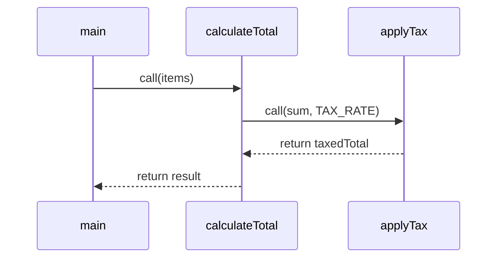
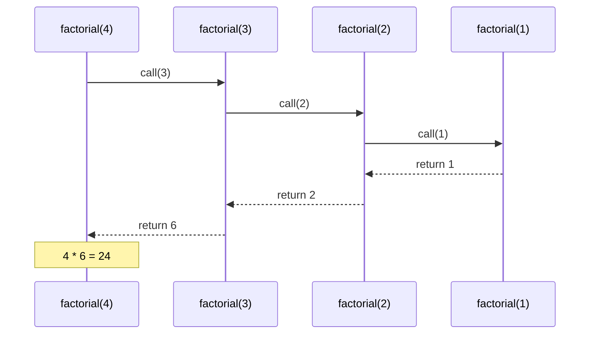

⚡ TL;DR - Functions encapsulate named, reusable logic;
the call stack manages their execution context. Getting
parameter passing, return values, and recursion termination
wrong corrupts program state silently.

| #008 | Category: CS Fundamentals - Paradigms | Difficulty: ★☆☆ |
|:---|:---|:---|
| **Depends on:** | CSF-006 (Variables, Types, Scope), CSF-007 (Control Flow) | |
| **Used by:** | CSF-011 (Imperative), CSF-013 (Procedural), CSF-022 (Functional) | |
| **Related:** | CSF-009 (Errors/Exceptions), CSF-010 (Stack vs Heap) | |

---

### 🔥 The Problem This Solves

**WORLD WITHOUT IT:**

Early machine code was one giant sequence of instructions.
If the same calculation appeared in three places in a
program, those instructions were physically copied three
times. To "call" a subroutine, a programmer manually
saved the return address in a fixed memory location,
jumped to the subroutine, and then jumped back. There
was no hardware support for this pattern - it was purely
a convention that programmers had to implement manually
and consistently.

**THE BREAKING POINT:**

Without formal function support, any non-trivial program
was a flat list of instructions with ad-hoc jump conventions.
"Calling" code in one place from three different contexts
required manually managing three different return addresses.
If you forgot to save the return address, the program
jumped to the wrong location on return. And recursive
calls - calling a subroutine from within itself - were
essentially impossible because there was only one
return address slot.

**THE INVENTION MOMENT:**

The hardware call stack was invented to solve exactly
this problem. When a function is called, the CPU pushes
the return address onto a stack. When the function returns,
the return address is popped. The stack grows naturally
to support nested calls: each call adds a frame; each
return removes one. Recursion becomes natural. Fortran
(1957) had subroutines; Algol 60 (1960) formalized
procedures with local variables allocated on the call stack.
The function became the universal unit of reusable
computation.

**EVOLUTION:**

1957: Fortran subroutines (no recursion, no local variables
on stack - Fortran was statically allocated). 1960: Algol 60
introduces proper recursive procedures with stack frames.
1972: C formalizes function pointers - functions as
first-class values. 1978: Smalltalk makes methods the
only computation unit (everything is a message send).
1994: Java methods inherit C function semantics but
are attached to classes. 2014: Java 8 adds lambda
expressions - anonymous functions as first-class values,
enabling functional programming patterns. 2022: Java 19+
virtual threads mean each "thread" has its own stack
without OS thread overhead.

---

### 📘 Textbook Definition

A function (or method in OOP) is a named, reusable unit
of computation that accepts input parameters, performs
a defined computation, and optionally returns a value.
A procedure is a function that produces side effects
(modifies state) but does not return a value (void
return type in Java). The distinction between function
(pure computation, returns value) and procedure (side
effects, void return) is a key concept in distinguishing
pure functional from imperative styles. The call stack
is the runtime data structure that manages function
activation records (frames): each frame stores local
variables, parameters, and the return address. When
a function calls another, a new frame is pushed; when
it returns, the frame is popped. Recursion exploits
this stack to enable a function to call itself with
a different parameter, trusting the stack to maintain
separate state for each invocation.

---

### ⏱️ Understand It in 30 Seconds

**One line:**
A function is a named box you can give inputs and get
outputs - the call stack is the mechanism that makes
nesting and recursion work without corrupting state.

**One analogy:**

> A function is like a recipe. The recipe name is the
> function name. The ingredients are the parameters.
> The finished dish is the return value. When you use
> a recipe, you get your own cutting board and prep
> space (a new stack frame with local variables) -
> changes to your prep space do not affect anyone else's.
> When you finish, you clean up your space (pop the frame)
> and hand the dish back (return the value). Recursion
> is one recipe that refers to itself as an ingredient -
> e.g., "to make a Matryoshka doll, make a smaller
> Matryoshka doll and put it inside." It works because
> each invocation gets its own prep space.

**One insight:**

Java passes all arguments by VALUE. For primitive types,
this is intuitive - the value is copied. For object
types, the VALUE of the reference is copied. This
means: you can mutate the object that a reference
points to (the mutation is visible to the caller),
but you cannot make the caller's reference variable
point to a different object by reassigning inside the
method. "Pass by reference" would allow the latter.
Java does not do this. The confusion about this single
fact causes hundreds of bugs in every Java codebase.

---

### 🔩 First Principles Explanation

**THE CALL STACK MECHANISM:**

```
┌──────────────────────────────────────────────┐
│             Java Call Stack                  │
│ (grows downward; each call = new frame)      │
├──────────────────────────────────────────────┤
│ Frame: main()                                │
│   local: args, result                        │
│   return address: [OS]                       │
├──────────────────────────────────────────────┤
│ Frame: calculateTotal(items)                 │
│   local: items (ref copy), sum=0             │
│   return address: main:line 12               │
├──────────────────────────────────────────────┤
│ Frame: applyTax(total, rate)                 │
│   local: total (copy), rate (copy)           │
│   return address: calculateTotal:line 8      │
└──────────────────────────────────────────────┘
```



**KEY INVARIANTS:**

1. Each function call gets its own frame. Local variables
   are isolated to the frame - one function cannot see
   another's locals.
2. Parameters are passed by value (Java). Primitive: copy
   of the value. Reference type: copy of the reference
   (address of the object), NOT a copy of the object.
3. When `return` is executed, the frame is popped and
   execution resumes at the stored return address in
   the caller's frame.
4. Stack depth is finite. Each frame occupies stack
   memory. Infinite recursion without a base case
   exhausts stack space: `StackOverflowError`.

**FUNCTION vs PROCEDURE:**

**Function (returns value, should be pure):**
`int sum = calculate(a, b);` - pure computation.

**Procedure (void return, causes side effects):**
`saveToDatabase(order);` - mutates external state,
does not return a value (or returns void).

This distinction matters: pure functions are testable
in isolation, parallelizable, and memoizable. Procedures
are not. Mixing computation and side effects in one
function is the most common source of untestable code.

**THE TRADE-OFFS:**

**Gain from functions:** Encapsulation, reuse, testability.
A well-named function is self-documenting. A pure function
can be tested in isolation. A named function can be
reasoned about from its signature alone.

**Cost:** Function call overhead - pushing/popping a
stack frame. For most code, negligible. For
performance-critical inner loops called millions of
times per second, the JIT inlines small functions
automatically (eliminating the overhead). In rare
hot paths, excessive abstraction can prevent JIT inlining.

**ESSENTIAL vs ACCIDENTAL:**

**Essential:** Every program needs units of reusable
computation. Without named functions, code is duplicated
and unmaintainable.

**Accidental:** The choice between a function returning
a value vs a procedure modifying shared state is
accidental complexity when not deliberate. Java's
preference is functions that return values (immutable
style) over procedures that mutate state.

---

### 🧪 Thought Experiment

**SETUP:**

An interview question: "What does this code print?"

```java
class Counter {
    int count = 0;
    void increment(Counter c) {
        c.count++;     // modifies the object
        c = new Counter(); // reassigns LOCAL reference
        c.count = 100;
    }
}
Counter obj = new Counter();
counter.increment(obj);
System.out.println(obj.count); // prints 1 or 100?
```

**THE ANSWER:** It prints `1`.

**WHY:** Java passes the reference by value.
`increment` receives a copy of the reference to `obj`.
The first line `c.count++` follows the copy to the
same object as `obj` and increments it - this mutation
is visible to the caller. The second line `c = new Counter()`
reassigns the LOCAL copy of the reference to a new object.
`obj` in the caller still points to the original Counter.
The `c.count = 100` modifies the local Counter that no
one else can see. When `increment` returns, only the
`c.count++` side effect survives. Printing `obj.count`
shows `1`.

**THE LESSON:** Mutation through a reference parameter
is visible. Reassignment of the reference parameter
itself is invisible. Confusing these two is the most
common Java parameter-passing bug.

---

### 🎯 Mental Model / Analogy

**THE ENVELOPE ANALOGY FOR JAVA PARAMETER PASSING:**

You have a letter (an object) at address 123 Main St.
Java passes you an envelope containing the address "123 Main St"
(a copy of the reference). You open the envelope, go to
123 Main St, and modify the letter inside (mutating through
the reference - visible to the caller). But if you write
a different address on the envelope (`c = new Counter()`),
the original letter at 123 Main St is unchanged. The caller's
copy of the address still says "123 Main St." You only changed
YOUR copy of the envelope.

**MEMORY HOOK:**

"Functions = recipes. Parameters = copy of ingredient list.
Java passes the photocopy of the map to the object, not the
object itself. You can rearrange the furniture at the address,
but you cannot move the caller's address book to a different house."

---

### 📊 Gradual Depth - Five Levels

**Level 1 - Child:**
A function is a named helper you can use over and over.
You tell it what to work with (inputs), it does its
job, and gives you back an answer (output).

**Level 2 - Student:**
A function has a name, parameter list, and return type.
Calling it creates a new scope for local variables.
`return` sends the result back and ends the function.
Recursion is a function calling itself.

**Level 3 - Professional:**
Java passes primitives by value (copy) and objects by
reference value (copy of the reference). Pure functions
(no side effects, same output for same input) are
testable, memoizable, and parallelizable. Methods in
Java are syntactically functions attached to a class.
Lambda expressions (Java 8+) are anonymous functions.
Stack depth is finite: deep recursion causes
`StackOverflowError`.

**Level 4 - Senior Engineer:**
Function design principles: Single Responsibility (one
function, one reason to change), small and named (a
function should fit on a screen with a name that explains
it). Tell Don't Ask: a method should tell objects what
to do (call their methods) rather than ask for their
data and compute a result externally. Command-Query
Separation (CQS): a function should either return a
value (query) or have a side effect (command), never both.
Violating CQS creates untestable code because calling
the "query" changes state. Java 8+ lambdas as functional
interfaces make functions passable as first-class values,
enabling strategy pattern, callbacks, and function
composition without subclassing.

**Level 5 - Expert:**
The JVM JIT compiler inlines small, hot methods
automatically using bytecode inlining. A method marked
`private`, called frequently, and small enough will have
its bytecode substituted at the call site - no frame
push/pop overhead at all. Intrinsic methods (like
`Math.max`, `System.arraycopy`) are replaced with
CPU-native instructions by the JIT. Tail-call optimization
(TCO) - converting a recursive function's last call
into a loop to prevent stack growth - is NOT done by
the JVM by default. Java requires iterative rewriting
of tail-recursive functions to avoid StackOverflowError
at scale. Scala and Kotlin support `@tailrec` annotations
that enforce TCO at compile time. Java's Project Loom
(virtual threads) changes stack economics: virtual
threads are cheap, but each still has a virtual stack;
deep recursion on a virtual thread still overflows.

*Expert Cues - Level 5:*
The Java Lambda spec (JSR-335) compiles lambdas to
`invokedynamic` bytecode, not to anonymous inner class
instances. This means lambda creation is cheaper than
a new object allocation and the JIT can aggressively
inline them. Understanding this explains why stream
pipelines with many lambdas are often faster than they
look from source code, and why the JVM profiler may
show lambdas merged into the calling function rather
than as separate stack frames.

---

### ⚙️ How It Works (Formal Basis)

**ACTIVATION RECORD (STACK FRAME):**

Each function call creates an activation record on the
call stack. The record contains:
1. Return address - where execution resumes in the caller
2. Saved registers - CPU registers the caller was using
3. Parameters - copies of the argument values
4. Local variables - space allocated for the function's locals
5. Frame pointer - reference to the start of this frame

The stack pointer (SP) tracks the top of the stack.
Pushing a frame: decrement SP by frame size.
Popping a frame: increment SP to restore it.

**RECURSION AND THE STACK:**

```
┌────────────────────────────────────────────┐
│  factorial(4) stack during execution       │
├────────────────────────────────────────────┤
│  factorial(4): n=4, waiting for result     │
│  factorial(3): n=3, waiting for result     │
│  factorial(2): n=2, waiting for result     │
│  factorial(1): n=1 -> returns 1 (base)     │
├────────────────────────────────────────────┤
│  Unwind: 1*2=2 -> 2*3=6 -> 6*4=24 -> done │
└────────────────────────────────────────────┘
```



**JAVA PARAMETER PASSING RULES:**

- `int`, `long`, `double`, `boolean`, `char`, `byte`,
  `short`, `float` - passed by value (copy).
- Any object type (String, List, Order, etc.) - the
  reference (address in heap) is passed by value.
  The object itself is NOT copied.
- Strings are immutable - even though the reference
  is passed, you cannot mutate the String content.
  String methods return new String objects.

---

### 🔄 System Design Implications

**FUNCTION DESIGN AS ARCHITECTURE:**

A codebase's function design is its architecture in
microcosm. Functions that are small, named, and
single-responsibility are evidence of good design at
the small scale. Functions that take 8 parameters,
return void, and mutate three global variables are
evidence of architecture that needs attention.

**WHAT CHANGES AT SCALE:**

At 10x complexity: functions with multiple responsibilities
become the bottleneck. Each change requires understanding
all the responsibilities and testing all paths.
Command-Query Separation violations make it impossible
to test functions in isolation.

At 100x traffic: hot functions (called millions of
times per second) benefit from JIT inlining. Designing
hot-path functions to be small, private, and final
helps the JIT optimize them. At this scale, function
call overhead is measurable.

At 1000x scale (data): recursive functions processing
deeply nested data structures hit StackOverflowError.
The recursion depth limit in the JVM is approximately
500-5000 frames depending on frame size and JVM
settings. Iterative rewriting using an explicit stack
(a `Deque`) is required for deep recursion at scale.

---

### 💻 Code Example

**Example 1 - Wrong vs Right: CQS Violation**

```java
// BAD: violates Command-Query Separation.
// This method both computes a value AND changes state.
// You cannot call it safely in a condition check
// without causing the side effect.
class Cart {
    int itemCount = 0;
    boolean addAndCheck(Item item) {
        items.add(item);     // COMMAND - mutates state
        return items.size() > 10; // QUERY - returns value
    }
}
// Caller:
if (cart.addAndCheck(item)) { // Added item just by checking!
    showWarning();
}

// GOOD: separate command and query
class Cart {
    void add(Item item) {   // COMMAND - mutates, returns void
        items.add(item);
    }
    boolean isOverLimit() { // QUERY - reads, no mutation
        return items.size() > 10;
    }
}
// Caller:
cart.add(item);
if (cart.isOverLimit()) {
    showWarning();
}
```

**Example 2 - Wrong vs Right: Mutating Parameter**

```java
// BAD: Reassigning a parameter reference - caller unchanged.
// Developer expects caller's order to be replaced.
void resetOrder(Order order) {
    order = new Order();  // only changes LOCAL reference
    // caller's 'order' variable still points to original
}

// GOOD: Mutate the object through the reference
void resetOrder(Order order) {
    order.clearItems();  // mutates through reference - visible
    order.setStatus(PENDING);
}
// OR: Return a new object - functional style
Order createReset(Order old) {
    return new Order(); // caller decides whether to use it
}
```

**Testing/Verification:**

Pure functions are trivially testable: same input,
same output, no setup required.

```java
// Pure function - no mocks, no state setup needed
@Test
void testApplyDiscount() {
    double result = PriceCalculator.applyDiscount(100.0, 0.2);
    assertEquals(80.0, result, 0.001);
}
// Procedure (side effect) - needs mocks for verification
@Test
void testSaveOrder() {
    OrderRepository repo = mock(OrderRepository.class);
    service.saveOrder(order, repo);
    verify(repo).save(order); // verify the side effect happened
}
```

---

### ⚠️ Common Misconceptions

| Misconception | Reality |
|---|---|
| Java passes objects by reference | Java passes the VALUE of the reference (the address). This means you can mutate the object through the parameter, but you cannot reassign the caller's variable to point to a different object. There is no true pass-by-reference in Java. |
| A void method cannot have useful tests | Void methods (procedures) cause side effects. You test them by verifying the side effects: did the right method get called? Did the database record change? Did the event get emitted? |
| Recursion is always elegant and slow | Recursion is elegant for naturally recursive problems (tree traversal, divide-and-conquer). For linear recursion on large inputs, it is slower than iteration due to frame overhead AND risks StackOverflowError. The JVM does not do tail-call optimization. |
| A function with more parameters is more flexible | More parameters usually indicate more responsibilities. The ideal function is small, named, and takes 0-3 parameters. Beyond 5 parameters, consider whether the function has too many concerns, or whether the parameters should be a parameter object. |
| Lambdas (Java 8+) are always slower than named methods | Lambdas compile to invokedynamic and are JIT-optimized aggressively. For hot paths, they are often as fast as named method calls. The overhead is in boxing/unboxing of primitive types in generic functional interfaces, not in lambda dispatch itself. |

---

### 🚨 Failure Modes & Diagnosis

**Failure Mode 1: StackOverflowError from Unbounded Recursion**

**Symptom:** `java.lang.StackOverflowError` thrown
from a recursive method. Stack trace shows the same
function repeated hundreds of times.

**Root Cause:** Recursion without a base case, or
a base case that is never reached for the given input.
Common causes: tree traversal on a circular reference
(graph where node A points to B, B points to A),
missing null check before recursion, or off-by-one
in the base case condition.

**Diagnostic Signal:** Stack trace shows the recursive
method repeated until the trace is truncated with
`... N more`. The line number usually points to the
recursive call itself.

```java
// BAD: No base case - infinite recursion
int sum(Node node) {
    return node.value + sum(node.next); // never terminates
}

// GOOD: Base case terminates recursion
int sum(Node node) {
    if (node == null) return 0;      // base case
    return node.value + sum(node.next);
}

// BETTER for deep structures: iterative (no stack limit)
int sum(Node head) {
    int total = 0;
    Node current = head;
    while (current != null) {
        total += current.value;
        current = current.next;
    }
    return total;
}
```

---

**Failure Mode 2: Invisible Mutation via Parameter**

**Symptom:** A collection passed to a method is
unexpectedly modified after the method returns.
Caller code that relies on the collection being
unchanged after the call silently processes stale data.

**Root Cause:** A method that receives an object
reference can mutate the object's state through that
reference. The mutation is visible to the caller and
all other holders of the same reference.

```java
// BAD: Method modifies the caller's collection
void processOrders(List<Order> orders) {
    orders.removeIf(Order::isCancelled); // mutates caller's list!
}

// GOOD: Work on a copy; never mutate input parameters
void processOrders(List<Order> orders) {
    List<Order> active = orders.stream()
        .filter(o -> !o.isCancelled())
        .collect(Collectors.toList()); // new list
    // process active - original orders unchanged
}
```

---

**Security Note:**

Functions that process user input and pass it to other
functions (validators, serializers, parsers) create
a trust boundary. Each function in the chain must
validate its own input - never assume the caller has
validated. A function that passes user-supplied data
directly to a SQL query, shell command, or system call
without validation creates injection vulnerabilities.
The principle: validate at every system boundary, not
just at the top-level entry point.

---

### 🔗 Related Keywords

**Prerequisites (understand these first):**
- `Variables, Types, and Scope` (CSF-006) - variables
  are what parameters and local variables are; scope
  is what defines the function's local space
- `Control Flow` (CSF-007) - functions contain control
  flow; control flow constructs use functions

**Builds On This (learn these next):**
- `Stack vs Heap Memory` (CSF-010) - functions create
  stack frames; objects returned from functions live on
  the heap; understanding this is essential for garbage
  collection
- `Procedural Programming` (CSF-013) - the paradigm
  where functions and procedures are the primary tool
- `Functional Programming` (CSF-022) - functions as
  first-class values, composition, and purity

**Alternatives / Comparisons:**
- `Object-Oriented Programming` (CSF-015) - methods are
  functions attached to objects; OOP adds polymorphism
  (the same method name dispatches to different function
  implementations based on the object's type)

---

### 📌 Quick Reference Card

```
┌────────────────────────────────────────────────────────┐
│ DEFINITION   │ Named, reusable computation unit        │
│              │ with inputs (params) and output (return)│
├──────────────┼─────────────────────────────────────────┤
│ PASSING RULE │ Java: always by value. Primitives = copy│
│              │ Objects = copy of reference (address)   │
├──────────────┼─────────────────────────────────────────┤
│ MUTATION     │ Mutating object THROUGH ref: visible    │
│              │ Reassigning ref variable: NOT visible   │
├──────────────┼─────────────────────────────────────────┤
│ CQS          │ Command: mutates, returns void          │
│              │ Query: reads, returns value, no mutation │
├──────────────┼─────────────────────────────────────────┤
│ STACK FRAME  │ New frame per call; popped on return    │
│              │ Locals are frame-local (isolated)       │
├──────────────┼─────────────────────────────────────────┤
│ RECURSION    │ Must have base case; JVM has ~500-5000  │
│              │ frame limit; no tail-call optimization  │
├──────────────┼─────────────────────────────────────────┤
│ PURE FN TEST │ Same input = same output, no mocks      │
│              │ Procedure: verify side effects via mock │
├──────────────┼─────────────────────────────────────────┤
│ ONE-LINER    │ "Function = named reusable computation; │
│              │ Java passes by value always"            │
├──────────────┼─────────────────────────────────────────┤
│ NEXT EXPLORE │ CSF-010 (Stack/Heap), CSF-022 (Functional)│
└────────────────────────────────────────────────────────┘
```

**If you remember only 3 things:**

1. Java passes arguments BY VALUE. For objects, the value
   is the reference (address). You can mutate the object
   at that address; you cannot change what the caller's
   variable points to.
2. Command-Query Separation: a function should either
   return a value OR have a side effect, never both.
   Mixing these creates untestable, unpredictable code.
3. Recursion in the JVM has a stack depth limit (roughly
   500-5000 frames). Deep recursion on large inputs
   requires iterative rewriting or an explicit stack.

**Interview one-liner:**
"Functions are named reusable units of computation.
In Java, everything is passed by value - including
object references. The call stack manages function
activation frames; each frame has isolated local
variables. Key design rule: Command-Query Separation -
a function should either return a value or cause a
side effect, never both."

---

### 💎 Transferable Wisdom

**Reusable Engineering Principle:**
Command-Query Separation is one of the most powerful
design principles in software. It says that a computation
(query) and a state change (command) should be in
separate functions. This is not just a coding convention -
it is an engineering invariant. Violating CQS means your
tests must anticipate unexpected state changes when they
call "read" functions. This principle applies beyond code:
API design (GET requests should be idempotent read-only;
POST/PUT/DELETE should mutate), database design (read
queries should not change state), and service design
(health check endpoints should have zero side effects).

**Where else this pattern appears:**

- **REST API design** - GET endpoints are "queries"
  (read-only). POST/PUT/DELETE endpoints are "commands"
  (mutate state). Violating this (a GET that creates
  a record) breaks caching, idempotency, and client
  retry logic.
- **Event sourcing** - commands produce events (side
  effects); queries read from projections (read models).
  CQS at the architecture level is called CQRS (Command
  Query Responsibility Segregation).
- **Testing architecture** - pure function tests require
  no mocks; procedure tests require mock verification.
  A service class that mixes computation and side effects
  cannot be tested without mocking every dependency.

**Industry applications:**

- **Service method design** - `OrderService.calculateTotal()`
  is a query (returns value, no side effect). `OrderService.
  placeOrder()` is a command (mutates state, no meaningful
  return value except confirmation). Designing them as
  separate methods with these contracts makes the service
  testable and cacheable.
- **Stream pipelines (Java 8+)** - streams expose the
  functional programming model of functions as first-class
  values. `map()`, `filter()`, and `reduce()` are higher-order
  functions (functions that take functions as parameters).
  The whole pipeline is a composition of function objects -
  the functional extension of the traditional function call.
- **Recursion in parsing** - recursive descent parsers
  (the basis of many language compilers) are recursive
  functions processing nested data (syntax trees). The
  recursion depth matches the nesting depth of the source
  code. A deeply nested piece of code literally causes a
  deeper call stack in the parser.

---

### 💡 The Surprising Truth

Java does not support tail-call optimization (TCO).
Tail-call optimization is a compiler technique that
converts a recursive call in the tail position (last
operation before return) into a loop, eliminating the
stack frame growth. This means that a functionally
elegant recursive function over a list of 100,000
elements will cause a StackOverflowError in Java,
while the equivalent iterative version handles it
trivially. The JVM specification explicitly allows JVM
implementations to perform TCO, but the Sun/Oracle JVM
has never implemented it - by design - because it would
make Java stack traces less informative. Scala,
Kotlin, and Clojure (all JVM languages) solve this:
Scala and Kotlin with `@tailrec` annotations that
error if TCO is not possible, Clojure with `recur`
special form. The Java design choice to sacrifice TCO
for stack trace clarity is one of the most consequential
trade-offs in the language's history.

---

### ✅ Mastery Checklist

**You've mastered this when you can:**

1. **[EXPLAIN]** Draw the call stack for a 4-level
   recursive function call, labeling each frame with
   its local variables, parameters, and return address.
   Explain exactly what happens to each frame when the
   base case is reached and the stack unwinds.

2. **[DEBUG]** Given code where a method receives an
   object parameter and attempts to "reset" it by
   assigning a new object to the parameter variable,
   explain why the caller's variable is unchanged, and
   rewrite the method to achieve the intended effect
   using two different strategies (mutation through
   reference, and functional return).

3. **[DESIGN]** Given an `OrderService` method that
   both calculates a discount and updates the order's
   price in the database, identify the CQS violation,
   separate it into a pure query function and a command
   procedure, and explain how this changes the testing
   strategy for each part.

4. **[BUILD]** Implement a recursive tree traversal
   that identifies and terminates on circular references
   (a cycle in the graph), then refactor it to an
   iterative version using an explicit `Deque` as a
   stack, with equivalent functionality and no risk of
   StackOverflowError.

5. **[EXTEND]** Explain how Java lambda expressions
   (as functional interfaces like `Function<T,R>`,
   `Predicate<T>`, `Consumer<T>`) implement the concept
   of first-class functions, and demonstrate function
   composition using `Function.andThen()` to build
   a pipeline of transformations without any loops.

---

### 🧠 Think About This Before We Continue

**Q1.** A developer writes this method:

```java
boolean login(String username, String password) {
    User user = userRepo.findByName(username);
    if (user != null && user.checkPassword(password)) {
        currentUser = user; // sets global state!
        return true;
    }
    return false;
}
```

This violates CQS. How? What are the testability
consequences? How would you redesign it?

*Hint: The return value (true/false) is a QUERY (read).
Setting `currentUser` is a COMMAND (mutation). Both
happen in the same method. Testing the return value
requires a mocked side effect. Testing the side effect
requires calling what looks like a predicate method.
How would separate `authenticate()` and `setSession()`
methods change the test structure?*

**Q2.** Java's `String.intern()` method is an example
of a method that both returns a value AND has a side
effect (adding the string to the JVM intern pool).
Is this a CQS violation? Is it justified? What are
the consequences for callers who use the return value
without knowing the side effect?

*Hint: Consider the JVM intern pool as a cache. Querying
a cache that adds to itself on cache miss is a common
pattern (memoization, lazy initialization). When is
this acceptable? When is it dangerous? What happens
in a concurrent context when the "side effect" is
not thread-safe?*

**Q3.** The JVM does not perform tail-call optimization.
A developer writes a functional-style recursive solution
for processing a list of 500,000 records (common in
a data pipeline). The code is elegant and passes all
unit tests. What happens in production, and how would
you detect it before it occurs?

*Hint: The stack depth is proportional to the input size.
Unit tests use small test data. Load tests or production
data sizes expose the bug. What does the stack trace look
like? What is the JVM flag that controls stack size
(`-Xss`)? What is the iterative rewrite strategy using
`Deque` as an explicit stack?*

---

### 🎯 Interview Deep-Dive

**Q1: "Explain Java's parameter passing mechanism.
Is Java pass-by-value or pass-by-reference?"**

*Why they ask:* This is a classic Java interview question
where the "obvious" answer ("pass-by-reference for objects")
is wrong. It tests genuine understanding vs surface recall.

*Strong answer includes:*
- Java is ALWAYS pass-by-value - no exceptions.
- For primitive types (int, long, etc.): the value is
  copied into the parameter. Changes to the parameter
  do not affect the caller's variable.
- For object types: the VALUE of the reference (the
  memory address of the object) is copied. The parameter
  holds the same address as the caller's variable.
  Mutations through the parameter (calling methods,
  modifying fields) ARE visible to the caller because
  both sides point to the same object.
- Reassigning the parameter variable (`param = new Foo()`)
  only changes the local copy of the address. The caller's
  variable still points to the original object.
- Demonstration: show the Counter example from the
  Thought Experiment section.

**Q2: "What is Command-Query Separation and why does
it matter for testability?"**

*Why they ask:* Tests design principles knowledge applied
to function design. Separates candidates who understand
WHY design principles exist from those who just know the names.

*Strong answer includes:*
- CQS: a function should either return a value (query -
  reads state, no side effects) or change state (command -
  mutates, returns void). Never both.
- Why testability: queries are testable with just
  `assertEquals(expected, actual)` - no mocking needed
  for pure functions. Commands require mock verification
  (`verify(repo).save(order)` - was the side effect called?).
  When a function mixes both, testing becomes complex:
  you must mock the side effects just to test the return
  value, and vice versa.
- Real-world example: CQS at the architecture level is
  CQRS (Command Query Responsibility Segregation) - used
  in event-sourced systems to separate read and write models.

**Q3: "When would you choose an iterative solution
over a recursive one in Java?"**

*Why they ask:* Tests depth of understanding of recursion
trade-offs in a production JVM context (not just
"recursion is elegant").

*Strong answer includes:*
- When the input size is large (> a few thousand elements):
  the JVM does not perform tail-call optimization. Each
  frame consumes stack space. 100,000-deep recursion causes
  StackOverflowError.
- When the problem has a known iterative solution with
  O(1) space complexity vs O(n) stack space for recursion.
  Example: factorial iteratively uses O(1) space; recursively
  uses O(n) stack frames.
- Iterative rewrite pattern: replace the recursive call
  with a `Deque<State>` used as an explicit stack. Push
  the initial state; loop while the deque is non-empty;
  pop state, process, push child states. Produces identical
  results with heap-allocated stack (no OS stack limit).
- When recursion IS appropriate: naturally recursive
  structures (tree traversal, divide-and-conquer algorithms)
  where the depth is bounded (tree height, log n). In these
  cases, recursion is clearer and the depth is safe.

> Entry stub. Generate full content using Master Prompt v4.0.