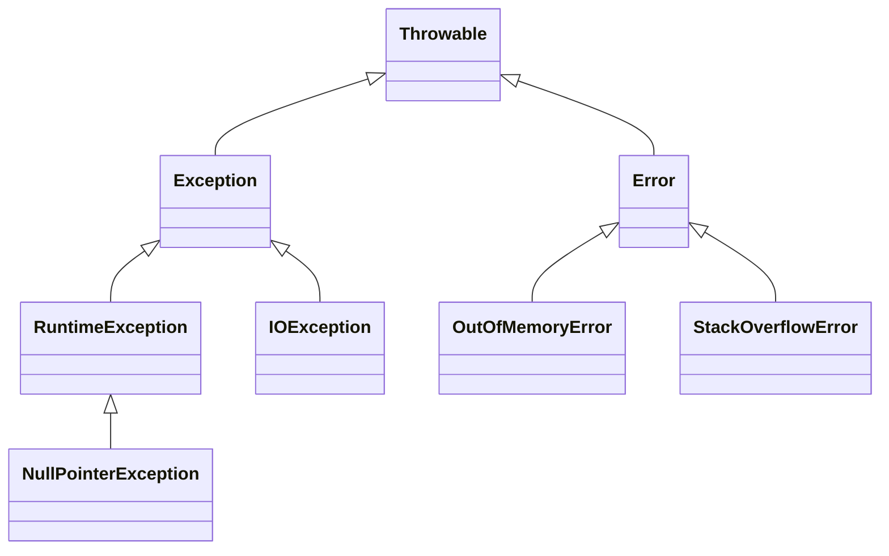
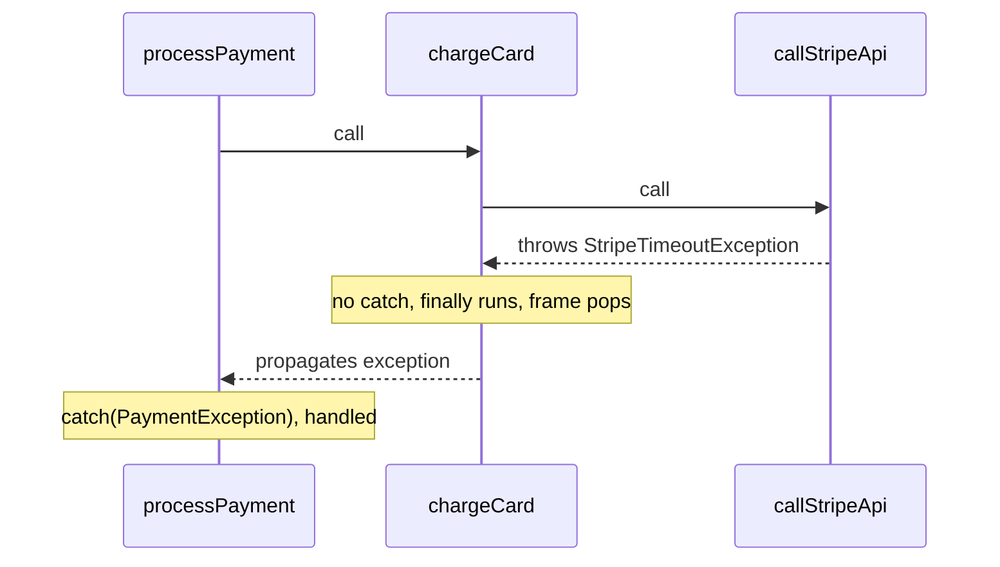

⚡ TL;DR - In Java, Error signals JVM-level failures you
cannot recover from; Exception signals application-level
failures you should handle. Misclassifying them leads
to swallowed exceptions, empty catch blocks, or catching
the uncatchable.

| #009 | Category: CS Fundamentals - Paradigms | Difficulty: ★☆☆ |
|:---|:---|:---|
| **Depends on:** | CSF-007 (Control Flow), CSF-008 (Functions) | |
| **Used by:** | CSF-010 (Stack/Heap), JLG-004 (Exception Handling) | |
| **Related:** | JCC-012 (Concurrency Exceptions), JVM-010 (OOM) | |

---

### 🔥 The Problem This Solves

**WORLD WITHOUT IT:**

Early languages (C, Fortran) had no exception mechanism.
Functions signaled failure through return codes:
`int result = processOrder(); if (result == -1) { ... }`.
This had three catastrophic failure modes: (1) callers
could ignore return codes - silence meant success even
when the operation failed, (2) every function call
needed an if/else to check the code, creating deep
nesting, (3) there was no way to propagate failure
automatically - each level had to manually check and
forward error codes up the call stack.

**THE BREAKING POINT:**

A system processing 10 nested function calls needed
10 levels of error code propagation. A missed check
at any level meant the error was swallowed. In safety-
critical systems (nuclear control, aviation), a swallowed
error code caused catastrophic failures. The C standard
library's `errno` global variable was the canonical
example: a function set `errno` on failure, but nothing
forced the caller to check it.

**THE INVENTION MOMENT:**

Structured exception handling - try/catch/finally - was
formalized in CLU (1975, Barbara Liskov) and adopted
in Ada (1983), C++ (1989), and Java (1995). The
innovation: exceptions are thrown up the call stack
automatically until caught. A function does not need
to check return codes - if it does not catch an exception,
it propagates automatically. The `finally` block ensures
cleanup regardless of whether an exception occurred.

**EVOLUTION:**

Java added a distinction unique among major languages:
checked exceptions (must be declared with `throws` or
caught at compile time) vs unchecked exceptions (no
compile-time requirement). Java also added a three-level
hierarchy: `Throwable` - `Error` - vs - `Exception`.
Java 7 added try-with-resources (`AutoCloseable`),
eliminating the most common finally block misuse
(forgetting to close resources on exception). Java 9+
improved exception chaining and suppressed exceptions.
Java 21's virtual threads changed how exceptions from
background tasks propagate in structured concurrency.

---

### 📘 Textbook Definition

In Java, `Throwable` is the root of the exception
hierarchy. `Error` is a subclass of `Throwable` representing
serious JVM-level conditions (out of memory, stack overflow,
class loading failure) that applications typically cannot
and should not try to recover from. `Exception` is a
subclass of `Throwable` representing conditions that a
well-written application may wish to catch and handle.
`Exception` is further divided into `RuntimeException`
(unchecked - not required to be declared or caught) and
all other Exceptions (checked - must be declared in the
method signature with `throws` or caught). The Java
compiler enforces the checked/unchecked distinction:
a method that calls code throwing a checked exception
must either catch it or declare `throws ExceptionType`
in its signature.

---

### ⏱️ Understand It in 30 Seconds

**One line:**
Error = JVM is broken and cannot continue; Exception =
application hit a recoverable problem it should handle.

**One analogy:**

> Exceptions are like customer complaints in a restaurant.
> A "checked exception" is a known complaint (the kitchen
> ran out of an ingredient) - the waiter (method signature)
> must tell the manager (caller) about it so they can
> handle it (substitute or apologize). A "RuntimeException"
> is a complaint the restaurant could have prevented by
> checking first (customer allergic to something you
> always stock). An "Error" is the building being on
> fire (`OutOfMemoryError`) - you cannot serve customers
> and there is no recovery procedure. Trying to catch
> a burning building (`catch (Error e)`) with a "sorry,
> we'll try again" response is inappropriate.

**One insight:**

The most common exception handling mistake in production
Java code is not the inability to handle exceptions -
it is swallowing them. An empty `catch (Exception e) {}`
is one of the most dangerous lines of code in any
codebase. It converts a detectable failure into an
invisible one. The thread continues executing with
corrupted state, and the symptom appears far from the
cause. Every catch block that does not re-throw MUST
at minimum log the exception with its full stack trace.

---

### 🔩 First Principles Explanation

**THE JAVA THROWABLE HIERARCHY:**

```
┌──────────────────────────────────────────────┐
│ java.lang.Throwable                          │
│   │                                          │
│   ├── Error (do NOT catch in app code)       │
│   │     ├── OutOfMemoryError                 │
│   │     ├── StackOverflowError               │
│   │     ├── VirtualMachineError              │
│   │     └── AssertionError                   │
│   │                                          │
│   └── Exception                              │
│         ├── RuntimeException (unchecked)     │
│         │     ├── NullPointerException       │
│         │     ├── IllegalArgumentException   │
│         │     ├── IndexOutOfBoundsException  │
│         │     └── ClassCastException         │
│         │                                    │
│         └── Checked Exceptions (must handle)│
│               ├── IOException               │
│               ├── SQLException              │
│               └── ClassNotFoundException    │
└──────────────────────────────────────────────┘
```



**CHECKED vs UNCHECKED - THE CONTRACT:**

Checked exceptions encode a CONTRACT: "This method
may fail in this way, and the caller MUST acknowledge
this possibility." The compiler enforces the acknowledgment.

```
Method declares: throws IOException
Caller must: catch IOException OR declare throws IOException
```

Unchecked exceptions (RuntimeException and subclasses)
encode PROGRAMMING ERRORS: "This should not have happened
at all - if it did, the code has a bug." There is no
point in declaring or catching `NullPointerException`
everywhere - the fix is to not pass null where it is
not expected.

**EXCEPTION PROPAGATION MECHANICS:**

```
┌──────────────────────────────────────────────┐
│  Exception Propagation Up the Call Stack     │
├──────────────────────────────────────────────┤
│ processPayment()    throws PaymentException  │
│   -> calls chargeCard()                      │
│       -> calls callStripeApi()               │
│           -> THROWS StripeTimeoutException   │
│                                              │
│ No catch in callStripeApi(): propagates up   │
│ No catch in chargeCard(): propagates up      │
│ CAUGHT in processPayment(): handles it       │
│                                              │
│ Stack unwinds: each frame popped until catch │
│ finally{} blocks run on EACH frame as it pops│
└──────────────────────────────────────────────┘
```

**THE TRADE-OFFS:**

**Gain from checked exceptions:** The caller is forced
to think about failure. External failures (I/O, network,
database) are explicitly visible in the API signature.

**Cost:** Checked exceptions create "exception tunneling"
- low-level checked exceptions (like `SQLException`) must
be either caught and wrapped or declared all the way up
the call stack, creating coupling between layers. This
is why many frameworks (Spring) convert checked exceptions
to unchecked (`DataAccessException`).

**ESSENTIAL vs ACCIDENTAL:**

**Essential:** Some failures are recoverable (retry on
timeout) and some are not (out of memory). This distinction
is real and must be represented.

**Accidental:** The checked/unchecked distinction in Java
is a language-level mechanism to enforce this distinction.
Other languages (Python, Kotlin, Go) make different choices.
The distinction is essential; Java's specific enforcement
mechanism is one design choice.

---

### 🧪 Thought Experiment

**SETUP:**

A payment service method calls a database and a Stripe API.
Four things can go wrong:

1. Database is unreachable (`SQLException`)
2. Stripe API times out (`SocketTimeoutException`)
3. Customer's card is declined (`CardDeclinedException`)
4. The input order ID is null (`NullPointerException`)

**QUESTION:** For each failure, should you:
(a) throw a checked exception?
(b) throw an unchecked (RuntimeException)?
(c) return an error code (Result<T, Error>)?
(d) catch and swallow?

**ANSWER:**

1. Database unreachable - (a) or (b) with wrapping: the
   caller might retry. Convert to a domain-specific
   unchecked `PaymentInfrastructureException`. Log the
   original `SQLException`.

2. Stripe timeout - (a) or (b) depending on whether the
   caller can meaningfully retry. `PaymentTimeoutException`
   extending RuntimeException. Caller handles retry logic.

3. Card declined - This is a DOMAIN EVENT, not an error.
   The payment failed for a known business reason. Use
   a domain-specific checked exception (`CardDeclinedException`)
   or return a `PaymentResult` value object. The caller
   must handle this case.

4. Null order ID - (b) `IllegalArgumentException`:
   this is a programming error. The caller should not
   pass null. No recovery is needed - it is a bug to be fixed.

**Never** (d) swallow any of these.

---

### 🎯 Mental Model / Analogy

**THE SEVERITY LADDER:**

```
Severity 1 (Error): Building is on fire.
  -> Evacuate. Do not try to serve customers.

Severity 2 (Checked Exception): Kitchen ran out of special.
  -> Tell the customer. Offer an alternative. Document it.

Severity 3 (Runtime Exception): Waiter spilled the drink.
  -> Apologize. Clean up. Fix the process to prevent recurrence.

Severity 4 (Swallowed): Customer complains; waiter ignores.
  -> Invisible. Customer leaves angry. Management never knows.
```

**MEMORY HOOK:**

"ERROR = JVM Emergency. EXCEPTION = Application Alert.
RUNTIME = Code Bug. CHECKED = Known Risk with Contract."
Never swallow. Always log. Catch the SPECIFIC type, not
the broadest superclass.

---

### 📊 Gradual Depth - Five Levels

**Level 1 - Child:**
When something goes wrong in a program, it can "throw"
an exception - like raising a hand to say "help!".
Another part of the program can "catch" it and decide
what to do. If nobody catches it, the program crashes.

**Level 2 - Student:**
`try { risky code } catch (SomeException e) { handle it }
finally { always runs }`. Errors are for JVM problems
(no memory, stack overflow). Exceptions are for program
problems. RuntimeExceptions are for programming mistakes.
Checked Exceptions must be declared or caught.

**Level 3 - Professional:**
Never catch and swallow. Catch the MOST SPECIFIC type.
Convert low-level checked exceptions to domain-specific
unchecked for cross-layer propagation. Always include
the original exception as the cause
(`new DomainException("message", originalException)`).
Use `try-with-resources` for `AutoCloseable` resources
to guarantee closing even on exception. Never catch
`Error` or `Throwable` in application code.

**Level 4 - Senior Engineer:**
Exception hierarchy design is an API contract. Checked
exceptions say "caller must handle this specific failure."
Unchecked exceptions say "this is a programming error;
fix the code." Most modern Java frameworks (Spring,
Hibernate) use unchecked exceptions because checked
exception propagation creates layer coupling. The
debate between checked vs unchecked is an engineering
philosophy debate, not a technical correctness debate.
Multi-catch (`catch (IOException | SQLException e)`) reduces
duplicated catch blocks for multiple exception types with
the same handler. Exception chaining preserves the root
cause through multiple layers of wrapping. `Throwable.
getSuppressed()` handles exceptions thrown in finally
blocks or try-with-resources (both the resource close
exception AND the original are preserved).

**Level 5 - Expert:**
Java's checked exceptions are unique in the language
landscape. The "throws" clause is part of the method
signature and therefore part of the interface contract.
Changing from `throws IOException` to unchecked breaks
callers (removing a throws clause is backwards-compatible;
adding one is a breaking change). Exception transparency
(a called method leaking its checked exception types
through the caller's API) is a real API design problem.
The solution: at domain layer boundaries, translate
infrastructure exceptions into domain exceptions. The
domain layer never exposes `SQLException` or `IOException`
in its interface. In concurrent contexts (`CompletableFuture`,
virtual threads), unchecked exceptions propagate cleanly;
checked exceptions inside lambdas require special
handling (`try { } catch { throw new RuntimeException(e); }`
wrapping) because `Runnable.run()` and most functional
interfaces do not declare `throws`. This is a language
design friction point that Project Loom partially addresses
with `StructuredTaskScope`.

*Expert Cues - Level 5:*
The JVM itself uses `Error` for situations like
`OutOfMemoryError` where the JVM cannot allocate objects
needed for normal operation. Catching `OutOfMemoryError`
and continuing is extremely dangerous: the JVM state is
unknown after an OOM. The typical correct response is
to let the JVM crash (the JVM will write a heap dump
if `-XX:+HeapDumpOnOutOfMemoryError` is set), restart
the process, and analyze the heap dump offline. Some
JVM frameworks (Akka, certain Kafka consumers) do
catch `Throwable` to cleanly shut down actors or consumers,
but this is a framework-level concern, not application code.

---

### ⚙️ How It Works (Formal Basis)

**EXCEPTION TABLE IN BYTECODE:**

When the Java compiler compiles a try/catch block, it
generates an exception table in the bytecode. Each entry
in the table records: start PC, end PC, handler PC, and
the exception class type. When an exception is thrown,
the JVM looks through the exception table to find the
first handler whose class matches the thrown exception
type AND whose PC range covers the current instruction.
If no handler is found in the current method, the frame
is popped, the exception is re-thrown, and the search
continues in the caller's exception table.

**THE STACK UNWIND:**

```
┌────────────────────────────────────────────┐
│       Stack Unwind on Exception            │
├────────────────────────────────────────────┤
│                    [Exception thrown here] │
│ Frame: callStripeApi() -> no catch -> pop  │
│   finally{}: log attempt (runs on pop)     │
│ Frame: chargeCard()   -> no catch -> pop   │
│   finally{}: close connection (runs)       │
│ Frame: processPayment() -> MATCH catch     │
│   catch (PaymentException e): handle       │
│   finally{}: runs after catch              │
└────────────────────────────────────────────┘
```



**TRY-WITH-RESOURCES MECHANISM (Java 7+):**

```java
// try-with-resources:
try (Connection conn = dataSource.getConnection()) {
    // use conn
}
// Equivalent to:
Connection conn = dataSource.getConnection();
Throwable primary = null;
try {
    // use conn
} catch (Throwable t) {
    primary = t;
    throw t;
} finally {
    if (primary != null) {
        try {
            conn.close();
        } catch (Throwable suppressed) {
            primary.addSuppressed(suppressed);
        }
    } else {
        conn.close();
    }
}
```

The key detail: if both the try body and the close()
throw, the original exception is preserved as the primary
and the close() exception is added as a suppressed
exception (retrievable via `getSuppressed()`). Without
try-with-resources, naive finally blocks would lose
the original exception if close() also threw.

---

### 🔄 System Design Implications

**EXCEPTION DESIGN AT DOMAIN LAYER BOUNDARIES:**

A well-designed service exposes domain exceptions in its
API, never infrastructure exceptions. The service layer
catches `SQLException` (infrastructure) and throws
`OrderPersistenceException` (domain). The caller knows
the domain contract; it does not know or care that the
implementation uses SQL.

**WHAT CHANGES AT SCALE:**

At 10x requests: exceptions in hot paths are expensive.
Creating an exception object captures a full stack trace.
For high-frequency validation errors (e.g., invalid
request format), the exception creation overhead is
measurable. Design option: return a validation result
object (not an exception) for expected validation failures.
Reserve exceptions for unexpected failures.

At 100x traffic: exception propagation from external
services (timeouts, downstream failures) can cascade.
Circuit breakers (Resilience4j, Hystrix) catch exceptions
from downstream services and open the circuit - preventing
cascading failures. The circuit breaker wraps exception
handling in a system-level pattern.

---

### 💻 Code Example

**Example 1 - Wrong vs Right: Swallowing vs Wrapping**

```java
// BAD: Swallowed exception - silent failure
// The exception is caught but nothing is done.
// Code continues with partial/corrupted state.
void processOrder(Order order) {
    try {
        validateOrder(order);
        chargePayment(order);
        saveOrder(order);
    } catch (Exception e) {
        // Silent catch - nobody knows this failed
    }
}

// BAD: Printing stack trace instead of proper handling
// Works in development; in production, nobody reads stdout
void processOrder(Order order) {
    try {
        validateOrder(order);
        chargePayment(order);
    } catch (Exception e) {
        e.printStackTrace(); // goes to stdout, not log system
    }
}

// GOOD: Log with context, preserve cause, decide recovery
void processOrder(Order order) {
    try {
        validateOrder(order);
        chargePayment(order);
        saveOrder(order);
    } catch (PaymentDeclinedException e) {
        // Known domain failure: log as WARN, not ERROR
        log.warn("Payment declined for order {}:{}",
            order.getId(), e.getMessage());
        throw e; // re-throw for the caller to present to user
    } catch (InfrastructureException e) {
        // Infrastructure failure: log as ERROR with trace
        log.error("Failed to process order {}",
            order.getId(), e);
        throw new OrderProcessingException(
            "Order processing failed", e); // wrap with cause
    }
}
```

**Example 2 - Wrong vs Right: Catching Too Broad**

```java
// BAD: Catches too broad a type - catches programming errors
// (NullPointerException, IllegalStateException) mixed with
// infrastructure errors (IOException), hiding bugs
try {
    processPayment(order);
} catch (Exception e) { // catches EVERYTHING - too broad
    log.warn("Payment issue: " + e.getMessage());
    return PaymentResult.RETRY;
}

// GOOD: Catch the SPECIFIC types you expect and handle each
try {
    processPayment(order);
} catch (PaymentDeclinedException e) {
    return PaymentResult.declined(e.getMessage());
} catch (PaymentTimeoutException e) {
    return PaymentResult.RETRY;
} catch (RuntimeException e) {
    // Unexpected: log as ERROR, do not retry, alert on-call
    log.error("Unexpected payment error", e);
    throw e; // re-throw: do not hide programming errors
}
```

---

### ⚖️ Comparison Table

| Type | When to Use | When to Catch | When to NOT Catch |
|---|---|---|---|
| `Error` | Never create in app code | Almost never | Application code should not catch Errors |
| `RuntimeException` | Programming errors (null args, bad state) | Rarely, at top-level handlers only | Do not catch to hide bugs |
| `IOException` (checked) | I/O failures that callers should know about | When you can recover or wrap | Do not catch and swallow |
| Domain Exception (unchecked) | Application-level failures (card declined) | In the caller that can handle it | Lower layers should re-throw |
| Checked vs Unchecked | API contract requires explicit acknowledgment (checked) vs programming error (unchecked) | Always catch the most specific type | Never catch `Exception` or `Throwable` in business logic |

---

### ⚠️ Common Misconceptions

| Misconception | Reality |
|---|---|
| Catching `Exception` is safe and comprehensive | Catching `Exception` (or worse, `Throwable`) hides bugs. `NullPointerException` is a programming error; catching it and continuing is like ignoring a fire alarm. Catch the MOST SPECIFIC type you expect. |
| An empty catch block is harmless | An empty catch block converts a detectable failure into an invisible one. The thread continues with unknown state. This is one of the most dangerous antipatterns in Java. At minimum, log the exception. |
| `finally` always runs before `return` | If the JVM is killed (`System.exit()`), or a hardware failure occurs, `finally` does not run. The guarantee is "finally runs when the try block exits normally or via exception." It does not run on JVM-level shutdown. |
| Checked exceptions mean the method can fail; unchecked means it cannot | ALL methods can fail. Checked exceptions mean "the caller should PLAN for this specific failure." Unchecked means "this failure indicates a programming error; fix the code, not the call site." |
| Wrapping exceptions loses information | `new WrapperException("msg", originalException)` preserves the original as the "cause". `e.getCause()` returns it. Logging frameworks print the full causal chain. Wrapping adds domain context WITHOUT losing the root cause. |

---

### 🚨 Failure Modes & Diagnosis

**Failure Mode 1: Exception Swallowing in Production**

**Symptom:** An operation returns a "success" response
but the expected side effect never happened (order not
saved, email not sent, payment not recorded). No error
in logs.

**Root Cause:** An empty or near-empty catch block
somewhere in the call chain.

**Diagnostic Signal:** Check for `catch (Exception e) {}`
or `catch (Exception e) { log.warn(e.getMessage()); }`.
The `getMessage()` call loses the stack trace entirely.
Use static analysis (SpotBugs `DE_MIGHT_IGNORE` detector,
SonarQube "empty catch block" rule) to find these.

```java
// Pattern to find:
} catch (Exception e) {
    // empty - or just: log.warn(e.getMessage())
}

// Fix:
} catch (SpecificException e) {
    log.error("Operation failed with context: {}", context, e);
    throw new DomainException("Failed to ...", e);
}
```

---

**Failure Mode 2: Resource Leak on Exception**

**Symptom:** File handles, database connections, or
network sockets accumulate over time. Eventually the
JVM hits "Too many open files" or the connection pool
is exhausted.

**Root Cause:** A resource is opened in the try block
but not closed in a finally block. When an exception
is thrown, the flow jumps to the catch block, skipping
the close() call.

**Diagnostic Signal:** `java.net.SocketException: Too many open files`.
The JVM heap dump shows growing collections of unclosed
`InputStream` or `Connection` objects. Thread dump shows
connection pool exhaustion.

```java
// BAD: close() never called on exception
Connection conn = dataSource.getConnection();
try {
    Statement stmt = conn.createStatement();
    stmt.execute(sql);
    conn.close();  // skipped if execute() throws!
} catch (SQLException e) {
    log.error("Query failed", e);
}

// GOOD: try-with-resources guarantees close()
try (Connection conn = dataSource.getConnection();
     Statement stmt = conn.createStatement()) {
    stmt.execute(sql);
} catch (SQLException e) {
    log.error("Query failed with sql: {}", sql, e);
}
```

---

**Security Note:**

Exception messages can expose sensitive information.
A `SQLException` message may include the full SQL query
(which might contain user-supplied values or schema details).
A stack trace reveals internal class names, package
structure, and library versions - information useful
for targeted attacks.

Mitigation: NEVER expose raw exception messages or
stack traces to external callers (HTTP API responses,
UI error messages). Log the full detail internally.
Return a generic error message externally (`"An internal
error occurred. Reference: [error-id]"`). Use a unique
error ID to correlate the external error report with
the internal log entry.

---

### 🔗 Related Keywords

**Prerequisites (understand these first):**
- `Control Flow` (CSF-007) - exception handling is
  structured control flow (try/catch/finally are control
  flow constructs)
- `Functions and Procedures` (CSF-008) - exceptions
  propagate through the call stack; understanding frames
  is required to understand exception propagation

**Builds On This (learn these next):**
- `Stack vs Heap Memory` (CSF-010) - exceptions create
  objects on the heap; stack traces walk the call stack
- `Java Exception Handling` (JLG-004) - complete Java-
  specific exception handling: multi-catch, try-with-
  resources, exception chaining, custom exception design

**Alternatives / Comparisons:**
- `Result types` (e.g., Vavr's `Either<Error, T>`,
  `Optional<T>`) - functional alternative to exceptions
  for expected failures; makes failure explicit in the
  return type; avoids exception overhead for high-
  frequency validation failures

---

### 📌 Quick Reference Card

```
┌────────────────────────────────────────────────────────┐
│ HIERARCHY    │ Throwable -> Error (JVM) / Exception    │
│              │ Exception -> RuntimeException / Checked  │
├──────────────┼─────────────────────────────────────────┤
│ Error        │ JVM-level; do NOT catch in app code      │
│              │ (OOM, StackOverflow, VirtualMachineError)│
├──────────────┼─────────────────────────────────────────┤
│ RuntimeEx.   │ Programming error; fix the code, not    │
│              │ the catch block                          │
├──────────────┼─────────────────────────────────────────┤
│ Checked Ex.  │ Known external failure; must be caught  │
│              │ or declared; convert to domain exception │
├──────────────┼─────────────────────────────────────────┤
│ SWALLOW RULE │ NEVER empty catch block. Always log      │
│              │ the full exception object (not getMessage)│
├──────────────┼─────────────────────────────────────────┤
│ RESOURCE     │ ALWAYS use try-with-resources for        │
│              │ AutoCloseable (Connection, Stream, etc.) │
├──────────────┼─────────────────────────────────────────┤
│ WRAPPING     │ new DomainEx("context", originalEx)      │
│              │ preserves cause; add domain context      │
├──────────────┼─────────────────────────────────────────┤
│ ONE-LINER    │ "Error = JVM broken; Exception = handle  │
│              │ it; RuntimeException = fix the bug"      │
├──────────────┼─────────────────────────────────────────┤
│ NEXT EXPLORE │ JLG-004 (Exception Handling in Java)     │
└────────────────────────────────────────────────────────┘
```

**If you remember only 3 things:**

1. Never swallow exceptions. An empty `catch` block is
   more dangerous than letting the exception propagate.
   At minimum, log with the full exception object
   (`log.error("message", e)` - not `e.getMessage()`).
2. Catch the most specific type. Catching `Exception`
   or `Throwable` in business logic hides bugs and
   makes failures invisible.
3. Use try-with-resources for anything that implements
   `AutoCloseable`. Forgetting to close resources on
   exception is one of the most common Java resource
   leak patterns.

**Interview one-liner:**
"In Java, Error signals JVM-level failure (do not catch).
Exception splits into RuntimeException (programming errors,
unchecked) and checked exceptions (known external failures,
must be declared or caught). The most dangerous pattern
is an empty or over-broad catch block that swallows failures
silently. Always log the full exception object, catch the
most specific type, and use try-with-resources for resource
management."

---

### 💎 Transferable Wisdom

**Reusable Engineering Principle:**
Fail loudly, fail early, fail with context. An exception
that propagates to the top of the stack with a full chain
of causes (each wrapping layer adding domain context)
is 100x easier to diagnose than a silently swallowed
exception that manifests as a missing database record
three minutes later. This principle extends to every
system: a microservice that returns HTTP 500 with a
correlation ID is better than one that returns HTTP 200
with partial data. Make failures visible, named, and
traceable.

**Where else this pattern appears:**

- **Circuit breakers** - catch exceptions from a
  downstream service, count them, and "open the circuit"
  (stop calling the service) when the failure rate
  exceeds a threshold. This is structured exception
  handling at the system level.
- **Saga pattern** - in distributed transactions, each
  step declares its compensating action (rollback).
  When a step throws an exception, the saga coordinator
  invokes the compensating actions in reverse order -
  distributed exception handling.
- **HTTP error codes** - 4xx (client error, like checked
  exception: caller did something wrong) vs 5xx (server
  error, like RuntimeException: server-side unexpected
  failure). The analogy is direct.

**Industry applications:**

- **Spring's exception translation** - Spring converts
  `SQLException`, `HibernateException`, etc. to its own
  `DataAccessException` hierarchy (all unchecked). This
  prevents infrastructure exception types from leaking
  into the service layer. It is the framework-level
  implementation of "convert checked infrastructure
  exceptions to unchecked domain exceptions at the
  layer boundary."
- **Payment processing** - card declined (`CardDeclinedException`
  as a checked/domain exception) vs payment processor
  unavailable (`PaymentInfrastructureException` as an
  unchecked) vs null payment amount (`IllegalArgumentException`
  as a programming error) are three distinct exception
  types requiring three distinct responses. Collapsing
  all three to `catch (Exception e)` makes it impossible
  to distinguish user error from infrastructure failure
  from programming bug.

---

### 💡 The Surprising Truth

Java is the only mainstream programming language with
compiler-enforced checked exceptions - and this decision
remains one of the most debated language design choices
in software engineering. James Gosling (Java's creator)
has said he still believes checked exceptions were the
right choice. Yet every major Java framework (Spring,
Hibernate, Guava) wraps all checked exceptions in unchecked
ones because checked exceptions cause "exception tunneling" -
forcing every layer to declare or catch lower-level exceptions.
C#, Kotlin, Scala, Python, Ruby, and Go all chose not to
enforce checked exceptions at the compiler level. The Go
language's `(result, error)` return tuple is arguably
the functional equivalent of checked exceptions without
the compile-time machinery. After 30 years of experience,
the software industry has not reached consensus on whether
checked exceptions are a net benefit or a net burden.

---

### ✅ Mastery Checklist

**You've mastered this when you can:**

1. **[EXPLAIN]** Draw the Java Throwable hierarchy,
   place 10 specific exception types in it, and for
   each explain whether it is checked or unchecked,
   and when (if ever) application code should catch it.

2. **[DEBUG]** Given a production incident where an
   operation silently fails (no error in logs, no
   exception visible to the caller), identify the three
   most likely root causes in the exception handling
   chain and describe how to use static analysis tools
   to find the swallowed exception.

3. **[DESIGN]** For a payment service that calls three
   external systems (database, payment processor, email
   service), define the exception hierarchy: which exceptions
   to use for each failure mode, which to make checked
   vs unchecked, how to handle wrapping at layer boundaries,
   and what information to include in each exception message.

4. **[BUILD]** Implement a database operation using
   try-with-resources with proper exception handling:
   distinguish between retryable and non-retryable failures,
   wrap the checked `SQLException` in a domain-specific
   unchecked exception with context, and verify the
   resource is closed in all paths using a test that
   throws from inside the try block.

5. **[EXTEND]** Design a REST API global exception
   handler (Spring's `@ControllerAdvice`) that maps
   domain exception types to HTTP status codes, logs
   the full exception internally with a correlation ID,
   returns a safe external error message (no stack trace,
   no internal detail), and handles Error-level exceptions
   by returning 503 and triggering an alert.

---

### 🧠 Think About This Before We Continue

**Q1.** A service catches a `PaymentDeclinedException`
and logs `log.warn(e.getMessage())`. A week later,
production has a bug where payments fail silently in some
cases. Investigation reveals that the `getMessage()` returns
null for a subclass of `PaymentDeclinedException`. The
warn log shows "null" and the developer assumed it was a
different issue. What are the two bugs here, and how would
proper exception logging have prevented this?

*Hint: `log.warn(e.getMessage())` loses the exception type,
stack trace, and any cause chain. Compare to `log.warn("Payment
declined for order {}", orderId, e)` which logs the full
exception object. The second bug: catching the parent class
when a subclass with different behavior exists. What does this
mean for exception hierarchy design?*

**Q2.** A `try-with-resources` block has both the resource
initialization (`new Connection()`) and the resource body
throw exceptions. What exception is thrown, and what happens
to the other exception? How does `getSuppressed()` help?
Why does this matter for production debugging?

*Hint: The primary exception is the one thrown from the
try body. The close() exception is added as a suppressed
exception on the primary. If you only log `e.getMessage()`
you miss the suppressed exception entirely. When does this
matter in production? When a transaction commit fails AND
the connection close fails in the same request.*

**Q3.** Spring's `@Transactional` annotation only rolls
back transactions on `RuntimeException` by default, NOT
on checked exceptions. This means a method throwing a
checked `IOException` inside a transaction COMMITS the
transaction even though the operation failed. How does
this interact with the checked vs unchecked exception
design choice? How would you configure Spring to also
rollback on checked exceptions?

*Hint: `@Transactional(rollbackFor = Exception.class)`.
Why is this not the default? What does it say about
Spring's expectation of checked exceptions (expected,
recoverable, not necessarily a reason to rollback)?
When is the default correct, and when does it create
data consistency bugs?*

---

### 🎯 Interview Deep-Dive

**Q1: "What is the difference between checked and
unchecked exceptions in Java, and when would you use each?"**

*Why they ask:* Tests Java language knowledge and
exception design philosophy.

*Strong answer includes:*
- Checked: compiler-enforced. The method declares
  `throws IOException` and callers must handle or
  propagate. Use for external failures the caller
  can meaningfully respond to (file not found, DB
  unreachable).
- Unchecked (RuntimeException): no compile-time enforcement.
  Use for programming errors (null argument, invalid state)
  where the fix is in the code, not in the caller's
  error handling.
- The framework trend: most modern Java frameworks
  use unchecked to avoid exception tunneling. The
  debate between checked and unchecked is a design
  philosophy question, not a technical correctness one.
- Strong answer: describe the layer-boundary pattern -
  catch checked at infrastructure layer, wrap in domain-
  specific unchecked, throw the unchecked from the domain.

**Q2: "What is the most dangerous exception handling
antipattern you have seen in production code, and what
is the correct fix?"**

*Why they ask:* Tests production experience and judgment.
Candidates who have not worked in production often
give textbook answers. Experienced engineers have stories.

*Strong answer includes:*
- The empty catch block or `log.warn(e.getMessage())`
  pattern. Describe the actual failure mode: operation
  appears to succeed, side effect never happens, symptom
  appears far from cause, no log evidence.
- The too-broad catch block: `catch (Exception e)` that
  catches `NullPointerException` and retries - converting
  a bug into a retry loop that masks the root cause.
- The fix: catch specific types, log the full exception
  object, preserve the cause chain when wrapping.
- Bonus: mention `e.getMessage()` vs `log.error("msg", e)`
  - the former logs only the message; the latter logs
  the full exception including type, message, cause chain,
  and stack trace.

**Q3: "A production service is running out of database
connections. What exception handling issue could cause this,
and how would you diagnose and fix it?"**

*Why they ask:* Tests the connection between exception
handling and resource management - a common production issue.

*Strong answer includes:*
- Root cause: `Connection` not closed on exception path.
  The code calls `getConnection()`, uses it in a try block,
  and calls `close()` at the end. But if the try body
  throws, `close()` is never called. The connection is
  returned to the pool only when garbage collected (which
  may be much later, or may not happen before the pool
  is exhausted).
- Diagnosis: thread dump shows many threads waiting for
  connection pool. Heap dump shows many `Connection` objects
  not in pool. Connection pool monitoring (HikariCP metrics)
  shows `getConnection()` wait time growing.
- Fix: use try-with-resources. Any `AutoCloseable` resource
  must be in a try-with-resources to guarantee `close()` in
  all exit paths.
- Bonus: mention that modern connection pools (HikariCP)
  have a `connectionTimeout` that fails fast instead of
  waiting indefinitely, and `keepaliveTime` to detect
  leaked connections.

> Entry stub. Generate full content using Master Prompt v4.0.