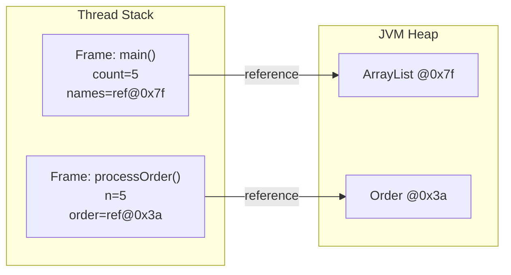
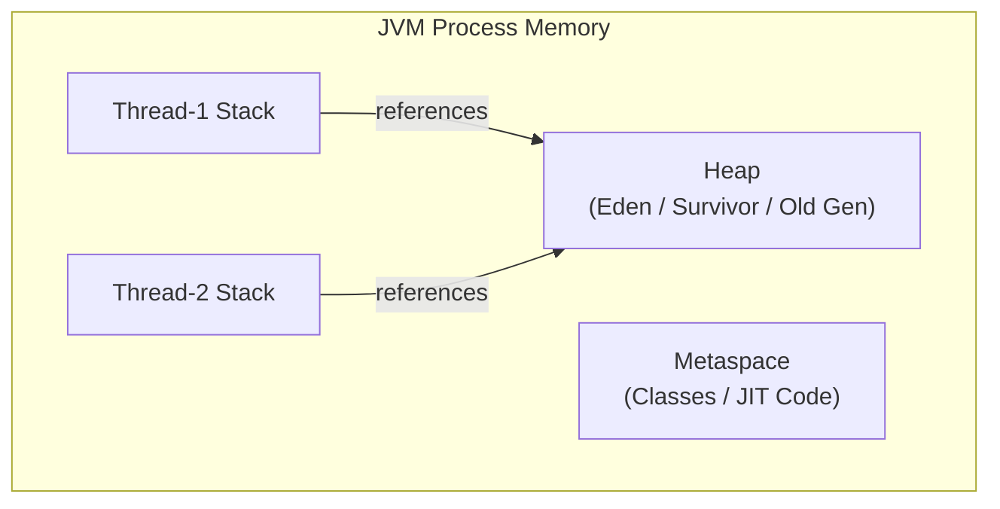

⚡ TL;DR - The call stack stores function frames (local
variables, primitives) with automatic lifetime; the heap
stores objects with garbage-collected lifetime. Confusing
them leads to StackOverflowError, OutOfMemoryError, or
memory leaks.

| #010 | Category: CS Fundamentals - Paradigms | Difficulty: ★★☆ |
|:---|:---|:---|
| **Depends on:** | CSF-008 (Functions), CSF-009 (Error/Exception) | |
| **Used by:** | JVM-001 (JVM Architecture), JVM-010 (GC), JCC-001 | |
| **Related:** | JVM-004 (JIT), DSA-002 (Arrays), OSY-007 (Virtual Memory) | |

---

### 🔥 The Problem This Solves

**WORLD WITHOUT IT:**

Early computers had flat memory - one undifferentiated
block of RAM. Every program variable lived in a fixed
location (static allocation). Subroutines could not have
local variables because there was no dynamic allocation
mechanism. Recursive functions were impossible - a
function's one fixed memory slot could not be "on the
stack" twice at once. And dynamic data structures (linked
lists, trees, variable-size arrays) were impossible
because you could not allocate memory at runtime.

**THE BREAKING POINT:**

The limitations became a crisis as programs grew complex:
(1) You could not write recursive algorithms at all.
(2) You could not have multiple instances of the same
subroutine active at once (no multitasking). (3) You
could not build dynamic data structures whose size was
determined at runtime. The entire class of "data-driven"
programs was impossible with static allocation only.

**THE INVENTION MOMENT:**

The call stack was invented (along with the hardware
`PUSH`/`POP` instructions) to solve subroutine linkage.
A stack pointer register tracks the top of a Last-In-
First-Out structure. Each function call allocates a new
frame at the top (push); each return deallocates it (pop).
The heap was invented for dynamic allocation (`malloc`
in C). The key insight: give programs two memory regions
with complementary properties - the stack (automatic
lifetime, LIFO, fast) and the heap (dynamic lifetime,
arbitrary structure, flexible).

**EVOLUTION:**

C: manual `malloc()`/`free()`. C++: constructors/destructors,
RAII. Java (1995): garbage-collected heap - no manual
free. The GC automatically reclaims heap objects when no
references exist. JVM divides heap into young generation
and old generation for generational collection efficiency.
Java 11+: G1GC as default collector. Java 15+: ZGC for
sub-millisecond pause times. Java 21: virtual threads
(Project Loom) - each virtual thread has its own virtual
stack, enabling millions of lightweight stacks where OS
threads would be limited to thousands.

---

### 📘 Textbook Definition

The call stack (or execution stack) is a per-thread,
LIFO data structure that stores activation records (frames)
for active function calls. Each frame contains: the
function's local variables, its parameters, its return
address, and saved registers. Memory is automatically
allocated on function call and deallocated on function
return. Stack size is fixed at thread creation (typically
512KB-8MB). The heap is a per-JVM dynamic memory region
from which object instances are allocated at runtime. The
JVM's garbage collector periodically reclaims heap
memory occupied by objects that are no longer reachable
from any live reference. In Java: all primitive local
variables (`int`, `double`, `boolean`, etc.) and object
references live on the stack (in the current frame);
all object instances live on the heap. The reference on
the stack points to the object on the heap.

---

### ⏱️ Understand It in 30 Seconds

**One line:**
Stack = automatic local scratch pad for each function call
(fast, limited, dies with the call). Heap = shared pool
for objects that outlive a single function (flexible,
large, GC-managed).

**One analogy:**

> The stack is a whiteboard in a meeting room. When a
> meeting (function call) starts, you get a fresh section
> of whiteboard. Notes written there (local variables) are
> visible only to that meeting. When the meeting ends
> (function returns), the section is wiped clean
> automatically. The heap is a shared filing cabinet in
> the hallway. Any meeting can create a file (new object),
> put it in the cabinet, and multiple meetings can hold
> a reference (card with the drawer number). The file
> stays in the cabinet until nobody holds a reference card
> anymore (garbage collection). The whiteboard is fast
> but limited in size. The filing cabinet is large but
> needs a janitor to periodically remove old files (GC pause).

**One insight:**

When you write `List<String> names = new ArrayList<>();`
in Java: `names` is a local variable (a 4-byte or 8-byte
reference) that lives on the STACK. The `ArrayList` object
(with its backing array, size, etc.) lives on the HEAP.
The stack variable holds the address of the heap object.
When the enclosing method returns, the stack frame is
gone - the reference is gone. If no other variable
references the `ArrayList`, it becomes eligible for GC.
This single mental model explains why objects can "escape"
methods (by being assigned to a field or returned), why
local variables cannot be accessed after method return,
and why the GC never touches the stack.

---

### 🔩 First Principles Explanation

**STACK MECHANICS:**

```
┌───────────────────────────────────────────────┐
│   JVM Call Stack (one per thread)             │
│   Stack Pointer (SP) -> top of stack          │
├───────────────────────────────────────────────┤
│ Frame: main()                                 │
│   int count = 5          [stack]              │
│   List names = ref@0x7f  [stack: ref to heap] │
│   return address: OS     [stack]              │
├───────────────────────────────────────────────┤
│ Frame: processOrder(count)                    │
│   int n = 5              [stack: copy]        │
│   Order order = ref@0x3a [stack: ref to heap] │
│   return address: main:L8 [stack]             │
├───────────────────────────────────────────────┤
│ [Stack grows downward; SP moves down on push] │
└───────────────────────────────────────────────┘

HEAP (shared across all threads):
  @0x7f: ArrayList [size=0, elementData=[...]]
  @0x3a: Order [id=1, status=PENDING, items=[...]]
```



**KEY PROPERTIES:**

| Property | Stack | Heap |
|---|---|---|
| Lifetime | Automatic (frame push/pop) | GC-managed |
| Size | Fixed at thread start (~512KB-1MB default) | Configurable (-Xmx), GBs possible |
| Allocation speed | O(1) - just move SP | Slower (find free space, GC overhead) |
| Deallocation | Automatic on return | GC (non-deterministic timing) |
| Thread isolation | Each thread has its own stack | Shared across all threads |
| What lives here | Primitives, references, frames | Objects, arrays, String content |

**ESCAPE ANALYSIS:**

Modern JIT compilers (Java 6+) perform escape analysis:
if an object is created in a method and never "escapes"
(never assigned to a field, never returned, never passed
to another thread), the JIT can allocate it ON THE STACK
instead of the heap. This eliminates GC pressure for short-
lived objects. Developers cannot control this directly, but
small, method-local, non-escaping objects benefit from it
automatically. JVM flag `-XX:+PrintEscapeAnalysis` shows
what is being stack-allocated.

**THE TRADE-OFFS:**

**Stack gains:** Zero GC overhead. Allocation is one
decrement of the stack pointer. Deallocation is one
increment. Cache-friendly (contiguous memory). Fast.

**Stack cost:** Fixed, small size. Deep recursion or large
local arrays overflow it. Lifetime is exactly the function
call - variables cannot outlive their frame.

**Heap gains:** Dynamic size. Objects can outlive the
function that created them. Arbitrary size and structure.

**Heap cost:** GC overhead (stop-the-world pauses in
older collectors, concurrent pauses in modern ones). 
Fragmentation over time. Object header overhead (8-16 bytes
per object for GC metadata). Not cache-friendly for
random access patterns.

**ESSENTIAL vs ACCIDENTAL:**

**Essential:** The split between short-lived local
computation (stack) and long-lived shared data (heap)
is fundamental to how programs work.

**Accidental:** The exact size limits, GC algorithms,
and escape analysis implementation are JVM-specific
optimizations. A developer who understands the essential
model can reason about behavior; a developer who only
knows the JVM specifics cannot generalize.

---

### 🧪 Thought Experiment

**SETUP:**

A developer writes a recursive method to sum all nodes
in a binary tree:

```java
int sumTree(Node node) {
    if (node == null) return 0;
    return node.value + sumTree(node.left)
                      + sumTree(node.right);
}
```

The tree is balanced with 10,000 nodes. In production
it crashes with `StackOverflowError`. The developer
increases `-Xss` (stack size) and it works. Then a
tree with 100,000 nodes crashes again.

**QUESTIONS:**

1. Why does this recursion exhaust the stack?
2. What does each recursive call put on the stack?
3. What is the maximum tree depth before overflow,
   and how would you calculate it?
4. How would you rewrite it to use O(1) stack space?

**ANSWERS:**

1. Each call to `sumTree()` creates a new stack frame.
   A balanced 10,000-node tree has depth ~14 (log2(10000)).
   That is 14 frames. But the ACTUAL max depth during
   traversal can be up to the tree height, not node count.
   A degenerate tree (linked list) of 10,000 nodes has
   depth 10,000 - causing 10,000 nested frames = overflow.

2. Each frame holds: `node` reference (8 bytes), `return
   address` (8 bytes), saved registers, and the pending
   computation (`node.value + partial sum`). Approximately
   50-100 bytes per frame.

3. Default JVM stack is ~512KB. At 100 bytes/frame: ~5,000
   frames max. A degenerate tree of 5,000 nodes overflows.

4. Iterative with explicit stack (Deque):
```java
int sumTree(Node root) {
    if (root == null) return 0;
    Deque<Node> stack = new ArrayDeque<>();
    stack.push(root);
    int sum = 0;
    while (!stack.isEmpty()) {
        Node n = stack.pop();
        sum += n.value;
        if (n.left != null)  stack.push(n.left);
        if (n.right != null) stack.push(n.right);
    }
    return sum; // O(n) time, O(height) heap space
}
```
The explicit `Deque` on the heap can grow to any size
(limited by `-Xmx`), while the call stack is fixed small.

---

### 🎯 Mental Model / Analogy

**HOTEL ROOM vs WAREHOUSE:**

The stack is a hotel room. When you check in (function
call), you get a room with a fresh set of standard
furniture (stack frame: parameters, locals, return address).
The room is yours for exactly as long as you are there.
When you check out (return), the room is automatically
cleaned and re-prepared for the next guest. The hotel has
limited rooms (fixed stack size).

The heap is a public warehouse. You can rent any amount
of space for as long as you need (dynamic allocation).
Multiple people can have keys to the same storage unit
(multiple references to the same object). The warehouse
management (GC) periodically checks which units have no
active key holders and reclaims them. The warehouse is
large but requires management overhead.

**MEMORY HOOK:**

"Stack = local scratch, dies with the call.
Heap = shared storage, lives until GC.
Primitive local variable = in the room.
Object = in the warehouse.
Local reference = your key to the warehouse."

---

### 📊 Gradual Depth - Five Levels

**Level 1 - Child:**
The stack is a to-do list that grows and shrinks as
functions call each other. The heap is a big storage
room where objects live until nobody needs them anymore.

**Level 2 - Student:**
Local variables and primitives live on the stack. Objects
live on the heap. In Java, `new` always allocates on the
heap. When a method returns, its stack frame is removed.
GC cleans up heap objects when nothing references them.

**Level 3 - Professional:**
In Java, a local variable like `int x = 5` is on the
stack. `String s = new String("hello")` puts the reference
`s` on the stack but the String object on the heap.
Stack overflow (`StackOverflowError`) means too many
nested calls. Heap overflow (`OutOfMemoryError: Java heap
space`) means too many live objects. `-Xss` sets stack size
per thread; `-Xmx` sets max heap size. Each thread has its
own stack. All threads share the heap.

**Level 4 - Senior Engineer:**
Object header in HotSpot JVM: 12-16 bytes per object
(mark word for GC/hashcode, class pointer). This overhead
is significant for small objects. A million `Point(x,y)`
objects each cost 16 bytes of header + 8 bytes of field
data = 24 bytes each = 24MB just for headers. Consider
primitive arrays or value objects (Java 18+ Valhalla project
aims to eliminate this for value types). Thread-local
allocation buffers (TLABs): each thread has a private
slice of young generation heap for fast object allocation
without synchronization - this is why `new` in Java is
much faster than `malloc` in C in concurrent scenarios.
Escape analysis allows stack allocation of non-escaping
objects transparently.

**Level 5 - Expert:**
Virtual threads (Java 21, Project Loom) decouple the
concept of "thread stack" from OS threads. A virtual
thread has a virtual stack that starts small (a few KB)
and grows on demand (unlike platform threads with fixed
512KB-8MB stacks). When a virtual thread blocks (waiting
for I/O), its stack is "unmounted" from the carrier thread
and stored on the heap as a stack chunk object. The carrier
thread is freed to run another virtual thread. This makes
millions of virtual threads feasible where millions of
platform threads would exhaust memory (each platform thread
= one fixed stack = potentially 8MB). The cost: more GC
pressure from stack chunk objects being promoted to old
generation during long blocking operations.

*Expert Cues - Level 5:*
JVM Metaspace (replacing PermGen in Java 8+): class
metadata, method bytecodes, and JIT-compiled code live
in Metaspace (native memory outside the Java heap).
Metaspace leaks happen with excessive class loading
(common in applications that generate classes dynamically,
like some AOP frameworks or template engines). Metaspace
overflow: `OutOfMemoryError: Metaspace`. This is distinct
from heap OOM and has a different diagnosis path (check
class loader count, look for class generation loops).

---

### ⚙️ How It Works (Formal Basis)

**JVM MEMORY REGIONS:**

```
┌──────────────────────────────────────────────┐
│               JVM Memory Map                 │
├──────────────────────────────────────────────┤
│  Heap (all threads share)                    │
│  ┌─────────────────────────────────────────┐ │
│  │  Young Generation (Eden + S0 + S1)      │ │
│  │  Old Generation (Tenured)               │ │
│  └─────────────────────────────────────────┘ │
├──────────────────────────────────────────────┤
│  Metaspace (native memory, no heap limit)    │
│  ┌────────────────────────────────────────┐  │
│  │  Class metadata, method bytecodes       │  │
│  │  JIT-compiled code cache               │  │
│  └────────────────────────────────────────┘  │
├──────────────────────────────────────────────┤
│  Per-Thread Stacks                           │
│  Thread-1 Stack | Thread-2 Stack | ...       │
│  [Frame][Frame] | [Frame][Frame] | ...       │
└──────────────────────────────────────────────┘
```



**GC ROOT SCANNING:**

The GC starts from "GC roots" - references that are
always considered live: local variables in active stack
frames, static fields of loaded classes, JNI handles.
From each GC root, the GC traverses all references
(breadth-first or depth-first depending on collector).
Any heap object reachable from a GC root is "live" and
cannot be collected. Any heap object NOT reachable from
any GC root is unreachable and eligible for collection.

This is why local variables matter: a local variable
that holds a reference IS a GC root. When the method
returns and the frame is popped, the local variable
disappears - the object may now be unreachable.

---

### 🔄 System Design Implications

**MEMORY REGION CHOICE AS DESIGN DECISION:**

For high-throughput applications, minimizing heap
allocations in hot paths reduces GC pressure. This
means: avoiding `new Object()` inside tight loops,
reusing buffers instead of allocating new ones per
request, using primitive arrays instead of collections
of boxed types, and structuring data as arrays-of-structs
rather than structs-of-arrays to improve locality.

**WHAT CHANGES AT SCALE:**

At 10x complexity: multiple GC algorithms with different
trade-offs (Serial, Parallel, G1GC, ZGC, Shenandoah).
Choosing the right collector for latency-sensitive vs
throughput-optimized applications is an engineering
decision with measurable impact.

At 100x traffic: GC pause times directly impact p99
latency. A 200ms G1GC pause at p99 under load is
visible to users. ZGC and Shenandoah target sub-millisecond
pauses at the cost of higher CPU overhead for concurrent
collection work.

At 1000x scale: heap tuning. Proper young/old generation
sizing prevents premature promotion. Improper sizing causes
frequent old-gen GC (full GC) which is the most expensive
and longest-pausing GC event.

---

### 💻 Code Example

**Example 1 - Wrong vs Right: Large Array as Local Variable**

```java
// BAD: Allocating a 10MB array on the stack.
// Local arrays in Java are REFERENCES on the stack,
// but the array DATA is on the heap. This works, but
// allocating a large array repeatedly in a hot method
// creates massive GC pressure.
void processRequest() {
    byte[] buffer = new byte[10_000_000]; // 10MB per call!
    // ... use buffer ...
}
// If this is called 100 times/second: 1GB/sec allocation rate
// -> GC runs constantly, pauses pile up

// GOOD: Reuse a buffer (pool pattern)
class RequestProcessor {
    // allocated once, reused across calls
    private final byte[] buffer = new byte[10_000_000];

    void processRequest() {
        Arrays.fill(buffer, (byte) 0); // reset between uses
        // ... use buffer ...
    }
}
// 0 bytes allocated per call -> 0 GC pressure from buffer
```

**Example 2 - Wrong vs Right: Memory Leak via Static Reference**

```java
// BAD: Static list accumulates objects; nothing removes them.
// GC cannot collect them because the static field is a GC root.
// This is the canonical Java memory leak pattern.
class OrderCache {
    // Static field = always a GC root = objects never collected
    private static List<Order> processedOrders = new ArrayList<>();

    void process(Order order) {
        doProcess(order);
        processedOrders.add(order); // LEAK: never removed
    }
}

// GOOD: Use bounded cache with eviction policy
class OrderCache {
    // Fixed size; evicts oldest entries automatically
    private static final int MAX_SIZE = 1000;
    private final Map<String, Order> cache =
        Collections.synchronizedMap(
            new LinkedHashMap<>(MAX_SIZE, 0.75f, true) {
                protected boolean removeEldestEntry(
                    Map.Entry<String, Order> e) {
                    return size() > MAX_SIZE;
                }
            }
        );
}
```

**Failure Example:**

```java
// StackOverflowError: classic infinite recursion
int fib(int n) {
    return fib(n-1) + fib(n-2); // no base case!
}

// OutOfMemoryError: object accumulation
List<byte[]> hog = new ArrayList<>();
while (true) {
    hog.add(new byte[1024 * 1024]); // adds 1MB objects forever
}
// java.lang.OutOfMemoryError: Java heap space
```

---

### ⚠️ Common Misconceptions

| Misconception | Reality |
|---|---|
| Objects can live on the stack in Java | In standard Java, objects ALWAYS live on the heap. Local variables live on the stack, but if that variable is a reference type, the REFERENCE is on the stack while the object is on the heap. Escape analysis may allow JIT to stack-allocate small non-escaping objects, but this is invisible to the developer. |
| `new` in Java is as slow as `malloc` in C | Java's TLAB (Thread-Local Allocation Buffer) makes `new` near-constant-time in most cases - just a pointer bump in the TLAB. The cost is amortized across GC cycles. For a single small allocation, `new` in Java is often faster than `malloc`. |
| Increasing heap size (-Xmx) always helps OOM | OOM can be caused by a memory LEAK (objects accumulate faster than GC can collect). Increasing heap only delays the inevitable. The real fix is finding what is holding references to objects that should be GC'd. Heap dump analysis with VisualVM or Eclipse Memory Analyzer (MAT) identifies the leak source. |
| StackOverflowError means your stack is too small | Sometimes, but usually it means infinite or excessive recursion. The default stack is usually sufficient for correctly bounded recursion. The fix is usually adding a base case or converting to iteration, not increasing -Xss. |
| Each Java thread has the same amount of memory | Each thread has its own stack (sized by -Xss, default 512KB-1MB per platform thread). All threads share the heap (-Xmx). Virtual threads (Java 21) start with a much smaller initial stack (~few KB) that grows on demand from the heap. |

---

### 🚨 Failure Modes & Diagnosis

**Failure Mode 1: StackOverflowError**

**Symptom:** `java.lang.StackOverflowError` with a stack
trace showing the same method repeated hundreds of times.

**Root Cause:** Unbounded recursion. Either no base case,
or a base case that is unreachable for the given input.

**Diagnostic Signal:** Stack trace shows repeated frames.
Adding `System.out.println(depth)` to the recursive method
reveals infinite depth.

**Fix:**
1. Add/fix the base case.
2. If the recursion is legitimately deep (deep trees),
   convert to iterative using an explicit `Deque`.
3. Increasing `-Xss` is a workaround, not a fix - it
   delays the error, it does not eliminate the cause.

```java
// Iterative DFS using explicit Deque (any depth)
void traverse(Node root) {
    Deque<Node> stack = new ArrayDeque<>();
    if (root != null) stack.push(root);
    while (!stack.isEmpty()) {
        Node n = stack.pop();
        process(n);
        if (n.right != null) stack.push(n.right);
        if (n.left  != null) stack.push(n.left);
    }
}
```

---

**Failure Mode 2: OutOfMemoryError - Java Heap Space**

**Symptom:** `java.lang.OutOfMemoryError: Java heap space`.
Application slows (GC thrashing), then crashes.

**Root Cause:**
(a) Legitimate: the application's data simply requires
more heap than allocated. Fix: increase `-Xmx`.
(b) Memory leak: objects are retained by references (static
collections, listeners not unregistered, ThreadLocal
not cleaned). Fix: find and remove the retaining reference.

**Diagnostic Signal:**
- GC log (`-Xlog:gc*`) shows back-to-back full GC events.
- `jstat -gc <pid>` shows old generation at 100%.
- Heap dump (`jmap -dump:format=b,file=heap.hprof <pid>`
  or `-XX:+HeapDumpOnOutOfMemoryError`) analyzed in
  Eclipse MAT reveals the "dominator tree" - which objects
  hold the most heap.

```
# Diagnose OOM - take a heap dump:
jmap -dump:format=b,file=/tmp/heap.hprof $(pgrep java)

# Analyze in Eclipse MAT:
# File -> Open Heap Dump -> Leak Suspects Report
# Look for: large retained sets, unexpected object counts
```

---

**Security Note:**

HeapDump files are a severe security risk. They contain
the complete state of the JVM heap at capture time, including
in-memory plaintext passwords, API keys, session tokens,
PII from database queries, and TLS private keys cached
in memory. Heap dumps enabled by `-XX:+HeapDumpOnOutOfMemoryError`
are written to the working directory by default (often
accessible to unauthorized users). Security controls:
specify a secure dump path (`-XX:HeapDumpPath=/secure/path`),
restrict file permissions, and treat heap dump files as
secrets - encrypt before storing, never commit to source
control, delete after analysis.

---

### 🔗 Related Keywords

**Prerequisites (understand these first):**
- `Functions and Procedures` (CSF-008) - function calls
  create stack frames; understanding call mechanics is
  prerequisite to understanding stack allocation
- `Error vs Exception` (CSF-009) - StackOverflowError
  and OutOfMemoryError are the primary failure modes;
  understanding the Error/Exception hierarchy contextualizes
  these failures

**Builds On This (learn these next):**
- `JVM Architecture` (JVM-001) - the complete JVM memory
  model including Metaspace, code cache, and native memory
- `Garbage Collection` (JVM-010) - how the GC manages heap
  lifetime: young/old generation, GC roots, collection
  algorithms
- `Java Concurrency Basics` (JCC-001) - each thread has
  its own stack; thread safety concerns arise because
  the heap is shared

**Alternatives / Comparisons:**
- `Virtual Threads` (JCC-020) - Java 21's Loom: virtual
  threads have virtual stacks stored on the heap, enabling
  millions of lightweight threads where OS threads are
  limited to thousands

---

### 📌 Quick Reference Card

```
┌────────────────────────────────────────────────────────┐
│ STACK        │ Per-thread, LIFO, auto lifetime         │
│              │ Stores: frames, primitives, references  │
├──────────────┼─────────────────────────────────────────┤
│ HEAP         │ Shared, GC-managed, dynamic lifetime    │
│              │ Stores: all objects (new Foo())         │
├──────────────┼─────────────────────────────────────────┤
│ SIZES        │ Stack: -Xss (512KB-1MB default)         │
│              │ Heap: -Xms (init), -Xmx (max)           │
├──────────────┼─────────────────────────────────────────┤
│ SOE CAUSE    │ Unbounded recursion / no base case       │
│              │ Fix: add base case, convert to iterative │
├──────────────┼─────────────────────────────────────────┤
│ OOM CAUSE    │ Leak (objects held by unintended refs)  │
│              │ or legitimate data growth -> increase Xmx│
├──────────────┼─────────────────────────────────────────┤
│ OOM DIAGNOSE │ -XX:+HeapDumpOnOutOfMemoryError         │
│              │ then Eclipse MAT / VisualVM to find leak │
├──────────────┼─────────────────────────────────────────┤
│ KEY RULE     │ Local var reference -> stack            │
│              │ Object instance -> always heap           │
├──────────────┼─────────────────────────────────────────┤
│ ONE-LINER    │ "Stack = fast local scratch; Heap =      │
│              │ managed shared store; both can overflow" │
├──────────────┼─────────────────────────────────────────┤
│ NEXT EXPLORE │ JVM-001 (JVM Architecture), JVM-010 (GC) │
└────────────────────────────────────────────────────────┘
```

**If you remember only 3 things:**

1. In Java, all objects are ALWAYS on the heap. Local
   variable primitives and references are on the stack.
   The reference (address) is on the stack; the object
   (data) is on the heap.
2. StackOverflowError = recursion without bound. Fix:
   add base case or convert to iterative with explicit
   Deque. OutOfMemoryError = too many live heap objects.
   Fix: find and remove the retaining reference.
3. Enable `-XX:+HeapDumpOnOutOfMemoryError` in production
   (with a secure path). When OOM happens, you get a
   single chance to capture the heap state. Without the
   dump, the crash is undiagnosable.

**Interview one-liner:**
"The stack stores function frames (local variables,
primitives, references) with automatic lifetime - scoped
to the function call. The heap stores all objects with
GC-managed lifetime. StackOverflowError means too-deep
recursion; OutOfMemoryError means too many live heap
objects. Diagnosis: jstack for SOE, heap dump + Eclipse MAT
for OOM."

---

### 💎 Transferable Wisdom

**Reusable Engineering Principle:**
Allocation strategy determines GC behavior. Reducing
short-lived allocations in hot paths is one of the most
effective performance optimizations in Java applications
- not by making code faster per se, but by reducing GC
frequency and pause times. The principle: "Don't allocate
what you can reuse." This applies beyond Java - buffer
pools, connection pools, and thread pools all embody the
same idea: allocation is expensive; reuse is cheap.

**Where else this pattern appears:**

- **Connection pools** (HikariCP, DBCP) - database
  connections are expensive to create. A pool pre-allocates
  N connections (heap objects) and reuses them across
  requests. This is the heap analog of the "reuse a buffer"
  pattern.
- **Thread pools** (Executors.newFixedThreadPool) - threads
  have fixed stacks. Creating millions of threads exhausts
  memory. Pools reuse threads across tasks. Virtual threads
  (Java 21) change the economics but not the principle.
- **Off-heap memory** (ByteBuffer.allocateDirect, Netty
  DirectByteBuf) - for truly performance-critical paths,
  allocate outside the Java heap entirely. No GC involvement.
  Used in high-throughput network I/O, database systems,
  and trading platforms. The trade-off: manual lifetime
  management (like C) with Java-speed code.

**Industry applications:**

- **High-frequency trading** - GC pauses are existential.
  Systems use object pools, primitive collections (instead
  of `List<Integer>` which boxes every int), and pre-allocated
  ring buffers. Stack allocation via escape analysis is
  maximized by keeping hot objects small and method-local.
- **Android development** - the Android ART runtime has
  strict heap constraints. Android Lint warns on allocations
  in `onDraw()` (called 60 times/second) because each
  allocation triggers GC that causes a frame drop visible
  to the user.
- **Microservice tuning** - JVM startup heap size and max
  heap for containerized microservices must match the
  container's memory limit. If `-Xmx` is not set and
  the JVM uses its default (25% of physical RAM), a
  container with 512MB RAM gets a 128MB heap - which
  may be too small. The common fix: set
  `-XX:MaxRAMPercentage=75.0` to let the JVM use 75%
  of container memory dynamically.

---

### 💡 The Surprising Truth

Java's `new` keyword is faster than C's `malloc()` for
object allocation in concurrent applications - and has
been for over 15 years. The reason: Java's Thread-Local
Allocation Buffer (TLAB). Each thread has a private
section of young-generation heap. Allocation is just
a pointer increment in that private section - no locking,
no memory search, O(1) and cache-hot. C's `malloc()` must
maintain a thread-safe free list and find a block of
appropriate size - this requires locking or complex
lock-free algorithms and is O(log n) in the general case.
The JVM's GC "pays" for this fast allocation by doing
periodic bulk deallocation (collection cycles) rather than
per-object deallocation. This is why "avoid allocations
in Java" is advice about GC pressure (reducing pause
frequency), not about the cost of individual `new` calls.

---

### ✅ Mastery Checklist

**You've mastered this when you can:**

1. **[EXPLAIN]** For a given Java method with mixed
   local primitives, object references, and a new object
   creation, draw the exact memory layout: which items
   are in the stack frame, which are in the heap, and
   what happens to each when the method returns.

2. **[DEBUG]** Given a `StackOverflowError` in a
   production application with a truncated stack trace
   showing 50 identical frames, determine: (a) the
   recursive method causing it, (b) the input condition
   that triggers it, and (c) whether to fix the base
   case, convert to iteration, or increase `-Xss`.

3. **[DIAGNOSE]** Given an application with gradually
   increasing heap usage that eventually crashes with
   `OutOfMemoryError`, use `jstat -gc <pid>` and
   `-XX:+HeapDumpOnOutOfMemoryError`, analyze the heap
   dump in Eclipse MAT to identify the object type
   with the largest retained size and trace it to the
   retaining reference chain.

4. **[DECIDE]** For a high-throughput service that
   processes 100K requests/second, each creating a
   1KB temporary byte array, decide: (a) is this a
   GC pressure concern? (b) would object pooling help?
   (c) would switching to a ByteBuffer improve things?
   (d) would virtual threads change the analysis?

5. **[EXTEND]** Configure a production JVM for a
   latency-sensitive service: choose between G1GC and
   ZGC, set appropriate -Xms, -Xmx, enable heap dump
   on OOM with a secure path, add GC logging for
   operational visibility, and explain the trade-offs
   of your choices relative to a batch-processing service.

---

### 🧠 Think About This Before We Continue

**Q1.** A microservice is deployed in a Docker container
with a 1GB memory limit. The JVM is started without
explicit heap size flags. The service runs fine in
staging (4GB host) but crashes in production (1GB container).
What is happening, and how would you fix it?

*Hint: Default JVM heap sizing uses physical RAM heuristics.
On a 4GB host, the JVM allocates up to ~1GB heap. In a
1GB container, it allocates ~256MB by default - BUT the
default heap ceiling can exceed the container limit
because older JVMs (before Java 10) did not understand
cgroup memory limits. The JVM allocates more than
the container allows -> OOM kill from the OS (SIGKILL),
not a Java OOM. Fix: `-XX:MaxRAMPercentage=75.0` or
explicit `-Xmx768m`.*

**Q2.** Java's escape analysis allows the JIT to allocate
non-escaping objects on the stack. A developer reads about
this and deliberately designs all value objects to be
small and method-local to maximize stack allocation.
Is this a good optimization strategy? What are the
observable effects, and how would you verify that
escape analysis is actually eliminating heap allocations?

*Hint: `-XX:+PrintEscapeAnalysis` and `-XX:+PrintEliminateAllocations`
JVM flags. JMH (Java Microbenchmark Harness) with
`-prof gc` to measure allocation rates. The benefit is
real but not reliably predictable - the JIT makes the
decision, not the developer. Designing for escape analysis
is valid but should be verified with profiling, not assumed.*

**Q3.** A Java application uses a `ThreadLocal<Connection>`
to store database connections per thread. The application
uses a thread pool with 50 threads. After a week of
running, memory usage has grown by 2GB. What is likely
happening and why?

*Hint: ThreadLocal variables are stored in a Map on the
Thread object itself. They survive as long as the thread
survives. In a thread pool, threads are never terminated -
they live forever. If a `Connection` stored in ThreadLocal
is never explicitly removed (`ThreadLocal.remove()`), it
stays referenced by the thread for the life of the thread.
50 threads * 40MB heap each (if connections hold large
result sets in memory) = 2GB.*

---

### 🎯 Interview Deep-Dive

**Q1: "In Java, where does memory for local variables
and objects live?"**

*Why they ask:* Foundational memory model question.
Used to assess whether the candidate understands JVM
internals vs just language syntax.

*Strong answer includes:*
- Local primitives (`int x = 5`) live on the stack, in
  the current frame.
- Local references (`List<String> list = new ArrayList<>()`)
  - the reference (address) lives on the stack; the
  `ArrayList` object lives on the heap.
- All `new` allocations go to the heap (with the caveat
  of escape analysis for non-escaping objects).
- Objects on the heap are managed by GC. Stack frames
  are automatically reclaimed on method return.
- Bonus: mention that each thread has its own stack but
  all threads share the heap. This is why heap access
  requires synchronization and stack access does not.

**Q2: "What is a Java memory leak, and how do you
diagnose one in production?"**

*Why they ask:* Tests production debugging experience.
A classic interview question for senior candidates.

*Strong answer includes:*
- Java memory leak: objects that are no longer logically
  needed but remain reachable via a reference, preventing
  GC from collecting them. The GC only collects unreachable
  objects.
- Common patterns: static collections that grow without
  bound, event listeners not unregistered, ThreadLocal
  not cleaned up in thread pools, caches with no eviction.
- Diagnosis steps: (1) monitor heap usage over time
  (`jstat -gc <pid>` or Micrometer JVM metrics) - if
  old gen grows without full GC clearing it, you have
  a leak. (2) Take a heap dump when usage is high:
  `jmap -dump:format=b,file=heap.hprof <pid>`. (3) Analyze
  in Eclipse MAT: Leak Suspects report, Dominator Tree,
  or compare two heap dumps over time.

**Q3: "Explain the difference between StackOverflowError
and OutOfMemoryError. How would you respond to each in
production?"**

*Why they ask:* Tests operational knowledge and exception
hierarchy understanding.

*Strong answer includes:*
- SOE: call stack exhausted. Cause: unbounded recursion.
  Response: check for infinite recursion (thread dump
  will show the repeated frames), add a base case, or
  convert to iterative. Increasing `-Xss` may mask the
  problem temporarily but not fix it.
- OOM: heap exhausted. Multiple variants:
  `Java heap space` (application data or leak),
  `GC overhead limit exceeded` (GC can't keep up),
  `Metaspace` (class loading issue).
  Response: enable heap dump on OOM before it happens
  (`-XX:+HeapDumpOnOutOfMemoryError`). Analyze with
  Eclipse MAT. Distinguish leak (retaining references)
  from legitimate growth (need to increase `-Xmx`).
- Both are Errors (not Exceptions). Application code
  should not catch and continue. Instead: let the
  application crash with a heap dump, restart via
  process manager (systemd, Kubernetes), and analyze
  offline.

> Entry stub. Generate full content using Master Prompt v4.0.