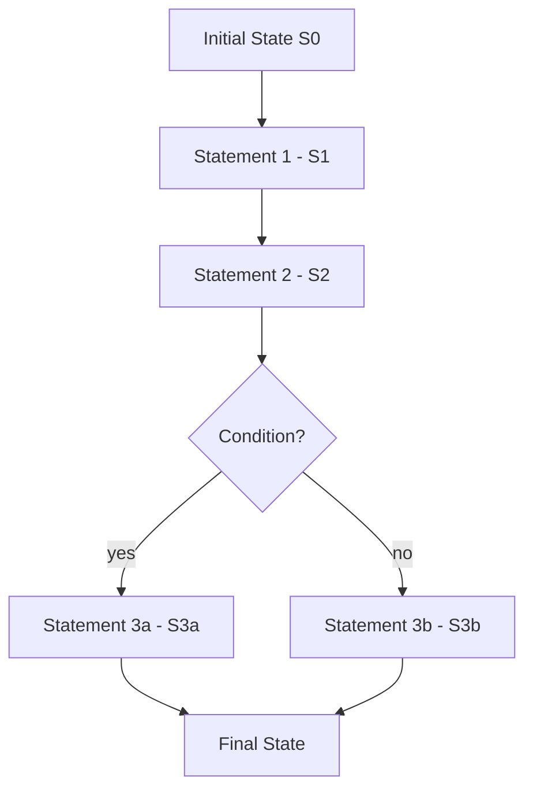

⚡ TL;DR - Imperative programming tells the computer exactly
HOW to achieve a result by writing an explicit sequence of
commands that change state step by step.

| #001 | Category: CS Fundamentals - Paradigms | Difficulty: ★☆☆ |
|:---|:---|:---|
| **Depends on:** | None - foundational entry | |
| **Used by:** | OOP, Procedural Programming, Functional Programming | |
| **Related:** | Declarative Programming, Event-Driven Programming, Reactive Programming | |

---

### 🔥 The Problem This Solves

**WORLD WITHOUT IT:**

In the earliest digital computers of the 1940s, programming
meant physically rewiring circuits or flipping toggle switches
in the correct order. When assembly language arrived it gave
names to machine operations (`MOV`, `ADD`, `JMP`), but there
was still no mental model for organizing computation - just a
flat list of machine directives with no structure for
branching, looping, or named variable management.

**THE BREAKING POINT:**

As programs grew beyond a few dozen instructions, the absence
of a coherent programming model became catastrophic. Programmers
tracked every register state manually, every memory address by
hand. A single misplaced jump corrupted the entire execution.
Business problems - payroll, inventory, navigation - required
solutions with hundreds of steps, but there was no language for
expressing "do this only if that is true" or "repeat until done"
in a way humans could read, verify, or maintain.

**THE INVENTION MOMENT:**

This is exactly why imperative programming was formalized. By
defining a program as a sequence of statements that modify
named state, it gave engineers a mental framework that mirrored
how they already thought about procedures: first do this, then
that, unless some condition is met. FORTRAN (1957) made it
portable. ALGOL (1958) made it structured. C (1972) made it
powerful and close to the machine.

**EVOLUTION:**

Before FORTRAN, programmers wrote raw machine code - one
instruction per line, zero abstraction. FORTRAN introduced
variables, arithmetic expressions, and DO loops. ALGOL added
block structure and recursion. C gave programmers direct memory
access within readable syntax. Today every mainstream language
- Java, Python, Go, Rust - is imperative at its execution
core, even those that add functional or declarative layers on
top.

---

### 📘 Textbook Definition

Imperative programming is a programming paradigm in which the
programmer specifies computation as an explicit ordered sequence
of statements that modify program state. The program describes
*how* to achieve a result by directing control flow through
assignment, conditionals, and loops. Each statement is a
command to the machine: perform this operation and advance to
the next. It contrasts with declarative paradigms, which
describe *what* the result should be rather than the steps
to reach it.

---

### ⏱️ Understand It in 30 Seconds

**One line:**
Write step-by-step commands; the computer follows them in
order, changing data as it goes.

**One analogy:**

> A cooking recipe is imperative: "Add two cups of flour. Stir
> clockwise for thirty seconds. Bake at 200 degrees for twenty-
> five minutes." You are not describing what a perfect cake
> looks like - you are commanding every action in sequence.
> The oven executes what you say, in the order you say it.

**One insight:**

Imperative programming maps directly to how CPUs work: fetch
one instruction, execute it, advance the program counter,
repeat. Every other paradigm is a layer of abstraction over
this physical reality. That is why imperative code tends to
be the most performant when done right - and the most dangerous
when shared state is involved.

---

### 🔩 First Principles Explanation

**CORE INVARIANTS:**

1. **State exists** - programs operate on data that persists
   between statements.

2. **Sequence matters** - the order of execution determines
   the result.

3. **Commands change state** - each statement moves the program
   from one state to the next.

**DERIVED DESIGN:**

Given these invariants, any imperative language must provide:
variables (to hold state), assignment operators (to change
state), and control flow constructs (conditionals and loops)
to choose which commands execute. These are not arbitrary
features - they are the minimum required to express any
computation under the "sequence of state changes" model. If
you removed any one of them, you could not express general
computation.

**THE TRADE-OFFS:**

**Gain:** Complete control over execution order. You can
optimize precisely, predict exactly what runs when, and map
directly to machine performance. The code IS what the machine
does.

**Cost:** You own every state change. As programs grow,
managing mutable state becomes exponentially harder. Variables
mutated in one place affect behavior in distant places.
Concurrent access to shared mutable state introduces race
conditions invisible in single-threaded execution.

**ESSENTIAL vs ACCIDENTAL COMPLEXITY:**

**Essential:** Specifying the sequence of operations is
genuinely necessary for many problems. Building a network
packet, parsing a file byte-by-byte, implementing a state
machine protocol - these require explicit step-by-step
manipulation.

**Accidental:** Manually tracking which global variables were
modified, reasoning about all possible interleavings in
concurrent code, debugging state corruption across 500-line
functions - this complexity exists because of how we structure
imperative programs, not because of the underlying problems.
Functional and declarative constraints reduce this accidental
complexity.

---

### 🧪 Thought Experiment

**SETUP:**

You need to sum all even numbers in the list
`[1, 2, 3, 4, 5, 6]`. Expected result: 12.

**WHAT HAPPENS WITHOUT A SEQUENCE MODEL:**

Without a defined execution model, there is no contract about
what happens first. Does the computer check even/odd before or
after reading each value? Does accumulation happen before or
after filtering? Without the imperative contract - "statements
execute top to bottom, mutations take effect immediately" -
there is no deterministic answer. The same code could return
different values on different runs.

**WHAT HAPPENS WITH IMPERATIVE PROGRAMMING:**

```
sum = 0
for each number in [1, 2, 3, 4, 5, 6]:
    if number modulo 2 equals 0:
        sum = sum + number
return sum
```

Each step executes in declared order. State changes are visible
at every line. `sum` starts at 0, grows by 2, grows by 4,
grows by 6. At any point in execution you know exactly what
the program holds.

**THE INSIGHT:**

Imperative programming is a contract between programmer and
machine: "I specify the order; you execute faithfully." This
contract is what makes programs deterministic and debuggable.
Every other programming model either preserves this contract
in a restricted form (functional) or abstracts over it
(declarative).

---

### 🧠 Mental Model / Analogy

> Think of imperative programming as turn-by-turn GPS
> navigation. You are not describing the destination - you
> are issuing exact commands: "In 200 metres, turn left.
> Merge onto the motorway. Take exit 7B." The car executes
> each command in sequence. The route IS the sequence of
> commands.

- "Turn left in 200m" → assignment or mutation statement
- "Turn left OR continue straight" → conditional (`if/else`)
- "Repeat for each junction" → loop (`for/while`)
- Current vehicle position → program state
- Destination reached → expected output

**Where this analogy breaks down:** GPS can recalculate
dynamically when you miss a turn. Pure imperative code
executes exactly what was written - there is no automatic
recovery from unexpected state. Programs handle unexpected
state through exception handling, which is a separate control
flow mechanism layered on top of the imperative model.

---

### 📶 Gradual Depth - Five Levels

**Level 1 - What it is (anyone can understand):**
Imperative programming means writing instructions for a
computer in the exact order you want them followed - like a
recipe or a to-do checklist. The computer reads them top to
bottom and does exactly what each one says.

**Level 2 - How to use it (junior developer):**
Most code you write daily is imperative. Assigning a variable,
writing an `if/else` block, looping with `for` or `while` -
all imperative constructs. The key habit: be explicit about
what state you are reading, what you are changing, and in what
order. The most common beginner mistake is accidentally
mutating state in one place and being surprised by its effect
elsewhere.

**Level 3 - How it works (mid-level engineer):**
At runtime, the CPU's program counter tracks which instruction
to execute next. Each imperative statement compiles to one or
more machine instructions that modify CPU registers, memory,
or condition flags. The call stack is an imperative artifact:
each function call pushes a frame with its local state, each
return pops it. Shared mutable state across threads is where
imperative code becomes dangerous - two threads modifying the
same variable without synchronization can interleave reads
and writes, producing corrupted results.

**Level 4 - Why it was designed this way (senior/staff):**
Imperative programming maps directly to the Von Neumann
architecture: a processor that executes a stored instruction
stream sequentially and reads/writes a shared memory.
Languages like C were designed as "portable assembly" - the
programmer controls every state transition, and the compiler
translates those transitions to efficient machine code. The
paradigm's flaws (shared mutable state, side effects, non-
local reasoning) are artifacts of the 1960s hardware model:
performance was scarce, so direct machine control was worth
the complexity cost.

**Level 5 - Mastery (distinguished engineer):**
A staff engineer recognizes that the imperative/declarative
divide is not a hard boundary - it is a design choice for
each layer of the system. Parsing a binary protocol is best
expressed imperatively (sequence matters). Transforming a
collection is better expressed declaratively (sequence is
incidental). The deeper principle: imperative is appropriate
when the ORDER of operations IS the logic. When order is
incidental to the logic, imperative style adds noise. Experts
also know that all paradigms compile to imperative machine
instructions; the choice is about which complexity to expose
to the programmer.

---

### ⚙️ Why It Holds True (Formal Basis)

Imperative programming is grounded in the Turing machine model
of computation: a device that reads a symbol, writes a symbol,
and moves along a tape according to a state table. This is
inherently sequential and stateful. The Church-Turing thesis
establishes that any computable function can be computed by a
Turing machine - meaning sequential, stateful computation is
computationally complete.

All real CPUs implement a variant of this model: a program
counter advances through instructions, registers hold state,
memory holds longer-lived state. Imperative programming is
therefore the most direct translation of physical computation
into human-readable syntax.

Formally: a program is a function from an initial machine
state to a final state, achieved through a sequence of state
transition functions. Each statement is `S' = f(S)`. The
correctness proof of an imperative program is the
demonstration that the composition of all transitions produces
the desired final state for all valid inputs. This is why
imperative programs are hard to formally verify at scale -
the composition of state transitions creates an exponentially
large proof obligation.

```
┌─────────────────────────────────────────┐
│       Imperative Execution Model        │
├─────────────────────────────────────────┤
│  Initial State (S₀)                     │
│       ↓                                 │
│  Statement 1  →  State S₁              │
│       ↓                                 │
│  Statement 2  →  State S₂              │
│       ↓                                 │
│  [condition?]                           │
│   ↓ yes          ↓ no                  │
│  Stmt 3a → S₃a  Stmt 3b → S₃b         │
│       ↓               ↓                │
│        Final State (result)             │
└─────────────────────────────────────────┘
```



---

### 🔄 System Design Implications

Choosing an imperative execution model at the system level has
concrete architectural consequences.

**State management becomes explicit architecture.** Every
imperative service can mutate its internal state and any
external state it can reach. At the system level, this means
deciding WHERE mutable state lives (database row, cache entry,
service memory, message offset) because any service that can
write to it creates a coupling invisible in call signatures.
This is why microservices architectures push toward stateless
services - they recover the reasoning clarity that imperative
mutation destroys.

**Testing complexity scales with state.** To test an
imperative function with full confidence, you must enumerate
all state configurations it reads and writes. A function
referencing five shared mutable fields requires combinatorial
test coverage. Functional architectures expose inputs and
outputs through function signatures, reducing the testable
surface to those signatures.

**What changes at scale:** At 10x request volume, shared
mutable state becomes a contention bottleneck - locks
serialize access, race conditions appear, cache invalidation
cascades. Systems that imperatively mutate shared state
require sharding strategies to recover parallelism. At 100x,
distributed imperative state across services requires explicit
coordination protocols (Saga, 2PC, event sourcing) to maintain
consistency - protocols that event-driven systems handle more
naturally.

---

### 💻 Code Example

**Example 1 - Wrong vs Right: Mutation Discipline**

```java
// BAD: Mixed concerns share one mutable variable.
// Filtering, transformation, and counting are tangled.
// Adding any requirement forces you to understand all three.
List<String> result = new ArrayList<>();
int count = 0;
for (User user : users) {
    if (user.isActive()) {
        result.add(user.getName().toUpperCase());
        count++;
    }
}

// GOOD: Single-purpose mutation - one variable, one concern.
// Each variable has exactly ONE reason to change.
List<String> activeNames = new ArrayList<>();
for (User user : users) {
    if (user.isActive()) {
        activeNames.add(user.getName().toUpperCase());
    }
}
// Derived value, not separately mutated:
int activeCount = activeNames.size();
```

**Example 2 - Recognition: When Imperative Is Correct**

```java
// RIGHT: Imperative suits state machines because the
// SEQUENCE of transitions IS the domain logic itself.
// Declarative style would obscure what the protocol demands.
int state = STATE_IDLE;
for (byte b : packet) {
    switch (state) {
    case STATE_IDLE:
        if (b == HEADER_MAGIC) state = STATE_HEADER;
        break;
    case STATE_HEADER:
        payloadLength = Byte.toUnsignedInt(b);
        state = STATE_PAYLOAD;
        break;
    case STATE_PAYLOAD:
        buffer.add(b);
        if (buffer.size() == payloadLength)
            state = STATE_COMPLETE;
        break;
    }
}
```

This is a correct use of imperative state - the byte-by-byte
sequence and the current state jointly determine behavior.
Forcing this into a declarative model adds indirection without
benefit.

**How to test/verify correctness:** For state machines,
construct input sequences that exercise every transition path.
Test invalid sequences (wrong state transitions) to verify
error handling. Property-based testing generates random byte
sequences to verify that valid packets are always parsed
correctly and invalid packets never corrupt parser state.

---

### ⚖️ Comparison Table

| Paradigm | State | Expressed As | Best For |
|---|---|---|---|
| **Imperative** | Explicit, mutable | How to do it | Systems code, protocols, perf paths |
| Declarative | Result specification | What to get | Queries, config, data pipelines |
| Functional | Immutable transforms | Input to output | Concurrent systems, data transforms |
| Object-Oriented | Encapsulated mutation | Objects collaborating | Domain modeling, UI, large codebases |

**How to choose:** Use imperative when the sequence of
operations is the logic itself - protocol parsers, state
machines, tight loops. Use declarative or functional when you
are describing a transformation and execution order is
incidental.

**Decision Tree:**

- Sequence matters intrinsically? → Imperative
- Describing a data transformation? → Declarative/functional
- Modeling real-world entities with lifecycle? → OOP
- Concurrent shared state? → Minimize mutation; prefer
  functional or actor model

---

### ⚠️ Common Misconceptions

| Misconception | Reality |
|---|---|
| Imperative is "basic" - serious engineers use functional | All paradigms compile to imperative machine code. Functional and declarative are constraints programmers apply to themselves, not replacements. Every production system uses imperative code somewhere. |
| OOP is separate from imperative | OOP is imperative programming with encapsulated mutable state. Methods are sequences of statements. OOP adds organizational structure; it does not change the execution model. |
| Declarative is always cleaner than imperative | Declarative is clearer for transformations. Imperative is clearer for sequential state machines. Clarity depends on what the code does, not the paradigm label. |
| Avoiding all mutation makes code better | Controlled mutation at the right level of abstraction is efficient and necessary. The goal is bounded mutation, not zero mutation. Haskell's runtime itself uses mutation for performance. |
| Imperative code is inherently slower than functional | Both compile to similar machine code. Performance differences arise from abstractions (closures, lazy evaluation), not the paradigm label. |

---

### 🚨 Failure Modes & Diagnosis

**Unsynchronized Shared Mutable State (Race Condition)**

**Symptom:**
Intermittent incorrect results or data corruption under
concurrent load. Tests pass in isolation; they fail non-
deterministically under parallelism. Error values vary across
runs.

**Root Cause:**
Two threads execute the imperative "read - modify - write"
sequence on the same variable concurrently. The sequence is
not atomic: thread A reads the value, thread B reads the same
stale value, both modify independently, and one write
overwrites the other.

**Diagnostic Signal:**
Observe tests that produce different wrong values on each
failing run. Add instrumentation logging thread ID and
timestamp on every read and write to the shared variable.
Gaps between a thread's read timestamp and write timestamp
reveal the vulnerability window.

**Fix:**

```java
// BAD: counter++ is three operations: read, increment, write
private int counter = 0;
public void increment() {
    counter++; // race condition under concurrency
}

// GOOD: single atomic operation, no race window
private AtomicInteger counter = new AtomicInteger(0);
public void increment() {
    counter.incrementAndGet();
}
```

**Prevention:** Identify shared mutable state at design time.
Default to immutability; introduce mutation only where
required, protect it with the minimal synchronization needed.

---

**Implicit Side Effects Across Module Boundaries**

**Symptom:**
Calling function A changes the behavior of unrelated function
B. Tests pass in isolation; integration tests fail. Bugs
appear in code that was not changed.

**Root Cause:**
Imperative code that writes to static or global variables
creates invisible coupling. Any code reading that variable is
implicitly coupled to all code writing it - but this
dependency does not appear in any function signature.

**Diagnostic Signal:**
Search for static mutable fields written in one module and
read in another. If write and read belong to different call
stacks, the coupling is invisible to the type system and
reviewers.

**Fix:**
Pass state explicitly as constructor arguments or method
parameters. Avoid static mutable fields except for well-
defined singletons with explicit lifecycle management.

**Prevention:** State should be visible to exactly the code
that needs it. If mutations must be seen across modules, make
it explicit in every function's signature.

---

**Unbounded State Growth in Imperative Loops**

**Symptom:**
Memory usage grows without bound during normal operation.
A service that ran for days crashes with `OutOfMemoryError`
after one week. Growth is not apparent in individual request
handling.

**Root Cause:**
Imperative code accumulates state in collections within long-
running loops without eviction or cleanup. Each iteration adds
items; nothing removes them.

**Diagnostic Signal:**
Take a heap dump after the service has run for several hours.
Identify the largest collection instances and trace them to
code that populates them. Look for `List.add()` or `Map.put()`
calls in loops with no corresponding remove or bounded size.

**Prevention:** For any collection modified in a loop, define
the eviction policy before writing the first `add()`. Use
bounded queues (`ArrayBlockingQueue`) or size-limited caches
with TTL-based eviction.

---

### 🔗 Related Keywords

**Prerequisites (understand these first):**
- `Variables and Assignment` - state is the foundation; without
  named mutable state, imperative code has no medium to operate on
- `Control Flow (if/else, loops)` - the mechanism for directing
  which commands execute and how many times

**Builds On This (learn these next):**
- `Procedural Programming` - organizes imperative code into
  named, reusable procedures; first step toward managing large
  imperative programs
- `Object-Oriented Programming` - encapsulates mutable state
  within objects, adding lifecycle and access control to
  imperative mutation
- `Functional Programming` - the primary counterpoint:
  immutability and pure functions as constraints that make
  imperative complexity manageable

**Alternatives / Comparisons:**
- `Declarative Programming` - specifies WHAT the result should
  be; SQL is declarative, Java loops are imperative
- `Event-Driven Programming` - imperative handlers respond to
  events; the sequencing model is inverted

---

### 📌 Quick Reference Card

```
┌─────────────────────────────────────────────────────────┐
│ WHAT IT IS   │ Explicit sequence of commands that       │
│              │ change state to reach a result           │
├──────────────┼──────────────────────────────────────────┤
│ PROBLEM IT   │ Machines need exact step-by-step orders; │
│ SOLVES       │ no other programming model existed first │
├──────────────┼──────────────────────────────────────────┤
│ KEY INSIGHT  │ Every CPU is imperative - all other      │
│              │ paradigms are abstractions over this     │
├──────────────┼──────────────────────────────────────────┤
│ USE WHEN     │ Sequence IS the logic: state machines,   │
│              │ parsers, perf-critical loops             │
├──────────────┼──────────────────────────────────────────┤
│ AVOID WHEN   │ Describing data transformation where     │
│              │ order is incidental, not essential       │
├──────────────┼──────────────────────────────────────────┤
│ ANTI-PATTERN │ Shared mutable global state written by   │
│              │ multiple callers without synchronization │
├──────────────┼──────────────────────────────────────────┤
│ TRADE-OFF    │ Full execution control vs complexity of  │
│              │ managing all mutation explicitly         │
├──────────────┼──────────────────────────────────────────┤
│ ONE-LINER    │ "You own every step - and every          │
│              │ consequence that follows"                │
├──────────────┼──────────────────────────────────────────┤
│ NEXT EXPLORE │ Declarative → Functional → OOP           │
└─────────────────────────────────────────────────────────┘
```

**If you remember only 3 things:**

1. Imperative programming = explicit sequence of state-changing
   commands - the natural language of every CPU ever built.
2. Shared mutable state is the paradigm's Achilles heel -
   design to minimize how many callers can write to any given
   piece of state.
3. Use imperative when the order of operations IS the logic
   (protocols, state machines). When order is incidental,
   prefer declarative or functional.

**Interview one-liner:**
"Imperative programming describes computation as explicit
sequences of state changes - it maps directly to how CPUs
execute. It gives maximum control but makes concurrent programs
hard to reason about, which is why functional and declarative
styles impose constraints to manage that complexity."

---

### 💎 Transferable Wisdom

**Reusable Engineering Principle:**
Explicit sequencing gives maximum control at the cost of
maximum responsibility. Any system that requires the
programmer to manage every state transition gains precision
and performance but pays in cognitive load and error surface.
The same trade-off recurs everywhere a designer chooses
between "I'll manage it" and "let the runtime manage it."

**Where else this pattern appears:**

- **Manual memory management (C/C++)** - programmer controls
  allocation and deallocation (imperative state), gaining
  performance, paying in memory safety vulnerabilities
- **Infrastructure as Code: Ansible vs Terraform** - Ansible
  is imperative (do this, then that); Terraform is declarative
  (describe desired state, let the tool determine operations)
- **Database transactions** - explicit `BEGIN / COMMIT /
  ROLLBACK` are imperative state management for database ops

**Industry applications:**

- **Financial systems** - transaction processing requires exact
  sequencing; an out-of-order debit before credit corrupts
  account balances in ways costly to detect and reverse
- **Embedded and systems programming** - device drivers issue
  hardware commands in precise sequences with timing
  requirements that declarative abstractions cannot express

---

### 💡 The Surprising Truth

Purely functional languages like Haskell - often presented as
the philosophical opposite of imperative programming - compile
to highly optimized imperative machine code. The Glasgow
Haskell Compiler (GHC) produces x86 assembly that, in
performance-critical paths, is structurally identical to
well-tuned C. The functional purity is a constraint the
programmer operates under; the CPU never sees it. Functional
programming is a beneficial illusion - one that buys reasoning
safety by hiding the imperative reality from the developer.
The machine was always imperative; only our mental model
changed.

---

### ✅ Mastery Checklist

**You've mastered this when you can:**

1. **[EXPLAIN]** Explain to a junior developer, using a
   concrete Java example, why OOP is a form of imperative
   programming rather than a separate paradigm, and where the
   encapsulated mutation lives.

2. **[DEBUG]** Given a production counter that produces wrong
   totals under load, identify the unsynchronized read-modify-
   write race window and fix it using `AtomicInteger`.

3. **[DECIDE]** In a code review, distinguish a 120-line
   method where imperative sequencing is correct (a network
   protocol parser) from one where it obscures a simple
   transformation that would be clearer as a stream pipeline.

4. **[BUILD]** Implement a 3-state protocol parser imperatively
   (IDLE, READING, COMPLETE) with correct state transitions,
   boundary checking, and tests covering every transition path.

5. **[EXTEND]** Explain the Ansible (imperative) vs Terraform
   (declarative) infrastructure tool choice using the same
   trade-off analysis that applies to imperative vs declarative
   code, articulating when each is the correct choice.

---

### 🧠 Think About This Before We Continue

**Q1.** Your Java service uses a shared `HashMap<String, User>`
as an in-memory registry. Under load testing at 500 concurrent
requests, it intermittently throws
`ConcurrentModificationException`. Trace exactly what sequence
of imperative operations causes this exception, and explain
why `Collections.synchronizedMap`, `ConcurrentHashMap`, and
a copy-on-write approach have different performance and
correctness trade-offs.

*Hint: Think about what "iteration" means in terms of the
imperative read-modify-write model and what "concurrent"
modification means for the iterator's internal state machine.*

**Q2.** At 1 million events per second, a service that
imperatively accumulates a running average in a shared field
starts falling behind even with synchronization. Why does this
specific pattern fail at this scale, and what architectural
change - not just a data structure change - would resolve it?

*Hint: Consider how synchronization serializes execution and
what that means for a system designed around parallel threads.
Consider whether the problem is thread safety or something
deeper about the data model.*

**Q3.** Design and implement (in pseudocode) a minimal test
strategy for a 5-state imperative order processing state
machine (CREATED, VALIDATED, PAID, SHIPPED, DELIVERED) that
gives high confidence without testing every possible state
sequence. What is the minimal set of paths you must test?

*Hint: Consider what "coverage" means for a state machine -
there is a meaningful difference between state coverage,
transition coverage, and path coverage. Which transitions are
most likely to fail and why?*

---

### 🎯 Interview Deep-Dive

**Q1: You are reviewing a 180-line Java method that mixes
input validation, discount calculation, inventory deduction,
and notification dispatch in one imperative sequence. The
author says it works and is easy to follow. What specific
engineering risks do you raise?**

*Why they ask:* Tests whether the candidate can articulate
concrete engineering risks of large imperative methods, not
just cite "clean code" platitudes.

*Strong answer includes:*
- Testing surface: a 180-line method with four concerns
  requires testing all cross-concern interactions - the matrix
  is combinatorial, not additive
- Change velocity: any of four business rules changing
  requires understanding all four and their interactions
- Propose concrete refactoring: extract each concern as a
  named function with explicit inputs/outputs; each becomes
  independently testable and reusable
- Acknowledge linearity IS a readability benefit for the happy
  path - the refactoring preserves that in the orchestrating
  function while improving testability of parts

**Q2: Your production service uses a singleton `Config` object
with static mutable fields set imperatively by multiple
modules at startup. You intermittently see modules reading
stale configuration values. Walk through the exact root cause
and two production-grade fixes.**

*Why they ask:* Tests understanding of imperative
initialization ordering, a bug class that occurs specifically
because of the stateful execution model.

*Strong answer includes:*
- Root cause: static mutable state has no initialization
  order guarantee across modules; module A may read before
  module B has written, seeing the default null/zero value
- Fix 1: dependency injection - pass configuration as an
  explicit constructor argument, making read-after-write
  ordering guaranteed by construction
- Fix 2: immutable configuration - build a final, immutable
  config object at startup; any read after that is thread-safe
  and sequencing issues become impossible
- Spring's ApplicationContext enforces construction and wiring
  phases precisely to eliminate this class of bug

**Q3: In what specific scenarios would you choose imperative
mutable-state Java over a functional stream-based approach in
a production codebase where both are viable?**

*Why they ask:* Checks whether the candidate understands
paradigm choice as contextual rather than ideological.

*Strong answer includes:*
- Performance-critical hot paths: mutable object reuse avoids
  GC pressure; preallocated mutable accumulators outperform
  stream pipelines at millions of events per second
- Complex state machine logic: a multi-state protocol parser
  where the sequence of transitions IS the domain logic -
  imperative makes transitions visible; functional obscures them
- Framework integration: Spring and Java EE are built around
  lifecycle-managed mutable objects; fighting that for
  ideological purity creates friction without value
- Pragmatic answer: most production Java is a mix - functional
  for data transformation pipelines, imperative for lifecycle
  management and protocol processing
