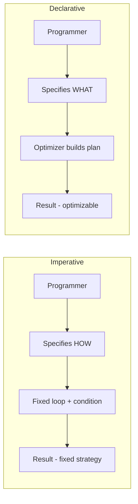

⚡ TL;DR - Declarative programming tells the computer WHAT
result you want and lets the runtime figure out HOW - you
describe the goal, not the steps.

| #002 | Category: CS Fundamentals - Paradigms | Difficulty: ★☆☆ |
|:---|:---|:---|
| **Depends on:** | None - foundational entry | |
| **Used by:** | Type Systems, Composition over Inheritance | |
| **Related:** | Imperative Programming, Functional Programming, Event-Driven Programming | |

---

### 🔥 The Problem This Solves

**WORLD WITHOUT IT:**

Imagine writing a query to find all customers in London who
spent more than $1000 last month. In a purely imperative
world, you write: open the database file, iterate every row,
check the city field, check the date field, check the amount
field, accumulate qualifying rows into a result list, sort
them, return. 40 lines of code to express a 10-word intent.
If the database adds an index on city, you gain nothing -
your code hardcodes the full scan.

**THE BREAKING POINT:**

As systems grew, the gap between "what the business wants"
and "what the programmer must write" became unsustainable.
A business analyst can state "give me all London customers
over $1000" in one sentence. Translating that into imperative
code required a developer, took hours, and produced code that
could not be optimized without rewriting. Every change to the
intent required rewriting the mechanism.

**THE INVENTION MOMENT:**

This is exactly why declarative programming was invented.
By expressing WHAT the result should be, rather than HOW to
compute it, you separate intent from execution. The runtime
or query engine handles the mechanism - and can optimize it
without any changes to the program. SQL (1974), HTML (1993),
CSS, and Terraform all follow this pattern.

**EVOLUTION:**

Early declarative systems were domain-specific: LISP
introduced list-manipulation declarations in 1958, COBOL
added report-level declarations in 1959. SQL (1974) proved
declarative worked for business data. Prolog (1972) showed
declarative logic programming was computationally complete.
Modern declarative systems include Terraform, Kubernetes
manifests, React JSX, and GraphQL - every domain where "what
I want" is easier to specify than "how to get it."

---

### 📘 Textbook Definition

Declarative programming is a programming paradigm in which
the programmer specifies the desired result or constraints
without prescribing the explicit control flow or sequence
of operations to achieve it. The system - whether a compiler,
query engine, or runtime - determines the appropriate
execution strategy. Declarative programs describe WHAT, not
HOW. SQL, HTML, Terraform, and pure functional languages are
canonical examples.

---

### ⏱️ Understand It in 30 Seconds

**One line:**
Describe the result you want; the system figures out how
to produce it.

**One analogy:**

> Ordering food at a restaurant is declarative: "I'll have
> the salmon with rice, no butter." You are not instructing
> the chef step-by-step - you are declaring what you want.
> The kitchen figures out the execution. You get your goal;
> the restaurant optimizes the process.

**One insight:**

The power of declarative programming is not just brevity -
it is the ability for the underlying system to optimize the
execution independently. When you declare `SELECT * FROM
users WHERE city = 'London'`, the database can use an index,
parallelise the scan, or cache the result. Your declaration
does not change; only the execution improves.

---

### 🔩 First Principles Explanation

**CORE INVARIANTS:**

1. **Intent is separated from mechanism** - the programmer
   specifies WHAT, the runtime determines HOW.

2. **Execution is delegated** - the program does not control
   the order or strategy of computation.

3. **The result is deterministic** - for the same declaration
   and the same data, the result is always the same,
   regardless of how the runtime achieved it.

**DERIVED DESIGN:**

Given these invariants, a declarative language must provide:
a way to express constraints or goals, and a runtime that
can interpret those goals and find a valid execution plan.
The language has no sequential control flow constructs -
no `for`, no `while`, no explicit state mutation. What it
has is: predicates, constraints, patterns, or transformation
rules that the runtime can compose and optimize.

**THE TRADE-OFFS:**

**Gain:** The programmer expresses intent at a high level.
The runtime can optimize the execution without changing the
program. Easier to reason about (no state to track). Easier
to test (input → output, no side effects).

**Cost:** You lose control over execution strategy. When
performance matters - when you know more than the runtime
about your data distribution - you cannot force an optimal
plan. Debugging is harder when the runtime makes a poor
execution choice; you cannot inspect the intermediate steps.

**ESSENTIAL vs ACCIDENTAL COMPLEXITY:**

**Essential:** Describing what data satisfies a condition is
genuinely simpler than describing how to find it. The logical
relationship between data fields is the essential information;
the scan strategy is incidental.

**Accidental:** In SQL, `EXPLAIN PLAN` exists because
declarative simplicity hides the execution complexity.
Database administrators spend careers hand-tuning "what"
queries because the optimizer's "how" is sometimes wrong.
This complexity is not essential - a perfect optimizer would
not require it.

---

### 🧪 Thought Experiment

**SETUP:**

You need to find all numbers in a list `[1, 7, 3, 9, 2, 8]`
that are greater than 5. Expected result: `[7, 9, 8]`.

**WHAT HAPPENS WITH IMPERATIVE PROGRAMMING:**

```
result = []
for each number in [1, 7, 3, 9, 2, 8]:
    if number > 5:
        result.append(number)
return result
```

Five lines. You specify the loop, the condition check, the
accumulator, the append. The mechanism IS the program.

**WHAT HAPPENS WITH DECLARATIVE PROGRAMMING:**

```
result = [x for x in [1, 7, 3, 9, 2, 8] if x > 5]
```

or in SQL:

```sql
SELECT n FROM numbers WHERE n > 5
```

One line. You specify the predicate (`x > 5`). The runtime
iterates, filters, collects. You never instructed it how.

**THE INSIGHT:**

The declarative version expresses the programmer's INTENT
directly. If the runtime is later upgraded to use SIMD
parallelism or a bitmap index, the declaration gains the
benefit automatically. The imperative version gains nothing -
it hardcodes the sequential loop.

---

### 🧠 Mental Model / Analogy

> Declarative programming is like a Google Maps destination
> search - you type "London Heathrow Airport" and the app
> finds the best route. You declared where you want to go;
> the system determines how to get there, which roads to
> take, and can reroute if traffic changes. You never specify
> "turn left in 200m."

- "London Heathrow Airport" → the declaration (WHAT)
- Route calculation algorithm → runtime execution (HOW)
- "Re-routing..." → query plan optimization
- Arrival → result produced

**Where this analogy breaks down:** Google Maps can still
fail to find the optimal route if its model is wrong -
declarative systems also produce suboptimal results when the
optimizer's assumptions about the data are incorrect. The
programmer sometimes needs to guide the optimizer using
hints or index declarations.

---

### 📶 Gradual Depth - Five Levels

**Level 1 - What it is (anyone can understand):**
Declarative programming means telling the computer what you
want, not how to get it. Like ordering at a restaurant - you
say "salmon with rice" and the kitchen figures out the
cooking steps. SQL is the most common example: `SELECT name
FROM users WHERE age > 18`.

**Level 2 - How to use it (junior developer):**
Use declarative style for data filtering and transformation.
Instead of a `for` loop with an `if` inside, use Java streams
(`filter()`, `map()`, `collect()`), SQL `WHERE` clauses, or
CSS selectors. Each one describes a property of the result
rather than the procedure to build it. The key: think about
what the output should look like, not the steps to produce it.

**Level 3 - How it works (mid-level engineer):**
A declarative expression is compiled into an execution plan
by the runtime. A SQL query becomes a query plan (sequence
of index scans, hash joins, sort operations). A CSS selector
becomes a traversal of the DOM tree. A Terraform declaration
becomes a dependency graph of API calls. The programmer never
sees the plan; they see only the result. Optimizing a
declarative program means providing better metadata (indexes,
statistics, type hints) so the optimizer builds a better plan.

**Level 4 - Why it was designed this way (senior/staff):**
The separation of WHAT from HOW is a fundamental abstraction
boundary. It allows the system below the boundary to evolve
independently of the program above it. When PostgreSQL adds
a new join algorithm, all existing SQL queries can benefit
without modification. When a browser improves CSS layout
performance, all existing stylesheets improve. This physical/
logical independence is why databases and infrastructure
tools converge on declarative interfaces - the abstraction
layer absorbs implementation changes without breaking
contracts.

**Level 5 - Mastery (distinguished engineer):**
A staff engineer recognizes that "declarative" is a spectrum,
not a binary. HTML is declarative; React JSX is declarative
with escape hatches. SQL is declarative but has procedural
extensions (PL/SQL). Terraform is declarative but supports
meta-arguments that control execution order. The deeper
principle: declarative interfaces are stable contracts.
Any time a system component needs to be replaced or upgraded
without changing callers, make its interface declarative.
The system designer who understands this makes architectural
decisions that age well.

---

### ⚙️ Why It Holds True (Formal Basis)

Declarative programming is grounded in logic programming and
relational algebra. Codd's relational model (1970) proved
that a set of formal operators (select, project, join) on
relations is both mathematically complete and expressible
without procedural control flow. SQL is an approximation
of Codd's relational algebra expressed in English-like syntax.

Formal logic underpins declarative reasoning: a Prolog
program is a set of Horn clauses (logical facts and rules),
and the runtime uses resolution (a form of logical inference)
to derive answers. The programmer asserts facts; the engine
finds proofs. This is why Prolog can express problems like
graph traversal without any loops - the runtime's backtracking
search IS the traversal.

The key formal property: in a purely declarative system,
referential transparency holds for every expression. You can
substitute any sub-expression with its value and the program
produces the same result. This property makes declarative
programs amenable to formal verification, parallel execution,
and aggressive optimization - none of which requires
programmer cooperation.

```
┌───────────────────────────────────────────┐
│     Declarative vs Imperative Flow        │
├───────────────────────────────────────────┤
│  IMPERATIVE              DECLARATIVE      │
│  ─────────               ─────────        │
│  Programmer              Programmer       │
│  specifies HOW           specifies WHAT   │
│       ↓                       ↓           │
│  Fixed loop              Declaration      │
│  + condition             (predicate/      │
│  + accumulate             constraint)     │
│       ↓                       ↓           │
│  Result                  Optimizer/       │
│  (hardcoded              Runtime          │
│   strategy)              builds plan      │
│                               ↓           │
│                          Result           │
│                          (optimizable     │
│                           strategy)       │
└───────────────────────────────────────────┘
```



---

### 🔄 System Design Implications

Choosing a declarative interface at the system level has
concrete architectural consequences.

**Abstraction stability.** A declarative interface is a
stable contract. The Kubernetes YAML manifest describes what
pods you want; the scheduler determines where to run them.
If the scheduler algorithm improves in Kubernetes 1.30, all
existing manifests benefit. If you had imperative control
("run this pod on node 3"), every upgrade would break
existing automation.

**Optimizer dependency.** Systems built on declarative
interfaces have a single point of optimization: the runtime.
If the runtime's optimizer is wrong (poor query plan, bad
scheduling decision), the programmer has limited remediation
options. Database administrators deal with this constantly -
adding hints, creating partial indexes, or rewriting
logically equivalent queries to coax a better plan.

**What changes at scale:** At 10x query volume, the
optimizer's choices become critical. A declarative query
running 10,000 times per second with a suboptimal plan can
consume 10x more resources than a well-planned equivalent.
At 100x, the separation of WHAT from HOW becomes an
organizational advantage - DBAs, infrastructure teams, and
platform engineers can improve the runtime without touching
application code.

---

### 💻 Code Example

**Example 1 - Wrong vs Right: Choosing the Right Style**

```java
// BAD: Imperative style for a data transformation.
// Mixes mechanism (loop, accumulator) with intent.
// Hard to read, test independently, or optimize.
List<String> seniorNames = new ArrayList<>();
for (Employee emp : employees) {
    if (emp.getYearsExperience() >= 5
            && emp.getDepartment().equals("Engineering")) {
        seniorNames.add(
            emp.getFirstName() + " " + emp.getLastName()
        );
    }
}

// GOOD: Declarative style - intent is visible at a glance.
// The stream pipeline reads like a specification:
// "filter seniors in Engineering, map to full name."
List<String> seniorNames = employees.stream()
    .filter(e -> e.getYearsExperience() >= 5)
    .filter(e -> "Engineering".equals(e.getDepartment()))
    .map(e -> e.getFirstName() + " " + e.getLastName())
    .collect(Collectors.toList());
```

**Example 2 - Production: SQL as a Declarative System**

```sql
-- BAD: Declarative with implicit behavior you don't control.
-- The optimizer may choose a full table scan if stats are
-- stale, turning a 1ms query into a 10s disaster.
SELECT customer_id, SUM(order_total)
FROM orders
WHERE order_date >= '2024-01-01'
GROUP BY customer_id
HAVING SUM(order_total) > 1000;

-- GOOD: Guide the optimizer with explicit metadata.
-- An index hint ensures the date column is used.
-- EXPLAIN ANALYZE confirms the plan before production.
-- Same declaration - different optimizer guidance.
CREATE INDEX idx_orders_date
    ON orders (order_date, customer_id, order_total);

-- After index exists, the same query runs in milliseconds.
-- No code change required - only optimizer metadata.
```

**How to test/verify correctness:** Test declarative
expressions by asserting on input/output pairs. Because
declarative code has no intermediate state, you need only
verify: given these inputs, does the output match the
declared specification? Property-based tests work well -
generate random valid inputs and verify the output satisfies
the declared constraint.

---

### ⚖️ Comparison Table

| Style | Control | Optimizable | Debuggable | Best For |
|---|---|---|---|---|
| **Declarative** | None (delegated) | Yes | Hard | Queries, config, rules |
| Imperative | Full | No | Easy | Algorithms, protocols |
| Functional | Partial | Yes (pure fns) | Medium | Transforms, pipelines |
| Logic (Prolog) | None | Yes | Very hard | Constraint solving |

**How to choose:** Use declarative for problems where the
WHAT is clearly definable and the execution strategy should
be delegated (data retrieval, infrastructure state,
UI structure). Use imperative when you need control over
execution order or the runtime optimizer is insufficient.

**Decision Tree:**

- Can you express your intent as a predicate or constraint? → Declarative
- Do you need to control execution order? → Imperative
- Transforming data with no side effects? → Functional (a form of declarative)
- Will the system below your interface change frequently? → Make your interface declarative (stable contract)

---

### ⚠️ Common Misconceptions

| Misconception | Reality |
|---|---|
| Declarative means no control flow | Declarative means no EXPLICIT control flow in the source. The runtime still executes control flow - it is just hidden. SQL has no loops; the query plan contains loops. |
| Declarative code is always faster | Declarative code is as fast as its runtime optimizer. A poorly planned SQL query is far slower than a hand-tuned imperative loop over the same data. |
| CSS is fully declarative | CSS has cascading rules and specificity - both are deterministic but the result depends on the order of declarations. "Fully declarative" systems have no ordering dependencies. |
| Declarative programming is a modern invention | SQL (1974) and Prolog (1972) predate most OOP languages. The idea of describing goals rather than procedures is older than the internet. |
| You cannot debug declarative code | You can debug it by inspecting the execution plan (EXPLAIN PLAN), logging intermediate results, or reducing to minimal failing examples. It requires different tools, not no tools. |

---

### 🚨 Failure Modes & Diagnosis

**Optimizer Chooses a Suboptimal Execution Plan**

**Symptom:**
A query or declarative operation that ran in milliseconds
suddenly takes seconds. Throughput drops. No code changed.
Only data volume or data distribution changed.

**Root Cause:**
Declarative systems delegate execution to an optimizer.
The optimizer uses statistics (row counts, cardinality,
data distribution) to build a plan. When statistics are
stale or misleading, the optimizer chooses a plan that is
correct but slow - a full table scan instead of an index
seek, or a nested-loop join instead of a hash join.

**Diagnostic Signal:**
Run `EXPLAIN ANALYZE` (PostgreSQL) or `EXPLAIN` (MySQL)
on the slow query. Compare the estimated row counts
(optimizer's guess) against actual row counts. A 100x
discrepancy (estimated: 10 rows, actual: 100,000) confirms
stale statistics.

**Fix:**

```sql
-- Update statistics so the optimizer has accurate data
ANALYZE orders;  -- PostgreSQL

-- Or provide a hint to force a specific join type
-- when you know the optimizer is wrong
SELECT /*+ INDEX(orders idx_orders_date) */
    customer_id, SUM(order_total)
FROM orders
WHERE order_date >= '2024-01-01'
GROUP BY customer_id;
```

**Prevention:** Schedule `ANALYZE` to run after large
data loads. Monitor query plans in production and alert
when estimated vs actual row counts diverge by more than
an order of magnitude.

---

**Declarative Intent Does Not Match Runtime Semantics**

**Symptom:**
A Terraform apply or Kubernetes deployment produces a result
that is not what the manifest declares. Resources are created
in the wrong order. Existing resources are not updated as
expected.

**Root Cause:**
Declarative systems have implicit dependencies and ordering
rules. The programmer declared WHAT they want but did not
declare the dependency between resources. The runtime builds
an execution plan that violates an assumed ordering.

**Diagnostic Signal:**
Read the terraform plan output or kubernetes events log
carefully. The gap between declared state and actual state
is usually visible in the plan diff. Look for "replaced" or
"recreated" where "updated" was expected.

**Fix:**

```hcl
# BAD: Terraform cannot infer the dependency.
# The security group may not exist when the instance runs.
resource "aws_instance" "app" {
  vpc_security_group_ids = ["sg-0abc123"]
}

# GOOD: Declare the dependency explicitly.
# Terraform now knows to create the SG first.
resource "aws_security_group" "app_sg" { ... }

resource "aws_instance" "app" {
  vpc_security_group_ids = [
    aws_security_group.app_sg.id
  ]
}
```

**Prevention:** In declarative infrastructure tools,
reference resource attributes (not hardcoded IDs) to
create implicit dependencies. Use `depends_on` only when
the dependency cannot be expressed through attribute
references.

---

**Declarative Abstractions Leaking Implementation Detail**

**Symptom:**
A SQL query written against a logical schema fails when the
DBA reorganizes tables or partitions. A CSS rule breaks when
the HTML structure is refactored. The declarative abstraction
was fragile.

**Root Cause:**
The declaration referenced implementation-level details
(specific column positions, element nesting depth, physical
table names) rather than stable logical concepts. The
abstraction layer was leaky.

**Diagnostic Signal:**
Search for selectors that reference exact DOM nesting (`div >
span > a`) or queries that reference column ordinals instead
of names. Any reference to physical structure rather than
logical meaning is a fragile declaration.

**Prevention:** Declarations should reference stable logical
concepts (semantic CSS classes, named columns, resource
attribute references) not physical structure. The stability
of a declarative program is proportional to the stability
of the concepts it references.

---

### 🔗 Related Keywords

**Prerequisites (understand these first):**
- `Imperative Programming` - the contrast case; understanding
  HOW helps clarify why specifying WHAT is valuable
- `Expressions and Predicates` - the basic building blocks
  of declarative specifications

**Builds On This (learn these next):**
- `Functional Programming` - a paradigm that combines
  declarative intent with mathematical rigor; pure functions
  are a form of declarative transformation
- `SQL` - the canonical declarative language for data;
  the first production system where "declare the result"
  replaced "write the loop"
- `Infrastructure as Code` - Terraform and Kubernetes
  manifests apply declarative principles to infrastructure

**Alternatives / Comparisons:**
- `Imperative Programming` - specifies HOW; better when
  execution order is the logic itself
- `Logic Programming (Prolog)` - the purest form of
  declarative programming: state facts and rules, query
  for conclusions

---

### 📌 Quick Reference Card

```
┌─────────────────────────────────────────────────────────┐
│ WHAT IT IS   │ Describe the desired result; let the     │
│              │ runtime determine the execution strategy │
├──────────────┼──────────────────────────────────────────┤
│ PROBLEM IT   │ Expressing intent in imperative code     │
│ SOLVES       │ conflates what you want with how to get i│
├──────────────┼──────────────────────────────────────────┤
│ KEY INSIGHT  │ Separating WHAT from HOW lets the runtime│
│              │ optimize without changing the program    │
├──────────────┼──────────────────────────────────────────┤
│ USE WHEN     │ The result is expressible as a predicate │
│              │ or constraint; execution order is hidden │
├──────────────┼──────────────────────────────────────────┤
│ AVOID WHEN   │ You need precise execution control or the│
│              │ runtime optimizer cannot be trusted      │
├──────────────┼──────────────────────────────────────────┤
│ ANTI-PATTERN │ Referencing physical structure in        │
│              │ declarations (column positions, DOM depth│
├──────────────┼──────────────────────────────────────────┤
│ TRADE-OFF    │ Intent clarity + optimizer freedom vs    │
│              │ execution control + debugging visibility │
├──────────────┼──────────────────────────────────────────┤
│ ONE-LINER    │ "Declare the destination; trust the      │
│              │ system to choose the best route"         │
├──────────────┼──────────────────────────────────────────┤
│ NEXT EXPLORE │ Functional → SQL → Infrastructure as Code│
└─────────────────────────────────────────────────────────┘
```

**If you remember only 3 things:**

1. Declarative = WHAT you want; imperative = HOW to get it.
   SQL is the world's most successful declarative language.
2. The power is optimization independence: the declaration
   does not change when the execution strategy improves.
3. The risk is optimizer dependency: when the runtime makes
   a wrong execution choice, you have limited ways to correct
   it without adding hints or restructuring declarations.

**Interview one-liner:**
"Declarative programming expresses WHAT the result should be
and delegates the HOW to the runtime. SQL is the canonical
example - the query optimizer determines the execution plan,
which is why adding an index improves performance without
changing a single line of application code."

---

### 💎 Transferable Wisdom

**Reusable Engineering Principle:**
Stable interfaces specify goals, not procedures. Any time
you want a component to be replaceable or upgradeable
without breaking its callers, make the interface declarative.
The system below the interface can evolve; callers gain
improvements automatically.

**Where else this pattern appears:**

- **CSS (styling)** - you declare that `.error` should be
  red; the browser handles layout, rendering, and responsive
  adaptation
- **Make/build tools** - a Makefile declares targets and
  dependencies; Make determines what must be recompiled
- **Dependency injection containers** - you declare that
  `UserService` needs a `Database`; the container wires
  the dependency at runtime

**Industry applications:**

- **Data engineering** - SQL and DataFrame APIs let analysts
  express transformations without understanding distributed
  execution; Spark optimizes the physical plan
- **Cloud infrastructure** - Terraform and Kubernetes
  manifests let teams declare desired state; the platform
  converges to that state through whatever operations are
  needed, idempotently

---

### 💡 The Surprising Truth

SQL - the world's most widely deployed declarative language,
running on billions of databases - is technically not a pure
implementation of Codd's original relational algebra. Codd's
model had no concept of `NULL`, no ordered results, and no
duplicates. SQL introduced all three as practical
compromises. Codd himself was publicly critical of SQL for
violating the theoretical purity of his model. The most
commercially successful declarative language in history is,
by its inventor's assessment, a flawed approximation of the
idea it was supposed to implement.

---

### ✅ Mastery Checklist

**You've mastered this when you can:**

1. **[EXPLAIN]** Explain to a junior developer why adding a
   database index can make a SQL query 1000x faster without
   changing the query itself, using the WHAT/HOW separation
   as the explanation.

2. **[DEBUG]** Given a slow SQL query, use `EXPLAIN ANALYZE`
   to identify whether the optimizer chose a full table scan
   over an index seek, and explain why stale statistics cause
   this and how to fix it.

3. **[DECIDE]** In a code review, identify when a stream
   pipeline or SQL query is a better choice than an imperative
   loop for a data transformation, and articulate the specific
   conditions that flip the decision.

4. **[BUILD]** Write a Terraform resource declaration for an
   AWS instance that depends on a security group, correctly
   using attribute references to make the dependency explicit
   rather than using hardcoded IDs.

5. **[EXTEND]** Design a declarative configuration format for
   a hypothetical rate-limiting service where operators declare
   rules (rate, window, scope) and the service enforces them -
   explaining what the "optimizer" equivalent is and what
   implementation details it hides from the operator.

---

### 🧠 Think About This Before We Continue

**Q1.** A PostgreSQL query running 10 times per second was
promoted to 1000 times per second after a product launch.
The query plan is identical; the data volume tripled. At what
point does a declarative SQL approach hit its limit, and what
is the architectural response - not a query-level fix?

*Hint: Think about what "optimize without changing the
program" means when the optimizer's freedom is bounded by
single-machine execution. Consider what changes when the
data cannot fit on one machine.*

**Q2.** A Terraform plan shows that changing one attribute
in a resource declaration will "destroy and recreate" the
resource instead of updating it in place. This would cause
30 minutes of downtime. Trace the exact reason this happens
in a declarative infrastructure model, and describe two
strategies to avoid the destroy-recreate cycle.

*Hint: Think about what the Terraform state file represents
and how the provider maps declarations to API calls. Not all
resource attributes are mutable after creation.*

**Q3.** Design a minimal declarative API for a task scheduling
system where users declare tasks with dependencies
(`task A must run before task B`). Implement a prototype
scheduler that reads these declarations and produces a valid
execution order. What happens when the declarations contain
a cycle?

*Hint: Think about how declarative dependency graphs map
to topological sort. Consider what "invalid declaration"
means in a declarative system and how the runtime should
communicate it.*

---

### 🎯 Interview Deep-Dive

**Q1: A developer on your team claims that replacing all
Java `for` loops with stream pipelines makes the code
"declarative." Is that accurate? What are the real benefits
and limits of the stream approach compared to a truly
declarative system like SQL?**

*Why they ask:* Tests whether the candidate understands the
spectrum of declarativeness and can distinguish syntax style
from true runtime delegation.

*Strong answer includes:*
- Stream pipelines are more declarative than loops but are
  still compiled to a fixed execution plan - there is no
  optimizer that can rearrange `filter` and `map` operations
- True declarative (SQL) allows the runtime to completely
  replace the execution strategy based on data statistics
- Stream pipelines benefit from readability and composition;
  SQL benefits from optimizer freedom and runtime evolution
- The honest assessment: streams are "more declarative" in
  style but "less declarative" in substance than SQL

**Q2: Your team is evaluating Terraform (declarative) vs
Ansible (imperative) for infrastructure automation. Describe
the specific scenarios where Terraform's declarative model
is a clear win and where Ansible's imperative model is
correct.**

*Why they ask:* Tests architectural judgment about when
to choose declarative vs imperative infrastructure tools.

*Strong answer includes:*
- Terraform wins: idempotent convergence (run multiple times,
  same result), diff/plan before apply, state tracking for
  "what does prod look like right now"
- Ansible wins: sequential operations with dependencies on
  previous step results (reboot server, wait, then configure),
  ad-hoc operational tasks (rotate a certificate, restart
  service), procedural workflows with conditionals
- The real insight: use Terraform for WHAT your infrastructure
  should look like, use Ansible for HOW to change it when
  declarative convergence is insufficient

**Q3: A Kubernetes Deployment manifest declares 3 replicas.
After `kubectl apply`, only 2 pods are running. How do you
diagnose this declarative system's failure to converge to
the declared state?**

*Why they ask:* Tests production-level understanding of
declarative systems and their failure modes.

*Strong answer includes:*
- Run `kubectl describe deployment` to see current state and
  conditions; check `ReplicaSet` to see if pods were created
- Run `kubectl describe pod <pod-name>` on the failed pod to
  see events (ImagePullBackOff, CrashLoopBackOff,
  Insufficient CPU/memory)
- The root cause is almost always: resource constraints
  (no node has enough CPU/memory), image pull failure, or
  health check failure causing restart loops
- Conceptually: Kubernetes declares WHAT (3 replicas), but
  the "optimizer" (scheduler) fails because physical
  constraints prevent convergence - a classic declarative
  failure mode
