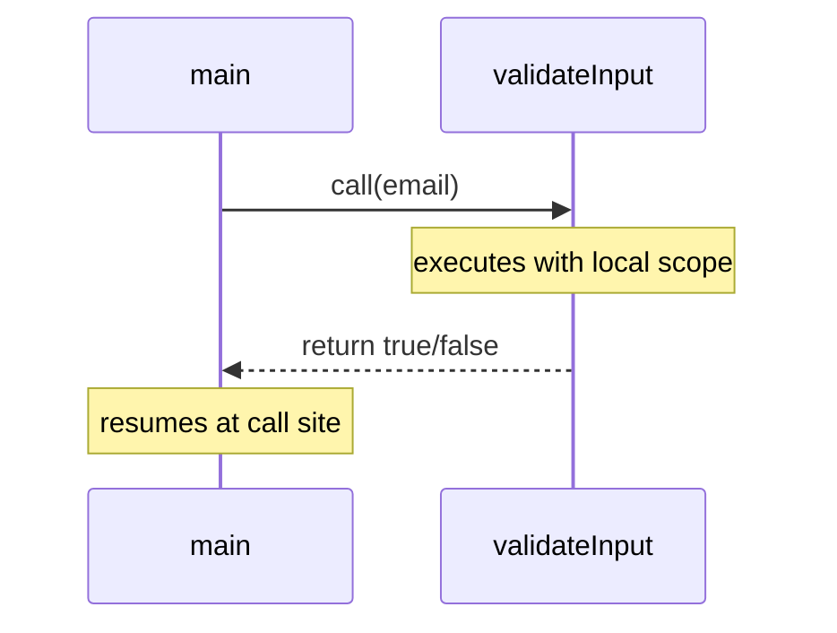

⚡ TL;DR - Procedural programming extends imperative code
by organizing it into named procedures (functions), giving
computation a reusable unit and introducing local scope,
making programs readable and maintainable at larger scale.

| #004 | Category: CS Fundamentals - Paradigms | Difficulty: ★☆☆ |
|:---|:---|:---|
| **Depends on:** | Imperative Programming | |
| **Used by:** | Functional Programming, Type Systems | |
| **Related:** | Imperative Programming, OOP, First-Class Functions | |

---

### 🔥 The Problem This Solves

**WORLD WITHOUT IT:**

Early programs were entirely flat sequences of machine
instructions. If you needed to validate an input in five
different places in a program, you duplicated the same
twenty instructions five times. Changing that validation
logic required finding and updating all five copies - and
hoping you found every one. Worse, programs used `GOTO`
statements to jump to arbitrary points in the code.
Tracing execution became a nightmare of unconditional jumps
across hundreds of lines - what Edsger Dijkstra called
"spaghetti code."

**THE BREAKING POINT:**

By the early 1960s, programs were becoming large enough
that GOTO-based control flow made them incomprehensible.
Dijkstra's famous 1968 letter "Go To Statement Considered
Harmful" formalized what programmers were experiencing:
arbitrary jumps destroyed the ability to reason locally
about what a section of code did. You could not understand
a subroutine without tracing every jump into and out of it.

**THE INVENTION MOMENT:**

This is exactly why procedural programming was developed.
By grouping related imperative statements into a named,
reusable procedure with a defined entry point, local scope,
and return mechanism, it gave programs the first true
abstraction boundary. A procedure call replaced a GOTO:
you knew that after `validateInput()`, execution would
return to the call site. You could reason about
`validateInput()` in isolation.

**EVOLUTION:**

FORTRAN (1957) had subroutines. ALGOL 60 introduced
properly scoped procedures with recursion. Pascal (1970s)
made structured programming (procedures + no GOTOs) the
pedagogical standard. C (1972) made procedural the
dominant paradigm for systems programming. Today, even
OOP and functional languages use procedures (methods,
functions) as their basic unit of abstraction - procedural
thinking is the foundation every other paradigm builds on.

---

### 📘 Textbook Definition

Procedural programming is a programming paradigm that
extends imperative programming by organizing code into
named, reusable units called procedures (also called
functions, subroutines, or routines). Each procedure
takes parameters, executes a sequence of statements on
local state, and optionally returns a value. Procedures
introduce local scope (variables visible only within the
procedure), enable code reuse, and allow programs to be
decomposed into independently understandable units.
C, Pascal, FORTRAN, and COBOL are canonical procedural
languages.

---

### ⏱️ Understand It in 30 Seconds

**One line:**
Group related instructions into named, reusable chunks
called procedures, then call them by name instead of
copying the code.

**One analogy:**

> A recipe book is procedural. You have a main recipe
> for the meal, but it says "make the sauce (see page 47)"
> and "prepare the garnish (see page 92)." The sub-recipes
> are named, reusable procedures. You follow each one,
> finish it, and return to the main recipe. No copying
> the sauce recipe every time it is used.

**One insight:**

The procedure call replaced the `GOTO`. Instead of
"jump to line 347 and never come back," you say "call
`processOrder()` and return here when done." This simple
change - a defined return point and local scope - made
programs that humans could actually read and reason about.

---

### 🔩 First Principles Explanation

**CORE INVARIANTS:**

1. **A procedure has a defined entry point** - you enter
   at the start, not from an arbitrary jump.

2. **Execution returns to the call site** - the call stack
   guarantees you return to where you called from.

3. **Local scope isolates state** - variables declared
   inside a procedure are invisible outside it.

**DERIVED DESIGN:**

Given these invariants, any procedural language requires:
a call mechanism (to jump to a named procedure and push
a return address), a call stack (to remember return
addresses), parameter passing (to communicate input
to the procedure), and scoping rules (to isolate local
variables). These are not optional features - they are
what distinguishes a procedure from a bare `GOTO`.

The call stack is the key innovation. Every nested
procedure call pushes a stack frame containing the return
address and local variables. When the procedure returns,
its frame is popped and execution resumes at the saved
return address. This mechanical guarantee is why you can
read `validateInput()` in isolation - you know it will
return to you.

**THE TRADE-OFFS:**

**Gain:** Code reuse without duplication. Local reasoning
- you can understand a procedure without reading the whole
program. Smaller programs through composition of named
steps. Stack-based error isolation (a crash in a procedure
has a clear origin point).

**Cost:** Procedures share global state unless parameters
are used consistently. Deep procedure call chains create
deep call stacks (relevant for recursion). The discipline
of using procedures well is not enforced by the language
- a codebase full of procedures that share global variables
has the form of procedural programming but none of its
benefits.

**ESSENTIAL vs ACCIDENTAL COMPLEXITY:**

**Essential:** Naming and reusing sequences of logic is
genuinely valuable. Every program of non-trivial size
needs procedures as a unit of abstraction.

**Accidental:** Global variables that procedures silently
mutate re-introduce the coupling that procedures were meant
to eliminate. This is not essential to the paradigm -
it is a discipline failure in its application.

---

### 🧪 Thought Experiment

**SETUP:**

You need to validate an email address in five places in
your program: during user registration, profile update,
password reset, newsletter signup, and admin user creation.

**WHAT HAPPENS WITHOUT PROCEDURES:**

You copy the same 15-line email validation block five
times. When the product manager adds a new requirement
("reject temporary email domains"), you must find all five
copies and update them. You miss one. Users with temporary
email domains can now sign up but not reset their password.
The bug takes 3 hours to diagnose.

**WHAT HAPPENS WITH PROCEDURAL PROGRAMMING:**

```
function isValidEmail(email):
    if length(email) < 3: return false
    if "@" not in email: return false
    if domain(email) in BLOCKED_DOMAINS: return false
    return true

# All five places call the same procedure:
if not isValidEmail(input.email):
    return error("Invalid email")
```

When the blocked domains requirement is added, you update
one function. All five callers immediately benefit. The
fix is made once; the bug cannot recur in one location but
not another.

**THE INSIGHT:**

Procedures are the first and most important tool for
eliminating duplication. The "Don't Repeat Yourself"
principle is fundamentally a procedural discipline: if
you write the same logic twice, extract it into a
named procedure.

---

### 🧠 Mental Model / Analogy

> Procedural programming is like a well-organized kitchen
> with a sous chef system. The head chef (main program)
> does not do everything directly - they call: "Sous chef
> 1, prepare the sauce. Sous chef 2, plate the garnish."
> Each sous chef has their own workspace (local scope) and
> a specific task. When done, they report back to the head
> chef. No one works in anyone else's workspace.

- Head chef (main program) → calling code
- Sous chef instruction ("make the sauce") → procedure call
- Sous chef's workspace → local scope / stack frame
- Recipe the sous chef follows → procedure body
- "Done, chef!" (report back) → return value

**Where this analogy breaks down:** Sous chefs in real
kitchens share physical space and tools. In procedural
code, procedures also share global state unless carefully
disciplined. The sous chef analogy suggests isolation that
only exists if global variables are avoided.

---

### 📶 Gradual Depth - Five Levels

**Level 1 - What it is (anyone can understand):**
Procedural programming means breaking your program into
named functions that you call by name. Instead of writing
the same code ten times, you write it once as a function
and call it ten times. `calculateTax(income)` is a
procedure.

**Level 2 - How to use it (junior developer):**
Write functions that do one thing and accept their inputs
as parameters. Avoid accessing global variables from within
functions - pass everything needed as arguments and return
results. Name functions with verbs: `calculateTotal()`,
`validateInput()`, `fetchUser()`. A function that does
multiple unrelated things should be split.

**Level 3 - How it works (mid-level engineer):**
Each procedure call pushes a stack frame onto the call
stack. The frame contains: the return address (where to
resume after return), the function's parameters, and its
local variables. When the function returns, its frame is
popped and the previous frame is restored. Stack overflow
occurs when frames are nested deeper than the stack size
allows - typically the result of unbounded recursion
(infinite recursive calls before a base case is reached).

**Level 4 - Why it was designed this way (senior/staff):**
The call stack is a genius data structure for procedural
programming because it automatically solves the "where do
I return to?" problem for arbitrary nesting depth without
requiring programmer intervention. ALGOL 60's designers
invented the properly scoped procedure call in 1960,
introducing the notion of activation records (stack frames)
that became the foundation of all subsequent procedural
languages. The stack frame also gives local variables
automatic lifetime - they exist while the procedure is
executing and are garbage-collected when it returns,
without explicit memory management.

**Level 5 - Mastery (distinguished engineer):**
Procedural programming's clean abstraction breaks down
in two important ways at scale. First, procedures that
share global state recreate the coupling problems
procedures were meant to solve. This is why functional
programming eliminates global mutable state entirely.
Second, the call stack imposes a linear complexity model
on recursion that is incompatible with deeply recursive
algorithms on large inputs - hence tail call optimization,
trampolining, and continuation-passing style as
engineering responses. Experts understand that procedures
are the foundation, not the ceiling.

---

### ⚙️ Why It Holds True (Formal Basis)

Procedural programming is formalized in structured
programming theory, most rigorously expressed by Böhm
and Jacopini (1966). Their theorem proves that any
flowchart (and by extension, any program computable by
a Turing machine) can be rewritten using only three
control structures: sequence, selection (if/else), and
iteration (while). No `GOTO` is required.

This theorem is the formal justification for Dijkstra's
campaign against `GOTO`: structured programming is not
just more readable - it is computationally equivalent
to unstructured programming. You lose nothing computable
by adopting structured procedures; you gain everything
in terms of reasoning and maintainability.

```
┌───────────────────────────────────────────┐
│        Call Stack During Execution        │
├───────────────────────────────────────────┤
│  main()                                   │
│  ┌─────────────────────────────────────┐  │
│  │  Frame: main                        │  │
│  │  local: userInput                   │  │
│  │  calling: validateInput()  ─────┐  │  │
│  └─────────────────────────────────│──┘  │
│                                    ↓      │
│  ┌─────────────────────────────────────┐  │
│  │  Frame: validateInput               │  │
│  │  params: email                      │  │
│  │  local: parts                       │  │
│  │  return address: main line 12       │  │
│  └─────────────────────────────────────┘  │
│                                           │
│  When validateInput() returns:            │
│  - Its frame is popped                    │
│  - main() resumes at line 12              │
└───────────────────────────────────────────┘
```



---

### 🔄 System Design Implications

Procedural design thinking shapes how systems are
decomposed, even in languages that primarily use OOP.

**Functions as API units.** Microservices expose REST
endpoints that are, functionally, procedures: they accept
parameters (request body, path params, query string),
execute logic, and return a result. The microservice
boundary is the procedure scope; data outside the scope
is accessed via API calls (parameter passing), not direct
memory access.

**Stateless services as pure procedures.** A stateless
HTTP handler that reads a request, queries a database,
and returns a response is a procedural function at the
service level. It takes inputs, produces outputs, and
has no side effects beyond the explicit database call.
This makes it testable, deployable, and scalable - the
same benefits a well-written procedure has at the code
level.

**What changes at scale:** At 10x request volume, functions
that share global state (connection pools, caches, counters)
become contention points. At 100x, deeply nested call
chains in synchronous request processing hit stack depth
limits and create latency from stack frame allocation.
Asynchronous and event-driven architectures (callbacks,
futures, reactive pipelines) are the scale response -
they replace deep call stacks with flat event handlers.

---

### 💻 Code Example

**Example 1 - Wrong vs Right: Extract Procedures**

```java
// BAD: Logic duplicated without procedures.
// Tax calculation appears in two places.
// Changing the rate requires two edits (and risk of missing one).
public void processOrder(Order order) {
    double tax = order.getTotal() * 0.20;
    double finalPrice = order.getTotal() + tax;
    order.setFinalPrice(finalPrice);
}

public void generateInvoice(Order order) {
    double tax = order.getTotal() * 0.20; // DUPLICATED
    double invoiceTotal = order.getTotal() + tax;
    System.out.println("Invoice total: " + invoiceTotal);
}

// GOOD: Extract the repeated logic into a named procedure.
// Change the rate once; both callers benefit.
private double calculateTax(double subtotal) {
    return subtotal * TAX_RATE; // TAX_RATE is a constant
}

public void processOrder(Order order) {
    double finalPrice =
        order.getTotal() + calculateTax(order.getTotal());
    order.setFinalPrice(finalPrice);
}

public void generateInvoice(Order order) {
    double invoiceTotal =
        order.getTotal() + calculateTax(order.getTotal());
    System.out.println("Invoice total: " + invoiceTotal);
}
```

**Example 2 - Wrong vs Right: Avoid Global State**

```java
// BAD: Procedure silently reads global variable.
// The caller cannot understand calculateDiscount()
// without knowing what CURRENT_PROMO_CODE contains.
// Testing requires setting the global before calling.
private static String CURRENT_PROMO_CODE = "SAVE10";

public double calculateDiscount(double price) {
    if (CURRENT_PROMO_CODE.equals("SAVE10"))
        return price * 0.10;
    return 0;
}

// GOOD: All inputs through parameters.
// Procedure is self-contained and independently testable.
// Caller controls all inputs; no hidden dependencies.
public double calculateDiscount(
        double price,
        String promoCode) {
    if ("SAVE10".equals(promoCode))
        return price * 0.10;
    return 0;
}
```

**How to test/verify correctness:** Test procedures by
calling them with known inputs and asserting expected
outputs. Procedures that take all their inputs as
parameters and return all their outputs as return values
(pure functions) are the easiest to test - no setup of
global state required. Test edge cases: empty input,
null, boundary values.

---

### ⚖️ Comparison Table

| Style | Abstraction Unit | State | Best For |
|---|---|---|---|
| **Procedural** | Named function | Shared/global or params | Scripting, utilities, C systems code |
| OOP | Class/object | Encapsulated per object | Domain modeling, large enterprise apps |
| Functional | Pure function | Immutable | Data transformation, concurrent systems |
| Assembly | Subroutine label | Registers/memory | Embedded, performance-critical paths |

**How to choose:** Use procedural for scripts and tools
where domain modeling overhead is not justified. Use OOP
when you have domain entities with invariants and lifecycle.
Use functional for data transformations where immutability
simplifies concurrency.

---

### ⚠️ Common Misconceptions

| Misconception | Reality |
|---|---|
| Procedural and imperative are the same | Imperative means "explicit sequence of state changes." Procedural adds named, reusable procedures with local scope. All procedural code is imperative; not all imperative code is procedural (assembly loops with GOTO are imperative but not procedural). |
| OOP replaced procedural programming | OOP's methods ARE procedures with an implicit `this` parameter. Every Java method is procedural code inside an OOP wrapper. The paradigms are layered, not competing. |
| Functions in Python/JavaScript are procedural | Functions that close over mutable shared state and produce side effects are procedural. Functions that take all inputs as arguments and return all outputs are functional. The language supports both; the discipline determines the paradigm. |
| Procedures always have return values | Procedures may return nothing (void/unit return type). A procedure that performs an action (write to disk, send a notification) with no return value is still a valid procedure. |
| Global variables are required for procedures to share state | Procedures communicate through parameters and return values. Global state is an anti-pattern. Shared state should be passed as parameters or encapsulated in objects. |

---

### 🚨 Failure Modes & Diagnosis

**Stack Overflow from Unbounded Recursion**

**Symptom:**
`StackOverflowError` (Java) or stack overflow crash.
Occurs during recursive processing of deeply nested data
(trees, recursive JSON, long linked lists), or when a base
case is missing in a recursive function.

**Root Cause:**
Each recursive procedure call pushes a new stack frame.
The JVM's default thread stack is 512KB-1MB. A recursive
function without a terminating base case (or with a base
case never reached) fills the stack and crashes.

**Diagnostic Signal:**

```
# Read the stack trace: if every frame is the same
  function,
# the recursion has no base case.
Exception in thread "main" java.lang.StackOverflowError
    at Tree.traverse(Tree.java:15)
    at Tree.traverse(Tree.java:18)   # same function
    at Tree.traverse(Tree.java:18)   # same function
    at Tree.traverse(Tree.java:18)   # infinite recursion
```

**Fix:**

```java
// BAD: Missing base case - infinite recursion
int factorial(int n) {
    return n * factorial(n - 1); // never stops
}

// GOOD: Base case terminates recursion
int factorial(int n) {
    if (n <= 1) return 1;       // base case
    return n * factorial(n - 1); // recursive step
}
```

**Prevention:** Every recursive function must have a base
case that is guaranteed to be reached. For large inputs,
prefer iterative solutions (explicit stack with `Deque`)
over recursive ones.

---

**Long Parameter Lists Hiding Implicit Dependencies**

**Symptom:**
Functions with 7+ parameters, where callers struggle to
know what order to pass arguments. Different call sites
pass the same parameter in different positions. A function
signature changes and dozens of call sites break.

**Root Cause:**
As procedures grow, new requirements are handled by adding
more parameters. The procedure accumulates a "config blob"
of parameters that should be a structured object.

**Diagnostic Signal:**
Count parameters in function signatures. More than 4-5
parameters is a warning. Methods called with 3+ boolean
parameters are especially dangerous - callers cannot tell
`processOrder(true, false, true, false)` apart.

**Fix:**

```java
// BAD: Long parameter list - callers cannot read intent
void processOrder(
    String userId, String productId, int quantity,
    boolean isExpedited, boolean applyDiscount,
    boolean sendConfirmation, String couponCode) { ... }

// GOOD: Introduce a parameter object
class OrderRequest {
    String userId;
    String productId;
    int quantity;
    boolean expedited;
    boolean applyDiscount;
    boolean sendConfirmation;
    String couponCode;
}

void processOrder(OrderRequest request) { ... }
```

**Prevention:** When a function signature exceeds 4-5
parameters, introduce a parameter object or builder. Named
parameters (supported in Kotlin, Python, Swift) also
mitigate this.

---

### 🔗 Related Keywords

**Prerequisites (understand these first):**
- `Imperative Programming` - procedural programming is
  imperative programming plus the procedure abstraction

**Builds On This (learn these next):**
- `First-Class Functions` - when procedures become
  values that can be passed and returned, procedural
  programming evolves into functional
- `Recursion` - procedures calling themselves; the
  natural expression of divide-and-conquer algorithms
- `Object-Oriented Programming` - OOP adds encapsulated
  state to procedural methods

**Alternatives / Comparisons:**
- `Functional Programming` - extends procedural thinking
  by restricting procedures to pure functions with no
  side effects
- `Aspect-Oriented Programming` - adds cross-cutting
  behavior (logging, auth) to procedures without modifying
  them directly

---

### 📌 Quick Reference Card

```
┌─────────────────────────────────────────────────────────┐
│ WHAT IT IS   │ Organizing imperative code into named,   │
│              │ reusable procedures with local scope     │
├──────────────┼──────────────────────────────────────────┤
│ PROBLEM IT   │ Copy-pasted logic and GOTO-based control │
│ SOLVES       │ flow made programs impossible to maintain│
├──────────────┼──────────────────────────────────────────┤
│ KEY INSIGHT  │ The procedure call replaced GOTO: defined│
│              │ entry, local scope, guaranteed return    │
├──────────────┼──────────────────────────────────────────┤
│ USE WHEN     │ Script-level code, utilities, C systems -│
│              │ anywhere OOP ceremony is not justified   │
├──────────────┼──────────────────────────────────────────┤
│ AVOID WHEN   │ Logic shared via global variables instead│
│              │ of parameters - negates all benefits     │
├──────────────┼──────────────────────────────────────────┤
│ ANTI-PATTERN │ Procedures that silently read/write globa│
│              │ state - invisible coupling, untestable   │
├──────────────┼──────────────────────────────────────────┤
│ TRADE-OFF    │ Reuse + local reasoning vs no invariant  │
│              │ enforcement, shared state still possible │
├──────────────┼──────────────────────────────────────────┤
│ ONE-LINER    │ "Name it, call it, trust it to return -  │
│              │ that's the whole deal"                   │
├──────────────┼──────────────────────────────────────────┤
│ NEXT EXPLORE │ First-Class Functions → Recursion → FP   │
└─────────────────────────────────────────────────────────┘
```

**If you remember only 3 things:**

1. Procedures replace GOTO with a defined return point and
   local scope - the foundation of all readable code.
2. Pass everything as parameters; return everything as
   return values. Procedures that read global state are
   not really procedures.
3. Böhm-Jacopini: any program can be written with only
   sequence, selection, and iteration - no GOTO needed.

**Interview one-liner:**
"Procedural programming extends imperative code by organizing
it into named functions with local scope and a guaranteed
return point, replacing GOTO with structured control flow.
It is the foundation that OOP and functional programming
both build on."

---

### 💎 Transferable Wisdom

**Reusable Engineering Principle:**
Name and isolate repeated logic. Any time the same
sequence of steps appears more than once, give it a name
and a defined interface. This principle applies at every
scale: from a 5-line function to a microservice to a
platform team's API.

**Where else this pattern appears:**

- **Operating system system calls** - a syscall is a
  procedure call to the kernel: named entry point, defined
  parameters, local kernel-space execution, return to
  user space (the ultimate "call stack" enforced in
  hardware)
- **API design** - REST endpoints are procedures: a named
  URI, defined inputs (request body), isolated execution
  (stateless), defined output (response body)
- **Database stored procedures** - named, parameterized
  SQL procedures that execute server-side and return
  results; the database equivalent of a function

**Industry applications:**

- **DevOps scripting** - Shell scripts and Python utilities
  are primarily procedural; named functions for each task
  (provision_server, run_tests, deploy_artifact) make
  pipelines readable and maintainable
- **Embedded systems** - C is the dominant language for
  embedded firmware; its procedural model maps cleanly to
  interrupt service routines and hardware control loops

---

### 💡 The Surprising Truth

Edsger Dijkstra's 1968 letter "Go To Statement Considered
Harmful" - arguably the most influential letter in computer
science history - was actually submitted to Communications
of the ACM as a longer paper, but the editor (Niklaus Wirth,
later creator of Pascal) shortened it and gave it the
provocative title without Dijkstra's input. Dijkstra was
reportedly annoyed by the sensationalized title. The letter
that launched the structured programming revolution and
established procedural programming as the standard was
titled by someone else.

---

### ✅ Mastery Checklist

**You've mastered this when you can:**

1. **[EXPLAIN]** Explain to a junior developer why a
   function that reads a global variable is harder to test
   than one that takes all inputs as parameters, using a
   concrete example.

2. **[DEBUG]** Given a `StackOverflowError` stack trace,
   identify whether it is caused by missing a base case in
   a recursive function, and trace the recursion to find
   the base case that should terminate it.

3. **[DECIDE]** In a code review, identify when a 10-line
   imperative block should be extracted into a named
   function and when the extraction would add unnecessary
   indirection.

4. **[BUILD]** Refactor a 150-line monolithic function
   into 5-6 named procedures, each with a single clear
   responsibility and all inputs via parameters.

5. **[EXTEND]** Explain how a REST API endpoint implements
   the same principles as a well-designed procedure: named
   entry, defined parameters (request schema), local
   execution (stateless handler), and return value
   (response body).

---

### 🧠 Think About This Before We Continue

**Q1.** You have a utility function `formatCurrency(amount)`
that reads a global `LOCALE` variable to determine currency
format. A colleague argues this is fine because the locale
rarely changes. Trace the exact scenario where this causes
a bug in a multi-threaded web server, and explain the
minimum change to fix it without breaking the API.

*Hint: Think about what "global" means in a multi-threaded
context - a global shared by all threads vs a thread-local
variable are very different. Consider what ThreadLocal
provides in Java.*

**Q2.** At 50,000 concurrent requests, your application
begins throwing `StackOverflowError` only on requests that
process deeply nested JSON payloads (200+ levels). The
recursive JSON parser works perfectly in testing. What is
the exact relationship between input depth and stack memory,
and what are two architecture-level approaches to handle
arbitrary nesting depth?

*Hint: Consider the difference between depth-first (DFS,
uses call stack) and breadth-first (BFS, uses explicit
queue) traversal of the nested structure. Think about
converting recursive algorithms to iterative using an
explicit stack data structure.*

**Q3.** Design a procedural interface for a file processing
pipeline: read file, validate content, transform records,
write output, report errors. Each step can fail. Write the
function signatures and call sequence, then explain the
trade-offs between: (a) returning error codes vs (b)
throwing exceptions vs (c) returning a Result type.

*Hint: Think about how each error-handling approach affects
the call site's ability to handle errors locally vs
propagate them, and how each scales when 5 procedures are
chained.*

---

### 🎯 Interview Deep-Dive

**Q1: Explain the difference between a procedure, a function,
and a method. When is each term technically correct, and
which Java keyword correlates with each concept?**

*Why they ask:* Tests precision of vocabulary and depth of
understanding of the paradigm landscape.

*Strong answer includes:*
- Procedure: imperative named block, may return void,
  may have side effects - the general term
- Function (mathematical): maps input to output,
  deterministic, no side effects - the functional
  programming concept
- Method: a procedure attached to an object (implicit
  `this` parameter) in OOP
- Java: all are written with `void` or return-typed `static`
  or instance methods; "function" is informal - Java has
  only methods
- The distinction matters: a Java method that mutates
  instance state is a procedure; one that takes inputs and
  returns a computed value with no side effects is a
  function in the functional sense

**Q2: Your team has a utility class `StringUtils` with 47
static methods that every other class imports. What is the
technical name for this anti-pattern, and what does it
reveal about the codebase's design?**

*Why they ask:* Tests ability to diagnose procedural
anti-patterns in a nominally OOP codebase.

*Strong answer includes:*
- Pattern name: "utility class" anti-pattern (also
  related to "God class" and violation of cohesion)
- What it reveals: the code is procedural in practice;
  the static methods are procedures that were not assigned
  to the right domain objects
- Diagnosis: many of those 47 methods probably operate
  primarily on one type of data - those methods belong
  on that type, not in a separate utility class
- Fix: move `formatUserName()` to the `User` class,
  `parseProductCode()` to the `Product` class - the
  procedure belongs where the data it operates on lives

**Q3: What is "structured programming" and why did it
matter historically? How does modern programming practice
reflect (or violate) its principles?**

*Why they ask:* Tests historical context and ability to
connect theory to practice.

*Strong answer includes:*
- Structured programming (Dijkstra, Böhm-Jacopini, 1960s-70s):
  programs should use only sequence, selection, and
  iteration - no GOTO; procedures should have single
  entry and single exit points
- Why it mattered: GOTO-based programs were unmaintainable
  at scale; structured programming made local reasoning
  possible - you could understand a function without
  reading every jump in the program
- Modern violations: early returns are structurally
  equivalent to GOTO (multiple exit points); exception
  throwing is structured GOTO; `break` in a loop is
  structured GOTO
- The engineer's pragmatic view: the principle (understandable
  control flow, local reasoning) matters more than the
  rule (no early returns). Early returns that simplify
  code are acceptable; deep early-return chains that
  create invisible logic branches are not
