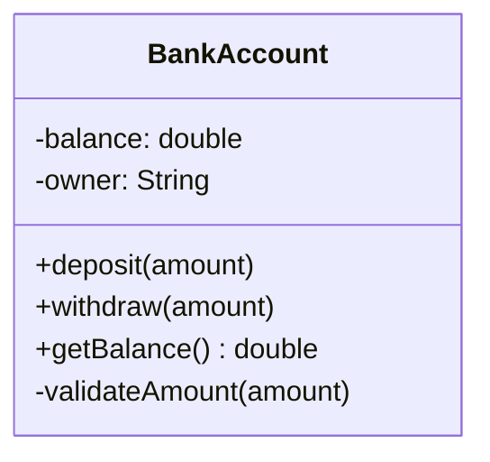

⚡ TL;DR - OOP organizes programs into objects that bundle
data with the behavior that operates on it, so each object
manages its own state and communicates through defined
interfaces.

| #003 | Category: CS Fundamentals - Paradigms | Difficulty: ★☆☆ |
|:---|:---|:---|
| **Depends on:** | Imperative Programming | |
| **Used by:** | Abstraction, Encapsulation, Polymorphism, Inheritance, Composition over Inheritance | |
| **Related:** | Imperative Programming, Procedural Programming, Functional Programming | |

---

### 🔥 The Problem This Solves

**WORLD WITHOUT IT:**

In the 1960s and 1970s, large programs were written as
procedures that operated on shared global data. A payroll
system had a global `employee_record` struct and 200
procedures that could read and modify any field. When a
bug corrupted the salary field, any of those 200 procedures
was a suspect. When a new requirement changed the data
layout, every procedure touching that data needed review.
Programs became unmaintainable above a few thousand lines.

**THE BREAKING POINT:**

The problem was not the size of the programs - it was the
unrestricted coupling between code and data. Any function
could reach into any data structure and change anything.
A change to a data structure potentially broke the entire
program. There was no way to reason about what code "owned"
what data, what operations were valid on a given data
structure, or who was responsible for maintaining its
invariants.

**THE INVENTION MOMENT:**

This is exactly why OOP was invented. Alan Kay at Xerox PARC
(Smalltalk, 1972) realized that the key insight from biology
and cellular systems was encapsulation: cells manage their
own internal state and communicate only through chemical
signals - they do not let external entities modify their
internals directly. OOP applied this to programming: bundle
data with the methods that operate on it, restrict external
access, and communicate through defined interfaces.

**EVOLUTION:**

Simula 67 (Dahl and Nygaard) introduced classes and objects
as a simulation tool. Smalltalk (1972, Alan Kay) made
everything an object and introduced message passing. C++
(1983, Bjarne Stroustrup) added OOP to C for systems
programming. Java (1995) made OOP the default, mainstream
paradigm for enterprise software. By 2000, OOP was the
dominant paradigm. Today, a counter-movement recognizes its
costs - functional programming, composition over inheritance,
and data-oriented design offer alternatives for cases where
OOP adds more complexity than it removes.

---

### 📘 Textbook Definition

Object-Oriented Programming is a programming paradigm that
organizes software as a collection of objects - each
combining state (fields/attributes) with behavior (methods).
Objects are instances of classes, which define the structure
and capabilities of their instances. The paradigm is built
on four principles: encapsulation (hiding internal state
behind an interface), inheritance (deriving new types from
existing ones), polymorphism (treating different types
uniformly through shared interfaces), and abstraction
(exposing essential behavior while hiding implementation
detail).

---

### ⏱️ Understand It in 30 Seconds

**One line:**
Group data and the code that uses it into self-managing
units called objects, then let objects talk to each other.

**One analogy:**

> A bank account is an object. It has a balance (data)
> and operations: deposit, withdraw, get balance (behavior).
> You never reach in and directly change the balance number
> - you call `deposit()` or `withdraw()`. The account
> enforces its own rules (no overdraft). You communicate
> through its interface; it manages its own internals.

**One insight:**

OOP's core benefit is not syntax - it is the discipline of
ownership. When each object owns its state and controls
access through a defined interface, you know exactly where
to look when something breaks. The object's invariants are
maintained in one place, not scattered across every
procedure that touches the data.

---

### 🔩 First Principles Explanation

**CORE INVARIANTS:**

1. **Data and behavior belong together** - the code that
   operates on data should be located with the data.

2. **Encapsulation enforces invariants** - an object's
   internal state is only modified through its methods,
   which can enforce correctness rules.

3. **Interface separates contract from implementation** -
   callers depend on what an object can DO, not how it
   does it internally.

**DERIVED DESIGN:**

Given these invariants, any OOP language must provide:
classes (to define data + behavior together), access
modifiers (to restrict direct state access), and inheritance
or interfaces (to define shared contracts across types).
The class is not just a convenient grouping - it is a
claim of ownership: "I, this class, am responsible for
maintaining the correctness of this data."

**THE TRADE-OFFS:**

**Gain:** Complexity management at scale. When each object
manages its own state, changes to an object's implementation
do not propagate to its callers. Large teams can own separate
objects without constant coordination. Code maps to real-
world domains, making requirements easier to trace to code.

**Cost:** Overhead at small scale. For simple data
transformations, OOP adds ceremony without benefit. Deep
inheritance hierarchies create fragile coupling ("fragile
base class problem"). Mutable objects are hard to test and
reason about in concurrent environments. OOP's emphasis on
modeling nouns (objects) can obscure the verbs (operations)
that are the real computation.

**ESSENTIAL vs ACCIDENTAL COMPLEXITY:**

**Essential:** The discipline of associating code with the
data it operates on is genuinely useful for maintaining
large systems. Thinking about software as a community of
interacting agents that manage their own state is a powerful
mental model for complex domain logic.

**Accidental:** Java's requirement that everything must be
in a class even when a function would suffice, deep class
hierarchies to reuse two methods, verbose getter/setter
boilerplate that provides no encapsulation benefit - these
are accidental complexity added by OOP languages and
conventions, not by the paradigm's core insight.

---

### 🧪 Thought Experiment

**SETUP:**

You are building a payroll system that calculates take-home
pay for different employee types: full-time, contractor,
and intern (each with different tax rules and bonus
structures).

**WHAT HAPPENS WITHOUT OOP:**

You write three functions: `calculateFullTimePay()`,
`calculateContractorPay()`, `calculateInternPay()`. Each
function has access to the raw employee record struct.
When a new pay rule is added for full-time employees,
you must find the right function (hoping there is only one)
and update it. When a new employee type is added, you
must update every piece of code that switches on employee
type. There are no guardrails preventing the contractor
function from accidentally modifying a full-time employee's
pension field.

**WHAT HAPPENS WITH OOP:**

You define an `Employee` abstract class with a
`calculatePay()` method. `FullTimeEmployee`,
`ContractorEmployee`, and `InternEmployee` each override
it with their specific logic. The payroll processor calls
`employee.calculatePay()` without knowing the type. Adding
a new employee type means adding one new class. Modifying
full-time rules means touching one class. No other code
changes.

**THE INSIGHT:**

OOP makes the variation point explicit (the class boundary)
and co-locates the logic that varies (the method override).
The alternative - scattered switch statements or if-chains -
creates invisible coupling between the variation point and
every place that uses it.

---

### 🧠 Mental Model / Analogy

> Think of OOP as a company with specialist departments.
> The Accounting department knows how to process invoices
> (behavior) and owns the financial records (data). You
> do not walk into Accounting and change the ledger
> yourself - you submit a request (method call), and
> Accounting processes it according to their rules.
> Other departments are only coupled to Accounting's
> interface ("accept invoice requests") not its internals
> ("how the ledger is structured").

- Department → class
- Department's internal records → private fields
- Official request forms → public methods (interface)
- Company org chart → class hierarchy
- Departments with the same form type → polymorphism

**Where this analogy breaks down:** Departments in a real
company share context and implicit knowledge that classes
cannot. Inheritance in OOP is tighter coupling than
inter-department communication - a subclass has full access
to its parent's protected members, which companies would
never allow between departments.

---

### 📶 Gradual Depth - Five Levels

**Level 1 - What it is (anyone can understand):**
OOP means organizing your program into things (objects),
where each thing knows its own data and can do things with
it. A `BankAccount` object knows its balance and can deposit
or withdraw. A `Dog` object knows its name and can bark.

**Level 2 - How to use it (junior developer):**
Define classes with private fields and public methods.
Do not expose fields directly (no public fields for mutable
state). Use constructors to enforce valid initial state.
Extend behavior through inheritance sparingly - prefer
composition (holding an instance of another class) over
deep inheritance chains. Implement interfaces to allow
polymorphic treatment.

**Level 3 - How it works (mid-level engineer):**
At runtime, each object is a heap-allocated block of memory
containing its field values and a pointer to its class's
virtual method table (vtable). When you call a virtual
method, the JVM (or C++ runtime) dereferences the vtable
pointer and calls the appropriate implementation. This is
how polymorphism works mechanically - the same call site
dispatches to different code depending on the object's
runtime type. Garbage collection must track object
references to know when an object has no live callers.

**Level 4 - Why it was designed this way (senior/staff):**
OOP emerged as a solution to the "billion-dollar" software
crisis of the 1960s-70s: programs too large for any one
person to understand. The class boundary is a cognitive unit
that fits a human mental model of a domain entity with
responsibilities. The SOLID principles (especially SRP and
ISP) are post-hoc formalizations of what makes OOP
boundaries well-chosen. The "fragile base class problem" -
where changing a parent class breaks subclasses - was not
anticipated and is a fundamental design flaw in deep
inheritance hierarchies.

**Level 5 - Mastery (distinguished engineer):**
A staff engineer recognizes OOP as a design tool, not a
religion. The key decision: for which components is the
object metaphor (named entity with state and behavior)
the right model? For domain entities (User, Order, Account)
with invariants to protect, yes. For pure computation
(data transformation pipelines), no - functional style is
cleaner. For configuration and wiring, dependency injection
(itself an OOP pattern) is appropriate. The expert uses OOP
to model the domain and functional style to express the
computation, mixing paradigms at the right level.

---

### ⚙️ Why It Holds True (Formal Basis)

OOP's formal grounding is in the theory of abstract data
types (ADTs), developed by Liskov, Zilles, and others in
the 1970s. An ADT specifies: a set of values, a set of
operations on those values, and the behavioral contracts
those operations must satisfy - without specifying the
implementation. A class is a concrete implementation of
an ADT.

The Liskov Substitution Principle (LSP) formalizes
inheritance correctness: if `S` is a subtype of `T`, then
an object of type `T` may be replaced with an object of
type `S` without altering the correctness of the program.
This is the formal guarantee that polymorphism is sound.
A subclass that violates the parent's behavioral contract
(postconditions, invariants) violates LSP and makes
polymorphism unsafe.

```
┌───────────────────────────────────────────┐
│          OOP Object Structure             │
├───────────────────────────────────────────┤
│  BankAccount (class definition)           │
│  ┌─────────────────────────────────────┐  │
│  │  Private fields (owned state)       │  │
│  │    - balance: double                │  │
│  │    - owner: String                  │  │
│  ├─────────────────────────────────────┤  │
│  │  Public methods (interface)         │  │
│  │    + deposit(amount)                │  │
│  │    + withdraw(amount)               │  │
│  │    + getBalance() → double          │  │
│  ├─────────────────────────────────────┤  │
│  │  Private methods (implementation)   │  │
│  │    - validateAmount(amount)         │  │
│  └─────────────────────────────────────┘  │
│                                           │
│  Caller only sees the public interface.   │
│  Internal fields are invisible.           │
└───────────────────────────────────────────┘
```



---

### 🔄 System Design Implications

OOP shapes system architecture in ways that are often
invisible until the system grows large.

**Domain model maps to service boundaries.** In a
microservices architecture, each service often owns the
objects it is responsible for. The `OrderService` owns
`Order` objects; the `UserService` owns `User` objects.
The OOP principle of encapsulation (one owner per data)
translates directly to the microservices principle of
data ownership (one service per bounded context).

**Mutable objects require synchronization.** Objects with
mutable state in a multi-threaded service require careful
synchronization. A shared `User` object modified by two
threads concurrently requires locking. This is why services
that handle high concurrency often move toward immutable
value objects or functional approaches for shared state.

**What changes at scale:** At 10x request volume, objects
that are shared across requests become contention points -
especially singleton service objects. At 100x, the garbage
collector spends increasing time collecting short-lived
objects created per request. Object pooling, flyweight
patterns, and value types (records in Java 16+) become
relevant optimizations. At 1000x, deep object graphs with
many references stress GC pressure and serialization
performance for distributed caches.

---

### 💻 Code Example

**Example 1 - Wrong vs Right: Encapsulation**

```java
// BAD: Public fields - no encapsulation.
// Any caller can set balance to a negative value.
// There is no single point to enforce the "balance >= 0"
// invariant - it must be checked EVERYWHERE.
public class BankAccount {
    public double balance; // dangerous: direct mutation
    public String owner;
}
// Caller can do: account.balance = -99999;

// GOOD: Private fields + public methods.
// The invariant "balance >= 0" is enforced in ONE place.
// No caller can create an invalid state.
public class BankAccount {
    private double balance;
    private final String owner;

    public BankAccount(String owner, double initial) {
        if (initial < 0)
            throw new IllegalArgumentException(
                "Initial balance cannot be negative"
            );
        this.owner = owner;
        this.balance = initial;
    }

    public void deposit(double amount) {
        if (amount <= 0)
            throw new IllegalArgumentException(
                "Deposit amount must be positive"
            );
        this.balance += amount;
    }

    public void withdraw(double amount) {
        if (amount > this.balance)
            throw new IllegalStateException(
                "Insufficient funds"
            );
        this.balance -= amount;
    }

    public double getBalance() { return this.balance; }
}
```

**Example 2 - Recognition: Polymorphism in Practice**

```java
// Polymorphism: one interface, multiple implementations.
// The payroll processor does not know which type it has.
public abstract class Employee {
    protected String name;
    public abstract double calculatePay();
}

public class FullTimeEmployee extends Employee {
    private double annualSalary;
    @Override
    public double calculatePay() {
        return annualSalary / 12; // monthly
    }
}

public class ContractEmployee extends Employee {
    private double hourlyRate;
    private int hoursWorked;
    @Override
    public double calculatePay() {
        return hourlyRate * hoursWorked;
    }
}

// The processor works for ALL current and FUTURE types.
// Adding InternEmployee requires ZERO changes here.
List<Employee> employees = getEmployees();
double total = employees.stream()
    .mapToDouble(Employee::calculatePay)
    .sum();
```

**How to test/verify correctness:** Test each class in
isolation with unit tests that exercise all public methods,
including edge cases (zero amount, negative amount, boundary
conditions). Test invariants explicitly: after any sequence
of valid operations, assert that the invariant holds. For
polymorphic code, test each concrete implementation against
the shared contract.

---

### ⚖️ Comparison Table

| Paradigm | State | Code Reuse | Best For |
|---|---|---|---|
| **OOP** | Encapsulated in objects | Inheritance + composition | Domain modeling, large codebases |
| Procedural | Shared structs | Functions | Scripts, small programs, C systems |
| Functional | Immutable values | Higher-order functions | Data transformation, concurrency |
| Data-Oriented | Separate from behavior | Data pipelines | Games, simulations, high-performance |

**How to choose:** Use OOP when modeling domain entities
with invariants (Order, User, Account), lifecycle states,
or complex business rules. Use functional for data
transformation pipelines where the computation is the focus.
Use procedural for small scripts where OOP adds ceremony.

**Decision Tree:**

- Modeling a domain entity with invariants? → OOP
- Transforming data, no shared state? → Functional
- Simple scripting or one-off utility? → Procedural
- High-performance numerical computation? → Data-Oriented

---

### ⚠️ Common Misconceptions

| Misconception | Reality |
|---|---|
| OOP is about classes and syntax | OOP is about the discipline of encapsulation and message passing. You can write terrible OOP code in Java and excellent OOP code in Python. The principle matters more than the syntax. |
| Inheritance is the core feature of OOP | Alan Kay (OOP's inventor) later said he considered inheritance a mistake. Encapsulation and message passing are the core ideas. Inheritance is one reuse mechanism - often not the best one. |
| OOP makes code automatically modular | OOP provides tools for modularity (private, interfaces, classes). Using those tools correctly requires design discipline. Public fields, God classes, and deep inheritance chains are all valid Java but terrible OOP. |
| More classes = better OOP | Excessive class hierarchies are a common OOP anti-pattern. The right number of classes is the minimum that clearly expresses the domain. A class that does one thing well is better than five that each do one-fifth of a thing. |
| getters/setters provide encapsulation | A class with private fields and public getters/setters for every field has no encapsulation. Any caller can set any value. Encapsulation means the class enforces invariants, not just that fields are technically private. |

---

### 🚨 Failure Modes & Diagnosis

**Fragile Base Class (Deep Inheritance Hierarchy)**

**Symptom:**
Changing a parent class method breaks subclass behavior
in unexpected ways. Unit tests for subclasses fail after
a change to the parent that seemed unrelated. Developers
are afraid to modify any base class method.

**Root Cause:**
Deep inheritance hierarchies create tight coupling between
parent and child. A subclass inherits not just the parent's
interface but also its implementation details. When the
parent's implementation changes to fix a bug or add a
feature, subclass behavior changes silently.

**Diagnostic Signal:**
Count the levels in your inheritance chain. More than 3
levels is a warning sign. Search for subclasses that
override more than 30% of their parent's methods - this
is a sign the abstraction is wrong.

**Fix:**

```java
// BAD: Deep inheritance - Stack extends Vector (Java legacy)
// Stack inherits Vector's random-access methods (get, set)
// which violate stack semantics (only push/pop).
Stack<Integer> stack = new Stack<>();
stack.add(0, 42); // bypasses stack discipline!

// GOOD: Composition over inheritance.
// Delegate to an internal list; expose only stack ops.
public class Stack<T> {
    private final Deque<T> internal = new ArrayDeque<>();
    public void push(T item) { internal.push(item); }
    public T pop() { return internal.pop(); }
    public T peek() { return internal.peek(); }
    public boolean isEmpty() { return internal.isEmpty(); }
    // No random-access methods - they don't belong here.
}
```

**Prevention:** Prefer composition over inheritance. Use
interfaces to define contracts; use delegation to reuse
implementations.

---

**God Class (Single Class Knows Everything)**

**Symptom:**
One class has 50+ methods and 30+ fields. It is imported
by nearly every other class. Changing it requires touching
a dozen test files. Every new feature seems to require
adding another method to it.

**Root Cause:**
Responsibilities were not assigned to the right objects.
Instead of spreading behavior across domain objects, it
accumulated in a single "manager" or "service" class.
The class grew to mirror the complexity of the entire system.

**Diagnostic Signal:**
Count lines of code, methods, and import count for each
class. A class with more than 200 lines (excluding boiler-
plate) or more than 15 public methods is a candidate for
decomposition. Tools like Checkstyle or PMD report this.

**Prevention:** Apply SRP (Single Responsibility Principle)
during design, not after. A class should have one reason
to change. When you can identify two separate reasons a
class might need modification, it should be two classes.

---

**Anemic Domain Model (Objects Without Behavior)**

**Symptom:**
Domain objects (`Order`, `Customer`, `Invoice`) are just
structs with getters and setters. All business logic lives
in service classes. The OOP structure exists in name only.

**Root Cause:**
The programmer applied OOP's class syntax but not its
encapsulation principle. Data and behavior were separated
instead of co-located. The result is procedural programming
with OOP ceremony.

**Diagnostic Signal:**
Count the ratio of setter methods to validation or business
logic methods in your domain objects. A class that is 80%
getters and setters with no invariant enforcement is anemic.

**Prevention:** Ask "what is this object responsible for?"
and implement that responsibility in the object. An `Order`
should know how to calculate its total, whether it can be
cancelled, and whether it is complete. These are not the
`OrderService`'s job.

---

### 🔗 Related Keywords

**Prerequisites (understand these first):**
- `Imperative Programming` - OOP is built on imperative
  state mutation; understanding state changes is fundamental
- `Variables and Assignment` - object fields are named
  mutable (or immutable) state

**Builds On This (learn these next):**
- `Encapsulation` - the most important OOP principle;
  hiding state behind interfaces
- `Inheritance` - a reuse mechanism; powerful and often
  overused
- `Polymorphism` - treating different types uniformly
  through shared interfaces; the mechanism behind
  extensibility
- `Composition over Inheritance` - the modern correction
  to inheritance overuse

**Alternatives / Comparisons:**
- `Procedural Programming` - separates data and behavior;
  simpler for small programs
- `Functional Programming` - avoids mutable state
  entirely; better for data transformation and concurrency

---

### 📌 Quick Reference Card

```
┌─────────────────────────────────────────────────────────┐
│ WHAT IT IS   │ Organizes code as objects that combine   │
│              │ data with the behavior operating on it   │
├──────────────┼──────────────────────────────────────────┤
│ PROBLEM IT   │ Unowned shared data leads to bugs no one │
│ SOLVES       │ can find or safely fix at scale          │
├──────────────┼──────────────────────────────────────────┤
│ KEY INSIGHT  │ Encapsulation = one place to enforce an  │
│              │ invariant; that is the real benefit      │
├──────────────┼──────────────────────────────────────────┤
│ USE WHEN     │ Modeling domain entities with invariants │
│              │ (Account, Order, User) at scale          │
├──────────────┼──────────────────────────────────────────┤
│ AVOID WHEN   │ Pure data transformation - functional    │
│              │ style is simpler and safer               │
├──────────────┼──────────────────────────────────────────┤
│ ANTI-PATTERN │ Getters/setters for every field = no real│
│              │ encapsulation (anemic domain model)      │
├──────────────┼──────────────────────────────────────────┤
│ TRADE-OFF    │ Complexity management + invariant safety │
│              │ vs ceremony overhead + mutable state cost│
├──────────────┼──────────────────────────────────────────┤
│ ONE-LINER    │ "Objects own their data; nobody else gets│
│              │ to change it without asking permission"  │
├──────────────┼──────────────────────────────────────────┤
│ NEXT EXPLORE │ Encapsulation → Polymorphism → SOLID     │
└─────────────────────────────────────────────────────────┘
```

**If you remember only 3 things:**

1. OOP's core benefit is encapsulation: one class owns one
   piece of state and enforces its invariants in one place.
2. Getters and setters for every field are NOT encapsulation
   - they are a procedural struct with extra syntax.
3. Prefer composition over inheritance. A class that holds
   an instance of another class is less coupled than a class
   that extends it.

**Interview one-liner:**
"OOP's real benefit is encapsulation - co-locating data with
the behavior that maintains its invariants so you have one
place to enforce correctness. Inheritance, polymorphism, and
abstraction are useful mechanisms, but encapsulation is the
principle that makes large codebases maintainable."

---

### 💎 Transferable Wisdom

**Reusable Engineering Principle:**
Co-locate ownership with responsibility. Any system where
data can be modified by any code in any order becomes
impossible to reason about at scale. The principle of
"one owner per resource, all access through that owner"
recurs in systems design far beyond object-oriented code.

**Where else this pattern appears:**

- **Microservices data ownership** - each service owns its
  data (encapsulation at the service level); other services
  access it only through APIs (message passing)
- **Database transactions** - the database "object" manages
  its own state, enforces constraints (invariants), and
  exposes operations (SQL DML) rather than raw byte access
- **Kubernetes operators** - a custom operator "owns" a
  resource type and manages its lifecycle; the CRD is the
  class, the operator controller is the method

**Industry applications:**

- **Financial systems** - account invariants (balance
  consistency, overdraft rules) must be enforced in one
  place; OOP domain models naturally represent financial
  entities with strict correctness rules
- **Game development** - game entities (player, enemy,
  weapon) naturally map to OOP objects with state (health,
  position) and behavior (move, attack, die)

---

### 💡 The Surprising Truth

Alan Kay, who coined the term "object-oriented programming"
and designed Smalltalk, has said that the naming was
unfortunate and that the big idea was never objects - it
was messaging. He wrote in 2003: "OOP to me means only
messaging, local retention and protection and hiding of
state-process, and extreme late-binding of all things."
By his own definition, Java and C++ do not implement OOP
correctly because they do not support true late-binding and
message passing in the Smalltalk sense. The most popular
OOP languages in the world are, by their paradigm's
inventor's assessment, approximations of the original idea.

---

### ✅ Mastery Checklist

**You've mastered this when you can:**

1. **[EXPLAIN]** Explain to a junior developer why a class
   with only getters and setters provides no real
   encapsulation, and rewrite a simple anemic domain class
   to enforce an invariant through its methods.

2. **[DEBUG]** Given a `NullPointerException` stack trace
   in a deep inheritance hierarchy, identify whether it is
   caused by a parent class calling an overridable method
   in its constructor before the subclass is initialized.

3. **[DECIDE]** In a design review, distinguish when to
   use inheritance vs composition for a new feature, using
   LSP as the criterion: would a subclass truly be
   substitutable for the parent in all contexts?

4. **[BUILD]** Implement a `Shape` hierarchy with `Circle`
   and `Rectangle` subclasses, where each calculates its
   own area, using polymorphism so a `ShapeRenderer` works
   for all current and future shapes without modification.

5. **[EXTEND]** Map the OOP encapsulation principle to
   microservices design: explain why a microservice should
   own its own database and what happens to the system when
   two services share a database table.

---

### 🧠 Think About This Before We Continue

**Q1.** You are reviewing a design where a `Transaction`
class extends `BankAccount` to add transaction-specific
behavior. The `BankAccount` constructor validates that the
initial balance is non-negative. The `Transaction` class
overrides a method called from the `BankAccount` constructor.
What is the exact failure mode, and what does this reveal
about constructor calls and inheritance in Java?

*Hint: Think about the order of initialization in Java's
two-phase construction model. When does a subclass's fields
get initialized relative to the parent constructor's
execution?*

**Q2.** At 10,000 concurrent requests per second, a
singleton `OrderService` object with synchronized methods
becomes a bottleneck. Every request acquires the same lock.
What are three architectural approaches to eliminate this
bottleneck without abandoning the OOP model, and what does
each trade away?

*Hint: Consider the distinction between the class boundary
(one class definition) and the object boundary (one instance
in memory). Not all object interactions require shared state.*

**Q3.** Design an OOP model for a notification system that
sends messages via email, SMS, and push notification. The
system must support adding new channels without modifying
existing code. Implement it, then explain which OOP
principles you applied and why you chose those over
alternatives.

*Hint: Consider the Open/Closed Principle and Strategy
pattern. Ask what varies (the sending mechanism) vs what
is stable (the notification contract).*

---

### 🎯 Interview Deep-Dive

**Q1: What is the "fragile base class" problem in OOP,
and how would you recognize it in a large codebase? Give
a concrete example and describe the refactoring approach.**

*Why they ask:* Tests whether the candidate understands
a fundamental OOP design failure, not just OOP's benefits.

*Strong answer includes:*
- Definition: a subclass breaks when a non-virtual method
  in the parent changes, because the subclass relied on
  implementation details not expressed in the contract
- Recognition: fear of touching parent classes, subclasses
  that override >50% of parent methods, tests that fail
  in unexpected subclasses after parent changes
- Example: `java.util.Stack extends Vector` - Stack inherits
  `add(index, element)` which violates stack semantics
- Fix: composition over inheritance - Stack delegates to
  a Deque rather than extending Vector

**Q2: Explain the difference between encapsulation and
information hiding. Why do getters and setters for every
field NOT constitute encapsulation?**

*Why they ask:* Tests depth of understanding beyond OOP
syntax - the conceptual principle vs the implementation
pattern.

*Strong answer includes:*
- Encapsulation = bundling data with behavior AND enforcing
  invariants; information hiding = restricting access to
  implementation details (a technique within encapsulation)
- A class with `private double balance; public double
  getBalance(); public void setBalance(double v);` provides
  information hiding (the field is private) but NOT
  encapsulation (any caller can set any value, no invariant
  is enforced)
- True encapsulation: `withdraw()` checks for sufficient
  funds before modifying balance; the invariant "balance
  >= 0" is enforced in one place
- Anemic domain model = all getters/setters, no behavior -
  this is procedural programming wearing OOP clothes

**Q3: You need to add a new payment method to a system
that currently handles credit cards and bank transfers.
The current code uses a switch statement on payment type
throughout the codebase. How do you refactor this to use
OOP properly, and what OOP principle does this apply?**

*Why they ask:* Tests practical application of the
Open/Closed Principle and polymorphism.

*Strong answer includes:*
- Current problem: every switch statement is a future
  modification point; adding PayPal requires touching
  every switch in the codebase
- Solution: extract a `PaymentProcessor` interface with
  a `processPayment(amount)` method; `CreditCardProcessor`,
  `BankTransferProcessor`, `PayPalProcessor` implement it
- The code becomes: `processor.processPayment(amount)` -
  no switch, no type check, works for all current and
  future processors
- Principle applied: Open/Closed (open for extension -
  add new processor; closed for modification - existing
  code does not change) + Polymorphism
