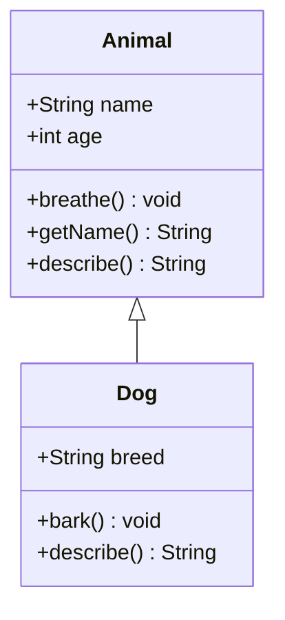
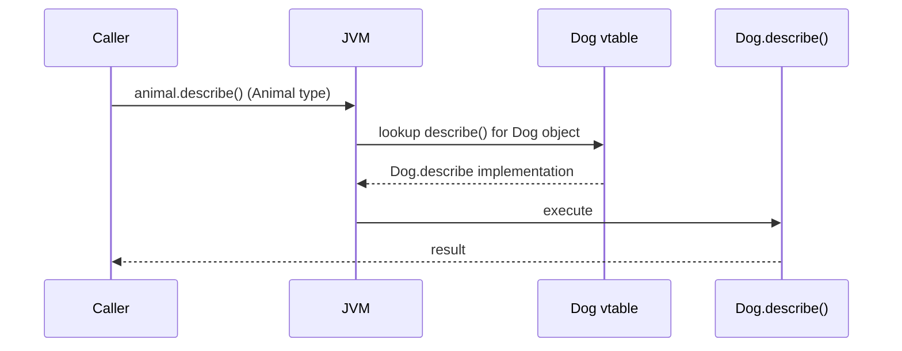

⚡ TL;DR - Inheritance lets a subclass reuse a superclass's
code via `extends`. Misused, it creates tight coupling
and Liskov violations. "Prefer composition over inheritance"
exists because inheritance is overused 10x more than it
should be.

| #018 | Category: CS Fundamentals - Paradigms | Difficulty: ★★☆ |
|:---|:---|:---|
| **Depends on:** | CSF-014 (OOP), CSF-015 (Abstraction), CSF-016 (Encapsulation) | |
| **Used by:** | CSF-017 (Polymorphism), CSF-041 (Composition), JLG-010 | |
| **Related:** | CSF-040 (Interfaces vs Abstract Classes), DPT-001 | |

---

### 🔥 The Problem This Solves

**WORLD WITHOUT IT:**

Two classes, `Dog` and `Cat`, both need `name`, `age`,
and a `breathe()` method. Without inheritance, these
fields and behaviors are copied into each class. When
requirements change (add a `heartRate` field), every
animal class must be updated. Five classes = five updates.
Ten classes = ten updates. The code duplication grows
proportionally with the number of types.

**THE BREAKING POINT:**

Early OOP languages (Simula 67, 1967) recognized that
many real-world entities share structure. "A car IS-A
vehicle; a vehicle has wheels and can move." Without
a language mechanism to express this hierarchy and
share code across it, OOP was just "structs with functions"
with no code reuse benefit. The promise of OOP was
"write code once, reuse everywhere."

**THE INVENTION MOMENT:**

Simula 67 invented the concept of class hierarchies and
inheritance. Smalltalk (1972) refined it. When a subclass
`extends` a superclass: it inherits all non-private fields
and methods; it can override methods to specialize behavior;
it can call `super.method()` to extend (not replace)
the parent's behavior. The subclass IS-A superclass in
the type system - anywhere a `Animal` is expected, a
`Dog` can be passed.

**EVOLUTION:**

Simula 67: single inheritance. C++: multiple inheritance
(inheriting from 2+ superclasses). Java: single class
inheritance + multiple interface implementation (a design
decision to avoid C++'s diamond problem). Java 8: default
methods on interfaces blur the line between interface
and abstract class. Java 17: sealed classes restrict
which classes can inherit from a given class. The
industry trend: composition over inheritance (GoF, 1994;
"Effective Java" Item 18). Inheritance use has declined
as developers recognize its coupling costs.

---

### 📘 Textbook Definition

Inheritance is an OOP mechanism by which a class (subclass,
derived class, child class) acquires the fields and methods
of another class (superclass, base class, parent class).
In Java, inheritance is declared with the `extends` keyword
for single-class inheritance. A subclass inherits all
non-private members of its superclass and can override
methods to provide specialized behavior. The `super` keyword
accesses the superclass's constructor or methods from within
the subclass. Inheritance establishes an IS-A relationship
in the type system: a `Dog extends Animal` means every
`Dog` instance IS-A `Animal` and can be used wherever
an `Animal` is expected. The Liskov Substitution Principle
(LSP) requires that subclasses must be substitutable for
their superclasses without breaking the program's correctness.

---

### ⏱️ Understand It in 30 Seconds

**One line:**
Inheritance lets a subclass reuse and extend a superclass's
code; it is the IS-A relationship in code.

**One analogy:**

> A "Savings Account" IS-A "Bank Account." Every savings
> account has an account number, a balance, and a deposit
> method - inherited from Bank Account. The savings account
> adds an interest rate and an `accrueInterest()` method.
> The savings account inherits the general behavior and
> adds specific behavior. A "Negative Balance Account"
> that IS-A Bank Account but refuses deposits would
> VIOLATE the Liskov Substitution Principle - the
> parent's contract says deposits are allowed, but
> the child breaks that contract.

**One insight:**

The most important thing about inheritance is not
how to use it - it is when NOT to use it. Inheritance
is appropriate for IS-A relationships where the subclass
genuinely extends (not overrides or contradicts) the
superclass's contract. If you find yourself overriding
methods to make them do nothing or throw exceptions
("this method does not apply to this subclass"), you
have a Liskov violation. Composition is the correct
solution: the class USES a component rather than IS-A
version of it.

---

### 🔩 First Principles Explanation

**INHERITANCE MECHANICS IN JAVA:**

```
┌──────────────────────────────────────────────┐
│                    Animal                    │
│  - name: String                              │
│  - age: int                                  │
│  + breathe(): void                           │
│  + getName(): String                         │
│  + describe(): String (can be overridden)    │
└───────────────┬─────────────────────────────┘
                │ extends (IS-A)
   ┌────────────┴────────────┐
   │           Dog           │
   │  - breed: String        │
   │  + bark(): void         │
   │  + describe(): String   │ // OVERRIDES parent
   │  (inherits breathe,     │
   │   getName, name, age)   │
   └─────────────────────────┘
```



**JAVA INHERITANCE RULES:**

1. Single class inheritance only (`extends` one class).
2. Every class implicitly extends `Object` if no explicit
   superclass.
3. All non-private members are inherited. Private members
   exist but are not directly accessible.
4. `final` methods cannot be overridden.
5. `final` classes cannot be extended.
6. Constructor is NOT inherited. Subclass constructor
   must call `super(...)` (explicitly or implicitly).
7. Overriding requires: same method name, same parameter
   types, same or covariant return type, same or less
   restrictive access modifier.

**THE LISKOV SUBSTITUTION PRINCIPLE (LSP):**

"Objects of a subclass should be substitutable for objects
of the superclass without altering the correctness of
the program." (Barbara Liskov, 1987)

```
┌────────────────────────────────────────────────┐
│   LSP Violation Detection                      │
├────────────────────────────────────────────────┤
│ VALID INHERITANCE:                             │
│   BankAccount.deposit(amount) -> increases bal │
│   SavingsAccount.deposit(amount) -> increases  │
│     balance AND applies bonus rate             │
│   --> Same postcondition; extra behavior OK    │
│                                                │
│ LSP VIOLATION:                                 │
│   Rectangle.setWidth(w) -> sets width          │
│   Square.setWidth(w) -> sets width AND height  │
│     (to maintain square invariant)             │
│   --> Callers of Rectangle expect independent  │
│     width/height; Square breaks this contract  │
└────────────────────────────────────────────────┘
```

**THE TRADE-OFFS:**

**Gain from inheritance:** Code reuse without duplication.
Polymorphism (a `List<Animal>` holds `Dog`, `Cat`, `Bird`).
Expressing genuine IS-A relationships cleanly.

**Cost of inheritance:** Tight coupling. The subclass
depends on the superclass's internal implementation
details. A change in the superclass can break all
subclasses (the "fragile base class problem"). Inheritance
hierarchies deeper than 2-3 levels are usually
unmaintainable. Multiple inheritance (C++) introduces
the diamond problem.

**ESSENTIAL vs ACCIDENTAL:**

**Essential:** The IS-A relationship and type hierarchy
are essential for polymorphism. A `List<Animal>` that
can hold any animal type is fundamental to OOP design.

**Accidental:** Using inheritance purely for code reuse
(HAS-A relationships implemented as IS-A) is an antipattern.
"I need logging in 20 classes, so I'll extend `LoggingBase`"
is accidental - composition (inject a `Logger`) is correct.

---

### 🧪 Thought Experiment

**THE SQUARE-RECTANGLE PROBLEM:**

A classic software engineering thought experiment:

```java
class Rectangle {
    int width, height;
    void setWidth(int w)  { this.width = w; }
    void setHeight(int h) { this.height = h; }
    int area() { return width * height; }
}

class Square extends Rectangle {
    void setWidth(int w) {
        this.width = w;
        this.height = w; // keeps square invariant
    }
    void setHeight(int h) {
        this.width = h;
        this.height = h;
    }
}

// Code that uses Rectangle:
void stretchWidth(Rectangle r) {
    r.setWidth(r.getWidth() * 2);
    // Expectation: area doubles (height unchanged)
    assert r.area() == originalArea * 2; // FAILS for Square!
}
```

**WHY THIS MATTERS:**

A Square IS-A Rectangle mathematically. But a `Square`
class is NOT behaviorally substitutable for a `Rectangle`
class, because it has an additional invariant (width == height)
that breaks the Rectangle's behavioral contract (width
and height are independent). This is an LSP violation.

**THE LESSON:**

Subtype relationships in mathematics do not always
translate to subtype relationships in OOP. The IS-A
relationship must be behavioral (same contract), not
just structural (same fields). When a subclass cannot
honor the superclass's full contract, inheritance is
the wrong tool. Composition is correct: a `Shape` interface
with `area()`, implemented independently by `Rectangle`
and `Square`, with no subclass relationship.

---

### 🎯 Mental Model / Analogy

**THE EMPLOYEE BADGE ANALOGY:**

An organization has an `Employee` class (name, ID, salary).
A `Manager extends Employee` adds `team[]` and `approve()`.
This is valid IS-A: a manager IS-AN employee with extra
responsibilities.

Now someone inherits `Employee` to create `Contractor`.
A contractor does NOT have a base salary (they bill by
hour). Inheriting `salary` and overriding `getSalary()`
to throw `UnsupportedOperationException` is an LSP violation.
The correct solution: a `Payable` interface with `getPayment()`
implemented differently by `Employee` and `Contractor`.

**MEMORY HOOK:**

"Inheritance = IS-A. If you need to say 'except this method
does not apply' for a subclass, you do NOT have IS-A.
You have HAS-A (composition) wearing IS-A clothing."

---

### 📊 Gradual Depth - Five Levels

**Level 1 - Child:**
Inheritance is like a family recipe. The parent recipe
has basic steps. Child recipes inherit those steps but
add their own twist. The child can also replace a step
if needed.

**Level 2 - Student:**
`class Dog extends Animal` makes Dog inherit Animal's fields
and methods. `@Override` marks methods that replace the
parent's version. `super.method()` calls the parent's
version from within the override. The subclass IS-A superclass
in the type system.

**Level 3 - Professional:**
LSP: subclasses must be substitutable for superclasses.
The fragile base class problem: superclass changes can
silently break subclasses. Inheritance for code reuse
(not IS-A) creates coupling. Prefer composition for HAS-A
relationships. Use `final` to prevent unintended extension.
Abstract classes provide a partial implementation that
subclasses must complete.

**Level 4 - Senior Engineer:**
Java's decision to allow only single class inheritance
(but multiple interface implementation) eliminated the
diamond problem at the cost of less flexibility. Java 8
default methods on interfaces partially blur this: multiple
interfaces with the same default method create a compilation
error requiring the implementing class to explicitly resolve
the conflict. Sealed classes (Java 17) restrict inheritance
to a known set of subclasses - enabling exhaustive pattern
matching in switch expressions while maintaining a closed
hierarchy. This is the modern answer to "how do you use
inheritance safely in a large codebase."

**Level 5 - Expert:**
The "fragile base class problem" is a fundamental limitation
of inheritance. In Java, adding a new method to a superclass
can silently override a method with the same name in a
subclass (if the subclass was written before the superclass
method was added). This is why `@Override` annotation
exists - the compiler verifies the method actually overrides
something. JVM-level: virtual dispatch (polymorphic calls
via `invokevirtual`) uses a vtable (virtual method table)
per class. Each object has a header pointer to its class's
vtable. Calling an overridden method follows the vtable
to the most-derived implementation. JIT inlining eliminates
the vtable lookup for monomorphic call sites (only one
concrete type at that call site) - making inheritance
effectively as fast as direct calls for single-type
dispatch. Bimorphic (2 types) and megamorphic (3+ types)
call sites are harder to optimize.

*Expert Cues - Level 5:*
Constructor inheritance gotcha in Java: the superclass
constructor runs BEFORE the subclass's initialization.
If the superclass constructor calls an overridable method
and the subclass overrides it, the subclass's override
runs with uninitialized subclass fields. This is a common
source of NullPointerException in inheritance hierarchies.
The rule: never call overridable methods from constructors.
`final` or private methods are safe; virtual methods are not.

---

### ⚙️ How It Works (Formal Basis)

**METHOD RESOLUTION (VIRTUAL DISPATCH):**

When `animal.describe()` is called where `animal` holds
a `Dog` object:

```
┌─────────────────────────────────────────────┐
│          Virtual Dispatch via vtable        │
├─────────────────────────────────────────────┤
│ animal reference -> Dog object on heap      │
│ Dog object header -> Dog's vtable           │
│ Dog vtable contains:                        │
│   describe() -> Dog.describe() [OVERRIDDEN] │
│   breathe()  -> Animal.breathe() [INHERITED]│
│   getName()  -> Animal.getName() [INHERITED]│
│                                             │
│ JVM calls Dog.describe() even though the    │
│ variable type is Animal                     │
└─────────────────────────────────────────────┘
```



**CONSTRUCTOR CHAINING:**

```java
class Animal {
    String name;
    Animal(String name) { this.name = name; }
}

class Dog extends Animal {
    String breed;
    Dog(String name, String breed) {
        super(name); // MUST be first statement
        this.breed = breed;
    }
}
// 'super(name)' must appear before any
// other statement in the Dog constructor.
// If omitted, compiler inserts super() (no-arg).
// If no-arg superclass constructor doesn't exist: error.
```

---

### 🔄 System Design Implications

**INHERITANCE IN LAYERED ARCHITECTURES:**

Framework inheritance (e.g., Spring's `@RestController`,
extending `SimpleXmlApplicationContext`) is a specific,
justified use. The framework provides a template class;
your class extends it to participate in the framework's
lifecycle. This is the Template Method pattern at the
framework level. It is an acceptable use of inheritance.

Application domain inheritance is more risky. Hierarchies
like `Payment > CreditCardPayment > AmexCreditCardPayment`
go 3 levels deep - changes to `Payment` can break all
subclasses, and adding a new variant requires a new class.
Enum + composition often serves better.

**WHAT CHANGES AT SCALE:**

At 10x teams: inheritance hierarchies owned by different
teams create cross-team coupling. A base class change
by Team A breaks Team B's subclass silently. Prefer
interfaces and composition to minimize cross-team
inheritance dependencies.

At 100x classes: deep hierarchies (5+ levels) are
unmaintainable. No engineer can understand the full method
resolution path. Sealed classes + pattern matching provide
a type-safe alternative with a flat hierarchy.

---

### 💻 Code Example

**Example 1 - Wrong vs Right: Inheritance vs Composition**

```java
// BAD: Using inheritance for code reuse when HAS-A is correct
// "A UserService IS-A EmailSender" is wrong - it HAS-A sender
class EmailSender {
    void send(String to, String body) { ... }
}

class UserService extends EmailSender { // WRONG: not IS-A
    void registerUser(User u) {
        saveUser(u);
        send(u.email(), "Welcome!"); // using inherited method
    }
}
// Problem: UserService exposes ALL EmailSender methods publicly.
// Clients of UserService can call send() directly, bypassing
// UserService logic. Coupling to EmailSender implementation.

// GOOD: Composition - UserService HAS-A EmailSender
class UserService {
    private final EmailSender emailSender; // injected

    UserService(EmailSender emailSender) {
        this.emailSender = emailSender;
    }

    void registerUser(User u) {
        saveUser(u);
        emailSender.send(u.email(), "Welcome!"); // controlled
    }
    // EmailSender methods NOT exposed on UserService interface
}
// Benefit: EmailSender can be mocked in tests. UserService
// only exposes its own API. No tight coupling.
```

**Example 2 - Wrong vs Right: LSP Violation**

```java
// BAD: LSP violation - subclass throws where superclass contracts
class Bird {
    void fly() { System.out.println("Flying"); }
}

class Ostrich extends Bird {
    @Override
    void fly() {
        // Ostriches cannot fly!
        throw new UnsupportedOperationException("Cannot fly");
    }
}
// Code that uses Bird:
for (Bird b : flock) {
    b.fly(); // Ostrich throws! Violates superclass contract.
}

// GOOD: Restructure the hierarchy to match behavior
interface Flyable { void fly(); }
interface Walkable { void walk(); }

class Sparrow implements Flyable, Walkable {
    public void fly()  { System.out.println("Flying"); }
    public void walk() { System.out.println("Walking"); }
}

class Ostrich implements Walkable {
    public void walk() { System.out.println("Walking fast"); }
}
// No Ostrich in a List<Flyable>. Type system prevents the bug.
```

---

### ⚖️ Comparison Table

| Mechanism | IS-A or HAS-A | Coupling | Flexibility | Use When |
|---|---|---|---|---|
| Inheritance (`extends`) | IS-A | High (subclass depends on superclass impl) | Low (locked into hierarchy) | Genuine IS-A; superclass is stable; sealed hierarchy |
| Composition (field injection) | HAS-A | Low (interface dependency) | High (swap implementations) | Code reuse; behavior sharing; cross-cutting |
| Interface implementation | Behavioral IS-A | None | High (multiple implementations) | Define a contract; enable polymorphism |
| Abstract class | Partial IS-A | Medium | Medium (must extend) | Shared template with extension points |

---

### ⚠️ Common Misconceptions

| Misconception | Reality |
|---|---|
| Inheritance is the primary OOP mechanism for code reuse | Composition is preferred for code reuse. Inheritance is for IS-A relationships where behavioral substitutability holds. The "Prefer composition over inheritance" rule (GoF, Effective Java) has been best practice for 30 years. |
| A subclass can always be used wherever a superclass is used | Only if LSP holds. If the subclass breaks the superclass's contract (preconditions, postconditions, invariants), substitution causes incorrect behavior. Type safety does not guarantee behavioral correctness. |
| `@Override` prevents bugs | `@Override` catches one bug (method not actually overriding anything). It does not catch LSP violations (the method overrides correctly but violates the contract). |
| Multiple inheritance in Java is not possible | Java allows multiple INTERFACE implementation but only single CLASS inheritance. Java 8+ default methods give interfaces method bodies, partially bridging the gap. Conflicts between multiple defaults require explicit resolution. |
| Abstract classes and interfaces are equivalent | Abstract classes provide state (fields) and partial implementation. Interfaces (pre-Java 8) provide only method signatures. With Java 8 default methods, interfaces can have implementation but still cannot have instance fields. Abstract class is right when you want to share state; interface is right when you want to share a contract. |

---

### 🚨 Failure Modes & Diagnosis

**Failure Mode 1: Fragile Base Class Problem**

**Symptom:** A change to a superclass breaks a subclass
that was never modified. Unit tests that previously passed
now fail after an unrelated commit.

**Root Cause:** The subclass overrides a method from the
superclass. The superclass adds a new method that happens
to have the same name as a method in the subclass (added
before the superclass method existed), or the superclass
changes the semantics of a method the subclass depends on.

**Diagnostic Signal:** A git blame on the failing test
shows the superclass was modified, not the subclass.
The subclass does not have `@Override` on a method that
now matches the superclass.

```java
// Superclass adds a new method:
class Animal {
    // NEW: added after Dog subclass was written
    void describe() { System.out.println(name); }
}

class Dog extends Animal {
    // This was a Dog-specific method, not an override
    // Now it silently overrides Animal.describe()
    void describe() { System.out.println(breed); }
    // Missing @Override - compiler didn't catch the change
}
// Fix: Add @Override everywhere you intend to override.
// Compiler enforces that it actually overrides something.
```

---

**Failure Mode 2: Constructor Calling Overridable Method**

**Symptom:** `NullPointerException` during object construction,
with a stack trace pointing to an overridden method called
from the superclass constructor.

**Root Cause:** The superclass constructor calls a method
that is overridden in the subclass. The override accesses
a subclass field that has not yet been initialized (because
subclass initialization runs AFTER the superclass constructor).

```java
// BAD: Superclass constructor calls overridable method
class Animal {
    Animal() {
        describe(); // calls overridden version!
    }
    void describe() { System.out.println("Animal"); }
}

class Dog extends Animal {
    String breed; // not initialized when Animal() runs!
    @Override
    void describe() {
        System.out.println(breed.toUpperCase()); // NPE!
    }
}
new Dog(); // NullPointerException in Animal constructor

// FIX: Never call overridable methods from constructors.
// Use final or private methods in constructors.
```

---

**Security Note:**

Inheritance can break encapsulation in security-sensitive
classes. If a class holds sensitive data and a subclass
can override methods that control access to that data,
the subclass can bypass access controls. Java's `final`
keyword prevents subclassing: `public final class
SecureToken` cannot be extended. Security-critical classes
(like `java.lang.String`) are final to prevent spoofed
subclasses from intercepting or altering sensitive data.
Any class that needs a security guarantee should be `final`.

---

### 🔗 Related Keywords

**Prerequisites (understand these first):**
- `Object-Oriented Programming` (CSF-014) - inheritance
  is one of the four OOP pillars
- `Abstraction` (CSF-015) - abstract classes are the
  primary mechanism for inheritance-based abstraction
- `Encapsulation` (CSF-016) - inheritance interacts with
  encapsulation: subclasses cannot access private members,
  but they can access protected ones

**Builds On This (learn these next):**
- `Polymorphism` (CSF-017) - inheritance enables runtime
  polymorphism via virtual dispatch
- `Composition over Inheritance` (CSF-041) - when and
  why to replace inheritance with composition; the
  dominant pattern in modern Java design
- `Interfaces vs Abstract Classes` (CSF-040) - the
  design choice between the two inheritance mechanisms

**Alternatives / Comparisons:**
- `Design Patterns` (DPT-001) - many design patterns
  (Strategy, Decorator, Template Method) provide
  inheritance-free alternatives to common inheritance-
  based designs

---

### 📌 Quick Reference Card

```
┌────────────────────────────────────────────────────────┐
│ KEYWORD      │ extends (class), implements (interface) │
├──────────────┼─────────────────────────────────────────┤
│ IS-A RULE    │ Subclass must be behaviorally            │
│              │ substitutable (LSP). Not just structural. │
├──────────────┼─────────────────────────────────────────┤
│ LSP CHECK    │ "Can I replace superclass with subclass  │
│              │ everywhere and nothing breaks?" If NO:   │
│              │ use composition instead.                  │
├──────────────┼─────────────────────────────────────────┤
│ DEPTH LIMIT  │ > 3 levels deep = red flag. Each level  │
│              │ increases coupling and cognitive load.    │
├──────────────┼─────────────────────────────────────────┤
│ CONSTRUCTOR  │ Never call overridable methods in        │
│              │ constructor -> NPE on subclass init.      │
├──────────────┼─────────────────────────────────────────┤
│ FRAGILE BASE │ Use @Override always. Changes to base    │
│              │ classes silently affect all subclasses.  │
├──────────────┼─────────────────────────────────────────┤
│ FINAL        │ Prevents subclassing. Use for security   │
│              │ and stability. String, Integer are final. │
├──────────────┼─────────────────────────────────────────┤
│ ONE-LINER    │ "Inheritance = IS-A; if the subclass     │
│              │ breaks the parent's contract, use        │
│              │ composition instead."                    │
├──────────────┼─────────────────────────────────────────┤
│ NEXT EXPLORE │ CSF-041 (Composition), CSF-040 (Interfaces)│
└────────────────────────────────────────────────────────┘
```

**If you remember only 3 things:**

1. Use inheritance only for genuine IS-A relationships where
   LSP holds - the subclass must be fully substitutable for
   the superclass without breaking any behavioral contracts.
2. Prefer composition over inheritance for code reuse.
   "I want to reuse this class's methods" is not sufficient
   reason to subclass it.
3. Never call overridable methods from constructors. The
   subclass's fields are not initialized when the superclass
   constructor runs.

**Interview one-liner:**
"Inheritance expresses IS-A with behavioral substitutability
(Liskov Substitution Principle). It enables polymorphism
via virtual dispatch. Common misuses: using inheritance for
code reuse (use composition), deep hierarchies (prefer flat),
calling overridable methods in constructors (causes NPE).
The 'fragile base class problem' means superclass changes
silently break subclasses."

---

### 💎 Transferable Wisdom

**Reusable Engineering Principle:**
The IS-A vs HAS-A distinction is one of the most important
design decisions in any object-oriented codebase. Getting
it wrong creates tight coupling that propagates through
the entire system. The test: "Is every instance of the
subclass genuinely a kind of the superclass, with no
exceptions, and no overridden methods that weaken or
remove behavior?" If yes: inheritance. If no: composition.
This question-as-a-test applies to any system: does
a service "extend" a base service, or does it "use" a
component? Is a microservice a "kind of" something, or
does it "have" a set of capabilities?

**Where else this pattern appears:**

- **React component inheritance** - React's official
  recommendation is "composition over inheritance" for
  components. A component does not `extend` another component
  class (beyond `React.Component`); it renders child
  components via props (composition). The React team's
  reasoning mirrors the OOP guidance.
- **Spring framework hierarchy** - Spring's `ApplicationContext`
  hierarchy is a legitimate use: `AnnotationConfigApplicationContext`
  IS-A `GenericApplicationContext` IS-A `AbstractApplicationContext`.
  Deep but stable because Spring itself controls all levels.
- **Database inheritance mapping** - JPA supports `@Inheritance`
  strategies (SINGLE_TABLE, TABLE_PER_CLASS, JOINED). Each maps
  a class hierarchy to database tables. Misused hierarchies
  in code translate to complex query strategies in the database.

**Industry applications:**

- **Payment processing** - `AbstractPaymentProcessor`
  with a Template Method defines the payment flow
  (validate, charge, record, notify). Subclasses (Stripe, PayPal)
  override the charge step. This is a correct use: each
  IS-A PaymentProcessor with all behavioral contracts honored.
- **Exception hierarchies** - Java's exception hierarchy
  is the most widely used inheritance hierarchy in the
  language. `IOException > FileNotFoundException` is a
  canonical IS-A with LSP (FileNotFoundException IS-AN IOException
  with more specific context). Well-designed exception
  hierarchies enable callers to catch at any granularity.
- **Spring Data Repositories** - `JpaRepository extends
  PagingAndSortingRepository extends CrudRepository` is
  a legitimate 3-level hierarchy. Each level adds capabilities;
  none breaks the parent's contract. This is the model for
  acceptable deep inheritance.

---

### 💡 The Surprising Truth

Java's designers chose to prohibit multiple class inheritance
specifically because of what happened with C++. C++'s
multiple inheritance created the "diamond problem": if
`D extends B and C`, and both `B` and `C` extend `A`,
which version of `A`'s methods does `D` get? C++ requires
programmers to use `virtual` inheritance and explicit
disambiguation. Java's solution was simple: no multiple
class inheritance. Use interfaces for multiple type
memberships. The surprise: Java 8's default methods on
interfaces recreated a limited form of the diamond problem.
If two interfaces both have a default method with the same
signature and a class implements both, the compiler forces
the implementing class to override the method and choose
(or merge) the behavior. Java reintroduced the problem it
originally eliminated - but with a mandatory compile-time
resolution requirement instead of the silent C++ behavior.

---

### ✅ Mastery Checklist

**You've mastered this when you can:**

1. **[EXPLAIN]** Given a proposed inheritance hierarchy
   of 4 classes, apply the Liskov Substitution Principle
   to each subclass relationship, identify any violations,
   and propose a restructured design using interfaces and
   composition that eliminates the violations.

2. **[DEBUG]** Given a `NullPointerException` stack trace
   that points to an overridden method called from a
   superclass constructor, explain exactly why this happens
   (timing of initialization), identify the pattern to avoid
   it, and refactor the code to fix it.

3. **[DESIGN]** Design an inheritance hierarchy for a
   payment system with credit cards, bank transfers, and
   digital wallets, applying LSP throughout. Identify where
   composition is more appropriate than inheritance and
   provide the alternative design.

4. **[BUILD]** Implement a sealed class hierarchy (Java 17+)
   for an expression evaluator (numbers, addition, multiplication,
   variables). Write a switch expression with pattern matching
   that exhaustively handles all subclasses and verify the
   compiler catches the missing case.

5. **[EXTEND]** Explain the difference between `protected`
   and `public` in the context of inheritance, describe
   the "design for extension or prohibit it" principle,
   and configure a class to allow controlled extension
   using `protected` hooks and `final` guard methods.

---

### 🧠 Think About This Before We Continue

**Q1.** A colleague designs a class hierarchy for bank
accounts: `Account -> CheckingAccount -> StudentCheckingAccount`.
The `Account` class has a `withdraw(amount)` method that
permits overdraft. `CheckingAccount.withdraw()` throws an
exception if the balance would go negative. `StudentCheckingAccount`
additionally applies a $2 fee. Which levels of this hierarchy
violate LSP, and what is the correct redesign?

*Hint: `CheckingAccount` narrows the precondition (rejects
amounts that `Account` would allow). LSP says you can only
WEAKEN preconditions (accept MORE). Narrowing is a violation.
`StudentCheckingAccount` adds a fee but otherwise honors the
contract - this is a postcondition strengthening, which
LSP allows. What interface or abstract class design would
let each account type implement its own rules without
violating substitutability?*

**Q2.** Java's `Properties extends Hashtable<Object, Object>`
is a famous LSP violation in the JDK itself. `Properties`
is designed to hold String key-value pairs, but because
it extends `Hashtable`, callers can call `put(Object, Object)`
and insert non-String keys. This breaks `getProperty(String)`
which casts keys to String. How does this violation manifest
in production, and what is the correct design that Java
should have used?

*Hint: Composition - `Properties HAS-A Hashtable` (or better,
HAS-A `Map<String, String>`) rather than IS-A. The public
API would only expose `setProperty(String, String)` and
`getProperty(String)`. Non-String keys would be impossible
by type. What does this tell you about the dangers of
inheriting from collection classes?*

**Q3.** Java 17 sealed classes (`sealed interface Shape
permits Circle, Rectangle, Triangle`) restrict which classes
can extend `Shape`. How does this change the design trade-offs
for inheritance, and what does it enable in terms of
exhaustiveness checking that was previously impossible?

*Hint: Without sealed, a switch on `Shape` subtypes cannot
be exhaustive because a future class could add a new subtype.
With sealed, the compiler knows all possible subtypes and
can verify completeness of switch expressions. How does
this interact with the "open/closed principle" (open for
extension, closed for modification)? Is a sealed class
"open" or "closed"?*

---

### 🎯 Interview Deep-Dive

**Q1: "What is the Liskov Substitution Principle, and
why does it matter for inheritance design?"**

*Why they ask:* Tests depth of OOP understanding beyond
syntax. LSP distinguishes engineers who understand design
principles from those who only know the `extends` keyword.

*Strong answer includes:*
- LSP: a subclass must be substitutable for its superclass
  without altering program correctness. Formally: if
  `S extends T`, any code using `T` must work correctly
  with `S`. Behavioral contracts (preconditions: inputs
  the method accepts; postconditions: what the method
  guarantees; invariants: class-level constraints) must
  be preserved.
- LSP violation signals: overriding a method to throw
  `UnsupportedOperationException`, narrowing accepted
  inputs, weakening guaranteed outputs, breaking class
  invariants.
- Practical consequence: code that uses the superclass
  type (`Animal`, `Shape`) must not crash or produce
  wrong results when given a subclass instance (`Dog`,
  `Circle`). This is exactly the substitutability guarantee
  polymorphism relies on.
- Design tool: the LSP test - "Can every consumer of the
  superclass use the subclass without any code changes?"
  If not: use composition, interfaces, or restructure
  the hierarchy.

**Q2: "What is the 'fragile base class problem' in
inheritance? How do you mitigate it?"**

*Why they ask:* Tests understanding of inheritance coupling
and practical experience with large codebases.

*Strong answer includes:*
- The fragile base class problem: changes to a superclass
  can silently break subclasses. A new method in the
  superclass with the same name as a non-@Override method
  in the subclass suddenly makes the subclass override
  unintentionally. A change to the semantics of a superclass
  method can break all subclasses that inherit it.
- Mitigation strategies: (1) `@Override` every intended
  override - the compiler catches the mismatch if the
  superclass method changes. (2) Design inheritance carefully:
  "design for extension or prohibit it" (Effective Java).
  (3) Prefer composition: the composed object's interface
  is explicit and stable; changes to its internals do not
  cascade. (4) Sealed classes: restrict the subclass set,
  making base class changes more predictable (no unknown
  subclasses to break).

**Q3: "When would you choose abstract class vs interface in
Java? Has this changed with Java 8?"**

*Why they ask:* Tests Java design knowledge and evolution
awareness.

*Strong answer includes:*
- Pre-Java 8: interface = contract only (no implementation).
  Abstract class = partial implementation + contract.
  Choose abstract class when sharing state (fields) or
  providing a default implementation that makes sense for
  most subclasses. Choose interface for pure contracts
  with no shared state.
- Post-Java 8: interfaces can have `default` methods
  (implementation). This partially bridges the gap.
  But interfaces still cannot have instance fields.
  Abstract class is still required when shared state
  (fields) is needed.
- Rule of thumb (post-Java 8): prefer interface for the
  public contract; use abstract class for internal implementation
  sharing with state. If a hierarchy has grown complex,
  consider sealed interfaces + records as a modern alternative.
- Concrete example: `Comparator` uses a functional interface
  (interface with one abstract method + multiple defaults).
  It has no state. `AbstractList` uses abstract class because
  it maintains the modCount field (state) shared by all List
  implementations.