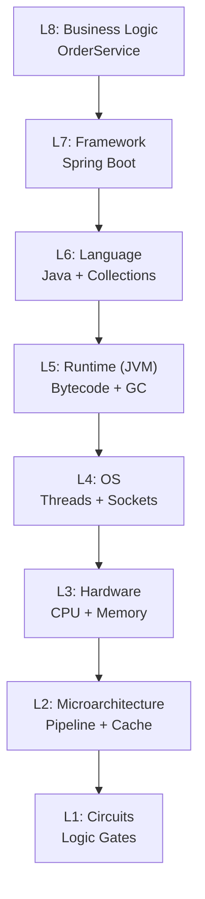
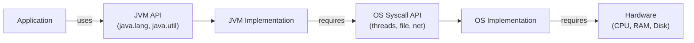

⚡ TL;DR - Computing is a stack of abstraction layers
from transistors to business applications. Each layer
hides complexity below it. Engineers who understand
which layer their bug lives in diagnose and fix problems
10x faster.

| #022 | Category: CS Fundamentals - Paradigms | Difficulty: ★☆☆ |
|:---|:---|:---|
| **Depends on:** | CSF-001 (CS Map), CSF-004 (Code to Execution), CSF-015 (Abstraction) | |
| **Used by:** | CSF-024 (Functional Programming), SYD-001 (System Design) | |
| **Related:** | CSF-003 (CS Ecosystem Map), SAP-001 (Software Architecture) | |

---

### 🔥 The Problem This Solves

**WORLD WITHOUT IT:**

Early programmers wrote in machine code - binary
instructions for a specific CPU. Adding two numbers
required knowing the exact register layout, instruction
encoding, and memory addressing for that chip. Writing
a "hello world" program required understanding the
screen's memory-mapped buffer address and the ASCII
encoding. Every program was tightly coupled to every
hardware detail. Moving a program to a different CPU
meant rewriting it from scratch.

**THE BREAKING POINT:**

As computers became complex, no single person could
hold every detail in mind simultaneously. A programmer
writing business logic should not need to know how
the CPU pipeline handles branch prediction. A network
engineer should not need to understand how TCP segments
are encoded in ethernet frames. The cognitive load of
knowing everything at every level made software complexity
unmanageable.

**THE INVENTION MOMENT:**

The insight: build systems in layers where each layer
exposes a clean interface to the layer above and hides
all details of the layer below. Dijkstra formalized this
as "levels of abstraction" in 1968. The compiler abstracts
machine code. The OS abstracts hardware. A network protocol
stack abstracts physical signals into reliable streams.
An API abstracts a service's internals. Each layer provides
a contract; consumers of the contract need not understand
the implementation.

**EVOLUTION:**

1940s: Machine code. 1950s: Assembly (symbolic names
for instructions). 1957: High-level language (Fortran
abstracts arithmetic). 1960s: Operating systems (abstract
hardware). 1970s: Structured programming (abstract control
flow). 1980s: OOP (abstract objects). 1990s: Network stacks
(TCP/IP abstracts physical networks). 2000s: Web frameworks
(abstract HTTP). 2010s: Cloud (abstract data centers).
2020s: AI APIs (abstract model training). Each decade adds
a new abstraction layer.

---

### 📘 Textbook Definition

Abstraction levels (or layers of abstraction) represent
the hierarchical organization of computing systems from
low-level physical hardware to high-level application
logic. Each level provides a set of services to the
level above through a defined interface, hiding the
complexity of its implementation. This "information
hiding" (Parnas, 1972) allows each level to change its
implementation without affecting the levels above, as
long as the interface contract is maintained. The classic
abstraction stack in computing runs from: transistors
and gates - through - logic circuits - processor architecture -
machine language - assembly - high-level languages - runtime
and OS - frameworks and libraries - application code -
domain model and business logic. Each level is a complete
engineering discipline in itself; understanding where a
problem lives in this stack is the first step to solving it.

---

### ⏱️ Understand It in 30 Seconds

**One line:**
Computing is a stack of layers; each layer hides complexity
below it and exposes a clean contract above it.

**One analogy:**

> Driving a car operates at the "steering wheel and pedals"
> abstraction level. You do not think about the combustion
> cycle, transmission gear ratios, or tire contact patch physics.
> But if the car is not responding, diagnosing the issue
> requires dropping down to the next level (engine? transmission?
> tires?). A mechanic diagnosing an engine drops further
> (injectors? valves? sensors?). Each layer of the car is a
> separate engineering discipline. Software systems work
> identically: the application developer operates at the
> "API and business logic" level; the infrastructure engineer
> operates at the "network and OS" level; the hardware engineer
> operates at the "CPU and memory" level. Bugs at the wrong
> level look mysterious until you identify which layer they
> actually live in.

**One insight:**

Every bug lives at exactly ONE layer. A `NullPointerException`
in application code is NOT a JVM bug - it is an application-
layer bug. A TCP timeout is NOT an application bug -
it is a network-layer event that the application-layer
must handle. Misidentifying the layer of a bug wastes
enormous engineering time. The discipline of identifying
which abstraction layer owns a problem is one of the
most valuable diagnostic skills in software engineering.

---

### 🔩 First Principles Explanation

**THE FULL ABSTRACTION STACK:**

```
┌──────────────────────────────────────────────┐
│          Abstraction Stack in Java           │
├──────────────────────────────────────────────┤
│ L8: Business / Domain Logic                  │
│     OrderService, PaymentProcessor           │
├──────────────────────────────────────────────┤
│ L7: Application Framework                    │
│     Spring Boot, Hibernate, Kafka Client     │
├──────────────────────────────────────────────┤
│ L6: Language / Standard Library              │
│     Java Collections, java.util.concurrent   │
├──────────────────────────────────────────────┤
│ L5: Runtime (JVM)                            │
│     Bytecode interpreter, JIT, GC            │
├──────────────────────────────────────────────┤
│ L4: Operating System                         │
│     Threads, filesystem, network sockets     │
├──────────────────────────────────────────────┤
│ L3: Hardware Abstraction (CPU / Memory)      │
│     ISA (x86-64, ARM), virtual memory, caches│
├──────────────────────────────────────────────┤
│ L2: Microarchitecture                        │
│     Pipeline, branch predictor, TLB          │
├──────────────────────────────────────────────┤
│ L1: Digital Circuits                         │
│     Logic gates, ALU, registers              │
└──────────────────────────────────────────────┘
```



**KEY PROPERTIES OF EACH LAYER:**

1. Each layer has an INTERFACE (what it promises to
   the layer above) and an IMPLEMENTATION (how it delivers
   that promise using layers below).
2. A layer HIDES implementation details of all layers
   below it. Application code does not see syscalls;
   the OS does not see transistors.
3. Layers can be REPLACED without affecting layers
   above, as long as the interface contract holds.
   (Docker replaces bare-metal OS; bytecode replaces
   native code; a mock replaces a database in tests.)
4. LEAKY ABSTRACTIONS: sometimes lower-layer details
   "leak" through the interface. TCP's reliability
   guarantee breaks down at very high latency (the
   application must handle retries). Garbage collection
   pauses are visible to application-layer latency.

**THE TRADE-OFFS:**

**Gain from abstraction layers:** Cognitive manageability.
Separation of concerns. Independent evolution of layers.
Replaceable implementations. Testability (mock the layer
below).

**Cost:** Performance overhead. Each layer crossing adds
latency (syscalls, JNI, RPC). Leaky abstractions create
debugging challenges. The abstraction stack hides information
that is sometimes critical (a GC pause is "invisible"
to application code, but very visible to the user).

---

### 🧪 Thought Experiment

**SETUP:**

A Java web service is slow: P99 latency is 2000ms instead
of 100ms. The code looks fine. Where is the bug?

Apply the abstraction layer framework:

**L8 Business Logic:** Is the algorithm correct and
efficient? Check for N+1 database queries, inefficient
loops.

**L7 Framework:** Is Hibernate generating unexpected SQL?
Is Spring's AOP proxy adding overhead? Enable SQL logging.

**L6 Language:** Are there boxing/unboxing issues?
Excessive `String` concatenation?

**L5 JVM:** Is GC pausing? Is JIT compilation not complete?
Run with GC logging (`-Xlog:gc*`). Check with `jstat`.

**L4 OS:** Are there thread scheduling delays? Is the
system under memory pressure (swap)? Check with `vmstat`,
`iostat`.

**L3 Hardware:** Is the CPU hot? Is memory bandwidth
saturated? Check with `top`, cloud metrics.

**L3-L4 Network:** Is the database call slow? TCP timeout?
DNS resolution? Network partition? Check with `traceroute`,
network dashboards.

**THE LESSON:**

Without the abstraction layer framework, "the service
is slow" has infinite possible causes. With it, you
systematically test each layer until you find which
one is behaving unexpectedly. The framework converts
"mysterious slowness" into a structured diagnostic
investigation. In this example, the GC log reveals
200ms pauses every 2 seconds - a JVM-layer (L5) problem
requiring heap tuning, not code changes.

---

### 🎯 Mental Model / Analogy

**THE POSTAL SYSTEM ANALOGY:**

The postal system is a perfect abstraction stack.

- You (sender) operate at the "letter" level: write content,
  put it in an envelope, write address. This is your API.
- The post office operates at the "parcel routing" level:
  sort by destination, assign to carrier route.
- The delivery vehicle operates at the "physical transport" level.
- The road network operates at the "infrastructure" level.

You do not know which truck carried your letter. The post
office does not care what is written inside. The truck
driver does not know the parcel's destination city. Each
layer has complete information about its own level and
no visibility into the level above or below. When
something goes wrong (a letter is delayed), the diagnostic
question is: at which layer? Lost in routing? In transport?
At delivery? The same question applies to every slow
or broken web request.

**MEMORY HOOK:**

"BFLOJOH" - Business, Framework, Language, OS, JVM,
OS (again at network), Hardware. Or simpler: "App, Runtime,
OS, Iron." When a bug appears, ask: "Which of these
four levels is behaving unexpectedly?"

---

### 📊 Gradual Depth - Five Levels

**Level 1 - Child:**
Computing is like building with blocks. The bottom blocks
(transistors) are tiny and fast but hard to work with.
You stack blocks on top to make it easier. By the top
level (your app), you just write what you want and all
the lower blocks do the hard work automatically.

**Level 2 - Student:**
The CPU executes machine code. The OS provides processes,
threads, and files. The JVM translates Java bytecode to
machine code. Libraries provide reusable functions. Your
application uses all of these. Each layer is an interface
you program to, not an implementation you need to understand.

**Level 3 - Professional:**
Abstraction layers enable independent development:
the database team can change the database engine without
affecting the application (as long as the SQL interface
is maintained). The cloud team can change the infrastructure
without affecting the OS interface. This is the principle
that makes software scalable as an organization.
"Leaky abstraction" (Joel Spolsky's Law) means that
every abstraction eventually breaks down and forces
you to understand the layer below.

**Level 4 - Senior Engineer:**
Performance optimization often requires "dropping a layer."
A Java application that is slow due to GC pressure requires
understanding JVM memory management (L5). An application
slow due to disk I/O requires understanding OS I/O buffering (L4).
An application slow due to cache misses requires understanding
CPU cache architecture (L3). Engineers who can only operate
at L7/L8 (framework/application) cannot diagnose cross-layer
performance issues. The skill gap between junior and senior
engineers often manifests as the inability to drop below
the application layer for diagnostics.

**Level 5 - Expert:**
Abstraction layer design is itself a first-class engineering
discipline. The choice of WHERE to put an abstraction
boundary determines what changes are easy and what changes
are hard. API versioning, backward compatibility, and
deprecation strategies are all exercises in managing
abstraction layer contracts. Systems that violate layering
(accessing internal implementation details of a layer
below) are "tightly coupled" - they break when the lower
layer changes. The goal of "clean architecture" (Hexagonal,
Onion, Ports and Adapters) is to manage these layer boundaries
explicitly, ensuring that business logic (L8) has zero
dependency on infrastructure concerns (L4-L6).

*Expert Cues - Level 5:*
The POSIX standard is an OS-level abstraction that allows
the same Unix application to run on Linux, macOS, and BSD.
JVM bytecode is a runtime-level abstraction that allows
Java programs to run on any JVM regardless of CPU architecture.
Docker containers are a runtime + OS-level abstraction
that allows applications to run regardless of host OS
distribution. Each of these is a successful abstraction
layer that has fundamentally shaped computing. Understanding
why each works (what it hides, what it exposes) is the
basis for designing good abstractions in application code.

---

### ⚙️ How It Works (Formal Basis)

**THE INTERFACE CONTRACT:**

Each abstraction layer defines:
1. PROVIDED SERVICES: what the layer offers above it.
2. REQUIRED SERVICES: what the layer needs from below.
3. INVARIANTS: guarantees that always hold across the interface.

For the JVM:
- PROVIDED: execute Java bytecode; manage memory (GC);
  provide java.lang, java.util APIs.
- REQUIRED: OS provides threads, memory allocation, file I/O.
- INVARIANTS: type safety, memory safety (no buffer overruns),
  garbage collection (no manual free).

```
┌────────────────────────────────────────────────┐
│      Abstraction Layer Contract Model          │
├────────────────────────────────────────────────┤
│                   Application                  │
│   USES         [java.util, Spring, Hibernate]  │
│                         |                      │
│   PROVIDED ──────────── JVM ───────── REQUIRED │
│   (bytecode exec, GC)   |   (OS: threads, IO) │
│                   [Linux / Windows]            │
│   PROVIDED ──────────── OS ──────── REQUIRED  │
│   (processes, FS, net)  |   (CPU, RAM, disk)  │
│                   [Hardware]                   │
└────────────────────────────────────────────────┘
```



**LEAKY ABSTRACTION - LAW:**

Joel Spolsky's Law of Leaky Abstractions (2002):
"All non-trivial abstractions, to some degree, are leaky."

Examples:
- TCP guarantees reliable delivery, but its flow control
  and congestion control behavior is visible to the
  application as varying throughput and latency.
- The JVM's GC "hides" memory management, but GC pauses
  are visible as latency spikes.
- SQL abstracts query execution, but query plan choices
  determine whether a query runs in 1ms or 10 seconds.

Implication: Engineers must know at least one layer below
their primary working level to diagnose leaky abstractions.

---

### 🔄 System Design Implications

**ABSTRACTION LEVELS IN SYSTEM DESIGN:**

Every system design decision is a choice about where
to place abstraction boundaries:

- Should the service expose a high-level domain API
  (`placeOrder()`) or a low-level data API (`createRow()`)?
- Should the database schema be abstracted by an ORM
  or accessed via raw SQL?
- Should the message format be abstracted by a schema
  registry or embedded in application code?

The pattern: higher abstraction = more flexibility for
the caller, more constraint on the provider. Lower
abstraction = more control for the caller, more coupling
to implementation.

**WHAT CHANGES AT SCALE:**

At 10x traffic: abstraction layer OVERHEAD becomes
measurable. An extra HTTP hop (one additional abstraction
layer in a microservices call) adds 0.1-5ms. At 1000 rps,
this is negligible. At 100K rps, it is 5-50ms of aggregate
latency from abstraction cost alone.

At 100x complexity: enforcing layer boundaries pays
dividends. Code that respects abstraction layers (no
`org.internal` imports, no direct database access from
controllers) is refactorable. Code that crosses layers
freely is unmaintainable.

---

### 💻 Code Example

**Example 1 - Wrong vs Right: Layer Crossing**

```java
// BAD: Controller directly accesses DB (layer violation).
// Business logic and infrastructure mixed at L8 level.
@RestController
class OrderController {
    @Autowired DataSource dataSource;

    @GetMapping("/orders/{id}")
    Order getOrder(@PathVariable Long id) throws SQLException {
        // Controller uses raw JDBC - crossing to L4 level
        Connection conn = dataSource.getConnection();
        PreparedStatement ps = conn.prepareStatement(
            "SELECT * FROM orders WHERE id = ?");
        ps.setLong(1, id);
        ResultSet rs = ps.executeQuery();
        // ... map result to Order ...
    }
}
// Problem: controller tests need a real database.
// Changes to DB schema require changing the controller.

// GOOD: Each layer has a single responsibility
@RestController  // L7 - HTTP handling
class OrderController {
    private final OrderService orderService; // L8

    @GetMapping("/orders/{id}")
    Order getOrder(@PathVariable Long id) {
        return orderService.findById(id); // delegates to L8
    }
}

@Service  // L8 - business logic
class OrderService {
    private final OrderRepository repo; // L7 - framework
    Order findById(Long id) {
        return repo.findById(id)
            .orElseThrow(() -> new OrderNotFoundException(id));
    }
}

@Repository  // L7 - data access abstraction
interface OrderRepository extends JpaRepository<Order, Long> {}
// L5/L4: JPA + JDBC handle the actual DB layer transparently
```

---

### ⚠️ Common Misconceptions

| Misconception | Reality |
|---|---|
| Higher abstraction = better | Higher abstraction reduces cognitive load but adds overhead and can hide critical information. The correct abstraction level depends on the problem. High-frequency trading systems are written closer to metal (lower abstraction) because GC pauses and JVM overhead are unacceptable. |
| If I don't understand the lower layers, my code is wrong | Not necessarily. The point of abstraction layers is that you DO NOT need to understand below your working level for normal operation. You only need to drop down when debugging cross-layer issues. Effective Java programmers use the JVM without understanding CPU pipeline stages. |
| Abstraction violations only matter in large codebases | Even small codebases suffer from layer violations. A unit test that requires a database (because the controller accesses the DB directly) is slower, fragile, and harder to maintain - regardless of codebase size. |
| Leaky abstractions are always bugs | Leaky abstractions are the NORMAL behavior of all real abstractions. TCP leaks its congestion control behavior. GC leaks pause times. SQL leaks query plan choices. Understanding WHERE and HOW an abstraction leaks is the engineering skill; the leak itself is expected. |

---

### 🚨 Failure Modes & Diagnosis

**Failure Mode 1: Misidentified Bug Layer**

**Symptom:** Team spends days debugging application code
for a performance issue that turns out to be a GC pause
or a network congestion issue.

**Root Cause:** The engineer diagnosed at the wrong layer
(looked at L8 business logic when the issue was at L5 JVM
or L4 network).

**Diagnostic Signal:** All application code changes produce
no improvement. The issue is intermittent and correlated
with time rather than code path.

**Fix:** Systematic layer descent. Start at L4 (OS metrics:
CPU, memory, network). Check L5 (JVM: GC logs, JVM metrics).
Then L7 (framework: Spring, Hibernate). Then L8 (application).

```bash
# Layer 4 - OS diagnostics
vmstat 1          # CPU, memory, IO every 1 second
iostat -x 1       # Disk IO
ss -s             # Network socket summary

# Layer 5 - JVM diagnostics
jstat -gc <pid> 1000   # GC stats every second
jstack <pid>           # Thread dump

# Layer 7 - Framework diagnostics
# Enable Spring SQL logging:
logging.level.org.hibernate.SQL=DEBUG
```

---

**Security Note:**

Abstraction layers create security boundaries. Cross-layer
access is often a security vulnerability: SQL injection
occurs when user input (L8 business data) crosses the
layer boundary into SQL execution (L7 infrastructure)
without proper escaping. The abstraction layer contract
(parameterized queries) exists precisely to prevent
untrusted L8 data from being interpreted as L7 instructions.
SSRF (Server-Side Request Forgery) occurs when user input
crosses the L7 HTTP client layer to initiate unintended
network requests. Every time data crosses a layer boundary
from untrusted to trusted, it must be validated and
sanitized.

---

### 🔗 Related Keywords

**Prerequisites (understand these first):**
- `What Is Computer Science` (CSF-001) - provides the
  map of CS domains that corresponds to abstraction layers
- `How Code Becomes Execution` (CSF-004) - traces one
  specific path through the abstraction stack (source ->
  bytecode -> JIT -> CPU instruction)
- `Abstraction` (CSF-015) - the OOP-level concept of
  abstraction; this entry extends it to the whole system

**Builds On This (learn these next):**
- `System Design Fundamentals` (SYD-001) - system design
  is the practice of choosing correct abstraction layers
  for a system
- `Distributed Systems` (DST-001) - distributed systems
  add additional layers (network, consensus, eventual
  consistency) above the application layer

**Alternatives / Comparisons:**
- `Clean Architecture` (SAP-001) - the application of
  abstraction layer discipline to software architecture:
  business rules at the center, frameworks and I/O at
  the outside; no inward dependencies on outer layers

---

### 📌 Quick Reference Card

```
┌────────────────────────────────────────────────────────┐
│ STACK        │ Business > Framework > Language >       │
│              │ Runtime (JVM) > OS > Hardware           │
├──────────────┼─────────────────────────────────────────┤
│ BUG RULE     │ Every bug lives at exactly one layer.   │
│              │ Identify the layer before diagnosing.   │
├──────────────┼─────────────────────────────────────────┤
│ LEAKY ABS.   │ All abstractions leak. Know one layer   │
│              │ below your primary working level.        │
├──────────────┼─────────────────────────────────────────┤
│ PERF RULE    │ Overhead accumulates at layer crossings. │
│              │ Count how many layers a request crosses. │
├──────────────┼─────────────────────────────────────────┤
│ SECURITY     │ Data crossing a layer boundary from     │
│              │ untrusted to trusted must be validated.  │
├──────────────┼─────────────────────────────────────────┤
│ DESIGN       │ Abstraction boundary = what can change   │
│              │ independently. Define boundaries first.  │
├──────────────┼─────────────────────────────────────────┤
│ ONE-LINER    │ "Each layer hides complexity below;      │
│              │ bugs live at exactly one layer; identify │
│              │ it before diagnosing."                  │
├──────────────┼─────────────────────────────────────────┤
│ NEXT EXPLORE │ SYD-001 (System Design), SAP-001 (Arch) │
└────────────────────────────────────────────────────────┘
```

**If you remember only 3 things:**

1. Computing is a stack of abstraction layers. Each layer
   hides the layers below it and exposes a clean interface
   above. Your application code operates at the top layers.
2. Every bug lives at exactly one layer. When a system
   misbehaves, identify which layer is behaving unexpectedly
   before writing any code to fix it.
3. All abstractions leak. To diagnose cross-layer issues,
   you must know at least one layer below your primary
   working level (JVM for Java developers, OS for JVM
   developers, etc.).

**Interview one-liner:**
"Computing is organized in abstraction layers from hardware
to application logic. Each layer hides the layers below and
exposes a contract above. Every performance and reliability
problem lives at a specific layer; systematic layer-by-layer
diagnosis is faster than random code inspection. The
Spolsky Law of Leaky Abstractions says all abstractions
eventually reveal their implementation - engineers must
know one layer below their working level."

---

### 💎 Transferable Wisdom

**Reusable Engineering Principle:**
Every complex system is an abstraction stack. The discipline
of defining clean interfaces between layers - so that each
layer can be developed, tested, and replaced independently -
is the single most powerful engineering technique for
managing complexity. This applies at every scale: a function
(interface = signature), a module (interface = package API),
a service (interface = REST/gRPC contract), an organization
(interface = team contracts and APIs). Systems that respect
layer boundaries are maintainable. Systems that violate
them become unmaintainable as they grow.

**Where else this pattern appears:**

- **OSI network model** - 7 layers from physical (bits
  on wire) to application (HTTP, DNS). Each layer talks
  only to the layer immediately above and below. A broken
  network is diagnosed layer by layer: physical, then
  data link, then network, then transport, then application.
- **Clean Architecture / Hexagonal Architecture** -
  formal software architecture patterns that enforce
  layer discipline: domain model at center, application
  services next, infrastructure at the edges. Dependencies
  point inward only.
- **Kubernetes container orchestration** - adds two
  abstraction layers above the OS: container (Docker) and
  pod/deployment (Kubernetes). A developer operates at
  the Kubernetes layer without managing OS or hardware.
  A platform team manages the Kubernetes layer without
  modifying application code.

---

### 💡 The Surprising Truth

The law of leaky abstractions predicts that as you increase
the abstraction level of your tools, you INCREASE the amount
of underlying knowledge you need - not decrease it. SQL
databases abstract away storage details, but to write
efficient SQL you must understand B-tree indexes, query
planners, and buffer pool usage. Web frameworks abstract
HTTP, but to build scalable web apps you must understand
connection pooling, request queuing, and keep-alive.
The programmer who understands only the top layer is
dependent on the lower layers working perfectly - which
they never do at scale. Paradoxically, the engineers
who are most productive at the highest abstraction levels
are those who have the deepest understanding of the layers
below. Abstraction layers do not eliminate the need for
lower-level knowledge - they deferred it until things go
wrong.

---

### ✅ Mastery Checklist

**You've mastered this when you can:**

1. **[EXPLAIN]** For a given Java web application request
   (client sends HTTP request -> Spring controller ->
   service -> JPA/Hibernate -> database), name every
   abstraction layer the request passes through, and
   identify the interface contract that exists at each
   layer boundary.

2. **[DEBUG]** Given a production slowness complaint
   with no obvious cause in the application code, design
   a layer-by-layer diagnostic investigation: what metrics
   and commands to check at the OS, JVM, framework, and
   application layers in sequence, and what findings
   at each layer would indicate the bug lives there.

3. **[DESIGN]** For a new microservice, define the
   abstraction layer boundaries: what is in the domain
   model (L8), what is in the application service layer
   (L7), what is in the data access layer (L6/L5), and
   write the interfaces that enforce these boundaries.

4. **[IDENTIFY]** Review a given codebase and identify
   3 specific locations where a layer boundary is violated
   (code at layer N directly uses implementation details
   of layer N-2). Explain why each violation is problematic
   and propose the interface abstraction that would fix it.

5. **[EXTEND]** Explain the Joel Spolsky Law of Leaky
   Abstractions with two concrete Java examples (one
   JVM-level leak, one framework-level leak), describe
   what knowledge of the layer below is needed to diagnose
   each leak, and explain why this knowledge is not
   "unnecessary detail" but essential for engineering
   at scale.

---

### 🧠 Think About This Before We Continue

**Q1.** A Java developer claims: "I've been writing Java
for 10 years and never needed to know how the JVM works."
Then their service starts experiencing 200ms p99 latency
spikes every 45 seconds. The code has not changed. What is
the diagnostic path, and what will they find? What does
this incident reveal about the relationship between
abstraction layers and required engineering knowledge?

*Hint: 200ms spikes at regular intervals almost always
indicate GC full collection cycles. The developer needs
JVM-level knowledge (GC logs, heap sizing, generation
tuning) to fix this - which they claimed was unnecessary.
The Spolsky Law in action: the JVM's memory management
abstraction has leaked through.*

**Q2.** Why does SQL injection remain the #1 web
application security vulnerability (OWASP Top 10) after
more than 25 years? Frame this as a failure of the
abstraction layer model: which layer boundary is being
violated, what invariant is being broken, and how does
the correct abstraction (parameterized queries) restore
the boundary?

*Hint: SQL injection = user input (L8: application data)
is being interpreted as SQL commands (L7: infrastructure
layer instruction). The layer boundary between "data"
and "instructions" is violated. Parameterized queries
enforce the boundary: data remains data and is never
interpreted as instructions. What does this tell you
about the relationship between abstraction layer discipline
and security?*

**Q3.** A team adopts gRPC instead of REST for their
internal service-to-service communication. They argue
it is "more efficient and type-safe." Six months later,
they regret the decision because debugging is much harder.
What abstraction layer trade-off did they make, and why
does it manifest as a debugging problem?

*Hint: REST+JSON is a human-readable protocol that can
be inspected with curl, browser dev tools, and any HTTP
client. gRPC+Protobuf is a binary protocol requiring
special tooling. The abstraction trade-off: gRPC is more
efficient (lower layer overhead) but less debuggable
(the human-readability abstraction is lost). What tools
fill this gap? What does this say about choosing abstraction
levels based on efficiency vs observability?*

---

### 🎯 Interview Deep-Dive

**Q1: "A Java web service is responding slowly (P99 = 2000ms)
but the code looks fine. Walk me through how you would
diagnose this."**

*Why they ask:* Tests systematic diagnostic ability and
knowledge of abstraction layers.

*Strong answer includes:*
- Step 1: Establish baseline. Is it all requests or some?
  Is it correlated with time, request type, or load?
- Step 2: Layer 4 (OS). Check CPU, memory, IO, network
  with `vmstat`, `iostat`, `ss`. Is the host resource-
  constrained?
- Step 3: Layer 5 (JVM). Check GC logs. Are there pauses?
  How long and how frequent? `jstat -gc <pid>`. Is heap
  correctly sized? Is old generation saturated?
- Step 4: Layer 7 (Framework). Enable SQL logging. Are
  Hibernate queries slow? Is there N+1 querying? Is
  connection pool exhausted? Check HikariCP metrics.
- Step 5: Layer 4 (Network / Database). Is the database
  slow? Are network calls taking too long? Check database
  slow query log. Check network latency between service
  and database.
- Step 6: Layer 8 (Application). If all lower layers
  are healthy, then review the application code for
  algorithmic inefficiency.

**Q2: "What is a 'leaky abstraction' and give a
production example from Java development?"**

*Why they ask:* Tests conceptual depth about abstraction
layers beyond surface knowledge.

*Strong answer includes:*
- Definition: an abstraction that hides implementation
  details, but whose implementation details occasionally
  become visible to the layer above through behavior
  differences.
- Java production example 1: GC pauses. The JVM's garbage
  collector is supposed to hide memory management. But
  GC pauses are visible to application code as latency
  spikes. The abstraction leaks its timing behavior.
- Java production example 2: JPA/Hibernate N+1 queries.
  Hibernate abstracts database access as object manipulation.
  But the specific SQL it generates (1 query for the parent
  + N queries for children) leaks through as performance
  degradation.
- Java production example 3: TCP flow control. TCP promises
  reliable delivery, but its throughput varies under load.
  An application that assumes constant throughput
  (allocating a buffer sized for maximum throughput)
  will be surprised when TCP backs off.
- Practical implication: engineers must know one layer
  below their primary working level to diagnose leaky
  abstraction incidents.

**Q3: "Why is Clean Architecture / Hexagonal Architecture
valuable, and what problem does it solve?"**

*Why they ask:* Tests software architecture knowledge
as applied abstraction layer theory.

*Strong answer includes:*
- Problem: in monolithic applications, business logic
  (domain) often becomes entangled with framework code
  (Spring annotations, JPA entities) and infrastructure
  code (database SQL, HTTP client calls). Changing the
  database requires changing business logic. Testing
  business logic requires a running database.
- Clean Architecture solution: enforce layer boundaries
  through dependency rules. Domain layer (innermost) has
  zero dependencies on frameworks or infrastructure.
  Application layer (service) depends only on domain.
  Infrastructure layer (outermost) implements interfaces
  defined by inner layers. All dependencies point inward.
- Concrete benefit: the domain and service layers are
  testable in complete isolation (no Spring context,
  no database, no HTTP). Infrastructure can be replaced
  (swap PostgreSQL for MongoDB) without touching domain
  logic. This is the abstraction layer principle applied
  to software architecture.

> Entry stub. Generate full content using Master Prompt v4.0.