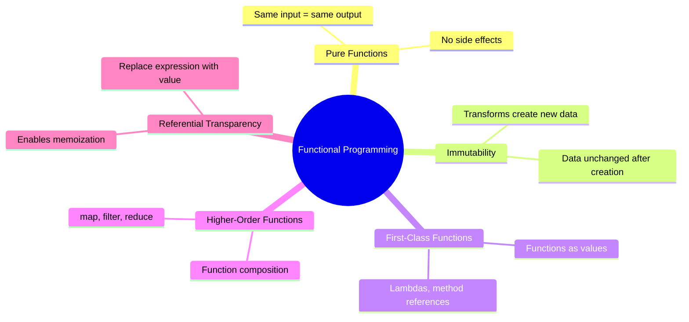
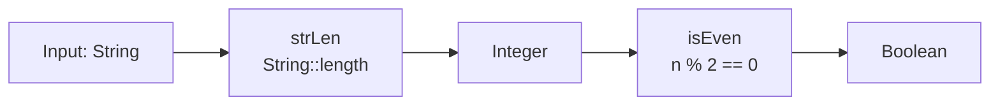

⚡ TL;DR - Functional programming treats computation as
the evaluation of pure functions, avoiding mutable state
and side effects. In Java, streams and lambdas adopt FP
patterns without requiring full commitment to the paradigm.

| #024 | Category: CS Fundamentals - Paradigms | Difficulty: ★★☆ |
|:---|:---|:---|
| **Depends on:** | CSF-008 (Functions), CSF-022 (Abstraction Levels), CSF-012 (Declarative) | |
| **Used by:** | CSF-025 (First-Class Functions), CSF-026 (Higher-Order), CSF-030 (Immutability) | |
| **Related:** | CSF-049 (Monads), CSF-058 (Referential Transparency), JLG-020 | |

---

### 🔥 The Problem This Solves

**WORLD WITHOUT IT:**

Imperative programming controls a computer through
sequences of state mutations: "set x to 5, then add 3 to x,
then write x to the database." This works well for simple
programs but creates problems as complexity grows:
(1) Mutable shared state in concurrent programs causes
race conditions. (2) Functions with side effects are
impossible to test in isolation - they depend on and modify
external state. (3) Code that mutates data in place is
difficult to reason about - you must track every mutation
to understand the current state.

**THE BREAKING POINT:**

Imperative programs with significant shared mutable state
become a maintenance crisis at scale. Every function that
takes an object and modifies it in place is implicitly
dependent on the entire history of mutations to that object.
Testing requires carefully arranging all prior mutations.
Concurrent access to the same mutable state requires
synchronization - and every missed synchronization is a
potential race condition. At the scale of modern distributed
systems (thousands of concurrent requests, microservices,
event-driven architectures), imperative mutable-state
programming creates systems that are correct for the
first 1000 users and catastrophically broken for the next.

**THE INVENTION MOMENT:**

The lambda calculus (Alonzo Church, 1936) formalized the
idea of computation as function application - before
digital computers existed. LISP (John McCarthy, 1958)
was the first practical programming language based on
this model. The key insight: if functions take values
and return values without modifying anything, then:
(1) a function can be called any number of times with
the same input and always produces the same output,
(2) functions can be called in any order (no hidden
dependencies), (3) functions can be run in parallel
without synchronization (no shared state).

**EVOLUTION:**

1958: LISP (first FP language). 1970s: ML (type inference,
pattern matching). 1986: Erlang (FP for distributed
systems, fault-tolerance model). 1990: Haskell (purely
functional, lazy evaluation, strong type system). 2003:
Scala (FP + OOP on JVM). 2011: Clojure (LISP on JVM).
Java 8 (2014): lambdas, streams, Optional, functional
interfaces - FP concepts without abandoning OOP. Java 21:
pattern matching and records support a more functional
style. The trend: mainstream languages are adopting FP
features because immutability and pure functions solve
real concurrency problems.

---

### 📘 Textbook Definition

Functional programming (FP) is a programming paradigm
that treats computation as the evaluation of mathematical
functions and avoids mutable state and side effects.
Core FP concepts: (1) Pure functions - functions that
always return the same output for the same input and
have no side effects (do not modify external state);
(2) Immutability - data is not modified after creation;
new data is created from transformations; (3) First-class
functions - functions are values that can be assigned
to variables, passed as arguments, and returned from
other functions; (4) Higher-order functions - functions
that take other functions as arguments or return functions
as results; (5) Referential transparency - expressions
can be replaced with their evaluated values without
changing program behavior (a consequence of purity).
Languages can be purely functional (Haskell - no
imperative features) or functionally-influenced (Java,
Kotlin, Scala - FP features available alongside OOP).

---

### ⏱️ Understand It in 30 Seconds

**One line:**
FP says: avoid mutable state and side effects; instead,
transform immutable data through pure functions.

**One analogy:**

> Imperative programming is like cooking by modifying
> ingredients in place: take the butter, melt it, add
> flour, stir it. Each step changes the state of the
> ingredients. You cannot undo steps. Cooking twice from
> the same starting point requires carefully restoring
> the original state.
>
> Functional programming is like cooking with recipes that
> return new dishes: "given butter + flour, returns a roux."
> The original butter and flour still exist. The roux is
> a new thing. You can run the recipe 100 times on the same
> inputs and always get the same output. The recipe does
> not care what happened before it was called.

**One insight:**

Every time you write a Java stream pipeline
`list.stream().filter(...).map(...).collect(...)`, you
are using functional programming: each step takes
immutable data and returns new data, without modifying
the original list. The `list` is unchanged. This is not
a coincidence - Java Streams were specifically designed
to bring FP patterns (map, filter, reduce) to Java
because they are easier to reason about and parallelize
(use `parallelStream()`) than imperative loops.

---

### 🔩 First Principles Explanation

**THE FIVE CORE CONCEPTS:**

```
┌──────────────────────────────────────────────┐
│     Functional Programming Concepts          │
├──────────────────────────────────────────────┤
│ 1. PURE FUNCTIONS                            │
│    f(x) always = same output for same x      │
│    No side effects (no I/O, no state change) │
│                                              │
│ 2. IMMUTABILITY                              │
│    Data is never modified after creation     │
│    Transformations create NEW data           │
│                                              │
│ 3. FIRST-CLASS FUNCTIONS                     │
│    Functions are values (pass, store, return)│
│    Java: Runnable, Predicate<T>, Function<T,R>│
│                                              │
│ 4. HIGHER-ORDER FUNCTIONS                    │
│    Functions that take/return functions      │
│    Java: map(), filter(), reduce(), sorted() │
│                                              │
│ 5. REFERENTIAL TRANSPARENCY                 │
│    Expression can be replaced by its value  │
│    Consequence of purity + immutability      │
└──────────────────────────────────────────────┘
```



**PURE FUNCTIONS - FORMAL DEFINITION:**

A function `f` is pure if:
1. For any input `x`, `f(x)` always returns the same value.
2. Evaluating `f(x)` produces no observable side effects.

A "side effect" is any observable change to state outside
the function: modifying a variable, writing to a file,
sending a network request, modifying a collection passed
as an argument.

**THE TRADE-OFFS:**

**Gain from FP:** Testability (pure functions need no mocks),
concurrency safety (immutable data needs no synchronization),
reasoning (pure functions can be understood in isolation),
composability (pure functions compose freely).

**Cost of FP:** Performance: creating new data structures
instead of modifying in place can be memory-intensive.
Persistence is required for programs that must change
state (databases, I/O). FP handles side effects through
controlled mechanisms (IO monads, effect systems in
Haskell; explicit side-effect isolation in Java).

**ESSENTIAL vs ACCIDENTAL:**

**Essential:** Pure functions and immutability genuinely
make concurrent programs easier to reason about and
test. This is not a style preference - it is an engineering
advantage in distributed systems.

**Accidental:** Full "purity" (100% FP, no side effects)
is not essential and is impractical in most production
systems. The practical value is adopting FP PATTERNS
(pure functions where possible, immutable data structures,
function composition) while using side effects explicitly
and in controlled locations.

---

### 🧪 Thought Experiment

**SETUP:**

Two Java developers implement a discount calculation.
Developer A uses imperative style; Developer B uses FP style.
A new requirement arrives: calculate the total with AND
without discount for comparison display. Which implementation
is easier to extend?

```java
// Developer A: Imperative (mutates state)
class Cart {
    double total;
    void applyDiscount(double percent) {
        total = total * (1 - percent); // MUTATES total
    }
}
// Problem: To get both original and discounted totals,
// you must copy the cart, apply the discount to the copy,
// and then compare. The mutation makes this awkward.

// Developer B: Functional (creates new value)
class Cart {
    final double total;
    Cart withDiscount(double percent) {
        return new Cart(total * (1 - percent)); // returns NEW Cart
    }
}
// Extension: trivial - call withDiscount(), keep the original
Cart original = new Cart(100.0);
Cart discounted = original.withDiscount(0.15);
display(original.total, discounted.total); // both available
// No mutation, no copy-before-mutate, no synchronization needed
```

**THE LESSON:**

Immutable data with transformation functions is inherently
more composable than mutable state. When requirements change
(as they always do), immutable transformations extend
naturally. Mutable state requires careful management of
"who changed what" to add any new capability.

---

### 🎯 Mental Model / Analogy

**THE PIPELINE FACTORY ANALOGY:**

Functional programming is an assembly line where each
station takes raw material and produces a NEW finished
product - it never modifies the incoming material.

Station 1 (filter): takes a box of products, returns
a NEW box containing only products that pass quality check.
Original box unchanged.

Station 2 (map): takes a box of raw products, returns
a NEW box of packaged products. Original box unchanged.

Station 3 (reduce): takes a box of products, returns
a SINGLE summary (total weight). Box unchanged.

The key: each station is independent. You can run station
1 and station 2 in any order, or in parallel, because
they do not share state. This is why Java's
`parallelStream()` works correctly: functional operations
on immutable data are inherently parallelizable.

**MEMORY HOOK:**

"FP = function IN, new value OUT. No mutation, no
shared state, no side effects in the core computation.
Side effects are pushed to the edges (I/O, DB)."

---

### 📊 Gradual Depth - Five Levels

**Level 1 - Child:**
Functional programming says: instead of changing things,
create new things. Like photocopying a document and
writing on the copy instead of the original - the original
is always safe.

**Level 2 - Student:**
FP uses pure functions (same input = same output, no side
effects) and immutable data. In Java, streams are FP-style:
`filter()`, `map()`, `reduce()` create new collections;
they do not modify the original list.

**Level 3 - Professional:**
Java's functional interfaces (`Predicate<T>`, `Function<T,R>`,
`Consumer<T>`, `Supplier<T>`) enable passing behavior as
arguments. Method references (`Order::getTotal`) are concise
function values. `Optional<T>` replaces null with a functional
container that forces explicit null handling. `Stream.
parallelStream()` uses the Fork/Join pool to parallelize
functional pipelines safely (because functions are pure).

**Level 4 - Senior Engineer:**
Distinguishing pure from impure in practice: pure functions
are the "core" of a system (domain logic, calculations,
transformations); impure functions are the "shell" (database
writes, HTTP calls, logging). The architecture pattern
"functional core, imperative shell" (Gary Bernhardt)
organizes systems so pure business logic is tested without
mocks, while side-effecting infrastructure code is isolated
at the boundaries. This directly improves testability:
pure functions need no mocks, no databases, no Spring
context - just `assertEquals(expected, pureFn(input))`.
Function composition: `Function.andThen()` and `Function.
compose()` create new functions by chaining existing ones,
enabling reuse and declarative pipeline construction.

**Level 5 - Expert:**
Algebraic data types (sealed classes + records in Java 21)
and pattern matching bring structural FP to Java.
A sealed interface with record implementations is a
discriminated union - the FP equivalent of a class hierarchy,
but without the LSP concerns of inheritance. Effect systems
(Vavr's `IO` monad, Cats Effect in Scala) track side
effects in the type system, ensuring pure functions are
provably pure by the compiler. In purely functional languages
(Haskell), I/O is represented as a value of type `IO A`
- performing I/O requires "running" the IO value, making
the side effect explicit in the type. Java does not have
this, but libraries like Vavr and Reactor enforce a similar
discipline through their types. Persistent data structures
(immutable collections that share structure between
"before" and "after" versions) make immutability practical
for large data - an `append` on a persistent list is O(1)
amortized by sharing the tail structure.

---

### ⚙️ How It Works (Formal Basis)

**REFERENTIAL TRANSPARENCY AND SUBSTITUTION:**

A function is referentially transparent if `f(x)` can
be replaced by its return value everywhere without
changing program behavior.

```java
// Referentially transparent:
int double(int n) { return n * 2; }
// You can replace double(5) with 10 everywhere.
// The program behavior is identical.

// NOT referentially transparent:
int counter = 0;
int incrementAndGet() { return ++counter; }
// First call returns 1; second call returns 2.
// Cannot replace incrementAndGet() with a constant.
```

**FUNCTION COMPOSITION:**

```
┌──────────────────────────────────────────────┐
│    Function Composition in Java              │
├──────────────────────────────────────────────┤
│ Function<String, Integer> strLen =           │
│     String::length;                          │
│ Function<Integer, Boolean> isEven =          │
│     n -> n % 2 == 0;                         │
│                                              │
│ Function<String, Boolean> strLenIsEven =     │
│     strLen.andThen(isEven);                  │
│                                              │
│ strLenIsEven.apply("hello") // false (5)     │
│ strLenIsEven.apply("Java")  // true (4)      │
│                                              │
│ The composed function = new function that    │
│ chains both - no side effects, composable    │
└──────────────────────────────────────────────┘
```



**JAVA STREAM PIPELINE AS FP:**

Java streams implement a functional pipeline:
- `filter(Predicate<T>)` - takes a function, returns new stream
- `map(Function<T,R>)` - takes a function, transforms elements
- `reduce(T, BinaryOperator<T>)` - folds the stream to a value
- All are pure operations on the elements (they do not
  modify the source list)
- `collect(Collector<T,A,R>)` is the controlled side-effect
  step (producing the output collection)

---

### 🔄 System Design Implications

**FP IN DISTRIBUTED SYSTEMS:**

The most important application of FP concepts in distributed
systems is event sourcing and the Command-Query Responsibility
Segregation (CQRS) pattern. In event sourcing, system
state is computed by reducing a sequence of immutable
events - a pure function from `[Event]` to `State`. This
is precisely the `reduce` operation from FP applied to
system state management.

**WHAT CHANGES AT SCALE:**

At 10x data: persistent (immutable, structurally-shared)
data structures become important. Naive immutability (copy
the entire collection on each operation) is O(n) per
operation. Persistent data structures (persistent HashMap,
persistent List) share structure between versions, giving
O(log n) updates. Clojure uses persistent data structures
by default; Java's standard library does not, but Vavr
provides them.

At 100x concurrency: pure functions are thread-safe by
definition. Immutable data needs no synchronization.
The performance advantage of FP in concurrent contexts:
no lock contention, no race conditions, no synchronized
blocks. `java.util.stream.parallelStream()` exploits
this directly.

---

### 💻 Code Example

**Example 1 - Wrong vs Right: Impure vs Pure**

```java
// BAD: Impure function - modifies external state (side effect)
// Cannot test without checking the orders list after call.
// Cannot run concurrently without synchronization.
List<Order> orders = new ArrayList<>();
void applyDiscount(Order order, double pct) {
    order.setTotal(order.getTotal() * (1 - pct)); // MUTATION
    orders.add(order); // SIDE EFFECT: modifies external state
}

// GOOD: Pure function - takes input, returns new value
// Testable with just assertEquals. Thread-safe by default.
Order applyDiscount(Order order, double pct) {
    return new Order(
        order.getId(),
        order.getTotal() * (1 - pct) // new value, no mutation
    );
}
// Usage:
Order discounted = applyDiscount(original, 0.15);
// original is UNCHANGED; discounted is a new Order
```

**Example 2 - Functional Pipeline in Java**

```java
// Imperative (mutable, hard to parallelize):
List<Double> totals = new ArrayList<>();
for (Order order : orders) {
    if (order.getStatus() == PENDING) {
        totals.add(order.getTotal() * 1.1); // tax
    }
}
double grandTotal = 0;
for (double t : totals) grandTotal += t;

// Functional (immutable pipeline, trivially parallelizable):
double grandTotal = orders.stream()
    .filter(o -> o.getStatus() == PENDING)
    .mapToDouble(o -> o.getTotal() * 1.1)
    .sum();

// Parallel: just swap .stream() for .parallelStream()
// Thread-safe because filter/map are pure functions.
double grandTotal = orders.parallelStream()
    .filter(o -> o.getStatus() == PENDING)
    .mapToDouble(o -> o.getTotal() * 1.1)
    .sum();
```

**Testing/Verification:**

```java
// Pure function test: no mocks, no setup, no Spring context
@Test
void applyDiscount_reducesByPercentage() {
    Order input = new Order("ID-1", 100.0);
    Order result = applyDiscount(input, 0.20);
    assertEquals(80.0, result.getTotal(), 0.001);
    assertEquals(100.0, input.getTotal(), 0.001); // original unchanged
}
// Zero infrastructure required. This is the FP testing advantage.
```

---

### ⚖️ Comparison Table

| Aspect | Imperative / OOP | Functional |
|---|---|---|
| State management | Mutable objects; in-place modification | Immutable values; transformation creates new values |
| Concurrency safety | Explicit synchronization required | Thread-safe by design (no shared mutable state) |
| Testing | Mocks needed for dependencies; state setup required | Pure functions: just assertEquals(expected, fn(input)) |
| Readability for data pipelines | Verbose (multiple loops, intermediate variables) | Concise pipeline (filter, map, reduce) |
| Performance | In-place mutation is memory-efficient | Immutable copies can be memory-intensive; mitigated by persistent data structures |
| Side effect handling | Mixed with logic (ad-hoc) | Isolated to "shell"; core logic is pure |
| Java support | Full (Java 1+) | Partial (Java 8+ lambdas, streams, records in 14+) |

---

### ⚠️ Common Misconceptions

| Misconception | Reality |
|---|---|
| FP means no state and no side effects | FP means making side effects EXPLICIT and ISOLATED. All useful programs have side effects (they must read inputs and write outputs). FP isolates the pure computation from the side effects, not eliminate side effects. |
| Java is not a functional language | Java is not a purely functional language, but Java 8+ supports functional programming PATTERNS: lambdas, streams, method references, functional interfaces. "Functional Java" means using these patterns, not rewriting in Haskell. |
| Immutability always causes performance problems | For most applications, the GC overhead of creating new objects is less costly than the synchronization overhead of managing mutable shared state in concurrent contexts. Profile before assuming immutability is a bottleneck. |
| Streams are always faster than loops | Streams have overhead: lambda invocation, spliterator setup, boxing for non-primitive operations. For tiny lists (< 10 elements) or very simple operations, traditional loops are faster. Streams shine for large datasets, complex pipelines, and parallel execution. |
| FP and OOP are mutually exclusive | Modern Java uses both: OOP for structure (classes, interfaces, encapsulation) and FP for computation (pure methods, stream pipelines, immutable value objects). Scala and Kotlin demonstrate that FP + OOP is a powerful combination. |

---

### 🚨 Failure Modes & Diagnosis

**Failure Mode 1: Accidentally Stateful Lambda**

**Symptom:** A stream pipeline using `parallelStream()`
produces incorrect or non-deterministic results.

**Root Cause:** A lambda inside the pipeline captures
and modifies a mutable variable (violating purity).
Parallel streams execute lambdas on multiple threads
concurrently; mutations to shared state cause race conditions.

```java
// BAD: Lambda modifies external state - race condition in parallel
List<Integer> results = new ArrayList<>(); // shared mutable
orders.parallelStream()
    .filter(Order::isPending)
    .forEach(o -> results.add(o.getId())); // race condition!
// results may have missing, duplicated, or corrupt entries

// GOOD: Collect into a new collection via the stream itself
List<Integer> results = orders.parallelStream()
    .filter(Order::isPending)
    .map(Order::getId)
    .collect(Collectors.toList()); // thread-safe collection
```

---

**Failure Mode 2: Optional Misuse - Breaking the Chain**

**Symptom:** NPE despite using `Optional`.

**Root Cause:** `Optional.get()` called without checking
`isPresent()` first, or `Optional` returned from a method
and stored as a field (violating the intended usage).

```java
// BAD: Optional.get() without check - same as null dereference
Optional<Order> opt = findOrder(id);
Order order = opt.get(); // throws NoSuchElementException if empty!

// ALSO BAD: calling get() after checking isPresent() separately
if (opt.isPresent()) {
    processOrder(opt.get()); // this is verbose; use map() instead
}

// GOOD: Use functional Optional API
findOrder(id)
    .map(OrderService::process)
    .ifPresentOrElse(
        result -> log.info("Processed: {}", result),
        () -> log.warn("Order not found: {}", id)
    );
// get() is never called. Chain is broken only if no value.
```

---

**Security Note:**

Purely functional code is inherently easier to audit
for security vulnerabilities because pure functions
have no hidden side effects. A function that does not
access the file system, network, or global state cannot
directly cause injection, SSRF, or state corruption.
However, FP does not eliminate security concerns: data
validation must still happen at the boundary where
untrusted input enters the pure core. Immutable value
objects also ensure that defensive copies are unnecessary -
you cannot inject a mutated object through an API
that uses immutable types.

---

### 🔗 Related Keywords

**Prerequisites (understand these first):**
- `Functions and Procedures` (CSF-008) - functions are
  the unit of computation in FP; understanding function
  semantics is prerequisite
- `Declarative Programming` (CSF-012) - FP is a form
  of declarative programming; understanding declarative
  vs imperative contextualizes FP's approach
- `Abstraction Levels` (CSF-022) - FP operates at a
  mathematical abstraction level above imperative code

**Builds On This (learn these next):**
- `First-Class Functions` (CSF-025) - functions as
  values are the mechanism enabling FP in Java (lambdas,
  method references)
- `Higher-Order Functions` (CSF-026) - functions that
  take/return functions; the core FP composition tool
- `Closures` (CSF-027) - how lambdas capture their
  surrounding scope; critical for FP in Java
- `Immutability` (CSF-030) - immutable data is the
  foundation of safe FP

**Alternatives / Comparisons:**
- `Imperative Programming` (CSF-011) - the contrasting
  paradigm; OOP with mutable state
- `Reactive Programming` (CSF-032) - extends FP to
  async event streams (Project Reactor, RxJava)

---

### 📌 Quick Reference Card

```
┌────────────────────────────────────────────────────────┐
│ CORE RULES   │ Pure functions + Immutable data         │
│              │ Function = input -> new output (no mut) │
├──────────────┼─────────────────────────────────────────┤
│ JAVA TOOLS   │ Stream, Optional, lambda, method ref    │
│              │ Functional interfaces (Predicate, etc.) │
├──────────────┼─────────────────────────────────────────┤
│ TESTING WIN  │ Pure fn: assertEquals(expected, f(x))   │
│              │ No mocks, no setup, always deterministic │
├──────────────┼─────────────────────────────────────────┤
│ CONCURRENCY  │ Pure + immutable = thread-safe by default│
│              │ parallelStream() is safe for pure fns   │
├──────────────┼─────────────────────────────────────────┤
│ ANTI-PATTERN │ Modifying captured variables in lambdas │
│              │ Calling Optional.get() without check    │
├──────────────┼─────────────────────────────────────────┤
│ ARCHITECTURE │ "Functional core, imperative shell"     │
│              │ Pure domain logic; side effects at edges│
├──────────────┼─────────────────────────────────────────┤
│ ONE-LINER    │ "FP = transform data without mutation;  │
│              │ pure functions + immutable data =       │
│              │ testable, concurrent-safe computation"  │
├──────────────┼─────────────────────────────────────────┤
│ NEXT EXPLORE │ CSF-025 (First-Class), CSF-030 (Immutability)│
└────────────────────────────────────────────────────────┘
```

**If you remember only 3 things:**

1. Pure functions always return the same output for the
   same input and have no side effects. They are inherently
   testable (no mocks), thread-safe, and composable.
2. In Java, every stream pipeline is functional programming:
   `filter()`, `map()`, and `reduce()` transform data
   without mutating the source. Use `parallelStream()`
   for thread-safe parallel computation.
3. Isolate side effects to the "shell" of your application.
   Keep the "core" (business logic) pure. This is the
   "functional core, imperative shell" architecture that
   maximizes testability and concurrency safety.

**Interview one-liner:**
"Functional programming uses pure functions and immutable
data to avoid shared mutable state. Java supports FP
patterns via streams and lambdas. Pure functions are
testable without mocks, thread-safe by default, and
composable. The practical architecture pattern: pure
functional core for business logic, imperative shell
for I/O and side effects."

---

### 💎 Transferable Wisdom

**Reusable Engineering Principle:**
The discipline of separating computation from side effects
is one of the most powerful organizational principles in
software. A codebase where pure functions are clearly
distinct from side-effecting procedures is: testable
(pure functions test without infrastructure), debuggable
(pure functions have no hidden state dependencies),
parallelizable (pure functions are thread-safe), and
composable (pure functions chain and combine freely).
This principle applies at every scale: pure function,
pure service (idempotent API), pure data pipeline (event
sourcing, append-only log). The same idea repeated at
different levels of abstraction.

**Where else this pattern appears:**

- **Event sourcing** - system state is computed by reducing
  an immutable event log: `reduce(initialState, [events])`.
  This is FP's `reduce` applied to system state. The
  event log is immutable; the state is a pure function
  of it. Replaying events from any point recreates the
  state exactly.
- **React / Redux** - React renders UI as a pure function
  of state: `UI = render(state)`. Redux reducers transform
  state immutably: `newState = reducer(oldState, action)`.
  This is FP applied to UI architecture.
- **Apache Spark** - distributed data processing using
  immutable Resilient Distributed Datasets (RDDs) and
  functional transformations (`map`, `filter`, `reduce`).
  Spark's design assumes that transformations are pure
  functions, enabling fault-tolerant distributed execution.

**Industry applications:**

- **Stream processing** - Kafka Streams and Apache Flink
  process event streams using functional transformations.
  A Kafka Streams topology is essentially a stream pipeline:
  `.filter().map().groupBy().aggregate()`. The FP model
  makes it easy to reason about at-least-once vs exactly-
  once processing semantics.
- **Microservice event handling** - an event handler
  that takes an event and returns a command (new event
  or state change) is a pure function. Pure event handlers
  are trivially testable: `assertEquals(expectedCommand,
  handleEvent(event))`. No database, no HTTP mock, no
  Spring context.
- **Data validation pipelines** - functional composition
  of validators: `validate(user) = validateName.andThen(
  validateEmail).andThen(validateAge).apply(user)`. Each
  validator is a pure function. Chaining is trivial with
  `andThen()`. Testing each validator in isolation needs
  only a sample input.

---

### 💡 The Surprising Truth

The core ideas of functional programming (pure functions,
immutability, higher-order functions) predate digital
computers by 20 years. The lambda calculus, formalized
by Alonzo Church in 1936, was designed to prove theorems
about computability - not to write programs. When John
McCarthy created LISP in 1958, he was building a language
to research artificial intelligence, not to write business
software. For 50 years, FP was considered an academic
exercise with limited practical value. The mainstream
adoption of FP patterns in the 2010s was driven by a
completely pragmatic problem: shared mutable state in
multithreaded server programs at internet scale was
causing too many race conditions, too many bugs, and
too many production incidents. FP was rediscovered not
because it is mathematically elegant (though it is), but
because immutable data needs no locks, pure functions
have no race conditions, and functional pipelines are
trivially parallelizable. Theory became practice when
scale made it necessary.

---

### ✅ Mastery Checklist

**You've mastered this when you can:**

1. **[IDENTIFY]** Review a given Java service class and
   identify every method that is pure (no side effects,
   deterministic) vs impure (side effects, or state-dependent).
   Propose refactoring the impure methods to isolate
   their side effects.

2. **[BUILD]** Implement a data transformation pipeline
   using Java streams that filters, maps, and reduces
   a list of 10,000 orders to a summary report, then
   parallelize it using `parallelStream()` and verify
   that the result is identical to the sequential version.

3. **[TEST]** Demonstrate the testing advantage of pure
   functions: take two equivalent implementations (one
   with side effects, one pure) and write tests for each.
   Show how the impure version requires mocking and the
   pure version requires only `assertEquals`.

4. **[DESIGN]** Apply the "functional core, imperative
   shell" pattern to a service with 5 methods that mix
   business logic and I/O. Identify which parts become
   the pure core and which become the imperative shell.
   Describe how this changes the testing strategy.

5. **[EXPLAIN]** Explain why `parallelStream()` is safe
   for pure functions but unsafe for lambdas that
   capture mutable variables. Give two code examples:
   one where `parallelStream()` produces correct results
   and one where it produces incorrect results. Explain
   what makes each correct or incorrect.

---

### 🧠 Think About This Before We Continue

**Q1.** A developer uses `parallelStream()` in a high-
throughput service for a CPU-bound operation. The operation
is pure (no side effects). After 3 months in production,
they notice that the parallel version is slower than the
sequential version for small datasets (< 100 elements).
Why? Under what conditions does `parallelStream()` produce
a speedup vs overhead, and how would you measure the
breakeven point?

*Hint: `parallelStream()` uses the ForkJoinPool. There
is a fixed overhead to: splitting the workload (spliterator),
scheduling tasks on the ForkJoinPool, and merging results.
For small datasets, this overhead exceeds the parallelism
gain. For large datasets with expensive operations, the
speedup dominates. JMH (Java Microbenchmark Harness) is
the correct tool to find the crossover point.*

**Q2.** Optional was added to Java to avoid NullPointerException.
But a team uses `Optional.get()` everywhere instead of the
functional API (`map()`, `flatMap()`, `orElse()`). They
still get exceptions (NoSuchElementException instead of
NPE). Have they gained anything? What is the CORRECT usage
of Optional, and when should a method NOT return Optional?

*Hint: Optional.get() without isPresent() check just
replaces NPE with NoSuchElementException - no safety gain.
The value of Optional is in its functional API: forcing
the caller to handle the absent case through map/orElse/
orElseThrow. Optional should NOT be used as method
parameters (use method overloads instead), as object
fields (use nullability annotations instead), or in
collections (List<Optional<T>> - just use filter instead).*

**Q3.** Event sourcing uses FP's `reduce` pattern to compute
current state from an immutable event log:
`currentState = events.stream().reduce(initial, applyEvent)`.
What is the performance implication of this model when
the event log has 10 million events? How do real event-
sourced systems address this? What invariant must the
`applyEvent` function maintain for this to work correctly?

*Hint: Replaying 10M events on every read is O(n).
Real systems use "snapshots": periodically persist the
current state (the result of reducing all events to that
point), then replay only events since the snapshot.
The `applyEvent` function must be a pure function - same
events in the same order = same state. Non-pure applyEvent
(depends on external state or has side effects) makes
the system non-reproducible.*

---

### 🎯 Interview Deep-Dive

**Q1: "What is a pure function, and why does it matter
for testability and concurrency?"**

*Why they ask:* Tests depth of FP understanding beyond
"I use streams." The follow-up (testability + concurrency)
separates theoretical knowledge from engineering insight.

*Strong answer includes:*
- Pure function: same input always returns same output;
  no side effects (no mutation, no I/O, no global state access).
- Testability: a pure function test is `assertEquals(expected,
  f(input))`. No mocking, no database, no Spring context.
  The test is fast, deterministic, and self-contained.
- Concurrency: pure functions on immutable data are
  thread-safe by definition. No locks needed. `parallelStream()`
  is safe for pure functions because there is no shared
  mutable state to race on.
- Java example: `OrderPriceCalculator.applyTax(order, taxRate)
  -> new Order` is pure. `OrderService.save(order)` is impure
  (database side effect). The architecture separates them:
  pure calculations in domain classes; impure persistence
  in repositories.

**Q2: "What is the difference between `map()` and `flatMap()`
in Java streams? When would you use each?"**

*Why they ask:* Tests hands-on functional programming
knowledge. `flatMap()` is a frequently misunderstood
concept that distinguishes developers who use streams
superficially from those who understand them.

*Strong answer includes:*
- `map(f)`: applies `f` to each element and returns a
  stream of results. If `f` returns `String`, the result
  is `Stream<String>`.
- `flatMap(f)`: applies `f` to each element where `f`
  returns `Stream<R>`, then FLATTENS the resulting streams
  into one. If `f` returns `Stream<String>`, the result
  is `Stream<String>` (not `Stream<Stream<String>>`).
- When to use `flatMap()`: (1) when each element maps to
  multiple results: each order has multiple items ->
  `orders.stream().flatMap(o -> o.getItems().stream())`.
  (2) When composing `Optional`: `Optional<Optional<T>>`
  becomes `Optional<T>` with `flatMap`.
- Monad connection (if probed): `flatMap` is the monadic
  bind operation. `Stream<T>`, `Optional<T>`, and `CompletableFuture<T>`
  are all monads. `flatMap` allows sequencing computations
  that produce wrapped values without nesting wrappers.

**Q3: "How does Java implement functional interfaces,
and what is the performance implication of using lambdas?"**

*Why they ask:* Tests JVM-level knowledge of FP implementation
(not just syntax). Distinguishes engineers who understand
the platform from those who only know the API.

*Strong answer includes:*
- `@FunctionalInterface` marks an interface with exactly
  one abstract method. Lambdas are instances of functional
  interfaces.
- JVM implementation: lambdas compile to `invokedynamic`
  bytecode (not anonymous inner classes). At first call,
  the JVM creates a synthetic class implementing the interface.
  Subsequent calls reuse it. This is more efficient than
  a new anonymous class allocation per lambda site.
- Performance: lambda invocation overhead is minimal.
  The JIT inlines small lambda bodies aggressively. For
  primitive operations, use `IntStream`, `LongStream`,
  `DoubleStream` to avoid boxing/unboxing overhead.
  The main performance cost of streams is per-element
  overhead (spliterator overhead, lambda call per element)
  vs tight for-loop. For very tight loops (< 1 microsecond
  per element), a traditional for loop may be faster.
  For data pipeline logic and I/O-bound operations,
  the stream overhead is negligible.

> Entry stub. Generate full content using Master Prompt v4.0.
