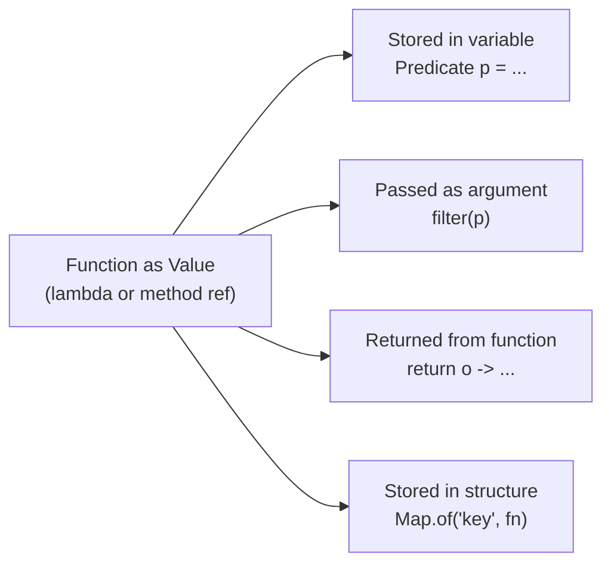

⚡ TL;DR - First-class functions are functions treated as
values: stored in variables, passed as arguments, and
returned from other functions. In Java, lambdas and
method references make functions first-class via functional
interfaces.

| #025 | Category: CS Fundamentals - Paradigms | Difficulty: ★★☆ |
|:---|:---|:---|
| **Depends on:** | CSF-008 (Functions), CSF-024 (Functional Programming) | |
| **Used by:** | CSF-026 (Higher-Order Functions), CSF-027 (Closures) | |
| **Related:** | CSF-030 (Immutability), CSF-050 (CPS), JSC-005 | |

---

### 🔥 The Problem This Solves

**WORLD WITHOUT IT:**

Early Java (pre-1.8) had no first-class functions. To
pass behavior as an argument (e.g., a comparison strategy
to a sort function), you had to:
1. Create a new class implementing the interface (`Comparator`)
2. Instantiate the class
3. Pass the instance to the method

For a simple "compare by last name" operation, this required
8-10 lines of code. For short-lived, single-use behavior,
this was entirely boilerplate. Enterprise Java codebases
in the 2000s had thousands of these single-method anonymous
inner classes - verbose, hard to read, and impossible
to inline where they were used.

**THE BREAKING POINT:**

Java's verbosity became a competitive disadvantage as
dynamic languages (Python, JavaScript, Ruby) made callback-
based and higher-order function patterns trivial. JavaScript
developers could write `arr.sort((a, b) => a - b)` in
12 characters. Java required 5-10 lines. This gap made
functional patterns impractical in Java even when they
were the cleanest solution.

**THE INVENTION MOMENT:**

Java 8 (2014) introduced lambda expressions: anonymous
functions that implement a functional interface (any
interface with exactly one abstract method, marked
`@FunctionalInterface`). `(a, b) -> a - b` replaces
the entire anonymous class. Method references (`String::length`)
refer to existing named methods as function values.
This made functions first-class citizens in Java - they
could finally be stored, passed, and returned like any other value.

---

### 📘 Textbook Definition

In a programming language, values are "first-class" if
they can be: (1) stored in variables, (2) passed as
arguments to functions, (3) returned from functions,
(4) stored in data structures. A language has first-class
functions if functions satisfy all four conditions. In Java
(8+), functions are not "native" first-class values (Java
is an object-oriented language where everything is an object),
but functional interfaces bridge this gap: a lambda
expression or method reference is an instance of a functional
interface type (which IS a first-class Java object). The
standard `java.util.function` package provides generic
functional interfaces: `Function<T,R>` (takes T, returns R),
`Predicate<T>` (takes T, returns boolean), `Consumer<T>`
(takes T, returns nothing), `Supplier<T>` (takes nothing,
returns T), `BiFunction<T,U,R>`, `UnaryOperator<T>`, etc.

---

### ⏱️ Understand It in 30 Seconds

**One line:**
First-class functions let you pass behavior as a value,
not just data - enabling strategies, callbacks, and
composable pipelines.

**One analogy:**

> Before first-class functions, behavior in Java was like
> a recipe that had to be on a printed page - you could
> not fold it up and carry it to a different kitchen.
> You needed to create a new cookbook (class), write
> the recipe into it, and bring the whole cookbook.
> With first-class functions (Java 8 lambdas), behavior
> is like a recipe on a notecard - you can hand it to
> anyone, pin it anywhere, or store it in a drawer.
> The recipe became portable.

**One insight:**

The `Comparator` interface in Java is the canonical
example of first-class functions before Java 8. To sort
a list of orders by total, you had to write an anonymous
`Comparator` implementation. In Java 8+:
`orders.sort(Comparator.comparingDouble(Order::getTotal))`.
The `Order::getTotal` is a method reference - a first-class
function. `Comparator.comparingDouble(fn)` is a higher-order
function that takes a function and returns a comparator.
This is first-class functions enabling higher-order functions
enabling declarative, readable sort code.

---

### 🔩 First Principles Explanation

**THE FOUR PROPERTIES:**

```
┌────────────────────────────────────────────────────┐
│         First-Class Functions in Java              │
├────────────────────────────────────────────────────┤
│ 1. STORE in a variable:                            │
│    Predicate<Order> isPending =                    │
│        o -> o.getStatus() == PENDING;              │
│                                                    │
│ 2. PASS as argument:                               │
│    orders.stream().filter(isPending)...            │
│    // isPending passed as argument to filter()     │
│                                                    │
│ 3. RETURN from a function:                         │
│    Predicate<Order> olderThan(int days) {          │
│        return o -> o.getAge() > days;              │
│    }  // returns a function as a value             │
│                                                    │
│ 4. STORE in a data structure:                      │
│    Map<String, Function<Order, Double>> calcs =    │
│        Map.of("tax", o -> o.getTotal() * 0.1,     │
│               "ship", o -> o.getWeight() * 0.05); │
└────────────────────────────────────────────────────┘
```



**LAMBDA SYNTAX:**

```java
// Lambda: (parameters) -> body
// Single parameter (no parens needed):
Predicate<String> isBlank = s -> s.isBlank();

// Multiple parameters:
Comparator<Order> byTotal = (a, b) ->
    Double.compare(a.getTotal(), b.getTotal());

// Multi-line body (block lambda):
Function<Order, String> summarize = order -> {
    String status = order.getStatus().name();
    return order.getId() + " - " + status;
};
```

**METHOD REFERENCES (shorthand for lambdas):**

```java
// Instance method of a parameter: Class::method
// Equivalent to: o -> o.getTotal()
Function<Order, Double> getTotal = Order::getTotal;

// Static method: Class::staticMethod
// Equivalent to: n -> Math.abs(n)
Function<Integer, Integer> abs = Math::abs;

// Instance method of a specific object: obj::method
OrderService service = new OrderService();
Consumer<Order> saver = service::save;
// Equivalent to: order -> service.save(order)

// Constructor reference: Class::new
// Equivalent to: id -> new Order(id)
Function<String, Order> factory = Order::new;
```

**THE TRADE-OFFS:**

**Gain:** Behavior becomes composable and reusable.
Strategy pattern, callback, observer - all reduce to
passing a function. Code becomes declarative and concise.

**Cost:** Lambda stack traces are harder to read.
`Function<T,R>` in debug output shows the lambda's
synthetic class name, not a meaningful name.
Overuse of complex function composition creates
unreadable pipelines. Type inference failures with
complex generics can produce cryptic compiler errors.

---

### 🧪 Thought Experiment

**SETUP:**

A notification service sends notifications via different
channels (email, SMS, push). Without first-class functions:

```java
// Without first-class functions: switch statement
void notify(User user, Notification n, Channel channel) {
    switch (channel) {
        case EMAIL: emailService.send(user.email, n); break;
        case SMS:   smsService.send(user.phone, n); break;
        case PUSH:  pushService.send(user.token, n); break;
    }
}
// Adding a new channel requires modifying this method.
// Open/Closed Principle violated.
```

**WITH FIRST-CLASS FUNCTIONS:**

```java
// Channel as a function: maps User + Notification -> void
Map<Channel, BiConsumer<User, Notification>> senders = Map.of(
    Channel.EMAIL, (u, n) -> emailService.send(u.email, n),
    Channel.SMS,   (u, n) -> smsService.send(u.phone, n),
    Channel.PUSH,  (u, n) -> pushService.send(u.token, n)
);

void notify(User user, Notification n, Channel channel) {
    senders.get(channel).accept(user, n);
}
// Adding a new channel: add one entry to the Map.
// The notify() method NEVER changes. Open/Closed satisfied.
```

**THE LESSON:**

First-class functions enable the Strategy pattern without
creating a class hierarchy. Each "strategy" is a lambda.
The dispatch table (Map of functions) replaces the switch
statement. Adding a new strategy requires zero modification
of existing code - just adding to the map.

---

### 🎯 Mental Model / Analogy

**THE FUNCTION-AS-TOOL ANALOGY:**

Without first-class functions, behavior is built into a
machine - you take the whole machine to where you need it.
With first-class functions, behavior is a detachable tool
that the machine can use. You pass the tool to whatever
machine needs it.

A drill press (the sort function) can take many different
drill bits (comparator functions). You do not need a
separate drill press for each bit size. The drill press
accepts any bit that fits its chuck (functional interface).
The bit is the first-class value - it is portable, storable,
and interchangeable.

**MEMORY HOOK:**

"First-class function = function as portable tool. Store it
(variable), carry it (parameter), make it (return value),
collect them (data structure). In Java: lambda or method
reference, always assigned to a functional interface type."

---

### 📊 Gradual Depth - Five Levels

**Level 1 - Child:**
A first-class function is a function you can store in
a box (variable), pass to a friend (parameter), and get
back from a vending machine (return value). Just like
a number or a name - functions become "things" you can
move around.

**Level 2 - Student:**
In Java, lambdas like `(x) -> x * 2` are function values.
They implement functional interfaces (`Function<T,R>`,
`Predicate<T>`, etc.). You can store them in variables,
pass them to `stream().filter()` and `stream().map()`,
and return them from methods.

**Level 3 - Professional:**
`@FunctionalInterface` marks an interface with one abstract
method. Any lambda or method reference that matches the
signature is an instance of that interface. The `java.util.
function` package provides 40+ standard functional interfaces.
`Comparator`, `Runnable`, and `Callable` are functional
interfaces that predate Java 8 and work seamlessly with
lambdas. Method references (`Class::method`) are concise
lambda shorthand - use when the lambda would just delegate
to an existing method.

**Level 4 - Senior Engineer:**
First-class functions enable key design patterns without
class hierarchies: Strategy (pass behavior), Template
Method alternative (inject steps as functions), Observer
(register callbacks). `Function.compose()` and `andThen()`
build complex transformations from simple ones. `Predicate.
and()`, `or()`, `negate()` compose boolean functions.
`Comparator.comparing().thenComparing()` builds multi-field
comparators. These combinator patterns replace inheritance-
based hierarchies with simpler, more testable function
composition.

**Level 5 - Expert:**
Lambda capture and closure semantics: a lambda can capture
effectively-final local variables from the enclosing scope.
"Effectively final" means not modified after assignment.
This enables closures (lambdas that close over their
environment). Captured variables are evaluated at lambda
creation time and stored in a synthetic field of the
generated lambda class. Instance fields and `this` references
can be captured mutably - this can cause subtle concurrency
bugs when the lambda is executed from a different thread
than where it was created. The JVM's `invokedynamic`
bytecode bootstraps lambda creation efficiently via
`LambdaMetafactory` - this is why lambda allocation is
cheap (no class file generated at compile time; the synthetic
class is generated at runtime on first call only).

---

### ⚙️ How It Works (Formal Basis)

**FUNCTIONAL INTERFACE CONTRACT:**

A `@FunctionalInterface` has exactly one abstract method.
This is the "single abstract method" (SAM) rule. The
lambda's parameter types and return type must match the
SAM's signature.

```java
// Custom functional interface:
@FunctionalInterface
interface OrderProcessor {
    String process(Order order); // single abstract method
    // default methods are allowed (do not count)
    default String processWithLog(Order o) {
        String r = process(o);
        log(r);
        return r;
    }
}

// Lambda matches the SAM signature:
OrderProcessor p = order ->
    "Processed: " + order.getId();
// Lambda type: (Order) -> String - matches process(Order)
```

**LAMBDA DESUGARING:**

The Java compiler translates a lambda to an `invokedynamic`
call that, on first execution, generates a class implementing
the functional interface. The captured variables become
constructor parameters of the generated class. This is
invisible to the developer but explains why lambda
allocation is cheap (not `new SomeClass()` but a
metaclass factory call).

---

### 🔄 System Design Implications

**FIRST-CLASS FUNCTIONS IN ARCHITECTURE:**

First-class functions enable "function composition as
design." Instead of class hierarchies for different
processing strategies, use a Map or list of functions
and compose them at configuration time. This reduces
the code footprint for extensible behavior from
"3 new classes per variant" to "1 new lambda per variant."

**WHAT CHANGES AT SCALE:**

At 10x functions: function composition chains become
hard to read if chained 8+ levels deep. Name intermediate
functions (`Predicate<Order> activeAndPending = active.and(pending)`).
Good names make composed pipelines readable.

At 100x performance: lambda per-invocation overhead is
negligible. The JIT inlines hot lambdas. The overhead
is boxing/unboxing for non-primitive functional interfaces
(`Function<Integer, Integer>` boxes every int). Use
`IntUnaryOperator`, `ToIntFunction<T>` etc. for primitive
operations in hot paths.

---

### 💻 Code Example

**Example 1 - Wrong vs Right: Anonymous Class vs Lambda**

```java
// BAD: Anonymous class - 8 lines for a simple comparison
Comparator<Order> comp = new Comparator<Order>() {
    @Override
    public int compare(Order a, Order b) {
        return Double.compare(a.getTotal(), b.getTotal());
    }
};
orders.sort(comp);

// GOOD: Lambda - same semantics, 1 line
orders.sort((a, b) -> Double.compare(a.getTotal(), b.getTotal()));

// BEST: Method reference + Comparator combinator
orders.sort(Comparator.comparingDouble(Order::getTotal));

// Multi-field sort (first by status, then by total):
orders.sort(Comparator.comparing(Order::getStatus)
    .thenComparingDouble(Order::getTotal));
```

**Example 2 - Passing and Returning Functions**

```java
// Function returned from a function (factory of functions):
Predicate<Order> olderThan(int days) {
    return order -> ChronoUnit.DAYS.between(
        order.getCreatedAt(), LocalDate.now()) > days;
}

// Usage: compose predicates
Predicate<Order> stale = olderThan(30);
Predicate<Order> highValue = order -> order.getTotal() > 500;
Predicate<Order> staleHighValue = stale.and(highValue);

List<Order> flagged = orders.stream()
    .filter(staleHighValue)
    .collect(Collectors.toList());
// Zero new classes. Pure function composition.
```

**Failure Example: Capturing Mutable Variable**

```java
// BAD: Capturing a variable that is effectively mutable
// Won't compile if local variable is modified after capture
int total = 0;
orders.forEach(o -> total += o.getAmount()); // compile error!
// "Variable used in lambda should be effectively final"

// GOOD: Use a mutable container or a stream reduction
int[] total = {0}; // array is effectively final; content is not
orders.forEach(o -> total[0] += o.getAmount()); // works

// BEST: Use stream reduction (functional style, no mutation)
double total = orders.stream()
    .mapToDouble(Order::getAmount)
    .sum();
```

---

### ⚖️ Comparison Table

| Concept | Java Representation | SAM Type | Common Use |
|---|---|---|---|
| Function (T -> R) | `Function<T,R>` | `R apply(T t)` | Transform elements |
| Predicate (T -> bool) | `Predicate<T>` | `boolean test(T t)` | Filter, validate |
| Consumer (T -> void) | `Consumer<T>` | `void accept(T t)` | Side effects (logging, saving) |
| Supplier (() -> R) | `Supplier<R>` | `R get()` | Lazy initialization, factory |
| BiFunction (T,U -> R) | `BiFunction<T,U,R>` | `R apply(T t, U u)` | Combine two inputs |
| Runnable (() -> void) | `Runnable` | `void run()` | Task, background action |
| Comparator | `Comparator<T>` | `int compare(T o1, T o2)` | Sorting |

---

### ⚠️ Common Misconceptions

| Misconception | Reality |
|---|---|
| Lambda creates a new object every time it is called | Lambda creation is cheap via `invokedynamic`. For stateless lambdas (no captured variables), the JVM can reuse the same instance across all calls. For lambdas that capture variables, a new instance is created at creation time (not per invocation). |
| Method references are always more readable than lambdas | Method references are clearer when they directly name the operation: `String::trim` vs `s -> s.trim()`. But `Order::getTotal` in a complex pipeline context may be less clear than `order -> calculateDiscount(order)` which names what the computation does. Clarity > brevity. |
| `@FunctionalInterface` makes the interface callable as a lambda | `@FunctionalInterface` is just an annotation that causes a compilation error if the interface has more than one abstract method. Any interface with one abstract method is a functional interface and can be used with lambdas, with or without the annotation. |
| You cannot use checked exceptions in lambdas | You cannot declare `throws CheckedException` on a lambda's method reference (because the functional interface does not declare it). But you CAN catch checked exceptions inside the lambda body. If you need to propagate, wrap in an unchecked exception or create a checked functional interface. |

---

### 🚨 Failure Modes & Diagnosis

**Failure Mode 1: Lambda Capturing a Service Variable**

**Symptom:** A lambda used in a parallel stream or passed
to a thread pool captures an instance variable and reads
stale or incorrect data.

**Root Cause:** The lambda captures a reference to an object
whose state changes between lambda creation and execution.
In concurrent contexts, the lambda may execute after the
captured reference's state has changed.

```java
// BAD: lambda captures 'this' implicitly via instance field
class OrderProcessor {
    Order currentOrder; // mutable instance field

    void processAll(List<Order> orders) {
        orders.parallelStream().forEach(order -> {
            currentOrder = order; // race: multiple threads write
            process(currentOrder); // may read a different order!
        });
    }
}

// GOOD: use the parameter, not a shared field
orders.parallelStream().forEach(order -> process(order));
// or even: orders.parallelStream().forEach(this::process)
```

---

**Security Note:**

Lambdas that capture external configuration (API keys,
credentials, configuration values) at construction time
are a security concern if the lambda is stored longer
than expected. A `Supplier<String>` that closes over a
password variable holds that password in memory for the
lifetime of the lambda object. Prefer providing secrets
at invocation time (as parameters) rather than capturing
them at construction time. This limits the window during
which a secret is held in a lambda's synthetic field.

---

### 🔗 Related Keywords

**Prerequisites (understand these first):**
- `Functions and Procedures` (CSF-008) - understanding
  what a function is (signature, parameters, return) is
  prerequisite to understanding "functions as values"
- `Functional Programming` (CSF-024) - first-class functions
  are the enabling mechanism of FP; this entry provides
  the Java-specific implementation

**Builds On This (learn these next):**
- `Higher-Order Functions` (CSF-026) - functions that
  take or return other functions; directly uses first-class
  functions as the mechanism
- `Closures` (CSF-027) - lambdas that capture their
  surrounding environment; extends first-class functions
  with state capture

**Alternatives / Comparisons:**
- `Java 8 Functional Interfaces` (JLG-020) - the complete
  Java-specific specification of built-in functional
  interfaces, method references, and stream API design

---

### 📌 Quick Reference Card

```
┌────────────────────────────────────────────────────────┐
│ DEFINITION   │ Functions are values: store, pass,      │
│              │ return, put in collections              │
├──────────────┼─────────────────────────────────────────┤
│ JAVA IMPL    │ Lambda: (params) -> body                │
│              │ Method ref: Class::method               │
│              │ Both implement functional interfaces    │
├──────────────┼─────────────────────────────────────────┤
│ KEY TYPES    │ Function<T,R>, Predicate<T>,            │
│              │ Consumer<T>, Supplier<R>, BiFunction   │
├──────────────┼─────────────────────────────────────────┤
│ CAPTURE RULE │ Captured vars must be effectively final │
│              │ (not reassigned after first assignment) │
├──────────────┼─────────────────────────────────────────┤
│ COMPOSE      │ Function.andThen(), Predicate.and/or()  │
│              │ Comparator.comparing().thenComparing()  │
├──────────────┼─────────────────────────────────────────┤
│ PERF TIP     │ Use IntFunction, LongFunction for prims │
│              │ to avoid boxing in hot paths            │
├──────────────┼─────────────────────────────────────────┤
│ ONE-LINER    │ "Lambda = function as value. Stored in  │
│              │ Predicate<T>/Function<T,R>/etc. Pass    │
│              │ to any method expecting that interface."│
├──────────────┼─────────────────────────────────────────┤
│ NEXT EXPLORE │ CSF-026 (Higher-Order Functions)        │
└────────────────────────────────────────────────────────┘
```

**If you remember only 3 things:**

1. A first-class function is a function you can store in
   a variable, pass as an argument, or return from a method.
   In Java: lambdas and method references implementing
   functional interfaces.
2. The standard functional interfaces: `Function<T,R>`
   (transform), `Predicate<T>` (test), `Consumer<T>`
   (use), `Supplier<T>` (produce). These cover 90% of
   use cases.
3. Lambda capture rule: lambdas can capture local variables
   from the enclosing scope only if those variables are
   effectively final (not reassigned after capture).

**Interview one-liner:**
"First-class functions allow functions to be stored,
passed, and returned as values. In Java, this is
implemented via lambdas and method references implementing
functional interfaces. This enables Strategy pattern,
callbacks, function composition, and declarative stream
pipelines. The key constraint: captured local variables
must be effectively final."

---

### 💎 Transferable Wisdom

**Reusable Engineering Principle:**
Separating WHAT behavior is applied from WHEN and WHERE
it is applied is a foundational design principle. First-class
functions make this separation trivial: define the behavior
as a function, store or pass it, apply it later. This
pattern (behavior as a portable unit) appears everywhere:
web server middleware (a request -> response function
passed through a pipeline), event handlers (function
registered for future events), decorators (function wrapped
around another function), and plugin systems (functions
loaded at runtime from configuration).

**Where else this pattern appears:**

- **JavaScript callbacks and promises** - `fetch(url).then(response => ...)`.
  The arrow function is a first-class function passed to
  `.then()`. Promises are built on functions as values.
- **Python decorators** - `@validate_input` wraps a function
  with another function. Decorators are higher-order
  functions that take a function and return a new function.
- **Spring Filter Chain** - `doFilter(request, response, chain)`
  where `chain.doFilter()` calls the next `Filter` in the
  list. Each Filter is a function (servlet -> void).
  The filter chain is a list of first-class function
  objects executed in sequence.

---

### 💡 The Surprising Truth

Java 8's lambda expressions were the most significant
Java language change in the language's 20-year history at
that point. But they almost did not happen - for 10 years
before Java 8, multiple lambda proposals were rejected
by the Java community process as "too complex" or "un-
Java-like." The turning point was not elegance - it was
a practical crisis: Java was losing developers to dynamic
languages that made functional patterns trivial. The
final Java 8 lambda design was intentionally conservative:
no currying, no partial application, no tail-call optimization.
Just lambdas and method references. The restraint was
deliberate - Java's designers prioritized backward
compatibility and simplicity over completeness. This is
why Java has first-class functions but not full functional
programming: the feature was designed to be "just enough"
to support streams and callbacks, not to transform Java
into Haskell.

---

### ✅ Mastery Checklist

**You've mastered this when you can:**

1. **[IDENTIFY]** Review any Java method that takes
   a parameter with a callback/strategy pattern and
   identify the functional interface type, explain
   what the SAM represents, and write both a lambda
   and a method reference that satisfies the interface.

2. **[BUILD]** Implement a configurable notification
   system using `Map<Channel, BiConsumer<User, Notification>>`
   where each channel's send behavior is stored as a
   first-class function, and demonstrate that adding a
   new channel requires zero changes to existing code.

3. **[COMPOSE]** Using only `Function.andThen()`,
   `Predicate.and()`, and `Comparator.thenComparing()`,
   build a multi-field sort with three fields and a
   filter with two conditions, without any anonymous
   inner classes or explicit loops.

4. **[DEBUG]** Explain why `int count = 0; list.forEach(
   x -> count++);` fails to compile. Propose three
   alternative approaches (array container, stream reduce,
   separate accumulator class) and explain the trade-offs.

5. **[EXPLAIN]** Explain the performance characteristics
   of lambda invocation: why stateless lambdas are often
   reused, when boxing/unboxing overhead occurs, and
   how to use primitive functional interfaces to eliminate
   it in performance-critical code.

---

### 🧠 Think About This Before We Continue

**Q1.** Java's `Comparator.comparing(Order::getTotal)` creates
a `Comparator<Order>` from a `Function<Order, Double>`. How
does the Java compiler determine the type of `Order::getTotal`
here? What happens if `getTotal` is overloaded in `Order`?
What error message appears, and how would you resolve it?

*Hint: Type inference from context. The compiler knows
the target type is `Comparator<Order>`, so `comparing`
needs a `Function<? super Order, ? extends Comparable<?>>`.
The method reference is resolved against this context.
Overloaded methods fail type inference (ambiguous reference)
- explicit cast or lambda is required: `(Order o) -> o.getTotal()`.*

**Q2.** A developer wants to pass a method that throws
a checked `IOException` as a `Function<String, String>`.
The compiler rejects it because `Function<T,R>.apply()`
does not declare `throws IOException`. What are the three
options to handle this, and what are the trade-offs of each?

*Hint: Option 1: Catch inside the lambda and wrap in
RuntimeException (common but loses type information).
Option 2: Create a `CheckedFunction<T,R>` interface that
declares `throws IOException` (clean but adds a new type).
Option 3: Use Vavr's `CheckedFunction0`/`Try` type (external
library, functional exception handling). The right choice
depends on whether the calling context can handle checked
exceptions meaningfully.*

**Q3.** A senior engineer claims: "Using lambdas everywhere
instead of named classes makes the code harder to debug
because the stack trace shows `Lambda$1` instead of
meaningful class names." Is this true? When is it a real
problem, and what mitigation strategies exist?

*Hint: Partially true. Lambda stack trace entries show
the enclosing class and line number, but not a descriptive
name. For simple operations (filters, mappings), this
is acceptable. For complex business logic expressed as
lambdas, name the lambda via assignment to a descriptively
named variable or extract it to a named method. The rule:
if the lambda is complex enough to warrant a comment,
it is complex enough to warrant a named method.*

---

### 🎯 Interview Deep-Dive

**Q1: "What is the difference between a lambda and
an anonymous inner class in Java?"**

*Why they ask:* Tests Java language depth beyond "I know
lambdas." Common in senior Java interviews.

*Strong answer includes:*
- Anonymous inner class: creates a complete class file
  at compile time. Has its own `this` reference (to the
  anonymous class instance). Can extend a class or implement
  multiple interfaces. Can have state (fields).
- Lambda: compiled using `invokedynamic` (no class file
  at compile time). `this` inside the lambda refers to
  the ENCLOSING class (not the lambda itself). Can only
  implement a functional interface (single SAM). Stateless
  lambdas may be shared instances (no new allocation per use).
- When to use anonymous inner class: when you need to
  extend a class, implement multiple interfaces, or
  maintain per-instance state. For everything else:
  use a lambda.

**Q2: "What is effectively final, and why does Java require
captured variables to be effectively final?"**

*Why they ask:* Tests understanding of lambda capture
mechanics and the design rationale.

*Strong answer includes:*
- "Effectively final": a local variable that is not
  explicitly declared `final` but is never reassigned
  after its first assignment. The Java compiler detects this.
- Why required: lambda capture in Java makes a copy of
  the variable's value at the time of capture (for primitives)
  or copies the reference (for objects). If the variable
  were mutated after capture, the lambda would hold a
  stale value. Rather than introducing complex semantics
  for mutable capture (as JavaScript closures do), Java
  requires effectively-final to guarantee the captured
  value is consistent.
- Design choice: Scala and Kotlin allow capturing mutable
  variables (transparently wrapped in a mutable container).
  Java made the simpler choice: force effective finality
  and let the developer choose the workaround (array,
  AtomicInteger, stream reduction) explicitly.

**Q3: "Explain the standard functional interfaces in
java.util.function. Which ones handle primitives, and why?"**

*Why they ask:* Tests completeness of Java 8+ FP knowledge.

*Strong answer includes:*
- Core interfaces: `Function<T,R>` (transform), `Predicate<T>`
  (boolean test), `Consumer<T>` (side effect, returns void),
  `Supplier<T>` (produces, no input), `BiFunction<T,U,R>`.
- Derived: `UnaryOperator<T>` = `Function<T,T>`. `BinaryOperator<T>` = `BiFunction<T,T,T>`. `Comparator<T>` = `BiFunction<T,T,int>` (effectively).
- Primitive variants: `IntFunction<R>`, `IntPredicate`,
  `IntConsumer`, `IntSupplier`, `ToIntFunction<T>`,
  `IntUnaryOperator`, `IntBinaryOperator`, `IntStream`.
  Same for Long and Double.
- Why primitive variants: generic types use boxed types
  (`Integer`, `Long`), causing boxing/unboxing for every
  element in a hot loop. Primitive functional interfaces
  use `int`, `long`, `double` directly. For processing
  10M integers, the difference between boxing every int
  into `Integer` vs using `IntStream` can be 3-5x performance
  and dramatically less GC pressure.

> Entry stub. Generate full content using Master Prompt v4.0.
