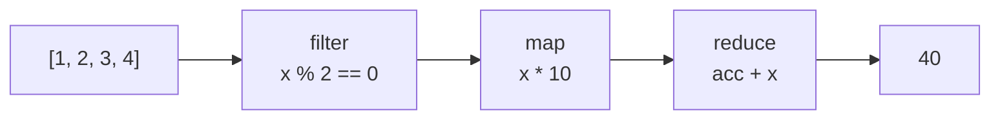

⚡ TL;DR - A higher-order function takes other functions as
arguments or returns functions as results. Java's `map`,
`filter`, `reduce`, `sorted`, and `Comparator.comparing`
are all higher-order functions. They abstract over behavior,
not just data.

| #026 | Category: CS Fundamentals - Paradigms | Difficulty: ★★☆ |
|:---|:---|:---|
| **Depends on:** | CSF-025 (First-Class Functions) | |
| **Used by:** | CSF-027 (Closures), CSF-049 (Monads) | |
| **Related:** | CSF-024 (Functional Programming), CSF-058 (Referential Transparency) | |

---

### 🔥 The Problem This Solves

**WORLD WITHOUT IT:**

Every time behavior changes, you duplicate code. Sorting
by name requires one method. Sorting by price requires
another. Filtering by status requires a third. Each is
90% identical - the only difference is the comparison
or test logic. Without higher-order functions, the only
way to reuse sorting logic is to duplicate it or pass
a configuration flag (which becomes a switch statement
inside the method). Neither scales.

**THE BREAKING POINT:**

A large enterprise codebase in 2005 Java might have 50
separate "sort-and-filter" methods that differ only in
which field they sort by or which predicate they apply.
Adding a new sort field requires writing a new method.
Changing the sorting algorithm requires changing all 50
methods. The combinatorial explosion: `N` fields *
`M` filters * `K` sort orders = `N*M*K` methods. With
higher-order functions, the combination is composed at
the call site: 1 method that accepts behavior as an argument.

**THE INVENTION MOMENT:**

The concept is as old as lambda calculus (1936). In
practice, LISP (1958) made map, filter, and reduce the
standard operations for list processing. Functional
programmers noticed: the SHAPE of the iteration (visit
each element) is separate from the BEHAVIOR applied to
each element. Higher-order functions separate these two
concerns: the iteration shape is the higher-order function;
the behavior is the function argument. Java 8 Streams
made this mainstream in enterprise Java.

---

### 📘 Textbook Definition

A higher-order function (HOF) is a function that:
(1) takes one or more functions as arguments, or
(2) returns a function as its result, or both.
Higher-order functions abstract over behavior (not just
data), enabling parameterized computation patterns.
The most fundamental HOFs are: `map` (apply a function
to every element), `filter` (keep elements satisfying
a predicate), and `reduce` / `fold` (combine all elements
using a binary function). In Java, `Stream.map(Function<T,R>)`,
`Stream.filter(Predicate<T>)`, and `Stream.reduce(T, BinaryOperator<T>)`
are HOFs. `Comparator.comparing(Function<T,U>)` is a HOF
that takes a function and returns a comparator.
`Function.andThen(Function<R,V>)` is a HOF that takes
two functions and returns their composition.

---

### ⏱️ Understand It in 30 Seconds

**One line:**
A higher-order function takes a function as input or
returns a function as output - it abstracts over WHAT
to do, not just what data to process.

**One analogy:**

> A robot arm on an assembly line is a higher-order machine:
> it does not drill, paint, or weld by itself. You attach
> a drill, a spray gun, or a welder - the robot arm
> executes "whichever tool you give it" against each part.
> The robot arm is the higher-order function (the shape
> of the operation). The tool is the function argument
> (the specific behavior). The same robot arm works for
> all tools; you only need to build the tool once.

**One insight:**

Java's `Stream.filter(Predicate<T>)` is a higher-order
function. The same `filter` method implements "filter
by status", "filter by date", "filter by price range",
and any other predicate - all by accepting different
function arguments. Without HOFs, you would need a
separate `filterByStatus`, `filterByDate`, and
`filterByPriceRange` method. HOFs collapse N methods
into 1 parameterized method.

---

### 🔩 First Principles Explanation

**THE FUNDAMENTAL THREE:**

```
┌─────────────────────────────────────────────────────┐
│         The Three Core HOFs                         │
├─────────────────────────────────────────────────────┤
│ MAP - apply f to each element, collect results      │
│   [1, 2, 3].map(x -> x * 2) = [2, 4, 6]            │
│   Stream: .map(Function<T, R>)                      │
│                                                     │
│ FILTER - keep elements where predicate is true      │
│   [1, 2, 3, 4].filter(x -> x % 2 == 0) = [2, 4]   │
│   Stream: .filter(Predicate<T>)                     │
│                                                     │
│ REDUCE - combine all elements into one value        │
│   [1, 2, 3, 4].reduce(0, (acc, x) -> acc + x) = 10 │
│   Stream: .reduce(identity, BinaryOperator<T>)      │
└─────────────────────────────────────────────────────┘
```



**FUNCTION COMPOSITION AS HOF:**

```
┌─────────────────────────────────────────────────────┐
│       andThen vs compose (both are HOFs)            │
├─────────────────────────────────────────────────────┤
│ f.andThen(g)  = g(f(x))    - f first, then g        │
│ f.compose(g)  = f(g(x))    - g first, then f        │
│                                                     │
│ f = Double::parseDouble   (String -> Double)        │
│ g = d -> d * 1.1          (Double -> Double)        │
│                                                     │
│ pipeline = f.andThen(g)   (String -> Double * 1.1)  │
│ pipeline.apply("100.0") = 110.0                     │
└─────────────────────────────────────────────────────┘
```

**HOF RETURNING A FUNCTION:**

```java
// HOF: takes a threshold, returns a Predicate<Order>
Predicate<Order> aboveThreshold(double min) {
    return order -> order.getTotal() >= min;
}

// Returns different predicates on demand:
Predicate<Order> highValue = aboveThreshold(1000.0);
Predicate<Order> midValue  = aboveThreshold(100.0);
```

**THE TRADE-OFFS:**

**Gain:** Dramatic reduction in code duplication. Behavior
variants composed at call site rather than hardcoded
in separate methods. Testable building blocks - each
small function is independently testable.

**Cost:** Complex composition chains are hard to read
and debug. Stack traces in functional pipelines show
cryptic lambda references. Type inference failures
with complex generic HOFs produce obscure errors.

---

### 🧪 Thought Experiment

**SETUP:**

A reporting system must generate reports filtered by
three different criteria and sorted by two different fields.
That's 6 combinations. Without HOFs: 6 methods. With HOFs:

```java
// One generic report generator:
List<Order> report(
    List<Order> orders,
    Predicate<Order> filter,
    Comparator<Order> sorter
) {
    return orders.stream()
        .filter(filter)
        .sorted(sorter)
        .collect(Collectors.toList());
}

// 6 call sites, each composing what it needs:
report(orders,
    o -> o.getStatus() == PENDING,
    Comparator.comparingDouble(Order::getTotal));

report(orders,
    o -> o.getTotal() > 500,
    Comparator.comparing(Order::getCreatedAt));
```

**THE LESSON:**

HOFs reduce N-variant code to 1 parameterized function.
The variants are expressed at the call site, not in the
library method. Adding a new variant requires no changes
to `report()` - it is open to extension (new predicates
and sorters) without modification (the method body is
unchanged). This is the Open/Closed Principle enabled
by HOFs.

---

### 🎯 Mental Model / Analogy

**THE COOKIE CUTTER ANALOGY:**

A higher-order function is a cookie cutter press. The
press (the HOF) provides the SHAPE of the operation
(iterate, apply, collect). You insert different cutters
(function arguments) to produce different cookies (results).
The press does not change. The cutter is the first-class
function passed in. You can swap the heart-shaped cutter
for the star-shaped cutter without rebuilding the press.

`Stream.map(fn)` is the press. `Order::getTotal`,
`String::toUpperCase`, and `User::getName` are the
interchangeable cutters. One press, unlimited cutters.

**MEMORY HOOK:**

"HOF = function that eats functions or makes functions.
Map/filter/reduce eat functions. `andThen()`/`compose()`
make new functions from existing ones. Both are HOFs."

---

### 📊 Gradual Depth - Five Levels

**Level 1 - Child:**
A higher-order function is a function that takes another
function as a helper. Like a robot that can use different
tools - you tell it which tool to use and it does the work.

**Level 2 - Student:**
`list.stream().map(x -> x * 2)` - `map` is a HOF: it
takes a function `x -> x * 2` and applies it to every
element. `filter` takes a predicate and keeps matching
elements. `reduce` takes a binary function and combines
elements. These three HOFs can express most data transformations.

**Level 3 - Professional:**
`Comparator.comparing(Order::getTotal)` is a HOF that
takes a key extractor function and returns a Comparator.
`Function.andThen(g)` is a HOF that takes a function
`g` and returns a new function that applies `this` then
`g`. `Predicate.and(other)` is a HOF returning a new
predicate that is the logical AND of `this` and `other`.
These combinators enable building complex pipelines from
simple, testable components.

**Level 4 - Senior Engineer:**
Decorators and middleware are HOFs. A Java servlet filter
is a HOF: it takes the "next handler" as a functional
argument and wraps it with additional behavior
(authentication, logging, rate limiting). Spring's
`WebClient` filter chain is the same pattern.
`CompletableFuture.thenApply(fn)` is a HOF that takes
a function and returns a new `CompletableFuture` that
applies `fn` to the result when it completes. Async
pipelines are HOF chains over future values.

**Level 5 - Expert:**
Transducers (Clojure, adapted to Java) are composable
algorithmic transformations expressed as HOFs that
transform reducing functions. A transducer is a HOF from
`(R, T) -> R` to `(R, T') -> R` - it transforms the
shape of a reducing function without specifying the
source or destination collection type. This allows
composing `map` and `filter` transformations once and
applying them to any source (stream, channel, observable)
without re-evaluation. In Java, this is approximately
what `Stream.map().filter()` does, but transducers do
it without intermediate collection allocation, enabling
the same composed transformation to run over `Stream`,
`Observable`, or `Channel` without rewriting.

---

### ⚙️ How It Works (Formal Basis)

**TYPES OF HOFs:**

1. HOF takes function as parameter:
   `filter(Predicate<T>)` signature: `Stream<T> -> Stream<T>`

2. HOF returns function as result:
   `Comparator.comparing(fn)` signature:
   `Function<T,U> -> Comparator<T>`

3. HOF does both (combinator):
   `Function.andThen(after)` signature:
   `Function<T,R>, Function<R,V> -> Function<T,V>`

**REDUCE AS UNIVERSAL HOF:**

`reduce` is the most powerful fundamental HOF. With reduce
and the right binary function, you can implement map and
filter:

```java
// map using reduce:
List<Double> totals = orders.stream().reduce(
    new ArrayList<>(),
    (list, order) -> {
        List<Double> newList = new ArrayList<>(list);
        newList.add(order.getTotal());
        return newList;
    },
    (a, b) -> { List<Double> m = new ArrayList<>(a);
                m.addAll(b); return m; }
);
// This is how map is DEFINED in terms of reduce.
// In practice, use .map() directly.

// Stream.collect() is reduce with mutable accumulator:
List<Double> totals = orders.stream()
    .map(Order::getTotal)
    .collect(Collectors.toList());
// Collectors.toList() is a Collector (mutable reduce).
```

---

### 🔄 System Design Implications

**HOFs AS ARCHITECTURE:**

Higher-order functions enable middleware, pipeline, and
interceptor architectures. Every enterprise integration
pattern (pipeline, filter chain, decorator) is a HOF
applied at the architecture level.

**WHAT CHANGES AT SCALE:**

At 10x: HOF pipelines on large datasets benefit from
parallel execution. Pure HOFs (map, filter) are trivially
parallelizable because each element is processed independently.
`parallelStream()` uses Fork/Join to parallelize pure
HOF chains safely.

At 100x: composition depth. A chain of 15 `.map().filter()`
calls creates intermediate `Stream` objects. For extreme
throughput, consider collecting to intermediate `List`
at checkpoints to control memory usage, or use
`Collectors.teeing()` (Java 12) for single-pass dual
aggregation.

---

### 💻 Code Example

**Example 1 - Wrong vs Right: Duplicated Methods vs HOF**

```java
// BAD: Separate methods for each variant - 4 nearly identical methods
List<Order> pendingOrders(List<Order> orders) {
    List<Order> result = new ArrayList<>();
    for (Order o : orders)
        if (o.getStatus() == PENDING) result.add(o);
    return result;
}
List<Order> completedOrders(List<Order> orders) {
    List<Order> result = new ArrayList<>();
    for (Order o : orders)
        if (o.getStatus() == COMPLETE) result.add(o);
    return result;
}
// Adding a new status variant requires a new method.
// Changing the filtering mechanism requires editing all methods.

// GOOD: One HOF - filter behavior injected as a parameter
List<Order> filterOrders(List<Order> orders,
                          Predicate<Order> predicate) {
    return orders.stream()
        .filter(predicate)
        .collect(Collectors.toList());
}
// Usage: compose at call site
filterOrders(orders, o -> o.getStatus() == PENDING);
filterOrders(orders, o -> o.getTotal() > 500.0);
filterOrders(orders, o -> o.getCustomer().isPremium());
```

**Example 2 - Function Composition**

```java
// Individual transformation steps:
Function<String, String> trim = String::trim;
Function<String, String> upper = String::toUpperCase;
Function<String, Integer> length = String::length;

// Composed transformation (applied left-to-right):
Function<String, Integer> pipeline =
    trim.andThen(upper).andThen(length);

pipeline.apply("  hello  "); // = 5 ("HELLO".length())

// Multi-step order processing pipeline:
Function<Order, Order> validate =
    order -> validateAndThrow(order);
Function<Order, Order> applyTax =
    order -> order.withTotal(order.getTotal() * 1.1);
Function<Order, Order> applyDiscount =
    order -> order.withTotal(order.getTotal() * 0.95);

Function<Order, Order> fullPipeline =
    validate.andThen(applyTax).andThen(applyDiscount);
// Each step is independently testable.
// The pipeline is assembled from parts.
```

**Testing/Verification:**

```java
@Test
void mapDoubles_allElementsDoubled() {
    List<Integer> input = List.of(1, 2, 3, 4);
    List<Integer> result = input.stream()
        .map(x -> x * 2)
        .collect(Collectors.toList());
    assertEquals(List.of(2, 4, 6, 8), result);
}

@Test
void filterAndSum_computesCorrectTotal() {
    List<Order> orders = List.of(
        new Order("A", 100.0, PENDING),
        new Order("B", 200.0, COMPLETE),
        new Order("C", 300.0, PENDING)
    );
    double pendingTotal = orders.stream()
        .filter(o -> o.getStatus() == PENDING)
        .mapToDouble(Order::getTotal)
        .sum();
    assertEquals(400.0, pendingTotal, 0.001);
}
```

---

### ⚠️ Common Misconceptions

| Misconception | Reality |
|---|---|
| HOFs are just syntactic sugar for loops | HOFs change the design level, not just syntax. `filter().map().reduce()` separates iteration from behavior, making behavior injectable, testable, and composable in ways that loops do not support. The design implication is different, not just the syntax. |
| `reduce` is just for summing numbers | `reduce` is the universal combining operation. It can produce any type: `reduce` to a String (concatenation), to a Map (grouping), to a complex object (aggregation). `Collectors` in Java are sophisticated reduce operations that use a mutable accumulator for performance. |
| Complex HOF chains are always efficient | HOF chains create intermediate `Stream` stages. For very large datasets with many intermediate stages, this can create GC pressure from intermediate allocations. Profile before assuming stream chains are always faster than explicit loops for extreme-throughput use cases. |
| andThen and compose are equivalent | They are inverses: `f.andThen(g) = x -> g(f(x))` (f first); `f.compose(g) = x -> f(g(x))` (g first). Common mistake: using `compose` when `andThen` was intended, reversing the operation order silently with no compiler error. |

---

### 🚨 Failure Modes & Diagnosis

**Failure Mode 1: Infinite Stream without Terminal Operation**

**Symptom:** A stream pipeline is built (filter, map)
but no output is produced and the method returns without error.

**Root Cause:** Java streams are LAZY. Intermediate operations
(`filter`, `map`, `sorted`) are not executed until a terminal
operation (`collect`, `reduce`, `forEach`, `count`) is called.
Building the pipeline without a terminal operation does nothing.

```java
// BAD: No terminal operation - stream is built, nothing executes
orders.stream()
    .filter(Order::isPending)
    .map(Order::markProcessed); // no-op! no terminal operation

// GOOD: Add terminal operation
orders.stream()
    .filter(Order::isPending)
    .forEach(order -> processAndSave(order));
// Or if you need the result:
List<Order> processed = orders.stream()
    .filter(Order::isPending)
    .map(Order::markProcessed)
    .collect(Collectors.toList());
```

---

**Security Note:**

Higher-order functions that accept untrusted function
arguments (e.g., a plugin system where user-supplied
code is passed as a `Function<T,R>`) create a code
injection risk. The HOF executes whatever logic the
function argument contains - if the argument is loaded
from untrusted sources (deserialization, remote class
loading), it can execute arbitrary code in the context
of the HOF. Never deserialize `Function` or `Predicate`
objects from untrusted sources. Use allowlisting (a
registry of trusted function implementations) rather
than accepting arbitrary function arguments.

---

### 🔗 Related Keywords

**Prerequisites (understand these first):**
- `First-Class Functions` (CSF-025) - functions must be
  values before they can be passed as arguments to HOFs

**Builds On This (learn these next):**
- `Closures` (CSF-027) - functions that carry their
  environment; enables HOFs to return contextual functions
- `Monads and Functors` (CSF-049) - the mathematical
  generalization of `map` and `flatMap` as HOFs

**Alternatives / Comparisons:**
- `Functional Programming` (CSF-024) - the paradigm
  that HOFs are part of; HOFs are the practical tool,
  FP is the philosophy

---

### 📌 Quick Reference Card

```
┌────────────────────────────────────────────────────────┐
│ DEFINITION   │ Function that takes or returns functions│
│              │ Abstracts over behavior, not just data  │
├──────────────┼─────────────────────────────────────────┤
│ MAP          │ Apply fn to each element, collect       │
│              │ stream.map(fn): Stream<T> -> Stream<R>  │
├──────────────┼─────────────────────────────────────────┤
│ FILTER       │ Keep elements where predicate is true   │
│              │ stream.filter(pred): Stream<T> -> Stream<T>│
├──────────────┼─────────────────────────────────────────┤
│ REDUCE       │ Fold all elements into one value        │
│              │ stream.reduce(id, BinaryOperator<T>)    │
├──────────────┼─────────────────────────────────────────┤
│ COMPOSE      │ f.andThen(g): apply f then g            │
│              │ f.compose(g): apply g then f            │
├──────────────┼─────────────────────────────────────────┤
│ LAZY!        │ Intermediate ops don't run until        │
│              │ terminal op (collect/reduce/forEach)    │
├──────────────┼─────────────────────────────────────────┤
│ ONE-LINER    │ "HOF = takes function or returns        │
│              │ function. map/filter/reduce are HOFs.   │
│              │ andThen/compose combine functions."     │
├──────────────┼─────────────────────────────────────────┤
│ NEXT EXPLORE │ CSF-027 (Closures), CSF-049 (Monads)    │
└────────────────────────────────────────────────────────┘
```

**If you remember only 3 things:**

1. A higher-order function takes functions as arguments
   or returns functions. `filter(Predicate)`, `map(Function)`,
   and `reduce(BinaryOperator)` are the canonical three.
2. Java streams are LAZY - intermediate HOFs build the
   pipeline but do nothing until a terminal operation
   (`collect`, `reduce`, `forEach`) triggers execution.
3. `andThen` composes left-to-right (`f.andThen(g)` = f first,
   then g). `compose` composes right-to-left. This distinction
   matters when building processing pipelines.

**Interview one-liner:**
"A higher-order function takes one or more functions as
arguments or returns a function as a result. `Stream.map`,
`filter`, and `reduce` are HOFs in Java. They enable
parameterizing behavior, building composable pipelines,
and eliminating code duplication for similar operations
on different data or with different logic."

---

### 💎 Transferable Wisdom

**Reusable Engineering Principle:**
HOFs teach the most important principle of code reuse:
separate the STRUCTURE of an operation from the BEHAVIOR
it applies. The structure (iterate, apply, collect) is
fixed and reusable. The behavior (which predicate, which
transformation) varies. Separate the two and you have
a general-purpose structure that works with any behavior.
This principle appears at every scale: generic algorithms
in libraries (sort, search, map, filter), middleware
frameworks (servlet filters, Spring interceptors), event
systems (listeners registered as functions), and
orchestration systems (workflow steps as function objects).

**Where else this pattern appears:**

- **React `Array.map()` for rendering** - a React component
  renders a list: `items.map(item => <ItemCard item={item}/>)`.
  The HOF `map` iterates; the lambda renders each item.
  The pattern: separate the "how to iterate" from the
  "what to render." Adding a new item type requires only
  a new component, not a new iteration mechanism.
- **Apache Spark transformations** - Spark's
  `rdd.map(fn).filter(fn).reduce(fn)` is HOFs applied
  to distributed datasets. The HOF structure (map,
  filter, reduce) is distributed across the cluster;
  the function argument defines what each node computes.
- **Database query optimization** - SQL's `WHERE`, `SELECT`,
  and `GROUP BY` clauses are declarative HOFs: `WHERE f(row) = true`
  is filter; `SELECT f(row)` is map; `GROUP BY + aggregation`
  is reduce. The optimizer chooses HOW to execute them
  (what index to use, in what order); the query expresses WHAT.

---

### 💡 The Surprising Truth

The three operations `map`, `filter`, and `reduce` were
described by Alonzo Church and John McCarthy decades
before the era of big data - yet they became the API
of Apache Hadoop, Apache Spark, and Google BigQuery.
The original MapReduce paper by Dean and Ghemawat (Google,
2004) describes a distributed computation model using
exactly these two primitives: `map` (apply a function
to each record) and `reduce` (aggregate the results).
What Church formalized for theoretical computation in
1936 became the architecture of systems processing
petabytes of data in 2004. Higher-order functions are
not a programmer convenience - they describe the
fundamental shape of computation that scales from a
list of 10 items to 10 billion records on a distributed cluster.

---

### ✅ Mastery Checklist

**You've mastered this when you can:**

1. **[IMPLEMENT]** Re-implement `map`, `filter`, and
   `reduce` on a plain `List<T>` using only iteration
   and function arguments, demonstrating the HOF pattern
   without using the Stream API.

2. **[COMPOSE]** Build a multi-step order processing
   pipeline using `Function.andThen()` that validates,
   applies tax, applies discount, and formats for output
   - where each step is a separately testable function
   and the pipeline is assembled without duplication.

3. **[EXPLAIN]** Explain why Java streams are lazy and
   why this matters for a HOF chain like
   `.filter(expensivePredicate).map(fn).findFirst()`.
   Show why laziness makes this efficient even if the
   list has 1 million elements.

4. **[REFACTOR]** Take a method with a switch statement
   over an enum (different behavior per case) and refactor
   it to use a `Map<Enum, Function<T,R>>` (dispatch table
   of HOFs), demonstrating the extension without modification.

5. **[DIAGNOSE]** Given a stream pipeline that produces
   unexpected output, trace through the lazy evaluation
   order and identify whether the bug is in the source,
   the intermediate operations, or the terminal operation.

---

### 🧠 Think About This Before We Continue

**Q1.** A developer chains 10 stream operations:
`.filter().map().filter().map().sorted().filter().map().
distinct().limit(10).collect()`. How many times does
the source list get traversed? Where is the sorted()
call a performance concern, and why?

*Hint: In Java, the stream pipeline is traversed ONCE
(not N times for N operations). Each element moves through
the pipeline stages. EXCEPT: `sorted()` is a STATEFUL
intermediate operation - it must see ALL elements before
it can produce the first sorted element, causing a full
buffer. This breaks the single-pass guarantee and can
cause memory issues on large streams. Place `sorted()`
as late in the pipeline as possible, after `filter()` has
reduced the element count.*

**Q2.** Can you implement `filter` using `reduce`? Can you
implement `map` using `reduce`? If so, what does this tell
you about the relative expressive power of these three HOFs?

*Hint: Yes and yes. `filter` using reduce: accumulate
only elements that match the predicate. `map` using reduce:
accumulate the result of applying fn to each element.
`reduce` is the most expressive of the three - map and
filter are special cases. In category theory, `reduce`
corresponds to a fold (catamorphism), which is the
universal operation for processing recursive data
structures (lists are a degenerate case).*

**Q3.** A team uses `parallelStream()` with a HOF chain.
The HOFs are pure (no side effects). But they discover
`Collectors.toList()` at the end does not guarantee element
order in parallel mode. They need ordered results.
What are the three options, and what is the performance
cost of each?

*Hint: Option 1: `Collectors.toUnmodifiableList()` -
same issue. Option 2: add `.sorted()` after the parallel
operations - re-sorts the collected elements. Option 3:
use `forEachOrdered()` terminal operation instead of
`collect()` - maintains encounter order but limits
parallelism benefit. Option 4: use `.sequential()` before
collection - gives up parallelism. The architectural
question: is ordering required by the caller (add sort)
or by downstream processing (redesign the downstream
to be order-independent)?*

---

### 🎯 Interview Deep-Dive

**Q1: "Explain the difference between map, filter, and
reduce in Java streams, with examples."**

*Why they ask:* Foundational FP/stream knowledge.
Appears in 80%+ of Java senior interviews.

*Strong answer includes:*
- `map(fn)`: transforms each element. Input type can differ
  from output type. `stream.map(Order::getTotal)` transforms
  `Stream<Order>` to `Stream<Double>`. Use when you need
  a different representation of each element.
- `filter(predicate)`: keeps elements where predicate
  returns true. Output type same as input. `stream.filter(
  Order::isPending)` keeps only pending orders. Reduces
  count; does not change type.
- `reduce(identity, BinaryOperator)`: combines all elements
  into one value using the binary function, starting from
  identity. `reduce(0.0, (sum, o) -> sum + o.getTotal())`
  sums all totals. More commonly: `mapToDouble(Order::getTotal).sum()`.
- Canonical pipeline: filter (narrow set), map (transform),
  reduce (aggregate). This is the shape of most data pipelines.

**Q2: "What does 'lazy evaluation' mean for Java streams?"**

*Why they ask:* Tests understanding of stream internals
beyond basic API usage. Explains performance characteristics.

*Strong answer includes:*
- Intermediate operations (`filter`, `map`, `sorted`) build
  a pipeline description. They do not execute immediately.
- Terminal operations (`collect`, `reduce`, `forEach`,
  `findFirst`) trigger execution. The pipeline runs when
  the terminal operation is called.
- Performance implication: `stream.filter(p).map(f).findFirst()`
  stops processing as soon as the first matching element
  is found. In a list of 1M elements where element 3
  matches, only 3 elements are processed. Without laziness,
  `filter` would process all 1M before `findFirst` could
  stop.
- Stateful operations exception: `sorted()` and `distinct()`
  must see all elements before producing any output.
  They break lazy evaluation and buffer the stream.

**Q3: "When would you NOT use streams and prefer a
traditional for loop?"**

*Why they ask:* Distinguishes developers who use streams
thoughtfully from those who use them dogmatically.

*Strong answer includes:*
- Loop-breaking logic: for loops support `break` and
  `continue` naturally. Streams require `findFirst()`,
  `anyMatch()`, or `takeWhile()` (Java 9+) for early exit.
  Complex break logic is clearer in an explicit loop.
- Checked exceptions: cannot throw checked exceptions
  from a lambda body without wrapping in unchecked.
  An explicit try-catch inside a loop is often cleaner.
- Index-aware iteration: when you need the index of each
  element (e.g., `for (int i = 0; i < arr.length; i++)`),
  streams require `IntStream.range(0, arr.length).
  forEach(i -> ...)` which is sometimes less clear.
- Micro-performance: for very tight inner loops with
  simple operations on tiny collections, explicit loops
  can be faster due to lambda invocation overhead and
  spliterator setup. Profile before concluding - JIT
  often eliminates the difference for hot paths.

> Entry stub. Generate full content using Master Prompt v4.0.
