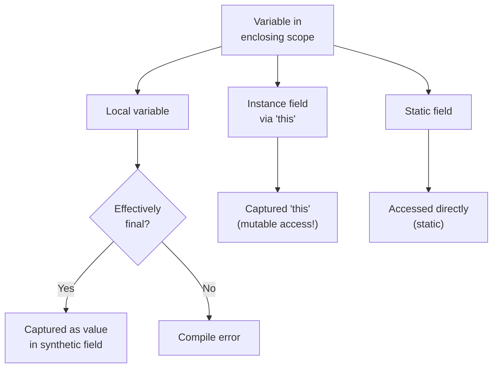

⚡ TL;DR - A closure is a function that captures variables
from its enclosing scope and carries them along. Java lambdas
are closures: they can reference local variables from the
enclosing method if those variables are effectively final.

| #027 | Category: CS Fundamentals - Paradigms | Difficulty: ★★☆ |
|:---|:---|:---|
| **Depends on:** | CSF-025 (First-Class Functions), CSF-006 (Scope) | |
| **Used by:** | CSF-026 (Higher-Order Functions), CSF-049 (Monads) | |
| **Related:** | CSF-024 (Functional Programming), CSF-028 (Side Effects) | |

---

### 🔥 The Problem This Solves

**WORLD WITHOUT IT:**

Without closures, a function can only use its own
parameters and global state. To give a callback function
some context from its creation site, you must either:
(1) pass all context as explicit parameters (making the
signature enormous), or (2) store context in a global
or instance variable (causing side effects and making
the function non-reusable outside its original context).
Neither is clean.

**THE BREAKING POINT:**

Anonymous callback functions without closure support
become useless for contextual operations. Example: you
want to register an event handler for a button click
that shows the user's name. Without closures, the handler
function cannot "remember" the user object from when
it was registered - it can only see its own parameters.
You must store the user in a global variable or pass
it through every intermediate layer between registration
and invocation. This is precisely the "callback hell"
problem in languages without closures: each callback
must be given its context explicitly, creating deeply
nested or globally-stateful code.

**THE INVENTION MOMENT:**

Closures were identified as a formal concept by Peter
Landin (1964) in his work on SECD machines (abstract
machines for evaluating lambda expressions). LISP had
closures from early implementations. JavaScript made
closures mainstream in 2004+ as the language of the web.
Java 8 added closures (with restrictions) via lambda
expressions in 2014 - though the anonymous inner class
had a limited form of closure (capturing final variables)
since Java 1.1 (1997).

---

### 📘 Textbook Definition

A closure is a function (or lambda) that captures - i.e.,
retains access to - variables from its lexical scope
(the scope in which it was defined), even after that
scope has exited. The closure "closes over" the captured
variables, binding them into the function's execution
environment. In Java, lambdas and anonymous inner classes
are closures: a lambda may reference local variables
from the enclosing method, provided those variables are
effectively final (assigned once and never reassigned).
Instance fields and `this` references are captured
implicitly without the effectively-final restriction
(but this can cause concurrency issues if the lambda
escapes to another thread). The captured variables are
stored as synthetic fields in the generated lambda class
instance, meaning the values persist as long as the
closure object is reachable.

---

### ⏱️ Understand It in 30 Seconds

**One line:**
A closure is a function that remembers its birth context:
the variables that existed when it was created.

**One analogy:**

> Imagine you write a sticky note for a task ("call the
> client about the Johnson account") and hand it to
> an assistant to execute later. The sticky note "closes
> over" the context: "Johnson account" is written on it.
> When the assistant executes the task later, they do
> not need to ask you "which account?" - the context is
> captured on the note. The sticky note is the closure;
> "Johnson account" is the captured variable; the assistant
> executing it later is the function being invoked after
> its creation scope has ended.

**One insight:**

Java's "effectively final" rule exists because closures
in Java capture values, not variable bindings. When a
local variable is captured, Java copies its value into
a synthetic field of the lambda class. If the variable
were allowed to change after capture, the lambda would
hold a stale copy. The "effectively final" rule ensures
the captured value is stable - the lambda holds the one
and only value that variable ever had.

---

### 🔩 First Principles Explanation

**WHAT GETS CAPTURED:**

```
┌──────────────────────────────────────────────────────┐
│    Java Lambda Capture Rules                         │
├──────────────────────────────────────────────────────┤
│ LOCAL VARIABLE: must be effectively final            │
│   String prefix = "ORD-";  // effectively final      │
│   Function<Integer, String> mkId =                   │
│       id -> prefix + id; // OK: captures 'prefix'   │
│   prefix = "SHIP-"; // ERROR: makes prefix not EF   │
│                                                      │
│ INSTANCE FIELD: captured via 'this' reference        │
│   class Formatter {                                  │
│       String prefix = "ORD-"; // instance field     │
│       Function<Integer, String> mkId =               │
│           id -> this.prefix + id; // OK: captures   │
│   }    // 'this' is effectively final                │
│   // BUT: this.prefix is mutable! Concurrency risk!  │
│                                                      │
│ STATIC FIELD: directly accessible (class-level)      │
│   static String PREFIX = "ORD-";                     │
│   Function<Integer, String> mkId =                   │
│       id -> PREFIX + id; // directly accessed        │
└──────────────────────────────────────────────────────┘
```



**HOW CAPTURE WORKS INTERNALLY:**

When a lambda captures a local variable, the Java compiler
generates a synthetic class implementing the functional
interface. The captured variable becomes a constructor
parameter and is stored as a `final` field of that class.
Each lambda instance holds its own copy of the captured
value.

```java
// Source:
String prefix = "ORD-";
Function<Integer, String> mkId = id -> prefix + id;

// Roughly equivalent generated class:
class Lambda$1 implements Function<Integer, String> {
    private final String prefix; // captured variable
    Lambda$1(String prefix) { this.prefix = prefix; }
    public String apply(Integer id) {
        return this.prefix + id; // uses captured value
    }
}
// Usage: new Lambda$1("ORD-")
```

**THE TRADE-OFFS:**

**Gain:** Functions can carry their creation context.
Callbacks, event handlers, and factory functions all
benefit from closures: they can be configured at creation
time and invoked later without re-specifying the context.

**Cost:** Captured variables increase memory retention.
If a closure is held indefinitely (stored in a long-lived
data structure), captured objects are not garbage collected
even if the original scope has ended. In Java, this is
a potential memory leak if lambdas capturing large objects
are stored in static collections.

---

### 🧪 Thought Experiment

**SETUP:**

A multi-tenant system serves multiple customers. Each
request comes in with a `tenantId`. You want to create
a logging function specific to the current request:

```java
// Without closures: tenantId must be passed everywhere
void processOrder(Order order, String tenantId) {
    log(tenantId, "Processing order: " + order.getId());
    validateOrder(order, tenantId);
    saveOrder(order, tenantId);
}
void validateOrder(Order order, String tenantId) {
    log(tenantId, "Validating: " + order.getId());
    // tenantId propagated through every call
}

// With closures: capture tenantId once, carry it
Consumer<String> log = message ->
    logger.info("[{}] {}", tenantId, message);
// tenantId is captured from the request scope

processOrder(order, log); // only pass the logger
void processOrder(Order order, Consumer<String> log) {
    log.accept("Processing order: " + order.getId());
    validateOrder(order, log); // log carries the context
}
```

**THE LESSON:**

Closures eliminate cross-cutting context parameters.
The `tenantId` does not need to be threaded through every
method - it is captured once in the closure and carried
automatically. This is the "context-carrying callback"
pattern, directly enabled by closures.

---

### 🎯 Mental Model / Analogy

**THE BACKPACK ANALOGY:**

A closure is a function with a backpack. When the function
is created, it packs any variables it will need from
the current environment into its backpack. When the function
is called later (even in a completely different context,
on a different thread, long after the original scope
ended), it opens its backpack and uses the packed variables.

The backpack has one rule in Java: whatever you put in
must be sealed (effectively final). You can take things
out, but you cannot change what is in the bag once it
is packed. This ensures the function always carries the
correct original value, not a value that may have changed
since packing.

**MEMORY HOOK:**

"Closure = function + backpack of captured values.
Java's rule: backpack items must be sealed (effectively final).
Instance fields are in a different bag (the 'this' reference)
- that bag IS mutable, which can cause concurrency bugs."

---

### 📊 Gradual Depth - Five Levels

**Level 1 - Child:**
A closure is a function that "remembers" things from
where it was created. Like a lunchbox your parent packs
in the morning - even when you open it at school, it
has what was packed at home.

**Level 2 - Student:**
A Java lambda can use variables from its surrounding method,
as long as those variables do not change after the lambda
is created. This is closure: the lambda "closes over"
the variable and remembers it.

**Level 3 - Professional:**
Java captures the VALUE of effectively-final local variables
at lambda creation time (stored in a synthetic field).
Instance fields are accessed via the captured `this`
reference - they can change after capture (mutable access),
but `this` itself is effectively final. Common pattern:
create request-scoped closures (capturing `requestId`,
`userId`) for callbacks that run asynchronously.

**Level 4 - Senior Engineer:**
Closures enable factory functions that return customized
functions: `Predicate<Order> aboveThreshold(double min) {
return order -> order.getTotal() >= min; }`. The returned
predicate captures `min` - a different predicate per
call with a different threshold, all from the same code.
This is the Adapter and Strategy patterns without class
hierarchies. Closures are the mechanism; HOFs are the
pattern that uses them. In Spring beans with `@Async`
methods: if a lambda captures a Spring bean's field and
is executed on a different thread, the field value is
captured when the lambda is created (at call time, not
at invocation time). For volatile or AtomicReference
fields that can change between lambda creation and
invocation, this is a subtle bug.

**Level 5 - Expert:**
Java's "effectively final" restriction is a deliberate
design choice to avoid the complexity of mutable variable
capture. In languages with mutable closure capture
(JavaScript, Python), captured variables are references
to the binding (the variable slot), not copies of the
value. This creates the classic JavaScript closure bug
in loops: all closures capture the same variable slot
and see the same final value when invoked. Java avoids
this by requiring effectively-final, making capture
always value semantics. The memory implication: a closure
holding a reference to a large object prevents GC of
that object. In servlet-scoped request processing, if
a lambda is stored in a long-lived cache and captures
a large request object, that request object is retained
for the cache's lifetime. This is one of the most common
"closure memory leak" patterns in Java web applications.

---

### ⚙️ How It Works (Formal Basis)

**LAMBDA CAPTURE SPECIFICATION (JLS 15.27.2):**

A local variable is captured if it is used in a lambda
body and its declaration is outside the lambda. The captured
variable must be effectively final: (1) formally declared
`final`, or (2) never assigned to after initial assignment.

The JVM uses `invokedynamic` + `LambdaMetafactory` to
generate the closure class at runtime on first call.
The captured values are passed to the factory and stored
in the generated class.

**EFFECTIVELY FINAL EXAMPLES:**

```java
// Effectively final: never reassigned
String prefix = "ORD-"; // assigned once
Function<Integer, String> f = id -> prefix + id; // OK

// NOT effectively final: reassigned after initial assignment
String prefix = "ORD-";
prefix = "SHIP-"; // reassignment - prefix is NOT EF
Function<Integer, String> f = id -> prefix + id; // ERROR

// Tricky: loop variable is NOT effectively final
for (int i = 0; i < 10; i++) {
    tasks.add(() -> System.out.println(i)); // ERROR
    // i is mutated by the loop increment
}
// Fix: capture into a new effectively-final variable
for (int i = 0; i < 10; i++) {
    final int idx = i; // new effectively-final variable
    tasks.add(() -> System.out.println(idx)); // OK
}
```

---

### 🔄 System Design Implications

**CLOSURES IN REQUEST PROCESSING:**

Web frameworks use closures extensively for request-scoped
behavior. A filter that logs with the request ID uses
a closure: the request ID is captured from the incoming
request and available throughout the processing chain.

**WHAT CHANGES AT SCALE:**

At 10x concurrency: if a closure captures a mutable object
(via `this` or a captured reference to a mutable container
like `AtomicLong`), concurrent access to that object
from multiple threads requires synchronization. The closure
itself is thread-safe (the captured reference is final);
the OBJECT the reference points to may not be.

At 100x object creation: closures that capture large
objects and are stored in caches or static collections
cause memory leaks. Profile with heap dumps to identify
closures retaining unexpected objects. The diagnostic:
`jmap -histo:live` to see object counts, then trace
which closures hold references to large objects.

---

### 💻 Code Example

**Example 1 - Wrong vs Right: Not Effectively Final**

```java
// BAD: Trying to capture a mutating counter
// Compile error: "Variable used in lambda should be effectively final"
int count = 0;
List<Order> orders = getOrders();
orders.forEach(order -> {
    process(order);
    count++; // ERROR: count is not effectively final
});
System.out.println("Processed: " + count);

// BAD workaround 1: array hack (works but obscures intent)
int[] count = {0};
orders.forEach(order -> {
    process(order);
    count[0]++; // works: array ref is EF, content is not
});

// GOOD: Use stream reduction (functional, no mutation)
long count = orders.stream()
    .peek(this::process) // side effect via peek (acceptable here)
    .count();

// BEST: Separate the count from the processing
orders.forEach(this::process);
long count = orders.size(); // if all were processed
```

**Example 2 - Factory Function using Closure**

```java
// Returns a validator that captures the threshold at creation time
Predicate<Order> minValueValidator(double minValue) {
    // minValue is captured in the closure
    return order -> {
        if (order.getTotal() < minValue) {
            throw new ValidationException(
                "Order total " + order.getTotal() +
                " is below minimum " + minValue
            );
        }
        return true;
    };
}

// Different validators from the same factory function:
Predicate<Order> standardValidator = minValueValidator(10.0);
Predicate<Order> premiumValidator  = minValueValidator(100.0);

// Each carries its own 'minValue' in its backpack.
orders.stream()
    .filter(premiumValidator)
    .forEach(this::processAsPremium);
```

**Failure Example: Closure Memory Leak**

```java
// BAD: lambda captures a large request object; stored in cache
class ReportCache {
    Map<String, Supplier<Report>> cache = new HashMap<>();

    void cacheReport(HttpRequest request, String key) {
        // request is captured by the lambda!
        // request object (headers, body, session) is retained
        // for as long as the cache entry exists.
        cache.put(key, () -> generateReport(request));
    }
}
// After the HTTP request is complete, the cache still holds a
// reference to the entire HttpRequest object.

// GOOD: Extract only what is needed; discard the large object
void cacheReport(HttpRequest request, String key) {
    // Extract needed data from request (small primitives/strings)
    String userId = request.getUserId();
    String reportType = request.getParam("type");
    // Lambda captures small values, not the entire request
    cache.put(key, () -> generateReport(userId, reportType));
}
```

---

### ⚠️ Common Misconceptions

| Misconception | Reality |
|---|---|
| Java lambdas capture variables by reference (like JavaScript) | Java lambdas capture VALUES (for effectively-final local variables), not bindings. The captured value is copied into a synthetic field. Modifying the original variable after capture would NOT change the lambda's copy - which is why Java requires effective finality to prevent confusion. |
| Instance fields captured in lambdas are effectively final | `this` (the reference) is effectively final. But `this.field` (the field value) is NOT effectively final and CAN change after capture. A lambda capturing `this.counter` reads `this.counter` at INVOCATION time (through the `this` reference), not at creation time. This distinction matters in concurrent code. |
| Closures and anonymous inner classes are identical | Similar but different. Anonymous inner classes have their own `this`, can access only `final` (not just effectively final) local variables (pre-Java 8), and generate a class file. Lambdas use `invokedynamic`, share `this` with the enclosing class, allow effectively final (not just declared final) captures, and may share instances for stateless lambdas. |
| A closure always causes a memory leak | A closure causes a memory PROBLEM only if: (1) it captures a large or long-lived object, AND (2) the closure itself is retained long-term (stored in a cache, collection, or static field). Short-lived closures (created and GC'd within a request) do not cause memory leaks even if they capture large objects. |

---

### 🚨 Failure Modes & Diagnosis

**Failure Mode 1: Stale Value in Async Closure**

**Symptom:** A `CompletableFuture` callback uses a value
that appears to be "from a previous request" or does not
reflect the value at the time the future completes.

**Root Cause:** The closure captured the value at lambda
creation time (when the `CompletableFuture` was started),
not at completion time. If the captured value was a local
variable from a request scope, it reflects the request
state at submission, not at completion.

```java
// BAD: requestId is captured at submission time
String requestId = request.getId();
CompletableFuture.runAsync(() -> {
    // requestId is the value from when runAsync was called,
    // not the "current request" at completion time.
    // If requestId is reassigned between submission and
    // completion... wait, it can't be (effectively final).
    // But if requestId comes from a mutable ThreadLocal,
    // the captured value may be stale or wrong.
    log.info("Completed: " + requestId);
});

// GOOD: Pass explicitly or use effectively-final captures
String capturedId = request.getId(); // explicitly captured
// This is correct - capturedId is the request's ID
// at submission time, which is what you want.
CompletableFuture.runAsync(() ->
    log.info("Completed: " + capturedId));
```

---

**Security Note:**

A closure that captures a credential (token, password,
API key) at creation time holds that credential in
a heap-allocated synthetic field for the lifetime of the
closure object. If the closure escapes to an untrusted
context (e.g., passed to a third-party plugin or stored
in a globally accessible collection), the captured
credential is exposed. Design rule: never capture
credentials in lambdas. Pass credentials as parameters
at invocation time, and retrieve them from a secrets
manager on each call if freshness and revocability matter.

---

### 🔗 Related Keywords

**Prerequisites (understand these first):**
- `First-Class Functions` (CSF-025) - closures ARE
  first-class functions with captured environment;
  first-class functions are prerequisite
- `Scope` (CSF-006) - closures capture from their
  lexical scope; understanding scope is prerequisite

**Builds On This (learn these next):**
- `Side Effects` (CSF-028) - closures that capture and
  mutate mutable state create side effects; understanding
  the relationship between closures and side effects
  is important
- `Monads and Functors` (CSF-049) - monads in Haskell
  and functional Java libraries use closures as their
  primary building block

**Alternatives / Comparisons:**
- `Functional Programming` (CSF-024) - closures are a
  core mechanism of FP; this entry provides the deeper
  philosophical context

---

### 📌 Quick Reference Card

```
┌────────────────────────────────────────────────────────┐
│ DEFINITION   │ Function that captures variables from   │
│              │ its creation scope (lexical scope)      │
├──────────────┼─────────────────────────────────────────┤
│ JAVA RULE    │ Local vars: must be effectively final   │
│              │ Instance fields: captured via 'this'    │
│              │ Static fields: accessed directly        │
├──────────────┼─────────────────────────────────────────┤
│ CAPTURE MECH │ Value copy into synthetic final field   │
│              │ of generated lambda class               │
├──────────────┼─────────────────────────────────────────┤
│ KEY PATTERN  │ Factory function returning a closure:   │
│              │ Predicate<T> factory(Config cfg) {      │
│              │   return t -> cfg.test(t); // cfg captured│
│              │ }                                       │
├──────────────┼─────────────────────────────────────────┤
│ MEMORY WARN  │ Closures in caches retain captured objs │
│              │ Capture small values; not large objects  │
├──────────────┼─────────────────────────────────────────┤
│ CONCURRENCY  │ Captured 'this' field = mutable access  │
│              │ Synchronize if lambda escapes to thread  │
├──────────────┼─────────────────────────────────────────┤
│ ONE-LINER    │ "Closure = function + its backpack of   │
│              │ captured values. Java: local vars must  │
│              │ be effectively final to be captured."   │
├──────────────┼─────────────────────────────────────────┤
│ NEXT EXPLORE │ CSF-028 (Side Effects), CSF-049 (Monads)│
└────────────────────────────────────────────────────────┘
```

**If you remember only 3 things:**

1. A closure is a function that captures variables from
   the scope where it was created. In Java: a lambda
   that uses a local variable from the enclosing method.
2. Java's effectively-final rule: captured local variables
   must not be reassigned after their initial assignment.
   This ensures the closure has a stable, consistent value.
3. Instance fields are captured via `this` (mutable access!).
   Closures that modify instance fields accessed from
   different threads need synchronization - the closure
   itself is thread-safe, but the field it modifies is not.

**Interview one-liner:**
"A closure is a function that closes over variables from
its defining scope, carrying them along even after that
scope ends. In Java, lambdas are closures: they can capture
effectively-final local variables. The compiler generates
a class with a field for each captured variable. The
effectively-final rule ensures the captured value is
stable - Java captures values, not variable bindings."

---

### 💎 Transferable Wisdom

**Reusable Engineering Principle:**
Closures solve the "contextual callback" problem: how
does a function know its context when invoked asynchronously,
in a different thread, or long after creation? The answer:
it captures the context at creation time and carries it
as a first-class part of itself. This principle appears
across all of software: event handlers carry their widget
context, promise callbacks carry their request context,
middleware functions carry their configuration context.
Any time you need to "configure a function at creation
time and invoke it later with just the dynamic argument,"
you are using (or need) a closure.

**Where else this pattern appears:**

- **JavaScript event listeners** - `element.addEventListener(
  'click', () => console.log(userId))`. The arrow function
  is a closure that captures `userId` from the outer scope.
  When the click happens (later, different call stack),
  `userId` is still available. This is closures enabling
  event-driven programming.
- **Python decorators with arguments** - `@retry(max=3)`:
  `retry(max=3)` returns a closure that captures `max=3`
  and applies it to the decorated function. The closure
  carries the retry count configuration.
- **Spring Security `@PreAuthorize` with SpEL** - SpEL
  expressions in annotations are evaluated at runtime with
  access to the security context (captured at authorization
  check time). This is effectively a closure mechanism
  at the framework level: the expression carries its
  evaluation context.

---

### 💡 The Surprising Truth

Java had closures for 20 years before Java 8 introduced
lambdas - just in the ugliest possible form. Anonymous
inner classes (introduced in Java 1.1, 1997) are closures:
they can capture `final` local variables from the enclosing
scope. The verbosity was so extreme that developers
rarely thought of anonymous inner classes as "closures"
at all - they were just boilerplate. Java 8 lambdas did
not invent closure semantics for Java; they made existing
closure semantics accessible with a practical syntax.
The "effectively final" rule in Java 8 was actually a
RELAXATION from Java 1.1: anonymous inner classes required
`final` (explicit keyword); Java 8 lambdas only require
effective finality (no reassignment, no explicit keyword
needed). Java 8 made closures practical by making them
syntactically lightweight, not by inventing new semantics.

---

### ✅ Mastery Checklist

**You've mastered this when you can:**

1. **[IDENTIFY]** Given five Java lambdas, identify which
   variables each lambda captures (local variable, instance
   field, static field, nothing), determine whether each
   captured local variable is effectively final, and
   predict which lambdas compile and which produce errors.

2. **[BUILD]** Implement a request-scoped logging closure:
   given a `requestId`, create a `Consumer<String>` that
   logs messages prefixed with the `requestId`. Use it
   in an async pipeline and confirm the `requestId` is
   correctly carried even when the logging happens on
   a different thread.

3. **[TRACE]** Given a lambda that captures `this.config`
   (an instance field), explain what happens when another
   thread calls `this.config = newConfig` while the lambda
   is executing. Predict the behavior, explain the risk,
   and propose a fix.

4. **[DIAGNOSE]** Use a heap dump to identify closures
   (lambda synthetic classes) that are retaining large
   objects longer than expected. Describe the diagnostic
   steps: `jmap -histo:live`, identifying `Lambda$` classes,
   tracing the GC root that prevents collection.

5. **[EXPLAIN]** Explain why the classic JavaScript closure
   bug (`for (var i=0; i<5; i++) { setTimeout(() =>
   console.log(i), 100) }` prints "5" five times) does
   NOT occur in Java, using the difference between Java's
   value capture (effectively-final copy) and JavaScript's
   binding capture (reference to the variable slot).

---

### 🧠 Think About This Before We Continue

**Q1.** A developer writes a cache whose values are computed
lazily: `cache.put(key, () -> expensiveCompute(largeDataset))`.
The `largeDataset` is a 500MB list loaded at startup.
After 6 months, the application has a heap leak. The
`largeDataset` variable has gone out of scope everywhere
except inside these lambdas in the cache. What is the
fix, and how do you diagnose the leak?

*Hint: The lambda closes over `largeDataset` - even though
the variable is out of scope everywhere else, the lambda
holds a reference to the list in its synthetic field.
As long as the cache entries exist, the 500MB list is
retained. Diagnosis: heap dump, find `Lambda$` classes,
trace references. Fix: eagerly evaluate the supplier
(store the computed value, not the lambda), or capture
only a small key and look up the dataset lazily inside
the compute function from a weakly-referenced cache.*

**Q2.** Consider: `List<Runnable> tasks = new ArrayList<>();
for (int i = 0; i < 5; i++) { tasks.add(() ->
System.out.println(i)); }`. This does NOT compile in Java.
If you replace `int i` with `Integer i` in a for-each loop,
it ALSO fails. Explain exactly why Java requires effectively
final, what the JVM would have to do differently to allow
mutable capture, and why the language designers chose not
to support it.

*Hint: Mutable capture would require the lambda to hold
a reference to the variable's storage location (the
stack slot or a heap-allocated box). Java would need
to "box" the variable automatically (similar to Kotlin's
`Ref` wrapper) to allow the lambda and the enclosing
code to share access to the same mutable slot. This adds
GC overhead, complexity, and the potential for
surprising behavior (mutating a variable from inside
a lambda changes it outside too). Java chose simplicity
(copy the value, require effective finality) over
generality (mutable capture). Kotlin and Scala support
mutable capture with transparent boxing.*

---

### 🎯 Interview Deep-Dive

**Q1: "What is a closure in Java? How does it differ from
a regular lambda?"**

*Why they ask:* Tests depth beyond "lambdas are closures."
Most developers know lambdas exist; fewer understand the
semantics of variable capture.

*Strong answer includes:*
- Every lambda is a closure IF it captures at least one
  variable from the enclosing scope. A lambda that uses
  only its own parameters and static members is NOT a
  closure (it has no closed-over environment).
- Captured variables must be effectively final. The compiler
  generates a synthetic class with a final field for each
  captured variable. The value at capture time is stored
  in that field.
- Practical examples: `Predicate<Order> minValue =
  order -> order.getTotal() >= threshold` is a closure
  (captures `threshold`). `Comparator<Order> byTotal =
  (a, b) -> Double.compare(a.getTotal(), b.getTotal())`
  is NOT a closure (uses only its own parameters).

**Q2: "What is 'effectively final' in Java? Why does it exist?"**

*Why they ask:* Deep Java language design knowledge.
Tests whether the developer understands the WHY, not just the rule.

*Strong answer includes:*
- "Effectively final": a variable that is assigned exactly
  once and never reassigned. The compiler tracks this;
  no explicit `final` keyword required (since Java 8).
  Before Java 8, anonymous inner classes required `final`.
- Why it exists: Java lambdas capture VALUES, not variable
  bindings. The captured value is copied into a synthetic
  field. If the variable could be reassigned, the lambda
  would hold a stale copy, leading to confusion about
  "which value" was captured. By requiring effective finality,
  Java guarantees the captured value is the one and only
  value the variable ever had.
- The alternative (mutable capture): languages like Kotlin
  automatically wrap mutable captured variables in a `Ref`
  box, allowing mutation to be visible both inside and
  outside the lambda. Java chose not to do this to avoid
  the performance cost (heap allocation per captured mutable
  variable) and the semantic complexity (mutations in the
  lambda visible outside, and vice versa).

**Q3: "Describe a real scenario where a closure causes
a memory leak in a Java web application."**

*Why they ask:* Tests production awareness. Memory leaks
from closures are a real category of production incident.

*Strong answer includes:*
- Scenario: a request handler creates a `CompletableFuture`
  with a lambda that captures the `HttpServletRequest`
  (to read a header). The `CompletableFuture` is stored
  in a class-level cache (for polling). The lambda retains
  the entire `HttpServletRequest` - including the request
  body (potentially MB of data) - until the cache entry
  expires.
- Diagnosis: heap dump (`jmap -dump:format=b,file=heap.hprof`),
  load in Eclipse MAT or VisualVM, find `Lambda$` classes
  that are GC-root-reachable (retained by the cache),
  trace their synthetic fields to find the `HttpServletRequest`.
- Fix: capture only the needed data (the header value
  as a String), not the entire `HttpServletRequest`.
  Or: use a `WeakReference` for the cached lambda if
  stale computation is acceptable.
- Insight: the rule of thumb - only capture the minimum
  data needed. Prefer capturing `String userId = request.
  getUserId()` over capturing the entire `request` object.

> Entry stub. Generate full content using Master Prompt v4.0.
