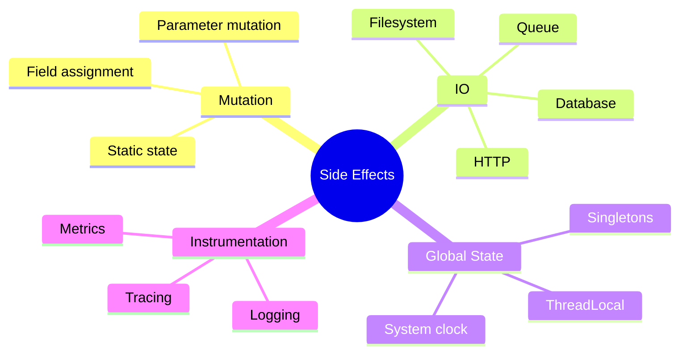
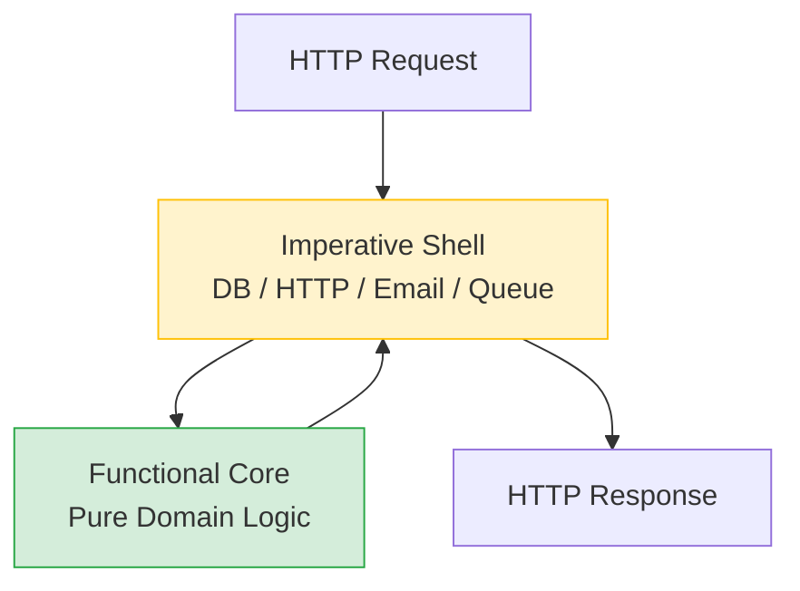

⚡ TL;DR - A side effect is any observable change a function
makes beyond returning a value: mutating state, writing
to I/O, or modifying a shared resource. Isolating side
effects to the boundary of a system makes the core
testable, predictable, and concurrent-safe.

| #028 | Category: CS Fundamentals - Paradigms | Difficulty: ★★☆ |
|:---|:---|:---|
| **Depends on:** | CSF-024 (Functional Programming), CSF-008 (Functions) | |
| **Used by:** | CSF-055 (Testing Paradigms), CSF-059 (Effect Systems) | |
| **Related:** | CSF-027 (Closures), CSF-030 (Immutability), CSF-058 (Referential Transparency) | |

---

### 🔥 The Problem This Solves

**WORLD WITHOUT IT:**

Without awareness of side effects, functions freely mix
business logic with mutations, I/O, and global state
changes. A `calculateOrderTotal` method might also update
a database record and send an email - all in one call.
This seems convenient but creates cascading problems:
(1) testing `calculateOrderTotal` requires a database
and an email service; (2) calling the function twice
produces different results because it mutates state;
(3) running the function in a different context (a batch
job, a different thread) may corrupt shared state.

**THE BREAKING POINT:**

At scale, uncontrolled side effects manifest as:
- Integration tests that require the full application
  stack because unit tests cannot isolate any unit of behavior
- Race conditions when concurrent callers hit shared
  mutable state in functions that "just happen to also
  update a counter"
- Heisenbugs where calling a function for debugging
  purposes changes the system state enough to make the
  bug disappear
- Functions that cannot be called more than once safely
  (non-idempotent side effects: sending an email, charging
  a credit card) mixed with calculation logic

**THE INVENTION MOMENT:**

The distinction between "pure computation" and "effect"
dates to Edsger Dijkstra's structured programming advocacy
(1960s-70s) and Bertrand Meyer's Command-Query Separation
(CQS) principle (1988): "A function should either be
a command that performs an action, or a query that returns
data - but not both." FP made this a first-class design
goal. Haskell (1990) formalized it in the type system:
a function that has no I/O side effects cannot be of
type `IO a`; all I/O is explicitly typed, making every
function's effect (or lack thereof) visible to the
compiler and programmer.

---

### 📘 Textbook Definition

A side effect is any observable change in the state of
the system or the world that occurs as a result of
evaluating a function, BEYOND the function returning
a value to the caller. Categories of side effects:
(1) Mutation: modifying a variable, object field, array
element, or collection - inside or outside the function;
(2) I/O: reading from or writing to files, databases,
networks, consoles, or any external system;
(3) Global state modification: changing a class-level
variable, static field, ThreadLocal, or singleton state;
(4) Throwing an exception: observable via the call stack;
(5) Timing/logging: writing audit logs, emitting metrics,
sleeping. A function with no side effects is called a
"pure function" - it is referentially transparent (its
output depends only on its input; it leaves no mark on
the world). The distinction between pure computation
and side effects is foundational to testing, concurrency
reasoning, and architectural design.

---

### ⏱️ Understand It in 30 Seconds

**One line:**
A side effect is anything a function does besides returning
a value. Managing where and when side effects happen
is one of the most important software design decisions.

**One analogy:**

> A cashier at a supermarket has two jobs:
> (1) calculating the total (pure computation: inputs =
> items + prices, output = total),
> (2) processing the payment and sending a receipt (side
> effects: database write, email send, receipt print).
> Imagine a cashier who calculates the total BUT ALSO
> secretly charges your card and sends a receipt every
> time they ring up a single item. That is uncontrolled
> side effects: surprising, untestable (you cannot "test"
> the price calculation without also charging a real card),
> and dangerous if run twice. The fix: separate the
> calculation (pure) from the action (side effect), call
> the action once at the end, explicitly.

**One insight:**

Every time a unit test needs a mock database, a mock
email service, or a mock HTTP client, it is compensating
for a side effect in the code under test. If business
logic (calculations, validations, transformations) is
separated from I/O (database reads/writes, HTTP calls,
emails), the business logic needs no mocks - only the
I/O layer does. The number of mocks in your test is
proportional to the number of side effects in the code.

---

### 🔩 First Principles Explanation

**TAXONOMY OF SIDE EFFECTS:**

```
┌─────────────────────────────────────────────────────┐
│              Side Effect Taxonomy                   │
├─────────────────────────────────────────────────────┤
│ MUTATION                                            │
│   - Modifying method parameters (in-place mutation) │
│   - Setting instance fields (this.x = ...)          │
│   - Updating static/class-level state               │
│   - Modifying a collection passed as an argument    │
│                                                     │
│ I/O                                                 │
│   - Database read/write (JDBC, JPA, repositories)  │
│   - HTTP requests (outbound calls, webhooks)        │
│   - File system access (read, write, delete)        │
│   - Message queue publish/consume                   │
│   - Console output (System.out.println)             │
│                                                     │
│ GLOBAL STATE                                        │
│   - ThreadLocal get/set                             │
│   - Singleton mutable state                         │
│   - System clock / random number access             │
│                                                     │
│ OBSERVABLE EXCEPTION                                │
│   - Throwing (changes control flow visibly)         │
│   - Catching + logging (I/O side effect)            │
│                                                     │
│ INSTRUMENTATION                                     │
│   - Logging, metrics, tracing (audit trail)         │
└─────────────────────────────────────────────────────┘
```



**COMMAND-QUERY SEPARATION (CQS):**

Meyer's CQS principle:
- **Query** (no side effect): returns data; can be called
  any number of times safely; idempotent.
- **Command** (side effect): changes state; returns void
  or status; should not be called speculatively.

Java violation example:
```java
// CQS VIOLATION: query that has a side effect
int getAndIncrementCounter() {
    return counter++; // returns AND mutates
}
// Calling this for inspection changes the counter.

// CQS COMPLIANT:
int getCounter() { return counter; }     // query (pure)
void incrementCounter() { counter++; }  // command (side effect)
```

**THE TRADE-OFFS:**

**Gain from controlling side effects:** Testability,
predictability, concurrency safety, debuggability.
Pure functions can be tested in isolation, reasoned
about without knowing the history of prior calls,
called from any thread safely, and cached/memoized.

**Cost of controlling side effects:** More code
(separating computation from action). Requires discipline
to not "just add a database call" inside a calculation
method. In languages without effect systems (Java), this
is convention, not enforcement.

---

### 🧪 Thought Experiment

**SETUP:**

Two teams implement order processing. Team A mixes
side effects freely; Team B isolates them.

```java
// Team A: Mixed (uncontrolled side effects)
BigDecimal processOrder(Order order) {
    validate(order);          // throws if invalid
    BigDecimal total = calculateTotal(order); // computation
    db.save(order);           // side effect: DB write
    email.sendConfirmation(); // side effect: email
    metrics.increment("orders"); // side effect: metrics
    return total;
}
// Testing: requires DB + email + metrics mock = 3 mocks minimum
// Calling twice: saves DB record twice, sends 2 emails
// Debugging: calculating the total always triggers all effects

// Team B: Isolated (controlled side effects)
BigDecimal calculateTotal(Order order) { // PURE - no effects
    validate(order);
    return applyTaxAndDiscount(order);
}
void saveAndNotify(Order order, BigDecimal total) { // EFFECTS ONLY
    db.save(order);
    email.sendConfirmation(order, total);
    metrics.increment("orders");
}
// Testing calculateTotal: zero mocks - pure function
// Testing saveAndNotify: mock DB + email + metrics
// Debugging: can call calculateTotal freely, no side effects
```

**THE LESSON:**

Separating pure calculation from side-effecting actions
reduces test coupling from N mocks for every test to
N mocks ONLY for the side-effecting code. The pure code
tests are simpler, faster, and more reliable.

---

### 🎯 Mental Model / Analogy

**THE SPREADSHEET ANALOGY:**

A spreadsheet cell with a formula is a pure function:
`=SUM(A1:A10)`. No matter when you look at it or how
many times you open the spreadsheet, the formula returns
the same value for the same inputs. It has no side effects.
You can inspect it, debug it, and copy it without risk.

A spreadsheet cell with a macro that sends an email when
evaluated is a side-effecting function. You cannot open
that spreadsheet to check the value without triggering
the email. You cannot call it from a reporting dashboard
that just wants to display the value. The macro mixed
calculation with action.

**FUNCTIONAL CORE / IMPERATIVE SHELL:**

Gary Bernhardt's "Functional Core, Imperative Shell"
architecture: the center of the system is pure functions
(domain logic, calculations, transformations). The shell
(controllers, repositories, message producers) contains
all side effects. The core never imports the shell; the
shell depends on the core.

```
    ┌─────────────────────────────────┐
    │       IMPERATIVE SHELL          │
    │   (HTTP, DB, Email, Queue)      │
    │  ┌───────────────────────────┐  │
    │  │   FUNCTIONAL CORE         │  │
    │  │  (Domain logic, pure fns) │  │
    │  └───────────────────────────┘  │
    └─────────────────────────────────┘
    Side effects ONLY in the shell.
    Core is testable without any infrastructure.
```



**MEMORY HOOK:**

"Side effect = anything a function does besides returning
a value. Pure = no side effects. Testing costs are
proportional to side effects. Isolate them to the edge."

---

### 📊 Gradual Depth - Five Levels

**Level 1 - Child:**
A side effect is when a function does something unexpected
beyond answering your question. A calculator that also
sends an email every time you press "=" has a side effect.
The answer is correct, but the email is a surprise.

**Level 2 - Student:**
A pure function has no side effects: it just takes inputs
and returns an output. A function that reads from a database,
modifies an object, or prints to the console has side effects.
Side effects make functions harder to test because you
cannot call them without triggering the effect.

**Level 3 - Professional:**
Meyer's Command-Query Separation: a method should either
be a Query (returns data, no side effects) or a Command
(changes state, returns void). `getTotal()` is a Query;
`saveOrder()` is a Command. Mixing the two (`getAndSaveTotal()`)
makes code untestable and violates the single responsibility
principle. In Spring, `@Transactional` methods are Commands.
Repository `findBy` methods are Queries.

**Level 4 - Senior Engineer:**
"Functional core, imperative shell" is the architectural
application of side effect isolation. Domain services and
value objects form the pure core (no Spring dependencies,
no JPA, no HTTP clients). Application services and adapters
form the shell (all the I/O). The hexagonal (ports and
adapters) architecture formalizes this: the domain is
completely pure; the adapters are side-effecting. Tests
for the core are unit tests with no infrastructure;
tests for the shell use integration or contract tests.
This reduces the number of infrastructure-dependent
tests from "all of them" to "just the adapter layer."

**Level 5 - Expert:**
Effect systems (Haskell's `IO` monad, Scala's ZIO, Cats
Effect) encode side effects in the type system: a function
returning `IO[A]` is declared to have I/O effects; a
function returning `A` is pure. The compiler prevents
using a side-effecting function where a pure one is
required. Java has no native effect system, but libraries
like Vavr's `Try` and `Either` encode the effect of
potential failure in the type system without exceptions.
Project Loom (Java 21+) introduces virtual threads,
making blocking I/O cheap - but does not change the
testability cost of uncontrolled side effects. The
distinction between "side effects that are safe to repeat"
(idempotent I/O: `GET`, `PUT`) and "side effects that
must happen exactly once" (non-idempotent: charge a card,
send an email) is a critical design dimension that maps
directly to distributed systems patterns (at-least-once
vs exactly-once delivery).

---

### ⚙️ How It Works (Formal Basis)

**IDEMPOTENCY AND SIDE EFFECTS:**

A function `f` is idempotent if `f(f(x)) = f(x)` - calling
it multiple times produces the same result as calling it
once. Many side effects are non-idempotent: charging a
credit card twice charges the card twice. Designing
side-effecting operations to be idempotent is essential
for resilient distributed systems.

```java
// Non-idempotent: calling twice has doubled effect
void sendWelcomeEmail(User user) {
    emailService.send(user.email, "Welcome!"); // two calls = two emails
}

// Idempotent: calling twice has same effect as calling once
void sendWelcomeEmail(User user) {
    if (!emailLog.hasBeenSent(user.id, "WELCOME")) {
        emailService.send(user.email, "Welcome!");
        emailLog.record(user.id, "WELCOME");
    }
    // Second call: hasBeenSent = true, no email sent
}
```

---

### 🔄 System Design Implications

**SIDE EFFECTS AND MICROSERVICES:**

In a microservices architecture, every cross-service call
is a side effect. A service that "just calculates" but
calls three downstream services for data is implicitly
dependent on all three services' availability and latency.
The architectural principle: minimize side effects in
critical path code. Cache aggressively. Design the pure
calculation to work with data already in memory; perform
the I/O to fetch data in a separate phase.

**WHAT CHANGES AT SCALE:**

At 10x requests: side effects that mutate shared state
become bottlenecks. A global counter incremented on
every request (`synchronized counter++`) becomes a
contention point. Replace with `LongAdder` (designed for
concurrent increment) or use partition-local counters
aggregated periodically.

At 100x scale: non-idempotent side effects in a retry-heavy
environment cause data corruption. A payment service
that charges the card non-idempotently will double-charge
on network retries. Design all side-effecting endpoints
to be idempotent (accept a client-generated idempotency
key; deduplicate at the receiver).

---

### 💻 Code Example

**Example 1 - Wrong vs Right: Mixed vs Isolated**

```java
// BAD: Business logic mixed with side effects
// Testing total calculation requires mocking DB + email!
class OrderService {
    BigDecimal processOrder(Order order) {
        // Side effect: DB read
        Customer customer = db.findCustomer(order.customerId);
        // Pure computation (mixed in)
        BigDecimal discount = customer.isPremium() ?
            order.getTotal().multiply(new BigDecimal("0.95"))
            : order.getTotal();
        // Side effect: DB write
        db.save(order.withTotal(discount));
        // Side effect: email
        emailService.send(customer.email, "Order confirmed");
        return discount;
    }
}

// GOOD: Calculation is pure; side effects are in the shell
class OrderCalculator { // Pure core - no side effects
    BigDecimal calculateDiscount(Order order, Customer customer) {
        return customer.isPremium() ?
            order.getTotal().multiply(new BigDecimal("0.95"))
            : order.getTotal();
    }
}

class OrderApplicationService { // Shell - all side effects here
    void processOrder(String orderId) {
        // Fetch (side effect: DB read)
        Order order = db.findOrder(orderId);
        Customer customer = db.findCustomer(order.customerId);
        // Calculate (pure - no side effect)
        BigDecimal discount =
            calculator.calculateDiscount(order, customer);
        // Persist (side effect: DB write)
        db.save(order.withTotal(discount));
        // Notify (side effect: email)
        emailService.send(customer.email, "Order confirmed");
    }
}

// Testing calculateDiscount: ZERO mocks, pure assertion
@Test
void premiumCustomerGets5PctDiscount() {
    Order order = new Order(new BigDecimal("100.00"));
    Customer premium = new Customer(true);
    BigDecimal total = calculator.calculateDiscount(order, premium);
    assertEquals(new BigDecimal("95.00"), total);
}
```

---

### ⚖️ Comparison Table

| Concept | Example | Testable Without Mocks? | Safe to Call Twice? | Safe to Parallelize? |
|---|---|---|---|---|
| Pure function (no side effects) | `calculateDiscount(order, rate)` | Yes | Yes | Yes |
| Idempotent side effect | `saveOrder(order)` with upsert | No | Yes | Careful |
| Non-idempotent side effect | `sendEmail(user, "Welcome")` | No | No | No |
| Mutation of shared state | `counter++` (no sync) | No | No | No |
| Read-only I/O (Query) | `findOrder(id)` | No | Yes | Yes |

---

### ⚠️ Common Misconceptions

| Misconception | Reality |
|---|---|
| Logging is not a side effect | Logging IS a side effect: it writes to an external system (log appender, file, stdout). This is why loggers are mocked in tests that need to verify log output, and why libraries use `SLF4J` as an abstraction over the logging implementation. For most business logic tests, logging side effects are acceptable to ignore (use NOP logger). |
| Making a function `static` removes its side effects | `static` means the function is not bound to an instance (no `this`), but it can still access static state, write to databases, throw exceptions, or call other side-effecting methods. `static` does not imply purity. |
| Side effects are always bad and should be eliminated | All useful programs have side effects - they must produce observable output. The goal is not eliminating side effects but CONTROLLING them: making them explicit, isolating them to the boundary, and ensuring they are idempotent where required. |
| Reading from a database is not a side effect | Reading from a database IS a side effect (I/O). Even though it does not mutate external state, it: (1) depends on external system state (non-deterministic from the function's perspective), (2) can fail (network error), (3) cannot be run without the database. A function that reads from a DB is not a pure function. |

---

### 🚨 Failure Modes & Diagnosis

**Failure Mode 1: Hidden Side Effect in Calculation**

**Symptom:** A test for a calculation function fails in
CI but passes locally. Or: a batch job produces
different results when run twice with identical input.

**Root Cause:** The "calculation" function has a hidden
side effect - reads from a database, accesses a ThreadLocal
(request context), or reads the system clock (`LocalDate.now()`).

```java
// BAD: Hidden side effect (system clock read)
BigDecimal calculateLateFee(Invoice invoice) {
    long daysOverdue = ChronoUnit.DAYS.between(
        invoice.getDueDate(),
        LocalDate.now() // SIDE EFFECT: depends on wall clock!
    );
    return daysOverdue > 0 ?
        new BigDecimal(daysOverdue).multiply(FEE_RATE)
        : BigDecimal.ZERO;
}
// Test today will fail tomorrow - same inputs, different results.

// GOOD: Inject the "current date" as a parameter
BigDecimal calculateLateFee(Invoice invoice, LocalDate today) {
    long daysOverdue = ChronoUnit.DAYS.between(
        invoice.getDueDate(), today
    );
    return daysOverdue > 0 ?
        new BigDecimal(daysOverdue).multiply(FEE_RATE)
        : BigDecimal.ZERO;
}
// Test: pass a fixed LocalDate. Fully deterministic.
```

---

**Security Note:**

Non-idempotent side effects in financial applications are
a critical security concern. A payment endpoint that charges
a card non-idempotently will double-charge if the client
retries due to a network timeout. The attacker does not
need to exploit the retry - honest client retries do
it accidentally. Defense: every payment mutation must
accept an idempotency key (client-generated UUID),
stored as a unique constraint. Repeat requests with the
same idempotency key return the cached result without
re-executing the side effect.

---

### 🔗 Related Keywords

**Prerequisites (understand these first):**
- `Functional Programming` (CSF-024) - the paradigm that
  treats side effects as a design concern, not just
  a mechanism
- `Functions and Procedures` (CSF-008) - understanding
  the function contract (inputs, outputs) is prerequisite
  to understanding what counts as "beyond the return value"

**Builds On This (learn these next):**
- `Immutability` (CSF-030) - immutable data eliminates
  the mutation category of side effects entirely
- `Effect Systems` (CSF-059) - type-level encoding of
  side effects (Haskell IO monad, ZIO, Cats Effect);
  the advanced form of side effect control

**Alternatives / Comparisons:**
- `Referential Transparency` (CSF-058) - the positive
  formulation of purity: expressions can be replaced
  by their values (equivalent to having no side effects)
- `Idempotency` (CSF-051) - the design property that
  makes non-idempotent side effects safe to retry

---

### 📌 Quick Reference Card

```
┌────────────────────────────────────────────────────────┐
│ DEFINITION   │ Any observable effect beyond returning  │
│              │ a value: mutation, I/O, global state    │
├──────────────┼─────────────────────────────────────────┤
│ CQS RULE     │ Query: returns data, no side effects    │
│              │ Command: changes state, returns void    │
│              │ NEVER both in one method                │
├──────────────┼─────────────────────────────────────────┤
│ TEST COST    │ Mocks in tests = side effects in code   │
│              │ Pure function test = assertEquals only  │
├──────────────┼─────────────────────────────────────────┤
│ ARCHITECTURE │ Functional core (pure) + Imperative     │
│              │ shell (I/O). Core = no infrastructure.  │
├──────────────┼─────────────────────────────────────────┤
│ IDEMPOTENT   │ Safe to retry: GET, upsert, dedup       │
│              │ Dangerous to retry: email, charge card  │
├──────────────┼─────────────────────────────────────────┤
│ CLOCK RULE   │ LocalDate.now() is a side effect.       │
│              │ Inject today as a parameter for testing.│
├──────────────┼─────────────────────────────────────────┤
│ ONE-LINER    │ "Side effect = function does something  │
│              │ beyond returning a value. Isolate to    │
│              │ the boundary; keep the core pure."      │
├──────────────┼─────────────────────────────────────────┤
│ NEXT EXPLORE │ CSF-030 (Immutability), CSF-051 (Idempotency)│
└────────────────────────────────────────────────────────┘
```

**If you remember only 3 things:**

1. A side effect is any observable change beyond returning
   a value: mutation, I/O, global state, exceptions. Pure
   functions have zero side effects.
2. Command-Query Separation: a method is either a Query
   (returns data, no side effects) or a Command (has
   side effects, returns void). Never mix the two.
3. Count your mocks to measure your side effects.
   Every mock in a test represents a side effect in
   the code. A pure function needs zero mocks.

**Interview one-liner:**
"A side effect is any observable action a function takes
beyond returning its value: mutations, I/O, global state
changes. Pure functions have no side effects and are
testable without mocks. The practical architecture
pattern: keep business logic pure (functional core)
and isolate all I/O to the boundary (imperative shell).
Follow Command-Query Separation: never mix computation
and action in one method."

---

### 💎 Transferable Wisdom

**Reusable Engineering Principle:**
The principle "separate computation from action" is one
of the oldest and most universally applicable ideas in
software. A function that calculates and a function that
acts are fundamentally different: one is safe to call
repeatedly, speculatively, and in parallel; the other
is not. Every time you see a complex function with
12 responsibilities, ask: "which parts compute, and
which parts act?" Separating them immediately clarifies
the structure, reduces the test surface, and identifies
the points where errors (network failures, DB errors,
validation failures) need to be handled.

**Where else this pattern appears:**

- **Redux reducers** - a Redux reducer is a pure function:
  `newState = reducer(oldState, action)`. It computes
  the new state but has ZERO side effects. Side effects
  (API calls, localStorage writes) are in "middleware"
  (the shell). This is "functional core, imperative shell"
  applied to UI state management.
- **Event sourcing** - the "apply event" function is pure:
  `newState = applyEvent(currentState, event)`. Persistence
  (writing the event to the log) is the side effect,
  handled by the event store. The domain logic is testable
  without any database.
- **SQL (conceptual model)** - `SELECT` is a query (no
  side effects, referentially transparent). `INSERT/UPDATE/
  DELETE` are commands (side effects, change data).
  The CQS principle is built into SQL's grammar.
  `SELECT ... FOR UPDATE` violates CQS and is explicitly
  designed for locking (a deliberate, controlled side effect).

---

### 💡 The Surprising Truth

Bertrand Meyer formalized Command-Query Separation in
1988, but the distinction it describes is as old as
mathematics. A mathematical function is, by definition,
a pure mapping from inputs to outputs with no side effects.
The surprise: virtually every mainstream object-oriented
language made side effects trivial (just mutate a field
inside any method) while making the LACK of side effects
hard (no built-in mechanism to declare or enforce purity).
Haskell took the opposite approach: purity is the default;
side effects require explicit typing (`IO a`). The result:
Haskell programs are harder to write for beginners but
fundamentally more predictable and easier to reason about
at scale. The mainstream software industry spent 30 years
debating OOP vs FP before arriving at the pragmatic
answer that Java 8 embodies: not "pure FP" but
"FP patterns applied where they add value" - which is
exactly "isolate side effects; keep the core pure."

---

### ✅ Mastery Checklist

**You've mastered this when you can:**

1. **[IDENTIFY]** Review a 50-line service method and
   catalog every side effect it contains (with category:
   mutation, I/O, global state, instrumentation). Count
   how many mocks a complete unit test would require.

2. **[REFACTOR]** Take a method that mixes business logic
   with 3 side effects and refactor it into: (1) a pure
   function containing the business logic, and (2) a
   shell method that calls the pure function and manages
   the side effects. Write a test for the pure function
   with zero mocks.

3. **[APPLY CQS]** Identify 5 methods in an existing
   codebase that violate Command-Query Separation (return
   values AND have side effects, or have side effects
   that could be separated). Propose CQS-compliant
   refactoring for each.

4. **[IDEMPOTENCY]** Given a payment endpoint that charges
   a credit card, design the idempotency mechanism:
   what is the idempotency key, where is it stored, how
   is the deduplication check performed, and what is
   returned on a duplicate request?

5. **[DIAGNOSE]** Given a test that passes locally but
   fails in CI due to "wrong date," identify the hidden
   side effect (system clock access), explain why it
   is a side effect, and propose the fix (inject clock
   as a parameter or `Clock` dependency).

---

### 🧠 Think About This Before We Continue

**Q1.** A `getUserBalance` method reads from a database.
Is reading from a database a side effect? Most people say
"reading doesn't have side effects." But can `getUserBalance`
be called at any time with the same inputs and always
return the same result? Can it be called in parallel
without coordination? Can it be replaced by its return
value? If the answers are "no," what does this mean for
how you should design and test it?

*Hint: Reading from a database IS a side effect: it
depends on external state (the database contents at
call time), can fail (network timeout), and cannot be
memoized safely (data changes between calls). A "pure"
database read would require the database contents to
be passed as a parameter - which is impractical. The
practical answer: accept that queries are "read-only
side effects," test them with integration tests or
contract tests, and do not mix them with pure computation.
Queries (reads) are safer than commands (writes) but
are still NOT pure functions.*

**Q2.** Spring's `@Transactional` annotation is a side
effect mechanism. A method marked `@Transactional` opens
a database connection, begins a transaction, and commits
or rolls it back as a side effect of calling the method.
If you call a `@Transactional` method from a unit test,
what happens? What are the implications of the fact that
transaction management is a framework-controlled side effect?

*Hint: In unit tests (without Spring context), `@Transactional`
does nothing - it is a Spring AOP proxy that is only active
when the Spring ApplicationContext is running. This means
unit tests do not test transactional behavior. Transaction
behavior must be tested with `@SpringBootTest` or
`@DataJpaTest`. The implication: `@Transactional` is a
cross-cutting side effect that can ONLY be tested at
integration test level. This is why pure domain logic
should not depend on transactions - the transaction is
managed by the shell, not the core.*

---

### 🎯 Interview Deep-Dive

**Q1: "What is Command-Query Separation and why does
it matter for testing?"**

*Why they ask:* Tests whether the developer has internalized
design principles, not just patterns. CQS is a principle
that directly improves testability and emerges naturally
in well-designed codebases.

*Strong answer includes:*
- CQS (Bertrand Meyer, 1988): a method should either be
  a Command (changes state, returns nothing) or a Query
  (returns data, changes nothing). Never both.
- Why it matters for testing: Queries can be called freely
  in tests without concern about state corruption.
  Commands are tested for their side effect (did the state
  change correctly?). When a method is both (read and
  write), tests must carefully reset state between calls
  because each call both provides data and changes something.
- Java example: `Optional<Order> findById(String id)` -
  a Query. `void save(Order order)` - a Command. `Order
  getAndLock(String id)` - a CQS violation (reads AND
  locks).
- Practical impact: code that follows CQS is naturally
  more testable and parallelizable. Queries are safe
  for parallel reads; commands require serialization.

**Q2: "What does 'functional core, imperative shell' mean
in practice for a Spring Boot application?"**

*Why they ask:* Tests whether architectural patterns can
be applied concretely. Many developers know the phrase
but cannot implement it.

*Strong answer includes:*
- Functional core: domain model, domain services, value
  objects, business rules. No Spring annotations (`@Autowired`,
  `@Transactional`). No JPA entities. No HTTP clients.
  Pure Java classes with pure methods.
- Imperative shell: Spring services (`@Service`), repositories
  (`@Repository`), controllers (`@RestController`), schedulers.
  All side effects (DB reads/writes, HTTP calls, cache
  operations, event publishing) live here.
- Dependency direction: shell imports core; core never
  imports shell. In Maven/Gradle: a `domain` module with
  no Spring dependencies; an `infrastructure` module that
  depends on `domain`.
- Testing strategy: `domain` module tested with pure unit
  tests (zero mocks, zero Spring context). `infrastructure`
  module tested with `@DataJpaTest`, `@SpringBootTest`, or
  contract tests. Result: 80% of tests are fast, no-infrastructure
  unit tests; 20% are slower integration tests.

**Q3: "A service method reads the current time to calculate
whether a payment is overdue. How does this create a
testing problem, and how would you fix it?"**

*Why they ask:* A classic "hidden side effect" problem.
Very common in real codebases. Tests practical application
of side effect isolation.

*Strong answer includes:*
- Problem: `LocalDate.now()` is a side effect - it reads
  from the system clock. The method's output depends on
  WHEN it is called, not just its arguments. Tests written
  today will fail tomorrow because `now()` returns a
  different date. CI runs at midnight can fail tests
  that work in the day.
- Fix 1: Pass `LocalDate today` as a parameter.
  Testing: `calculateOverdue(invoice, LocalDate.of(2024,1,15))`.
  Fully deterministic.
- Fix 2: Inject `java.time.Clock` as a dependency.
  Testing: `new OrderService(Clock.fixed(...))`. Production:
  `new OrderService(Clock.systemUTC())`. Clean and follows
  dependency injection.
- Why not mock `LocalDate.now()`: static method mocking
  (Mockito PowerMock) adds complexity and is a code smell.
  The better fix is to treat clock access as a dependency
  that can be injected, not a static call to be mocked.

> Entry stub. Generate full content using Master Prompt v4.0.
