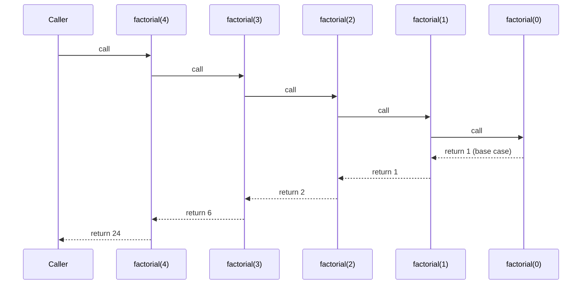
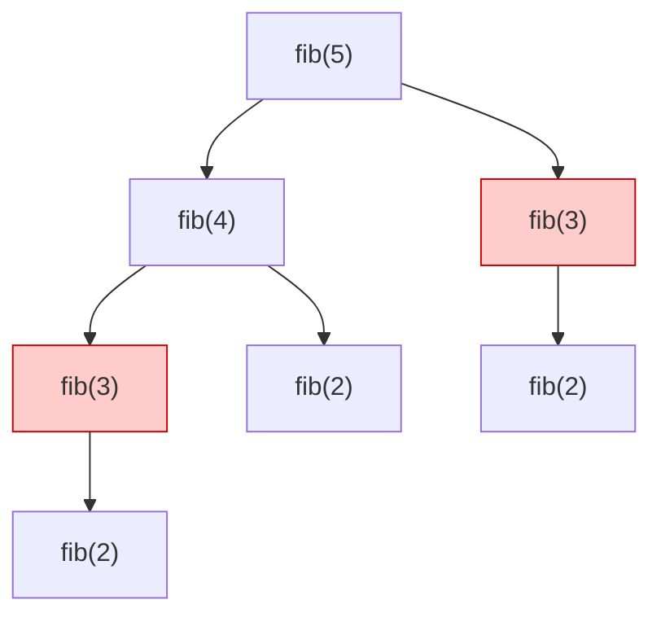

⚡ TL;DR - Recursion is a function calling itself to solve
a smaller version of the same problem. Java does not
optimize tail calls; deep recursion causes StackOverflowError.
For tree/graph traversal, recursion is natural. For deep
iteration, use an explicit stack.

| #029 | Category: CS Fundamentals - Paradigms | Difficulty: ★★☆ |
|:---|:---|:---|
| **Depends on:** | CSF-008 (Functions), CSF-010 (Stack and Heap) | |
| **Used by:** | CSF-057 (Tail Recursion), DSA-001, DSA-002 | |
| **Related:** | CSF-024 (Functional Programming), OSY-010 (Call Stack) | |

---

### 🔥 The Problem This Solves

**WORLD WITHOUT IT:**

Some problems are naturally self-similar: a tree node
contains subtrees; a directory contains subdirectories;
a factorial is `n * factorial(n-1)`. Solving these
problems iteratively requires simulating the self-similar
structure manually: maintain an explicit stack, push
children, pop and process, repeat. The code does not
match the structure of the problem. The algorithm is
correct but obscures the natural self-reference.

**THE BREAKING POINT:**

Without recursion, tree traversal code requires 30 lines
of explicit stack management for what is conceptually
"visit me, then visit my children." The intent is buried
in stack push/pop operations. When the tree structure
changes (new child types), the stack management code
must change in non-obvious ways. Recursion makes tree
algorithms read like their definition - not like their
execution.

**THE INVENTION MOMENT:**

Recursion as a programming concept derives from Peano's
axioms for natural numbers (1889): `0` is a number;
the successor of any number is a number. Factorial is
defined recursively: `0! = 1; n! = n * (n-1)!`. LISP
(1958) made recursion the PRIMARY iteration mechanism
(it had no explicit loop construct in early versions).
Since then, every algorithm for tree traversal, divide-
and-conquer (merge sort, quicksort), and grammar parsing
is expressed recursively because the DATA is recursive
(trees, lists, grammars are all self-referential structures).

---

### 📘 Textbook Definition

Recursion is a technique where a function calls itself
with a smaller or simpler version of its input, building
toward a base case that terminates the chain of calls.
Every correct recursive function has two components:
(1) Base case(s): one or more terminating conditions
that return a result without further recursion;
(2) Recursive case(s): one or more calls to the same
function with a strictly smaller or simpler input, ensuring
progress toward the base case.
Each recursive call is placed on the call stack as a new
stack frame containing its own local variables and return
address. In Java, the call stack has a fixed maximum size
(typically 512KB to 1MB per thread). Deep recursion
(thousands of frames) causes `java.lang.StackOverflowError`.
Java does NOT optimize tail recursion (unlike Scala/Kotlin
with `@tailrec`), meaning even perfectly-structured tail-
recursive functions are not converted to iteration
by the JVM.

---

### ⏱️ Understand It in 30 Seconds

**One line:**
Recursion = function that calls itself with a smaller
input + a base case that stops the chain.

**One analogy:**

> Russian nesting dolls (matryoshka). To open the smallest
> doll inside, you open the outer one and find a slightly
> smaller doll. You open that one and find another smaller
> one. You keep opening until you find the smallest doll
> (base case - no more to open). Then you reassemble them
> in reverse order. Each "open this doll" call is a
> recursive call. "The smallest doll is already open"
> is the base case.
>
> The stack grows going IN (opening), and the results are
> combined going OUT (reassembling). The depth of the
> stack equals the depth of nesting.

**One insight:**

The fear of recursion in Java comes from the risk of
`StackOverflowError`. The rule of thumb: use recursion
for structures with bounded depth (trees with depth < 10,000;
grammars; mathematical definitions). For unbounded depth
(a graph with millions of nodes, user-generated data
of unknown depth), convert to iteration with an explicit
`Deque<>` stack. The elegance of recursion and the safety
of iteration can coexist: write the recursive algorithm
for clarity, then convert to iterative if depth is unbounded.

---

### 🔩 First Principles Explanation

**THE CALL STACK MECHANICS:**

```
┌──────────────────────────────────────────────────────┐
│     Call Stack for factorial(4)                      │
├──────────────────────────────────────────────────────┤
│ Frame 4: factorial(0) = 1      <- base case returned │
│ Frame 3: factorial(1) = 1*1=1  <- uses frame 4 result│
│ Frame 2: factorial(2) = 2*1=2  <- uses frame 3 result│
│ Frame 1: factorial(3) = 3*2=6  <- uses frame 2 result│
│ Frame 0: factorial(4) = 4*6=24 <- initial call       │
│                                                      │
│ Stack grows DOWN (frames pushed) as recursion goes   │
│ deeper. Results propagate UP (frames popped) as      │
│ base case returns and each caller completes.         │
└──────────────────────────────────────────────────────┘
```



**THE TWO-PART CONTRACT:**

```java
// CORRECT structure - always TWO parts visible
int factorial(int n) {
    if (n == 0) return 1;        // BASE CASE: terminates
    return n * factorial(n - 1); // RECURSIVE CASE: smaller input
}
// Proof of correctness: each call reduces n by 1;
// when n = 0, the base case fires. Stack depth = n+1.
```

**THE TRADE-OFFS:**

**Gain:** Algorithms that match recursive data structures
(trees, grammars, divide-and-conquer) are concise and
self-documenting. A recursive tree traversal reads like
its definition; an iterative one reads like its execution.

**Cost:** Stack space is O(depth) - each frame uses
memory. Deep recursion = StackOverflowError.
Java JIT does not optimize tail calls (a fundamental
JVM design decision; tail-call optimization would require
the JVM to unwind and reuse stack frames, which breaks
Java debugging and stack inspection assumptions).
Recursion with overlapping subproblems (Fibonacci without
memoization) is exponentially slow without caching.

---

### 🧪 Thought Experiment

**SETUP:**

A file system directory can contain files and other directories.
Write `countFiles(directory)` that counts ALL files
in the entire tree, including in subdirectories.

```
// Natural recursive definition:
// countFiles(dir) = sum of (countFiles(each subdirectory))
//                + count of files directly in dir
```

```java
// Recursive implementation - matches the definition
long countFiles(File dir) {
    if (!dir.isDirectory()) return 0; // base case: not a dir
    long count = 0;
    for (File child : dir.listFiles()) {
        if (child.isFile()) {
            count++; // file found at this level
        } else {
            count += countFiles(child); // recurse into subdirectory
        }
    }
    return count;
}
```

**THE LESSON:**

The algorithm is almost identical to the definition.
The recursive call `countFiles(child)` trusts that the
function correctly counts files in any directory - including
the one being processed. The programmer does not need
to know HOW it counts; they only need to know WHAT it
does (count files in a directory). This is the power
of recursive trust: assume the function works, define
the recursive case in terms of it, handle the base case.

---

### 🎯 Mental Model / Analogy

**TRUST AND DELEGATE:**

To understand recursion, think: "Trust the function to
solve the smaller version. Your job is only to:
(1) handle the smallest case directly (base case), and
(2) define the current problem in terms of the smaller
problem (recursive case)."

For `factorial(n)`: you do not compute `factorial(n-1)`.
You TRUST that `factorial(n-1)` returns the right answer
(the function works for n-1) and multiply by n.

This is the "leap of faith" in recursion. The correctness
proof is mathematical induction: the base case is correct;
if it works for n-1, it works for n. Therefore it works
for all n.

**MEMORY HOOK:**

"Recursion = base case + smaller self-call.
Stack depth = recursion depth.
Java max: ~10,000 frames typical.
Deep = StackOverflow. Solution: explicit Deque stack."

---

### 📊 Gradual Depth - Five Levels

**Level 1 - Child:**
Recursion is when a function calls itself to solve a
smaller version of the same problem. Like a set of
Russian dolls: to find the smallest one, you open each
doll and ask the next smaller doll the same question,
until you find the smallest.

**Level 2 - Student:**
Every recursive function needs: (1) a base case (stops
the recursion), (2) a recursive case (calls itself with
a simpler input). Without a base case, you get infinite
recursion and `StackOverflowError`. Classic examples:
factorial, Fibonacci, binary search, tree traversal.

**Level 3 - Professional:**
In Java, each recursive call consumes a stack frame
(~100-500 bytes depending on local variables). Default
stack size is 512KB-1MB per thread. Maximum recursion
depth is approximately 1,000-10,000 depending on frame
size. For tree traversal in production: if tree depth
is bounded (e.g., organizational hierarchy, max depth 20),
recursion is safe. If depth is unbounded (user-generated
data), use iterative traversal with `ArrayDeque`.
Memoization (caching recursive results) converts
exponential recursion into polynomial: `Fibonacci(n)`
with memoization is O(n) instead of O(2^n).

**Level 4 - Senior Engineer:**
Java's lack of tail-call optimization is a fundamental
design choice (see JVM spec). Even `return recurseFn(n-1)`
(tail position) creates a new stack frame in Java.
Scala provides `@tailrec` annotation that triggers compile-
time tail-call conversion; Java has no equivalent.
For algorithms that are naturally tail-recursive (accumulators),
write them iteratively in Java. For algorithms that are
NOT naturally tail-recursive (tree traversal, DFS), use
an explicit `Deque<>` as the stack.
`java.util.concurrent.RecursiveTask<V>` (Fork/Join framework)
enables parallel recursive algorithms - each recursive
call is submitted as a ForkJoin task, parallelizing
across CPUs while avoiding JVM stack limits.

**Level 5 - Expert:**
The Trampoline pattern simulates tail-call optimization
in Java: instead of calling the recursive function directly,
return a lambda (the next call to make). The trampoline
loop calls the lambda, gets the next lambda, and repeats
until the result is returned. This converts the O(n) stack
into O(1) stack (the trampoline loop never grows the
stack). Used in functional Java libraries (Vavr's `Trampoline<T>`)
for deeply recursive algorithms. Continuation-Passing
Style (CPS) transforms non-tail-recursive functions into
tail-recursive form by making the continuation (the
"what to do with the result") an explicit function argument.
All recursive functions can be CPS-transformed into
tail-recursive form, enabling trampolining.

---

### ⚙️ How It Works (Formal Basis)

**STACK FRAME LAYOUT:**

Each recursive call creates a new stack frame containing:
- Return address (where to jump when the call returns)
- Method parameters (the current call's arguments)
- Local variables (declared inside the method)
- Reference to previous frame (for stack unwinding)

Stack frames are allocated and freed in LIFO order.
The total stack space used at any depth `d` is:
`d * (frame_size_bytes)`. `StackOverflowError` occurs
when the cumulative stack exceeds the thread's stack size.

**FIBONACCI WITHOUT MEMOIZATION:**

```
┌─────────────────────────────────────────────────────┐
│  fib(5) call tree (exponential, O(2^n))             │
├─────────────────────────────────────────────────────┤
│                fib(5)                               │
│              /        \                             │
│          fib(4)       fib(3)                        │
│          /    \       /    \                        │
│       fib(3) fib(2) fib(2) fib(1)                  │
│       ...                                           │
│ fib(3) is computed TWICE.                           │
│ fib(2) is computed THREE times.                     │
│ Overlapping subproblems -> exponential duplication  │
└─────────────────────────────────────────────────────┘
```



---

### 🔄 System Design Implications

**RECURSION IN ENTERPRISE SYSTEMS:**

JSON/XML document parsing, AST traversal in compilers,
directory scanning, permission hierarchy resolution, and
organizational chart traversal are all recursively structured
problems that appear in enterprise Java applications.

**WHAT CHANGES AT SCALE:**

At 10x depth: recursion depth of 10x is usually still
safe (if original was safe). Monitor with `Xss` JVM flag
adjustment if needed.

At 100x nodes: width (breadth) is fine for recursion;
DEPTH causes StackOverflow. A tree with 1M nodes but
depth of 20 is safe. A linked list of 1M nodes with
recursive traversal (`processNext(node.next)`) will overflow.

---

### 💻 Code Example

**Example 1 - Wrong vs Right: Missing Base Case**

```java
// BAD: Missing base case - infinite recursion
int factorial(int n) {
    return n * factorial(n - 1); // no base case!
    // factorial(0) -> factorial(-1) -> factorial(-2)...
    // StackOverflowError when stack exhausted
}

// GOOD: Explicit base case terminates recursion
int factorial(int n) {
    if (n < 0) throw new IllegalArgumentException(
        "factorial undefined for negative numbers"
    );
    if (n == 0) return 1;         // BASE CASE
    return n * factorial(n - 1);  // RECURSIVE CASE
}
```

**Example 2 - Fibonacci with and without Memoization**

```java
// BAD: Exponential recursion O(2^n) - unusable for n > 40
long fibonacci(int n) {
    if (n <= 1) return n;
    return fibonacci(n - 1) + fibonacci(n - 2); // O(2^n)
}

// GOOD: Memoized recursion O(n) time, O(n) space
long fibonacci(int n, Map<Integer, Long> memo) {
    if (n <= 1) return n;
    if (memo.containsKey(n)) return memo.get(n);
    long result = fibonacci(n-1, memo) + fibonacci(n-2, memo);
    memo.put(n, result);
    return result;
}
// Call: fibonacci(50, new HashMap<>())
// 50th fibonacci in microseconds vs minutes without memo.
```

**Example 3 - Converting Recursion to Iterative (Deep Tree)**

```java
// RECURSIVE: clean but StackOverflow for deep trees
void dfsRecursive(TreeNode node) {
    if (node == null) return;
    process(node);              // visit current
    dfsRecursive(node.left);   // recurse left
    dfsRecursive(node.right);  // recurse right
}

// ITERATIVE: safe for unbounded depth
void dfsIterative(TreeNode root) {
    if (root == null) return;
    Deque<TreeNode> stack = new ArrayDeque<>();
    stack.push(root);
    while (!stack.isEmpty()) {
        TreeNode node = stack.pop();
        process(node);           // visit current
        if (node.right != null) stack.push(node.right);
        if (node.left != null)  stack.push(node.left);
    }
}
// Uses heap memory (ArrayDeque) instead of stack memory.
// Can handle trees of any depth.
```

---

### ⚖️ Comparison Table

| Approach | When to Use | Stack Depth | Code Clarity | Memoize? |
|---|---|---|---|---|
| Direct recursion | Bounded depth (trees < 10K deep), natural recursive structure | O(depth) | High (matches problem structure) | When subproblems overlap |
| Memoized recursion (top-down DP) | Overlapping subproblems (Fibonacci, knapsack), bounded depth | O(depth) | Medium (plus cache lookup) | Yes (by definition) |
| Iterative + explicit stack | Unbounded depth, DFS/BFS on arbitrary graphs | O(1) extra | Low (stack management boilerplate) | No |
| `RecursiveTask` (Fork/Join) | Parallel divide-and-conquer (merge sort on large arrays) | Managed by pool | Medium | No |
| Trampoline (Vavr) | Deeply recursive but tail-recursive logic | O(1) | Low (trampoline overhead) | No |

---

### ⚠️ Common Misconceptions

| Misconception | Reality |
|---|---|
| Recursion is always slower than iteration | Recursion overhead (stack frame creation) is real but minor - nanoseconds per call. For tree traversal, the algorithmic structure is the same; the constant factor differs. The performance concern with recursion is stack SPACE (StackOverflow), not TIME speed. For algorithms with overlapping subproblems (Fibonacci), the issue is repeated computation, solved by memoization - not by switching to iteration. |
| Java optimizes tail-recursive calls | Java does NOT optimize tail calls. Every recursive call creates a new stack frame even if it is the last operation in the method. Scala's `@tailrec` converts tail-recursive methods to iteration at compile time. Java has no equivalent. For tail-recursive algorithms in Java: write them iteratively, or use Vavr's `Trampoline`. |
| Recursion always goes "deeper" per call | Some recursive algorithms have multiple recursive calls at the SAME level (divide-and-conquer). Merge sort divides the array into two halves and recurses on each - both halves are recursed in the SAME stack depth range. The stack depth is `O(log n)` (recursion depth) not `O(n)` (total calls). |
| Mutual recursion is rare and impractical | Mutual recursion (function A calls function B; function B calls function A) appears in recursive-descent parsers, formal grammars, and even-odd number classification. It is valid and often the clearest way to express mutually dependent computations. |

---

### 🚨 Failure Modes & Diagnosis

**Failure Mode 1: StackOverflowError on Large Input**

**Symptom:** `java.lang.StackOverflowError` thrown deep
inside a recursive method, often with thousands of identical
stack frames in the trace.

**Root Cause:** Recursion depth exceeded JVM stack limit.
Common causes: infinite recursion (no base case or base
case never reached), deep data structure (1M-node list
processed recursively), or unexpectedly deep input tree.

```java
// Diagnosis: check the stack trace count
// StackOverflowError trace has N identical frames where
// N = stack depth at overflow. If N = 500, the JVM
// exhausted the stack at 500 frames.

// Mitigation options:
// 1. Increase stack size (JVM flag) - not always possible
//    java -Xss4m MyApp

// 2. Convert to iterative with Deque - recommended
Deque<Node> stack = new ArrayDeque<>();
// (see Code Example 3 above)

// 3. Use RecursiveTask for parallelism:
class CountTask extends RecursiveTask<Long> {
    protected Long compute() {
        if (simple) return directCompute();
        CountTask left = new CountTask(leftData);
        left.fork();
        return new CountTask(rightData).compute()
            + left.join();
    }
}
```

---

**Security Note:**

Recursive processing of user-supplied data (JSON, XML,
directory paths) is a potential denial-of-service vector.
A deeply nested JSON payload (10,000 levels of nesting)
can cause `StackOverflowError` on a server thread, potentially
crashing the thread or the application. Defense: always
limit recursion depth for user-controlled input. Use
a depth counter parameter and throw an exception when
the maximum depth is exceeded:
`if (depth > MAX_DEPTH) throw new InputTooDeepException()`.
This is analogous to how Java JSON parsers (Jackson,
Gson) have configurable max nesting depth limits.

---

### 🔗 Related Keywords

**Prerequisites (understand these first):**
- `Functions and Procedures` (CSF-008) - recursion is
  a function calling itself; understanding function
  call semantics is prerequisite
- `Stack and Heap` (CSF-010) - each recursive call is
  a new stack frame; understanding call stack growth
  is essential for understanding stack overflow risks

**Builds On This (learn these next):**
- `Tail Recursion` (CSF-057) - the specific form of
  recursion where the recursive call is the last operation;
  the form that CAN be optimized (in other languages)
- `DSA-001` (Arrays) and `DSA-002` (Linked Lists) -
  recursive algorithms on fundamental data structures

**Alternatives / Comparisons:**
- `Functional Programming` (CSF-024) - FP makes recursion
  the primary iteration mechanism; Java uses recursion
  selectively alongside traditional iteration

---

### 📌 Quick Reference Card

```
┌────────────────────────────────────────────────────────┐
│ STRUCTURE    │ Base case: return result directly       │
│              │ Recursive case: call self, smaller input│
├──────────────┼─────────────────────────────────────────┤
│ STACK DEPTH  │ O(recursion depth) stack frames         │
│              │ Java default: ~512KB-1MB per thread     │
│              │ Typical max: ~1,000-10,000 deep         │
├──────────────┼─────────────────────────────────────────┤
│ JAVA LIMITS  │ NO tail-call optimization in JVM        │
│              │ StackOverflowError = too deep           │
│              │ Fix: convert to iterative + Deque       │
├──────────────┼─────────────────────────────────────────┤
│ MEMOIZATION  │ Cache results to avoid recomputation    │
│              │ Map<Input, Result> memo = new HashMap() │
│              │ Converts O(2^n) fib to O(n)            │
├──────────────┼─────────────────────────────────────────┤
│ WHEN TO USE  │ Bounded depth, natural self-similar     │
│              │ structure (trees, grammars, D&C)        │
├──────────────┼─────────────────────────────────────────┤
│ WHEN TO AVOID│ Unbounded depth (user data, huge graphs)│
│              │ Tail-recursive patterns (use loop)      │
├──────────────┼─────────────────────────────────────────┤
│ ONE-LINER    │ "Recursion = function calls itself with │
│              │ a smaller input + base case. Stack grows│
│              │ with depth. Java has no tail-call opt." │
├──────────────┼─────────────────────────────────────────┤
│ NEXT EXPLORE │ CSF-057 (Tail Recursion), DSA-001, DSA-002│
└────────────────────────────────────────────────────────┘
```

**If you remember only 3 things:**

1. Recursion requires two parts: a base case (terminates
   the chain) and a recursive case (smaller input). No
   base case = StackOverflowError.
2. Java does NOT optimize tail calls. Every recursive call
   creates a new stack frame. For deep recursion (>10K),
   convert to iterative with `ArrayDeque` as an explicit stack.
3. Memoization converts exponential recursion (Fibonacci
   without cache) to linear time. Cache the result of
   each unique subproblem in a `Map<Input, Result>`.

**Interview one-liner:**
"Recursion is a function calling itself with a strictly
smaller input, terminating at a base case. Each call
uses a stack frame; Java's default stack holds roughly
10,000 frames. Java has no tail-call optimization, so
deeply recursive code should use an explicit Deque.
Memoization eliminates redundant computation for algorithms
with overlapping subproblems."

---

### 💎 Transferable Wisdom

**Reusable Engineering Principle:**
The recursive pattern - "solve the current problem in
terms of the same problem on smaller input" - is a template
for algorithmic thinking. When you see a problem involving:
(1) a hierarchy (organizations, trees, file systems),
(2) divide-and-conquer (sort this half, sort that half),
(3) a grammar (parse this expression, where sub-expressions
are expressions), or (4) a mathematical induction pattern
(true for n if true for n-1) - your first instinct should
be "this is recursive." The recursive formulation is
usually the clearest; if it runs into depth limits,
you can convert it to iterative as a second step.

**Where else this pattern appears:**

- **JSON deserialization** - a JSON object contains
  fields whose values may themselves be JSON objects.
  A JSON parser is inherently recursive: `parseValue()` calls
  `parseObject()`, which calls `parseValue()` for each field.
  Every JSON library uses recursion internally (with
  depth limits for security).
- **Maven dependency resolution** - a Maven dependency
  has its own `pom.xml` which declares its own dependencies.
  Resolving the full dependency tree is recursive: resolve
  this artifact's dependencies; for each dependency, recursively
  resolve its dependencies. The diamond problem (two
  dependencies both depend on different versions of a third)
  is a recursive dependency conflict.
- **React component rendering** - a React component
  renders child components which may render their own
  children. React's virtual DOM diffing is a recursive
  tree comparison: compare this node, then compare children
  of each matching node. The recursion depth is the
  component tree depth.

---

### 💡 The Surprising Truth

Recursion is so fundamental to computation that one of
the most important results in computer science is defined
recursively: the recursive definition of "computable."
The halting problem (Turing, 1936) - whether a given
program will terminate - is proven unsolvable using a
diagonal argument that is itself recursive. Godel's
incompleteness theorem (1931) uses self-referential
(recursive) sentences. The Y-combinator (Church, 1936)
is a fixed-point combinator that enables recursion in
lambda calculus, where functions cannot name themselves.
What appears to be a simple programming technique (a
function calling itself) is actually one of the defining
mathematical properties of computation itself. The fact
that practical programmers treat recursion as a "tricky
interview topic" rather than the bedrock of computation
is one of the great disconnects between CS theory and
engineering practice.

---

### ✅ Mastery Checklist

**You've mastered this when you can:**

1. **[WRITE]** Implement binary search recursively
   (base case: lo > hi or element found; recursive case:
   search left or right half). Prove that the recursion
   terminates by showing the search range strictly
   decreases with each call.

2. **[CONVERT]** Take the recursive DFS tree traversal
   and convert it to an iterative version using `ArrayDeque`.
   Verify that both produce identical traversal orders
   (pre-order: visit before children, or post-order:
   visit after children).

3. **[MEMOIZE]** Take the naive recursive Fibonacci
   (exponential time) and add memoization using a HashMap.
   Measure the time difference between `fib(45)` without
   and with memoization using `System.nanoTime()`.

4. **[DEPTH-LIMIT]** Write a recursive JSON depth counter
   that throws a `InputTooDeepException` at depth > 100.
   Test it with a JSON structure that is 101 levels deep.

5. **[DIAGNOSE]** Given a `StackOverflowError` in production
   with 2,000 identical stack frames, identify: (1) what
   the recursion is doing, (2) what data caused the depth
   of 2,000, (3) whether the base case is missing or
   unreachable, and (4) what the fix should be.

---

### 🧠 Think About This Before We Continue

**Q1.** A Java function computes the depth of a binary
tree: `max(depth(left), depth(right)) + 1`. For a
balanced binary tree with 1,000,000 nodes, the depth
is `log2(1,000,000) ≈ 20`. The recursion goes 20 levels
deep. For a completely unbalanced tree (a "degenerate
tree" that is just a linked list) with 1,000,000 nodes,
the recursion goes 1,000,000 levels deep. What happens?
What does this tell you about the relationship between
tree structure and recursion safety?

*Hint: Balanced tree: 20 levels deep = totally safe.
Degenerate tree (linked list): 1,000,000 levels =
StackOverflowError at ~10,000. The SHAPE of the data
determines recursion safety. Always consider "what is
the worst case depth of my input data?" before using
recursion. For data where degenerate cases are possible
(user-supplied tree data), use iterative traversal.*

**Q2.** The following recursive method computes the sum
of all integers 1..n: `int sum(int n) { if (n == 1) return 1;
return n + sum(n - 1); }`. This is NOT tail-recursive
because the recursive call `sum(n-1)` is used as an
argument to the `+` operation. How would you rewrite
it in tail-recursive form? Would this help in Java?

*Hint: Tail-recursive form uses an accumulator:
`int sum(int n, int acc) { if (n == 0) return acc;
return sum(n - 1, acc + n); }`. The recursive call is
now in tail position (the last operation is the call itself,
no arithmetic on the return value). BUT: Java does NOT
optimize tail calls. This produces identical stack
behavior in Java. The benefit: in Scala with `@tailrec`,
this would compile to a loop. In Java: write it as a loop.*

---

### 🎯 Interview Deep-Dive

**Q1: "Write a recursive method to calculate factorial.
What is the maximum input for which this is safe in Java?"**

*Why they ask:* Classic warm-up, but the second part
tests practical awareness of stack limits - not just syntax.

*Strong answer includes:*
- Implementation with clear base case (`n == 0` returns 1,
  `n < 0` throws `IllegalArgumentException`) and recursive case.
- Maximum safe input: depends on JVM stack size.
  With default stack (~512KB), each stack frame for `factorial`
  is small (~40-80 bytes), giving depth of ~5,000-10,000.
  `factorial(12765)` would overflow; in practice, `factorial(20)`
  is the largest that fits in `long` (returns value > `Long.MAX_VALUE`
  for n>20), so stack overflow is not the practical limit
  here - arithmetic overflow is.
- Better implementation for factorial: iterative or
  BigDecimal-based for large n.

**Q2: "How would you implement Fibonacci efficiently?
What's wrong with the naive recursive approach?"**

*Why they ask:* Tests understanding of overlapping subproblems
and memoization/dynamic programming.

*Strong answer includes:*
- Naive: `fib(n) = fib(n-1) + fib(n-2)` is O(2^n).
  For `fib(50)`, this requires ~10^15 calls - takes years.
  The problem: each subproblem is recomputed exponentially
  many times.
- Fix 1: Memoization (top-down DP). `Map<Integer, Long> memo`.
  Check cache before computing; store result after computing.
  O(n) time, O(n) space.
- Fix 2: Iterative (bottom-up DP). Two variables, update
  in a loop. O(n) time, O(1) space. No recursion, no stack risk.
- Fix 3: Matrix exponentiation. O(log n) time. For competitive
  programming scenarios.
- Interview signal: recognizing "overlapping subproblems"
  as the indicator for memoization/DP is the key insight.

**Q3: "When would you choose recursion over iteration
in production Java code?"**

*Why they ask:* Tests practical judgment. Many developers
default to recursion in interviews but do not know when
it is actually appropriate in production.

*Strong answer includes:*
- Choose recursion when: (1) the data structure is
  inherently recursive (tree, graph, grammar), (2) recursion
  depth is bounded and well below the stack limit (e.g.,
  organizational hierarchy with max depth 15), (3) the
  recursive formulation is significantly clearer and the
  performance difference is negligible.
- Choose iteration when: (1) depth is unbounded or
  user-controlled, (2) the algorithm is tail-recursive
  (a loop is equivalent and avoids stack frames), (3)
  performance profiling shows recursion overhead is significant.
- Java-specific: prefer iterative DFS/BFS with `ArrayDeque`
  for production graph/tree traversal when depth is not
  provably bounded. Prefer `RecursiveTask` (Fork/Join)
  for parallel divide-and-conquer on large arrays.
- The answer that impresses: "I start with the recursive
  formulation because it matches the problem structure.
  If the input depth can be unbounded, I convert to iterative.
  I always add a depth-limit check when processing user-supplied
  recursive data to prevent denial-of-service via stack overflow."

> Entry stub. Generate full content using Master Prompt v4.0.
