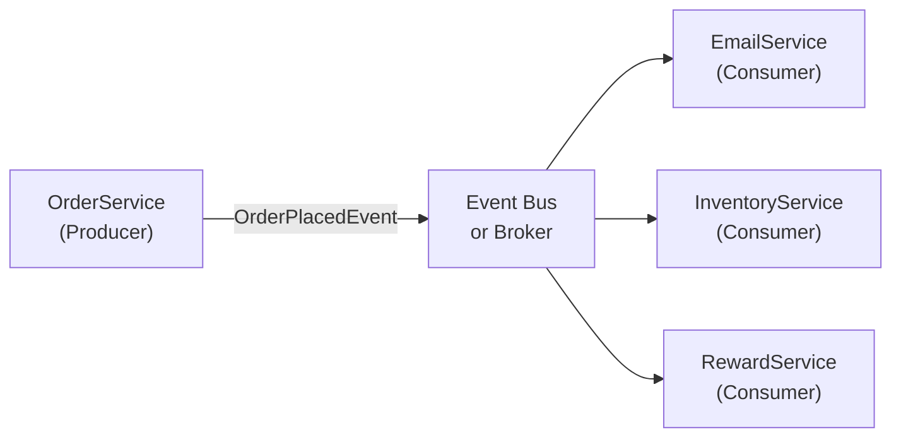

⚡ TL;DR - Event-driven programming structures flow around
events: producers emit events; consumers react without
direct coupling. Enables decoupled, async, scalable systems.
In Java: Spring Events, Kafka, CompletableFuture, listeners.

| #031 | Category: CS Fundamentals - Paradigms | Difficulty: ★★☆ |
|:---|:---|:---|
| **Depends on:** | CSF-012 (Declarative Programming), CSF-025 (First-Class Functions) | |
| **Used by:** | CSF-032 (Reactive Programming), MSG-001 (Messaging) | |
| **Related:** | CSF-028 (Side Effects), MSV-005 (Event Sourcing) | |

---

### 🔥 The Problem This Solves

**WORLD WITHOUT IT:**

In direct-call (imperative) systems, when `OrderService.
placeOrder()` completes, it must directly call every system
that needs to know: `InventoryService.reserve()`, `EmailService.
sendConfirmation()`, `RewardService.awardPoints()`. This
is tight coupling: `OrderService` must know about and
depend on every downstream system. Adding a new downstream
consumer (e.g., `FraudDetectionService`) requires modifying
`OrderService`. The list of callers grows indefinitely.

**THE BREAKING POINT:**

At 10 downstream systems, `OrderService.placeOrder()` has
10 direct dependencies. Any one of them failing or being slow
makes order placement fail or slow. They all run synchronously:
the customer waits for all 10 systems before getting a response.
Any temporary outage in `EmailService` breaks order placement.
These systems are now physically and temporally coupled.

**THE INVENTION MOMENT:**

The Observer pattern (GoF, 1994) formalized event-driven
behavior in OOP: a subject notifies registered observers
when state changes. Message queues (IBM MQ, 1993) decoupled
producers from consumers at the infrastructure level.
The key insight: instead of `A calls B`, make `A emits event`;
`B subscribes to event`. `A` does not know `B` exists.
`B` does not need `A` to be available when it processes
the event. This temporal and spatial decoupling is the
foundation of scalable distributed systems.

---

### 📘 Textbook Definition

Event-driven programming (EDP) is a paradigm where program
flow is determined by events: user actions, messages from
other programs, sensor outputs, or messages from message brokers.
The key components: (1) Event: a record of something that
happened (`OrderPlaced`, `ButtonClicked`, `PaymentReceived`);
(2) Event Producer: the component that creates and publishes
events; (3) Event Consumer / Handler: a function or object
that reacts to specific events; (4) Event Bus / Channel:
the mechanism by which events move from producers to consumers
(can be in-process - `ApplicationEvent` in Spring - or
external - Kafka, RabbitMQ, AWS SQS). The consumer is
decoupled from the producer: the producer does not call
the consumer directly; it emits an event and returns.
Consumers register their interest and are notified when
matching events arrive.

---

### ⏱️ Understand It in 30 Seconds

**One line:**
Event-driven programming replaces direct method calls with
"something happened" notifications, decoupling who emits
from who reacts.

**One analogy:**

> A fire alarm system is event-driven. The smoke detector
> (producer) does not call the fire department, the sprinklers,
> and the evacuation PA system directly. It emits an alarm
> signal (event). The fire department, the sprinklers,
> and the PA system are all registered listeners - they
> react to the alarm independently. Adding a new reaction
> (e.g., automatically unlock all doors) requires adding
> a new listener, not modifying the smoke detector.
>
> The smoke detector does not wait for the fire department
> to respond before alerting the PA system. Each consumer
> reacts independently and asynchronously.

**One insight:**

Event-driven programming's power is in what it REMOVES:
the producer does not need to know consumers exist. Adding
a new consumer requires zero changes to the producer.
Removing a consumer requires zero changes to the producer.
Failing consumers do not affect the producer's ability
to continue emitting. This is the Open/Closed Principle
applied at the system level.

---

### 🔩 First Principles Explanation

**THE THREE PATTERNS:**

```
┌──────────────────────────────────────────────────────┐
│   1. OBSERVER (In-Process)                           │
│   Subject -> notifies -> Observer list               │
│   Synchronous; observers execute in same thread      │
│   Java: Spring ApplicationEvent, Guava EventBus     │
│                                                      │
│   2. PUBLISH-SUBSCRIBE (Message Broker)              │
│   Producer -> Broker -> Consumer(s)                  │
│   Asynchronous; broker persists, routes, delivers    │
│   Java: Kafka, RabbitMQ, AWS SNS/SQS                 │
│                                                      │
│   3. EVENT SOURCING (State from Events)              │
│   Command -> Event Log -> State via reduce           │
│   All state changes are events; state is derived     │
│   Java: Axon Framework, custom event stores          │
└──────────────────────────────────────────────────────┘
```



**THE TRADE-OFFS:**

**Gain:** Decoupling (producer knows nothing about consumers).
Scalability (consumers can run independently, in parallel).
Extensibility (add new consumers without modifying producers).
Resilience (a failed consumer does not crash the producer).

**Cost:** Observability (harder to trace a flow across
events than across direct calls). Eventual consistency
(producers do not wait for consumer confirmation unless
you add request-reply patterns). Dead Letter Queues needed
(events must not be lost when consumers fail). Debugging
is harder (no direct call stack; events may be processed
in different threads, processes, or time).

---

### 🧪 Thought Experiment

**SETUP:**

An e-commerce order service must: reserve inventory,
send confirmation email, award loyalty points, notify
the warehouse, and trigger fraud detection. Direct-call:
`OrderService` calls all 5. Event-driven: `OrderService`
emits `OrderPlacedEvent`; each service listens independently.

What if fraud detection goes down for 30 minutes?
- Direct-call: order placement fails for 30 minutes.
- Event-driven: orders continue; fraud detection replays
  events from the queue when it comes back online.

What if a new regulatory requirement arrives (send a
tax report to the government system)?
- Direct-call: modify `OrderService`, add a 6th call, redeploy.
- Event-driven: add a new `TaxReportService` subscriber,
  deploy it independently. `OrderService` is never touched.

**THE LESSON:**

Event-driven systems decouple responsibility for what to
do from the trigger that initiates it. New requirements
extend the system at the consumer side; the producer is
never changed. Downtime is isolated to individual consumers;
the producer continues to emit events for replay.

---

### 🎯 Mental Model / Analogy

**THE RADIO STATION ANALOGY:**

A radio station (producer) broadcasts (publishes events)
continuously. Listeners (consumers) tune in to the frequency
they care about. The station does not know how many
listeners there are. Adding a listener requires no change
at the station. Removing a listener has no effect on the
station. If a listener's radio breaks (consumer failure),
the station keeps broadcasting. The listener can tune back
in when the radio is fixed (replay from where they left off,
if the broker supports persistence - like Kafka).

**MEMORY HOOK:**

"EDP = something happened (event) + who cares (listener).
Producer emits; consumer reacts. Neither knows the other
directly. Decoupling at the price of observability."

---

### 📊 Gradual Depth - Five Levels

**Level 1 - Child:**
Event-driven programming means: when something happens
(an event), things that care about it react. Like a doorbell:
you press it (event), everyone inside who hears it reacts
(listener). You do not know or care who is inside.

**Level 2 - Student:**
Instead of `A` calling `B` directly, `A` publishes an
event and any registered handlers react. Java examples:
button click listeners in Swing/JavaFX, Spring's
`@EventListener`, JavaScript DOM event handlers. The
publisher and listener are decoupled.

**Level 3 - Professional:**
Spring's `ApplicationEvent` system: publish with `applicationEventPublisher.
publishEvent(new OrderPlacedEvent(orderId))`. Listen with
`@EventListener`. By default synchronous (same thread).
Use `@Async` to make listeners asynchronous. For distributed
events: Kafka topics. Producer writes `OrderPlaced` event
to a topic; consumers (any number, any service) consume
and process independently. Kafka maintains the event log -
consumers can replay from any offset.

**Level 4 - Senior Engineer:**
Transactional outbox pattern: if `OrderService.placeOrder()`
saves to DB AND publishes a Kafka event, these must be
atomic. If the DB commit succeeds but Kafka publish fails,
the event is lost. The outbox pattern: write the event
to an `outbox` table in the SAME DB transaction as the
domain change. A separate process (CDC - Change Data
Capture, e.g., Debezium) reads committed outbox records
and publishes to Kafka. Guaranteed: event is published
exactly when the DB change is committed. This solves the
"dual write" distributed consistency problem inherent
to any system that combines a database and a message broker.

**Level 5 - Expert:**
At-least-once vs exactly-once semantics in event systems.
Kafka guarantees at-least-once delivery by default (a consumer
can receive the same event multiple times on restart).
Consumers MUST be idempotent (processing the same event
twice produces the same outcome as processing it once).
Kafka Transactions (Kafka 0.11+) enable exactly-once
semantics: a producer can atomically write to multiple
topic partitions within a transaction. This enables "read-
process-write" exactly-once pipelines (consume an event,
transform, publish to another topic) without deduplication
at the consumer. The trade-off: exactly-once is 2-10x
slower than at-least-once due to transaction coordination.

---

### ⚙️ How It Works (Formal Basis)

**EVENT LOOP (Single-Threaded EDP):**

Node.js and event-loop-based runtimes run one piece of
code at a time. When an event fires, its handler is queued.
The event loop picks up the next queued handler when
the current handler finishes. This is cooperative concurrency:
handlers must never block (no synchronous I/O). Java
has a similar model with `CompletableFuture` pipelines:
each `thenApply` runs when the previous stage completes,
potentially on different threads from the ForkJoin pool.

**SPRING EVENT FLOW:**

```
┌─────────────────────────────────────────────────────┐
│ 1. OrderService publishes event:                    │
│    publisher.publishEvent(new OrderPlacedEvent(id));│
│                                                     │
│ 2. Spring ApplicationContext finds all beans with   │
│    @EventListener for OrderPlacedEvent type         │
│                                                     │
│ 3. Each @EventListener method is invoked            │
│    (synchronous by default, in same thread)         │
│                                                     │
│ 4. @Async @EventListener: executor submits to pool  │
│    (different thread; publisher returns immediately)│
└─────────────────────────────────────────────────────┘
```

---

### 🔄 System Design Implications

**OUTBOX PATTERN (CRITICAL FOR PRODUCTION):**

Never do "write to DB" + "publish to Kafka" as two separate
operations. If the service crashes between them, one succeeds
and the other doesn't - inconsistency. The outbox pattern
solves this:

```
┌─────────────────────────────────────────────────────┐
│ Application DB Transaction:                         │
│  INSERT INTO orders ...                             │
│  INSERT INTO outbox (event_type, payload, created)  │
│     VALUES ('OrderPlaced', '{...}', NOW())          │
│  COMMIT; <- atomic                                  │
│                                                     │
│ Separate outbox publisher (Debezium CDC or poll):   │
│  reads committed outbox rows -> publishes to Kafka  │
│  marks rows as published                            │
│                                                     │
│ Guarantee: event is published iff DB change committed│
└─────────────────────────────────────────────────────┘
```

---

### 💻 Code Example

**Example 1 - Wrong vs Right: Direct Call vs Event**

```java
// BAD: Direct coupling - OrderService knows too much
@Service
class OrderService {
    @Autowired InventoryService inventory;
    @Autowired EmailService email;
    @Autowired RewardService rewards;
    @Autowired FraudService fraud;

    void placeOrder(Order order) {
        save(order);
        inventory.reserve(order);    // direct call
        email.sendConfirmation(order); // direct call
        rewards.awardPoints(order);   // direct call
        fraud.check(order);          // direct call
        // Adding new: must modify this class
    }
}

// GOOD: Event-driven - OrderService only emits
@Service
class OrderService {
    @Autowired ApplicationEventPublisher publisher;

    @Transactional
    void placeOrder(Order order) {
        save(order);
        publisher.publishEvent(new OrderPlacedEvent(order.getId()));
        // Done. No knowledge of who handles this.
    }
}

// Consumers registered independently - no OrderService change needed:
@Component
class InventoryListener {
    @EventListener
    @Async // runs in separate thread
    void onOrderPlaced(OrderPlacedEvent event) {
        inventoryService.reserve(event.orderId());
    }
}
// Adding FraudDetectionListener: zero changes to OrderService.
```

**Failure Example: Missing Idempotency in Consumer**

```java
// BAD: Consumer is not idempotent - duplicate events cause double charge
@KafkaListener(topics = "order-placed")
void onOrderPlaced(OrderPlacedEvent event) {
    paymentService.charge(event.customerId(), event.amount());
    // If Kafka redelivers (consumer restart), customer is charged twice!
}

// GOOD: Idempotent consumer using event ID as deduplication key
@KafkaListener(topics = "order-placed")
void onOrderPlaced(OrderPlacedEvent event) {
    if (processedEvents.contains(event.eventId())) {
        log.info("Duplicate event {}, skipping", event.eventId());
        return;
    }
    paymentService.charge(event.customerId(), event.amount());
    processedEvents.add(event.eventId()); // idempotency store
}
```

---

### ⚖️ Comparison Table

| Pattern | Synchronous? | Persistence? | Producer Knows Consumer? | Failure Isolation |
|---|---|---|---|---|
| Direct method call | Yes | No | Yes (compile-time dep) | No |
| Spring `@EventListener` | Yes (default) | No | No (via event type) | No |
| Spring `@Async @EventListener` | No | No (in-memory) | No | Partial |
| Kafka pub-sub | No | Yes (log) | No | Yes (consumer-side) |
| RabbitMQ work queue | No | Configurable | No | Yes (DLQ) |
| HTTP webhook | No | No | Partially (URL configured) | No |

---

### ⚠️ Common Misconceptions

| Misconception | Reality |
|---|---|
| Event-driven means asynchronous | Events can be processed synchronously. Spring's `@EventListener` is synchronous by default (same thread, same transaction as the publisher). Async processing requires `@Async` + an `Executor`. Whether events are sync or async is a deployment choice, not a definition. |
| Kafka guarantees exactly-once delivery by default | Kafka guarantees at-least-once by default. Exactly-once requires: idempotent producer + Kafka Transactions (on the consumer side). Consumers MUST be designed for idempotency unless exactly-once transactions are configured. |
| Using events always makes the system more reliable | Events over a message broker add failure modes: broker unavailability, consumer lag, message loss (if broker is not durable), ordering issues (out-of-order delivery). In-process events (`@EventListener`) are MORE reliable than cross-process events but provide no persistence. |
| Event-driven systems are always harder to debug | With proper distributed tracing (OpenTelemetry, Jaeger), event-driven systems can be easier to debug than direct calls: you can inspect the event log (Kafka topics), replay events, and see exactly what event triggered what action. The challenge is setting up the tracing infrastructure. |

---

### 🚨 Failure Modes & Diagnosis

**Failure Mode 1: Consumer Lag and Backpressure**

**Symptom:** Kafka consumer group lag is growing (thousands
or millions of messages behind). Events are being produced
faster than consumed. Consumer processing time is slow.

**Root Cause:** Consumer is a bottleneck. Each event takes
too long to process (DB write, HTTP call), and the consumer
processes events sequentially.

**Diagnosis:**
```bash
# Check consumer group lag (Kafka)
kafka-consumer-groups.sh --bootstrap-server localhost:9092 \
  --group order-processor --describe
# Look for: LAG column - high values = consumer is behind

# Check partition assignment - if all partitions on one consumer,
# add more consumers (up to the number of partitions)
```

**Fix:** Scale consumers horizontally (add consumer instances
up to partition count). Increase partition count to allow
more parallel consumers. Make per-event processing faster
(batch DB writes, async HTTP calls).

---

**Security Note:**

Event-driven systems with external message brokers are
exposed to event injection attacks: a malicious actor
who can publish to a Kafka topic or SQS queue can inject
fake events that trigger business-logic actions (create
orders, award points, initiate payments). Defense: (1)
Authenticate event producers (TLS + SASL for Kafka);
(2) Validate event payloads (schema registry, Avro schema
validation) - reject events that do not match the expected
schema; (3) Apply authorization at the consumer level:
even if an event passes schema validation, verify the
event's claims against the actual database state before
acting on them. Never trust event content alone as
authorization proof.

---

### 🔗 Related Keywords

**Prerequisites (understand these first):**
- `Declarative Programming` (CSF-012) - event-driven
  systems declare what events to react to, not how
  to orchestrate the flow
- `First-Class Functions` (CSF-025) - event handlers
  ARE first-class functions; understanding functions
  as values is prerequisite

**Builds On This (learn these next):**
- `Reactive Programming` (CSF-032) - extends event-driven
  to continuous streams of events with backpressure control
- `Messaging and Event Streaming` (MSG-001) - the infrastructure
  layer for distributed event-driven systems

**Alternatives / Comparisons:**
- `Side Effects` (CSF-028) - side effects (I/O, state changes)
  are what events trigger; understanding side effects in
  the context of event handlers is important

---

### 📌 Quick Reference Card

```
┌────────────────────────────────────────────────────────┐
│ DEFINITION   │ Flow controlled by events: producer emits│
│              │ consumer reacts. No direct coupling.    │
├──────────────┼─────────────────────────────────────────┤
│ JAVA TOOLS   │ Spring @EventListener (in-process)      │
│              │ @Async for async listeners              │
│              │ Kafka / RabbitMQ for cross-service      │
├──────────────┼─────────────────────────────────────────┤
│ DECOUPLING   │ Producer: emits and forgets             │
│              │ Consumer: registers and reacts          │
│              │ New consumer = zero producer changes    │
├──────────────┼─────────────────────────────────────────┤
│ OUTBOX       │ DB write + event must be atomic         │
│              │ Write event to DB, publish separately   │
│              │ Debezium CDC = reliable event publishing│
├──────────────┼─────────────────────────────────────────┤
│ IDEMPOTENCY  │ Consumers MUST handle duplicate events  │
│              │ Use event ID for deduplication          │
│              │ Kafka at-least-once = duplicates happen │
├──────────────┼─────────────────────────────────────────┤
│ ONE-LINER    │ "EDP: emit event, consumers react.      │
│              │ Decoupled, scalable, resilient. Cost:   │
│              │ harder to trace, eventual consistency." │
├──────────────┼─────────────────────────────────────────┤
│ NEXT EXPLORE │ CSF-032 (Reactive), MSG-001 (Messaging) │
└────────────────────────────────────────────────────────┘
```

**If you remember only 3 things:**

1. Event-driven replaces direct calls with event emission.
   The producer does not know consumers; consumers register
   to react. Adding a consumer never changes the producer.
2. Use the transactional outbox pattern when combining DB
   writes and message broker publishes - writing both in
   the same transaction is the only way to guarantee consistency.
3. Kafka consumers must be idempotent. Kafka guarantees
   at-least-once delivery; the same event may arrive twice.
   Deduplicate using the event ID in a processed-events store.

**Interview one-liner:**
"Event-driven programming structures flow around events:
producers emit, consumers react without direct coupling.
Benefits: decoupling, scalability, resilience. In production
Java: Spring `@EventListener` for in-process, Kafka for
cross-service. Key patterns: transactional outbox for
reliable publishing, idempotent consumers for at-least-once
delivery safety."

---

### 💎 Transferable Wisdom

**Reusable Engineering Principle:**
Event-driven architecture is the application of the
Open/Closed Principle at the system level: systems should
be open for extension (new event consumers) without
modification (existing producers unchanged). Every direct
coupling between services is a violation of this principle
at the system level - it closes the system to extension.
Events open the system: new behavior is added by adding
new listeners, not by modifying existing code.

**Where else this pattern appears:**

- **React/Redux** - Redux's `dispatch(action)` is event-driven:
  components dispatch events (actions); reducers and middleware
  react to them. The component that dispatches the action
  does not know which reducers will handle it. Adding a
  new reducer is a zero-change to existing components.
- **DOM Events in the Browser** - `element.addEventListener(
  'click', handler)` is the Observer pattern. The browser
  fires click events; any registered handler reacts.
  Google Analytics, ad tracking, accessibility tools, and
  your own click handler all listen to the same event.
  None know about each other.
- **Microservices choreography** - instead of a central
  orchestrator calling services, services emit events and
  react to others' events. Order placement emits `OrderPlaced`;
  inventory service consumes it and emits `InventoryReserved`;
  payment service consumes that and emits `PaymentProcessed`.
  The flow emerges from reactions, not directives.

---

### 💡 The Surprising Truth

The Observer pattern was published in the GoF book (1994)
as a software design pattern. But the underlying idea
predates software: interrupt-driven hardware (1950s) works
the same way. When a device (keyboard, disk drive) needs
attention, it raises an interrupt signal - the CPU stops
its current task, executes the interrupt handler (event
consumer), then resumes. The CPU does not poll devices
continuously to see if they need attention (direct-call
model). It registers interrupt handlers and reacts.
What GoF documented as a "software pattern" in 1994 was
actually how hardware had been designed since the 1950s.
The concept is so fundamental that it independently emerged
in hardware design, GUI programming, distributed systems,
and functional reactive programming - each time solving
the same problem: how does a system react to unpredictable
events without knowing in advance what they are or when
they will arrive?

---

### ✅ Mastery Checklist

**You've mastered this when you can:**

1. **[REFACTOR]** Take a service that makes 5 direct calls
   after its primary operation and refactor it to emit
   a single domain event. Implement 3 of the 5 as async
   `@EventListener` handlers. Verify that the primary
   operation's response time drops to exclude consumer
   processing time.

2. **[IMPLEMENT]** Implement the transactional outbox
   pattern in Spring Boot + Kafka: save a domain record
   and an outbox record in one transaction; implement a
   scheduled job that reads unpublished outbox records
   and publishes them to Kafka; mark them as published.

3. **[MAKE IDEMPOTENT]** Take a non-idempotent Kafka
   consumer and make it idempotent: use the event's ID
   as a deduplication key, store processed IDs in Redis
   with a TTL, and skip re-processing if the ID is found.

4. **[DIAGNOSE]** Given a Kafka consumer group with LAG
   = 500,000, determine the root cause (slow consumer?
   too few partitions? slow downstream DB?) using
   `kafka-consumer-groups.sh` and explain the remediation
   for each root cause.

5. **[DESIGN]** Design an event-driven order processing
   system where: order placement emits `OrderPlaced`;
   inventory service reserves stock and emits `InventoryReserved`;
   payment service charges and emits `PaymentProcessed`.
   Describe what happens when payment fails: what event
   is emitted and how does inventory release its reservation?

---

### 🧠 Think About This Before We Continue

**Q1.** A microservice emits an `OrderPlaced` event to Kafka.
The inventory consumer receives it, reserves stock, and
emits `InventoryReserved`. The payment consumer then
charges the customer. But the `PaymentFailed` event is
emitted before `InventoryReserved` is consumed by the
payment consumer (they consumed events out of order due
to partition assignment). What has gone wrong? What
Kafka partition design would prevent this? What alternative
pattern eliminates the ordering problem entirely?

*Hint: Events on the SAME partition are ordered; events
across partitions are not. If `InventoryReserved` goes
to partition 3 and `PaymentProcessed` goes to partition 5,
they can be consumed in any order. Fix: use the same partition
key (orderId) for all events in the same workflow - all
events for the same order go to the same partition,
guaranteeing order. Alternative: Saga pattern with
orchestration (explicit state machine manages the workflow
instead of relying on event ordering).*

**Q2.** A Spring `@EventListener` is annotated with
`@TransactionalEventListener(phase = AFTER_COMMIT)`. What
does this mean? Why would you use `AFTER_COMMIT` instead
of the default? What happens to the listener if the
publishing transaction rolls back?

*Hint: `AFTER_COMMIT`: the listener fires only if the
publishing transaction committed successfully. This is
critical for sending emails or publishing to Kafka after
a DB write - you never want to send a confirmation email
for an order that was rolled back. Default behavior: the
listener fires during the transaction (before commit),
so a roll-back would undo the DB changes but the email
would already have been sent. With `AFTER_COMMIT`:
if the transaction rolls back, the listener never fires.
The email is never sent for a failed order. This is the
correct pattern for any external side effect that must
only happen if the transaction succeeds.*

---

### 🎯 Interview Deep-Dive

**Q1: "What is the difference between event-driven architecture
and request-response architecture? When would you choose
each?"**

*Why they ask:* Tests architectural thinking. Common in
senior/staff-level system design interviews.

*Strong answer includes:*
- Request-response: caller sends a request and WAITS for
  a response. Synchronous. The caller knows the result
  immediately. Examples: REST API calls, gRPC, JDBC queries.
  Use when: the caller needs the result to proceed (return
  the order ID to the client), when latency SLA requires
  immediate response, when consistency is required (the
  caller needs confirmation of success before continuing).
- Event-driven: producer emits an event and continues.
  Consumer reacts asynchronously. The producer may never
  know if the consumer succeeded. Use when: actions can
  happen after the primary operation completes (email
  after order saved), when consumers should be decoupled
  (adding consumers should not require producer changes),
  when resilience is required (consumer failures should
  not affect the producer).
- Hybrid: the primary operation (save the order) is request-
  response (return the order ID); side effects (email,
  inventory, rewards) are event-driven.

**Q2: "Explain the transactional outbox pattern and why
it's needed."**

*Why they ask:* Common production pattern. Directly tests
understanding of the "dual write" problem in distributed systems.

*Strong answer includes:*
- Problem: a service must write to a DB and publish to
  Kafka atomically. If done as two separate operations,
  the service can crash between them. If the DB write
  succeeds but Kafka publish fails: the DB has the record
  but the downstream consumers never know (silent data loss).
  If Kafka publish succeeds but the DB write fails: consumers
  act on an event for a record that doesn't exist in the DB.
- Outbox pattern: include an `outbox` table in the same
  DB as the domain tables. In a SINGLE transaction: write
  the domain record + write an `outbox` record. Commit.
  A separate process (Debezium CDC, or a scheduled polling
  job) reads committed outbox records and publishes them
  to Kafka. Marks them as published.
- Guarantee: the event is published if and only if the
  DB transaction committed. No split-brain between DB and Kafka.
- Trade-off: small latency increase (outbox polling or
  CDC has some lag). Additional infrastructure (Debezium or
  polling job). Worth it for any system where events must
  match DB state exactly.

**Q3: "What is consumer lag in Kafka, and how do you resolve it?"**

*Why they ask:* Tests Kafka operational knowledge. Consumer
lag is the most common production Kafka incident.

*Strong answer includes:*
- Consumer lag: the difference between the newest offset
  in a partition (end offset) and the consumer's current
  position (committed offset). LAG = end_offset - committed_offset.
  High lag means the consumer is behind producers; events
  accumulate in Kafka.
- Diagnosis: `kafka-consumer-groups.sh --describe --group mygroup`.
  Look for partitions with high LAG. Cross-reference with
  consumer metrics (processing time per message, GC pauses,
  downstream DB latency).
- Root causes and fixes: (1) Slow consumer: reduce per-message
  processing time (batch DB writes, async HTTP). (2) Too
  few partitions: increase partition count + consumer count
  (limited by number of partitions). (3) Consumer JVM GC
  pause: tune GC. (4) Downstream DB slow: connection pool
  tuning, read replicas. (5) Sudden spike in production:
  consumers will catch up naturally if production rate
  drops; otherwise, scale consumers.
- Long-term: Kafka consumer LAG alerts should be part of
  SLO monitoring. Alert at LAG > 10,000 for latency-sensitive
  topics; alert at LAG > 1M for batch topics.
