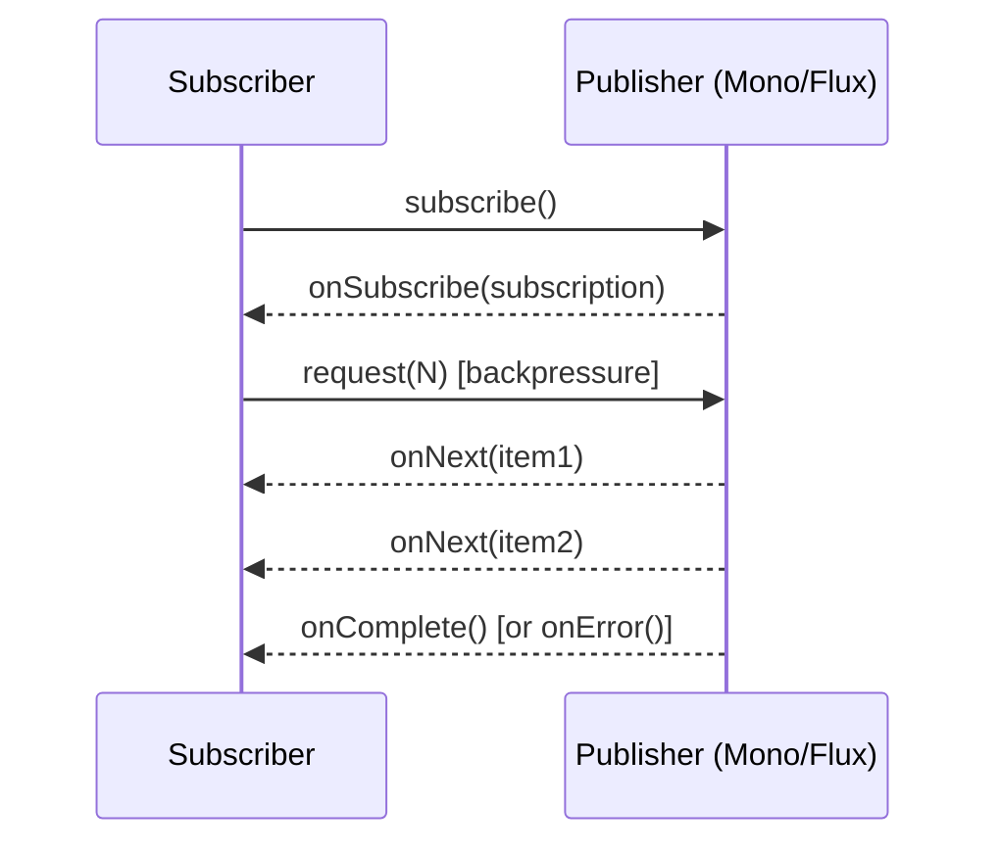

⚡ TL;DR - Reactive programming treats programs as pipelines
of asynchronous data streams with backpressure control.
In Java: Project Reactor (`Mono`/`Flux`), used by Spring
WebFlux. Enables non-blocking I/O on minimal threads.

| #032 | Category: CS Fundamentals - Paradigms | Difficulty: ★★★ |
|:---|:---|:---|
| **Depends on:** | CSF-031 (Event-Driven), CSF-026 (Higher-Order Functions), CSF-024 (FP) | |
| **Used by:** | MSG-005 (Reactor/Kafka), MSV-010 (WebFlux services) | |
| **Related:** | CSF-047 (Concurrency vs Parallelism), ASY-001, JCC-001 | |

---

### 🔥 The Problem This Solves

**WORLD WITHOUT IT:**

Traditional Java web servers (Tomcat, Spring MVC) use
one thread per request. Each thread blocks while waiting
for I/O: a thread waiting for a database query sits idle
but holds its stack memory (~1MB) and consumes a thread-
pool slot. A server handling 1000 concurrent requests
needs 1000 threads. Modern servers with 10,000+ concurrent
connections (long-polling, server-sent events, WebSockets)
exhaust thread pools. The CPU is mostly idle (waiting for
I/O), but the thread pool is full. This is the "C10K problem."

**THE BREAKING POINT:**

A microservice making three downstream HTTP calls sequentially
wastes 99% of its thread's time waiting. Even with connection
pooling, a high-traffic service creating 500 threads just
to wait is wasteful. When a request bursts and a slow
upstream service causes thread pool exhaustion, all new
requests are queued or rejected, even if the bottleneck
is not in the server itself.

**THE INVENTION MOMENT:**

The Reactive Streams specification (2013, signed by
Netflix, Lightbend, Pivotal, Twitter) defined a standard
for asynchronous stream processing with non-blocking
backpressure. Project Reactor (Pivotal, 2016) implemented
it for Java. The key insight: instead of "a thread executes
a request start to finish," do "a thread executes the
NEXT READY unit of work." One thread can interleave work
from thousands of requests, executing whichever has data
available, eliminating idle blocking.

---

### 📘 Textbook Definition

Reactive programming is an asynchronous programming paradigm
concerned with data streams and the propagation of change.
Programs are built as pipelines of operators applied to
data streams: each operator transforms, filters, or combines
streams without blocking a thread while waiting for data.
The Reactive Streams specification defines four interfaces:
`Publisher<T>` (source of data), `Subscriber<T>` (consumer
of data), `Subscription` (manages flow between them), and
`Processor<T,R>` (both publisher and subscriber).
Backpressure is the mechanism by which a subscriber signals
to a publisher how much data it can handle: a slow subscriber
prevents a fast publisher from overwhelming it.
Project Reactor implements this spec via `Mono<T>` (0 or 1
items asynchronously) and `Flux<T>` (0 to N items, potentially
unbounded). Spring WebFlux is a reactive web framework
built on Project Reactor and Netty (non-blocking I/O server).

---

### ⏱️ Understand It in 30 Seconds

**One line:**
Reactive programming is async pipelines where data flows
from publisher to subscriber without blocking threads,
and subscribers control the rate of flow (backpressure).

**One analogy:**

> Traditional thread-per-request: imagine a warehouse
> where each package (request) gets its own full-time worker.
> The worker picks up the package, waits for it to be loaded
> onto a truck (I/O wait), waits for the truck to come back
> (response), and then delivers it. 1000 packages = 1000
> idle workers waiting.
>
> Reactive: imagine a conveyor belt (event loop). Workers
> pick up work when something is READY to be done. When a
> package is waiting for the truck, the worker immediately
> picks up the next package that IS ready. 1000 packages,
> 4 workers, none waiting. Workers are always doing useful work.

**One insight:**

`Mono<User>` is not a `User`. It is a PROMISE of a `User`.
The computation has not happened yet. When you call `.map()`,
`.flatMap()`, `.filter()` on a `Mono`, you are building
a pipeline description. When someone `subscribe()`s (or
Spring WebFlux returns the `Mono` from a controller method),
the pipeline executes. Nothing runs until there is a subscriber.
This laziness is the same as Java Streams but applied
to async, non-blocking I/O.

---

### 🔩 First Principles Explanation

**MONO AND FLUX:**

```
┌──────────────────────────────────────────────────────┐
│  Mono<T>: 0 or 1 item (like Optional, but async)     │
│                                                      │
│  Mono.just("hello")      -> emits "hello", completes │
│  Mono.empty()            -> completes with no value  │
│  Mono.error(ex)          -> signals error            │
│  Mono<User> findUser(id) -> async DB lookup          │
│                                                      │
│  Flux<T>: 0..N items (like Stream, but async)        │
│                                                      │
│  Flux.just(1,2,3)        -> emits 1, 2, 3, completes│
│  Flux.fromIterable(list) -> wraps a list as Flux     │
│  Flux<Order> findAll()   -> async stream of orders   │
└──────────────────────────────────────────────────────┘
```



**BACKPRESSURE:**

Backpressure is what distinguishes reactive streams from
simple async callbacks. A subscriber says "give me N items"
(`request(N)`). The publisher produces AT MOST N items,
then waits for another request. If the subscriber is slow,
the publisher does not overflow it with data. This prevents
out-of-memory conditions when a fast publisher (Kafka topic)
feeds a slow consumer (DB writer).

**THE TRADE-OFFS:**

**Gain:** Non-blocking I/O on minimal threads. High throughput
for I/O-bound workloads. Backpressure prevents memory
overflow. Composable async pipelines.

**Cost:** Dramatically increased complexity. Stack traces
are confusing (operators stack, not code lines). Debugging
is hard (the pipeline is lazy; breakpoints do not work
as expected). `BlockingOperationError` if you accidentally
block in a reactive pipeline. Reactor requires a completely
different mental model - mixing reactive and blocking code
is a common, dangerous mistake.

---

### 🧪 Thought Experiment

**SETUP:**

A service fetches a user, then fetches their orders, then
sends a notification. Traditional vs reactive:

```java
// Traditional (blocking): 3 sequential I/O waits
User user = userRepo.findById(userId);        // blocks
List<Order> orders = orderRepo.findByUser(user); // blocks
emailService.send(user, orders);               // blocks
// Thread is blocked for the total duration of all 3 I/O ops.

// Reactive (non-blocking): pipeline, 0 thread blocking
Mono<Void> pipeline =
    userRepo.findById(userId)           // returns Mono<User>
        .flatMap(user ->
            orderRepo.findByUser(user)  // returns Flux<Order>
                .collectList()          // Flux<Order> -> Mono<List<Order>>
                .flatMap(orders ->
                    emailService.send(user, orders)))  // returns Mono<Void>
        .then();
// Nothing runs until subscribe() is called.
// When running: the thread is NOT blocked between I/O calls.
// The thread is returned to the pool during I/O waits.
```

**THE LESSON:**

The reactive pipeline uses the same sequence of operations
(fetch user, fetch orders, send email) but releases the
thread during each I/O wait. One thread can interleave
hundreds of these pipelines concurrently. The total
throughput scales without adding threads.

---

### 🎯 Mental Model / Analogy

**THE UNIX PIPE ANALOGY:**

`cat file | grep pattern | sort | uniq` is a reactive pipeline:
each program reads from its predecessor and writes to its
successor without loading everything into memory. `grep`
does not wait for `cat` to finish all output before starting
to filter. Data flows through the pipeline as it is produced.
`Flux.from(source).filter(predicate).map(transform).subscribe(sink)`
is the same pattern applied to async data streams. Each
operator processes items as they arrive, returning backpressure
signal if it cannot keep up.

**MEMORY HOOK:**

"Mono = async Optional. Flux = async Stream.
Nothing runs until subscribe(). flatMap = async chaining.
Backpressure = subscriber controls the rate.
NEVER block in a reactive pipeline."

---

### 📊 Gradual Depth - Five Levels

**Level 1 - Child:**
Reactive programming is like a conveyor belt in a factory:
items come in one end, get processed as they move along,
and come out the other end. Workers do not have to wait
for all items to arrive before starting to work on the first one.

**Level 2 - Student:**
`Mono<T>` and `Flux<T>` are lazy async containers.
`Mono.just(value).map(fn).subscribe(consumer)` is a pipeline:
nothing runs until `subscribe()`. `flatMap()` enables async
chaining (each item triggers an async operation that returns
another `Mono`/`Flux`).

**Level 3 - Professional:**
Spring WebFlux uses reactive pipelines to handle HTTP requests
without blocking threads. A controller returns `Mono<ResponseEntity>`
instead of `ResponseEntity`. WebFlux does not block a thread
waiting for the response - when the `Mono` completes,
a Netty event loop thread completes the HTTP response.
Operators: `map` (synchronous transform), `flatMap`
(async transform returning `Mono`/`Flux`), `filter`, `zipWith`
(combine two publishers), `mergeWith` (interleave), `error`
handling via `onErrorResume` / `onErrorReturn`.

**Level 4 - Senior Engineer:**
Threading in Project Reactor: by default, reactive pipelines
execute on the subscribing thread. `subscribeOn(Scheduler)`
changes which thread the pipeline starts on. `publishOn(Scheduler)`
changes which thread the DOWNSTREAM operators execute on.
`Schedulers.boundedElastic()` is for blocking operations
wrapped in reactive: `Mono.fromCallable(blockingCall).subscribeOn(
Schedulers.boundedElastic())`. `Schedulers.parallel()` is
for CPU-bound work. `Schedulers.single()` for serialized
single-threaded execution. The reactor thread model is
explicit and composable; misusing it causes starvation
(blocking on the event loop thread) or bottlenecks (all
work on a single-threaded scheduler).

**Level 5 - Expert:**
Reactor's context propagation: MDC logging context, Spring
Security context, and distributed tracing spans are stored
in `ThreadLocal`. Reactive pipelines run across different
threads; `ThreadLocal` is lost between thread boundaries.
Reactor's `Context` (immutable key-value store propagated
through the pipeline) replaces `ThreadLocal` for reactive
code. Spring Security 6.x + Reactor support propagating
security context via reactor `Context`. OpenTelemetry's
Reactor instrumentation propagates spans through reactive
pipelines. Missing context propagation causes "who triggered
this request?" to be lost in async log traces - one of
the most common reactive debugging problems in production.

---

### ⚙️ How It Works (Formal Basis)

**THE REACTIVE STREAMS PROTOCOL:**

```
┌─────────────────────────────────────────────────────┐
│  1. Subscriber calls Publisher.subscribe(this)      │
│  2. Publisher calls Subscriber.onSubscribe(sub)     │
│  3. Subscriber calls Subscription.request(N)        │
│     (backpressure: "give me N items")               │
│  4. Publisher calls Subscriber.onNext(item) <= N    │
│  5. Subscriber requests more or cancels             │
│  6. Publisher calls onComplete() or onError(ex)     │
└─────────────────────────────────────────────────────┘
```

**PROJECT REACTOR OPERATORS:**

```java
// map: synchronous transform (same thread)
Flux.just(1, 2, 3)
    .map(n -> n * 2)  // runs synchronously per element
    .subscribe(System.out::println); // 2, 4, 6

// flatMap: async transform (returns Publisher per item)
Flux.just("user1", "user2")
    .flatMap(id -> userRepo.findById(id)) // async; Mono<User> per id
    .subscribe(user -> process(user));    // results in any order

// zip: combine two publishers element-by-element
Mono<User> userMono = userRepo.findById(id);
Mono<Address> addrMono = addrRepo.findByUser(id);
Mono<UserProfile> profile =
    Mono.zip(userMono, addrMono,
        (u, a) -> new UserProfile(u, a)); // combines when BOTH arrive
```

---

### 🔄 System Design Implications

**WHEN TO USE REACTIVE:**

Use reactive when: (1) your service is I/O-bound with high
concurrency (100+ simultaneous connections), (2) you are
building streaming APIs (SSE, WebSockets), (3) you consume
from reactive sources (R2DBC, WebClient, reactive Kafka).

**WHEN NOT TO USE REACTIVE:**

Do NOT use reactive for: (1) CPU-bound computation
(reactive does not speed up computation; it only helps
for I/O-bound wait), (2) code with complex business logic
(imperative code is easier to reason about), (3) teams
unfamiliar with reactive patterns (debugging is hard;
production incidents are costly). Many teams adopt WebFlux
prematurely and spend 3x time on debugging that imperative
code would make trivial.

---

### 💻 Code Example

**Example 1 - Wrong vs Right: Blocking in Reactive Pipeline**

```java
// BAD: Blocking call inside reactive pipeline
// Blocks the event loop thread - causes starvation
@GetMapping("/users/{id}")
Mono<User> getUser(@PathVariable String id) {
    return Mono.fromCallable(() -> {
        // WRONG: blocking DB call on event loop thread
        User user = jdbcTemplate.queryForObject(
            "SELECT * FROM users WHERE id=?", User.class, id
        );
        return user;
    });
}

// GOOD: Use reactive driver (R2DBC) or offload to elastic pool
// Option 1: R2DBC (fully reactive DB driver)
@GetMapping("/users/{id}")
Mono<User> getUser(@PathVariable String id) {
    return r2dbcUserRepository.findById(id); // non-blocking!
}

// Option 2: Wrap blocking JDBC in boundedElastic scheduler
@GetMapping("/users/{id}")
Mono<User> getUser(@PathVariable String id) {
    return Mono.fromCallable(() ->
        jdbcTemplate.queryForObject(
            "SELECT * FROM users WHERE id=?", User.class, id
        )
    ).subscribeOn(Schedulers.boundedElastic()); // offload blocking
}
```

**Example 2 - Composing Reactive Pipeline**

```java
// Reactive order summary: fetch user + orders in parallel,
// combine, apply discount, return
Mono<OrderSummary> getOrderSummary(String userId) {
    Mono<User> userMono =
        userRepository.findById(userId); // async

    Mono<List<Order>> ordersMono =
        orderRepository.findByUserId(userId)  // Flux<Order>
            .collectList();                    // -> Mono<List<Order>>

    return Mono.zip(userMono, ordersMono)  // wait for both
        .map(tuple -> {
            User user = tuple.getT1();
            List<Order> orders = tuple.getT2();
            // pure computation on results:
            double total = orders.stream()
                .mapToDouble(Order::getAmount).sum();
            return new OrderSummary(user, orders, total);
        })
        .onErrorResume(ex ->
            Mono.error(new ServiceException("Failed to get summary", ex)));
}
```

---

### ⚖️ Comparison Table

| Aspect | Traditional (Spring MVC) | Reactive (Spring WebFlux) |
|---|---|---|
| Threading model | 1 thread per request (blocking) | Event-loop threads + schedulers (non-blocking) |
| I/O wait handling | Thread blocks (wastes thread) | Thread returns to pool; resumes on data ready |
| Concurrency capacity | Thread pool size (200-500 typical) | Far fewer threads; many concurrent pipelines |
| Code style | Imperative, synchronous | Functional, async, pipeline |
| Error handling | try-catch | `onErrorResume`, `onErrorReturn`, `doOnError` |
| Debugging | Stack traces are clear | Stack traces are confusing (Reactor operators) |
| Best for | CPU-bound, business logic, teams | I/O-bound, streaming, high concurrency |
| Ecosystem compatibility | All JDBC, Spring Data JPA | R2DBC, WebClient, reactive Kafka |

---

### ⚠️ Common Misconceptions

| Misconception | Reality |
|---|---|
| Reactive makes code faster | Reactive improves THROUGHPUT for I/O-bound workloads (more requests on fewer threads). It does NOT make individual request LATENCY faster. CPU-bound operations are not improved by reactive at all. |
| `flatMap` and `map` are the same | `map`: synchronous transform, returns a value. `flatMap`: asynchronous transform, returns a `Mono`/`Flux`. Use `map` for in-memory transformations; use `flatMap` for async operations (DB calls, HTTP calls). Using `map` with a function that returns `Mono<X>` gives `Mono<Mono<X>>` - nested, unusable. |
| You can mix blocking and reactive freely | Blocking inside a reactive pipeline (calling `Thread.sleep()`, `JdbcTemplate.query()`) blocks the event loop thread, causing starvation. This breaks the entire reactive contract. All I/O in a reactive pipeline must be non-blocking, or wrapped in `subscribeOn(Schedulers.boundedElastic())`. |
| Reactive eliminates the need for thread safety | Reactive pipelines share event loop threads across many concurrent pipelines. Shared mutable state (a `Map` updated by multiple concurrent pipelines) still requires synchronization or atomic operations. Reactive changes the threading model but does not eliminate concurrency hazards for shared mutable state. |

---

### 🚨 Failure Modes & Diagnosis

**Failure Mode 1: Blocking the Event Loop**

**Symptom:** All requests time out after a period of heavy
load. Reactor logs show: `Blocking call detected in non-blocking
stack`. Server CPU is low but requests are queued.

**Root Cause:** A blocking operation (JDBC, Thread.sleep,
I/O) was called directly on the event loop thread.
All other reactive pipelines waiting on the same thread
are starved.

**Diagnosis and Fix:**
```java
// Enable Reactor's blocking detection in development:
ReactorDebugAgent.init(); // Spring Boot: add reactor-tools dependency

// Or runtime check:
Hooks.onOperatorDebug(); // enables full stack trace in operators

// Fix: wrap blocking calls
Mono.fromCallable(() -> jdbcTemplate.query(...))
    .subscribeOn(Schedulers.boundedElastic())
```

---

**Security Note:**

Reactive applications using Spring Security must ensure
that the security context propagates through reactive
pipelines. In traditional Spring MVC, `SecurityContextHolder`
is `ThreadLocal`-based - it propagates automatically.
In WebFlux, security context propagates via Reactor's
`Context`. If custom reactive code does not propagate
the context correctly (e.g., spawning a new `Mono` without
the context), the security context is lost and authorization
checks may fail open (missing check = no rejection =
privilege escalation). Always use `ReactiveSecurityContextHolder.
getContext()` for security checks in reactive code;
never `SecurityContextHolder.getContext()`.

---

### 🔗 Related Keywords

**Prerequisites (understand these first):**
- `Event-Driven Programming` (CSF-031) - reactive is
  event-driven programming applied to data streams; EDP
  is the conceptual foundation
- `Higher-Order Functions` (CSF-026) - reactive operators
  (`map`, `flatMap`, `filter`) are HOFs applied to async streams
- `Functional Programming` (CSF-024) - reactive pipelines
  are functional pipelines over time

**Builds On This (learn these next):**
- `Concurrency vs Parallelism` (CSF-047) - reactive handles
  I/O-bound concurrency; understanding the distinction
  is essential for choosing the right tool
- `Async Background Processing` (ASY-001) - reactive as
  the async execution model for I/O operations

---

### 📌 Quick Reference Card

```
┌────────────────────────────────────────────────────────┐
│ DEFINITION   │ Async data stream pipelines with        │
│              │ backpressure; non-blocking I/O          │
├──────────────┼─────────────────────────────────────────┤
│ CORE TYPES   │ Mono<T>: 0 or 1 item (async Optional)  │
│              │ Flux<T>: 0..N items (async Stream)      │
├──────────────┼─────────────────────────────────────────┤
│ KEY OPS      │ map (sync), flatMap (async chaining),   │
│              │ filter, zip, mergeWith, collectList      │
├──────────────┼─────────────────────────────────────────┤
│ THREADING    │ subscribeOn: where pipeline starts      │
│              │ publishOn: where downstream operators run│
│              │ boundedElastic: for blocking I/O wrap   │
├──────────────┼─────────────────────────────────────────┤
│ ERROR        │ onErrorResume: fallback Mono/Flux        │
│              │ onErrorReturn: fallback value            │
│              │ doOnError: side effect (logging)         │
├──────────────┼─────────────────────────────────────────┤
│ GOLDEN RULE  │ NEVER block in a reactive pipeline      │
│              │ Wrap JDBC in subscribeOn(boundedElastic)│
├──────────────┼─────────────────────────────────────────┤
│ WHEN TO USE  │ High concurrency I/O-bound, streaming   │
│              │ Avoid: CPU-bound, simple CRUD apps      │
├──────────────┼─────────────────────────────────────────┤
│ NEXT EXPLORE │ CSF-047 (Concurrency), ASY-001 (Async)  │
└────────────────────────────────────────────────────────┘
```

**If you remember only 3 things:**

1. `Mono<T>` = async Optional (0 or 1 item). `Flux<T>` =
   async Stream (0..N items). Nothing executes until subscribe.
   Use `flatMap` for async chaining (returns `Mono`/`Flux`);
   use `map` for synchronous transforms.
2. NEVER block inside a reactive pipeline (no JDBC, no Thread.sleep,
   no blocking HTTP). Blocking on the event loop thread starves
   all concurrent pipelines. Wrap blocking calls in
   `Mono.fromCallable(...).subscribeOn(Schedulers.boundedElastic())`.
3. Reactive improves I/O-bound throughput (more concurrent requests
   on fewer threads). It does NOT improve CPU-bound performance
   or individual request latency. Choose reactive only when
   you genuinely need high I/O concurrency.

**Interview one-liner:**
"Reactive programming uses non-blocking, backpressure-aware
async pipelines. In Java: Project Reactor (`Mono`/`Flux`),
used by Spring WebFlux. The key rule: never block inside
a reactive pipeline. Use `flatMap` for async chaining.
Benefits: high I/O concurrency on minimal threads.
Cost: steep learning curve, difficult debugging."

---

### 💎 Transferable Wisdom

**Reusable Engineering Principle:**
Reactive programming solves the "thread = resource unit"
problem. Traditional blocking I/O ties a thread (expensive
resource) to a request for the request's entire duration,
including I/O wait time. Reactive decouples the request
lifecycle from thread occupancy. This principle - "decouple
expensive resource from the unit of work" - appears everywhere:
connection pooling (decouple DB connection from request lifetime),
process pools (decouple OS process from task), async I/O
at the OS level (epoll, io_uring). Reactive is this principle
applied at the application layer.

**Where else this pattern appears:**

- **Node.js event loop** - Node.js uses a single thread
  with a non-blocking event loop. All I/O is async;
  callbacks fire when data is ready. Node can handle thousands
  of concurrent connections on one thread because threads
  never block waiting for I/O. This is the same model
  as Reactor/Netty but with a single-threaded event loop
  instead of Reactor's multi-threaded schedulers.
- **Kotlin Coroutines** - Kotlin's `suspend` functions
  achieve similar goals via coroutines: a suspended function
  returns its thread to the pool and resumes on a different
  (or the same) thread when data is ready. The code reads
  as sequential (no callback hell, no `.flatMap()` chaining)
  but executes non-blockingly. Project Loom in Java 21+
  provides similar capability via virtual threads.
- **RxJS in Angular/React** - RxJS implements Reactive
  Extensions for JavaScript. Angular uses `Observable`
  (equivalent to Flux) for HTTP calls, form events, and
  routing. The same backpressure principles apply.
  `switchMap` (cancel previous request when new one arrives)
  is the reactive solution to debouncing and race conditions
  in UI data loading.

---

### 💡 The Surprising Truth

Project Reactor and Spring WebFlux were created largely
because Netflix engineers, handling 200+ billion API
requests per day, realized that the thread-per-request
model could not scale to the volumes they needed. But
by the time Spring WebFlux was released (Spring 5, 2017),
Java was already working on Project Loom (virtual threads,
finalized in Java 21, 2023). Project Loom solves the same
problem differently: instead of making developers write
async code, it makes blocking I/O cheap by replacing
platform threads with virtual threads (lightweight, millions
possible). The entire reactive complexity (flatMap, schedulers,
context propagation) is unnecessary if you have virtual
threads - you write traditional blocking code and the JVM
handles the non-blocking scheduling transparently.
Many Spring teams that adopted WebFlux for performance
reasons are now re-evaluating whether Project Loom's
virtual threads in Spring MVC achieve the same throughput
with dramatically less complexity. The answer for most
applications: yes, they do.

---

### ✅ Mastery Checklist

**You've mastered this when you can:**

1. **[BUILD]** Implement a WebFlux controller that fetches
   a user and their orders in parallel using `Mono.zip()`,
   combines them into a response DTO, and handles the
   case where the user is not found (`switchIfEmpty`
   returning `Mono.error(new UserNotFoundException())`).

2. **[IDENTIFY]** Given a WebFlux codebase, identify the
   3 most likely places where blocking calls may be made
   inside reactive pipelines (DB access without R2DBC,
   legacy service calls, file I/O) and show how to wrap
   each with `subscribeOn(Schedulers.boundedElastic())`.

3. **[DEBUG]** Enable `ReactorDebugAgent.init()` and
   reproduce a `BlockingOperationError`. Read the enhanced
   stack trace to identify which operator in the pipeline
   made the blocking call. Explain what the fix is.

4. **[EXPLAIN]** Explain why `map(id -> userRepo.findById(id))`
   returns `Flux<Mono<User>>` (broken) and why `flatMap(id ->
   userRepo.findById(id))` returns `Flux<User>` (correct).
   Demonstrate both in code, observe the type difference,
   and explain why one is unusable.

5. **[EVALUATE]** Given a Spring Boot microservice handling
   simple CRUD operations with Postgres and 100 req/sec
   load, evaluate whether migrating from Spring MVC to
   WebFlux is justified. What factors would push you toward
   each choice? What throughput patterns would change your decision?

---

### 🧠 Think About This Before We Continue

**Q1.** A Spring WebFlux application uses R2DBC for database
access and Project Reactor for all I/O. Load testing
shows that at 10,000 concurrent connections, latency
increases linearly. CPU utilization is 15%. What are
the likely bottlenecks? Where would you look first?

*Hint: Latency increasing at high concurrency with low CPU
suggests I/O bottleneck, not CPU. Check: R2DBC connection
pool size (default may be too small for 10K concurrent),
database max connections (Postgres default: 100), downstream
service latency, network throughput. Reactive helps with
thread management but NOT with DB connection limits.
The fix: tune R2DBC connection pool max-size, DB
max_connections, and consider PgBouncer for connection
pooling at the DB layer.*

**Q2.** When would you choose Project Loom (virtual threads
with Spring MVC) over Project Reactor (reactive with
Spring WebFlux) in a new application? Both can handle
non-blocking I/O. What is the remaining differentiator?

*Hint: Both achieve high I/O concurrency. Project Loom
differentiator: zero code changes needed (write blocking
code; JVM makes it non-blocking). WebFlux differentiator:
streaming responses (Server-Sent Events, WebSocket) are
built-in; backpressure control over data streams is a
first-class concept. For CRUD REST APIs: Loom is simpler.
For streaming APIs and reactive Kafka integration: WebFlux.
Most new applications: Loom + Spring MVC unless streaming
is a core requirement.*

---

### 🎯 Interview Deep-Dive

**Q1: "What is the difference between Mono and Flux?
When would you return a Mono vs Flux from a service method?"**

*Why they ask:* Basic reactive type knowledge. First question
in any reactive Java interview.

*Strong answer includes:*
- `Mono<T>`: 0 or 1 items. Use for: single-result queries
  (`findById`), single resource creation, single-result
  computations. Semantically equivalent to `CompletableFuture<Optional<T>>`.
- `Flux<T>`: 0 to N items. Use for: list queries (`findAll`,
  `findByStatus`), paginated results, streaming data (SSE, WebSocket),
  batch operations.
- Return type choice: `findById` returns `Mono<User>` (0 or 1 user).
  `findAll()` returns `Flux<User>` (0 to N users).
  `createUser()` returns `Mono<User>` (the created user).
  `streamEvents()` returns `Flux<Event>` (continuous stream).

**Q2: "What does `flatMap` do in Project Reactor, and how
is it different from `map`?"**

*Why they ask:* Most common reactive API confusion.
Critical for any reactive code review.

*Strong answer includes:*
- `map`: synchronous transform. `Flux<T>.map(T -> R)` = `Flux<R>`.
  The function runs immediately on the current thread.
  Use for: in-memory transformations (string formatting, DTO mapping).
- `flatMap`: asynchronous transform that returns a Publisher.
  `Flux<T>.flatMap(T -> Publisher<R>)` = `Flux<R>` (unwrapped).
  The inner `Publisher` is subscribed to for each element;
  items from all inner publishers are merged (possibly out of order).
  Use for: async DB calls, HTTP calls, any I/O operation.
- `concatMap`: like `flatMap` but maintains ORDER (subscribes
  to inner publishers one at a time, in sequence). Slower than
  `flatMap` but ordered.
- Practical: `users.flatMap(u -> orderRepo.findByUser(u))` =
  for each user, start an async query for their orders;
  merge all results. `map(u -> orderRepo.findByUser(u))`
  = `Flux<Mono<List<Order>>>` = broken type.

**Q3: "How does Spring WebFlux handle context propagation
for security and logging?"**

*Why they ask:* Tests production readiness. A common source
of production bugs in reactive systems.

*Strong answer includes:*
- Traditional Spring MVC: `SecurityContextHolder` is a
  `ThreadLocal`. Security context is set on the thread at
  the start of a request and is available anywhere in the
  same thread's call stack.
- Spring WebFlux problem: reactive pipelines switch threads
  at `publishOn`/`subscribeOn` boundaries and at every
  async I/O. `ThreadLocal` is lost when the thread changes.
- Solution: Reactor's `Context` (an immutable key-value map
  propagated through the pipeline). Spring Security WebFlux
  uses `ReactiveSecurityContextHolder` backed by Reactor
  context, not `ThreadLocal`.
- MDC/logging: MDC (Mapped Diagnostic Context) is `ThreadLocal`-
  based. In WebFlux, use `Hooks.onEachOperator` +
  `MDCContext` (Reactor MDC propagation) to propagate MDC
  values across thread boundaries.
- Tracing: OpenTelemetry's Reactor instrumentation
  (`io.opentelemetry.instrumentation:opentelemetry-reactor-3.1`)
  propagates spans through reactive pipelines automatically.
  Without this, the `traceId` is lost across async boundaries.
