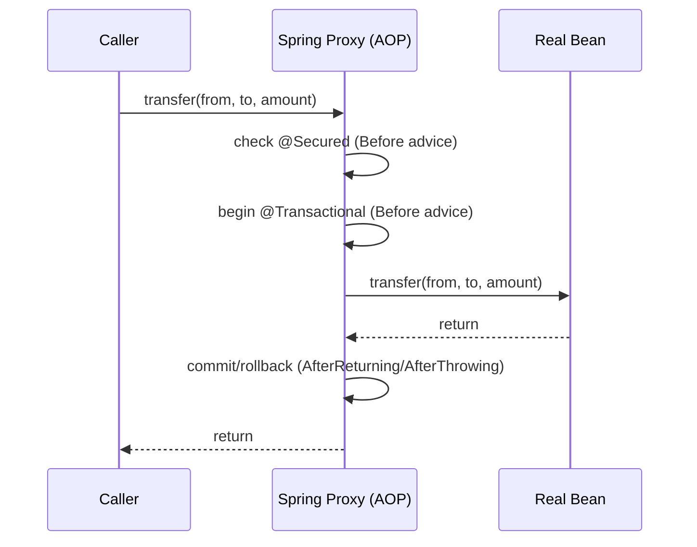

⚡ TL;DR - AOP modularizes cross-cutting concerns (logging,
security, transactions) by separating them from core
business logic. Spring AOP uses proxies; `@Transactional`,
`@Secured` are everyday AOP. Self-invocation bypasses it.

| #033 | Category: CS Fundamentals - Paradigms | Difficulty: ★★☆ |
|:---|:---|:---|
| **Depends on:** | CSF-015 (Polymorphism), CSF-022 (Abstraction Levels), CSF-013 (OOP) | |
| **Used by:** | SPR-005 (Spring AOP), JPH-002 (Transactions) | |
| **Related:** | DPT-008 (Decorator Pattern), CSF-024 (FP) | |

---

### 🔥 The Problem This Solves

**WORLD WITHOUT IT:**

Imagine an application where every service method needs:
security check, input validation, start transaction, log
entry, execute business logic, commit transaction, log exit,
metrics recording. Without AOP, each method contains all
of this code. A `UserService` with 20 methods has the same
transaction + logging + security boilerplate copy-pasted
20 times. Changing the logging format requires modifying
all 20 methods. A new concern (rate limiting) requires
adding code to all 20 methods.

**THE BREAKING POINT:**

"Cross-cutting concerns" - behavior that spans many classes
and methods without being core to any of them - cannot be
cleanly modularized in pure OOP. Inheritance helps (a
logging superclass) but fails with multiple concerns (you
cannot inherit from both a logging class and a security
class in Java). Composition helps (inject a logger) but
does not automatically apply the logger to every method.
The concern is scattered across the entire codebase -
a change in the concern requires touching every location.

**THE INVENTION MOMENT:**

Gregor Kiczales at Xerox PARC (1997) introduced AOP as a
way to modularize cross-cutting concerns that "cut across"
the normal OOP decomposition. The key insight: separate the
WHAT (business logic) from the WHEN and WHERE (apply this
concern at these method join points). AspectJ (1998) was
the first major AOP implementation. Spring AOP (2003+)
brought proxy-based AOP to mainstream Java development,
making `@Transactional`, `@Secured`, and `@Cached` work
transparently without modifying the annotated methods.

---

### 📘 Textbook Definition

Aspect-Oriented Programming (AOP) is a programming paradigm
that aims to increase modularity by separating cross-cutting
concerns from core business logic. Key terminology:
**Join Point**: a point in program execution (method call,
field access) where an aspect CAN be applied.
**Pointcut**: an expression that selects a set of join
points (e.g., "all methods annotated with `@Transactional`").
**Advice**: the code to execute at a join point
(Before, After, AfterReturning, AfterThrowing, Around).
**Aspect**: the module combining pointcuts and advice.
**Weaving**: the process of applying aspects to code -
can be compile-time (AspectJ), load-time, or runtime (proxy-based).
Spring AOP uses runtime proxy-based weaving: when a Spring
bean is created, Spring wraps it in a proxy that intercepts
matched method calls and applies the configured advice.

---

### ⏱️ Understand It in 30 Seconds

**One line:**
AOP lets you say "BEFORE / AFTER any method matching this
pattern, run this cross-cutting code" without touching the
business logic method itself.

**One analogy:**

> A highway toll booth. Every car that passes through gets
> charged a toll (cross-cutting concern: payment). The car
> (business logic) does not change its behavior - it just
> drives. The toll booth (aspect) intercepts every car
> at the join point (entry to the highway section) and
> applies the advice (charges the toll). Adding a new toll
> booth requires no changes to the cars.
>
> Spring `@Transactional` is the toll booth. Every method
> call to a `@Transactional` service is intercepted by
> a proxy that begins a transaction before the method and
> commits/rolls back after. The method's business logic
> never sees the transaction machinery.

**One insight:**

`@Transactional` IS AOP. When you add `@Transactional` to
a method, Spring AOP generates a proxy around that bean.
When you call `accountService.transfer(...)`, you are
actually calling the PROXY's `transfer()`, which: begins
the transaction, calls the real method, then commits or
rolls back. You have been using AOP since day one in Spring
without necessarily knowing it.

---

### 🔩 First Principles Explanation

**THE CORE PROBLEM - TANGLED CONCERNS:**

```
┌──────────────────────────────────────────────────────┐
│  WITHOUT AOP: concerns tangled in business code      │
│                                                      │
│  void transfer(Account from, Account to, BigDecimal)│
│    checkSecurity(currentUser, "transfer")  // sec   │
│    log.info("transfer start: from={}", from.id)     │
│    metricsTimer.start("transfer")          // metrics│
│    Transaction tx = txManager.begin()     // tx     │
│    // ... 5 lines of actual business logic ...      │
│    tx.commit()                             // tx     │
│    metricsTimer.stop()                    // metrics │
│    log.info("transfer end")               // logging │
│  // 80% boilerplate, 20% business logic             │
└──────────────────────────────────────────────────────┘
```

**WITH AOP: clean separation:**

```
┌──────────────────────────────────────────────────────┐
│  Business method (pure logic only):                  │
│                                                      │
│  @Transactional @Secured("ROLE_TELLER")              │
│  void transfer(Account from, Account to, BigDecimal) │
│    // ... 5 lines of pure business logic only ...    │
│                                                      │
│  The concerns ARE applied - but via the proxy.       │
│  The annotation is a marker; the aspect does the work│
└──────────────────────────────────────────────────────┘
```



**PROXY TYPES IN SPRING AOP:**

JDK Dynamic Proxy: used when the target bean implements
an interface. The proxy implements the same interface.
`@Autowired AccountService service` - if `AccountService`
is an interface, the proxy implements it.

CGLIB Proxy: used when the target bean is a concrete class
(no interface, or `proxyTargetClass=true`). CGLIB creates
a subclass of the target class at runtime. The subclass
overrides all methods to add aspect behavior.
Limitation: CGLIB cannot proxy `final` classes or `final` methods.

---

### 🧪 Thought Experiment

**THE SELF-INVOCATION TRAP:**

```java
@Service
public class AccountService {
    @Transactional
    public void transfer(Account from, Account to, BigDecimal amount) {
        debit(from, amount);  // self-invocation!
        credit(to, amount);
    }

    @Transactional(propagation = REQUIRES_NEW)
    public void debit(Account account, BigDecimal amount) {
        // should run in a SEPARATE transaction
        account.debit(amount);
        auditLog(account, amount); // must commit even if outer tx rolls back
    }
}
```

**What actually happens:**

When `transfer()` calls `this.debit()`, it calls the REAL
object's `debit()` method, NOT the proxy's `debit()`.
The proxy is only involved when a caller OUTSIDE the bean
calls the method. Self-invocation bypasses the proxy entirely.
The `@Transactional(REQUIRES_NEW)` on `debit()` has no
effect when called from within the same class.

**The lesson:**

This is THE most common AOP bug in production Spring code.
The fix: inject `self` (an `@Autowired AccountService self`
reference to the proxy), then call `self.debit()`.
Or: move `debit()` to a separate Spring bean, which is
always invoked via its proxy.

---

### 🎯 Mental Model / Analogy

**THE INTERCEPTOR CHAIN:**

AOP is a chain of interceptors around a method call.
Picture a method call as a train traveling through a tunnel.
The train carries the actual work. Each aspect is a toll
station the train must pass through. Each station can:
inspect the train (Before advice), modify the cargo
(Around advice), add something to the output (AfterReturning
advice), or divert the train if something goes wrong
(AfterThrowing advice). The train (business method) is
unchanged; the stations are independently configurable.
The spring proxy is the first and last toll station.

**MEMORY HOOK:**

"Spring AOP = proxy wraps bean. The proxy intercepts calls,
runs aspect code before/after/around. Self-invocation
bypasses the proxy = bypasses AOP. `@Transactional` is AOP.
`final` methods cannot be AOP'd (CGLIB cannot override them)."

---

### 📊 Gradual Depth - Five Levels

**Level 1 - Child:**
AOP means "do something extra before or after a method runs,
without changing the method." Like a mom who checks if you
washed your hands before AND after every meal (cross-cutting
concern: hygiene) without changing what you eat (business logic).

**Level 2 - Student:**
`@Transactional` is AOP. When you annotate a method, Spring
wraps the bean in a proxy that starts a transaction before
the method and commits/rolls back after. You write clean
business code; the transaction concern is handled separately.

**Level 3 - Professional:**
Writing custom aspects: `@Aspect` + `@Around` + `@Pointcut`.
A timing aspect that logs execution time for every public
service method:

```java
@Aspect @Component
class TimingAspect {
    @Around("execution(public * com.example.service.*.*(..))")
    Object time(ProceedingJoinPoint pjp) throws Throwable {
        long start = System.currentTimeMillis();
        Object result = pjp.proceed();  // run the real method
        log.info("{} took {}ms",
            pjp.getSignature().getName(),
            System.currentTimeMillis() - start);
        return result;
    }
}
```

This aspect applies to ALL public methods in ALL classes
in `com.example.service` - zero changes to those classes.

**Level 4 - Senior Engineer:**
Spring AOP vs AspectJ. Spring AOP: runtime proxy-based,
method-level join points only, Spring beans only, no
build-time dependency. AspectJ: compile-time or load-time
weaving, supports field-level join points, constructors,
works on any object (not just Spring beans). Spring AOP
covers 90% of use cases. Use AspectJ when: you need
non-method join points, you need to advise non-Spring
objects, or you need to advise `final` methods (AspectJ
modifies bytecode directly, bypassing the proxy model).

**Level 5 - Expert:**
AOP with Spring AOT (Ahead-of-Time compilation in Spring 6/GraalVM).
Spring AOP uses runtime proxies (reflection + CGLIB). In AOT
compilation (native image), reflection and class generation
are constrained. Spring 6+ generates AOP proxy code at
compile time for AOT compatibility, avoiding runtime CGLIB.
This means AOP must be configured in a way that AOT can
analyze at build time (annotation-driven aspects work;
programmatic proxy creation may not). For GraalVM native
images, prefer annotation-driven AOP with Spring Boot 3+
which has AOT support built in.

---

### ⚙️ How It Works (Formal Basis)

**PROXY CREATION FLOW:**

```
┌─────────────────────────────────────────────────────┐
│ ApplicationContext startup:                         │
│ 1. Spring creates AccountServiceImpl bean           │
│ 2. BeanPostProcessor (AnnotationAwareAspectJ         │
│    AutoProxyCreator) checks: any aspects match?     │
│ 3. If yes: creates proxy wrapping AccountServiceImpl│
│    - JDK proxy if AccountService interface exists   │
│    - CGLIB proxy if no interface                    │
│ 4. ApplicationContext returns the PROXY, not impl   │
│ 5. All @Autowired of AccountService receive proxy   │
│                                                     │
│ At method call:                                     │
│ 1. Proxy intercepts call                            │
│ 2. Looks up applicable interceptors (Before etc.)   │
│ 3. Runs interceptors in order                       │
│ 4. Calls real method via reflection                 │
│ 5. Runs After/AfterReturning/AfterThrowing          │
└─────────────────────────────────────────────────────┘
```

---

### 🔄 System Design Implications

**AOP vs DECORATOR PATTERN:**

Both apply behavior wrapping to a target. The difference:
Decorator is explicit (the code that wraps knows it wraps).
AOP is implicit (the business code does not know it is wrapped).
Use Decorator when the wrapping is part of the design
contract and needs to be visible. Use AOP when the concern
is orthogonal to the design and should be invisible to
business code. Spring's `HandlerInterceptor` and `Filter`
in web layers are explicit decorator chains; `@Transactional`
is implicit AOP.

---

### 💻 Code Example

**Example 1 - Wrong vs Right: Self-Invocation Bug**

```java
// BAD: self-invocation bypasses AOP proxy
@Service
class OrderService {
    @Transactional
    public void processOrder(Order order) {
        validateOrder(order);       // self-invocation!
        chargePayment(order);
    }

    @Transactional(propagation = Propagation.REQUIRES_NEW)
    public void chargePayment(Order order) {
        // REQUIRES_NEW should run in a new transaction
        // BUT: since called via 'this', the proxy is bypassed.
        // Runs in the SAME transaction as processOrder.
        // If processOrder rolls back, chargePayment rolls back too.
        paymentGateway.charge(order);
    }
}

// GOOD: inject self-reference to go through the proxy
@Service
class OrderService {
    @Autowired
    private OrderService self; // proxy reference

    @Transactional
    public void processOrder(Order order) {
        validateOrder(order);
        self.chargePayment(order);  // goes through proxy = new tx!
    }

    @Transactional(propagation = Propagation.REQUIRES_NEW)
    public void chargePayment(Order order) {
        // Now truly runs in a NEW transaction
        paymentGateway.charge(order);
    }
}
// OR: better design - move chargePayment to PaymentService bean
```

**Example 2 - Custom Around Aspect**

```java
// Retry aspect: retry on transient failures
@Retention(RetentionPolicy.RUNTIME)
@Target(ElementType.METHOD)
public @interface Retryable {
    int maxAttempts() default 3;
    Class<? extends Throwable>[] on() default { RuntimeException.class };
}

@Aspect @Component
class RetryAspect {
    @Around("@annotation(retryable)")
    Object retry(ProceedingJoinPoint pjp, Retryable retryable)
            throws Throwable {
        int maxAttempts = retryable.maxAttempts();
        Throwable lastException = null;
        for (int attempt = 1; attempt <= maxAttempts; attempt++) {
            try {
                return pjp.proceed();
            } catch (Throwable ex) {
                if (isRetryable(ex, retryable.on())) {
                    lastException = ex;
                    log.warn("Attempt {}/{} failed: {}", attempt,
                        maxAttempts, ex.getMessage());
                } else {
                    throw ex;
                }
            }
        }
        throw lastException;
    }

    private boolean isRetryable(Throwable ex, Class<?>[] types) {
        return Arrays.stream(types)
            .anyMatch(t -> t.isInstance(ex));
    }
}

// Usage: zero boilerplate on the method
@Service
class ExternalService {
    @Retryable(maxAttempts = 3, on = {IOException.class})
    public String callExternal(String input) throws IOException {
        return httpClient.get("https://api.example.com/" + input);
    }
}
```

---

### ⚖️ Comparison Table

| Aspect | Spring AOP | AspectJ | Decorator Pattern |
|---|---|---|---|
| Weaving type | Runtime (proxy) | Compile/load-time | Explicit (code) |
| Join point types | Method calls only | Methods, fields, constructors | Method calls |
| Scope | Spring beans only | Any object | Any object |
| `final` methods | NO (proxy cannot override) | YES (bytecode weaving) | YES |
| Performance overhead | Proxy creation; method invocation via reflection | Near-zero (bytecode) | Near-zero |
| Visibility | Invisible to business code | Invisible to business code | Visible in code structure |
| Best for | Transactional, security, caching | Advanced low-level weaving | Explicit composition |

---

### ⚠️ Common Misconceptions

| Misconception | Reality |
|---|---|
| `@Transactional` works on private methods | No. Spring AOP only intercepts public methods called through the proxy. `@Transactional` on a private method has NO effect - the proxy cannot override private methods. The transaction never starts. This is one of the most common Spring bugs. |
| Self-invocation within the same bean triggers AOP | No. When `this.method()` is called from within the same bean, it bypasses the proxy. AOP advice does not execute. Fix: inject `self` or restructure into separate beans. |
| Spring AOP requires AspectJ dependency | Spring AOP uses AspectJ's pointcut expression language (via `aspectjweaver` JAR) but does NOT require compile-time or load-time weaving. `aspectjweaver` is a dependency but weaving is proxy-based at runtime. |
| All methods in a `@Transactional` class are transactional | `@Transactional` on a class means all PUBLIC methods of the class are transactional. Private and package-private methods are not. Methods called via self-invocation are not - even if public. |

---

### 🚨 Failure Modes & Diagnosis

**Failure Mode 1: `@Transactional` Not Working**

**Symptoms:** `LazyInitializationException` on entity lazy
fields outside the controller. Data changes not being
rolled back on exception. Separate transactions not actually
separating.

**Root Causes and Diagnosis:**

1. Method is private - `@Transactional` silently ignored.
   Fix: make the method public.
2. Self-invocation - check if the method is called from
   within the same class via `this`. Fix: inject self or
   extract to a new bean.
3. Bean not managed by Spring - if the class is not a
   Spring bean (`@Service`, `@Component` etc.), no proxy
   is created. Fix: ensure the class is a Spring bean.
4. `@Transactional` on interface default method - not
   supported with JDK proxies in older Spring versions.

**Failure Mode 2: CGLIB Proxy Error on `final` class**

**Symptom:** `Cannot subclass final class ...` exception
at application startup. `@Transactional` service fails
to initialize.

**Root Cause:** The service class (or method) is `final`.
CGLIB proxy creates a subclass - cannot subclass `final`.

**Fix:** Remove `final` modifier from the class/method,
or switch to JDK proxies by implementing an interface.

---

**Security Note:**

AOP is commonly used to enforce security via `@PreAuthorize`,
`@Secured`, and `@RolesAllowed`. The same self-invocation
bypass that affects `@Transactional` affects security
annotations: if a public `@PreAuthorize`-annotated method
is called from within the same bean (bypassing the proxy),
the security check is SKIPPED. This is a security vulnerability.
Any security-critical operation must be in a separate Spring
bean that is always accessed through its proxy.
Additionally: never use AOP security as the sole defense.
Apply authorization at the data access layer too (row-level
security, query filters) so that bypassed AOP does not
expose raw data.

---

### 🔗 Related Keywords

**Prerequisites (understand these first):**
- `OOP` (CSF-013) - AOP complements OOP by modularizing
  what OOP cannot: cross-cutting concerns
- `Polymorphism` (CSF-015) - proxy-based AOP relies on
  polymorphism: the proxy is a subtype of the target bean

**Builds On This (learn these next):**
- `Spring AOP` (SPR-005) - the production implementation;
  all Spring annotations that use AOP (`@Transactional`,
  `@Cacheable`, `@Async`, `@Secured`)
- `JPA Transactions` (JPH-002) - transaction management
  in JPA is implemented via AOP

**Alternatives / Comparisons:**
- `Decorator Pattern` (DPT-008) - explicit alternative to
  AOP; use when the wrapping should be visible in code

---

### 📌 Quick Reference Card

```
┌────────────────────────────────────────────────────────┐
│ DEFINITION   │ Modularize cross-cutting concerns by    │
│              │ separating them from business logic via │
│              │ Join Points, Pointcuts, and Advice      │
├──────────────┼─────────────────────────────────────────┤
│ SPRING IMPL  │ Proxy-based (JDK proxy or CGLIB)        │
│              │ @Transactional, @Secured, @Cacheable    │
│              │ all use Spring AOP transparently        │
├──────────────┼─────────────────────────────────────────┤
│ PROXY RULES  │ JDK proxy: needs interface              │
│              │ CGLIB: concrete class (no final!)       │
│              │ Only PUBLIC methods intercepted         │
├──────────────┼─────────────────────────────────────────┤
│ SELF-INVOKE  │ this.method() = bypasses proxy = no AOP │
│              │ Fix: inject self, or move to new bean   │
├──────────────┼─────────────────────────────────────────┤
│ POINTCUT EX  │ "execution(public * com.example..*.*(..))"│
│              │ "@annotation(Transactional)"            │
│              │ "within(com.example.service.*)"         │
├──────────────┼─────────────────────────────────────────┤
│ ADVICE TYPES │ @Before, @After, @AfterReturning,       │
│              │ @AfterThrowing, @Around (most powerful) │
├──────────────┼─────────────────────────────────────────┤
│ NEXT EXPLORE │ SPR-005 (Spring AOP), JPH-002 (JPA TX)  │
└────────────────────────────────────────────────────────┘
```

**If you remember only 3 things:**

1. `@Transactional`, `@Secured`, `@Cacheable` are all
   implemented via Spring AOP - they work because Spring
   wraps your bean in a proxy that intercepts method calls.
   You have been using AOP in every Spring project.
2. Self-invocation bypasses AOP. Calling `this.method()` goes
   directly to the real object, not the proxy. `@Transactional`
   on that method does nothing. Fix: inject `self` (the proxied
   reference) or extract the method to a different Spring bean.
3. CGLIB proxies cannot subclass `final` classes or override
   `final` methods. A `@Transactional` annotation on a `final`
   method silently has no effect. `@Transactional` on a private
   method also has no effect (proxies cannot intercept private methods).

**Interview one-liner:**
"AOP separates cross-cutting concerns (logging, transactions,
security) from business logic using proxies. Spring AOP
wraps beans in JDK or CGLIB proxies. `@Transactional` and
`@Secured` are everyday AOP. Key trap: self-invocation bypasses
the proxy, so `@Transactional` on a privately-called method
has no effect. Fix by injecting self or extracting to a new bean."

---

### 💎 Transferable Wisdom

**Reusable Engineering Principle:**
AOP enforces the Single Responsibility Principle at the
system level: each piece of code has exactly one reason
to change. A business method should only change when
the business rule changes, not when the logging format
changes or when the security model changes. AOP achieves
this by physically separating orthogonal concerns into
separate modules. This same principle drives HTTP filter
chains (each filter handles one concern: auth, CORS, compression),
Unix pipes (each program does one thing), and Kubernetes
admission controllers (each controller handles one policy).
Whenever you see "add X to every Y" in a system,
that is a candidate for an aspect/filter/interceptor -
not a copy-paste operation.

**Where else this pattern appears:**

- **Servlet Filters and Spring Interceptors** - `Filter`
  and `HandlerInterceptor` are explicit, synchronous AOP
  applied to HTTP requests. Every HTTP request passes through
  the filter chain; each filter handles one cross-cutting
  concern (CORS, authentication, compression, request logging).
  This is AOP where the join point is "HTTP request received."
- **gRPC Interceptors** - gRPC has `ClientInterceptor` and
  `ServerInterceptor` for adding cross-cutting behavior to
  RPC calls: tracing, authentication, retry. Same model as
  AOP, applied to RPC calls.
- **Database Triggers** - `BEFORE INSERT ON orders` is AOP
  at the database level: code that executes at a join point
  (INSERT operation) without being embedded in the application
  code. Audit logging, default value population, and referential
  integrity enforcement use database triggers as cross-cutting concerns.

---

### 💡 The Surprising Truth

Spring `@Transactional` has caused more production data
corruption bugs than almost any other Spring feature -
not because it does not work, but because it works via
AOP and most developers do not realize AOP has the
self-invocation limitation. A developer writes a service,
marks an internal method `@Transactional(REQUIRES_NEW)`
to ensure it runs in its own transaction (so its work is
committed even if the outer transaction fails), calls it
from another method in the same class, and assumes it works.
It does not - the proxy is bypassed, both methods share
one transaction. When the outer transaction rolls back
(due to a later failure), the work from the "separate"
transaction rolls back too. The developer sees the database
in an inconsistent state and has no idea why, because
the code "clearly" says `REQUIRES_NEW`. The bug is invisible
until it causes data corruption in production. This is
why senior Spring engineers instinctively ask "is that
called via self-invocation?" when reviewing any
`@Transactional` annotation.

---

### ✅ Mastery Checklist

**You've mastered this when you can:**

1. **[DIAGNOSE]** Given a `@Transactional(REQUIRES_NEW)` method
   that is not starting a new transaction as expected,
   determine in under 2 minutes whether self-invocation is
   the cause (check the call site: same class + `this.method()`?).
   Implement the fix (inject self or extract to new bean).

2. **[WRITE]** Write a custom `@Aspect` with an `@Around`
   advice that: measures execution time for all methods
   annotated with a custom `@Timed` annotation, logs the
   method name and duration, and records a metric.
   Do not modify any of the timed methods.

3. **[EXPLAIN]** Explain why `@Transactional` on a `private`
   method silently has no effect. Trace the proxy creation
   mechanism: Spring creates a CGLIB proxy subclass; the
   subclass overrides PUBLIC methods; private methods cannot
   be overridden; the proxy never intercepts the call.

4. **[DESIGN]** A service has 10 methods. 3 need retry
   logic on `IOException`. 5 need execution-time metrics.
   All 10 need distributed tracing. Design the AOP solution:
   which aspects, which pointcuts, which advice types.
   No business method should contain retry, metrics, or
   tracing code.

5. **[EVALUATE]** Given a requirement to add audit logging
   to all `@Transactional` methods, evaluate: Spring AOP
   aspect vs Hibernate `EntityListener` vs DB trigger.
   What are the trade-offs of each approach for completeness
   of coverage, reliability, and maintenance cost?

---

### 🧠 Think About This Before We Continue

**Q1.** A `@Transactional` method calls another `@Transactional`
method on the SAME service bean. The inner method is
annotated `@Transactional(propagation = REQUIRES_NEW)`.
In production, you observe that both operations always
commit or roll back together, never independently.
Is this a bug? How would you reproduce the behavior in
a test? What is the fix?

*Hint: This is self-invocation. The inner method is called
via `this.innerMethod()`, bypassing the proxy. So the
`REQUIRES_NEW` propagation instruction on the inner method
is never seen by Spring's transaction management.
Both methods run in the same transaction. Fix: extract
inner method to a different Spring bean (most correct)
or inject a self-reference and call `self.innerMethod()`.
Test: write a test that calls the outer method, make
the outer method throw an exception AFTER the inner method
completes, and verify whether the inner method's changes
were persisted (they should be with REQUIRES_NEW, but are not).*

**Q2.** Can you apply AOP to a method in a class that is
NOT a Spring bean? What are the options?

*Hint: Spring AOP works only on Spring beans (proxy wraps
the bean at creation time). For non-Spring objects: use
AspectJ load-time weaving (specify the aspect and the class
to weave; the JVM agent modifies bytecode at class load time).
This works on ANY class, not just Spring beans. Use case:
advising domain model entities (which are not Spring beans)
with logging or validation.*

---

### 🎯 Interview Deep-Dive

**Q1: "Explain how Spring AOP works under the hood."**

*Why they ask:* Tests understanding of proxy mechanisms.
Required for senior Spring developers.

*Strong answer includes:*
- When Spring creates a bean, `BeanPostProcessor` checks
  if any registered aspects have pointcuts that match
  the bean's methods.
- If matched: Spring creates a proxy. JDK dynamic proxy
  if the bean implements an interface. CGLIB proxy otherwise.
- The proxy wraps the real bean. All `@Autowired` injections
  of that bean type receive the proxy, not the real object.
- When a caller invokes a method on the proxy, the proxy
  looks up the interceptor chain for that method and executes:
  Before advice, real method, AfterReturning / AfterThrowing,
  After advice, Around wrapper.
- Limitation: method-level join points only. Public methods
  only. No `final` methods with CGLIB.

**Q2: "What is the self-invocation problem in Spring AOP?
How do you fix it?"**

*Why they ask:* One of the most common real-world Spring bugs.
Expected knowledge for any Spring developer above junior.

*Strong answer includes:*
- `@Autowired AccountService service` - the caller holds
  a reference to the PROXY.
- Inside `AccountService`, calling `this.anotherMethod()`
  - `this` refers to the REAL object, not the proxy.
- The proxy is not involved; AOP advice is not executed.
- `@Transactional(REQUIRES_NEW)`, `@Cacheable`, `@Async`,
  `@PreAuthorize` on self-invoked methods all silently fail.
- Fix 1: Inject self - `@Autowired AccountService self`.
  Call `self.anotherMethod()` - goes through the proxy.
- Fix 2: Extract the method to a separate Spring bean
  (the cleaner architectural fix - often the self-invocation
  signals that the method belongs in a different service).

**Q3: "When would you use AspectJ instead of Spring AOP?"**

*Why they ask:* Differentiates senior from junior. Tests
knowledge of when the default tool is insufficient.

*Strong answer includes:*
- Use AspectJ when: (1) you need to advise NON-Spring objects
  (domain entities, value objects); (2) you need non-method
  join points (field access, constructor calls); (3) you
  need to advise `final` methods or classes; (4) you need
  maximum performance (compile-time weaving eliminates
  proxy overhead); (5) you need to apply aspects to
  third-party library classes.
- Spring AOP covers 90%+ of typical enterprise use cases.
  AspectJ for the remaining 10% requiring deeper weaving.
  In practice: Spring Boot + Spring AOP for most projects;
  AspectJ for specialized infrastructure (security framework
  internals, instrumentation, bytecode-level monitoring).
