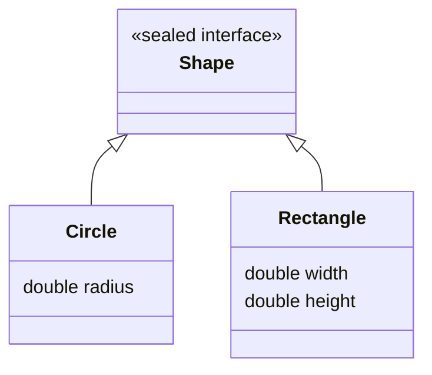

⚡ TL;DR - ADTs model data as products (records: combine
fields) and sums (sealed interfaces: pick one of N shapes).
Java 17+ sealed interfaces + records implement ADTs with
compiler-enforced exhaustiveness. Eliminates null checks
and invalid states.

| #038 | Category: CS Fundamentals - Paradigms | Difficulty: ★★★ |
|:---|:---|:---|
| **Depends on:** | CSF-034 (Type Systems), CSF-024 (Functional Programming) | |
| **Used by:** | CSF-039 (Pattern Matching), JLG-015 (Sealed Interfaces) | |
| **Related:** | CSF-037 (Generics), CSF-049 (Monads), CSF-068 (Category Theory) | |

---

### 🔥 The Problem This Solves

**WORLD WITHOUT IT:**

Modeling a payment result in traditional Java pre-17:
```java
class PaymentResult {
    boolean success;
    String transactionId;  // null if failed
    String errorCode;      // null if succeeded
    String errorMessage;   // null if succeeded
}
```
Now consumers must check: "is `transactionId` null? Then
it failed. Is `errorCode` null? Maybe it partially succeeded?"
The class allows INVALID COMBINATIONS: both `transactionId`
and `errorCode` set (success AND failure?), or both null
(what happened?). The type system cannot prevent these
invalid states. Every consumer must defensively null-check
and hope the invariant is maintained by all producers.

**THE BREAKING POINT:**

"Make impossible states impossible" - if the type system
cannot represent ONLY valid states, you must validate
at runtime everywhere. A `PaymentResult` with all fields
null is representable in the type system but invalid in
the domain. Testing requires testing invalid states that
should never occur. Code is full of null checks for
situations that are "impossible" according to business rules
but perfectly expressible in the type system.

**THE INVENTION MOMENT:**

Algebraic Data Types from type theory (and practical
languages like ML, Haskell, 1970s-90s) provide the
answer: model data as the ALGEBRA of its possible shapes.
Product types: a value has ALL fields (name AND age AND email).
Sum types: a value has EXACTLY ONE of several shapes
(Success OR Failure, never both). In Java: records
implement product types (Java 16+); sealed interfaces
+ records implement sum types (Java 17+). Together,
they let you "make impossible states impossible" at compile time.

---

### 📘 Textbook Definition

Algebraic Data Types (ADTs) are composite types built
from two type algebra operations:

**Product Type (AND):** A value that contains ALL fields.
`(A AND B)` - has both an A and a B. In Java: `record
Point(int x, int y)` - every Point has an x AND a y.
Total "size" = number of values A can take × number of
values B can take (hence "product").

**Sum Type (OR):** A value that is EXACTLY ONE of several
alternatives. `(A OR B)` - either an A or a B, never both.
In Java: `sealed interface Shape permits Circle, Rectangle`
- a Shape is either a Circle OR a Rectangle. Total "size"
= number of values A can take + number of values B can take
(hence "sum").

ADTs enable exhaustiveness checking: when pattern-matching
on a sum type, the compiler knows all variants and enforces
that all are handled. Adding a new variant causes compile
errors at all unhandled switch expressions - making the
omission impossible to miss.

---

### ⏱️ Understand It in 30 Seconds

**One line:**
Product types combine fields (record with ALL). Sum types
are exactly one variant (sealed interface with ONE OF N).
Together they model domains where invalid states are
impossible by construction.

**One analogy:**

> A traffic light has exactly THREE states: Red, Yellow,
> Green. Not "Red-and-Green-simultaneously" (invalid).
> Not "Null" (invalid). Not "RedWithYellowOverlay" (invalid).
> If you model it as `int lightState` (0=red, 1=yellow, 2=green),
> `lightState = 5` is invalid but representable.
> If you model it as `sealed interface Light permits Red, Yellow, Green`,
> only those three values are expressible. Invalid state
> is NOT representable. The type system enforces the
> domain constraint.

**One insight:**

`Optional<T>` is a sum type: it is EITHER `Some(value)`
OR `None` (empty). Without ADTs, Java used `null` for
"no value" - which is just `None` mixed into every reference
type, making every reference potentially invalid. `Optional`
names and separates these two states. Java's `sealed interface`
generalizes this to any number of variants.

---

### 🔩 First Principles Explanation

**THE ALGEBRA:**

```
┌──────────────────────────────────────────────────────┐
│ PRODUCT TYPE = AND = Record                          │
│                                                      │
│ record Person(String name, int age) {}               │
│ // A Person = name AND age                           │
│ // Both must be present. Neither can be "missing."   │
│ // Cannot have a Person with age but no name.        │
│                                                      │
│ PRODUCT TYPE size = |String| × |int|                 │
│ (all possible strings × all possible ints)           │
│                                                      │
│ SUM TYPE = OR = Sealed Interface                     │
│                                                      │
│ sealed interface Shape permits Circle, Rect {}       │
│ record Circle(double r) implements Shape {}          │
│ record Rect(double w, double h) implements Shape {}  │
│ // A Shape = EITHER a Circle OR a Rect               │
│ // Cannot be both simultaneously.                    │
│                                                      │
│ SUM TYPE size = |Circle| + |Rect|                    │
│ (all circles + all rects, no overlap)                │
└──────────────────────────────────────────────────────┘
```



**THE POWER OF EXHAUSTIVENESS:**

```java
// Compiler knows ALL variants of sealed Shape:
double area(Shape shape) {
    return switch (shape) {
        case Circle c    -> Math.PI * c.radius() * c.radius();
        case Rectangle r -> r.width() * r.height();
        // No 'default' needed - compiler verified all cases
    };
}

// Add Triangle to sealed Shape:
// record Triangle(double base, double height) implements Shape {}
// Now EVERY switch without Triangle handling is a COMPILE ERROR.
// The change propagates through the codebase automatically.
```

---

### 🧪 Thought Experiment

**PAYMENT RESULT - BEFORE AND AFTER:**

```java
// BEFORE ADTs: invalid states are representable
class PaymentResult {
    boolean success;
    String transactionId; // null if failed - but how do you know?
    String errorCode;     // null if succeeded
}
// Consumer: if (result.success && result.transactionId != null) {...}
// Problem: result.success=true AND transactionId=null is possible!
// Defensive code everywhere. Tests for impossible combinations.

// AFTER ADTs: impossible states are not representable
sealed interface PaymentResult permits Success, Failure {}

record Success(String transactionId) implements PaymentResult {}
record Failure(String errorCode, String message) implements PaymentResult {}

// Consumer: clean exhaustive pattern match
void handleResult(PaymentResult result) {
    switch (result) {
        case Success s ->
            orderService.confirm(s.transactionId()); // always present
        case Failure f ->
            alertService.notify(f.errorCode(), f.message()); // always present
        // No null checks needed. No invalid combinations possible.
        // Compiler guarantees: if it's Success, transactionId exists.
        //                       if it's Failure, errorCode exists.
    }
}
```

**THE LESSON:**

ADTs make the type system do the work of invariant enforcement.
Instead of documenting "if `success` is true, `transactionId`
will not be null" in a comment, the type structure GUARANTEES
it. Documentation can lie; the type system cannot.

---

### 🎯 Mental Model / Analogy

**THE USB CONNECTOR ANALOGY:**

Product type: a USB-C connector. It has BOTH a power pin
AND a data pin AND a ground pin. All three must be present
for a valid connector. If any is missing, it's not a valid
USB-C connector (not representable in the type).

Sum type: USB port versions. Either USB 2.0 OR USB 3.0
OR USB 4.0. One port is exactly one version. It cannot
be simultaneously USB 2.0 and USB 3.0. The type system
represents exactly one of the valid versions.

**MEMORY HOOK:**

"Product = ALL fields (record). Sum = ONE OF N shapes (sealed).
Together: no null checks, no invalid states, exhaustive
pattern matching. Adding a variant = compile errors at
all unhandled switches. The type system enforces the domain."

---

### 📊 Gradual Depth - Five Levels

**Level 1 - Child:**
ADTs are ways to describe exactly what shapes data can have.
A playing card is EITHER Hearts OR Diamonds OR Clubs OR Spades
(sum type). A specific card has BOTH a suit AND a rank
(product type). You can't have a card with both Hearts and
Spades at once, and you can't have a card with no suit.

**Level 2 - Student:**
Java records are product types: `record Point(int x, int y)` -
every Point has both x and y. Java sealed interfaces are
sum types: `sealed interface Result permits Ok, Err` -
a Result is either Ok or Err. Pattern matching switches
on sealed interfaces are exhaustive - the compiler checks
all variants are handled.

**Level 3 - Professional:**
Modeling domain errors as ADTs. Instead of throwing
exceptions for expected errors (validation failure, not found),
return a typed result:

```java
sealed interface Result<T> permits Result.Ok, Result.Err {
    record Ok<T>(T value) implements Result<T> {}
    record Err<T>(String errorCode, String message)
        implements Result<T> {}
}
// Callers MUST handle both cases via pattern matching.
// No uncaught exception from business rule violations.
// The type signature communicates: this can fail.
```

**Level 4 - Senior Engineer:**
Generic sealed interfaces enable typed error modeling at
scale. `Either<L, R>` (common in functional Java libraries
like vavr): `sealed interface Either<L, R> permits Left,
Right`. `Left` is conventionally error, `Right` is success.
Operations chain: `either.map(fn)` transforms the Right
value; `either.mapLeft(fn)` transforms the Left value.
This is railway-oriented programming: errors flow on
the Left track, successes flow on the Right track.
Operations automatically short-circuit on Left without
null checks or try-catch.

**Level 5 - Expert:**
The algebra of ADTs mirrors set theory and category theory.
Product types correspond to CARTESIAN PRODUCTS: `A × B`
contains all (a, b) pairs. Sum types correspond to DISJOINT
UNIONS: `A + B` contains either an A or a B with a tag.
Combining them: `Option<T> = None + Some(T)`.
`Result<T, E> = Ok(T) + Err(E)`.
`List<T> = Empty + Node(T, List<T>)` - a recursive sum type.
These structures form a mathematical foundation for reasoning
about data: the Curry-Howard correspondence maps type theory
to logic, where product types = logical AND and sum types
= logical OR. This isomorphism means type-correct programs
correspond to logic proofs. ADTs are the practical application
of this theoretical foundation.

---

### ⚙️ How It Works (Formal Basis)

**JAVA SEALED INTERFACE ENFORCEMENT:**

```
┌──────────────────────────────────────────────────────┐
│ sealed interface Shape permits Circle, Rectangle {}  │
│                                                      │
│ Rules the compiler enforces:                         │
│ 1. Only Circle and Rectangle may implement Shape     │
│    (any other class: compile error)                  │
│ 2. Circle and Rectangle must be in the same package  │
│    (or named module) as Shape                        │
│ 3. Circle and Rectangle must be final, sealed, or    │
│    non-sealed (must declare extensibility)           │
│                                                      │
│ At pattern matching:                                 │
│ switch (shape) {                                     │
│   case Circle c -> ...     // handled                │
│   case Rectangle r -> ...  // handled                │
│   // No default needed - compiler knows all permits  │
│   // are covered. If Triangle added to permits       │
│   // and NOT to this switch -> COMPILE ERROR.        │
│ }                                                    │
└──────────────────────────────────────────────────────┘
```

---

### 🔄 System Design Implications

**MAKE ILLEGAL STATES UNREPRESENTABLE:**

This is the core design principle that ADTs implement.
Model your domain so that the type system rejects invalid
state by construction:

- NOT: `class Order { Status status; String cancelReason; }` where
  `cancelReason` is only valid when `status == CANCELLED`.
- YES: `sealed interface Order permits ActiveOrder, CancelledOrder`.
  `record ActiveOrder(...)` - no `cancelReason` field.
  `record CancelledOrder(..., String cancelReason)` - `cancelReason`
  is always present and meaningful.

Result: no null checks, no defensive validation of impossible
combinations, no documentation saying "this field is null
unless that field is X."

---

### 💻 Code Example

**Example 1 - Wrong vs Right: Null-Field Class vs ADT**

```java
// BAD: invalid states representable, null-check minefield
class SearchResult {
    User user;          // null if not found
    String errorMessage; // null if found
    boolean found;
    // All three fields can be any combination - invalid states possible
}

// GOOD: ADT - invalid states not representable
sealed interface SearchResult permits Found, NotFound, Error {}
record Found(User user) implements SearchResult {}
record NotFound() implements SearchResult {}
record Error(String message) implements SearchResult {}

// Clean, exhaustive handling:
String describe(SearchResult result) {
    return switch (result) {
        case Found f -> "Found user: " + f.user().name();
        case NotFound ignored -> "No user found";
        case Error e -> "Search failed: " + e.message();
    };
}
// No null checks. No invalid combinations.
// Add a new result type? Compile error here until handled.
```

**Example 2 - Typed Error Handling with Result ADT**

```java
// Generic Result ADT - no exceptions for expected failures
sealed interface Result<T> permits Result.Ok, Result.Err {
    record Ok<T>(T value) implements Result<T> {}
    record Err<T>(String code, String message)
        implements Result<T> {}

    // Monadic map: transform Ok value, pass Err through
    default <R> Result<R> map(Function<T, R> fn) {
        return switch (this) {
            case Ok<T> ok -> new Ok<>(fn.apply(ok.value()));
            case Err<T> err -> new Err<>(err.code(), err.message());
        };
    }
}

// Usage: caller MUST handle both paths
Result<User> result = userService.findById(id);
Result<UserDto> dto = result.map(UserMapper::toDto);

switch (dto) {
    case Result.Ok<UserDto> ok ->
        response.setBody(ok.value());
    case Result.Err<UserDto> err ->
        response.setStatus(404).setBody(err.message());
}
```

---

### ⚖️ Comparison Table

| Approach | Null Fields | Enum+fields | Sealed Interface+Records |
|---|---|---|---|
| Invalid states | Representable | Representable (all fields always present) | Not representable |
| Exhaustiveness | Manual (if chains) | Partial (switch on enum) | Compiler-enforced |
| Adding a new case | Silent miss | Compile warning (Wswitch) | Compile error at all unhandled switches |
| Per-case fields | Manual null check | All share all fields | Each case has exactly its fields |
| Readability | Low (hidden invariants) | Medium | High (shape = state) |

---

### ⚠️ Common Misconceptions

| Misconception | Reality |
|---|---|
| ADTs are only for functional programming | ADTs are a type-system concept, not a paradigm requirement. Java (an OOP language) implements product types via records and sum types via sealed interfaces. They are tools for precise domain modeling, useful in any paradigm. |
| Java `enum` is a sum type | Java `enum` is a fixed set of constants. Unlike sealed interfaces, enum variants cannot have different sets of fields. `CIRCLE` and `RECTANGLE` as enum values must have the same fields (all enum values share the class's fields). Sealed interfaces allow each variant to have its own, different fields - that is the key difference. |
| You need to use pattern matching to use ADTs | ADTs (sealed interfaces + records) provide value through their TYPE STRUCTURE, even without pattern matching. Just declaring `sealed interface PaymentResult permits Success, Failure` with appropriate records already prevents invalid states. Pattern matching switches provide exhaustiveness checking, but the structural benefits exist independently. |
| Sealed interfaces replace all inheritance | Sealed interfaces replace UNRESTRICTED inheritance where you want an exhaustive, closed set of variants. If you want unrestricted extensibility (plugins, open extension points), regular interfaces and abstract classes are still appropriate. Sealed = closed world assumption. Regular = open world. |

---

### 🚨 Failure Modes & Diagnosis

**Failure Mode 1: Non-Exhaustive Pattern Match After Adding Variant**

**Symptom:** After adding `Refunded` to a `PaymentResult`
sealed interface, a switch expression that handles payments
starts throwing `IncompatibleClassChangeError` or simply
falls through to unexpected behavior.

**Root Cause:** If the switch expression has a `default`
case, the compiler accepts the unhandled `Refunded` case
silently - the `default` handles it, possibly with wrong
behavior. If the switch has no `default`, it IS a compile
error on the switch expression.

**Fix:** Design switches on sealed types WITHOUT a `default`
case. Let the compiler enforce exhaustiveness. Opt for
the compile error over a silent runtime behavioral gap.
The compile error is the feature - it finds every handler
that needs updating.

**Failure Mode 2: Mixing ADT with Nullability**

**Symptom:** A `sealed interface Result<T> permits Ok, Err`
is used, but callers return `null` from methods that should
return `Result`. `NullPointerException` at the pattern match.

**Root Cause:** ADTs replace null semantics, but only if
all callers use the ADT. If some callers return `null`
instead of `Err(...)`, the ADT invariant is broken.

**Fix:** Use `@NonNull` annotations or Kotlin (which has
null safety built into the type system). In Java: enforce
code review for null returns from ADT-returning methods;
use IDE null-safety plugins (IntelliJ IDEA's null analysis).

---

**Security Note:**

ADTs improve security by eliminating a class of bugs that
attackers exploit: invalid state assumptions. If a `Permission`
can be modeled as a sealed interface (`GrantedPermission(role,
resource)` vs `DeniedPermission(reason)`), no code path
can accidentally treat a `DeniedPermission` as granted
by checking the wrong field. Traditional: `if (perm.granted
&& perm.role != null)` - missing the `granted` check causes
privilege escalation. ADT: `case GrantedPermission g ->
allow(g.role())` - structural typing prevents treating
Denied as Granted. Domain security invariants expressed
in types cannot be accidentally violated by off-by-one
logical errors.

---

### 🔗 Related Keywords

**Prerequisites (understand these first):**
- `Type Systems` (CSF-034) - ADTs are a type system feature;
  understanding static typing and structural/nominal typing
  is foundational
- `Functional Programming` (CSF-024) - ADTs originate
  from FP type theory; core FP data modeling technique

**Builds On This (learn these next):**
- `Pattern Matching` (CSF-039) - pattern matching is the
  primary way to destructure and use ADT values exhaustively
- `Monads and Functors` (CSF-049) - `Optional`, `Result`,
  `Either` are monadic ADTs; functors are the map operation

---

### 📌 Quick Reference Card

```
┌────────────────────────────────────────────────────────┐
│ PRODUCT TYPE │ Record: ALL fields present              │
│              │ record Point(int x, int y) {}           │
├──────────────┼─────────────────────────────────────────┤
│ SUM TYPE     │ Sealed: EXACTLY ONE variant             │
│              │ sealed interface Shape permits C, R {}  │
├──────────────┼─────────────────────────────────────────┤
│ EXHAUSTIVE   │ Switch without default on sealed type   │
│              │ Adding variant = compile error at all   │
│              │ unhandled switches                      │
├──────────────┼─────────────────────────────────────────┤
│ KEY DESIGN   │ Make impossible states not representable│
│              │ Each variant has only its relevant fields│
├──────────────┼─────────────────────────────────────────┤
│ JAVA FEATURES│ Records (Java 16+): product types       │
│              │ Sealed interfaces (Java 17+): sum types │
│              │ Pattern matching (Java 21): full syntax │
├──────────────┼─────────────────────────────────────────┤
│ VS ENUM      │ Sealed allows per-variant different     │
│              │ fields. Enum shares all fields.          │
├──────────────┼─────────────────────────────────────────┤
│ NEXT EXPLORE │ CSF-039 (Pattern Matching)              │
└────────────────────────────────────────────────────────┘
```

**If you remember only 3 things:**

1. Product types (records): a value has ALL of its fields.
   Sum types (sealed interfaces): a value is EXACTLY ONE
   of its variants. Together they model domain data where
   invalid combinations are not representable in the type system.
2. Sealed interfaces enforce exhaustiveness at switches:
   no `default` case needed, and the compiler requires every
   permitted variant to be handled. Adding a new variant
   causes compile errors at all unhandled switch expressions
   - the type system propagates the change requirement.
3. ADTs replace the "check all these nullable fields to determine
   state" pattern. Instead of `if (result.errorCode != null)`,
   use `case Failure f -> ...`. The structure of the type
   carries the state; the compiler guarantees the fields
   are present when the variant matches.

**Interview one-liner:**
"ADTs model data as products (records: ALL fields) and
sums (sealed interfaces: ONE OF N). In Java 17+: sealed
interface + records. Key benefit: impossible states are
not representable - no null checks for 'which variant is this?'
Pattern matching on sealed interfaces is exhaustive;
adding a variant causes compile errors at all unhandled
switch expressions."

---

### 💎 Transferable Wisdom

**Reusable Engineering Principle:**
"Make impossible states impossible" is the core principle
ADTs implement. It generalizes to all of software design:
if your type system, schema, or contract can represent
invalid states, validation must be duplicated everywhere
the data is used. If your representation ONLY allows valid
states, validation happens once at the construction site
and never again. Examples: database constraints (instead
of validating in application code, use NOT NULL, UNIQUE,
CHECK constraints so the DB rejects invalid states); REST API
schema validation (instead of validating fields in every
handler, define a strict JSON Schema and validate at
the API gateway); message broker schema registry (instead
of validating message structure in every consumer, validate
at publish time with Avro/Protobuf schemas). The principle:
push invariant enforcement as close to data creation as possible.

**Where else this pattern appears:**

- **Rust's `Option<T>` and `Result<T, E>`** - Rust has no
  `null`. Instead, values that may be absent are `Option<T>`:
  `Some(value)` or `None`. Values that may fail are `Result<T, E>`:
  `Ok(value)` or `Err(error)`. These are ADTs. Pattern matching
  on them is exhaustive. The Rust compiler forces you to handle
  BOTH cases. Null pointer exceptions - Java's most common
  runtime error - do not exist in Rust because null is not
  representable.
- **TypeScript discriminated unions** - TypeScript's structural
  type system supports discriminated unions: `type Shape = Circle | Rectangle`.
  Pattern matching via `if (shape.kind === 'circle')` narrowing.
  TypeScript's `never` type enables exhaustiveness checking:
  in a switch/if over a discriminated union, the final else
  branch should receive type `never` - if it does not, the union
  is not fully handled. Same concept as sealed interfaces but
  implemented with structural typing.
- **HTTP API error modeling** - Instead of returning HTTP 200
  with a JSON body that has an `error` field sometimes (and
  a `data` field sometimes), model responses as ADTs: 200 with
  `data` (Ok), 4xx with `error` (Err). Each status code is
  a variant; the response body structure is determined by
  the variant. OpenAPI's `oneOf` is the schema-level ADT.

---

### 💡 The Surprising Truth

Java `null` was called "my billion-dollar mistake" by its
inventor, Tony Hoare, in 2009. Hoare introduced the null
reference in ALGOL W in 1965 because "it seemed like the
obvious thing to do at the time." He estimated that null
reference errors have caused a billion dollars (likely much
more) in aggregate costs from bugs, security vulnerabilities,
and maintenance. The fundamental issue: null is a value
of EVERY reference type - a `String` variable can hold
null even though null is not a String. This collapses the
sum type `(some String OR nothing)` into a single reference
type, making every reference type secretly nullable.
ADTs - specifically `Option`/`Optional` and sealed interfaces -
are the type-theoretically correct answer Hoare was missing in 1965:
model "this might not have a value" as an EXPLICIT sum type
(`Some(value)` OR `None`), not as a special value injected
into all reference types. 58 years later, Java still defaults
to nullable references - but Java records and sealed interfaces
finally give developers the tools to opt out.

---

### ✅ Mastery Checklist

**You've mastered this when you can:**

1. **[IDENTIFY]** Given a class with multiple nullable fields
   where the non-null fields depend on a status field,
   refactor it to a sealed interface with one record per
   valid state, each having only the fields relevant to
   that state.

2. **[DESIGN]** Design a `ValidationResult<T>` ADT that
   can hold either a valid value of type T or a list of
   `ValidationError` objects. Ensure: valid result always
   has the value, invalid result always has at least one error.
   Implement exhaustive pattern matching consumption.

3. **[VERIFY]** Add a new variant to a sealed interface
   and compile the project. Identify all switch expressions
   where the compiler reports an error due to the missing
   case. Fix them. Verify that no default cases silently
   swallowed the new variant.

4. **[COMPARE]** Given a domain with 4 states (Active,
   Suspended, Cancelled, Expired) modeled three ways:
   (1) boolean/enum fields on one class, (2) Java enum with
   shared fields, (3) sealed interface with per-state records.
   List the invalid states each approach allows and the
   null checks each requires.

5. **[IMPLEMENT]** Implement a generic `Result<T>` type
   as a sealed interface with `Ok<T>` and `Err<T>` variants.
   Add `map`, `flatMap`, and `getOrElse` methods.
   Use it to chain 3 operations that can each fail,
   without try-catch and without null checks.

---

### 🧠 Think About This Before We Continue

**Q1.** Java `Optional<T>` is sometimes described as an
ADT (sum type). But `Optional` is frequently criticized
for being misused in practice. What makes `Optional`
different from a properly designed sealed interface ADT?
When does `Optional` fail to deliver the "impossible states
impossible" guarantee?

*Hint: `Optional<T>` IS a sum type in spirit (`Present(T)` or `Empty`).
The problem: (1) it can hold null - `Optional.of(null)` throws,
but `Optional.ofNullable(null)` creates an empty Optional,
and `Optional.ofNullable(null).get()` is still problematic.
(2) `Optional.get()` without `isPresent()` is a `NoSuchElementException`
at runtime - nearly as bad as NPE. (3) `Optional` is often
returned from methods but then `.get()` is called without checking -
same pattern as null checking, just with different API.
Sealed interface `Result` fixes (2) and (3) by FORCING a
switch (pattern matching) that handles both cases at compile time.
`Optional` does not enforce exhaustive handling.*

**Q2.** Consider: `sealed interface Tree<T> permits Leaf, Node`.
`record Leaf<T>(T value) implements Tree<T> {}`.
`record Node<T>(Tree<T> left, Tree<T> right) implements Tree<T> {}`.
This is a recursive ADT. How would you write a generic `depth(Tree<T>)` function?
What does the type of `Node.left` guarantee that a traditional
class hierarchy with nullable fields would not?

*Hint: `int depth(Tree<T> tree) { return switch (tree) {
case Leaf<T> l -> 1;
case Node<T> n -> 1 + Math.max(depth(n.left()), depth(n.right())); }; }`.
The type guarantees: `n.left()` and `n.right()` are ALWAYS
`Tree<T>` - never null. The traditional version:
`if (node.left == null) return ...` - null check required.
The ADT version uses the `Leaf` record as the base case -
there IS no null, there IS no "absent tree." An empty tree
IS a `Leaf` (or a different `Empty` variant). The recursive
structure is guaranteed by type.*

---

### 🎯 Interview Deep-Dive

**Q1: "What are Algebraic Data Types? How does Java support them?"**

*Why they ask:* Tests type system knowledge beyond basics.
Important for senior Java developers working on domain modeling.

*Strong answer includes:*
- ADTs = product types (AND) + sum types (OR).
- Product types in Java: records (Java 16+). `record Point(int x, int y)`
  - every value has ALL fields, all immutable, auto-generated
  `equals`, `hashCode`, `toString`.
- Sum types in Java: sealed interfaces (Java 17+) + records.
  `sealed interface Shape permits Circle, Rectangle` declares
  a CLOSED type hierarchy. Only `Circle` and `Rectangle`
  can implement `Shape`.
- Combined: each variant is a record implementing the sealed
  interface. Different fields per variant. Exhaustive pattern
  matching enforced by the compiler.
- Key benefit: impossible states are not representable.
  Adding a variant = compile errors at all unhandled switch expressions.

**Q2: "Why would you use a sealed interface instead of an enum
in Java for domain modeling?"**

*Why they ask:* Tests practical Java modeling knowledge.

*Strong answer includes:*
- Enum: all constants share the SAME fields (class fields).
  `CIRCLE` and `RECTANGLE` as enum values must share the
  same set of fields. Awkward: radius is null for RECTANGLE,
  width/height are null for CIRCLE.
- Sealed interface: each variant has its OWN fields.
  `record Circle(double radius)` and `record Rectangle(double w, double h)` -
  each has exactly and only the fields relevant to it.
  No null fields. No invalid states.
- Sealed interface also supports generic type parameters;
  enum does not.
- When to use enum: fixed set of named constants with
  shared behavior/no state. When to use sealed interface:
  closed hierarchy where variants have different fields
  or different behaviors.

**Q3: "Describe the 'make impossible states impossible' principle.
Give a before/after example using Java sealed interfaces."**

*Why they ask:* Tests design philosophy. Common in domain-driven
design discussions at senior level.

*Strong answer includes:*
- Principle: if the type system can represent invalid states,
  validation must be duplicated at every usage site.
  If representation ONLY allows valid states, validation
  happens once at construction, never again.
- Before: `class OrderStatus { Status status; String cancelReason; }`
  where `cancelReason` is null unless `status == CANCELLED`.
  All consumers must check: `if (order.status == CANCELLED && order.cancelReason != null)`.
  The null check is required because the type allows null.
- After: `sealed interface OrderStatus permits Active, Cancelled`.
  `record Active() implements OrderStatus {}`.
  `record Cancelled(String reason) implements OrderStatus {}`.
  Now `Cancelled` ALWAYS has a reason (it's in the record),
  and `Active` NEVER has one (no field). Consumers:
  `case Cancelled c -> handleCancellation(c.reason())` - no null check.
  No invalid state (Active with a reason, Cancelled without) is representable.
  The type structure enforces the domain invariant.
