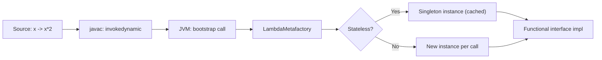

⚡ TL;DR - Lambda calculus is the minimal Turing-complete
language: variables, abstraction (lambda x.e), application
(e1 e2). Everything (booleans, numbers, loops, data structures)
is a function. Three reduction rules: alpha (rename bound
vars), beta (substitute argument), eta (function equivalence).
Foundation of all functional programming. Java lambdas are
syntactic sugar for lambda calculus. Y combinator = recursion
without named functions.

| #063 | Category: CS Fundamentals - Paradigms | Difficulty: ★★★ |
|:---|:---|:---|
| **Depends on:** | CSF-057 (Tail Recursion), CSF-035 (Higher-Order Functions) | |
| **Used by:** | CSF-062 (Church-Turing Thesis), CSF-064 (Type Theory), CSF-068 (Category Theory) | |
| **Related:** | CSF-062 (Church-Turing Thesis), CSF-057 (Tail Recursion), CSF-058 (Referential Transparency), CSF-064 (Type Theory) | |

---

### 🔥 The Problem This Solves

**WORLD WITHOUT IT:**

In 1930, Hilbert's Entscheidungsproblem asked: can every
mathematical question be decided algorithmically? To answer
this, mathematicians needed a FORMAL DEFINITION of "algorithm"
or "computable function." Without such a definition, you
cannot prove that something is NOT computable. You have
intuition but no rigor. Every argument about what algorithms
can do is hand-waving. Mathematics itself is on shaky ground:
the foundation must be formalized to prove results about provability.

**THE BREAKING POINT:**

Alonzo Church (1936) needed a formal system to prove the
Entscheidungsproblem is unsolvable. He invented LAMBDA CALCULUS:
a minimal formal system where functions are the only primitive.
By proving that certain problems cannot be expressed as lambda
terms that reduce to an answer, he proved computability limits.
Turing invented Turing machines independently for the same
purpose. Both found: there exist well-posed questions that no
algorithm can answer.

**SECONDARY VALUE - PROGRAMMING LANGUAGE FOUNDATION:**

Lambda calculus became the theoretical foundation for
functional programming languages. Lisp (1958) is essentially
lambda calculus with s-expressions. ML (1973) added types
(Hindley-Milner). Haskell (1990) made it practical at scale.
Java 8 (2014) added lambda expressions - syntactic sugar
for anonymous functions - making lambda calculus a practical
daily tool for millions of Java developers, most of whom
don't know that's what they're using.

---

### 📘 Textbook Definition

**Lambda calculus syntax (three constructs only):**
- **Variable:** x (a name representing a value)
- **Abstraction:** lambda x.e (function with parameter x, body e)
- **Application:** e1 e2 (apply function e1 to argument e2)

**Three reduction rules:**
1. **Alpha (alpha-equivalence):** lambda x.x = lambda y.y
   (renaming bound variables; names don't matter, only structure)
2. **Beta (beta-reduction):** (lambda x.e) v -> e[x := v]
   (substitute v for x in e; this is function application)
3. **Eta (eta-reduction):** lambda x. f x = f (when x not free in f)
   (a function that just applies f to its argument = f itself)

**Normal form:** An expression with no more beta-reductions
possible. Some expressions have no normal form (infinite reduction).

**Church encoding:** Representing data (booleans, numbers,
pairs) as pure functions:
- TRUE = lambda x. lambda y. x (returns first argument)
- FALSE = lambda x. lambda y. y (returns second argument)
- IF = lambda b. lambda t. lambda f. b t f (b selects t or f)
- 0 = lambda f. lambda x. x (apply f zero times)
- 1 = lambda f. lambda x. f x (apply f once)
- n = lambda f. lambda x. f^n x (apply f n times)

**Y combinator:** Fixed-point combinator. Enables recursion
without named functions:
Y = lambda f. (lambda x. f (x x)) (lambda x. f (x x))
Y f = f (Y f) (Y applied to f gives f applied to Y applied to f)

---

### ⏱️ Understand It in 30 Seconds

**One line:**
Lambda calculus: three things - variable, function, apply.
From these three, you can build ALL of computation.
`(lambda x.x)` is the identity function.
`(lambda x.x) 5` reduces to `5` (beta reduction).
Everything else - integers, booleans, loops, data structures - 
is built from functions applied to functions.

**One analogy:**

> Lambda calculus is to programming languages what atoms are
> to chemistry. You don't need 118 elements; you could (with
> enough combinations) build everything from just hydrogen
> (the most basic). Lambda calculus has three "atoms":
> variable, abstraction, application. Everything else in
> programming (integers, loops, data structures) is a compound
> molecule built from these three atoms. It's not efficient,
> but it proves computation can be reduced to these three things.

**One insight:**

Java 8's lambda expression `x -> x + 1` is syntactic sugar
for `lambda x.(x + 1)` in Church's 1936 notation. The Java
compiler translates it to an anonymous class or invokedynamic
bytecode. The mathematical concept is 78 years older than
the Java feature. Every time a Java developer writes `list.stream().map(x -> x * 2)`,
they are applying lambda calculus. Most Java developers learn
lambdas without ever knowing they're using a 1936 mathematical
formalism that proved the undecidability of the Entscheidungsproblem.

---

### 🔩 First Principles Explanation

**WHY FUNCTIONS ARE ENOUGH:**

```
┌──────────────────────────────────────────────────────┐
│ Lambda calculus proves: functions are universal.     │
│                                                      │
│ CHURCH ENCODING - encoding everything as functions:  │
│                                                      │
│ BOOLEAN TRUE  = lambda x. lambda y. x               │
│ BOOLEAN FALSE = lambda x. lambda y. y               │
│                                                      │
│ TRUE selects the first of two arguments.             │
│ FALSE selects the second of two arguments.           │
│ IF b t f = b t f (b selects t or f)                 │
│                                                      │
│ Zero  = lambda f. lambda x. x       (0 applications)│
│ One   = lambda f. lambda x. f x     (1 application) │
│ Two   = lambda f. lambda x. f (f x) (2 applications)│
│ (A Church numeral encodes n as "apply f n times")    │
│                                                      │
│ ADD = lambda m. lambda n. lambda f. lambda x.        │
│         m f (n f x)                                  │
│ (Apply f m times to (n f applied x))                 │
│                                                      │
│ Pairs (cons cells):                                  │
│ PAIR = lambda x. lambda y. lambda s. s x y           │
│ FIRST = lambda p. p TRUE                             │
│ SECOND = lambda p. p FALSE                           │
└──────────────────────────────────────────────────────┘
```

**REDUCTION ORDER MATTERS:**

```
┌──────────────────────────────────────────────────────┐
│ EVALUATION STRATEGIES:                               │
│                                                      │
│ APPLICATIVE ORDER (eager/strict):                    │
│   Evaluate arguments BEFORE applying function.       │
│   (lambda x. x + 1) (2 + 3)                         │
│   = (lambda x. x + 1) 5      [evaluate arg first]   │
│   = 5 + 1 = 6                                        │
│   Used by: Java, Python, C, ML, Lisp.                │
│   Problem: can diverge on non-terminating args       │
│   even if function doesn't use the argument.         │
│                                                      │
│ NORMAL ORDER (lazy):                                 │
│   Reduce outermost-leftmost first. Evaluate arg      │
│   only when needed (and only as many times as needed)│
│   (lambda x. 42) ((lambda x. x x)(lambda x. x x))  │
│   = 42             [arg is infinite loop, but unused]│
│   Used by: Haskell (call-by-need = lazy + memoize). │
│   Property: if normal form exists, normal order      │
│   WILL find it (completeness). Applicative order may │
│   diverge even when normal form exists.              │
└──────────────────────────────────────────────────────┘
```

---

### 🧪 Thought Experiment

**THE Y COMBINATOR AND RECURSION WITHOUT NAMES:**

Recursion requires a function to call itself BY NAME.
But in lambda calculus, functions are anonymous (lambdas
have no names). How do you do recursion?

The Y combinator:
`Y = lambda f. (lambda x. f (x x)) (lambda x. f (x x))`

Key property: `Y f = f (Y f)` (fixed point: Y applied to f
gives f applied to Y applied to f)

Using Y to compute factorial (conceptually):
```
FACT = Y (lambda self. lambda n.
         IF (ISZERO n)
           ONE
           (MULT n (self (PRED n))))
```

`Y` passes the function to itself, enabling recursion without
any named function. This is how anonymous lambda functions
can express general recursion. The Y combinator is the proof
that recursion is not a primitive - it's derived from
function application alone.

In Haskell: `fix f = f (fix f)` is the Y combinator.
In JavaScript: `const Y = f => (x => f(x(x)))(x => f(x(x)))`

---

### 🎯 Mental Model / Analogy

**THE SUBSTITUTION MODEL:**

Lambda calculus evaluation is SUBSTITUTION. When you apply
a function to an argument, you substitute the argument for
the parameter everywhere in the body. This is the mathematical
definition of function application - NOT: "call a subroutine,
pass a pointer, set a register." Just: substitute and simplify.

```
(lambda x. x + x) 5
= 5 + 5          [substitute 5 for x]
= 10             [arithmetic]
```

This substitution model is the basis for:
- REFERENTIAL TRANSPARENCY (CSF-058): an expression can always
  be replaced by its value (because evaluation IS substitution)
- EQUATIONAL REASONING: you can reason about programs the same
  way you reason about mathematical equations
- COMPILER OPTIMIZATIONS: if evaluation is substitution, the
  compiler can substitute (inline) function calls safely

**MEMORY HOOK:**

"Lambda calculus: three constructs (variable, abstraction, application).
Three reduction rules: alpha (rename bound vars), beta (substitute arg), eta (f = lambda x.f x).
Church encoding: booleans and numbers AS FUNCTIONS.
TRUE = return first. FALSE = return second. IF = apply boolean to branches.
n = apply f exactly n times.
Y combinator: fixed-point operator enabling anonymous recursion.
Evaluation strategies: applicative (eager, evaluate args first) vs normal (lazy, evaluate as needed).
Haskell: lazy (normal order + memoization = call-by-need).
Java lambdas: syntactic sugar. Real lambdas: 1936 math.
Foundation: Lisp, ML, Haskell, Scala, Kotlin, Java 8, Python lambdas."

---

### 📊 Gradual Depth - Five Levels

**Level 1 - Child:**
A lambda is a function without a name. In math: f(x) = x * 2.
In lambda calculus: lambda x. x * 2. You can apply it to
a number: (lambda x. x * 2) 3 = 3 * 2 = 6. That's it.
Functions are the only building block in lambda calculus.

**Level 2 - Student:**
Beta reduction step by step:
```
(lambda x. x + 1) 5
= 5 + 1          [beta: substitute 5 for x]
= 6              [arithmetic]

(lambda x. lambda y. x + y) 3 4
= (lambda y. 3 + y) 4    [beta: substitute 3 for x]
= 3 + 4                  [beta: substitute 4 for y]
= 7                      [arithmetic]
```

**Level 3 - Professional:**
How Haskell uses lambda calculus:
```haskell
-- Haskell function definition is syntactic sugar:
add :: Int -> Int -> Int
add x y = x + y
-- Desugars to lambda expression:
add = \x -> \y -> x + y
-- "Curried" function: one arg at a time.
-- All Haskell functions are curried lambdas.

-- The type signature `Int -> Int -> Int`
-- is right-associative: `Int -> (Int -> Int)`
-- add is a function from Int to (Int -> Int).
-- Partial application: `add 3` returns `\y -> 3 + y`
```

**Level 4 - Senior Engineer:**
Lambda calculus in JVM bytecode: Java 8 lambdas compile
to `invokedynamic` bytecode (JSR-292). The `LambdaMetafactory`
generates the lambda object at runtime (first call), then
caches it. The generated class is a functional interface.
This is NOT the same as allocating an anonymous class
at each use site (pre-Java-8 behavior). `invokedynamic`
allows the JVM to choose the optimal implementation.
For stateless lambdas (no captured variables): a single
instance is reused (effectively a constant). For capturing
lambdas: a new instance per capture. This distinction
affects GC pressure in hot paths.

**Level 5 - Expert:**
Debruijn indices: an alternative syntax for lambda calculus
that eliminates variable names. Instead of `lambda x. lambda y. x`,
write `lambda lambda 2` (the `2` refers to the variable bound
by the 2nd enclosing lambda, counting outward). This eliminates
alpha-equivalence as a concern: two terms are equal if and
only if their Debruijn representations are identical strings.
Used in: proof checkers (Coq, Agda), certified compilers (CompCert),
and lambda calculus normalization algorithms. The Coq proof
assistant internally uses Debruijn indices for term comparison.

---

### ⚙️ How It Works

**BETA REDUCTION ALGORITHM:**

```
┌──────────────────────────────────────────────────────┐
│ SUBSTITUTION e[x := v]:                              │
│                                                      │
│ y[x := v]           = v if y == x, else y            │
│ (lambda y.e)[x := v]= lambda y.(e[x := v])           │
│                       if y != x and y not free in v  │
│                       (CAPTURE-AVOIDING substitution)│
│ (e1 e2)[x := v]     = (e1[x := v]) (e2[x := v])     │
│                                                      │
│ WHY CAPTURE-AVOIDING:                                │
│ (lambda x. lambda y. x y)[x := y]                   │
│ Naive: lambda y. y y  <- WRONG: y captured!         │
│ With alpha-rename first:                             │
│ (lambda x. lambda z. x z)[x := y]                   │
│ = lambda z. y z       <- CORRECT                    │
└──────────────────────────────────────────────────────┘
```

---

### 💻 Code Example

**Example 1 - Wrong vs Right: Java Lambdas and Mutability**

```java
// BAD: Captured variable modification (compile error in Java)
int counter = 0;
Runnable bad = () -> counter++; // compile error:
// "local variables referenced from lambda must be final
// or effectively final"
// Why: lambda calculus semantics require substitution purity.
// Mutating a captured variable breaks referential transparency.

// ALSO BAD: Shared mutable state captured in parallel lambdas
List<Integer> results = new ArrayList<>(); // mutable, not thread-safe
IntStream.range(0, 1000).parallel().forEach(i ->
    results.add(i) // race condition: ArrayList not thread-safe
);
// Lambda is correct syntactically but wrong semantically.

// GOOD: Lambdas with immutable captures (lambda calculus spirit)
int base = 10; // effectively final
Function<Integer, Integer> addBase = x -> x + base; // pure function
// base is substituted into the lambda body. No mutation.

// GOOD: Parallel stream with pure reduction
List<Integer> list = IntStream.range(0, 1000)
    .boxed()
    .collect(Collectors.toList());
int sum = list.parallelStream()
    .mapToInt(x -> x)  // pure function (no captured mutable state)
    .sum();             // safe parallel reduction
```

**Example 2 - Church Encoding (Conceptual, in Java)**

```java
// Church-encoded booleans in Java (educational):
// TRUE = lambda x. lambda y. x
interface ChurchBool<T> {
    T apply(T trueVal, T falseVal);
}
// TRUE: return first argument
ChurchBool<Integer> TRUE = (t, f) -> t;
// FALSE: return second argument
ChurchBool<Integer> FALSE = (t, f) -> f;
// IF: b selects t or f
// if(b, then, else) = b(then, else)
System.out.println(TRUE.apply(1, 0));  // -> 1 (true selected)
System.out.println(FALSE.apply(1, 0)); // -> 0 (false selected)

// In practice: Java uses boolean primitives (much faster).
// Church encoding is educational: shows data CAN be encoded
// as functions. This insight drives:
// - Continuation-Passing Style (CPS): callbacks encode control flow
// - Visitor pattern: operations encoded as functions over data
// - ScalaZ/Cats: category theory encoded as type classes
```

**Example 3 - Y Combinator in JavaScript**

```javascript
// Y combinator: recursion without named functions
// (demonstrates that recursion is a derived concept)
const Y = f => (x => f(x => x(x)))(x => f(x => x(x)));
// Note: lazy Y combinator (prevent immediate infinite recursion)

// Factorial using Y combinator (no named recursion):
const factorial = Y(self => n => n <= 1 ? 1 : n * self(n-1));
console.log(factorial(5)); // -> 120

// Fibonacci using Y combinator:
const fib = Y(self => n => n <= 1 ? n : self(n-1) + self(n-2));
console.log(fib(10)); // -> 55

// Practical takeaway: the Y combinator shows that anonymous
// functions (lambdas) alone are sufficient for recursion.
// Named function definitions (function factorial(n) {...})
// are syntactic sugar for Y-combinator-style self-application.
```

---

### ⚖️ Comparison Table

| Feature | Lambda Calculus | Java 8 Lambda | Haskell Lambda | Lisp Lambda |
|---|---|---|---|---|
| Syntax | lambda x.e | x -> e | \x -> e | (lambda (x) e) |
| Currying | Built-in | Manual | Built-in | Manual/HOF |
| Evaluation | Lazy/eager | Eager | Lazy | Eager (CL/Scheme) |
| Church nums | Yes | No (int) | No (Int) | No (int) |
| Type system | Untyped | Typed (inference) | Typed (HM) | Dynamic |
| Recursion | Y combinator | Named method | Named fn/letrec | defun |

---

### 🔄 Flow / Lifecycle

**LAMBDA EXPRESSION IN JAVA (Compilation Pipeline)**

```
Source          Java Compiler       JVM at runtime
  │                  │                   │
  ▼                  ▼                   ▼
x -> x*2    invokedynamic       LambdaMetafactory
            bytecode             generates impl
                 │                   (1st call)
                 │                       │
                 ▼                       ▼
            bootstrap         cache the generated class
            method call       (stateless = singleton)
                                        │
                                        ▼
                              subsequent calls:
                              reuse cached impl
```



---

### ⚠️ Common Misconceptions

| Misconception | Reality |
|---|---|
| "Java lambdas are closures" | Java lambdas CANNOT capture mutable local variables. A true closure (in Lisp, JavaScript, Haskell) can close over mutable state. Java's "effectively final" constraint prevents this. Java lambdas can close over: (1) `this` reference (mutable object, but the reference is final). (2) Final or effectively-final local variables. (3) Instance fields (via `this`). This is NOT a full closure. The reason is the JVM's lambda implementation model: captured variables are passed as constructor arguments to the generated class. Mutable captures would require a mutable cell (array trick): `int[] counter = {0}; Runnable r = () -> counter[0]++;` This works but is poor practice (breaks lambda purity). |
| "Lambda calculus is the same as lambda expressions in Java/Python" | Lambda calculus is a mathematical formalism (1936). Language lambda expressions are syntactic sugar for anonymous functions. They share the concept but lambda calculus is: (1) UNTYPED (in its basic form): no types, everything is a function. (2) UNIVERSAL: Church encoding proves all data is expressible as functions. (3) PURE: no side effects; evaluation is substitution only. Java/Python lambdas are: (1) Typed (or dynamically typed in Python). (2) Not pure (can have side effects). (3) Operate on real data types (int, String, etc.), not Church-encoded functions. Java lambdas are inspired by lambda calculus but are not lambda calculus. |
| "The Y combinator is used in production code" | The Y combinator is primarily a theoretical construct. In production code: (1) Named functions/methods with explicit recursion are used. (2) The Y combinator is used in theoretical CS and in languages where all functions MUST be anonymous (rare). In JavaScript, the Y combinator is occasionally used as a puzzle or in DSL contexts (Ramda library has `R.once` and similar). Haskell's `Data.Function.fix` is the Y combinator, used for specific coinductive definitions. But `fix` is rare in production Haskell - named recursive functions are far more readable. The value of understanding Y combinator: proves recursion is NOT a primitive (it's derived from application), deepens understanding of fixed-point combinators and denotational semantics. |
| "Haskell is lazy because of lambda calculus" | Haskell uses lazy evaluation (call-by-need = normal order + memoization). Lambda calculus ALLOWS lazy evaluation (normal order is a valid reduction strategy for pure lambda calculus and is COMPLETE: always finds a normal form if one exists). But lambda calculus does not REQUIRE laziness. Haskell's designers chose laziness to get: (1) Infinite data structures (lazy lists). (2) Separation of producers and consumers. (3) Equational reasoning (referential transparency). Applicative order (eager evaluation) is also a valid strategy for lambda calculus (and is used by most languages). Laziness is a DESIGN CHOICE for Haskell, enabled by the purity of lambda calculus (no side effects -> safe to defer evaluation), not required by lambda calculus. |

---

### 🚨 Failure Modes & Diagnosis

**Failure Mode 1: Stack Overflow from Eager Evaluation of Infinite Structures**

**Symptom:** Java stream with an infinite source exhausts
stack or heap immediately.

```java
// BAD: Eager evaluation causes OOM
Stream<Integer> naturals = Stream.iterate(0, n -> n + 1);
List<Integer> all = naturals.collect(Collectors.toList()); // OOM!
// collect() forces eager evaluation of the infinite stream.

// GOOD: Lazy evaluation (Haskell's approach)
Stream<Integer> first10 = naturals.limit(10); // lazy pipeline
List<Integer> tenNums = first10.collect(Collectors.toList()); // OK
// limit() creates a lazy boundary. Only 10 elements computed.
```

**Root Cause:** Java streams are lazy until a terminal
operation (collect, forEach, reduce). `collect()` is a
terminal operation that forces evaluation. On an unbounded
stream, this means evaluating all elements = OOM.

**Diagnosis:**
```java
// Pattern: check if terminal operation is bounded
naturals.collect(...)       // terminal, unbounded = OOM
naturals.limit(10).collect(...)  // terminal, bounded = OK
naturals.filter(...).collect()   // terminal, filter doesn't bound
naturals.filter(...).findFirst() // terminal, bounded (first match)
```

---

**Failure Mode 2: Lambda Capture Creating Memory Leaks**

**Symptom:** Old gen fills up; lambda from short-lived context
holds reference to large object.

```java
// BAD: Lambda captures large object (transitive reference)
class RequestHandler {
    private byte[] largeBuffer = new byte[1024*1024]; // 1MB
    public Runnable createTask() {
        return () -> process(); // captures 'this'!
        // 'this' = RequestHandler = largeBuffer
        // If Runnable outlives RequestHandler: leak
    }
    private void process() { /* uses largeBuffer */ }
}
// When Runnable is cached or queued, it holds RequestHandler alive.
// largeBuffer cannot be GC'd even when handler is "done."

// GOOD: Extract only needed data into local (effectively final)
public Runnable createTask() {
    byte[] snapshot = Arrays.copyOf(largeBuffer, largeBuffer.length);
    return () -> processSnapshot(snapshot); // captures only snapshot
    // snapshot is independent of 'this'
}
// Or: lambda does not capture 'this' at all (static-like behavior).
```

**Security Note:**

Lambdas capturing sensitive data (credentials, tokens, PII)
can leak through thread pools or cached task queues. The lambda
holds a reference to the closure variable for the lifetime
of the lambda object. If the lambda is placed in a long-lived
queue (thread pool executor queue, cache), the sensitive data
lives until the lambda is dequeued and GC'd. Best practice:
clear sensitive data from lambda captures after use.
Never capture passwords or tokens in lambdas submitted to
thread pools or cache systems.

---

### 🔗 Related Keywords

**Prerequisites (understand these first):**
- `Tail Recursion` (CSF-057) - recursion mechanics that lambda calculus
  makes explicit (recursion as fixed-point application)
- `Higher-Order Functions` (CSF-035) - functions as first-class values
  which is the foundational concept of lambda calculus

**Builds On This (learn these next):**
- `Church-Turing Thesis` (CSF-062) - lambda calculus as one of the
  equivalent models proving the thesis
- `Type Theory` (CSF-064) - adding types to lambda calculus (System F,
  Hindley-Milner), the mathematical basis for typed FP languages
- `Category Theory for Programmers` (CSF-068) - lambda calculus as
  the categorical model of computation

---

### 📌 Quick Reference Card

```
┌────────────────────────────────────────────────────────┐
│ SYNTAX       │ Variable, Abstraction (lx.e), Application│
│              │ Only 3 constructs needed               │
├──────────────┼─────────────────────────────────────────┤
│ RULES        │ Alpha: rename bound vars (structural)  │
│              │ Beta: substitute arg (computation)      │
│              │ Eta: lx.f x = f (function identity)    │
├──────────────┼─────────────────────────────────────────┤
│ CHURCH ENC   │ TRUE = lx.ly.x  FALSE = lx.ly.y        │
│              │ n = apply f exactly n times             │
├──────────────┼─────────────────────────────────────────┤
│ Y COMBINATOR │ Fixed point: Y f = f (Y f)              │
│              │ Recursion without named functions        │
├──────────────┼─────────────────────────────────────────┤
│ EVAL         │ Applicative (eager): eval args first    │
│              │ Normal (lazy): eval body first           │
├──────────────┼─────────────────────────────────────────┤
│ HASKELL      │ Lazy (normal order + memoize)           │
│              │ All functions = curried lambdas          │
├──────────────┼─────────────────────────────────────────┤
│ JAVA         │ Lambda -> invokedynamic bytecode        │
│              │ LambdaMetafactory generates impl        │
├──────────────┼─────────────────────────────────────────┤
│ NEXT EXPLORE │ CSF-064 (Type Theory), CSF-068 (Cat Th) │
└────────────────────────────────────────────────────────┘
```

**If you remember only 3 things:**

1. Lambda calculus has three constructs: variable, abstraction
   (lambda x.e), application (e1 e2). Three reduction rules:
   alpha (rename bound vars), beta (substitute argument for
   parameter), eta (lambda x.f x = f). Everything - booleans,
   numbers, lists, recursion - is encoded as functions.
   Church encoding: TRUE = select first argument, FALSE = select
   second argument. Church numerals: n = "apply f n times."
   This proves functions alone are sufficient for all computation.
2. The Y combinator `Y = lambda f.(lambda x.f(x x))(lambda x.f(x x))`
   implements recursion without named functions. Property: Y f = f(Y f).
   This is the mathematical proof that recursion is not a primitive
   language feature - it's a DERIVED concept from function application.
   Understanding Y combinator = understanding that anonymous functions
   are as powerful as named recursive functions.
3. Evaluation order determines behavior with non-terminating
   expressions. Applicative order (eager, Java/Python/C): evaluate
   arguments FIRST, then apply. If an argument doesn't terminate,
   the whole expression doesn't terminate even if the function
   doesn't use that argument. Normal order (lazy, Haskell): evaluate
   the function body first, substitute argument lazily. If normal
   form exists, normal-order evaluation WILL find it. This is why
   Haskell can work with infinite data structures (lazy lists):
   the "tail" of the infinite list is not evaluated until needed.

**Interview one-liner:**
"Lambda calculus: three constructs (var, abstraction lambda x.e, application e1 e2),
three reduction rules (alpha rename, beta substitute, eta simplify). Everything
encoded as functions: booleans select first/second, Church numerals apply f n times.
Y combinator: fixed-point combinator enabling anonymous recursion. Evaluation:
applicative (eager, evaluate args first) vs normal (lazy, body first - Haskell).
Foundation of all functional programming languages. Java lambdas: invokedynamic bytecode."

---

### 💎 Transferable Wisdom

**Reusable Engineering Principle:**
Lambda calculus teaches: DATA CAN BE ENCODED AS BEHAVIOR.
Church encoding shows that booleans, numbers, and pairs are
just functions with specific selection behavior. This principle
appears repeatedly in engineering: the Visitor pattern (behavior
encoded as data/object), Continuation-Passing Style (control
flow encoded as callbacks), Higher-Order Functions (algorithms
parameterized by behavior), and React's functional component
model (UI = function from state to view). When you see a
design problem where "data and behavior need to be interchangeable,"
lambda calculus gives the theoretical basis: behavior is the
primitive; data is derived.

**Where else this pattern appears:**

- **Continuation-Passing Style (CPS) and async/await** - CPS is
  a program transformation (originally from lambda calculus research)
  where every function takes an extra "continuation" argument
  representing "what to do next." JavaScript's async/await desugars
  to CPS: `await promise` becomes "when promise resolves, call this
  continuation with the result." The Promise/future model is lambda
  calculus applied: a future is a function from "callback" to "void."
  Understanding lambda calculus (and CPS transformation) makes async
  programming intuitive: you're explicitly threading continuations
  instead of hiding them in stack frames. React's `useState` hook
  follows the same pattern: state update is a continuation (a function
  called after state changes propagate).
- **Property-Based Testing (QuickCheck, jqwik)** - QuickCheck (Haskell)
  and jqwik (Java) use lambda calculus concepts: a property is a
  function from generated values to boolean. The testing framework
  generates lambda-applied inputs. Shrinking (finding the minimal
  failing case) uses the lambda as a specification: repeatedly apply
  smaller inputs until the minimal failing one is found. The property-
  based testing approach is: describe behavior as a FUNCTION (lambda)
  from input to expected outcome. The test framework generates inputs
  and applies the lambda. This is church-encoding of test specifications:
  tests as first-class functions, not procedures.
- **React and functional component model** - React's functional component
  is a direct application of lambda calculus. A component is:
  `component = props -> UI`. A pure function from props (input) to
  virtual DOM (output). React hooks (useState, useEffect) introduce
  controlled side effects at the boundaries - exactly like Haskell's
  IO monad. React's reconciliation algorithm (diffing) works because
  components are PURE functions: same props -> same output -> safe
  to reuse, memoize, and diff. The `React.memo()` higher-order component
  is literal memoization of the lambda. `useCallback` prevents lambda
  recreation (referential equality for functional dependencies).
  The React paradigm IS lambda calculus applied to UI: functions all
  the way down, with controlled effects at the boundaries.

---

### 💡 The Surprising Truth

Lambda calculus has exactly THREE syntactic forms and THREE
reduction rules. It is arguably the SMALLEST complete programming
language ever invented. And yet: Church proved that Church
numerals (numbers as functions), Church booleans (TRUE/FALSE
as selection functions), Church pairs (cons cells as function
application patterns), and the Y combinator (recursion as
fixed point) are sufficient to express ALL computable functions.
The entire expressiveness of Java (with its type system, OOP,
lambdas, generics, reflection) can be SIMULATED in lambda
calculus with three constructs. This is not practical (lambda
calculus computation of factorial(10) would require astronomical
beta reductions), but it is mathematically exact. The implication:
every programming language feature you use (classes, interfaces,
generics, for loops, arrays) is SYNTACTIC SUGAR for combinations
of lambda, variable, and application. The richness of modern
programming languages is convenience, not necessity. Three symbols
are enough.

---

### ✅ Mastery Checklist

**You've mastered this when you can:**

1. **[REDUCE]** Perform beta reduction by hand on:
   (a) `(lambda x. lambda y. x + y) 3 4`
   (b) `(lambda x. x x) (lambda x. x x)` (explain what happens)
   (c) `(lambda x. lambda y. x) 5 diverges` (evaluate, explain)

2. **[CHURCH]** Implement Church-encoded booleans in Java
   (without using `boolean` primitive). Implement AND, OR, NOT
   using only function application on ChurchBool objects.

3. **[Y-COMBINATOR]** Explain why the Y combinator enables
   recursion without named functions. Trace through one step
   of `Y factorial 3` using the definition of Y.

4. **[JAVA-LAMBDA]** Explain what the JVM does when compiling
   `x -> x + 1` in Java. What is `invokedynamic`? When does
   LambdaMetafactory create a singleton vs a new instance?

5. **[EVALUATION]** Given `(lambda x. 1) ((lambda x. x x)(lambda x. x x))`:
   (a) Evaluate with applicative order (eager). What happens?
   (b) Evaluate with normal order (lazy). What is the result?
   (c) Which evaluation strategy is "complete"? Why?

---

### 🧠 Think About This Before We Continue

**Q1.** If lambda calculus is Turing-complete with only three
syntactic constructs, why do programming languages add hundreds
of features? What is the purpose of syntax sugar if lambda
calculus is sufficient?

*Hint: Lambda calculus is sufficient for COMPUTABILITY but not for
USABILITY, PERFORMANCE, or SAFETY:
(1) READABILITY: `for (int i = 0; i < n; i++) sum += i` is far
    more readable than the equivalent Church-encoded lambda expression.
    Humans process imperative iteration more easily than functional composition.
(2) PERFORMANCE: Church numerals are grossly inefficient. Adding 5 + 3
    in Church encoding requires 8 beta reductions to produce "8".
    Adding two 64-bit integers takes one CPU instruction.
    Modern languages map directly to CPU operations. Lambda calculus
    abstracts away hardware; language features bring it back efficiently.
(3) TYPE SAFETY: Untyped lambda calculus allows applying any term
    to any term (`TRUE TRUE` is syntactically valid). Typed lambda calculus
    (System F, Hindley-Milner) adds types to catch errors statically.
    This requires additional syntax (type annotations, type signatures).
(4) TOOLABILITY: Features like named functions, modules, and packages
    make code navigable and maintainable. Lambda calculus has no module
    system. Engineering at scale requires organizational structure.
(5) FAMILIARITY: Most programmers learn OOP before functional programming.
    Features like classes, methods, and loops leverage mental models
    from prior education.
Lesson: lambda calculus proves "what is computable" (theoretical floor).
Language features improve "how humans work with computation" (practical ceiling).
The three constructs are the MATHEMATICAL CORE; everything else serves humans.*

**Q2.** Java requires captured variables in lambdas to be
"effectively final." Haskell closures can close over mutable
references (IORef). Explain this difference in terms of lambda calculus semantics.

*Hint: Lambda calculus is PURE: evaluation is substitution.
Beta reduction substitutes a value for a variable - once. The
"value" is fixed at capture time. There is no concept of
a variable changing after capture.
Java's lambda captures follow this model: the captured value
is substituted into the lambda body at the point of lambda
CREATION. "Effectively final" ensures the substituted value
doesn't change after capture - maintaining the substitution semantics.
If Java allowed mutable captures, it would break the substitution model:
the lambda body's behavior would depend on WHEN it is called
(because the captured variable could have changed). This breaks
referential transparency.
Haskell's IORef: Haskell IS lambda calculus (pure). But IORef is a
reference (a box containing a value) in the IO monad. Closing over an
IORef means closing over the REFERENCE (box), not the value.
The reference (box) IS the captured value, and it IS effectively final.
What changes is what's INSIDE the box. Haskell's type system makes this
explicit: IORef Int is a REFERENCE TYPE. You close over the reference
(final), and you read/write through it via IO actions.
Java's equivalent: closing over a `final AtomicInteger counter` -
the reference is final (captured), the integer inside changes.
This is valid in both Java and Haskell.
The "effectively final" constraint in Java prevents closing over
a variable that the BINDING ITSELF changes (reassignment).
It does not prevent closing over a mutable object (whose state changes).*

---

### 🎯 Interview Deep-Dive

**Q1: "What is the Y combinator and why does it matter for programming languages?"**

*Why they ask:* Tests theoretical depth. Senior/staff level. Rare in interviews but impressive when understood.

*Strong answer includes:*
- Definition: a fixed-point combinator that enables anonymous recursion.
  `Y f = f (Y f)`. Allows expressing recursive functions as anonymous lambdas.
- Why it matters: proves recursion is NOT a primitive. Named function
  definitions with recursive calls are syntactic sugar. Any recursive function
  can be expressed as a lambda applied to Y. This insight is fundamental
  to: (1) Denotational semantics (recursive function = fixed point of a functional),
  (2) Compiler transformations (CPS converts recursion to tail calls),
  (3) Understanding lazy evaluation (Y combinator diverges in strict evaluation,
  requires laziness or the "lazy Y variant" in strict languages).
- Haskell: `fix f = let x = f x in x` (the lazy Y combinator using `let`).
- JavaScript lazy variant: `const Y = f => (x => f(v => x(x)(v)))(x => f(v => x(x)(v)))`

**Q2: "Why does Haskell use lazy evaluation? Is lambda calculus lazy?"**

*Why they ask:* Tests understanding of evaluation strategy theory.

*Strong answer includes:*
- Lambda calculus allows both strategies. Normal order (lazy) is COMPLETE:
  if a normal form exists, normal order finds it. Applicative order (eager)
  is NOT complete: it may diverge even when a normal form exists (if an unused
  argument doesn't terminate). Haskell chose lazy for correctness guarantees
  and expressiveness (infinite structures).
- Lazy = call-by-need = normal order + memoization. An argument is evaluated
  at most once (memoized) and only if needed.
- Trade-offs: lazy = harder to reason about memory usage (lazy thunks accumulate),
  harder to predict when side effects occur. Eager = predictable performance,
  predictable side effect timing. This is why Haskell isolates side effects
  in IO monad: lazy evaluation + arbitrary side effects is unmanageable.
  Pure lazy evaluation (no side effects) is safe and well-reasoned.
- GHC optimization: `seq`, `deepseq`, bang patterns (`!`) force strict evaluation
  for performance-critical paths where lazy thunk overhead hurts.
