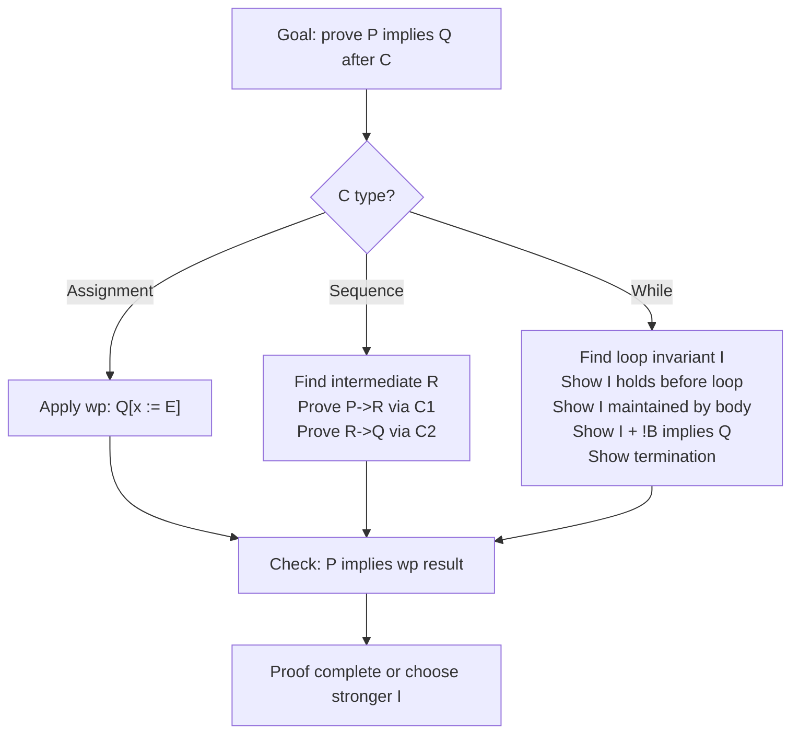

⚡ TL;DR - Formal semantics gives programs mathematical
meaning (not just what they DO but what they ARE). Three
approaches: (1) Operational = execute step-by-step (small-step:
reduction rules; big-step: final value). (2) Denotational =
map programs to math objects (functions on domains). (3)
Axiomatic = what properties hold (Hoare logic: {P} C {Q}).
JVM spec uses operational semantics. Hoare logic = basis for
code correctness proofs and design-by-contract (DbC).

| #065 | Category: CS Fundamentals - Paradigms | Difficulty: ★★★ |
|:---|:---|:---|
| **Depends on:** | CSF-063 (Lambda Calculus), CSF-064 (Type Theory) | |
| **Used by:** | CSF-076 (Formal Reasoning in Software), CSF-077 (Software Correctness and Proof) | |
| **Related:** | CSF-063 (Lambda Calculus), CSF-064 (Type Theory), CSF-076 (Formal Reasoning), CSF-077 (Software Correctness) | |

---

### 🔥 The Problem This Solves

**WORLD WITHOUT IT:**

Imagine describing a programming language by saying "the
meaning of `x = 5` is: x now has value 5." This is circular
(defined using the programming language itself). Two compiler
implementors read the same language spec, build different
compilers, and they disagree: does `f(a, b)` evaluate `a`
before `b` or `b` before `a`? The spec says "evaluate the
arguments" - but in what order? The spec is INFORMAL. Without
formal semantics, language specifications are English prose
full of ambiguity. Compilers are correct "by intuition."
Testing is the only way to find disagreements. There is no
way to prove two implementations are equivalent or that
an optimization preserves program meaning.

**THE BREAKING POINT:**

C's evaluation order for function arguments is UNSPECIFIED.
`f(++x, ++x)` has undefined behavior in C: the compiler can
evaluate the two `++x` expressions in any order. The C standard
uses the term "undefined behavior" for situations where the
language spec makes NO formal claim about program behavior.
There are over 200 forms of undefined behavior in C. Compilers
exploit undefined behavior for optimization (since the spec
gives no constraint to preserve). This is the consequence of
no formal semantics: the language is defined by a document
that cannot be reasoned about formally, so compilers treat
informal rules as optimization opportunities.

**THE INVENTION MOMENT:**

Peter Landin (1960s): operational semantics for Algol.
Scott and Strachey (1970): denotational semantics, domain theory.
Tony Hoare (1969): axiomatic semantics (Hoare logic) in "An
Axiomatic Basis for Computer Programming." Hoare's paper is
one of the most cited in CS: it introduced the Hoare triple
{P} C {Q} (if precondition P holds before executing C, and C
terminates, then postcondition Q holds after). This is the
basis for: Design by Contract (Bertrand Meyer, Eiffel language),
JML (Java Modeling Language), Dafny (Microsoft verification
language), and formal verification of cryptographic protocols.

---

### 📘 Textbook Definition

**Formal semantics:** A mathematical definition of the meaning
of program constructs. Provides: (1) Unambiguous specification
of language behavior. (2) Formal reasoning about program
properties. (3) Proof that two programs are equivalent.
(4) Proof that an optimization preserves semantics.

**Operational semantics:**
Defines meaning by EXECUTION RULES:
- Small-step (structural/reduction semantics): e -> e' (e reduces to e' in one step). Models individual computation steps. Good for modeling concurrency.
- Big-step (natural semantics): e => v (e evaluates to final value v). Models overall computation result. Simpler for sequential programs.

**Denotational semantics:**
Defines meaning by MATHEMATICAL OBJECTS:
[[e]] rho = math-object (expression e evaluated in environment rho = a mapping from variables to values)
[[5]] rho = 5
[[x]] rho = rho(x)
[[e1 + e2]] rho = [[e1]] rho + [[e2]] rho
Programs denote FUNCTIONS (from program state to values).
Domain theory (Scott) provides the mathematical framework for
recursive definitions (fixed points in complete partial orders).

**Axiomatic semantics (Hoare logic):**
Defines meaning by PROOF RULES:
Hoare triple: {P} C {Q} where P = precondition, C = command, Q = postcondition
- {true} x := 5 {x = 5} (assignment axiom)
- {P} C1 {R}, {R} C2 {Q} => {P} C1; C2 {Q} (sequential composition)
- {P & B} C {P} => {P} while B do C {P & !B} (while loop invariant)
Weakest precondition: wp(C, Q) = the weakest P such that {P} C {Q} holds.

---

### ⏱️ Understand It in 30 Seconds

**One line:**
Three ways to say what a program MEANS:
(1) Show how it runs (operational).
(2) Map it to math objects (denotational).
(3) Prove what properties it has (axiomatic).
All three agree for well-defined programs.

**One analogy:**

> Describing a recipe in three ways:
> (1) Operational: "crack 2 eggs into bowl, add 1 cup flour, stir 3 minutes..."
>     (step-by-step execution)
> (2) Denotational: "this recipe denotes the function: ingredients -> a bread with
>     density d, crumb structure c, crust hardness h..."
>     (map recipe to mathematical object: the bread it produces)
> (3) Axiomatic: "if you start with fresh eggs and unbleached flour {precondition},
>     after following the recipe {program}, the bread will be moist and firm {postcondition}"
>     (properties that hold before/after)

**One insight:**

The JVM specification uses OPERATIONAL SEMANTICS: it defines
the behavior of each bytecode instruction as a sequence of
transitions on the JVM state (stack, local variables, heap).
This is why the JVM specification is precise enough to be
implemented consistently across JVM implementations (HotSpot,
OpenJ9, Azul Zing). They all implement the same operational
semantics. Without this, two JVM implementations could be
"compatible" at the bytecode level but have subtly different
behavior for corner cases.

---

### 🔩 First Principles Explanation

**SMALL-STEP VS BIG-STEP OPERATIONAL SEMANTICS:**

```
┌──────────────────────────────────────────────────────┐
│ EXPRESSION: (2 + 3) * (1 + 4)                        │
│                                                      │
│ SMALL-STEP (structural reduction):                   │
│ (2+3) * (1+4) -> 5 * (1+4)  [reduce left addition]  │
│ 5 * (1+4) -> 5 * 5          [reduce right addition] │
│ 5 * 5 -> 25                  [reduce multiplication]│
│                                                      │
│ Each -> is one reduction step.                       │
│ Fully explicit execution trace.                      │
│ Good for: modeling non-determinism, concurrency,     │
│   intermediate states, debugging stuck states.       │
│                                                      │
│ BIG-STEP (natural semantics):                        │
│ 2+3 => 5  (left subexpr evaluates to 5)             │
│ 1+4 => 5  (right subexpr evaluates to 5)            │
│ (2+3)*(1+4) => 25  (by the multiplication rule)    │
│                                                      │
│ Each => is "evaluate this expression, get this value"│
│ No intermediate states visible.                      │
│ Good for: sequential programs, simple languages.     │
└──────────────────────────────────────────────────────┘
```

**HOARE LOGIC - WEAKEST PRECONDITION:**

```
┌──────────────────────────────────────────────────────┐
│ ASSIGNMENT RULE:                                     │
│ wp(x := E, Q) = Q[x := E]                           │
│ (The weakest precondition for x:=E to ensure Q       │
│  is Q with x replaced by E)                          │
│                                                      │
│ Example: What must hold before x := x+1              │
│          to ensure x > 5 after?                      │
│ wp(x := x+1, x > 5) = (x+1 > 5) = (x > 4)          │
│ Answer: x > 4 must hold before x := x+1              │
│                                                      │
│ SEQUENTIAL COMPOSITION:                              │
│ wp(C1; C2, Q) = wp(C1, wp(C2, Q))                   │
│ (work backwards from postcondition)                  │
│                                                      │
│ LOOP INVARIANT:                                      │
│ {INV & B} body {INV} => {INV} while B {INV & !B}    │
│ INV must: hold initially, be maintained by body,     │
│           be strong enough to prove the goal after.  │
└──────────────────────────────────────────────────────┘
```

---

### 🧪 Thought Experiment

**THE VERIFICATION OF JAVA'S COMPARETO CONTRACT:**

Java's `Comparator` contract (from the documentation):
```
The implementor must ensure that sgn(compare(x, y)) ==
-sgn(compare(y, x)) for all x and y.
The implementor must also ensure that the relation is
transitive: ((compare(x, y) > 0) && (compare(y, z) > 0))
implies compare(x, z) > 0.
```
This is AXIOMATIC SEMANTICS in Java's API documentation!
{precondition: comparator is implemented correctly}
{code: sort using this comparator}
{postcondition: list is sorted by this comparator}

But the Java spec does not ENFORCE these axioms. A buggy
comparator (one that violates transitivity) can cause
`Collections.sort` to produce incorrect results or even
throw exceptions (observed in Java's TimSort with certain
illegal comparators). Formal verification would encode these
axioms in a specification language and prove the comparator
implementation satisfies them before allowing its use.
This gap - between informal documentation and formal
specification - is where most subtle Java bugs live.

---

### 🎯 Mental Model / Analogy

**DENOTATIONAL SEMANTICS - PROGRAMS AS FUNCTIONS:**

```
┌──────────────────────────────────────────────────────┐
│ Denotational: a program IS a mathematical function.  │
│                                                      │
│ Simple program:                                      │
│ int doubleIt(int x) { return x * 2; }               │
│                                                      │
│ Denotation: [[doubleIt]] = the function Z -> Z       │
│             mapping every integer to its double.     │
│             [[doubleIt]] = {0->0, 1->2, 2->4, ...}  │
│             [[doubleIt]] n = 2n (as a math function) │
│                                                      │
│ Two programs are equivalent if their denotations are │
│ equal as mathematical functions:                     │
│   int slow(int x) { int r=0; for(int i=0;i<x;i++)  │
│                      r+=2; return r; }               │
│   [[slow]] = [[doubleIt]] = the same function 2n    │
│   Denotationally equivalent (same mathematical fn)  │
│                                                      │
│ RECURSIVE PROGRAMS:                                  │
│   Fixed points in domain theory.                     │
│   [[factorial]] = lfp(f.lambda n.n<=0?1:n*f(n-1))  │
│   (least fixed point of the functional)              │
│   This gives factorial a unique mathematical meaning │
│   even though it is defined recursively.             │
└──────────────────────────────────────────────────────┘
```

**MEMORY HOOK:**

"Three formal semantics: Operational (HOW), Denotational (WHAT), Axiomatic (WHICH).
Operational: execution rules. Small-step: e->e'. Big-step: e=>v.
Denotational: programs = math functions. Domain theory for recursion.
Axiomatic: Hoare triples {P} C {Q}. Precondition, command, postcondition.
Weakest precondition: wp(x:=E, Q) = Q[x:=E] (substitute backwards).
Loop invariant: holds before, maintained by body, implies goal after loop.
JVM spec: operational semantics (each bytecode = transition rule).
Design by Contract (DbC): axiomatic in code (requires/ensures annotations).
Program equivalence: denotational (same math function = equivalent programs)."

---

### 📊 Gradual Depth - Five Levels

**Level 1 - Child:**
Three ways to describe a robot (program):
1. Show the robot's instructions step by step (operational).
2. Say what the robot builds when finished (denotational).
3. Write down rules: "if you gave it clean parts {P}, and it
   runs the program {C}, the robot always makes a clean toy {Q}" (axiomatic).

**Level 2 - Student:**
Hoare triple examples:
```
{x = 5}             -- precondition: x is 5
x := x + 1;        -- program
{x = 6}             -- postcondition: x is 6

{x > 0}             -- precondition: x positive
y := x * x;        -- program
{y > 0}             -- postcondition: y positive (x^2 > 0 when x > 0)

{true}              -- precondition: always true
x := 5;            -- program
{x = 5}             -- postcondition: x is 5
```

**Level 3 - Professional:**
Loop invariant for a Java for-loop (proof that the loop computes the sum):
```java
// Method: compute sum of int[] a
// Pre: a != null
// Post: result == sum of all elements in a
int sum = 0;
// Invariant: sum = a[0] + ... + a[i-1]
for (int i = 0; i < a.length; i++) {
    // Inv: sum = a[0] + ... + a[i-1]
    sum += a[i];
    // Inv: sum = a[0] + ... + a[i] (maintained)
}
// Inv + (i == a.length): sum = a[0] + ... + a[a.length-1]
// = sum of all elements. Loop invariant proves correctness.
```

**Level 4 - Senior Engineer:**
Java Modeling Language (JML) - axiomatic semantics in Java:
```java
// JML annotations (checked by ESC/Java or OpenJML):
/*@ requires a != null && a.length > 0;
  @ ensures \result == (\sum int i; 0 <= i < a.length; a[i]);
  @*/
public int sum(int[] a) {
    int s = 0;
    /*@ maintaining s == (\sum int j; 0 <= j < i; a[j]);
      @ decreases a.length - i;
      @*/
    for (int i = 0; i < a.length; i++) {
        s += a[i];
    }
    return s;
}
// JML formalizes: @requires = precondition, @ensures = postcondition
// @maintaining = loop invariant, @decreases = termination argument
```

**Level 5 - Expert:**
Semantic equivalence and compiler optimizations:
A compiler optimization is SEMANTICALLY CORRECT if it
transforms a program to one with the SAME denotational semantics
(same input-output behavior for all inputs). This is how
CompCert (a formally verified C compiler written in Coq) is
proved correct: every optimization pass preserves the
denotational semantics of the compiled program. The Coq
proof covers: register allocation, instruction scheduling,
loop optimization. The result: CompCert-compiled C programs
are provably free of compiler-introduced bugs. Used in
safety-critical avionics and medical devices (DO-178C level A).
This is the ultimate payoff of formal semantics: the compiler
ITSELF is formally verified.

---

### ⚙️ How It Works

**SMALL-STEP SEMANTICS FOR ARITHMETIC:**

```
┌──────────────────────────────────────────────────────┐
│ REDUCTION RULES (formal):                            │
│                                                      │
│ Arithmetic reduction:                                │
│ n1 + n2 -> n (if n = n1 + n2, arithmetic)            │
│ e1 + e2 -> e1' + e2 (if e1 -> e1')  [left first]    │
│ n1 + e2 -> n1 + e2' (if e2 -> e2')  [n1 is a value] │
│                                                      │
│ This defines EVALUATION ORDER:                       │
│ - Left argument is evaluated first (e1 before n1+e2) │
│ - A value (n1) does not reduce further               │
│ - These rules are deterministic: one applicable rule │
│   at most at each step                               │
│                                                      │
│ STUCK STATES:                                        │
│ "true + 5" -> no rule applies! STUCK.                │
│ Type systems prevent stuck states:                   │
│ "if e is well-typed, it never gets stuck"            │
│ (type safety = progress + preservation theorem)      │
└──────────────────────────────────────────────────────┘
```

---

### 💻 Code Example

**Example 1 - Wrong vs Right: Missing Loop Invariant (Incorrect Sort)**

```java
// BAD: Comparator that violates axiomatic contract (no formal spec)
Comparator<Task> buggyPriority = (t1, t2) -> {
    if (t1.isUrgent() && t2.isNormal()) return -1;
    if (t1.isNormal() && t2.isUrgent()) return 1;
    // Missing: case where both are urgent or both normal -> 0
    return -1; // BUG: always returns -1 if not the above cases!
    // Violates antisymmetry: compare(x,y) > 0 => compare(y,x) < 0
    // With this bug: compare(x,x) = -1 (should be 0)
};
tasks.sort(buggyPriority); // TimSort may throw IllegalArgumentException
// Or: sort result is incorrect/unpredictable.

// GOOD: Comparator with explicit axiomatic contract in comments
// Precondition: t1, t2 are valid Task objects (non-null)
// Postcondition: returns negative if t1 < t2, 0 if equal, positive if t1 > t2
// Invariant: antisymmetric, transitive, consistent with equals
Comparator<Task> correctPriority = (t1, t2) ->
    Integer.compare(t2.getPriority(), t1.getPriority());
// Integer.compare already satisfies all Comparator axioms.
// Priority: higher number = higher priority -> reverse order.
tasks.sort(correctPriority); // correct, stable sort
```

**Example 2 - Hoare Logic via JML-Style Comments**

```java
// Applying axiomatic semantics (Hoare logic) to Java code:

// Binary search with formal preconditions/postconditions:
// Pre: a is sorted (forall i < j: a[i] <= a[j])
//      target is a value to search for
// Post: returns index i where a[i] == target,
//       or -1 if target not in a

// Loop invariant: if target is in a, then
//   target is in a[low..high] (inclusive)
int binarySearch(int[] a, int target) {
    int low = 0, high = a.length - 1;
    // INV: target in a[0..n-1] => target in a[low..high]
    while (low <= high) {
        int mid = low + (high - low) / 2; // avoids overflow
        // INV holds here (check: mid is in [low, high])
        if (a[mid] == target) return mid;
        if (a[mid] < target) {
            low = mid + 1;
            // INV maintained: target not in a[low-1..mid]
        } else {
            high = mid - 1;
            // INV maintained: target not in a[mid..high+1]
        }
    }
    // Loop ends: low > high. If target in array, INV says
    // it's in a[low..high] = empty range. Contradiction.
    // Therefore: target not in array.
    return -1;
}
// Axiomatic proof: precondition + invariant + termination
// (high - low decreases each iteration) => postcondition guaranteed.
```

---

### ⚖️ Comparison Table

| Approach | What it defines | Best for | Tool examples |
|---|---|---|---|
| Operational (small-step) | Step-by-step transitions | Concurrency, debuggers | JVM spec, K framework |
| Operational (big-step) | Final value of expression | Sequential languages | Natural semantics proofs |
| Denotational | Math function denoted | Equivalence proofs, optimization | Scott domains, Haskell denotation |
| Axiomatic (Hoare) | Pre/postcondition pairs | Correctness proofs, contracts | JML, Dafny, KeY verifier |
| Axiomatic (wp) | Weakest precondition | Automated verification | Dafny, Frama-C, Why3 |

---

### 🔄 Flow / Lifecycle

**HOARE LOGIC PROOF STRUCTURE:**

```
 Goal: prove {P} C {Q}

 For sequential {P} C1; C2 {Q}:
   Find R (mid-condition):
   Prove {P} C1 {R}
   Prove {R} C2 {Q}

 For while loop {I} while B do C {I & !B}:
   Find invariant I:
   Prove I holds initially
   Prove {I & B} C {I} (I maintained)
   Verify I & !B implies goal
   Prove loop terminates (decreasing metric)
```



---

### ⚠️ Common Misconceptions

| Misconception | Reality |
|---|---|
| "Formal semantics is only for academics, not for industry" | The JVM specification is written in operational semantics. The RISC-V instruction set architecture specification uses formal semantics (Sail language). CompCert is a formally verified C compiler used in avionics. Dafny (Microsoft) and F* are used to verify cryptographic protocols (SHA-3 implementation verified in F*). SPARK Ada (used in avionics and defense) enforces Hoare triples via its contract system. The DO-178C standard for aviation software requires formal methods for the highest safety levels. Formal semantics is an industry tool in safety-critical and security-critical domains. |
| "Hoare logic requires proving everything, which is too expensive" | Hoare logic can be applied at MULTIPLE DEPTHS: (1) Full formal proof (expensive, for critical components). (2) JML/contract annotations for documentation + runtime checking (moderate cost). (3) Design by Contract (preconditions checked with assert/require) for development-time bug finding (low cost). (4) Loop invariant comments for code review and reasoning (near-zero cost). You don't need to formally prove everything. Even informal Hoare-style thinking ("what must be true here, what will be true after?") improves code quality. The full formal proof is reserved for security-critical or safety-critical code. |
| "Two programs are equivalent if they produce the same outputs for the test cases" | Testing proves presence of bugs, not absence. Two programs are SEMANTICALLY EQUIVALENT (denotationally) if they denote the SAME MATHEMATICAL FUNCTION: for ALL possible inputs, they produce the same output (and the same side effects in an appropriate denotational model). No finite test suite can prove this. Formal equivalence requires either: (1) Denotational proof (both denote the same function). (2) Bisimulation (operational: every step of one can be matched by the other). (3) Refinement (one is a more detailed version of the other, preserving all observable behavior). Property-based testing approximates this: it generates random inputs to find counterexamples to equivalence. But it's still not a proof. |
| "Denotational semantics is the only 'real' mathematical semantics" | All three approaches are equally rigorous mathematically. They are COMPLEMENTARY: (1) Operational: intuitively matches how programs execute; good for implementation. (2) Denotational: good for program equivalence and mathematical reasoning. (3) Axiomatic: good for specification and verification. The EQUIVALENCE THEOREM (for most languages): a program has operational semantics S if and only if its denotational meaning is the function corresponding to S, and the Hoare triple {true} C {x = v} holds if and only if C evaluates to v. All three agree for well-defined programs. The choice of which to use depends on what you're trying to prove or implement. |

---

### 🚨 Failure Modes & Diagnosis

**Failure Mode 1: Missing Loop Invariant Causes Off-By-One**

**Symptom:** A loop that works for most inputs fails for
edge cases (empty array, single element, exact boundary).

**Root Cause:** No explicit loop invariant was identified.
The programmer's mental model of "what is true at each
iteration" was never formalized, so edge cases break it.

**Diagnosis using Hoare logic:**
```java
// BUGGY: off-by-one in findMax
int findMax(int[] a) {
    int max = a[0]; // What if a is empty? NullPointerException
    for (int i = 0; i < a.length; i++) {
        // INV: max = maximum of a[0..i-1]
        // But when i=0: max = a[0] = max of a[0..-1]?? Undefined.
        if (a[i] > max) max = a[i];
    }
    return max;
}
// ANALYSIS: invariant says "max = max of a[0..i-1]"
// At i=0: "max of empty array" is undefined. Bug root cause found.

// FIXED: establish invariant clearly BEFORE the loop
int findMax(int[] a) {
    if (a == null || a.length == 0) throw new IllegalArgumentException();
    int max = a[0]; // INV established: max = max of a[0..0]
    for (int i = 1; i < a.length; i++) {
        // INV holds: max = max of a[0..i-1]
        if (a[i] > max) max = a[i];
        // INV maintained: max = max of a[0..i]
    }
    // INV + (i == a.length): max = max of a[0..a.length-1]. Correct.
    return max;
}
```

---

**Security Note:**

Axiomatic semantics via Design by Contract (preconditions
as runtime checks) is a security defense. If a method's
precondition includes "input is validated" and the precondition
check is enforced, malicious input that violates preconditions
is rejected before executing the method's logic. This is
the formal basis for INPUT VALIDATION patterns:
```java
// Axiomatic input validation (DbC approach):
// Precondition: userId is a non-null UUID string (RFC 4122)
// Violation: reject immediately (do not process untrusted input)
void processUser(String userId) {
    if (!isValidUUID(userId)) {
        throw new IllegalArgumentException("Invalid userId format");
    }
    // Postcondition: userId is safe to use in DB query
    // (validated, cannot contain SQL injection)
    repository.findById(UUID.fromString(userId));
}
```
The precondition check is the FORMAL GUARD that maintains
the contract. Input that bypasses validation is the most
common root cause of SQL injection, SSRF, and path traversal.
DbC makes input validation a formal obligation, not an
afterthought.

---

### 🔗 Related Keywords

**Prerequisites (understand these first):**
- `Lambda Calculus` (CSF-063) - operational semantics of
  lambda calculus is the foundation for small-step semantics
- `Type Theory` (CSF-064) - type safety theorems use
  operational semantics (progress + preservation)

**Builds On This (learn these next):**
- `Formal Reasoning in Software` (CSF-076) - applying formal
  semantics to real software verification
- `Software Correctness and Proof` (CSF-077) - correctness
  proofs using Hoare logic and formal verification tools

---

### 📌 Quick Reference Card

```
┌────────────────────────────────────────────────────────┐
│ OPERATIONAL  │ Meaning = execution rules               │
│ (small-step) │ e -> e' (one reduction step)            │
│ (big-step)   │ e => v (evaluate to final value)        │
├──────────────┼─────────────────────────────────────────┤
│ DENOTATIONAL │ Meaning = math function                 │
│              │ [[e]] rho = math-object                 │
│              │ Recursion: least fixed point            │
├──────────────┼─────────────────────────────────────────┤
│ AXIOMATIC    │ Meaning = provable properties           │
│ (Hoare)      │ {P} C {Q}: P before -> Q after         │
│ (wp)         │ wp(C, Q) = weakest P for {P} C {Q}     │
├──────────────┼─────────────────────────────────────────┤
│ LOOP PROOF   │ Find invariant I:                       │
│              │ I holds before + maintained + implies Q │
│              │ + termination (decreasing metric)       │
├──────────────┼─────────────────────────────────────────┤
│ ASSIGNMENT   │ wp(x:=E, Q) = Q[x:=E]                  │
│ (wp rule)    │ Substitute E for x in postcondition    │
├──────────────┼─────────────────────────────────────────┤
│ JVM SPEC     │ Operational semantics for bytecodes    │
│ HASKELL      │ Denotational (programs = functions)    │
│ DAFNY/JML    │ Axiomatic (verified formal contracts)   │
├──────────────┼─────────────────────────────────────────┤
│ NEXT EXPLORE │ CSF-076 (Formal Reasoning)             │
│              │ CSF-077 (Software Correctness)          │
└────────────────────────────────────────────────────────┘
```

**If you remember only 3 things:**

1. Three formal semantics: Operational (HOW programs execute:
   small-step reduction rules e->e', big-step final value e=>v),
   Denotational (WHAT programs denote: math functions, [[e]]rho),
   Axiomatic (WHICH properties hold: Hoare triples {P} C {Q}).
   JVM spec = operational semantics. Haskell's theoretical basis =
   denotational semantics. Design by Contract = axiomatic semantics.
   All three agree for well-behaved programs.
2. Hoare logic: {P} C {Q} means "if P holds before C executes,
   and C terminates, then Q holds after." Key rules:
   Assignment axiom: {Q[x:=E]} x:=E {Q}.
   Weakest precondition: wp(x:=E, Q) = Q[x:=E] (substitute backwards).
   Loop: find an invariant I that holds before the loop, is maintained
   by each iteration, and combined with the loop exit condition implies Q.
   Loop invariants are the hardest part of Hoare logic proofs.
3. Formal semantics is an industry tool for safety-critical software.
   JVM specification (operational), CompCert verified C compiler (denotational
   equivalence proofs in Coq), JML/Dafny (axiomatic, used in cryptographic
   protocol verification), SPARK Ada (Hoare triples enforced in avionics code),
   DO-178C (aviation standard requiring formal methods at highest safety levels).
   Even informal application (writing loop invariants as comments, thinking
   about preconditions) dramatically reduces bugs.

**Interview one-liner:**
"Formal semantics: three approaches: Operational (execution rules, small-step e->e', big-step
e=>v), Denotational (programs as math functions, [[e]]rho), Axiomatic (Hoare triples {P} C {Q}).
JVM spec = operational. Hoare logic: wp(x:=E, Q) = Q[x:=E]; loop invariant must hold before,
be maintained by body, and imply postcondition after. Used in: JML annotations, Dafny, CompCert
(formally verified compiler in Coq), SPARK Ada for avionics."

---

### 💎 Transferable Wisdom

**Reusable Engineering Principle:**
Even without formal verification tools, THINKING IN HOARE
TRIPLES improves code quality. Before writing a function:
"What must be true for this to be correct (precondition)?
What will be true after (postcondition)?" Before a loop:
"What stays true at every iteration (invariant)?" These
questions catch edge cases (empty array, null input, zero value)
that informal thinking misses. The precondition is your
CONTRACT with the caller: document it, validate it at system
boundaries. The postcondition is your PROMISE: ensure it
before returning. The invariant is the REASONING ENGINE
for loop correctness: if you can't state the invariant,
you don't understand the loop. This thinking translates to:
better method documentation, correct boundary conditions,
and invariants expressed as assertions or comments.

**Where else this pattern appears:**

- **Database transaction semantics** - ACID properties (Atomicity,
  Consistency, Isolation, Durability) are AXIOMATIC SEMANTICS for
  database transactions. They define what PROPERTIES transactions
  have, not how they are implemented. Consistency: {DB satisfies
  constraints before} transaction {DB satisfies constraints after}.
  Isolation: the outcome of concurrent transactions is equivalent
  to some serial execution. These are Hoare-like specifications:
  precondition (DB in valid state), transaction (program), postcondition
  (DB in valid state with new data). Database vendors (PostgreSQL,
  Oracle, MySQL) implement these semantics with different trade-offs
  (isolation levels trade isolation for performance). Understanding
  ACID as formal semantics clarifies: "serializable isolation" means
  the denotational meaning is serial execution (same mathematical function).
  "Read committed" relaxes the axiomatic specification to allow some
  intermediate states to be visible. The isolation level IS the
  formal specification of which Hoare triples hold.
- **REST API contracts and OpenAPI spec** - An OpenAPI specification
  is AXIOMATIC SEMANTICS for a REST API. The request schema is the
  PRECONDITION (the API will be called with this structure). The response
  schema is the POSTCONDITION (the API will return this structure if
  the precondition holds). The HTTP status codes encode: 200 = postcondition
  holds, 400 = precondition violated (bad request), 500 = unexpected
  state (implementation error). Contract-first API design (write OpenAPI
  spec before implementation) is axiomatic specification: define the
  contract (pre/postconditions), then implement to satisfy it.
  Tools like Spectral (OpenAPI linter) check contract consistency.
  Spring's OpenAPI integration generates specs from annotations.
  Understanding OpenAPI as formal contracts changes how you think about
  API errors: a 400 is a PRECONDITION VIOLATION (caller's fault),
  a 500 is a POSTCONDITION VIOLATION (implementer's fault).
- **Kubernetes resource reconciliation loop** - Kubernetes controllers
  implement the OPERATIONAL SEMANTICS of Kubernetes objects. Each
  reconcile loop is a small-step reduction: observed state -> desired
  state (one reconcile action). The controller loop is:
  `current_state -> apply_delta -> new_state -> apply_delta -> ...`
  This is exactly small-step operational semantics: from a current
  state (observed), apply a transition rule (reconcile action),
  reach a new state. The DESIRED STATE (spec) is the postcondition:
  {actual state = desired state} (the Hoare postcondition of the
  reconciler). The reconciler's invariant: "the observed state
  converges towards the desired state." Kubernetes controllers that
  don't converge (reconciliation loops that oscillate or get stuck)
  violate this invariant - the operational semantics has no path
  to the desired state. Understanding reconciliation as formal
  semantics helps diagnose stuck controllers: what invariant is
  violated? What transition rule is missing?

---

### 💡 The Surprising Truth

Tony Hoare's 1969 paper "An Axiomatic Basis for Computer Programming"
(which introduced Hoare triples) was rejected by the first journal
it was submitted to. The reviewing editor said the paper was
"too elementary" and "of no general interest." It was eventually
published in Communications of the ACM. It is now one of the most
cited papers in computer science. Hoare later became Sir Tony Hoare
(knighted for his contributions to CS), and the paper became the
foundation for Design by Contract, formal software verification,
and certified software in avionics and medical devices. The same
Tony Hoare introduced the null reference in ALGOL W in 1965 and
later called it his "billion-dollar mistake." The inventor of both
the most useful tool for software correctness (Hoare logic) and one
of the most error-prone features in programming history (null) is
the same person. This captures the state of computer science
in the 1960s and 1970s: enormous creativity paired with the slow
realization of the costs of informal design.

---

### ✅ Mastery Checklist

**You've mastered this when you can:**

1. **[SMALL-STEP]** Write the small-step reduction sequence for:
   `(1 + 2) * (3 + 4)`. How many steps? Which subexpression is
   reduced first, and why (what rule determines this)?

2. **[HOARE-WP]** Compute wp(x := x * 2, x > 10) using the
   weakest precondition calculus. Then compute wp(x := x + 1;
   y := x * 2, y > 10). What is the minimal requirement on x
   before executing this code?

3. **[INVARIANT]** Write a loop invariant for insertion sort.
   What property is true after k iterations of the outer loop?
   How does the invariant imply the postcondition (array is sorted)
   when the loop terminates?

4. **[DENOTATIONAL]** Two implementations of power(n, e):
   (a) iterative (multiply n by itself e times),
   (b) recursive fast exponentiation (divide-and-conquer).
   Are they denotationally equivalent? How would you prove this?
   What does denotational equivalence mean here?

5. **[INDUSTRY]** A senior engineer says "just test the edge cases,
   we don't need formal proofs." When is this sufficient and when
   is it not? Name two production systems where formal semantics
   (operational, denotational, or axiomatic) is used instead of
   or in addition to testing.

---

### 🧠 Think About This Before We Continue

**Q1.** Hoare logic has a rule for while loops that uses
a "loop invariant." How do you FIND the right loop invariant?
Is there an algorithm for this?

*Hint: Finding the right loop invariant is an ART, not a
mechanical algorithm. General guidelines:
(1) Start with the postcondition and work backwards. What must be
    true just before the loop exits? The loop invariant + !B (loop
    condition false) implies the postcondition. Work backwards
    from the postcondition to find what "partial progress" looks like.
(2) Think about what the loop ACCUMULATES. A summation loop: the invariant
    usually says "sum = sum of first i elements." A sorting loop: "the first
    i elements are sorted." A search loop: "if target exists, it's in a[low..high]."
(3) Strengthen until it's maintained. If your invariant doesn't hold
    after the loop body, strengthen it. If it's too strong (can't
    establish it initially), weaken it.
(4) The "progress" invariant: if your loop has a counter i going from 0 to n,
    the invariant often says "the result is correct for the first i items."
(5) For Dijkstra's weakest precondition calculus: compute wp(body, I) = I.
    This gives the strongest invariant automatically (in principle).
    But computing wp for complex loops is as hard as proving the invariant.
Is there an algorithm? AUTOMATED INVARIANT GENERATION is an active research area.
Tools like Daikon (dynamic invariant detection) OBSERVE program runs and infer
candidate invariants. Tools like LooPP (abstract interpretation) use
abstract domains to over-approximate invariants. But EXACT invariant generation
(the strongest invariant that can be expressed in a given logic) is undecidable
(Rice's theorem). So all practical tools are heuristics or approximations.
The art lies in finding an invariant that is: (a) true initially, (b) maintained by
the body, (c) strong enough to prove the postcondition, (d) simple enough to
be understood and proved. This is why loop invariant comments in code are
valuable: they document the programmer's understanding, even without formal proof.*

**Q2.** The Curry-Howard correspondence (CSF-060) connects types to propositions.
How does Hoare logic connect to this correspondence?

*Hint: The Curry-Howard correspondence says: types = propositions, programs = proofs.
How does Hoare logic fit?
A Hoare triple {P} C {Q} is a PROPOSITION about the program C.
Can it be seen as a type? YES:
In Dependent Type Theory (Coq, Agda, Idris):
  - P and Q are TYPES (propositions as types)
  - A term of type P is a PROOF of P
  - {P} C {Q} becomes: if you have a proof of P, then running C produces
    something whose type is Q
  - More formally: (p : P) -> C gives (q : Q)
  - This is a FUNCTION TYPE: P -> Q (in the presence of C as a side effect)
In Hoare Type Theory (Nanevski et al., 2006): exactly this!
Hoare Type Theory embeds Hoare triples INTO a type system.
A function with Hoare spec {P} f {Q} has TYPE: {P} f {Q}
(literally, the precondition and postcondition are PART OF THE TYPE).
This is the foundation for: Dafny, F*, Liquid Haskell (refinement types),
and Coq's Hoare State Monad.
In Liquid Haskell: `sort :: Ord a => [a] -> {v:[a] | isSorted v}`
The return type IS the postcondition: the result v is a sorted list.
This is Curry-Howard applied to Hoare logic: the type of `sort`
encodes the correctness specification. Checking that `sort` has this type
IS the correctness proof. The compiler/type checker is the theorem prover.*

---

### 🎯 Interview Deep-Dive

**Q1: "What is a loop invariant and how do you use it to prove loop correctness?"**

*Why they ask:* Tests formal reasoning skills. Common at companies valuing algorithmic correctness.

*Strong answer includes:*
- Definition: A property that (1) holds BEFORE the loop, (2) is MAINTAINED by
  each iteration (if it holds at the start of an iteration, it holds at the end),
  (3) combined with the loop exit condition IMPLIES the desired postcondition.
  Plus: the loop must TERMINATE (decreasing metric proves this).
- Example: Binary search invariant: "if target is in a[0..n-1], then target is in
  a[low..high]." Maintained because we eliminate the half that doesn't contain
  target. At exit (low > high): if target was in the array, it's in an empty range
  - contradiction - so target is not in the array (or we found it).
- Practical value: even as informal comments, loop invariants prevent off-by-one
  bugs (boundary conditions), document the algorithm's intent, and serve as
  specification for code reviews.
- Termination: `high - low` decreases by at least 1 each iteration -> terminates.

**Q2: "What is Design by Contract and how does it relate to Hoare logic?"**

*Why they ask:* Tests knowledge of formal methods and their practical application.

*Strong answer includes:*
- DbC (Bertrand Meyer, Eiffel, 1988): programming with explicit CONTRACTS.
  Methods have: requires (precondition), ensures (postcondition). Classes have
  invariants (must hold at any observable state). Subclasses: contravariant preconditions
  (can relax), covariant postconditions (can strengthen) - Liskov substitution principle.
- Relation to Hoare logic: directly. @requires = {P}, @ensures = {Q}.
  DbC is APPLIED HOARE LOGIC with syntactic support in the language.
- Java implementation:
  1. `assert` for lightweight precondition checking (disabled in prod with -ea flag).
  2. JML (Java Modeling Language) for formal annotations (checked by ESC/Java, OpenJML).
  3. Spring's @NotNull, @Valid, Hibernate Validator: constraint annotations checked at runtime.
  4. Explicit if (!condition) throw new IllegalArgumentException() at method start.
- Production impact: precondition failures are programming errors (should never happen
  in production if callers are correct). Postcondition failures are bugs in the method.
  Using `assert` for preconditions + explicit checks for user input follows this
  distinction: `assert` for invariants (internal contracts), `if + throw` for external
  validation (user input is not trusted to satisfy preconditions).
