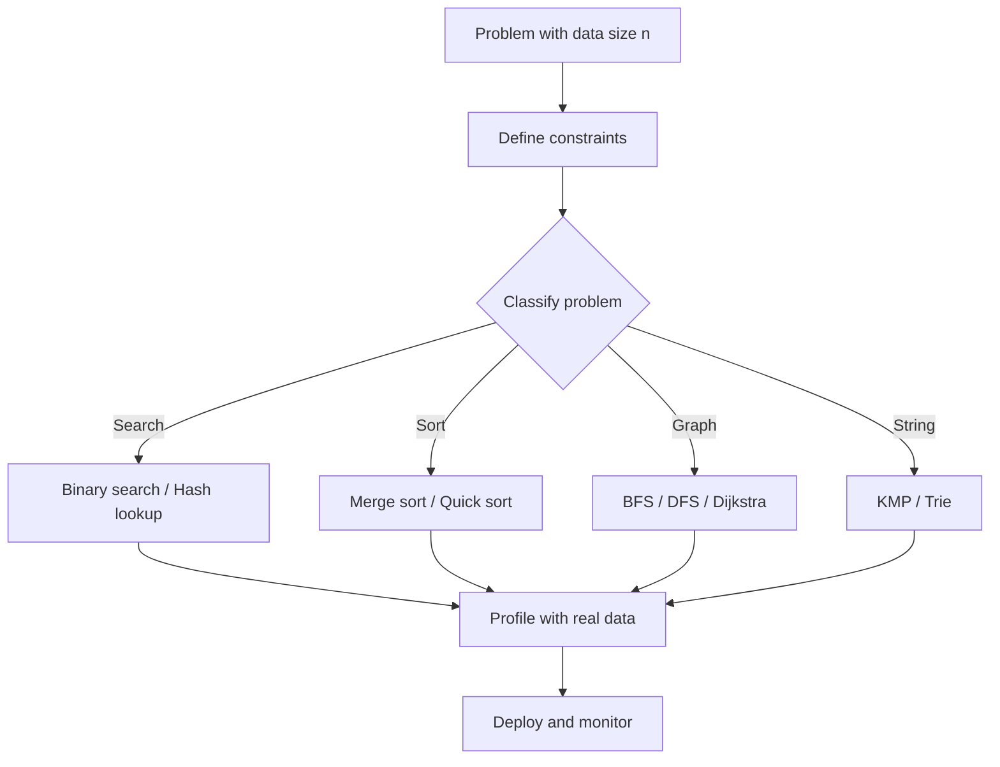

## TL;DR

The choice of algorithm determines whether your code finishes
in milliseconds or never - at scale, the difference is
existential.

---

### Metadata

| Field | Value |
|-------|-------|
| **ID** | DSA-001 |
| **Difficulty** | ★☆☆ Foundational |
| **Category** | Data Structures & Algorithms |
| **Tags** | orientation, scale, complexity |
| **Prerequisites** | None |

---

### The Problem This Solves

In 2012, a trading firm's algorithm ran in 45 minutes on a
10,000-item dataset. When their dataset grew to 10 million
items overnight, the same code would have taken 31 days to
finish. They needed the result in under a second.

This is the algorithm problem. Not "does it work?" - but
"does it work at the scale that matters?"

**EVOLUTION:**
Early programming treated all solutions as equivalent as long
as they produced correct output. The first computers were slow
enough that any working solution was a victory. As datasets
grew from kilobytes to gigabytes to terabytes, the difference
between O(n) and O(n^2) became the difference between a
product shipping and a company failing.

Donald Knuth formalized algorithm analysis in the 1960s-70s
with The Art of Computer Programming, establishing the
mathematical vocabulary (Big O, Big Theta, Big Omega) that
engineers use today to reason about scale.

---

### Textbook Definition

An algorithm is a finite, deterministic sequence of steps that
solves a defined class of problems. The choice of algorithm
determines the relationship between input size and resource
consumption (time and memory). This relationship - the
algorithm's complexity - governs whether a solution remains
viable as data grows.

---

### Understand It in 30 Seconds

You have 1,000 names in a list. Finding someone by reading
each name takes up to 1,000 comparisons. Sorting the list
first and using binary search takes at most 10 comparisons.

Same result. 100x faster. That gap becomes 1 million to 20
comparisons when the list has 1,000,000 names.

The algorithm determines the gap. The data size determines
whether the gap destroys you.

---

### First Principles

**Essential complexity:** The minimum work required to solve
the problem. To find one item in an unsorted list, you MUST
check items until you find it - there is no escape from this
lower bound.

**Accidental complexity:** The extra work your choice of
algorithm adds. Checking every item in a sorted list when
binary search exists is accidental complexity.

**The invariant:** No matter how fast your hardware gets,
an O(n^2) algorithm on n=10^9 items requires 10^18 operations.
At 10^12 operations per second, that is 10^6 seconds - over
11 days. Hardware cannot save a bad algorithm.

**Three core questions every algorithm choice must answer:**

1. What is the worst-case behavior as n grows?
2. What is the memory requirement?
3. What are the constant factors hidden by Big O?

---

### Thought Experiment

Imagine Google's search index has 8 billion pages. You need
to find pages matching a query.

**If you used a linear scan:** 8,000,000,000 comparisons per
query. At 10^9 comparisons/second, one query takes 8 seconds.
1,000 concurrent users = 8,000 seconds of compute per second.
Impossible.

**With an inverted index (hash map + sorted lists):**
A query touches a tiny fraction of the index. Millions of
queries per second become feasible.

The index IS the algorithm. Google's business model depends
on algorithm choice made 25 years ago.

---

### Mental Model / Analogy

**The librarian vs the reader model:**

A bad algorithm is a reader who starts at page 1 every time
they need to find a fact - works, but scales terribly.

A good algorithm is the librarian who built the index, the
card catalogue, and the Dewey Decimal System - the upfront
work creates a structure that makes every future lookup fast.

Data structures are the catalogues. Algorithms are the lookup
procedures. Together they determine whether your system can
serve 100 users or 100 million.

---

### Gradual Depth - Five Levels

**Level 1 - Five-year-old:**
Finding your toy in a pile takes forever. Finding it in a
sorted box is instant. Sorting first is the trick.

**Level 2 - Junior developer:**
Different ways to write code produce the same answer but at
very different speeds. As data grows, slow code gets
impossibly slower. Big O notation measures this growth rate.

**Level 3 - Mid engineer:**
O(n^2) means if your dataset doubles, your runtime quadruples.
O(n log n) means it grows only slightly faster than linearly.
The choice of sort algorithm, search strategy, or data
structure makes this difference in practice.

**Level 4 - Senior/staff engineer:**
At production scale, the constant factors behind Big O
matter too. A theoretically optimal algorithm with high
cache-miss rate can underperform a simpler one in practice.
You profile first, then choose. The 80/20 hotspot rule
applies: 20% of your code runs 80% of the time - make that
20% algorithmically tight.

**Level 5 - Expert/architect:**
Algorithm selection is infrastructure. The data structure
underpinning a database index (B-Tree, LSM-Tree, Hash Index)
determines the query latency profile for every service
depending on that database. Architecture decisions at the
algorithm level propagate through entire systems.

---

### How It Works

**The growth rate hierarchy:**

```
O(1)      - Constant    - Hash map lookup
O(log n)  - Logarithmic - Binary search
O(n)      - Linear      - Single scan
O(n log n)- Linearithmic- Merge sort
O(n^2)    - Quadratic   - Nested loops
O(2^n)    - Exponential - Naive recursive subset problems
O(n!)     - Factorial   - Brute-force permutations
```

At n=1,000:

```
O(log n) = ~10 ops
O(n)     = 1,000 ops
O(n^2)   = 1,000,000 ops
O(2^n)   = 10^301 ops (heat death of universe)
```

At n=1,000,000:

```
O(log n)   = ~20 ops
O(n)       = 1,000,000 ops
O(n log n) = ~20,000,000 ops
O(n^2)     = 10^12 ops (11 days at 10^9/s)
```

**The real-world multiplier:**
Big O hides constant factors. O(n) with a constant of 100
can be slower than O(n log n) with a constant of 1 for small
n. Profiling reveals which regime you are actually in.

---

### Complete Picture - End-to-End Flow

```
Problem arrives with data size n
        |
        v
+------------------+
| Define constraints|
| - max n?          |
| - time budget?    |
| - memory budget?  |
+------------------+
        |
        v
+------------------+
| Classify the     |
| problem type:    |
| - search?        |
| - sort?          |
| - graph?         |
| - string?        |
+------------------+
        |
        v
+------------------+
| Select algorithm |
| by complexity    |
| requirement      |
+------------------+
        |
        v
+------------------+
| Profile with real|
| data - measure   |
| actual constant  |
| factors          |
+------------------+
        |
        v
+------------------+
| Deploy + monitor |
| at production n  |
+------------------+
```



---

### Common Misconceptions

| Misconception | Reality |
|---------------|---------|
| "Hardware will fix slow algorithms" | O(n^2) on n=10^9 needs 10^18 ops - no hardware wins |
| "Big O is just theory for interviews" | Hotspot code with O(n^2) causes production incidents |
| "The fastest algorithm is always best" | Constant factors matter; simpler O(n) can beat O(log n) for small n |
| "Optimise first, measure later" | Profile first - the bottleneck is almost never where you assume |
| "Algorithm choice only matters for large data" | At 10k rows, O(n^2) vs O(n log n) is already 10x difference |

---

### Failure Modes & Diagnosis

**Failure 1: O(n^2) hidden in business logic**
- Symptom: Request latency grows quadratically as records grow
- Cause: Nested loops over collections in service layer
- Diagnosis: Profile with APM tool; look for nested iteration
- Fix: Replace inner loop with hash map lookup (O(n) total)

**Failure 2: Wrong complexity class for the access pattern**
- Symptom: Reads are fast but writes degrade over time
- Cause: Using a sorted structure (O(log n) insert) when
  unsorted hash would give O(1) inserts
- Diagnosis: Measure insert latency percentiles under load
- Fix: Match data structure to the dominant operation

**Failure 3: Complexity correct, constants catastrophic**
- Symptom: O(n log n) algorithm slower than expected
- Cause: Cache-unfriendly access pattern (pointer-chasing)
- Diagnosis: Use perf stat to check cache-miss rate
- Fix: Use array-backed structure vs pointer-based tree

**Security - ReDoS:**
- Regular expressions with catastrophic backtracking are
  O(2^n) in the worst case. A malicious input can lock a
  thread for minutes. Validate regex complexity at review time.

---

### Related Keywords

**Prerequisites:**
- [[CSF-053 - Computational Complexity Overview]]

**Builds toward:**
- [[DSA-004 - Big O Notation - The Language of Efficiency]]
- [[DSA-022 - Time Complexity vs Space Complexity]]
- [[DSA-023 - Big O Notation Fundamentals]]

**See also:**
- [[DSA-007 - The Cost of a Wrong Algorithm Choice]]
- [[DSA-074 - ReDoS and Algorithmic Complexity Attacks]]

---

### Quick Reference Card

| Aspect | Value |
|--------|-------|
| **Why it exists** | Hardware cannot compensate for wrong complexity class |
| **Core question** | How does runtime/memory grow as n grows? |
| **Key notation** | O(1) < O(log n) < O(n) < O(n log n) < O(n^2) < O(2^n) |
| **Common trap** | Ignoring constant factors for small n |
| **Production signal** | Latency growing faster than data volume |
| **Profiling tool** | APM + flame graph for hotspot identification |
| **Interview angle** | "What is the time complexity of your solution?" |
| **Decision rule** | Profile first; optimise the measured hotspot |
| **Scale cliff** | O(n^2) becomes infeasible at n > 10^5 for <1s budget |

**3 things to always know:**
1. The Big O of your hottest code path
2. The expected n at production scale
3. The time/memory budget that cannot be exceeded

**Interview one-liner:**
"Algorithm complexity determines whether a solution is
viable at production scale - hardware cannot rescue O(n^2)
when n reaches millions."

---

### Transferable Wisdom

The algorithm selection problem recurs across every layer of
engineering:

- **Database query optimization:** The query planner chooses
  between index scan (O(log n)) and full table scan (O(n))
  based on the same complexity reasoning.

- **Network routing:** Dijkstra's O((V + E) log V) route
  computation must finish before the packet TTL expires - the
  algorithm constraint is a hard engineering requirement.

- **Machine learning inference:** Model complexity
  (O(n) vs O(n^2) attention) determines whether real-time
  inference is physically possible.

**The universal principle:** Every system has a dominant
operation that runs in a tight loop. That operation's
complexity class determines the system's scaling ceiling.
Find the loop. Measure its complexity. Design data structures
to minimize it.

---

### The Surprising Truth

A correctly chosen O(n log n) algorithm in 1980 on hardware
running at 1 MHz performs better on 2024 data than an O(n^2)
algorithm running on a modern 3 GHz CPU with 50,000x more
clock cycles. The algorithm wins against hardware indefinitely.

---

### Mastery Checklist

- [ ] Can calculate Big O for any loop structure on sight
- [ ] Can identify the dominant complexity class in a code
      review and name the consequence at 10x data volume
- [ ] Can replace an O(n^2) operation with a hash map lookup
      and explain exactly why the new complexity is O(n)
- [ ] Has profiled a production hotspot and improved its
      algorithm, measuring the before/after impact
- [ ] Can explain why O(1) amortized (e.g. dynamic array
      append) is not the same as O(1) guaranteed

---

### Think About This

1. Your service processes 10k requests/day with O(n^2)
   complexity per request where n = items per request (avg
   50). Management announces a 10x user growth target.
   Without changing hardware, what happens to your latency?

2. Two sort algorithms: A is O(n log n) but has a constant
   factor of 50. B is O(n^2) but has a constant factor of 1.
   At what value of n does A become faster than B? How do
   you discover this empirically?

3. **TYPE G:** A microservice that aggregates data across 5
   downstream calls runs in 200ms today at n=1000 items.
   The product team wants to expand the item catalog to
   n=100,000. Sketch the investigation you would run before
   committing to any architectural change.

---

### Interview Deep-Dive

**Q1 (Easy):** Why does Big O notation drop constant factors
and lower-order terms?

> Because at large n, the highest-order term dominates and
> constants become irrelevant to the growth shape. O(2n) and
> O(n) behave identically as n approaches infinity. However,
> constants matter enormously in practice - this is why
> profiling supplements Big O analysis.

**Q2 (Medium):** You have an O(n^2) algorithm that works fine
today at n=1,000. Your product roadmap targets n=1,000,000
in 18 months. What is your plan?

> 1. Identify the quadratic bottleneck via profiling.
> 2. Determine if a hash map or sorted structure can replace
>    the inner loop, achieving O(n) or O(n log n).
> 3. Implement and benchmark both against a realistic dataset.
> 4. Roll out gradually with canary deployment, monitoring
>    latency percentiles (p50, p99, p999).
> 5. Document the complexity class of the replacement so
>    future engineers understand the constraint.

**Q3 (Hard):** In what scenario would you deliberately choose
an algorithm with worse Big O complexity?

> When the lower-order algorithm has better constant factors
> for the actual dataset size. Example: insertion sort
> (O(n^2)) outperforms merge sort (O(n log n)) for n < ~15
> because of lower overhead and better cache behavior. Java's
> Arrays.sort() uses TimSort, which applies insertion sort
> on small runs for exactly this reason. "Better" means
> better measured performance, not better theoretical class.
