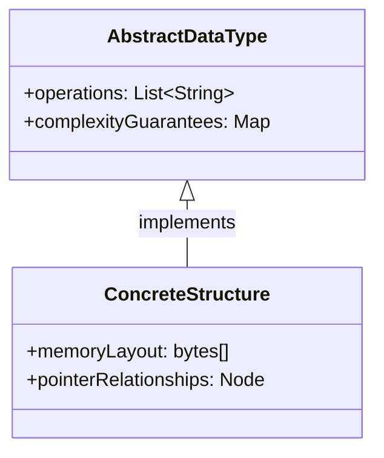

## TL;DR

A data structure is a way of organizing data in memory so that
specific operations - insert, delete, search, access - are as
fast as the problem demands.

---

### Metadata

| Field | Value |
|-------|-------|
| **ID** | DSA-002 |
| **Difficulty** | ★☆☆ Foundational |
| **Category** | Data Structures & Algorithms |
| **Tags** | orientation, data-structures, memory |
| **Prerequisites** | None |

---

### The Problem This Solves

Before data structures were formalized, programmers stored
everything in raw memory arrays and wrote custom access code
every time. Two problems emerged: code was error-prone and
operations were either fast or correct, rarely both.

The question "how should I arrange this data?" is asked
billions of times per second across every running software
system. Data structures are the library of proven answers.

**EVOLUTION:**
Early computing (1940s-50s) used raw memory and flat files.
As programs grew, patterns emerged: grouping related data,
linking records together, building hierarchies. By the 1960s
these patterns were named and analyzed mathematically.
Knuth's TAOCP (1968) codified the canonical catalog.

---

### Textbook Definition

A data structure is a collection of data values, the
relationships among them, and the operations that can be
applied to the data. It defines a contract between a
programmer and the runtime: "store and retrieve data in this
shape, with these performance guarantees."

---

### Understand It in 30 Seconds

Your phone contacts can be stored as:

- **A list:** Read every name until you find yours - slow.
- **An alphabetical list:** Jump to the right letter - faster.
- **A hash map:** Your name hashes to a bucket - instant.

Same data. Three structures. Three performance profiles.
The data structure is the organization choice. Algorithms
operate ON the structure.

---

### First Principles

**Why organization matters:**
Memory is a flat array of addresses. To do anything useful,
you need to know WHERE something is and WHAT NEIGHBORS it has.
A data structure answers both questions.

**The two fundamental operations:**
All data structures exist to enable some combination of:
- **Access:** retrieve element at a position
- **Modification:** insert, update, delete elements

**The inescapable trade-off:**
No data structure is best for all operations simultaneously.
Arrays give O(1) access but O(n) insert. Linked lists give
O(1) insert but O(n) access. Every structure is a deliberate
sacrifice of one operation to benefit another.

**Essential vs Accidental:**
Essential: You need a structure that stores items and allows
retrieval. That requirement is irreducible.
Accidental: Whether you use an array, linked list, or tree to
meet that requirement. That is the design choice.

---

### Thought Experiment

You are building a phone book for a city of 1 million people.
You receive 10,000 lookups per second.

- **Unsorted array:** Avg 500,000 comparisons per lookup.
  At 10k req/s: 5 billion comparisons/second. CPU melts.
- **Sorted array + binary search:** 20 comparisons max.
  At 10k req/s: 200,000 comparisons/second. Trivial.
- **Hash map:** 1 comparison (amortized). At 10k req/s:
  10,000 operations/second. Essentially free.

The data structure DEFINES what is possible.

---

### Mental Model / Analogy

**Data structures are physical storage systems:**

| Data Structure | Physical Analogy |
|----------------|-----------------|
| Array | Numbered mailboxes in a row |
| Linked List | Treasure hunt with clues |
| Stack | Stack of plates (top only) |
| Queue | Line at a bank (front only) |
| Hash Map | Library card catalogue |
| Tree | Org chart or family tree |
| Graph | Road map with intersections |

The analogy reveals the access pattern. A "mailbox row" means
you can jump directly to box #42. A "treasure hunt" means
you follow clues sequentially.

---

### Gradual Depth - Five Levels

**Level 1 - Five-year-old:**
It is a container with rules. Like a pigeonhole board where
each slot has a number and you jump straight to it.

**Level 2 - Junior developer:**
A way to store and organize data so common operations (find,
add, remove) run as fast as possible. Different structures
optimize for different operations.

**Level 3 - Mid engineer:**
Every data structure exposes a contract (ADT - Abstract Data
Type): the operations it supports and their complexity
guarantees. The implementation is hidden. You choose based
on the contract, not the implementation.

**Level 4 - Senior/staff engineer:**
Data structure choice determines memory layout, which
determines cache behavior, which is often the dominant
performance factor in modern hardware. An array-backed
structure may beat a theoretically superior pointer-based
structure because it stays in CPU cache (cache-line
friendliness). You choose after measuring.

**Level 5 - Expert/architect:**
Data structures are encoded domain assumptions. A B-Tree
assumes most reads are range queries and optimizes page
reads. An LSM-Tree assumes writes dominate. Choosing the
wrong underlying structure for a database column costs
orders of magnitude in production. You design data
structures to fit the access pattern of your specific
workload, not the general case.

---

### How It Works

**The two layers of a data structure:**

```
+------------------------------+
| ABSTRACT DATA TYPE (ADT)     |
| - Interface / contract       |
| - Operations: push, pop, add |
| - Complexity guarantees      |
+------------------------------+
           |
           | implemented by
           v
+------------------------------+
| CONCRETE DATA STRUCTURE      |
| - Memory layout              |
| - Pointer relationships      |
| - Implementation details     |
+------------------------------+
```



**Example - Stack ADT:**
- Abstract: push(x), pop(), peek(), isEmpty()
- Concrete implementations: array-backed or linked-list-backed
- Performance contract: push/pop are O(1)

**Key dimensions to evaluate every data structure:**

| Dimension | Questions |
|-----------|-----------|
| Access | Can you get element at index i? Cost? |
| Search | Can you find element by value? Cost? |
| Insert | Where can you insert? Beginning? End? Anywhere? Cost? |
| Delete | Can you delete arbitrary element? Cost? |
| Memory | Contiguous? Scattered? Overhead per element? |
| Ordering | Sorted? Unsorted? Insertion-ordered? |

---

### Complete Picture - End-to-End Flow

```
+--------------------+
| Problem requirement|
| "I need to store   |
| 1M users and look  |
| up by ID in <1ms"  |
+--------------------+
          |
          v
+--------------------+
| Identify dominant  |
| operation: lookup  |
| by key (random)    |
+--------------------+
          |
          v
+--------------------+
| Match to structure:|
| Hash Map: O(1) avg |
| BST: O(log n) avg  |
| Array: O(n) avg    |
+--------------------+
          |
          v
+--------------------+
| Consider secondary |
| requirements:      |
| - Ordered output?  |
| - Range queries?   |
| - Memory budget?   |
+--------------------+
          |
          v
+--------------------+
| Choose + implement |
| Measure with real  |
| dataset            |
+--------------------+
```

---

### Comparison Table

| Data Structure | Access | Search | Insert | Delete | Memory | Best For |
|----------------|--------|--------|--------|--------|--------|----------|
| Array | O(1) | O(n) | O(n) | O(n) | Compact | Index access |
| Dynamic Array | O(1) | O(n) | O(1)* | O(n) | Compact | General list |
| Linked List | O(n) | O(n) | O(1) at head | O(1) at known | High overhead | Frequent insert |
| Hash Map | O(1)* | O(1)* | O(1)* | O(1)* | Moderate | Key lookup |
| BST | O(log n)* | O(log n)* | O(log n)* | O(log n)* | Moderate | Ordered data |
| Heap | O(n) | O(n) | O(log n) | O(log n) | Compact | Priority queue |

*amortized or average case

---

### Common Misconceptions

| Misconception | Reality |
|---------------|---------|
| "Hash maps are always fastest" | Hash maps have O(1) average but O(n) worst case; sorted maps may be better for range queries |
| "Arrays are too simple to be useful" | Arrays are cache-optimal and underpin most high-performance structures |
| "The best structure is language-specific" | The ADT concept is language-agnostic; implementations differ |
| "You can change the data structure later easily" | Data structure changes often require full data migration and API redesign |
| "More complex structures are better" | A sorted array + binary search beats a BST for read-heavy, static datasets |

---

### Failure Modes & Diagnosis

**Failure 1: Wrong structure for the access pattern**
- Symptom: Code correct but too slow under load
- Cause: Using O(n) structure for O(1) workload pattern
- Diagnosis: Profile the hot path; identify the structure
- Fix: Replace with hash map or indexed structure

**Failure 2: Mutable shared structure with no synchronization**
- Symptom: Concurrent modification exceptions or silent data loss
- Cause: Two threads modify same structure without locks
- Diagnosis: Thread dump shows concurrent access; enable race
  detection
- Fix: Use concurrent variant (ConcurrentHashMap) or lock

**Failure 3: Unbounded growth**
- Symptom: Memory grows until OOM crash
- Cause: Elements added but never removed (leak into map/list)
- Diagnosis: Heap dump shows growing collection
- Fix: Add eviction policy (LRU, TTL) or size bound

**Security:**
Hash map structures with user-controlled keys are vulnerable
to hash collision attacks (Hash DoS). An attacker sends
inputs that all hash to the same bucket, degrading O(1)
to O(n). Use randomized hash seeds (Java does this by
default since Java 8) or rate-limit inputs.

---

### Related Keywords

**Builds toward:**
- [[DSA-008 - Array (Static Array)]]
- [[DSA-010 - Linked List (Singly Linked)]]
- [[DSA-014 - Hash Map (Hash Table, Dictionary)]]
- [[DSA-044 - Data Structures Selection Framework]]

**See also:**
- [[DSA-001 - Why Algorithms Matter - The Scale Problem]]
- [[DSA-003 - Algorithm vs Data Structure]]

---

### Quick Reference Card

| Aspect | Value |
|--------|-------|
| **Core purpose** | Organize data so operations have predictable cost |
| **Key abstraction** | ADT: contract of operations + complexity guarantees |
| **Fundamental trade-off** | Fast access vs fast modification (usually opposed) |
| **Memory axis** | Contiguous (cache-friendly) vs scattered (flexible) |
| **Decision trigger** | Profile first; identify the dominant operation |
| **Common mistake** | Choosing a structure before measuring the access pattern |
| **Interview signal** | "Which data structure and why?" tests design thinking |

**3 things to always know:**
1. The complexity of each operation for your chosen structure
2. The memory layout (contiguous vs pointer-scattered)
3. The dominant operation in your access pattern

**Interview one-liner:**
"A data structure is the organization of data in memory that
makes specific operations fast - every choice is a trade-off
between access speed, modification speed, and memory cost."

---

### Transferable Wisdom

The data structure selection problem appears everywhere:

- **File systems:** ext4 uses B-Trees for directory entries;
  the structure choice determines file lookup speed at scale.
- **Database engines:** Column stores (array-like, contiguous)
  vs row stores (record-oriented) differ only in data
  organization, yet have wildly different query profiles.
- **Neural network architecture:** Attention mechanisms use
  dense matrices (array-structured) for GPU efficiency -
  the data structure is the performance contract.

**Universal principle:** Before writing a single line of
algorithm code, ask: "What shape does my data need to be in?"
The structure choice constrains every algorithm that follows.

---

### The Surprising Truth

The most commonly used data structure in high-performance
systems is the humble array - not trees, not hash maps. Modern
CPUs prefetch sequential memory so aggressively that a linear
scan through a sorted array often beats a hash map lookup for
datasets under ~1,000 elements. Simplicity wins when it
aligns with hardware.

---

### Mastery Checklist

- [ ] Can name the dominant operation for any given problem
      and select a data structure accordingly
- [ ] Understands the difference between ADT and concrete
      implementation (e.g. Set ADT vs HashSet vs TreeSet)
- [ ] Can draw the memory layout of an array vs linked list
      and explain cache implications of each
- [ ] Has replaced an O(n) lookup with a hash map in real
      code and measured the improvement
- [ ] Can explain hash collision attack risk and mitigation

---

### Think About This

1. Java's `ArrayList` uses an array internally. Why does
   `add(index, element)` in the middle cost O(n) while
   `add(element)` at the end is amortized O(1)?

2. Two engineers debate: one prefers `LinkedList` for a
   queue, the other prefers `ArrayDeque`. Who is right and
   why? What does it depend on?

3. **TYPE G:** You are designing the in-memory session store
   for a web application expecting 500k concurrent sessions.
   Sessions are accessed by session ID (random) and must
   expire after 30 minutes of inactivity. Sketch the data
   structure(s) you would use and justify each choice.

---

### Interview Deep-Dive

**Q1 (Easy):** What is the difference between an array and a
linked list?

> Array: contiguous memory, O(1) random access, O(n) insert
> in middle, fixed or resizable size, cache-friendly.
> Linked list: scattered nodes connected by pointers, O(n)
> access, O(1) insert at known position, dynamic size,
> cache-unfriendly. Choose array when you need random access;
> linked list when you need frequent insertions at known
> positions.

**Q2 (Medium):** Why is a HashMap O(1) average but O(n)
worst case?

> Average: keys distribute evenly across buckets; each bucket
> has ~1 element; lookup is one hash computation + one compare.
> Worst case: all keys hash to the same bucket (hash
> collision); bucket degrades to a linked list; lookup
> becomes O(n). Java 8+ converts buckets to Red-Black Trees
> when they exceed 8 elements, making worst case O(log n).

**Q3 (Hard):** When would you prefer a TreeMap over a HashMap
in Java?

> When you need: (1) ordered iteration over keys; (2) range
> queries (subMap, headMap, tailMap); (3) finding the
> nearest key (floorKey, ceilingKey); (4) guaranteed O(log n)
> worst-case (vs HashMap's O(n) worst case, though rare).
> TreeMap costs O(log n) per operation vs HashMap's O(1)
> average. Use TreeMap when the ordering or range semantics
> are required; otherwise HashMap wins on speed.
