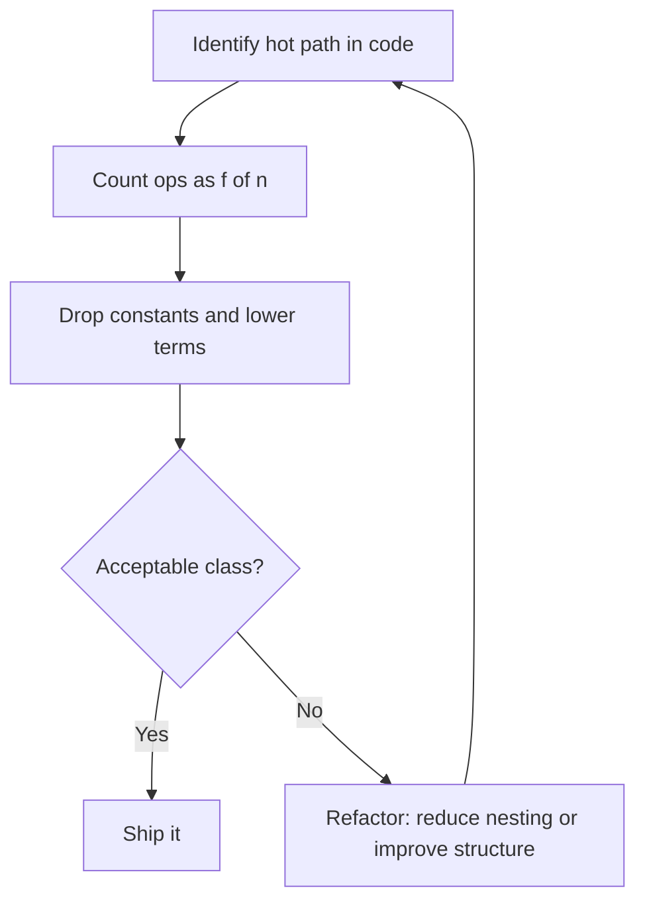

## TL;DR

Big O notation describes how an algorithm's resource usage
grows relative to input size - the vocabulary every engineer
needs to communicate about performance without benchmarking.

---

### Metadata

| Field | Value |
|-------|-------|
| **ID** | DSA-004 |
| **Difficulty** | ★☆☆ Foundational |
| **Category** | Data Structures & Algorithms |
| **Tags** | orientation, complexity, big-o |
| **Prerequisites** | DSA-001 |

---

### The Problem This Solves

Before Big O, programmers described performance as "fast" or
"slow" - subjective, hardware-dependent, and useless for
predicting behavior at scale. Two engineers could not
communicate about performance without running benchmarks on
identical hardware.

Big O notation provides a hardware-independent vocabulary for
describing how resource usage scales with input size.

**EVOLUTION:**
Paul Bachmann introduced the O() notation in 1894 (in number
theory). Donald Knuth adapted it for algorithm analysis in
the 1960s in TAOCP, adding Theta (Θ) and Omega (Ω) for
exact and lower bounds. Big O became the universal language
of computer science performance analysis.

---

### Textbook Definition

Big O notation expresses an upper bound on the growth rate
of an algorithm's resource consumption (time or space)
relative to input size n, ignoring constant factors and
lower-order terms. f(n) = O(g(n)) means there exist
constants c and n0 such that f(n) <= c*g(n) for all n > n0.

---

### Understand It in 30 Seconds

Imagine cooking breakfast. The time it takes depends on the
number of eggs (n):

- **O(1):** Pour coffee. Same time regardless of n.
- **O(n):** Crack n eggs. Time grows linearly with n.
- **O(n^2):** Compare every pair of eggs. At n=100: 10,000
  comparisons.

Big O captures the SHAPE of this growth, not the exact time.

---

### First Principles

**The single question Big O answers:**
"As n doubles, how does the resource usage change?"
- O(1): Stays the same
- O(log n): Grows by 1 step
- O(n): Doubles
- O(n^2): Quadruples

**Why drop constants:**
Big O models asymptotic behavior - what happens as n
approaches infinity. At n=10^9, whether the constant is 1
or 100 is irrelevant compared to whether the exponent is 1
or 2. Constants matter for small n; the growth class
determines survival at large n.

**Three notations:**
- O (Big O): Upper bound - "no worse than..."
- Ω (Big Omega): Lower bound - "no better than..."
- Θ (Big Theta): Tight bound - "exactly this class"

In practice, "Big O" is used colloquially to mean tight bound
(Θ). Be precise in formal analysis; use O in conversation.

---

### Thought Experiment

You have an algorithm that takes exactly:
  f(n) = 3n^2 + 7n + 100

At n = 1,000:
  - 3n^2 = 3,000,000
  - 7n   = 7,000 (0.23% of total)
  - 100  = 100   (0.003% of total)

The 3n^2 term dominates completely. We write O(n^2) because:
- The dominant term is n^2
- The constant 3 does not change the growth shape
- Lower-order terms become negligible

This is why O(n^2) and O(3n^2 + 7n + 100) are identical
for the purposes of scale analysis.

---

### Mental Model / Analogy

**Big O is a speed limit sign, not a speedometer.**

A speed limit sign says "no faster than 100 km/h." It does
not say you travel at 100 km/h - you might go 60. But you
know the worst case: O(n^2) means "no worse than quadratic."

**The graph model:**
Plot "runtime vs input size n." The Big O complexity class
is the SHAPE of that curve:
- Flat line = O(1)
- Slowly rising curve = O(log n)
- Straight line = O(n)
- Steep curve = O(n^2)
- Vertical wall = O(2^n)

The shape tells you the future. A flat line scales forever.
A steep curve hits a wall at n=10,000.

---

### Gradual Depth - Five Levels

**Level 1 - Five-year-old:**
Big O says "if you double the toys, does the job take the same
time, twice as long, or four times as long?" That's the answer.

**Level 2 - Junior developer:**
Big O tells you how an algorithm's time or memory grows with
input size. O(n) means: double the input, double the time.
O(n^2) means: double the input, quadruple the time.

**Level 3 - Mid engineer:**
Big O analysis involves: identifying the dominant loop or
recursive structure, counting operations as a function of n,
dropping constants and lower-order terms, and using the
result to predict production viability.

**Level 4 - Senior/staff engineer:**
Big O is necessary but not sufficient for production analysis.
Two O(n log n) algorithms can have 10x different performance
due to cache behavior, branch prediction, and SIMD
vectorization. You use Big O to eliminate obviously wrong
approaches, then benchmark the survivors with real data.

**Level 5 - Expert/architect:**
At architecture level, Big O applies to system-level
operations: O(1) cache hit vs O(log n) database index lookup
vs O(n) table scan. Architectural decisions (caching
strategy, index design, data partitioning) are Big O
decisions applied to distributed systems.

---

### How It Works

**The six complexity classes you must know:**

```
Complexity | Name          | n=10    | n=100      | n=10,000
-----------+---------------+---------+------------+----------
O(1)       | Constant      | 1       | 1          | 1
O(log n)   | Logarithmic   | 3       | 7          | 13
O(n)       | Linear        | 10      | 100        | 10,000
O(n log n) | Linearithmic  | 30      | 700        | 130,000
O(n^2)     | Quadratic     | 100     | 10,000     | 100,000,000
O(2^n)     | Exponential   | 1,024   | 10^30      | !!
```

**How to calculate Big O from code:**

```
// BAD - O(n^2): nested loop, each O(n)
for (int i = 0; i < n; i++) {       // O(n)
    for (int j = 0; j < n; j++) {   // O(n) per outer
        process(arr[i], arr[j]);    // O(1)
    }
}
// Total: O(n * n) = O(n^2)

// GOOD - O(n): single loop
Map<Integer, Integer> seen = new HashMap<>();  // O(1)
for (int i = 0; i < n; i++) {                 // O(n)
    if (seen.containsKey(target - arr[i])) {  // O(1)
        return i;
    }
    seen.put(arr[i], i);                      // O(1)
}
// Total: O(n)
```

**Rules for calculating Big O:**

| Rule | Example |
|------|---------|
| Loops multiply | Two nested O(n) loops = O(n^2) |
| Sequential blocks add | O(n) + O(n log n) = O(n log n) |
| Drop constants | O(3n) = O(n) |
| Drop lower terms | O(n^2 + n) = O(n^2) |
| Recursion: Master Theorem or recursion tree | T(n) = 2T(n/2) + O(n) → O(n log n) |

---

### Complete Picture - End-to-End Flow

```
+---------------------------+
| Identify the hot path     |
| (the code that runs most) |
+---------------------------+
           |
           v
+---------------------------+
| Count operations as       |
| f(n) function             |
+---------------------------+
           |
           v
+---------------------------+
| Drop constants +          |
| lower-order terms         |
+---------------------------+
           |
           v
+---------------------------+
| Compare to acceptable     |
| complexity class          |
| for target n              |
+---------------------------+
           |
           v
+---------------------------+
| If O(n^2) at n > 10^4:    |
| refactor or reject        |
+---------------------------+
```



---

### Comparison Table

| Notation | Meaning | Use in conversation |
|----------|---------|---------------------|
| O(f(n)) | Upper bound - worst case | "No worse than O(n^2)" |
| Ω(f(n)) | Lower bound - best case | "At minimum O(n)" |
| Θ(f(n)) | Tight bound - exact class | "Exactly O(n log n)" |
| o(f(n)) | Strict upper (not tight) | Rarely used in practice |

| Complexity | Nickname | When it appears |
|-----------|----------|-----------------|
| O(1) | Constant | Hash lookup, array index |
| O(log n) | Log | Binary search, BST ops |
| O(n) | Linear | Single scan |
| O(n log n) | Linearithmic | Merge sort, heap sort |
| O(n^2) | Quadratic | Nested loops |
| O(n^3) | Cubic | 3-nested loops, naive matrix multiply |
| O(2^n) | Exponential | Naive subset enumeration |
| O(n!) | Factorial | Brute-force permutations |

---

### Common Misconceptions

| Misconception | Reality |
|---------------|---------|
| "O(n^2) is always bad" | For n < 100, O(n^2) may be faster in practice than O(n log n) due to constants |
| "O(1) means fast" | O(1) means constant; the constant could be enormous |
| "Big O measures time in seconds" | Big O measures growth rate, not absolute time |
| "Lower Big O is always better" | For the actual n at production scale, the lower class may never matter |
| "Big O covers space too" | Only if you explicitly say O(n) space; default in conversation is time |

---

### Failure Modes & Diagnosis

**Failure 1: Assuming Big O tells you which code is faster**
- Symptom: Replaced O(n^2) with O(n log n) but runtime
  got slower for production input sizes
- Cause: The O(n log n) algorithm has much higher constant
  factor; actual n is small enough that O(n^2) with small
  constant was faster
- Fix: Benchmark at actual production n; use Big O only
  for scale-up reasoning

**Failure 2: Miscalculating complexity of string operations**
- Symptom: "O(n)" code is actually O(n^2)
- Cause: String concatenation in a loop is O(n^2) in
  languages where strings are immutable (Java, Python)
  because each concat creates a new O(n) string
- Fix: Use StringBuilder/StringJoiner or list + join

**Failure 3: Hidden O(n) inside O(1) label**
- Symptom: "O(1)" function call is actually O(n) at scale
- Cause: The called function iterates over all n elements
  but its complexity was not analyzed
- Fix: Trace all called functions, do not trust labels

**Security:**
Algorithms with controllable worst-case behavior can be
weaponized. O(n^2) worst-case sort with user-supplied input
order is a DoS vector. Prefer algorithms with O(n log n)
guaranteed worst case (merge sort) over average-case-only
guarantees (quick sort) for adversarial inputs.

---

### Related Keywords

**Prerequisites:**
- [[DSA-001 - Why Algorithms Matter - The Scale Problem]]

**Builds toward:**
- [[DSA-022 - Time Complexity vs Space Complexity]]
- [[DSA-023 - Big O Notation Fundamentals]]
- [[DSA-070 - Amortized Analysis]]

**See also:**
- [[DSA-003 - Algorithm vs Data Structure]]
- [[CSF-053 - Computational Complexity Overview]]

---

### Quick Reference Card

| Aspect | Value |
|--------|-------|
| **What it measures** | Growth rate of resource usage relative to input n |
| **What it drops** | Constants and lower-order terms |
| **O(1) means** | Same resource usage regardless of n |
| **O(n^2) danger zone** | n > 10,000 for 1s budget at 10^9 ops/s |
| **Best sort complexity** | O(n log n) - optimal for comparison sorts |
| **Hash map lookup** | O(1) average, O(n) worst case |
| **Binary search** | O(log n) requires sorted array |
| **Nested loops default** | O(n^2) unless inner loop is independent of n |

**3 things to always know:**
1. The complexity class of every algorithm you write
2. The expected production n for each algorithm
3. When the class is acceptable vs when it is a liability

**Interview one-liner:**
"Big O describes how runtime or memory grows as input size
increases - it is hardware-independent vocabulary for
comparing algorithm efficiency at scale."

---

### Transferable Wisdom

Big O thinking applies beyond CS algorithms:

- **Database design:** An unindexed column scan is O(n)
  per query. An index is O(log n). At 10M rows and 1000
  queries/second, this gap is the difference between a
  responsive app and a database on fire.
- **API design:** An endpoint that makes O(n) downstream
  calls (N+1 problem) scales terribly. Batch it to O(1).
- **Infrastructure:** Auto-scaling policies with O(n)
  decision time (check every instance) vs O(1) metric
  threshold determine whether scale-out is reactive or
  proactive.

**Universal principle:** Identify the dominant variable in
any system. Ask: "As this variable doubles, what happens to
cost?" The answer IS the Big O of your system.

---

### The Surprising Truth

Big O notation was invented by a 19th-century number theorist
(Bachmann, 1894) to describe approximations to prime-counting
functions - completely unrelated to computing. Knuth
repurposed it for algorithm analysis 70 years later because
the mathematical tool happened to fit perfectly. The notation
you use every day to reason about software was borrowed
from pure mathematics.

---

### Mastery Checklist

- [ ] Can calculate Big O for any iterative algorithm by
      inspecting loop structure
- [ ] Can calculate Big O for simple recursive algorithms
      using the recursion tree method
- [ ] Knows the Big O for all standard operations of
      array, linked list, hash map, BST, and heap
- [ ] Can explain why string concatenation in a Java loop
      is O(n^2) and fix it
- [ ] Has identified an O(n^2) hotspot in production code
      and reduced it, measuring the improvement

---

### Think About This

1. A function claims to be O(n). Inside it calls
   `list.contains(item)` on a Java ArrayList in a loop.
   What is the actual complexity? How would you find this
   in code review?

2. Merge sort is O(n log n) in all cases. Quick sort is
   O(n log n) average but O(n^2) worst case. Yet most
   standard library sort implementations use quick sort.
   Why? What does this say about Big O in practice?

3. **TYPE G:** Your code review finds this Java snippet:
   ```java
   String result = "";
   for (String item : largeList) {
       result += item + ", ";
   }
   ```
   The list has 100,000 elements. What is the complexity?
   What is the fix? How would you test and measure it?

---

### Interview Deep-Dive

**Q1 (Easy):** What is the time complexity of accessing
element at index i in an array?

> O(1). Arrays store elements in contiguous memory. Given
> the base address and index i, the address of element i
> is: base_address + i * element_size. This is a single
> arithmetic operation regardless of array size.

**Q2 (Medium):** Why is the amortized time complexity of
ArrayList.add() O(1) when the underlying array must be
resized occasionally?

> Amortized O(1) means the average cost over a sequence
> of operations is O(1). ArrayList doubles its capacity
> when full (e.g. from n to 2n). The resize costs O(n)
> but happens only after n cheap adds. Spreading the O(n)
> resize cost over n adds gives O(n)/n = O(1) amortized.
> Over any n operations, total cost is O(n) → O(1) per op.

**Q3 (Hard):** What is the time complexity of the following
code, and how would you reduce it?

```java
// Check for duplicate in list
for (int i = 0; i < list.size(); i++) {
    for (int j = i+1; j < list.size(); j++) {
        if (list.get(i).equals(list.get(j))) {
            return true;
        }
    }
}
```

> Current: O(n^2) - nested loop, each O(n).
> Fix: Use a HashSet. Iterate once, add to set; if add
> returns false (already present), duplicate found.
> New complexity: O(n) time, O(n) space.
>
> ```java
> Set<T> seen = new HashSet<>();
> for (T item : list) {
>     if (!seen.add(item)) return true;
> }
> return false;
> ```
>
> Trade-off: O(n) extra space for the HashSet.
> Worth it for n > ~50 (where O(n^2) overhead exceeds the
> constant space cost of the hash set).
