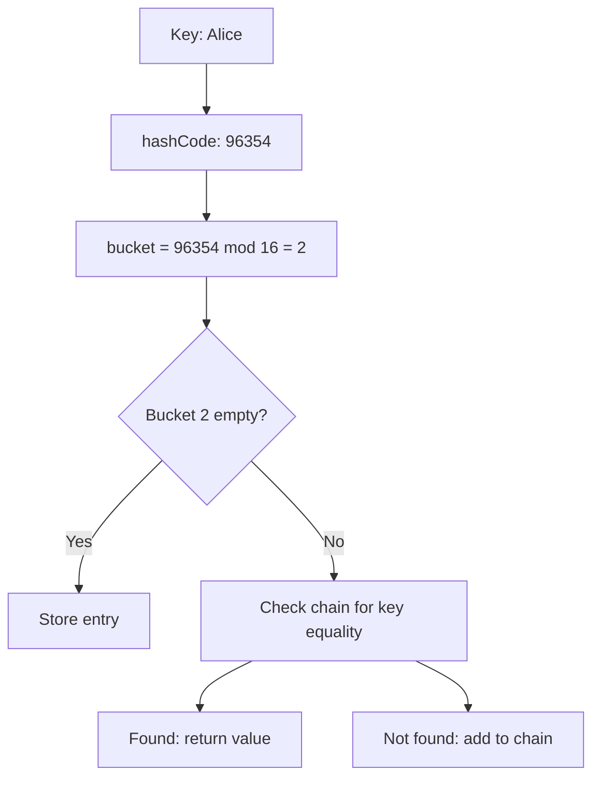

## TL;DR

A hash map achieves O(1) average key lookup by converting
keys to array indexes via a hash function - the most
frequently used data structure in production code.

---

### Metadata

| Field | Value |
|-------|-------|
| **ID** | DSA-014 |
| **Difficulty** | ★☆☆ Foundational |
| **Category** | Data Structures & Algorithms |
| **Tags** | data-structures, hash-map, O(1)-lookup |
| **Prerequisites** | DSA-002 |

---

### The Problem This Solves

Finding an item by a non-numeric key (name, ID, email) in a
list requires O(n) linear scan. A hash map transforms any
key into an array index, enabling O(1) average lookup
regardless of collection size.

**EVOLUTION:**
Hash functions were first described by Hans Peter Luhn in
1953 for punched card filing. Donald Knuth formalized hash
table analysis in TAOCP (1968). Today every major language
provides a hash map as a first-class primitive.

---

### Textbook Definition

A hash map (hash table) is a data structure that maps keys
to values using a hash function to compute an array index
(bucket) for each key. On collision (two keys map to same
index), the structure resolves it via chaining (linked list
at bucket) or open addressing (probe to next slot).
Average O(1) for get, put, and delete.

---

### Understand It in 30 Seconds

You have 100 lockers (0-99). To store "Alice's data", compute
hash("Alice") = 42, put data in locker 42. To retrieve:
compute hash("Alice") again = 42, open locker 42. Done.

No searching. No sorting. One computation to find any key.

---

### First Principles

**The hash function contract:**
1. Deterministic: same input always produces same output
2. Uniform: distribute keys evenly across buckets
3. Fast: O(1) to compute

**Why collisions are unavoidable:**
If you have 1000 keys and 100 buckets, by the pigeonhole
principle at least 10 keys share a bucket. Collision
handling (chaining or probing) is not a flaw - it is
required and designed for.

**The load factor:**
load_factor = number_of_entries / number_of_buckets
Higher load factor → more collisions → longer chains → slower.
Java HashMap default: resize at 0.75 load factor (75% full).

---

### Mental Model / Analogy

**Library call number system:** Every book has a call number
(hash) that places it on a specific shelf (bucket). Find any
book by computing its call number - no walking the whole
library. If two books have the same call number (collision):
look at both books in that section.

---

### Gradual Depth - Five Levels

**Level 1 - Five-year-old:**
You have labeled boxes. To store something, compute its label
and put it in that box. To find it, compute the label again.
No searching.

**Level 2 - Junior developer:**
`HashMap<K,V>` in Java: `put(key, value)` stores; `get(key)`
retrieves. Average O(1) for both. Keys must implement
`hashCode()` and `equals()`.

**Level 3 - Mid engineer:**
Collision resolution strategies:
- Chaining: each bucket is a linked list (Java uses this)
- Open addressing: probe next bucket (Python dicts use this)
Load factor controls resize frequency. Java 8+ converts long
chains to Red-Black Trees (bucket size > 8).

**Level 4 - Senior/staff engineer:**
Worst case is O(n) when all keys collide. In Java 7 and
earlier, this was exploited for DoS via crafted HTTP
parameters (Hash DoS). Java 8+ uses randomized hash seed
to prevent this. Monitor cache-miss rate when HashMap grows
beyond L3 cache size.

**Level 5 - Expert/architect:**
At scale (millions of keys), the hash function's uniformity
determines cache behavior. A poor hash function creates
bucket hotspots. Consistent hashing (used in distributed
caches and databases) extends hash maps to distributed systems
by minimizing key redistribution when nodes are added/removed.

---

### How It Works

**Java HashMap internals:**

```
bucket array (default size 16):
[0] -> null
[1] -> [key="Bob", val=42] -> [key="Cat", val=99] (collision chain)
[2] -> null
...
[4] -> [key="Alice", val=7]
...
```

**Resize behavior:**

```
Initial: 16 buckets, load=0.75 → resize at 12 entries
After resize: 32 buckets (doubled), all entries rehashed
Resize cost: O(n) one-time, amortized O(1) per insertion
```

**Code example:**

```java
// BAD: using HashMap but checking containsKey + get (2 lookups)
if (map.containsKey(key)) {
    return map.get(key);  // two O(1) operations - unnecessary
}

// GOOD: single lookup with getOrDefault
return map.getOrDefault(key, defaultValue);

// GOOD: compute if absent (atomic check-then-insert)
map.computeIfAbsent(key, k -> new ArrayList<>()).add(value);

// GOOD: frequency counter pattern
map.merge(word, 1, Integer::sum);
// equivalent to: map.put(word, map.getOrDefault(word, 0) + 1)
```

**hashCode() + equals() contract:**

```java
// BAD: equals overridden but hashCode not → broken HashMap
class User {
    String name;

    @Override
    public boolean equals(Object o) {
        return o instanceof User && ((User)o).name.equals(name);
    }
    // Missing hashCode! Two equal Users hash to different buckets
    // map.get(new User("Alice")) finds nothing even if "Alice" is in map
}

// GOOD: always override hashCode with equals
@Override
public int hashCode() {
    return Objects.hash(name);
}
```

---

### Complete Picture - End-to-End Flow

```
put("Alice", 42):
1. Compute hashCode("Alice") = 96354
2. bucket = 96354 % 16 = 2
3. Check bucket 2: empty → store entry
4. If load > 0.75: resize to 32, rehash all entries

get("Alice"):
1. Compute hashCode("Alice") = 96354
2. bucket = 96354 % 16 = 2
3. Check bucket 2: entry with key "Alice" → return 42
```



---

### Comparison Table

| | HashMap | TreeMap | LinkedHashMap | Hashtable |
|--|---------|---------|---------------|-----------|
| Order | Unordered | Sorted by key | Insertion order | Unordered |
| Get/Put | O(1) avg | O(log n) | O(1) avg | O(1) avg |
| Null keys | 1 allowed | Not allowed | 1 allowed | Not allowed |
| Thread-safe | No | No | No | Yes (but slow) |
| Range queries | No | Yes | No | No |

---

### Common Misconceptions

| Misconception | Reality |
|---------------|---------|
| "HashMap is always O(1)" | O(1) average; O(n) worst case when all keys collide (rare with good hash function) |
| "HashMap iteration is in insertion order" | HashMap is unordered; use LinkedHashMap for insertion order |
| "You can use any object as a HashMap key" | Key must implement consistent hashCode() and equals(); mutable keys that change after insertion break the map |
| "HashMap is thread-safe" | Not thread-safe; use ConcurrentHashMap for concurrent access |

---

### Failure Modes & Diagnosis

**Failure 1: Mutable key breaks HashMap**
- Symptom: `get(key)` returns null even though key was `put`
- Cause: Key object was mutated after insertion; hashCode
  changed; now maps to different bucket
- Fix: Use only immutable objects as HashMap keys
  (String, Integer, enum - all immutable)

**Failure 2: Missing hashCode override**
- Symptom: Custom objects always return null from HashMap
  even when equivalent objects were put
- Cause: Default hashCode uses object identity, not value;
  two logically equal objects hash to different buckets
- Fix: Always override `hashCode()` when overriding `equals()`

**Failure 3: Hash DoS (Security)**
- Symptom: HTTP request processing extremely slow under
  specific inputs
- Cause: Attacker sends query parameters designed to collide
  in server's HashMap; O(1) becomes O(n)
- Fix: Java 8+ randomized hash seed; rate-limit parameter count

**Failure 4: ConcurrentModificationException**
- Symptom: Exception during map iteration under concurrent writes
- Cause: Structural modification while iterating
- Fix: Use ConcurrentHashMap or Collections.synchronizedMap()
  with explicit lock during iteration

---

### Related Keywords

**Prerequisite:**
- [[DSA-002 - What Is a Data Structure?]]

**Builds toward:**
- [[DSA-027 - Set (Hash Set)]]
- [[DSA-033 - Hash Collision Handling (Chaining vs Open Addressing)]]
- [[DSA-042 - Implement a Hash Map from Scratch]]
- [[DSA-051 - Hash Function Design Basics]]

**See also:**
- [[DSA-017 - Binary Search Tree (BST)]]
- [[DSA-074 - ReDoS and Algorithmic Complexity Attacks]]

---

### Quick Reference Card

| Operation | Avg | Worst | Java Method |
|-----------|-----|-------|-------------|
| put(k, v) | O(1) | O(n) | `put`, `putIfAbsent` |
| get(k) | O(1) | O(n) | `get`, `getOrDefault` |
| remove(k) | O(1) | O(n) | `remove` |
| containsKey | O(1) | O(n) | `containsKey` |
| iterate | O(n) | O(n) | `entrySet()` |

**When to use:** Fastest key-value lookup; frequency counting;
grouping; deduplication.

**When NOT to use:** Need sorted keys (TreeMap); need ordered
iteration (LinkedHashMap); need range queries (TreeMap/database
index).

---

### Transferable Wisdom

Hash maps are the universal lookup acceleration structure:

- **Database:** Hash indexes for equality lookups; B-Tree
  indexes for range queries.
- **Distributed caches:** Redis stores key-value pairs using
  hash tables internally.
- **Compiler symbol table:** Variable names to addresses -
  a hash map.
- **DNS cache:** Domain names to IP addresses - a hash map.

**Universal principle:** Any time you have "given a key,
find the associated value" in a hot path, a hash map is your
first consideration.

---

### The Surprising Truth

Java's HashMap was rewritten in Java 8 to convert bucket
linked lists to Red-Black Trees when buckets exceed 8 entries.
This changed the worst case from O(n) to O(log n). The change
was specifically motivated by Hash DoS attacks that had
been publicly demonstrated against Java web applications.

---

### Mastery Checklist

- [ ] Knows the hashCode()/equals() contract and can
      implement both correctly for a custom class
- [ ] Can explain load factor and when resizing occurs
- [ ] Knows the difference between HashMap, LinkedHashMap,
      TreeMap, and ConcurrentHashMap
- [ ] Has identified a bug caused by a missing hashCode()
      override or mutable key
- [ ] Can implement a basic frequency counter and group-by
      using HashMap

---

### Think About This

1. You have a `List<Integer>` of 10 million integers. You
   need to check if a target integer is in the list, 1000
   times per second. What is the O(1) solution and what
   are its trade-offs?

2. Two objects are `equals()` but have different hashCodes.
   What happens when you put both in a HashMap? What if
   they have the same hashCode but are not equals()?

3. **TYPE G:** Code review: A developer uses a `User` object
   as a HashMap key. `User` overrides equals() to compare
   by userId, but not hashCode(). Write a test that
   demonstrates the bug, and explain the fix.

---

### Interview Deep-Dive

**Q1 (Easy):** Why must you override hashCode() when you
override equals()?

> The contract: if `a.equals(b)` then `a.hashCode() ==
> b.hashCode()`. HashMap uses hashCode to find the bucket,
> then equals to find the key within. Without consistent
> hashCode, two equal objects land in different buckets -
> `get(new Key("same"))` returns null even if the key was
> put using a different instance with the same value.

**Q2 (Medium):** What happens in Java HashMap when two keys
have the same hash code?

> Same hashCode → same bucket (hash % buckets). Both entries
> go into that bucket. In Java 7: stored as linked list in
> bucket. In Java 8+: linked list up to 8 entries, then
> converts to Red-Black Tree (O(log n) vs O(n)). get(key)
> searches the bucket's structure using equals() to find
> the matching entry.

**Q3 (Hard):** Explain Java HashMap's resize behavior and
its impact on a high-throughput service.

> Resize triggers when size > capacity * loadFactor (default
> 0.75). New capacity = old * 2. All entries are rehashed
> to new buckets. Cost: O(n) for n entries. Impact: during
> the resize, no other operations proceed (single-threaded
> HashMap). For a high-throughput service, this causes a
> latency spike (p99 blip). Fix: pre-size the map with
> `new HashMap<>(expectedSize / 0.75 + 1)` to avoid resize.
> For concurrent access: use ConcurrentHashMap (segment-level
> locking; resize does not block reads).
