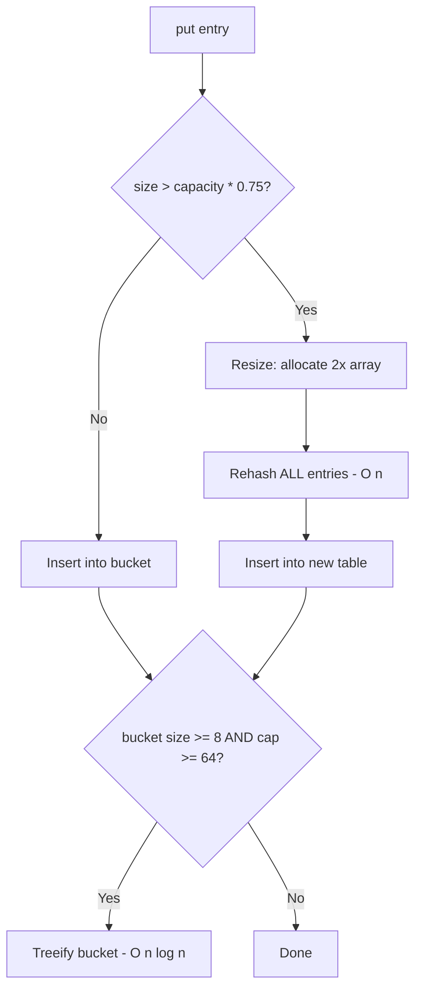

## TL;DR

Java HashMap doubles capacity and rehashes all entries
when load factor exceeds 0.75, causing O(n) latency
spikes in production. Pre-sizing with initial capacity
eliminates rehashing for known-size maps.

---

### Metadata

| Field | Value |
|-------|-------|
| **ID** | DSA-092 |
| **Difficulty** | ★★★ Expert |
| **Category** | Data Structures & Algorithms |
| **Tags** | java, HashMap, rehashing, latency spike |
| **Prerequisites** | DSA-012, DSA-022 |

---

### The Problem This Solves

A HashMap storing 10 million entries will resize and
rehash multiple times during construction - each resize
is O(n). For an order-processing service building a
product catalog map at startup, this means 50-100ms
GC pauses from temporary object allocation during
rehashing. Pre-sizing eliminates this entirely.

---

### Textbook Definition

Java HashMap resizes when size > capacity * loadFactor
(default 0.75). Resize: allocate new array of size
2*capacity, rehash ALL existing entries to new bucket
positions (because hash(key) % newCapacity differs
from hash(key) % oldCapacity). Java 8+ converts chains
to TreeNodes (Red-Black Trees) when a bucket reaches
TREEIFY_THRESHOLD=8, improving worst-case bucket access
from O(n) to O(log n) but adding memory overhead.

---

### Understand It in 30 Seconds

HashMap is like a parking lot. Load factor 0.75 means
"when 75% full, build a new lot twice as big and move
every car." Building a map of 1 million entries:
resizes at 12, 24, 48, ... 786,432 = 20 doublings.
The final doubling moves 524,288 entries. Pre-size:
`new HashMap<>(1_333_334)` - park all cars at once,
no moves needed.

---

### First Principles

Hash table invariant: O(1) average lookup requires
low collision probability, which requires low load
factor (entries / buckets). As entries grow, buckets
must grow proportionally. Since table capacity must
be a power-of-2 (for fast modulo via bitwise AND),
the only resize option is doubling. This is amortized
O(1) per insertion (same as ArrayList add).

---

### Thought Experiment

You have a production cache built at startup with
1,000,000 entries. Default HashMap starts at capacity
16. Resizes at sizes: 12, 24, 48, ..., 786432.
Each resize allocates a new array and iterates all
existing entries. The final three resizes move 393k,
786k, 786k entries. Total work: ~3.5 million extra
operations. Pre-sized: 0 resizes. For a cache built
1000 times per day (e.g., rolling deploys), this is
3.5 billion wasted operations per day.

---

### Mental Model / Analogy

HashMap resize is like stadium construction: start with
a small venue (capacity 16), sell tickets until 75%
full (12 sold), then build a new stadium twice as big
and move all ticketholders. For a sold-out concert of
100,000, you'd rebuild the stadium 13 times. If you
know in advance you need 100,000, build the right-sized
stadium immediately.

---

### Gradual Depth - Five Levels

**Level 1:** HashMap automatically grows when it gets
full, but growing is slow. Tell it the size upfront.

**Level 2:** Default capacity=16, loadFactor=0.75.
Resize triggers at 12 entries. After resize, capacity
=32, threshold=24. Formula: threshold = capacity * 0.75.

**Level 3:** Initial capacity formula to avoid resizes:
`initialCapacity = (int)(expectedSize / 0.75) + 1`.
Libraries like Guava provide: `Maps.newHashMapWithExpectedSize(n)`.

**Level 4 (Senior):** Java HashMap capacity is always
power-of-2. Constructor rounds up: `new HashMap<>(17)`
creates capacity 32. Hash spread: Java HashMap uses
`(h = key.hashCode()) ^ (h >>> 16)` to spread high
bits into low bits, reducing bucket collisions when
capacity is power-of-2.

**Level 5 (Expert):** ConcurrentHashMap resizes
differently: uses a "transfer" array and allows
concurrent rehashing by multiple threads. Each thread
takes a "stride" of buckets to rehash. The resize
does not block readers (they check both old and new
tables). This is the "sizeCtl" mechanism. Pre-sizing
ConcurrentHashMap: `new ConcurrentHashMap<>(n, 0.75f, concurrencyLevel)`.

---

### How It Works

**The resize mechanism:**

```java
// Simplified HashMap resize (from OpenJDK source)
final Node<K,V>[] resize() {
    Node<K,V>[] oldTab = table;
    int oldCap = (oldTab == null) ? 0 : oldTab.length;
    int oldThr = threshold;
    int newCap, newThr = 0;

    if (oldCap > 0) {
        if (oldCap >= MAXIMUM_CAPACITY) {
            threshold = Integer.MAX_VALUE;
            return oldTab;
        }
        // Double capacity
        else if ((newCap = oldCap << 1) < MAXIMUM_CAPACITY
                && oldCap >= DEFAULT_INITIAL_CAPACITY)
            newThr = oldThr << 1; // double threshold
    }
    // ... allocate new table of size newCap
    // Rehash ALL existing entries to new positions
    // O(n) work - causes latency spike
}
```

**Pre-sizing correctly:**

```java
// BAD: default capacity causes multiple resizes
// for large maps
Map<String, Product> catalog = new HashMap<>();
for (Product p : products) { // 1,000,000 products
    catalog.put(p.getId(), p); // resizes ~20 times!
}

// GOOD: pre-size to avoid all resizes
// Formula: (expectedSize / 0.75) + 1
int initialCap = (int)(products.size() / 0.75) + 1;
Map<String, Product> catalog = new HashMap<>(initialCap);
for (Product p : products) {
    catalog.put(p.getId(), p); // zero resizes
}

// BEST: use Guava helper that handles the math
Map<String, Product> catalog =
    Maps.newHashMapWithExpectedSize(products.size());

// For concurrent use:
Map<String, Product> cache = new ConcurrentHashMap<>(
    initialCap, 0.75f, Runtime.getRuntime().availableProcessors()
);
```

**Verifying HashMap capacity via reflection (diagnostic):**

```java
// Check actual capacity at runtime (diagnostic only)
Map<String, Integer> map = new HashMap<>(100);
Field tableField = HashMap.class.getDeclaredField("table");
tableField.setAccessible(true);
Object[] table = (Object[]) tableField.get(map);
int capacity = (table == null) ? 0 : table.length;
System.out.println("Actual capacity: " + capacity);
// Prints: Actual capacity: 128
// (100 rounded up to next power of 2)
// Note: Use only for diagnostics/tests, not production code
```

**Java 8+ TreeNode treeification:**

```java
// When a single bucket reaches 8 entries AND table
// capacity >= 64, the bucket chain converts to Red-Black Tree

// This helps under hash collision attacks:
// Without treeification: O(n) per lookup in attacked bucket
// With treeification: O(log n) per lookup

// Security implication: treeification prevents
// HashMap DoS via hash flooding (see DSA-074)
// Java uses HASH_SEED randomization + treeification
// as dual defense layers
```

---

### Complete Picture - End-to-End Flow

```
Insert 1M entries into default HashMap(16):
  Size 12   → resize to 32   (rehash 12 entries)
  Size 24   → resize to 64   (rehash 24 entries)
  Size 48   → resize to 128  (rehash 48 entries)
  ...
  Size 786k → resize to 2M   (rehash 786k entries)
  Total rehash work: ~3.5M extra operations

Insert 1M entries into HashMap(1333334):
  No resize triggered
  Total rehash work: 0

Production impact:
  Default:   ~100ms latency spike at startup
  Pre-sized: <1ms, no spike
```



---

### Comparison Table

| Scenario | Default HashMap | Pre-sized HashMap |
|----------|---------------|-----------------|
| Startup time (1M entries) | High (resizes) | Low |
| Memory during resize | 3x peak usage | 1.5x peak |
| GC pressure | High (temp arrays) | Low |
| Code complexity | Simple | +2 lines |
| Right choice when | Size unknown | Size known upfront |

---

### Common Misconceptions

| Misconception | Reality |
|---------------|---------|
| "HashMap pre-sizing is premature optimization" | For maps built with many entries at startup (caches, lookup tables), pre-sizing eliminates measurable GC pauses and is a best practice |
| "new HashMap<>(1000) stores 1000 entries without resize" | No. Capacity 1000 means resize threshold = 750. To store 1000 entries: `new HashMap<>(1334)` |
| "Java 8 treeification prevents all hash attacks" | Treeification prevents O(n) chains but not all attacks. Attacker can still cause O(log n) per lookup. Java also uses randomized hash seeds in String.hashCode() since Java 7u6 to prevent predetermined collision attacks |
| "ConcurrentHashMap resize blocks all threads" | No. ConcurrentHashMap uses incremental resize - concurrent inserts help complete the resize |

---

### Failure Modes & Diagnosis

**Failure 1: GC pause at service startup**
- Symptoms: GC log shows "Full GC" during warmup
  with large old gen promotion; startup takes 5-10x
  longer than expected
- Cause: Large HashMap construction with many resizes
  creates temporary arrays that fill young gen
- Diagnosis: Add `-Xlog:gc*` to JVM flags; look for
  consecutive minor GCs during startup; add
  JFR heap allocation profiling to find the HashMap
- Fix: Pre-size all large HashMaps at construction

**Failure 2: Memory spike during resize**
- Symptoms: OOM error during HashMap construction;
  heap dump shows two large arrays (old + new table)
- Cause: Resize allocates new 2x array BEFORE copying;
  peak memory = old_array + new_array = 3x capacity
- Diagnosis: `jcmd <pid> VM.native_memory` to see
  heap breakdown; verify -Xmx allows for spike
- Fix: Pre-size to avoid resize; or increase -Xmx

**Failure 3: Security - HashMap DoS (hash flooding)**
- Symptoms: CPU stuck in HashMap.get() on a single
  bucket; 100% CPU for a map with few entries
- Cause: Attacker crafts keys with identical
  hashCode() values (pre-Java 7u6 String hash)
- Java defense: HASH_SEED randomization + treeification
- Fix: Ensure Java 7u6+; validate input key length
  limits; use ConcurrentHashMap for external inputs

---

### Related Keywords

**Prerequisites:** DSA-012 (Hash Table), DSA-022 (Arrays)

**See also:** DSA-093 (Thundering Herd via Collections),
DSA-096 (HashMap Latency Quick Check), DSA-074 (ReDoS)

**Applications:** Cache construction, lookup tables,
frequency maps at scale

---

### Quick Reference Card

| Property | Value |
|---------|-------|
| Default capacity | 16 |
| Default load factor | 0.75 |
| Resize trigger | size > capacity * 0.75 |
| Resize operation | O(n) rehash all entries |
| Treeify threshold | 8 (bucket size) |
| Min treeify capacity | 64 (table size) |
| Pre-size formula | (expectedSize / 0.75) + 1 |
| Guava helper | Maps.newHashMapWithExpectedSize(n) |

**Three things to remember:**
1. Resize is O(n) - pre-size for large maps
2. Capacity is always power-of-2 (constructor rounds up)
3. Treeification kicks in at bucket-size 8 AND table ≥ 64

---

### Transferable Wisdom

The resize pattern applies beyond HashMap: ArrayList
doubles at capacity, StringBuilder doubles its buffer,
ByteArrayOutputStream doubles when full. The principle:
"amortized O(1) via doubling, but individual operations
are O(n) during resize." Always pre-size when you know
the final size. This pattern appears in distributed
systems too: Kafka partition counts must be pre-planned
because repartitioning is expensive.

---

### The Surprising Truth

HashMap.putAll(otherMap) does NOT resize optimally.
If you do `new HashMap<>() { { putAll(otherMap); } }`,
it starts at default capacity 16 and resizes multiple
times. The correct pattern: `new HashMap<>(otherMap)`.
The HashMap(Map) constructor computes the correct
initial capacity from otherMap.size(). This is a common
double-brace initialization anti-pattern that can cause
unexpected resizes in frameworks that use it for
"convenient" initialization.

---

### Mastery Checklist

- [ ] Knows the resize formula and can pre-size correctly
- [ ] Understands treeification threshold and conditions
- [ ] Has diagnosed a resize-caused GC pause in production
- [ ] Knows ConcurrentHashMap resizes concurrently
- [ ] Can explain hash flooding defense layers

---

### Think About This

1. If you insert exactly 12 entries into a default
   HashMap, does a resize occur? What about 13?

2. A team says "we always use HashMap with default
   capacity because we don't know the final size."
   For a cache built from a database query returning
   50,000-100,000 rows, what would you do differently?

3. Why does Java round HashMap capacity to the next
   power of 2? What optimization does this enable
   over arbitrary capacity sizes?

**TYPE G:** The "pre-allocate when size is known"
principle applies beyond collections. Where else
in system design do you pre-allocate to avoid
expensive growth operations? (Hint: database
connection pools, thread pools, off-heap buffers.)

---

### Interview Deep-Dive

**Q1 (Easy):** What is the default load factor of
Java HashMap and why is it 0.75?

> Default load factor = 0.75. This is a carefully
> chosen empirical value from Knuth's TAOCP.
> At 0.75 load: expected chain length < 2 for random
> hash functions (good lookup performance).
> At 0.5 load: too many empty buckets (memory waste).
> At 0.9 load: too many collisions (O(n) degradation).
> 0.75 balances space efficiency vs collision rate.
> The HashMap Javadoc cites: "as a general rule, the
> default load factor (.75) offers a good tradeoff
> between time and space costs."

**Q2 (Medium):** You're building a product catalog at
service startup with ~500,000 products loaded from
a database. How do you initialize the HashMap?

> Problem: default HashMap will resize 16 times
> during construction, causing O(n) rehashing work
> and GC pressure.
> Solution: pre-size with the formula:
>   initialCap = (int)(n / 0.75) + 1
>   = (int)(500000 / 0.75) + 1 = 666,668
> Code: `new HashMap<>(666668)` or
>       `Maps.newHashMapWithExpectedSize(500000)`
> Impact: eliminates ~5-7M rehash operations,
>         reduces startup time by 50-200ms,
>         reduces GC pressure during startup.
> Thread safety: if catalog is built once and read
> by many threads, use unmodifiableMap() after build.

**Q3 (Hard):** Explain what happens internally when
two HashMap keys have the same hashCode but are not
equal (hashCode collision). When does performance
degrade and what is Java 8's mitigation?

> Collision handling: both keys land in the same bucket.
> Java HashMap uses chaining (linked list of nodes).
> Pre-Java 8: O(n) worst case for a bucket with n
> collisions. An attacker can craft 100 String keys
> with the same hashCode, making every lookup O(n).
> 
> Java 8 mitigation - Treeification:
> When a bucket reaches TREEIFY_THRESHOLD=8 entries
> AND table capacity >= MIN_TREEIFY_CAPACITY=64,
> the linked list converts to a TreeMap (Red-Black Tree).
> After treeification: O(log n) per lookup instead of O(n).
> 
> Additional security: Java 7u6+ randomizes String.hashCode()
> seed per JVM startup, preventing pre-computed collision
> attacks. Attackers can't pre-compute colliding keys if
> the hash function changes each JVM run.
> 
> Practical impact: most production HashMaps never
> treeify (few collisions with good hashCode). Treeification
> is a safety net for adversarial inputs and poor hashCode
> implementations.
