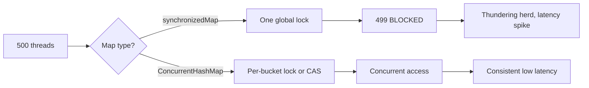

## TL;DR

Wrapping HashMap with `Collections.synchronizedMap()`
creates a single global lock - all concurrent reads
and writes block each other, causing thundering herd
under high concurrency. Use ConcurrentHashMap instead.

---

### Metadata

| Field | Value |
|-------|-------|
| **ID** | DSA-093 |
| **Difficulty** | ★★★ Expert |
| **Category** | Data Structures & Algorithms |
| **Tags** | java, concurrency, thundering herd, synchronized collections |
| **Prerequisites** | DSA-012, DSA-092 |

---

### The Problem This Solves

A team uses `Collections.synchronizedMap()` on their
shared product cache. Under load tests (500 concurrent
threads), response times spike from 5ms to 5000ms.
Thread dumps show 499 threads BLOCKED waiting for the
synchronized map's intrinsic lock. This is the thundering
herd: one thread holds the lock, everyone else waits.

---

### Textbook Definition

`Collections.synchronizedMap(map)` wraps every method
call (get, put, remove, containsKey) with `synchronized(mutex)`
where mutex = the wrapper object itself. This is a coarse-
grained global lock: only ONE thread may access the map
at any time (even concurrent reads block each other).
ConcurrentHashMap uses segment-level locking (Java 7) /
CAS + node-level locks (Java 8+), allowing O(numCPU)
concurrent reads and writes at different hash buckets.

---

### Understand It in 30 Seconds

`synchronizedMap`: one key to the whole library. Every
reader and every writer needs the key. 499 people
waiting for the one person who has the key. `ConcurrentHashMap`:
the library has 16 wings, each with its own key. 16
people can read/write simultaneously; the other 484
wait for their specific wing's key.

---

### First Principles

Synchronization granularity determines concurrency:
- Object-level lock (synchronizedMap): serializes ALL
  access. Throughput = 1 thread at a time.
- Segment-level lock (CHM Java 7): parallelism = 16
  segments by default.
- Node-level lock (CHM Java 8+): lock only the head
  of the target bucket on write; reads are lock-free
  (CAS + volatile). Throughput scales with CPU cores.

---

### How It Works

**The thundering herd scenario:**

```java
// BAD: global lock causes thundering herd
Map<String, Product> cache =
    Collections.synchronizedMap(new HashMap<>());

// 500 concurrent threads all call this:
Product get(String id) {
    return cache.get(id); // ALL serialize on one lock
}

// Thread dump shows:
// "worker-001" RUNNABLE at HashMap.get(...)
// "worker-002" BLOCKED on synchronized(cache)
// "worker-003" BLOCKED on synchronized(cache)
// ...
// "worker-500" BLOCKED on synchronized(cache)
// 499 threads waiting for 1 = thundering herd
```

**The fix - ConcurrentHashMap:**

```java
// GOOD: fine-grained locking, concurrent reads are free
Map<String, Product> cache = new ConcurrentHashMap<>();

// Reads: lock-free (uses volatile reads + CAS)
// Writes: lock only the target bucket's head node
// Concurrent read throughput: ~O(CPU count) better
Product get(String id) {
    return cache.get(id); // no lock for reads!
}

// BEST: also pre-size the ConcurrentHashMap
int concurrencyLevel = Runtime.getRuntime()
    .availableProcessors();
Map<String, Product> cache = new ConcurrentHashMap<>(
    (int)(expectedSize / 0.75) + 1,
    0.75f,
    concurrencyLevel
);
```

**The compound-operation trap:**

```java
// BAD: even with CHM, compound operations are NOT atomic
ConcurrentHashMap<String, Integer> counts =
    new ConcurrentHashMap<>();

// Non-atomic check-then-act (race condition!):
if (!counts.containsKey(key)) { // Thread A checks
    counts.put(key, 1);         // Thread B also passes
}
// Both threads insert! Result: initial value overwritten

// GOOD: use atomic compute methods
counts.compute(key, (k, v) -> v == null ? 1 : v + 1);
// OR
counts.merge(key, 1, Integer::sum);
// OR
counts.putIfAbsent(key, new AtomicInteger(0))
      .getAndIncrement();
```

**Diagnosing with thread dumps:**

```bash
# Take thread dump during high latency spike
jcmd <pid> Thread.print > threads.txt
# Look for BLOCKED threads on synchronized(...)
grep "BLOCKED" threads.txt | wc -l
# If > 50 threads blocked on the same lock: thundering herd

# Find the contended lock
grep -A 3 "BLOCKED" threads.txt | grep "waiting to lock"
# Output: waiting to lock <0x00000007d5e8f210>
# Multiple threads waiting on same address = the culprit

# With JFR
jcmd <pid> JFR.start duration=30s filename=app.jfr
# Then analyze in JDK Mission Control:
# Events > Monitor Blocked - shows lock contention
```

---

### Complete Picture - End-to-End Flow

```
Thread Pool (500 workers) all calling cache.get()

synchronizedMap:
  Worker-001 acquires lock -> executes get()
  Worker-002 to 500: BLOCKED (499 threads queued)
  Throughput: 1 op per lock acquisition + release
  Latency: 499 * (avg lock wait) = spike

ConcurrentHashMap:
  Worker-001 reads bucket-A (no lock, volatile)
  Worker-002 reads bucket-B (no lock, volatile)
  Worker-003 reads bucket-C (no lock, volatile)
  ...all 500 workers read concurrently (lock-free reads)
  Throughput: limited only by CPU/memory bandwidth
  Latency: consistent, no thundering herd
```



---

### Comparison Table

| Feature | synchronizedMap | ConcurrentHashMap |
|---------|----------------|------------------|
| Read concurrency | Serialized (1 at a time) | Lock-free (concurrent) |
| Write concurrency | Serialized | Per-bucket locked |
| Iterator | Fail-fast (throws CME) | Weakly consistent (no CME) |
| Null keys/values | Allowed (delegates to map) | Not allowed |
| Atomic compound ops | Not atomic (external sync) | putIfAbsent, compute, merge |
| Size accuracy | Exact | Approximate under concurrency |
| Use when | Single-threaded or external sync | Concurrent read/write |

---

### Common Misconceptions

| Misconception | Reality |
|---------------|---------|
| "synchronizedMap is thread-safe enough" | Thread-safe means no data corruption, NOT no contention. Under load, synchronizedMap becomes a bottleneck that serializes all access |
| "ConcurrentHashMap.get() always locks" | No. Java 8+ CHM reads are lock-free using volatile reads and CAS. Only writes to a bucket's first node use synchronized; reads never lock |
| "CHM operations are fully atomic" | Individual operations (get, put) are atomic. Compound check-then-act (containsKey + put) requires compute/merge for atomicity |
| "Iterating synchronizedMap needs no external lock" | SynchronizedMap Javadoc: 'user must manually synchronize when traversing.' Failing to do so during iteration can cause ConcurrentModificationException |

---

### Failure Modes & Diagnosis

**Failure 1: Thundering herd under load**
- Symptoms: response latency grows linearly with
  concurrent users; thread dump shows hundreds of
  BLOCKED threads on the same map lock
- Cause: synchronizedMap with many concurrent threads
- Diagnosis: `jcmd <pid> Thread.print` - count BLOCKED
  threads on same lock address
- Fix: Replace with ConcurrentHashMap

**Failure 2: ConcurrentModificationException during iteration**
- Symptoms: CME thrown during for-each or iterator
  on synchronizedMap
- Cause: another thread modifies the map during iteration
  without external synchronization
- Fix: synchronize the ENTIRE iteration block, or
  use CHM (no CME, weakly consistent iterator)

**Failure 3: Race condition with CHM compound operations**
- Symptoms: counters drift under load; cache entries
  duplicated or missing
- Cause: multi-step check-then-act on CHM without
  atomic operations
- Fix: use compute(), merge(), or putIfAbsent()

**Failure 4: Security - ReDoS via synchronized iteration**
- Cause: attacker sends requests that trigger long-running
  iteration on a large synchronizedMap
- Effect: all other threads blocked for duration of
  entire iteration
- Fix: use CHM (iteration doesn't block reads); limit
  map sizes; never expose map iteration to untrusted input

---

### Related Keywords

**Prerequisites:** DSA-012 (Hash Table), DSA-092 (HashMap Resize)

**See also:** DSA-095 (DSA Failure Modes), DSA-096 (HashMap Latency)

**Applications:** Shared caches, frequency maps, concurrent lookups

---

### Quick Reference Card

| Item | Value |
|------|-------|
| synchronizedMap lock | One global mutex (serializes everything) |
| CHM read lock (Java 8+) | None (volatile + CAS) |
| CHM write lock | Per-bucket head node |
| Atomic ops in CHM | putIfAbsent, compute, merge, computeIfAbsent |
| Null in CHM | Not allowed (NullPointerException) |
| Size under concurrency | CHM.size() is approximate |

---

### The Surprising Truth

`ConcurrentHashMap.size()` returns an approximate value
under concurrency. The exact count is maintained via
a distributed counter (similar to LongAdder) across
multiple cells to reduce contention. Under heavy
concurrent updates, two calls to `size()` milliseconds
apart can return different values even without any
external inserts or removes. If you need exact real-time
size tracking, maintain a separate AtomicLong counter
updated in parallel. This trips up engineers who assume
`size()` is always precise.

---

### Mastery Checklist

- [ ] Can explain why synchronizedMap causes thundering herd
- [ ] Diagnoses contention via thread dump analysis
- [ ] Knows CHM's lock-free read mechanism
- [ ] Uses compute/merge for atomic compound ops in CHM
- [ ] Understands CHM.size() approximation behavior

---

### Think About This

1. A read-heavy cache (99% reads, 1% writes) shows
   high latency. You're using ConcurrentHashMap.
   What else could cause contention besides the map
   type itself?

2. Why does ConcurrentHashMap not allow null keys or
   values, but HashMap does? What ambiguity would
   nulls create in a concurrent context?

3. Under what conditions might synchronizedMap actually
   outperform ConcurrentHashMap?

**TYPE G:** The "lock granularity determines throughput"
principle applies beyond maps. Where else in distributed
systems does coarse-grained vs fine-grained locking
create performance cliffs? (Hint: database row-level
vs table-level locks, Kafka partition assignment, HDFS
name node lock.)

---

### Interview Deep-Dive

**Q1 (Easy):** What is the difference between
`Collections.synchronizedMap()` and `ConcurrentHashMap`?

> synchronizedMap: wraps every method with synchronized
> on a single mutex. All reads AND writes are serialized.
> Thread-safe from data corruption perspective but
> causes thundering herd under concurrent load.
> 
> ConcurrentHashMap: designed for concurrent access.
> Java 8+: reads are lock-free (volatile + CAS), writes
> lock only the target bucket's first node. Allows
> ~(CPU count) concurrent operations.
> 
> Key differences:
> - Null: HashMap allows null, CHM does not
> - Iterator: synchronizedMap is fail-fast (CME),
>   CHM is weakly consistent (no CME)
> - Compound ops: CHM has putIfAbsent, compute, merge

**Q2 (Hard):** During peak traffic, your cache response
times jump from 2ms to 200ms. Thread dumps show 200+
BLOCKED threads. How do you diagnose and fix this?

> Step 1: Collect thread dump
>   `kill -3 <pid>` or `jcmd <pid> Thread.print`
> 
> Step 2: Find the contended lock
>   Look for "BLOCKED (on object monitor)"
>   Multiple threads with same "waiting to lock <addr>"
>   = thundering herd on that object
> 
> Step 3: Find what holds the lock
>   Thread state "RUNNABLE" with same lock address
>   in stack trace = the lock holder
> 
> Step 4: Identify the contended data structure
>   If stack shows Collections$SynchronizedMap.get()
>   or similar synchronized wrapper = the culprit
> 
> Fix options (best to worst):
>   1. Replace with ConcurrentHashMap (preferred)
>   2. Partition the map (sharding by key prefix)
>   3. ReadWriteLock (allows concurrent reads, exclusive writes)
>   4. Copy-on-write (for very read-heavy, rarely written)
> 
> Verify fix: load test after change, confirm BLOCKED
> thread count drops from 200+ to near 0.
