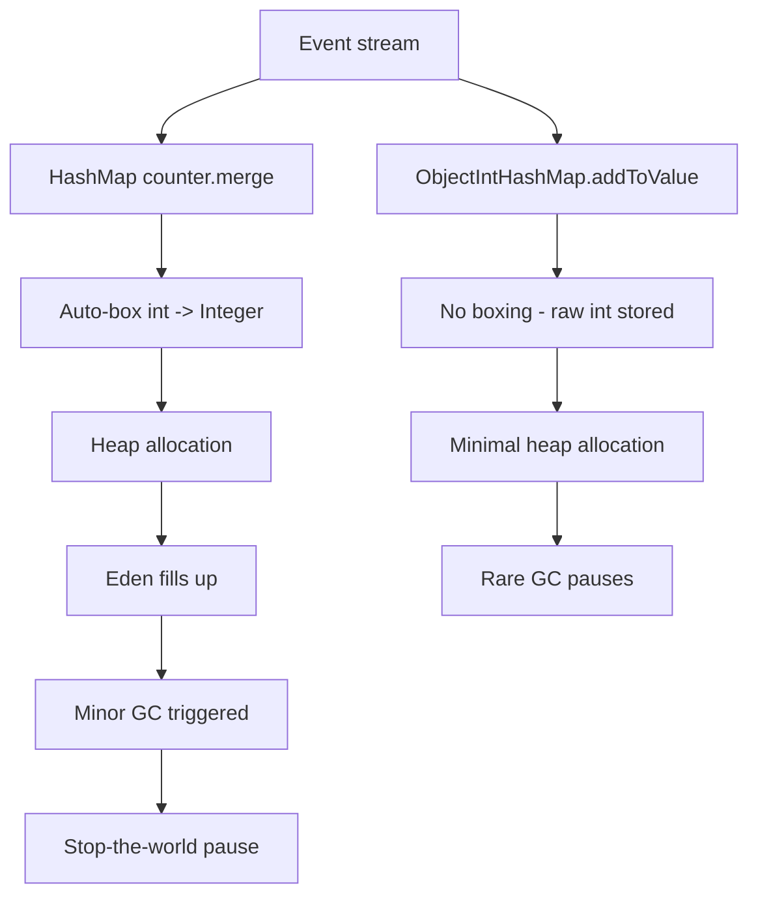

## TL;DR

Using `Integer`/`Long` in Java collections where
`int`/`long` would suffice allocates millions of objects
per second, causing frequent GC pauses. Switch to
primitive-specialized collections (Eclipse Collections,
Trove) or arrays to eliminate allocation.

---

### Metadata

| Field | Value |
|-------|-------|
| **ID** | DSA-094 |
| **Difficulty** | ★★★ Expert |
| **Category** | Data Structures & Algorithms |
| **Tags** | java, GC, boxing, primitives, heap allocation |
| **Prerequisites** | DSA-012, DSA-022 |

---

### The Problem This Solves

A high-frequency trading system processes 1M price
ticks per second. Using `HashMap<String, Double>` for
price storage creates 1M `Double` objects per second
on the heap. GC minor collections every 100ms (stop-
the-world) cause 10-50ms latency spikes during market
hours. Switching to `HashMap<String, double[]>` or a
primitive map eliminates GC pauses entirely.

---

### Textbook Definition

Java auto-boxing converts primitives (int, long, double)
to wrapper objects (Integer, Long, Double) when placed
in generic collections. Each wrapper object:
- Consumes 16 bytes on heap (object header + field)
  vs 4-8 bytes for the primitive
- Is a separate heap allocation
- Adds GC pressure (must be collected when no longer
  referenced)

For high-throughput code, millions of unnecessary
wrapper allocations per second overwhelm GC and cause
"allocation storms."

---

### Understand It in 30 Seconds

`List<Integer>` stores pointers to Integer objects.
`int[]` stores raw numbers. For 1M integers:
- `List<Integer>`: 1M Integer objects on heap = 16MB
  + list structure (8 bytes/pointer) = 24MB
- `int[]`: 4MB, zero heap objects, zero GC

The wrapper objects exist only to satisfy Java generics.
They provide no functionality beyond the primitive.
Eliminate them where performance matters.

---

### First Principles

Java generics use type erasure - generic types compile
to Object-based code. Collections of `T` become
collections of `Object` references. You can't put a
primitive `int` in an Object slot - it requires boxing
to Integer. The JIT can sometimes eliminate boxing
via escape analysis, but for shared collections
this optimization is impossible.

---

### How It Works

**Measuring the problem:**

```java
// BAD: allocation storm - 1M Integer objects/sec
Map<String, Integer> counter = new HashMap<>();
void processEvent(String key) {
    // Auto-boxes int 1 to new Integer(1) every call!
    counter.merge(key, 1, Integer::sum);
    // merge internally: unbox count, add 1, rebox result
    // Two boxing operations per call = 2M objects/sec
}

// Measure allocation rate with JFR:
// jcmd <pid> JFR.start duration=10s
//   events=jdk.ObjectAllocationInNewTLAB
//   filename=alloc.jfr
// Then in JMC: see "Integer" at top of allocation list
```

**Using Eclipse Collections (primitive map):**

```java
// GOOD: Eclipse Collections ObjectIntHashMap
// No Integer objects, all ints stored as primitives
ObjectIntHashMap<String> counter =
    new ObjectIntHashMap<>();

void processEvent(String key) {
    counter.addToValue(key, 1); // no boxing at all
}

// Benchmark: 1M events/sec
// Before: 10-50ms GC pauses every 100ms
// After: <1ms GC pauses (only String keys allocated)
```

**Pure Java alternatives:**

```java
// Alternative 1: Use int[] for dense numeric keys
// If keys are 0..N-1 integers
int[] counter = new int[N]; // 0 allocations per increment
counter[key]++;

// Alternative 2: LongAdder for single shared counter
LongAdder counter = new LongAdder();
counter.increment(); // designed for concurrent counting

// Alternative 3: Specialized maps by library
// Eclipse Collections: ObjectIntHashMap, IntIntHashMap
// Trove: TObjectIntHashMap<K>
// Koloboke: HashObjIntMap

// Alternative 4: Use long[] for time-series data
// Instead of List<Long> timestamps = new ArrayList<>()
long[] timestamps = new long[capacity];
int size = 0;
timestamps[size++] = System.nanoTime();
```

**JFR diagnosis workflow:**

```bash
# Step 1: Start JFR recording for allocation profiling
jcmd <pid> JFR.start duration=30s \
  settings=profile \
  filename=alloc.jfr

# Step 2: Reproduce the high-GC scenario (send load)

# Step 3: Dump the recording
jcmd <pid> JFR.dump filename=alloc.jfr

# Step 4: Open in JDK Mission Control
# Navigate: Events > jdk.ObjectAllocationInNewTLAB
# Sort by: total allocation bytes, descending
# Look for: Integer, Long, Double at top of list

# Step 5: Find the allocation stack trace
# JMC shows: "processEvent" -> "HashMap.merge"
#            -> "Integer.valueOf" <- boxing hotspot

# Alternative: async-profiler (open source, no JFR needed)
# async-profiler -e alloc -d 30 -f alloc.html <pid>
```

**Integer cache - the partial optimization:**

```java
// Java caches Integer values -128 to 127
// These DO NOT allocate new objects (shared instances)
Integer a = 5; // returns Integer.valueOf(5) from cache
Integer b = 5; // same cached object
System.out.println(a == b); // true (same object)

Integer c = 200; // outside cache range - new allocation
Integer d = 200;
System.out.println(c == d); // false (different objects)!

// This is why: counter.merge(key, 1, Integer::sum)
// has ZERO allocation for counts 0-127
// but creates new Integer objects for counts >= 128
// Common in frequency maps where rare events have
// large counts but common events stay in cache range
```

---

### Complete Picture - End-to-End Flow

```
Event stream (1M/sec) -> HashMap<String,Integer> counter

Each merge() call:
  1. auto-box int 1 -> new Integer(1) [allocation]
  2. retrieve existing Integer from map
  3. unbox Integer to int
  4. add int + int = int
  5. auto-box result -> new Integer(N) [allocation]
  6. store new Integer in map

Result: 2M Integer allocations/sec
  Eden space fills in ~50ms
  Minor GC triggered (stop-the-world 5-20ms)
  Repeat every 50ms = GC pauses dominate

With ObjectIntHashMap:
  Steps 1, 2, 5, 6 eliminated (no boxing)
  No Integer objects on heap
  GC pause frequency drops 10x-100x
```



---

### Comparison Table

| Collection | Primitive | Allocation | GC pressure | Memory (1M ints) |
|-----------|----------|-----------|------------|-----------------|
| `List<Integer>` | No | 1M objects | High | ~24MB |
| `int[]` | Yes | 0 | None | 4MB |
| `HashMap<K,Integer>` | No | 1 object/put | High | Map + Integer per entry |
| Eclipse ObjectIntHashMap | Yes (value) | 0 for values | Low | ~40% less than HashMap |
| Trove TObjectIntHashMap | Yes (value) | 0 for values | Low | Similar to Eclipse |

---

### Common Misconceptions

| Misconception | Reality |
|---------------|---------|
| "JIT eliminates boxing automatically" | JIT uses escape analysis to eliminate short-lived boxing in single methods, but cannot eliminate boxing when objects are stored in shared collections |
| "Integer caching means no allocation for small values" | Only -128 to 127. A frequency counter that counts events >127 times still allocates. Most real-world counts exceed this quickly |
| "Modern GC handles allocation storms fine" | G1/ZGC reduces pause duration but not allocation RATE. Allocating 2M objects/sec still stresses GC regardless of collector; CPU cycles spent in GC are not spent on business logic |
| "Use streams and collectors - they handle this" | Collectors.counting() returns Long, not long. Stream pipelines box primitives extensively. Use IntStream, LongStream, DoubleStream for primitive operations |

---

### Failure Modes & Diagnosis

**Failure 1: High minor GC frequency**
- Symptoms: GC logs show minor GC every 50-200ms;
  CPU util 10-20% from GC; request latency spikes
  with periodic pattern matching GC interval
- Diagnosis: Enable GC logging: `-Xlog:gc*:file=gc.log`
  Then: check allocation rate vs GC frequency;
  JFR allocation profiler to find hotspots
- Fix: Replace boxing collections with primitive
  alternatives for high-frequency allocation sites

**Failure 2: Integer cache mismatch bug**
- Symptoms: `==` comparison on Integer returns true
  sometimes, false other times; non-deterministic behavior
- Cause: relying on Integer == comparison (works for
  -128 to 127, fails outside range)
- Fix: ALWAYS use `.equals()` for Integer comparison;
  use `int` primitives where possible

**Failure 3: Long GC pauses at scale**
- Symptoms: 100ms+ stop-the-world pauses; promoted
  old gen objects from persistent maps with Integer values
- Cause: Long-lived cached maps use Integer values;
  Integer objects promoted to old gen; G1 full GC
  triggered when old gen fills
- Fix: Convert persistent high-churn maps to primitive
  collections; use Chronicle Map for off-heap storage

---

### Related Keywords

**Prerequisites:** DSA-012 (Hash Table), DSA-022 (Arrays)

**See also:** DSA-092 (HashMap Resize), DSA-093 (Thundering Herd),
DSA-076 (Profiling DSA Performance)

**Applications:** High-frequency event processing, metrics,
counters, time-series data

---

### Quick Reference Card

| Primitive | Wrapper | Size (primitive) | Size (wrapper) |
|----------|---------|-----------------|---------------|
| int | Integer | 4 bytes | 16 bytes |
| long | Long | 8 bytes | 24 bytes |
| double | Double | 8 bytes | 24 bytes |
| float | Float | 4 bytes | 16 bytes |

**Integer cache range:** -128 to 127 (no allocation)

**Primitive map libraries:**
- Eclipse Collections: ObjectIntHashMap
- Trove: TObjectIntHashMap
- Koloboke: HashObjIntMap

---

### The Surprising Truth

Java records (Java 16+) and value types (Project Valhalla,
Java 22+ preview) aim to finally eliminate boxing.
Valhalla's "primitive classes" can be stored directly
in collections without wrapping in Object headers.
`List<int>` may become a reality in a future Java LTS.
Until then, primitives in collections require boxing.
The pressure of high-frequency trading systems and
ML workloads has pushed this JVM feature to the top
of the priority list after 25 years of boxing overhead.

---

### Mastery Checklist

- [ ] Can identify boxing hotspots using JFR/allocation profiler
- [ ] Knows Eclipse Collections primitive map APIs
- [ ] Understands Integer cache range boundary behavior
- [ ] Has tuned a real system to eliminate GC via unboxing
- [ ] Knows when JIT escape analysis eliminates boxing

---

### Think About This

1. A metrics collection system accumulates 500 different
   counters in a `HashMap<String, Long>`. The system
   increments counters 10M times/second. What problems
   occur, and how would you redesign?

2. Why can't Java Collections framework use primitive
   specialization internally to avoid boxing? (Hint:
   type erasure)

3. If Integer caches -128 to 127, why do benchmark
   results sometimes show "no allocation" for small
   counters but suddenly spike when values exceed 127?

**TYPE G:** The primitive vs wrapper trade-off is an
instance of "representation matters more than algorithm
at scale." Where in distributed systems does choosing
the wrong data representation cause similar allocation
or memory storms? (Hint: Protobuf vs JSON, columnar
vs row storage, off-heap vs on-heap cache.)

---

### Interview Deep-Dive

**Q1 (Medium):** Your Java service shows 20% CPU usage
from garbage collection. How do you diagnose and fix it?

> Step 1: Confirm GC is the issue
>   `-Xlog:gc*:file=gc.log` - check minor GC frequency
>   and allocation rate
> 
> Step 2: Find allocation hotspots
>   JFR: `jcmd <pid> JFR.start settings=profile
>         duration=30s filename=alloc.jfr`
>   Or: async-profiler `-e alloc -d 30 -f out.html <pid>`
> 
> Step 3: Look for common patterns
>   Integer/Long/Double at top of allocation profile?
>     = boxing in collections
>   byte[]/char[] from many String operations?
>     = String concatenation in loops
>   ArrayList/HashMap objects?
>     = unnecessary collection creation in tight loops
> 
> Step 4: Fix boxing specifically
>   - Replace Map<K,Integer> with Eclipse/Trove primitive map
>   - Replace List<Integer> with int[] for numeric data
>   - Use LongAdder/AtomicLong for counters
>   - Use IntStream/LongStream instead of Stream<Integer>

**Q2 (Hard):** Explain how Java's Integer cache interacts
with concurrent code and why it can be a source of bugs.

> Integer cache: JVM maintains shared Integer instances
> for values -128 to 127. Integer.valueOf(5) returns
> the SAME object every time, from all threads.
> 
> Bug scenario 1: == comparison
>   Integer a = cache.get("count"); // from some HashMap
>   if (a == 5) { ... } // works for counts 0-127
>                       // FAILS for counts 128+
>   Always use: a.equals(5) or a.intValue() == 5
> 
> Bug scenario 2: synchronized(integer) misuse
>   Integer lock = getFromMap(key); // value might be cached
>   synchronized (lock) { ... }
>   // If another thread also synchronizes on Integer(5)
>   // from a DIFFERENT map entry, they share the lock!
>   // Cached Integer instances are shared JVM-wide.
>   // Use explicit Object locks, never Integer as monitor.
> 
> The golden rule: never use boxed primitives as
> lock monitors. Never use == for Integer comparison.
> Use primitives (int, long) in code that doesn't
> require Object references.
