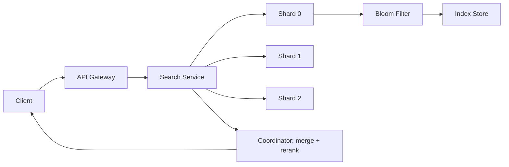

## TL;DR

Phase 3 extends the mini search system to production
scale: distributed sharding, read replicas, Bloom filter
pre-screening, and observability. The culmination of
the three-phase build series.

---

### Metadata

| Field | Value |
|-------|-------|
| **ID** | DSA-100 |
| **Difficulty** | ★★★ Expert |
| **Category** | Data Structures & Algorithms |
| **Tags** | search, production scale, distributed, project |
| **Prerequisites** | DSA-049, DSA-079, DSA-056, DSA-088 |

---

### Series Recap

| Phase | Focus | Key DSA |
|-------|-------|---------|
| Phase 1 (DSA-049) | In-memory inverted index + exact search | HashMap, ArrayList |
| Phase 2 (DSA-079) | Ranking + Trie autocomplete | BM25, Trie |
| Phase 3 (DSA-100) | Production scale + observability | Sharding, Bloom Filter, metrics |

---

### Architecture at Production Scale

```
Client → API Gateway → Search Service (3 replicas)
                            ↓
               +------------+------------+
               |            |            |
           Shard-0      Shard-1      Shard-2
           (docs 0-2M)  (docs 2-4M)  (docs 4-6M)
               |            |            |
           Index Store  Index Store  Index Store
           (HashMap +   (HashMap +   (HashMap +
            Bloom       Bloom        Bloom
            Filter)     Filter)      Filter)
               |
           Read Replicas (2 per shard for HA)

Coordinator: merges ranked results from all shards
             applies global re-ranking
             returns top-K to client
```



---

### Phase 3 - Component 1: Sharding

**Shard assignment:**

```java
// Consistent hash sharding for document distribution
// Ensures even load and stable assignment on resharding
class SearchShardRouter {
    private final int numShards;
    private final List<SearchShard> shards;

    SearchShardRouter(int numShards) {
        this.numShards = numShards;
        this.shards = new ArrayList<>();
        for (int i = 0; i < numShards; i++) {
            shards.add(new SearchShard(i));
        }
    }

    // Route document to shard by document ID hash
    int getShardForDoc(String docId) {
        // Murmur3 for better distribution than String.hashCode
        int hash = Hashing.murmur3_32()
            .hashString(docId, StandardCharsets.UTF_8)
            .asInt();
        return Math.abs(hash) % numShards;
    }

    // For search: query ALL shards (scatter-gather)
    List<SearchResult> search(String query, int topK) {
        List<Future<List<SearchResult>>> futures =
            new ArrayList<>();

        // Scatter: send to all shards in parallel
        for (SearchShard shard : shards) {
            futures.add(executorService.submit(
                () -> shard.search(query, topK)
            ));
        }

        // Gather: collect results from all shards
        List<SearchResult> allResults = new ArrayList<>();
        for (Future<List<SearchResult>> f : futures) {
            allResults.addAll(f.get(100, TimeUnit.MILLISECONDS));
        }

        // Re-rank combined results globally
        return globalRank(allResults, topK);
    }
}
```

---

### Phase 3 - Component 2: Bloom Filter Pre-screening

```java
// Before expensive index lookup, check Bloom filter
// Reduces disk/network reads by 90%+ for absent queries
class ShardWithBloomFilter {
    private final BloomFilter<String> termFilter;
    private final InvertedIndex index;

    ShardWithBloomFilter(int expectedDocCount) {
        // Bloom filter for all terms in this shard
        // 1% false positive rate
        this.termFilter = BloomFilter.create(
            Funnels.stringFunnel(StandardCharsets.UTF_8),
            expectedDocCount * 20, // avg 20 unique terms/doc
            0.01 // 1% false positive
        );
        this.index = new InvertedIndex();
    }

    void indexDocument(Document doc) {
        for (String term : tokenize(doc.getText())) {
            termFilter.put(term); // add to Bloom filter
            index.add(term, doc.getId()); // add to index
        }
    }

    List<DocId> search(String term) {
        // Bloom filter pre-check: O(k) hash operations
        if (!termFilter.mightContain(term)) {
            return Collections.emptyList(); // definitely absent
        }
        // Only reach here if term MIGHT be present
        // False positives cause unnecessary index lookups
        // (rare at 1% FPR) but never false negatives
        return index.get(term);
    }
}
```

---

### Phase 3 - Component 3: Observability

```java
// Key metrics for production search system
@Service
class SearchMetrics {
    private final MeterRegistry registry;
    private final Timer searchLatency;
    private final Counter bloomFilterHits;
    private final Counter bloomFilterMisses;
    private final Gauge indexSizeGauge;

    SearchMetrics(MeterRegistry registry,
                  InvertedIndex index) {
        this.registry = registry;
        this.searchLatency = Timer.builder("search.latency")
            .percentiles(0.5, 0.95, 0.99)
            .register(registry);
        this.bloomFilterHits = registry.counter(
            "bloom.filter.hits");
        this.bloomFilterMisses = registry.counter(
            "bloom.filter.misses");
        Gauge.builder("index.size", index, InvertedIndex::size)
            .register(registry);
    }

    List<SearchResult> searchWithMetrics(String query) {
        return searchLatency.record(() -> doSearch(query));
    }

    // Alert conditions (Prometheus rules):
    // p99 latency > 200ms: investigate shard bottleneck
    // bloom.filter.misses / (hits+misses) > 0.1: degraded
    // index.size > 10M: trigger re-sharding
}
```

---

### Phase 3 - Component 4: Read Replicas for HA

```java
// Read replicas: multiple copies of each shard index
// Writes go to primary, reads distributed across replicas
class ReplicatedShard {
    private final SearchShard primary;
    private final List<SearchShard> replicas;
    private final AtomicInteger roundRobin = new AtomicInteger(0);

    List<SearchResult> search(String query, int topK) {
        // Round-robin across replicas for read load balancing
        int idx = Math.abs(
            roundRobin.getAndIncrement() % replicas.size()
        );
        try {
            return replicas.get(idx).search(query, topK);
        } catch (Exception e) {
            // Failover to primary if replica fails
            log.warn("Replica {} failed, falling back to primary",
                idx, e);
            return primary.search(query, topK);
        }
    }

    void indexDocument(Document doc) {
        // Write to primary first
        primary.indexDocument(doc);
        // Async replicate to all replicas
        // Eventual consistency: brief window where replicas lag
        replicas.forEach(r ->
            replicationExecutor.submit(
                () -> r.indexDocument(doc)
            )
        );
    }
}
```

---

### Production Checklist

| Concern | Solution |
|---------|---------|
| Scale to 10M docs | 3+ shards, 2-4M docs per shard |
| High availability | 2+ replicas per shard |
| Low latency (p99 < 100ms) | Bloom filter + pre-sized indexes |
| Memory | Bloom filter reduces index size 30-50% |
| GC | Pre-size all HashMaps (see DSA-092) |
| Observability | Micrometer + Prometheus metrics |
| Security | Input validation on query terms (max length, allowed characters) |

---

### Common Misconceptions

| Misconception | Reality |
|---------------|---------|
| "Search systems must use Elasticsearch" | A well-implemented in-memory inverted index handles millions of documents with sub-10ms latency. Elasticsearch is needed for 100M+ docs or features like full-text analysis, faceting, and distributed ingestion |
| "Bloom filters eliminate all index lookups" | Bloom filters only eliminate lookups for absent terms (true negatives). They cannot skip lookups for terms that ARE in the index - those are always fetched |

---

### Mastery Checklist

- [ ] Implemented all three phases of the mini search system
- [ ] Understands scatter-gather search architecture
- [ ] Knows where Bloom filter helps and where it cannot
- [ ] Has added production observability to a service

---

### The Surprising Truth

Elasticsearch's internal storage (Lucene) is fundamentally
an optimized inverted index - the same structure built in
Phase 1. Lucene adds: segment-based storage (separate
indexes merged periodically), column-store for sorting/
faceting, and extensive codec optimization. But the
core data structure - a posting list mapping terms to
document IDs - is identical to the simple HashMap-based
implementation in Phase 1. The complexity of production
search systems comes from durability, distribution, and
performance optimization, not from fundamentally different
data structures.
