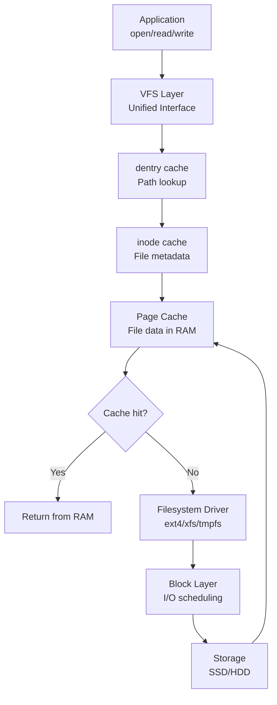

## TL;DR

The Linux Virtual File System (VFS) is a kernel abstraction layer that
makes all filesystem types (ext4, xfs, tmpfs, procfs) look identical to
applications. Every file has an **inode** (unique ID + metadata: size,
permissions, timestamps, block pointers) and a **directory entry (dentry)**
(name-to-inode mapping). `stat filename` shows inode details. `df -i` shows
inode usage. Hard links share an inode; soft links point to a path. Inode
exhaustion (`df -i` shows 100% used) prevents new file creation even when
disk space remains. Page cache is the kernel's RAM cache for file data -
`free` shows cached memory.

---

### Metadata

| Field | Value |
|-------|-------|
| **ID** | LNX-046 |
| **Difficulty** | ★★☆ Intermediate |
| **Category** | Linux |
| **Tags** | inode, VFS, dentry, page cache, superblock, stat, hard link, soft link |
| **Prerequisites** | LNX-007, LNX-008 |

---

### The Problem This Solves

**Problem 1**: A server has 50 GB free disk space but `df -i` shows 100%
inode usage. `touch newfile` fails with "No space left on device." Understanding
inodes explains why disk space and file count are separate limits.

**Problem 2**: You rename a file on the same filesystem - it's instantaneous.
You copy a file - it takes seconds. Why? Rename changes only the directory
entry (dentry), not the data. Copy reads all file data and writes new blocks.

**Problem 3**: How does `cat /proc/cpuinfo` work if `/proc` isn't on disk?
VFS abstraction: procfs generates data on-demand; VFS presents it with the
same interface as disk files.

---

### Textbook Definition

**Virtual File System (VFS)**: A kernel abstraction layer providing a
uniform interface to all filesystem implementations. Applications call
`open()`, `read()`, `write()` - VFS routes to the correct filesystem driver.

**Inode (Index Node)**: A data structure storing file metadata. NOT the
filename (that's in the directory entry). Each inode has a unique number
within a filesystem. Stores: type, permissions, owner, timestamps (atime,
mtime, ctime), link count, file size, pointers to data blocks.

**Directory entry (dentry)**: Maps a filename to an inode number within
a directory. Multiple dentries (hard links) can point to the same inode.
Kernel caches dentries in the "dentry cache" for path lookup performance.

**Page cache**: The kernel's unified cache for filesystem data. When you
read a file, data is loaded into page cache (RAM). Subsequent reads come
from RAM. Writes go to page cache first (writeback cache) and are flushed
to disk by the pdflush daemon or on `sync`/`fsync()`.

**Superblock**: Filesystem-wide metadata: total inodes, total blocks,
free inodes, free blocks, filesystem type, block size. One per mounted
filesystem.

---

### Understand It in 30 Seconds

```bash
# === Inode information ===
stat filename              # inode number, size, timestamps, permissions
stat -f /                  # filesystem (superblock) stats

ls -i filename             # show inode number
ls -i /tmp/                # inode numbers for all files in /tmp

# Find file by inode number:
find / -inum 12345 2>/dev/null

# === Inode usage ===
df -i                      # inode usage per filesystem
df -ih                     # human readable
# 100% inode usage = can't create new files, even if disk space free

# === Hard links vs soft links ===
ln file hardlink           # creates another dentry for same inode
ln -s file softlink        # creates symlink (new inode pointing to path)

# Verify: hard links share inode number
stat file                  # shows: Inode: 123456  Links: 1
ln file hardlink2
stat file                  # shows: Inode: 123456  Links: 2
stat hardlink2             # shows: same Inode: 123456  Links: 2
stat softlink              # different inode! (softlink has its own inode)

# Hard link deleted -> inode link count decreases
# When count reaches 0 -> inode freed -> data blocks freed
rm hardlink2               # count back to 1
rm file                    # count goes to 0 -> data deleted

# === Page cache ===
free -h                    # "buff/cache" column = page cache
cat /proc/meminfo | grep -E "^Cached:|^Buffers:|^Active\(file\)"
sync                       # flush page cache to disk

# Drop page cache (for benchmarking - NOT in production!):
echo 3 > /proc/sys/vm/drop_caches

# See which files are in page cache:
# Install: apt install linux-tools-common
# vmtouch file             # shows how much of a file is in page cache

# === VFS: all filesystems look the same ===
cat /proc/cpuinfo          # procfs - data generated on-demand
cat /sys/class/net/eth0/speed  # sysfs - kernel object attributes
cat /tmp/myfile            # tmpfs - data in RAM
cat /home/user/data.txt    # ext4 - data on disk
# All use the same read(2) system call! VFS handles the difference.
```

---

### First Principles

**Inode structure (simplified):**
```
Inode 12345:
  type: regular file       (or: dir, symlink, block dev, char dev, fifo)
  mode: 644                (permissions: rw-r--r--)
  uid: 1000, gid: 1000     (owner/group)
  size: 4096 bytes
  atime: 2024-01-15 10:00  (last access)
  mtime: 2024-01-14 09:00  (last modification of DATA)
  ctime: 2024-01-14 09:00  (last change to INODE, e.g., chmod)
  link_count: 2            (number of hard links to this inode)
  data blocks: [block 500, block 501, block 502, block 503]
  (for large files: block pointers include indirect, double-indirect blocks)

NOTE: the FILENAME is NOT in the inode!
Filename lives in the DIRECTORY that contains the file.
```

**Directory structure:**
```
Directory inode 100 (represents /home/user/):
  data blocks contain entries like:
  [inode 12345] -> "data.txt"
  [inode 12346] -> "script.sh"
  [inode 12347] -> "logs"   (this inode is itself a directory)
  [inode 12345] -> (hard link: same inode as data.txt)

When you: rename /home/user/data.txt /home/user/data.txt.bak
  -> just changes "data.txt" to "data.txt.bak" in directory entries
  -> inode 12345 unchanged, data blocks unchanged
  -> INSTANT (no data movement)

When you: cp /home/user/data.txt /home/user/data.txt.bak
  -> reads all data blocks of inode 12345
  -> allocates NEW inode (12348)
  -> writes all data to NEW blocks
  -> adds "data.txt.bak" -> inode 12348 in directory
  -> SLOW (proportional to file size)
```

**VFS layer diagram:**
```
Application: open("/etc/hosts", O_RDONLY)
                  |
           System Call Interface (read(2), write(2), open(2))
                  |
         +--------+--------+
         |   VFS Layer     |   <- Unified interface
         |                 |   <- Path resolution (uses dentry cache)
         |  inode ops      |   <- inode_operations: create/unlink/mkdir
         |  file ops       |   <- file_operations: read/write/mmap
         +--+---+---+---+--+
            |   |   |   |
           ext4 xfs tmp proc
           (disk)(disk)(RAM)(virtual)
                  |
         +--------+--------+
         |  Page Cache     |   <- RAM cache for file data
         +--------+--------+
                  |
         +--------+--------+
         | Block Layer     |   <- I/O scheduling, merging
         +--------+--------+
                  |
              SSD / HDD
```



---

### Thought Experiment

Inode exhaustion on a mail server:

```bash
# Situation: /var partition shows disk space available but touch fails

touch /var/spool/mail/newmessage
# touch: cannot touch '/var/spool/mail/newmessage': No space left on device

df -h /var       # shows: 60% used - plenty of space!
df -i /var       # shows: 100% inodes used!

# Why? Each email is a separate file. Millions of small files -> millions
# of inodes consumed. The filesystem ran out of inode entries.

# Investigation:
df -i            # find which filesystem is 100%
# /dev/sdb1   4194304 4194304   0 100% /var

# Find directory with most files:
find /var -type d | while read dir; do
    count=$(ls -A "$dir" | wc -l)
    echo "$count $dir"
done | sort -rn | head -10

# Or faster (using find):
find /var -type d -printf '%i\n' | sort | uniq -c | sort -rn | head

# Typically: /var/spool/mail or /var/log or temp directories

# Solutions:
# 1. Delete old files: find /var/spool/mail -mtime +30 -delete
# 2. Archive: tar -czf archive.tar.gz /var/spool/mail/ && rm -rf ...
# 3. Long-term: use a filesystem with more inodes (mkfs.ext4 -N 10000000)
#    or use XFS (which creates inodes dynamically)

# How to check inode count at mkfs time:
tune2fs -l /dev/sdb1 | grep "Inode count"
# Inode count: 4194304  (set at filesystem creation, fixed for ext4)

# XFS: inodes allocated dynamically (no fixed inode count)
# This is one reason to prefer XFS for workloads with many small files
```

---

### Mental Model / Analogy

```
VFS = The library catalog system
      (every book type - digital, physical, microfilm -
       is searched the same way, returned the same way)

Inode = The library catalog card for a book
        (card has: genre, author, location/shelf, dates)
        (card does NOT have the book's title - that's in the index)

Directory entry (dentry) = The index entry
        (title -> card number -> you go find the physical card)
        (multiple index entries can point to the same card = hard links)

Filename = The title in the index
        (NOT on the card itself)
        (you can add multiple index entries pointing to same card)
        (removing one index entry doesn't delete the card)
        (the card is deleted only when ALL index entries are removed)

Page cache = The reading desk
        (recently opened books are kept on the desk for quick access)
        (returning a book = flushing to shelf = writeback to disk)

Inode exhaustion = Running out of catalog cards
        (even if shelves have space, can't add more books - no cards)
```

---

### Gradual Depth - Five Levels

**Level 1:**
Every file has an inode (ID + metadata). Directory entry maps name to
inode. `stat filename` shows it all. `df -i` shows inode usage - 100%
means no new files can be created even if disk has space. Hard link =
another name for same inode. Symlink = separate inode pointing to a path.

**Level 2:**
VFS provides a unified interface: ext4, xfs, tmpfs, procfs all implement
VFS operations. Page cache: file reads are cached in RAM (`free` shows
"buff/cache"). Dentry cache: path lookups cached in RAM for speed.
Inode cache: open file metadata in RAM. Together these three caches
make Linux fast for workloads with repeated file access patterns.

**Level 3:**
Inode data structure: direct blocks (1-12 blocks), single-indirect
block (pointer to block of pointers), double-indirect, triple-indirect.
ext4 uses extents instead (contiguous ranges), more efficient for large
files. `tune2fs -l /dev/sda1` inspects filesystem. `debugfs` for ext4
internals. `xfs_info` for XFS. The "link_count = 0, file is open" case:
kernel keeps data until all file descriptors closed (deleted temp files
in /tmp are a common pattern - file is deleted but space not freed until
process closes it).

**Level 4:**
VFS object model: `inode_operations` (create, unlink, mkdir, rename,
symlink), `file_operations` (read, write, mmap, ioctl, llseek),
`super_operations` (statfs, sync). Each filesystem implements these
function tables. Page cache I/O: `readpage`, `writepage` in address_space_operations.
mmap: maps file into process address space via page cache. `fallocate`:
preallocates space without writing data. fsync vs fdatasync: fsync flushes
data AND metadata, fdatasync flushes data only.

**Level 5:**
Copy-on-Write filesystems (btrfs, ZFS): pages are shared until modified,
then copied. Enables instant snapshots. Extent tree (btrfs): tracks which
blocks belong to which file via a B-tree. Log-structured filesystems (F2FS,
NILFS2): write sequentially, never overwrite in place - optimized for flash.
io_uring: new Linux kernel async I/O interface bypassing traditional VFS
path for high-performance I/O. XFS real-time subvolume: second allocation
region with predictable allocation timing for real-time workloads.

---

### Code Example

**BAD - not understanding file deletion semantics:**
```java
// BAD: Thinking file is deleted when you call delete() in Java:
File tempFile = File.createTempFile("data", ".tmp");
// write data to tempFile...
RandomAccessFile raf = new RandomAccessFile(tempFile, "r");
// Later:
tempFile.delete();   // WRONG: deletes directory entry (dentry)
                     // But the file DESCRIPTOR is still open!
                     // Disk space NOT freed until raf.close()!
raf.close();         // NOW the space is freed (link count -> 0)

// This is how "the df command shows low space but there are no large files"
// Happens: a log file was deleted while a process still had it open
// Space isn't freed until the process closes or dies.

// Find this situation:
// lsof | grep "(deleted)"   <- shows open deleted files
// lsof +L1                  <- shows files with link count 0 (deleted but open)
```

**GOOD - using VFS patterns correctly:**
```bash
# Find files deleted but still consuming space (open by process):
lsof +L1 2>/dev/null | grep -E "REG.*0"
# Output: PID, user, FD, type, SIZE - find the process holding the file

# For that process, check which file was deleted:
lsof -p PID 2>/dev/null | grep deleted
# Shows the file's original path (now deleted)

# Solutions:
# 1. Restart the process (closes the file descriptor)
# 2. Truncate the file via /proc (avoids restart):
# cat /dev/null > /proc/PID/fd/FD_NUMBER
# (truncates the file to 0 bytes, freeing the space immediately)
# The process continues running, file descriptor still valid,
# but file is now empty -> space freed without restart!

# Verify:
df -h /var    # should show freed space after truncation

# Finding inode exhaustion:
df -i         # identify filesystem at 100%
# Then find the directory hoarding inodes:
for d in $(find /var -maxdepth 3 -type d 2>/dev/null); do
    echo "$(ls -A "$d" 2>/dev/null | wc -l) $d"
done | sort -rn | head -20
```

---

### Comparison Table

| Concept | Hard Link | Soft Link (Symlink) |
|---------|-----------|---------------------|
| **Inode** | Same inode as target | New inode |
| **Cross-filesystem** | No (same FS only) | Yes |
| **Target type** | Files only | Files and directories |
| **If target deleted** | Data survives (another link exists) | Dangling symlink (broken) |
| **Link count effect** | Increments inode link count | No effect on target |
| **`ls -l` indicator** | Looks like regular file | Shows `->` target |
| **Use case** | Multiple names for same data | Aliases, /etc -> /usr/etc |

---

### Common Misconceptions

| Misconception | Reality |
|--------------|---------|
| "`rm` deletes the file immediately" | `rm` removes the directory entry (dentry) and decrements the inode's link count. If the link count reaches 0 AND no process has the file open, the inode and data blocks are freed. If a process has the file open, the data blocks remain until the file descriptor is closed. `lsof +L1` shows open files with no directory entry (deleted but held open). |
| "Copying a file is the same as creating a hard link" | Completely different. A hard link (`ln file hardlink`) creates a new directory entry pointing to the SAME inode - same data, same metadata, instant, no extra disk space. A copy (`cp file copy`) creates a NEW inode with new data blocks - different data, twice the space, takes time proportional to file size. Modifying the copy doesn't affect the original. |
| "The page cache wastes RAM" | Page cache is a performance feature, not waste. Linux uses all available RAM as page cache. When a program needs memory, the kernel can evict clean page cache pages instantly (clean = page cache matches disk, no write needed). `free -h` showing 90% used is GOOD - most of it is cache. Only worry if `free` shows high "used" and low "buff/cache". |
| "Inode exhaustion is always caused by running out of disk space" | Inode exhaustion is completely independent of disk space. You can have 500 GB free and 0 inodes available. Ext4 creates a fixed number of inodes at `mkfs` time (based on filesystem size). Workloads that create millions of small files (mail, session files, temp files, npm packages, container layers) can exhaust inodes while leaving disk space available. |
| "/proc and /sys are like regular files" | `/proc` and `/sys` are virtual filesystems - no disk I/O occurs. The kernel generates data on-demand when you read from them. Writing to `/proc/sys/net/ipv4/ip_forward` directly modifies a kernel parameter (no disk written). `wc -l /proc/1/maps` counts lines but the file has no size on disk. The VFS abstraction makes them look like files. |

---

### Failure Modes & Diagnosis

**"No space left on device" with disk space available:**
```bash
# Symptom: write fails with ENOSPC, but df shows space available

# Diagnosis 1: inode exhaustion
df -i            # look for filesystem at 100% inodes

# Diagnosis 2: open deleted files consuming space
lsof +L1 2>/dev/null | awk '{print $7, $9}' | sort -rn | head -10
# Lists size and path of open-but-deleted files

# Diagnosis 3: filesystem corruption (rare)
dmesg | grep -i "EXT4-fs error\|I/O error\|XFS error"
# I/O errors or FS errors can prevent writes even with space available

# Fix inode exhaustion:
# 1. Delete unnecessary files with many inodes:
find /var/cache -name "*.pyc" -delete    # Python cache files
find /tmp -mtime +7 -delete             # old temp files
# 2. Reformat with more inodes (requires backup + wipe):
mkfs.ext4 -N 8388608 /dev/sdb1   # 8M inodes
# 3. Switch to XFS (dynamic inode allocation):
mkfs.xfs /dev/sdb1               # no fixed inode limit

# Fix open deleted file consuming space (without restart):
pid=<PID>  fd=<FD>
cat /dev/null > /proc/$pid/fd/$fd
df -h           # verify space recovered
```

---

### Related Keywords

**Foundational:**
LNX-007 (Linux FHS), LNX-008 (File Permissions)

**Builds on this:**
LNX-049 (Filesystem Types), LNX-054 (LVM), LNX-080 (Container Internals)

**Related:**
LNX-053 (/sys Filesystem), OSY-020 (Virtual Memory)

---

### Quick Reference Card

| Command | Purpose |
|---------|---------|
| `stat file` | Show inode details (number, size, timestamps) |
| `ls -i` | Show inode numbers |
| `df -i` | Inode usage per filesystem |
| `find / -inum N` | Find file by inode number |
| `ln file hardlink` | Create hard link |
| `ln -s target link` | Create symlink |
| `lsof +L1` | Show open deleted files (consuming space) |
| `free -h` | See page cache usage |
| `echo 3 > /proc/sys/vm/drop_caches` | Drop page cache (testing only) |

**3 things to remember:**
1. Inode has metadata (not filename); directory entry maps name-to-inode
2. `df -i` for inode usage - 100% inode = can't create files even if disk free
3. Deleted file's space not freed until ALL hard links removed AND all FDs closed

---

### Transferable Wisdom

VFS pattern is universal: S3 APIs present objects with "file-like" operations
(get/put = read/write). FUSE (Filesystem in Userspace) lets you write
a filesystem in any language (s3fs, sshfs, AVFS). Kubernetes uses VFS
concepts: ConfigMaps and Secrets mounted as files in pods (kubelet creates
tmpfs with the content). Container layer filesystem (overlayfs): stacks
read-only layers (like hard links to base image blocks), only modified
files get written to the upper (writable) layer.

The "open deleted file" pattern (data persists until last reference closed)
appears in: reference-counted objects in Python/Java (GC collects object
when refcount = 0), Kubernetes Pod deletion (pod kept until graceful
shutdown period, then reaped), TCP TIME_WAIT (socket "deleted" from
connection perspective but kernel holds it briefly after close).

---

### The Surprising Truth

The `mtime` (modification time) and `ctime` (change time) on a file are
different things - and many developers confuse them. `mtime` is updated
when the file's DATA changes (write). `ctime` is updated when the file's
METADATA changes (chmod, chown, rename, hard link addition/removal) OR
when data changes. There is NO creation time in traditional Unix VFS -
the standard POSIX `stat()` syscall has no "birthtime" field. Linux added
`st_birthtim` in the `statx()` syscall (kernel 4.11), and ext4 stores
creation time, but the POSIX API still doesn't expose it. This is why
`ls -l` shows "modification time" not "creation time." If you want creation
time on Linux, use `stat` which may show "File: Created" if the filesystem
supports it, or `statx` if your kernel is 4.11+. The design decision
was intentional - Unix designers felt creation time was rarely useful
and adding it to every inode wastes space.

---

### Mastery Checklist

- [ ] Understands the difference between inode, dentry, and filename
- [ ] Can check inode usage and diagnose inode exhaustion
- [ ] Can find and free space held by open deleted files
- [ ] Understands VFS as a unifying abstraction across filesystem types
- [ ] Can explain why rename is instant but copy is slow

---

### Think About This

1. A Java application creates temporary files and deletes them via
   `File.delete()` before closing the FileInputStream. After running
   for 2 weeks, the server's `/tmp` partition shows 98% full, but `ls -la /tmp`
   shows only a few small files. What is happening? How would you diagnose
   and fix it without restarting the Java application?

2. `df -h /` shows 70% used. `du -sh /*` sums to 40% of disk size.
   Where is the missing 30%? List at least three explanations for this
   discrepancy (hint: think about what `du` counts vs what `df` measures).

3. You delete a 10 GB log file from a running nginx server
   (`rm /var/log/nginx/access.log`). `df -h` still shows the 10 GB used.
   The file doesn't appear in `ls`. How do you free the space WITHOUT
   restarting nginx? Write the exact commands.

---

### Interview Deep-Dive

**Foundational:**
Q: What is an inode? What information does it contain, and what does it NOT contain?
A: An inode (index node) is a data structure in the kernel that stores metadata about a file. CONTAINS: file type (regular file, directory, symlink, block device, character device, FIFO/pipe, socket), permission bits (rwxrwxrwx), UID and GID (owner), file size in bytes, timestamps (atime = last access, mtime = last data modification, ctime = last metadata change), link count (number of directory entries pointing to this inode), pointers to data blocks (ext4 uses extent trees; older ext2/3 used direct/indirect block pointers). DOES NOT CONTAIN: the filename (that lives in the directory entry/dentry), the full path, creation time (traditional POSIX stat has no birthtime - statx syscall on Linux 4.11+ adds it). This design enables hard links: multiple filenames (dentries) can point to the same inode. The file data is truly deleted only when inode link count reaches 0 AND no process has the file open. `stat filename` displays all inode information. `ls -i` shows inode numbers. The inode number uniquely identifies a file within a filesystem.

**Intermediate:**
Q: Explain the Linux page cache. When is it useful, and when can it cause problems?
A: The page cache is the kernel's memory-based cache for filesystem data. When a file is read, data is loaded into page cache (RAM) and returned to the process. Subsequent reads of the same data come from RAM (microseconds) instead of disk (milliseconds). Writes are typically buffered in page cache first ("writeback cache") and flushed to disk asynchronously by the kernel, or synchronously on `fsync()`/`fdatasync()`. `free -h` shows page cache as "buff/cache." Linux uses ALL available RAM for page cache - not wasted, it's immediately evictable when a process needs RAM (clean pages require no disk write to evict). USEFUL: database sequential scans, frequently accessed config files, static content serving (nginx reads files into page cache on first request, subsequent requests are RAM-speed). PROBLEMS: (1) Write-back cache: power failure after `write()` but before kernel flushes to disk = data loss unless you call `fsync()`. Databases use O_DIRECT or fsync to bypass write-back. (2) Cache pressure: a large sequential read of a huge file can evict more useful cache data. Use `posix_fadvise(POSIX_FADV_DONTNEED)` to tell kernel not to cache large one-time-read files. (3) Stale data: when multiple systems write to the same NFS file without coordination, each has its own page cache. One server's write might not be visible to another. NFS uses cache coherency protocols but it's not instant.

**Expert:**
Q: How does Docker's overlayfs use the VFS inode model to enable fast container startup?
A: Docker uses overlayfs (overlay filesystem) to layer multiple directories and present them as a single merged filesystem. The layers are: (1) Lower layers (read-only): the base image layers, stacked. Each layer is a directory of files. (2) Upper layer (read-write): the container's writable layer. (3) Work directory: used by overlayfs internally. VFS presents the merge of all layers. Key operations using VFS concepts: READING a file that exists only in a lower layer: VFS reads directly from the lower layer directory. The file is NOT copied to the upper layer. This is why containers start fast - they don't copy 500 MB of image data, they just reference the lower layers. WRITING a file from a lower layer: Copy-on-Write (CoW). The file is copied from the lower layer to the upper layer ON FIRST WRITE. After that, all writes go to the upper layer copy. This is the "copy" in Copy-on-Write. DELETING a file from a lower layer: overlayfs creates a "whiteout" file in the upper layer (a special character device with 0,0 numbers). The merge algorithm hides files that have a whiteout in the upper layer. INODE implications: each layer has its own inode namespace. After merge, inodes from different layers can have the same number. This causes problems with some tools that rely on inode numbers for deduplication or change detection. Docker uses `diff` (comparing directory trees) rather than inode numbers for layer comparison. The overlay approach means 100 containers running the same image share the same lower layer pages in page cache - very memory efficient.
