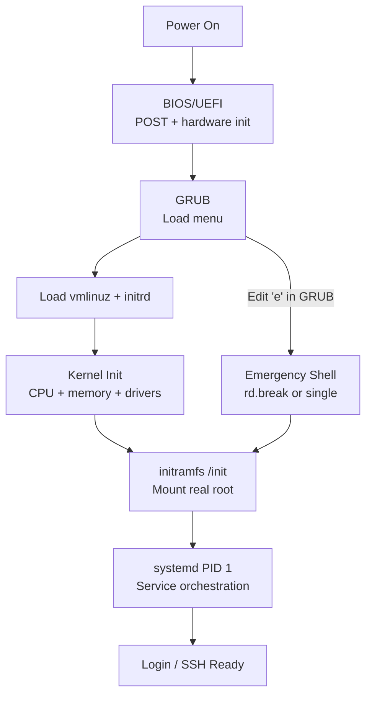

## TL;DR

Linux boot sequence: BIOS/UEFI (firmware initializes hardware) -> GRUB
(bootloader loads kernel and initrd) -> Kernel initialization (mounts
initramfs, detects hardware) -> PID 1 (systemd starts) -> systemd
activates targets and services. `dmesg` shows kernel boot messages.
Boot troubleshooting: GRUB menu allows kernel parameter editing (add
`rd.break` for emergency shell, `single` for single-user mode). Kernel
logs go to `/var/log/kern.log` or `journalctl -k`. UEFI replaces BIOS
on modern hardware and requires a FAT32 EFI System Partition (ESP).

---

### Metadata

| Field | Value |
|-------|-------|
| **ID** | LNX-048 |
| **Difficulty** | ★★☆ Intermediate |
| **Category** | Linux |
| **Tags** | boot, BIOS, UEFI, GRUB, initrd, initramfs, kernel, systemd, dmesg |
| **Prerequisites** | LNX-031, OSY-001 |

---

### The Problem This Solves

**Problem 1**: A server fails to boot after a kernel update. Understanding
the boot sequence tells you WHERE it failed: GRUB (bootloader broken),
initramfs (drivers missing), or systemd (service dependency issue). Each
failure point has different fixes.

**Problem 2**: A Linux server is "stuck" - you can't SSH in and the console
shows a kernel panic. Understanding the boot process lets you: boot to GRUB,
edit kernel parameters, add `rd.break` to drop into an emergency shell before
systemd starts, and diagnose from there.

**Problem 3**: Migrating from BIOS to UEFI, or understanding why a new server
won't boot from an old disk - different partition requirements (MBR vs GPT,
EFI System Partition).

---

### Textbook Definition

**BIOS (Basic Input/Output System)**: Legacy firmware stored in ROM/flash.
First software to run on power-on. Performs POST (Power-On Self-Test),
detects hardware, loads the first sector (MBR) of the boot device, hands
off to bootloader.

**UEFI (Unified Extensible Firmware Interface)**: Modern replacement for BIOS.
Reads the EFI System Partition (ESP, FAT32, /boot/efi/). Loads EFI
applications (GRUB or direct kernel boot). Supports Secure Boot (only
signed kernels/bootloaders run). Faster POST, better hardware support.

**GRUB (GRand Unified Bootloader)**: Bootloader that reads its config
(`/boot/grub/grub.cfg` or `/boot/grub2/grub.cfg`), presents a boot menu,
loads the Linux kernel (`vmlinuz`) and initramfs (`initrd.img`) into RAM,
passes control to the kernel with command-line parameters.

**initramfs/initrd (initial RAM filesystem)**: A compressed archive (cpio)
that the kernel mounts as a temporary root filesystem. Contains just enough
drivers and tools to mount the real root filesystem. Generated by `mkinitramfs`
or `dracut`. Lives at `/boot/initrd.img-VERSION`.

**Kernel initialization**: Kernel decompresses, initializes the CPU,
memory, device drivers. Mounts initramfs. Runs `/init` inside initramfs,
which locates and mounts the real root filesystem, then execs `/sbin/init`
(systemd).

---

### Understand It in 30 Seconds

```bash
# === Boot message inspection ===
dmesg                      # kernel ring buffer (boot + runtime messages)
dmesg | head -50           # early boot messages
dmesg | grep -i error      # kernel errors
dmesg -T                   # with human-readable timestamps
dmesg | grep -E "EXT4|XFS|btrfs"   # filesystem detection
dmesg | grep -i "cpu\|mem" # hardware detection

# === Boot log ===
journalctl -b              # current boot logs (all units)
journalctl -b -1           # previous boot logs
journalctl -b -k           # kernel messages for current boot
journalctl -b --unit=NetworkManager  # specific service boot logs

# Older systems (rsyslog-based):
cat /var/log/boot.log      # boot log
cat /var/log/kern.log      # kernel log (Debian/Ubuntu)
cat /var/log/messages      # system messages (RHEL/CentOS)

# === Systemd boot timing ===
systemd-analyze            # total boot time
systemd-analyze blame      # time per service (longest first)
systemd-analyze critical-chain  # dependency chain causing slowness
systemd-analyze plot > boot.svg  # visual boot timeline

# === GRUB ===
cat /boot/grub/grub.cfg    # GRUB configuration (DO NOT EDIT DIRECTLY)
cat /etc/default/grub      # GRUB defaults (edit this, then update-grub)
update-grub                # regenerate grub.cfg (Debian/Ubuntu)
grub2-mkconfig -o /boot/grub2/grub.cfg  # regenerate (RHEL/CentOS)

# Current kernel parameters (as booted):
cat /proc/cmdline
# Example: BOOT_IMAGE=/boot/vmlinuz-5.15.0 root=/dev/sda1 ro quiet splash

# === initramfs ===
ls -la /boot/initrd*       # initramfs files
# Inspect contents:
mkdir /tmp/initrd-extract
cd /tmp/initrd-extract
zcat /boot/initrd.img-$(uname -r) | cpio -idm
ls    # temporary root filesystem contents

# Regenerate initramfs (after adding drivers):
update-initramfs -u        # Debian/Ubuntu (update current)
mkinitramfs -o /boot/initrd.img-$(uname -r) $(uname -r)   # manual
dracut --force             # RHEL/CentOS

# === UEFI ===
ls /sys/firmware/efi       # exists if booted in UEFI mode (not BIOS)
efibootmgr                 # list UEFI boot entries
efibootmgr -v              # verbose (shows boot order and EFI vars)
ls /boot/efi/EFI/          # EFI applications on ESP

# Check boot mode:
[ -d /sys/firmware/efi ] && echo "UEFI mode" || echo "BIOS mode"
```

---

### First Principles

**The Boot Sequence:**
```
Power On
  |
BIOS/UEFI Firmware
  - POST (Power-On Self-Test): memory, CPU, devices
  - Detects boot device (disk, network, USB)
  - BIOS: loads MBR (first 512 bytes of disk)
  - UEFI: reads EFI System Partition, loads EFI application
  |
GRUB Stage 1 (MBR / EFI app)
  - Minimal code (446 bytes in MBR) OR full EFI binary
  - Loads GRUB Stage 2 from /boot partition
  |
GRUB Stage 2
  - Reads /boot/grub/grub.cfg
  - Shows boot menu (timeout, kernel choices)
  - Loads kernel (vmlinuz) into RAM
  - Loads initramfs (initrd.img) into RAM
  - Passes kernel command line: root=/dev/sda1 ro quiet
  - Jumps to kernel entry point
  |
Linux Kernel
  - Decompresses itself (vmlinuz = compressed)
  - Initializes CPU, memory management
  - Initializes essential device drivers
  - Mounts initramfs as temporary root (/)
  - Runs /init inside initramfs
  |
initramfs /init (dracut or initramfs-tools script)
  - Loads filesystem drivers (ext4.ko, xfs.ko, etc.)
  - Runs udev for device detection
  - Assembles RAID/LVM if needed
  - Unlocks LUKS encrypted volumes if needed
  - Finds real root device (from kernel cmd: root=/dev/sda1)
  - Mounts real root at /sysroot
  - pivots root (moves / to /sysroot)
  - execs /sbin/init (systemd) on real root
  |
systemd (PID 1)
  - Mounts remaining filesystems (/etc/fstab)
  - Starts udevd (device management)
  - Runs units in dependency order toward default.target
  - Activates network, logging, services
  |
Login (getty, sshd, display manager)
```

**Disk partitioning for boot:**
```
BIOS (Legacy) with MBR disk:
  /dev/sda: MBR disk
  [MBR: 512 bytes = GRUB Stage 1 + partition table]
  /dev/sda1  /boot  ext4  ~1GB  (kernel, initramfs, grub files)
  /dev/sda2  /      ext4  rest
  /dev/sda3  swap   swap  2-8GB

UEFI with GPT disk:
  /dev/sda: GPT disk
  /dev/sda1  /boot/efi  vfat   200-512MB  (EFI System Partition)
  /dev/sda2  /boot      ext4   ~1GB       (kernel, initramfs)
  /dev/sda3  /          ext4   rest
  /dev/sda4  swap       swap   2-8GB

# EFI System Partition MUST be FAT32, GUID type EF00
# GRUB is installed there as: /boot/efi/EFI/ubuntu/grubx64.efi
```

---

### Thought Experiment

Recovering a failed boot - password forgotten:

```bash
# Situation: root password forgotten, need to reset it
# GRUB is accessible (server is not encrypted)

# Step 1: At GRUB menu - press 'e' to edit boot entry
# Find the line starting with "linux" (kernel command line)
# Append: init=/bin/bash
# (or: rd.break  <- enters emergency shell before pivoting root)
# Then Ctrl+X or F10 to boot

# With init=/bin/bash (boots directly to bash as root, no systemd):
# Mount root read-write:
mount -o remount,rw /
# Reset password:
passwd root
# Sync and reboot:
sync
exec /sbin/init     # restart init properly
# OR: echo b > /proc/sysrq-trigger  (force reboot, less clean)

# With rd.break (dracut emergency shell, before real root mounted):
# Remount the real sysroot as read-write:
mount -o remount,rw /sysroot
# Chroot into real root:
chroot /sysroot
# Reset password:
passwd root
exit
# If using SELinux:
touch /.autorelabel  # force SELinux relabeling on next boot
exit       # triggers reboot

# === Diagnosing kernel panic on boot ===
# At GRUB: add to kernel cmdline: debug loglevel=7
# This increases verbosity - shows where kernel hangs
# Common causes:
# "VFS: Cannot open root device": root= parameter wrong or disk not detected
# "No init found": /sbin/init missing or corrupt
# "kernel panic - not syncing": fatal driver error

# Inspect dmesg from previous boot (systemd-journald):
journalctl -b -1 -k     # kernel log from previous boot
journalctl -b -1 | grep -E "error|fail|panic"
```

---

### Mental Model / Analogy

```
The boot sequence is like opening a store:

BIOS/UEFI = Security guard at the door
  - Checks that the building (hardware) is intact
  - Unlocks the front door (hands off to bootloader)

GRUB = The keymaster / entry manager
  - Has the master key list (grub.cfg)
  - Lets you choose which "version of the store" to open
  - Loads the right "operating manual" (kernel) and "tools" (initramfs)

initramfs = The opening crew with minimal tools
  - They arrive first with just the essentials
  - Unlock the storage room (mount root filesystem)
  - Set up the basic infrastructure
  - Then hand off to the full team

Linux Kernel = The building manager
  - Learns about all the hardware (drivers)
  - Sets up all the rooms (memory management)
  - Gives keys to the main manager (systemd)

systemd (PID 1) = The store manager
  - Opens each department in order (service dependencies)
  - Coordinates everything: electricity (networking),
    inventory system (databases), staff (user services)

Login = Opening hours begin
  - Store is open for business (SSH, web server, etc.)

GRUB menu = Emergency procedures handbook
  - "Recovery mode" = enter store with skeleton crew
  - "Previous kernel" = revert to old procedures
```

---

### Gradual Depth - Five Levels

**Level 1:**
Know the sequence: BIOS/UEFI -> GRUB -> kernel -> initramfs -> systemd.
`dmesg` for kernel messages. `journalctl -b` for boot log. `systemd-analyze`
for boot timing. Boot failure debugging: enter GRUB, edit kernel line, add
`single` for single-user mode or `rd.break` for emergency shell.

**Level 2:**
GRUB configuration: `/etc/default/grub` (edit this), `update-grub` or
`grub2-mkconfig` (regenerate `grub.cfg`). Key GRUB parameters: `quiet`
(suppress kernel output), `splash` (show splash screen), `nomodeset`
(disable KMS for video issues), `ro` (mount root read-only initially).
initramfs: generated by `update-initramfs` or `dracut`. Must regenerate
after adding kernel modules or changing configuration.

**Level 3:**
Secure Boot: UEFI Secure Boot checks cryptographic signatures of GRUB and
kernel before loading. Shim loader (Microsoft-signed) -> GRUB (distribution-signed)
-> kernel (distribution-signed). `mokutil` manages Machine Owner Keys.
Disabling Secure Boot: UEFI firmware settings. GRUB rescue mode: `ls`,
`set root=`, `insmod normal`, `normal`. Kernel parameters for debugging:
`debug`, `loglevel=7`, `initcall_debug` (shows each initialization step),
`panic=5` (reboot after 5 second panic), `maxcpus=1` (boot with 1 CPU).

**Level 4:**
Early boot eBPF tracing (`bootconfig`). Kernel's `__init` and `__initdata`
macros: code freed after init. initramfs root switching mechanics (pivot_root,
switch_root). dracut modules: systemd-based init, network, LVM, RAID, LUKS.
Kexec (kernel execute): boot a new kernel from a running kernel without
hardware reset (`kexec -l /boot/vmlinuz --initrd=/boot/initrd`). Used by
kdump for capture after kernel crash. UEFI runtime services: kernel keeps
UEFI accessible at runtime for NVRAM variables (`/sys/firmware/efi/efivars`).

**Level 5:**
Measured Boot and TPM: UEFI measured boot records boot components in TPM
PCRs (Platform Configuration Registers). TPM attestation lets you prove
(remotely) what software booted. `systemd-boot` with TPM-based disk
encryption. Network boot (PXE/iPXE): UEFI loads network bootloader,
fetches kernel via TFTP/HTTP, boots without local disk. Used for diskless
nodes in HPC clusters, cloud instances, Raspberry Pi compute clusters.
Confidential Computing: AMD SEV-SNP and Intel TDX encrypt memory and
verify boot measurement (attestation) before releasing secrets.

---

### Code Example

**BAD - boot troubleshooting mistakes:**
```bash
# BAD: Editing /boot/grub/grub.cfg directly:
vim /boot/grub/grub.cfg   # WRONG - file is auto-generated
# update-grub or grub2-mkconfig will OVERWRITE your changes!

# GOOD: Edit /etc/default/grub then regenerate:
vim /etc/default/grub
# GRUB_TIMEOUT=10               # seconds to show menu
# GRUB_DEFAULT=0                # which entry to boot by default
# GRUB_CMDLINE_LINUX_DEFAULT="quiet splash"  # params for normal boot
# GRUB_CMDLINE_LINUX=""         # params added to ALL entries (incl. recovery)
update-grub                    # regenerate grub.cfg (Debian/Ubuntu)
# grub2-mkconfig -o /boot/grub2/grub.cfg  # RHEL

# BAD: Regenerating initramfs on the wrong kernel:
update-initramfs -u            # WRONG if you want a specific version
# If running kernel 5.15.0-76 but you want to fix 5.15.0-75:
update-initramfs -u -k 5.15.0-75-generic  # specify version
# Verify after:
ls -la /boot/initrd.img-5.15.0-75-generic

# Good: Bootloader post-kernel-update checklist:
# 1. Verify new kernel exists:
ls /boot/vmlinuz-*
# 2. Verify initramfs for new kernel:
ls /boot/initrd.img-*
# 3. Verify GRUB entries updated:
grep "menuentry" /boot/grub/grub.cfg | head -5
# 4. Verify root= parameter is correct:
grep "linux.*root=" /boot/grub/grub.cfg | head -3
```

**GOOD - diagnosing boot failures:**
```bash
#!/bin/bash
# boot-diagnosis.sh: Systematic boot health check

echo "=== Boot Mode ==="
if [ -d /sys/firmware/efi ]; then
    echo "UEFI mode"
    ls /boot/efi/EFI/ 2>/dev/null
else
    echo "BIOS/Legacy mode"
fi

echo ""
echo "=== Boot Timing ==="
systemd-analyze 2>/dev/null || echo "systemd-analyze not available"

echo ""
echo "=== Failed Services This Boot ==="
systemctl --failed 2>/dev/null

echo ""
echo "=== Boot Errors in Journal ==="
journalctl -b -p err 2>/dev/null | tail -30

echo ""
echo "=== Kernel ==="
uname -r
ls /boot/vmlinuz-* 2>/dev/null
echo "Kernel cmdline: $(cat /proc/cmdline)"

echo ""
echo "=== GRUB Config Check ==="
if [ -f /boot/grub/grub.cfg ]; then
    grep "linux\|initrd" /boot/grub/grub.cfg | head -6
fi

echo ""
echo "=== Filesystem Checks ==="
# Check for dirty filesystem flag:
for dev in $(lsblk -no NAME | grep "^[a-z]"); do
    type=$(lsblk -no FSTYPE /dev/$dev 2>/dev/null)
    if [[ "$type" == "ext4" ]]; then
        state=$(tune2fs -l /dev/$dev 2>/dev/null | grep "Filesystem state")
        echo "/dev/$dev ($type): $state"
    fi
done
```

---

### Comparison Table

| Feature | BIOS/Legacy | UEFI |
|---------|-------------|------|
| **Max disk size** | 2 TB (MBR) | 9.4 ZB (GPT) |
| **Boot media** | MBR first 512 bytes | FAT32 EFI partition |
| **Secure Boot** | Not supported | Supported |
| **Boot speed** | Slower POST | Faster (parallel init) |
| **Partition table** | MBR (4 primary) | GPT (128 partitions) |
| **Network boot** | PXE (limited) | UEFI HTTP Boot, PXE |
| **Drivers** | 16-bit real mode | 64-bit EFI drivers |
| **Firmware update** | Vendor-specific | Windows Update compatible |

---

### Flow / Lifecycle

```
Power Button Pressed
        |
   BIOS/UEFI POST
   (hardware check, ~1-5s)
        |
   Boot Device Selected
   (disk, network, USB)
        |
   GRUB Bootloader
   +--> Boot menu (timeout, selection)
   +--> Loads vmlinuz + initrd into RAM
   +--> Passes control to kernel
        |
   Kernel Decompresses & Initializes
   +--> CPU, memory setup
   +--> Core drivers
   +--> Mounts initramfs
        |
   initramfs /init Runs
   +--> Device detection (udev)
   +--> Loads filesystem/storage drivers
   +--> Assembles RAID/LVM/LUKS if needed
   +--> Mounts real root filesystem
   +--> pivot_root / switch_root
   +--> exec /sbin/init (systemd)
        |
   systemd PID 1
   +--> Activates default.target
   +--> Parallel service startup
   +--> network.target, multi-user.target
        |
   Login / SSH Available
```



---

### Common Misconceptions

| Misconception | Reality |
|--------------|---------|
| "GRUB is the first thing to run on power-on" | BIOS/UEFI firmware runs first. It initializes hardware, runs POST, and only then loads GRUB. If UEFI is corrupted or misconfigured, GRUB never runs. `ls /sys/firmware/efi` tells you if you're in UEFI mode (directory exists) or BIOS mode. |
| "The kernel boots directly from the hard disk" | The kernel (`vmlinuz`) and initramfs (`initrd.img`) are loaded into RAM by GRUB BEFORE the kernel runs. The kernel never directly reads from disk itself during early init - it reads from initramfs (already in RAM). The initramfs's /init script loads the drivers to read the real disk, then mounts it. |
| "initrd and initramfs are the same thing" | Similar concept, different implementation. `initrd` (initial RAM disk): a compressed ext2 filesystem image that the kernel mounts as a block device. Older approach. `initramfs` (initial RAM filesystem): a cpio archive that the kernel unpacks directly into a tmpfs root. Modern standard. Both serve the same purpose (early userspace before real root mounts), but initramfs is more flexible and doesn't need a block device layer. Most modern systems use initramfs even when the file is named `initrd.img`. |
| "You need to reboot to apply kernel parameters" | Kernel parameters that go into `/etc/default/grub` require a reboot (they're read by GRUB at boot). BUT: runtime kernel parameters via `sysctl` take effect immediately (`sysctl -w net.ipv4.ip_forward=1`). `/proc/sys/` writes also take immediate effect. The boot parameter sets the INITIAL value; sysctl can override it at runtime. |
| "GRUB can always recover from a bad configuration" | If GRUB's configuration or Stage 2 is corrupted, you get GRUB rescue mode with a `grub>` prompt (limited commands). Recovery requires booting from a live USB, mounting the system disk, chrooting, and running `grub-install` plus `update-grub`. For UEFI: may also need to re-add EFI boot entry with `efibootmgr`. |

---

### Failure Modes & Diagnosis

**Kernel panic: "Unable to mount root fs on unknown-block":**
```bash
# Cause: kernel can't find the root device
# GRUB passed a wrong root= parameter, or the device is not detected

# Recovery:
# 1. Boot from live USB
# 2. Mount system disk:
mount /dev/sda3 /mnt          # your root partition
mount /dev/sda2 /mnt/boot     # if /boot is separate
mount /dev/sda1 /mnt/boot/efi # if UEFI

# 3. Chroot:
for d in dev proc sys run; do mount --bind /$d /mnt/$d; done
chroot /mnt

# 4. Check /etc/fstab matches actual devices:
cat /etc/fstab
blkid    # shows device UUIDs
# Update /etc/fstab if needed (use UUID= not /dev/sdaX for stability)

# 5. Regenerate initramfs:
update-initramfs -u   # or dracut --force

# 6. Update GRUB:
update-grub    # verifies and updates grub.cfg

# 7. Unmount and reboot:
exit  # exit chroot
umount -R /mnt
reboot
```

---

### Related Keywords

**Foundational:**
LNX-031 (systemd), OSY-001 (Operating System Concepts)

**Builds on this:**
LNX-071 (Linux Kernel Namespaces)

**Related:**
LNX-049 (Filesystem Types), OSY-001

---

### Quick Reference Card

| Step | Component | Key File |
|------|-----------|---------|
| 1. Firmware | BIOS/UEFI | `/sys/firmware/efi` (UEFI check) |
| 2. Bootloader | GRUB | `/etc/default/grub`, `/boot/grub/grub.cfg` |
| 3. Kernel | vmlinuz | `/boot/vmlinuz-$(uname -r)` |
| 4. Early userspace | initramfs | `/boot/initrd.img-$(uname -r)` |
| 5. Init system | systemd | `/lib/systemd/system/` |

**3 things to remember:**
1. Edit `/etc/default/grub`, then run `update-grub` (NOT grub.cfg directly)
2. `dmesg` = kernel boot messages; `journalctl -b` = this boot; `journalctl -b -1` = previous boot
3. Boot troubleshooting: GRUB -> edit kernel line -> add `rd.break` for emergency shell

---

### Transferable Wisdom

Boot sequence concepts transfer to: cloud instances (AWS EC2 uses UEFI by
default on newer instance types, cloud-init runs in early boot, user-data
scripts run like /init), container startup (Docker `ENTRYPOINT` = PID 1,
analogous to systemd PID 1 in a container's "mini OS"), Kubernetes node
boot (kubelet is a systemd service, starts after network, then registers
node, downloads pod specs), embedded Linux (U-Boot replaces GRUB for ARM/
PowerPC, same concept: firmware -> bootloader -> kernel -> init).

The "two-stage init" pattern (initramfs then real root) appears in: Docker
multi-stage builds (build stage -> runtime stage), Kubernetes init containers
(setup before main containers), Spring Boot's embedded Tomcat startup
(application context initializes before serving requests).

---

### The Surprising Truth

Modern Linux boots take 30 seconds when systemd was designed to dramatically
speed this up. Why? Services that are NOT parallelized: services without
proper `After=` and `Requires=` dependencies in their unit files serialize
(run one after another). `systemd-analyze blame` typically reveals 2-3
services responsible for 80% of boot time. Common culprits: `NetworkManager-wait-online`
(waits for network to be fully configured before declaring ready - can be
disabled if services don't need network at boot: `systemctl disable NetworkManager-wait-online`),
`dev-sda1.device` (waiting for disk to be detected), slow FSck (filesystem
check on large volumes). Cloud instances that take 60+ seconds to boot are
almost always waiting for `cloud-init` or `NetworkManager-wait-online`. The
fix: `systemd-analyze critical-chain` shows the EXACT dependency chain
slowing boot. `systemctl disable` the unnecessary wait services, and add
`After=` dependencies correctly to avoid the "waits for everything" pattern.

---

### Mastery Checklist

- [ ] Can describe the 5 stages of the Linux boot process
- [ ] Knows how to edit GRUB parameters and regenerate grub.cfg
- [ ] Can use dmesg and journalctl to diagnose boot failures
- [ ] Can enter an emergency shell (rd.break or single user mode) via GRUB
- [ ] Understands the role of initramfs and when to regenerate it

---

### Think About This

1. After adding a new NVMe SSD and moving `/var` to it, the server fails
   to boot with "dependency failed for /var". The new SSD appears as
   `/dev/nvme0n1p1`. What are the two likely causes? (Hint: think about
   `/etc/fstab` entry and initramfs.) How would you fix each?

2. You install a new kernel and the system boots the old kernel. Looking
   at `/boot/grub/grub.cfg`, you see the new kernel is listed but the
   `GRUB_DEFAULT=0` line in `/etc/default/grub` refers to the old entry
   order. Why does GRUB list kernels in reverse order? How would you set
   GRUB to always boot the LATEST installed kernel automatically?

3. A production server's power was cut without clean shutdown. On next
   boot, the filesystem check (fsck) takes 20 minutes, delaying services.
   This happens monthly due to scheduled power cycling in the data center.
   What are three approaches to reduce this boot delay? (Consider: journal
   mode, UPS, scheduled fsck interval, and filesystem alternatives.)

---

### Interview Deep-Dive

**Foundational:**
Q: Describe the Linux boot process from power-on to a running shell.
A: Five stages: (1) BIOS/UEFI firmware runs on power-on. Does POST (Power-On Self-Test) to verify hardware. BIOS reads the Master Boot Record (first 512 bytes of the boot disk). UEFI reads the EFI System Partition (FAT32, at /boot/efi/). (2) GRUB bootloader loads. Reads `/boot/grub/grub.cfg`. Displays boot menu. Loads the Linux kernel (`vmlinuz`) and initramfs (`initrd.img`) into RAM. Passes kernel command-line parameters (root device, etc.) and hands control to the kernel. (3) Linux kernel initializes. Decompresses itself (vmlinuz = compressed). Sets up CPU, memory management, core device drivers. Mounts the initramfs as a temporary root filesystem. Runs `/init` inside initramfs. (4) initramfs /init script: loads filesystem drivers needed to mount the real root (e.g., ext4.ko), assembles any software RAID or LVM, unlocks LUKS encryption if configured, finds and mounts the real root filesystem (from the `root=` kernel parameter), performs root switch (`switch_root`), and executes `/sbin/init` (systemd) on the real root. (5) systemd (PID 1) starts as the init system. Mounts all filesystems from `/etc/fstab`. Starts all enabled services in dependency order. Brings up networking, logging, SSH. Eventually activates the default target (usually multi-user.target), and login becomes available.

**Intermediate:**
Q: A server fails to boot after a failed kernel update. Walk through your recovery procedure.
A: Systematic recovery approach: (1) Observe the failure point: GRUB error? (bootloader issue). Kernel panic immediately? (initramfs or driver issue). Systemd fails? (service dependency or disk issue). (2) If GRUB loads: press 'e' to edit the boot entry. Boot with the previous kernel (listed in GRUB menu). If previous kernel boots: new kernel's initramfs is broken. (3) Fix from the previous kernel: check what went wrong: `ls /boot/vmlinuz-*` (kernel file exists?), `ls /boot/initrd.img-*` (initramfs exists?). Regenerate initramfs for the new kernel: `update-initramfs -u -k NEW_KERNEL_VERSION`. Update GRUB: `update-grub`. Reboot and try new kernel. (4) If GRUB doesn't load or no previous kernel: boot from live USB. Mount system disk: `mount /dev/sda3 /mnt`, bind-mount dev/proc/sys. Chroot: `chroot /mnt`. Check package installation: `dpkg -l linux-image-*` or `rpm -qa kernel`. Reinstall kernel if needed. Regenerate initramfs. Run `update-grub`. Verify `/etc/fstab` (UUIDs might have changed). Exit chroot, unmount, reboot. (5) Prevention: before upgrading kernel, verify the new kernel/initramfs files exist in /boot. Test-boot by adding the new kernel to GRUB's boot menu without removing the old one. Only remove old kernels after verifying new one works.

**Expert:**
Q: What is Secure Boot, how does it work in the Linux boot chain, and what are the implications for enterprise Linux deployments?
A: Secure Boot is a UEFI firmware feature that verifies the cryptographic signature of each component before loading it, ensuring only trusted code runs during boot. The chain: (1) UEFI firmware has a built-in certificate database (db). It checks the signature of the first EFI binary it loads. (2) Shim: a Microsoft-signed EFI binary. Because Microsoft's certificate is in all UEFI db databases, shim is trusted by all UEFI implementations. Shim verifies the next component using the distribution's certificate. (3) GRUB: signed by the distribution (Red Hat, Canonical, etc.). Shim verifies GRUB's signature before loading it. (4) Linux kernel: signed by the distribution. GRUB verifies the kernel signature before loading. The chain is: UEFI -> Microsoft cert -> Shim -> Distro cert -> GRUB -> Kernel. Enterprise implications: (1) Custom kernels (out-of-tree drivers, custom patches): must be signed. Use `mokutil` to enroll Machine Owner Keys (MOK), sign the kernel/module with your own key, enroll the key into Secure Boot. (2) Third-party kernel modules (e.g., NVIDIA, ZFS on Linux): must be signed, or disable Secure Boot for them. `dkms` can automatically sign modules. (3) Kernel lockdown mode (enabled when Secure Boot is active): restricts what root can do. Prevents `/dev/mem` access, prevents loading unsigned modules, restricts kprobes. This affects some observability tools. (4) Attestation: Secure Boot + TPM measured boot allows remote attestation. Each boot component's hash is recorded in TPM PCRs. A remote server can verify "this machine booted exactly this software." Used in: LUKS disk encryption with TPM unlock (only unlocks if boot chain unchanged), Microsoft Azure Attestation, cloud confidential computing. (5) Secure Boot bypass: if attacker gets physical access and can enter UEFI setup, they can disable Secure Boot or enroll their own certificate. Mitigation: UEFI setup password, BIOS security configuration, physical security.
