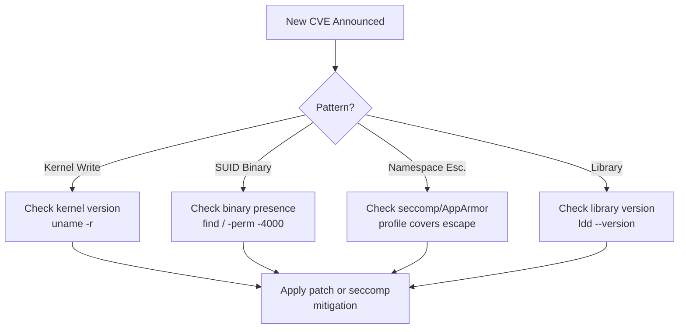
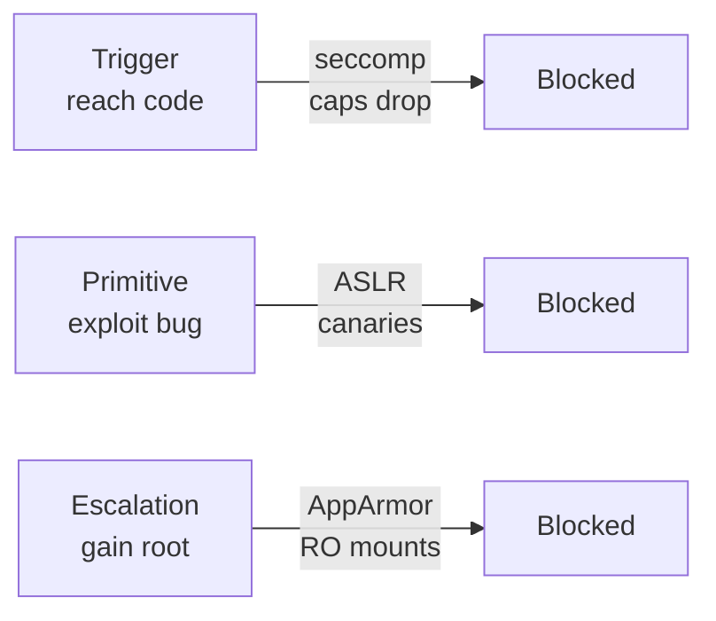
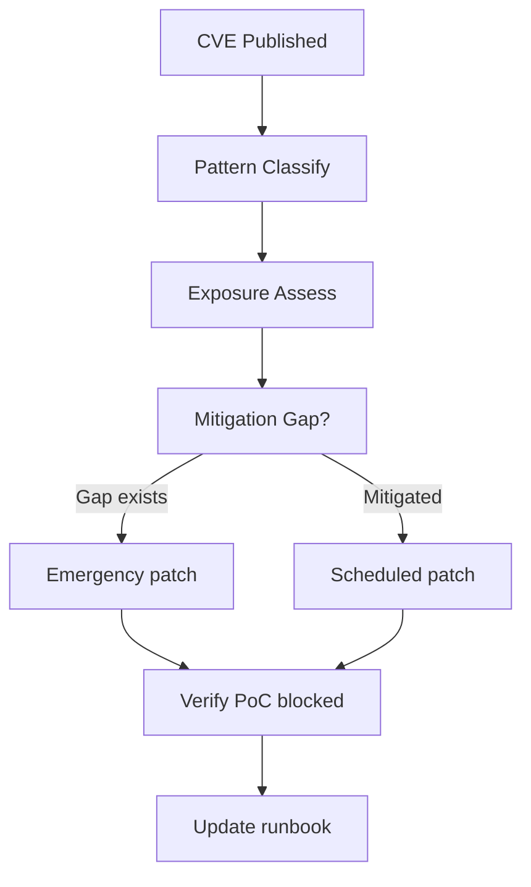
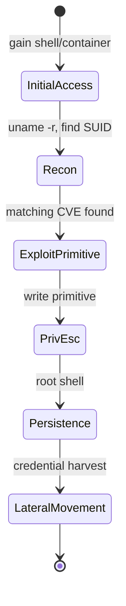

⚡ TL;DR - Linux CVEs follow a small number of recurring
structural patterns - privilege escalation through kernel
race conditions, SUID binary abuses, container escapes,
and memory corruption in core libraries. Knowing the
pattern taxonomy lets you triage any new CVE in under
five minutes: identify the affected layer, assess whether
mitigations (namespaces, seccomp, AppArmor) contain the
blast radius, and determine whether your kernel version
or configuration is in the exploitable window - without
waiting for a vendor advisory to tell you what to do.

| #097 | Category: Linux | Difficulty: ★★★ |
|:---|:---|:---|
| **Depends on:** | LNX-040, LNX-057, LNX-064, LNX-071, LNX-078 | |
| **Used by:** | LNX-100, LNX-108 | |
| **Related:** | LNX-079, OSY-102, OSY-103, OSY-104 | |

---

### 🔥 The Problem This Solves

**WORLD WITHOUT IT:**
Imagine an engineer receives a Slack message at 2 AM:
"CVE-2022-0847 is being actively exploited - what do
we do?" Without a mental model of CVE patterns, the
engineer reads the NVD page, sees "local privilege
escalation via pipe page merging," and has no idea
whether their container workloads are at risk, whether
their kernel version matters, or what to check first.
They escalate to the security team, wait six hours for
a response, and apply a blanket "restart all pods"
directive that takes down production for 20 minutes.

**THE BREAKING POINT:**
Linux CVEs are not random events. They cluster into
five structural patterns, each with a distinct blast
radius, detection signal, and mitigation path. An
unprepared team treats every CVE as unique - wasting
hours re-learning a pattern they have encountered
twelve times before under different names.

**THE INVENTION MOMENT:**
CVE taxonomy and exploitation pattern literacy exist
so engineers can reason about severity, blast radius,
and mitigation velocity without needing a security
specialist for every incident. This is why Linux
security incident frameworks were developed.

**EVOLUTION:**
Early Linux security relied on DAC (file permission
bits) and SUID alone. The 1988 Morris Worm demonstrated
that memory corruption in privileged daemons was
catastrophic. Buffer overflow exploitation dominated
the 1990s. ASLR (2001), NX bits (2004), and kernel
hardening options arrived through the 2000s. The
2010s introduced container escapes as a new class.
The 2020s feature kernel data race CVEs (Dirty Pipe,
2022) exploiting new kernel features - the attack
surface grows with every kernel version.

---

### 📘 Textbook Definition

A Linux security incident arising from a CVE
(Common Vulnerabilities and Exposures) is a condition
where a documented software defect in the Linux kernel,
a core library, or a privileged binary creates an
exploitable path for an attacker to: gain elevated
privileges (privilege escalation), execute arbitrary
code, escape isolation boundaries (container breakout),
or achieve persistent access (persistence via rootkit).
Exploitability depends on three factors: kernel version
within the vulnerable window, enabled kernel features
or syscalls that expose the code path, and the attacker's
initial access level (local user vs remote network).
CVE patterns recur because operating system primitives
(memory management, IPC, privilege models) have
structural invariants that create recurring attack shapes.

---

### ⏱️ Understand It in 30 Seconds

**One line:**
Linux CVEs follow five patterns; knowing the pattern
tells you the blast radius and fix path immediately.

**One analogy:**
> A lock manufacturer's CVE database feels overwhelming
> until you realize every lock vulnerability fits one of
> five categories: the key can be copied, the lock can
> be picked, the door frame is weak, the master key is
> compromised, or the building directory is wrong.
> Linux CVEs work the same way.

**One insight:**
The difference between a panicked response and a
controlled one is pattern recognition. Dirty COW,
Dirty Pipe, and PwnKit all produce the same output
(root shell from unprivileged user) but through
completely different mechanisms - and each has a
different mitigation path. Pattern recognition
prevents applying the wrong fix to the right CVE.

---

### 🔩 First Principles Explanation

**CORE INVARIANTS:**

1. Every Linux privilege escalation requires a code
   path reachable by unprivileged execution that
   produces a privileged outcome (write to `/etc/passwd`,
   execve as root, etc.).

2. Kernel and library bugs become exploitable only when
   the attacker controls at least one input to the
   buggy code path - the controlled input is the
   exploit primitive.

3. Mitigations work by removing either the reachability
   (seccomp blocks syscalls), the privilege (capabilities
   drop), the predictability (ASLR randomizes layout),
   or the damage scope (namespaces contain blast radius).

**DERIVED DESIGN:**
Given invariant 1, every exploit chains three steps:
gain the code path (trigger condition), control the
outcome (exploit primitive), escalate (privilege
write). Given invariant 3, each mitigation layer
targets one step in this chain. Defense in depth
means breaking the chain at multiple points - even
if one mitigation is bypassed, another holds.

**THE TRADE-OFFS:**

**Gain:** Pattern taxonomy reduces mean time to assess
(MTTA) from hours to minutes for new CVEs.

**Cost:** Deep pattern literacy requires hands-on
exposure to actual exploits - reading NVD descriptions
alone is insufficient. Teams must run PoC exploits
in lab environments to build real intuition.

**ESSENTIAL vs ACCIDENTAL COMPLEXITY:**

**Essential:** The kernel must expose privileged
operations (write to files, create sockets, load
modules). Any code path from unprivileged space to
those operations is a potential attack surface.
This complexity cannot be engineered away - only
managed.

**Accidental:** Many Linux CVEs exploited in the
wild exist in features that most deployments do not
need: user namespace privilege escalation (fixable
by disabling unprivileged user namespaces),
`/proc/self/mem` write gadgets (fixable by seccomp
policy), and SUID binaries that ship by default
but are never used.

---

### 🧪 Thought Experiment

**SETUP:**
A container runs with a standard Docker configuration.
The container runs as user ID 1000 (non-root). The
host kernel is 5.16.0. CVE-2022-0847 (Dirty Pipe)
was published yesterday. You are the on-call engineer.

**WHAT HAPPENS WITHOUT CVE PATTERN KNOWLEDGE:**
You read the NVD entry: "An issue was found in the
way the 'flags' member of the new pipe buffer structure
lacked proper initialization..." You cannot determine:
whether user ID 1000 can trigger this, whether your
container isolation blocks the code path, or whether
a seccomp profile prevents it. You escalate, wait,
and apply a full cluster patch during business hours.

**WHAT HAPPENS WITH CVE PATTERN KNOWLEDGE:**
You recognize the pattern: KERNEL DATA RACE / WRITE
PRIMITIVE. Dirty Pipe requires: unprivileged process,
writable pipe, and a splice call - all reachable by
user ID 1000. You immediately check whether your
seccomp profile blocks `splice(2)`. If it does, the
container workload is protected even on the vulnerable
kernel version. You now have a risk-stratified
response: patch high-risk workloads tonight, others
in the next maintenance window.

**THE INSIGHT:**
Mitigation is not always synonymous with patching.
Understanding the exploit primitive tells you which
layer of the defense stack is sufficient to contain
blast radius while patch deployment proceeds.

---

### 🧠 Mental Model / Analogy

> Think of the Linux privilege model as a skyscraper
> with multiple floors. The ground floor is unprivileged
> user space. The penthouse is the kernel running as
> ring 0. Every CVE is an unauthorized elevator ride
> from a lower floor to a higher one. The five CVE
> patterns are the five different mechanisms an attacker
> uses to operate the elevator: a broken floor button,
> a jammed fire door, a copied maintenance key,
> a software glitch in the elevator control board,
> or a poorly configured building access system.

Mapping:
- "Ground floor" → unprivileged user space (uid 1000)
- "Penthouse" → kernel ring 0 / root context
- "Elevator control board" → kernel syscall dispatch
- "Broken floor button" → kernel memory write primitive
- "Jammed fire door" → container/namespace escape
- "Copied maintenance key" → SUID binary abuse
- "Building access system" → polkit / sudo / PAM

Where this analogy breaks down: a real elevator is
controlled by one system; Linux privilege escalation
can chain multiple small "buttons" (memory leak gives
address → ASLR bypass → write primitive → root).

---

### 📶 Gradual Depth - Five Levels

**Level 1 - What it is (anyone can understand):**
Linux has security bugs like every software system.
Some bugs let a low-privilege user become the
all-powerful root user, or let a process in a
container break out and affect the host machine.
These bugs are catalogued with CVE numbers and
have well-known patterns that repeat across years.

**Level 2 - How to use it (junior developer):**
When a new CVE is announced, check: which kernel
version is vulnerable, what privilege level is needed
to trigger it (local user vs root vs network), and
whether your distribution has released a patch. The
commands `uname -r` (kernel version), `cat /etc/os-release`
(distro), and vendor security advisories (Ubuntu USN,
RHEL errata) are the starting points for any triage.

**Level 3 - How it works (mid-level engineer):**
Linux CVEs cluster into five structural patterns,
each with distinct attack chain, blast radius, and
mitigation path: (1) kernel memory write primitives
(Dirty COW, Dirty Pipe), (2) SUID binary logic flaws
(PwnKit, Baron Samedit), (3) privilege logic errors
in polkit/dbus/systemd, (4) namespace/container
escapes (runc CVE-2019-5736), and (5) network stack
bugs (Heartbleed, GHOST). Pattern recognition drives
MTTA from hours to minutes.

**Level 4 - Why it was designed this way (senior/staff):**
Linux's POSIX privilege model grants a binary
trust decision (root / not-root) with coarse-grained
intermediate capabilities. This creates a large
"privilege boundary surface area": any code path
that crosses the boundary is a potential CVE site.
Modern mitigations (Linux Security Modules, seccomp,
user namespaces) narrow this surface but introduce
their own attack surface - user namespace CVEs
(CVE-2017-7184, CVE-2022-25636) exploited the
very isolation mechanisms added for security.
The design tension is fundamental: isolation
requires privilege transitions, and privilege
transitions are CVE surface.

**Level 5 - Mastery (distinguished engineer):**
At scale, CVE response is a fleet management
problem. The question is not "is this system
patched?" but "what is the attack surface topology
of 10,000 nodes, and how many are in the vulnerable
window for each pattern?" A mature security posture
stratifies workloads by exposure: internet-facing
containers get emergency patches, internal batch
jobs get weekly maintenance windows, and cold-path
compute is mitigated by seccomp/AppArmor policy
until the next scheduled reboot cycle. The key
insight experts hold: patching is the last line
of defense - runtime confinement (seccomp, caps,
namespaces) is the first line that makes
exploitation failure far more likely even before
a patch is applied.

---

### ⚙️ How It Works (Mechanism)

Linux security incidents follow a three-stage
exploitation chain. Understanding each stage
reveals where defenses can break the chain.

**STAGE 1 - TRIGGER CONDITION:**
The attacker must reach the vulnerable code path.
For kernel bugs, this typically requires a syscall
reachable from unprivileged space. For SUID bugs,
the attacker must execute the SUID binary. For
container escapes, the attacker needs code execution
inside the container.

**STAGE 2 - EXPLOIT PRIMITIVE:**
The bug provides one of three primitives:
- **Arbitrary write:** overwrite any kernel memory
  address (Dirty COW, Dirty Pipe)
- **Type confusion / UAF:** access freed kernel
  structure as a different type
- **Logic flaw:** sudo/pkexec parses arguments
  incorrectly, granting unintended privileges

**STAGE 3 - PRIVILEGE ESCALATION:**
The primitive is used to overwrite `uid/gid` fields,
insert a malicious modprobe entry, write to SUID
files, or overwrite a function pointer in kernel
memory. The end state is root shell or kernel code
execution.

**CVE PATTERN MAP:**

```
┌─────────────────────────────────────────────┐
│         Linux CVE Pattern Taxonomy          │
├─────────────────┬───────────────────────────┤
│ Pattern         │ Example CVEs              │
├─────────────────┼───────────────────────────┤
│ Kernel Write    │ Dirty COW (2016-5195)     │
│ Primitive       │ Dirty Pipe (2022-0847)    │
├─────────────────┼───────────────────────────┤
│ SUID Binary     │ PwnKit (2021-4034)        │
│ Logic Flaw      │ Baron Samedit (2021-3156) │
├─────────────────┼───────────────────────────┤
│ Privilege Logic │ polkit (2021-3560)        │
│ Error           │ systemd (2021-33910)      │
├─────────────────┼───────────────────────────┤
│ Namespace /     │ runc (2019-5736)          │
│ Container Esc.  │ cgroups ns (2022-0492)    │
├─────────────────┼───────────────────────────┤
│ Library Memory  │ GHOST (glibc 2015-0235)  │
│ Corruption      │ Heartbleed (OpenSSL)      │
└─────────────────┴───────────────────────────┘
```



**DIRTY COW (CVE-2016-5195) WALKTHROUGH:**

Dirty COW is the canonical kernel write primitive
CVE. Understanding it internalizes the pattern.

1. Attacker opens a read-only file (e.g., `/etc/passwd`)
   via `mmap(PROT_READ|MAP_PRIVATE)`.
2. Two threads race: thread A writes to the mapping
   via `/proc/self/mem`; thread B calls `madvise(MADV_DONTNEED)`
   to discard the COW copy.
3. The race window between the COW copy discard and
   the write causes the kernel to write directly to
   the underlying page cache (the original read-only
   file) rather than the private copy.
4. Attacker overwrites a line in `/etc/passwd` to add
   a root-equivalent user.

**DIRTY PIPE (CVE-2022-0847) WALKTHROUGH:**

Dirty Pipe is a cleaner write primitive introduced
by a 2020 kernel optimization that forgot to
initialize a `flags` field in pipe buffer structures.

1. Attacker creates a pipe and fills it with data
   to set the `PIPE_BUF_FLAG_CAN_MERGE` flag.
2. Attacker calls `splice()` to read from the
   target read-only file into the pipe.
3. Due to the uninitialized flag, the kernel allows
   a subsequent pipe write to merge into the
   spliced pages - overwriting the file's page cache.
4. Attacker overwrites SUID binary bytes or
   `/etc/passwd` without any file permission checks.

**MITIGATION CHAIN:**

```
┌─────────────────────────────────────────────┐
│    Defense Layers vs CVE Attack Stages      │
├─────────────────┬───────────────────────────┤
│ Stage           │ Mitigation Layer          │
├─────────────────┼───────────────────────────┤
│ Trigger         │ seccomp: block splice(2)  │
│ (reach code)    │ capabilities: drop        │
├─────────────────┼───────────────────────────┤
│ Primitive       │ ASLR: randomize layout    │
│ (exploit bug)   │ Stack canaries: detect    │
├─────────────────┼───────────────────────────┤
│ Escalation      │ AppArmor/SELinux profile  │
│ (gain root)     │ Read-only mounts          │
└─────────────────┴───────────────────────────┘
```



---

### 🔄 The Complete Picture - End-to-End Flow

**NORMAL FLOW (CVE response):**

```
┌─────────────────────────────────────────────┐
│         CVE Response Lifecycle              │
├─────────────────────────────────────────────┤
│ 1. CVE Published (NVD / vendor advisory)    │
│          ↓                                  │
│ 2. Pattern Classify (which of 5 patterns?)  │
│          ↓                                  │
│ 3. Exposure Assess (kernel ver? workload?)  │
│          ↓  ← YOU ARE HERE                  │
│ 4. Mitigation Gap (seccomp covers it?)      │
│          ↓                                  │
│ 5. Patch or Contain (patch vs runtime fix)  │
│          ↓                                  │
│ 6. Verify (test PoC no longer works)        │
│          ↓                                  │
│ 7. Post-Incident (update runbook)           │
└─────────────────────────────────────────────┘
```



**FAILURE PATH:**
CVE triaged incorrectly as low-risk → attacker
exploits before patch deployed → root shell obtained
→ pivot to adjacent systems via credential harvesting
→ incident scope expands from single host to cluster.

**WHAT CHANGES AT SCALE:**
At fleet scale, "patch all nodes" becomes a
multi-day rolling operation requiring canary
deployments to detect regressions. The risk window
between CVE publication and full fleet patch is
measured in days, not hours - runtime mitigations
(seccomp, AppArmor, caps) become load-bearing
defenses, not nice-to-haves.

---

### 💻 Code Example

**Scenario 1 (Recognition): Identify SUID binaries
that are common privilege escalation targets**

```bash
# BAD: no baseline - cannot detect anomalies
find / -perm -4000 2>/dev/null

# GOOD: maintain a baseline and diff against it
# Establish baseline (run once, store in Git)
find / -perm -4000 -exec ls -la {} \; \
  2>/dev/null | sort > /etc/security/suid-baseline.txt

# Daily check - alert on diff
find / -perm -4000 -exec ls -la {} \; \
  2>/dev/null | sort > /tmp/suid-current.txt
diff /etc/security/suid-baseline.txt \
  /tmp/suid-current.txt
# Non-empty diff = new SUID binary = investigate
```

*WHY:* New SUID binaries are a common persistence
mechanism and indicator of compromise. Baselining
lets you distinguish "this shipped with the distro"
from "an attacker installed this at 3 AM."
*WHAT BREAKS:* Packages that add SUID binaries on
install will trigger false positives - maintain
per-package exclusion lists.
*HOW TO TEST:* Install a package that adds a SUID
binary (e.g., `sudo apt install passwd`) and verify
the diff fires.
*SCALE:* At fleet scale, ship the baseline diff
to your SIEM (auditd + auditd-plugin) and alert
on any new SUID binary across 10,000 hosts.

---

**Scenario 2 (Wrong vs Right): Kernel version check
during CVE triage**

```bash
# BAD: check only uname -r, ignore configuration
uname -r
# 5.15.0-58-generic
# "We're on 5.15, CVE affects 5.8-5.16, we're exposed"

# GOOD: check version AND whether the code path
# is reachable via configuration
uname -r
# 5.15.0-58-generic - in vulnerable range

# For Dirty Pipe (CVE-2022-0847):
# Check if splice(2) is blocked in seccomp profile
# For Docker containers:
docker inspect <container_id> \
  --format '{{.HostConfig.SecurityOpt}}'
# seccomp=unconfined means splice IS reachable

# For CVE that requires user namespace:
cat /proc/sys/kernel/unprivileged_userns_clone
# 0 = disabled = attacker cannot trigger the path
# 1 = enabled = vulnerable if kernel ver matches
```

*WHY:* A kernel within the vulnerable version range
is NOT automatically exploitable. Configuration
gates (seccomp profile, unprivileged_userns_clone,
capabilities) determine whether the code path is
reachable. Ignoring configuration gates leads to
over-patching (unnecessary emergency maintenance
windows) or under-patching (false sense of security
from a kernel-version-only check).
*WHAT BREAKS:* Config-based mitigation is fragile -
a `docker run --privileged` flag bypasses seccomp
and capabilities entirely.
*HOW TO TEST:* Run the PoC from the CVE advisory
in a lab environment with and without the seccomp
profile to confirm containment before declaring it
mitigated.
*SCALE:* At fleet scale, use a configuration
compliance scanner (OpenSCAP, Trivy, Lynis) to
assert that seccomp profiles are applied to all
container workloads - not just the ones you
remember to check manually.

---

**Scenario 3 (Failure/Production): Responding to
active exploitation indicators**

```bash
# Indicator: unexpected root process or credential
# file modification detected by auditd

# Check for auditd alerts on passwd modification
ausearch -k passwd_changes -ts today
# Output: type=SYSCALL ... comm="python3" ...
# exe="/usr/bin/python3" ... auid=1001
# UNEXPECTED: user 1001 (non-root) modified passwd

# Confirm the file was changed
stat /etc/passwd
# Modify: 2024-03-15 03:47:22 - at 3 AM

# Check running processes for setuid bits
ps aux --sort=-%cpu | head -20
# Look for unexpected processes running as root

# Check for new entries in /etc/passwd
grep -v "^#" /etc/passwd | \
  awk -F: '$3 == 0 {print "ROOT UID ENTRY:", $0}'
# ROOT UID ENTRY: backdoor:x:0:0::/root:/bin/bash
# COMPROMISED: attacker added root backdoor user

# Immediate containment
# 1. Isolate the host (block network egress)
iptables -I OUTPUT -j DROP
# 2. Capture memory for forensics before reboot
avml /mnt/external/memory.lime
# 3. Rotate all credentials that touched this host
```

*WHY:* The worst outcome of a CVE exploitation is
not the initial compromise - it is the dwell time.
Attackers who gain root typically persist (backdoor
account, modified SSHD, rootkit) within minutes.
Early detection via auditd rules on privileged file
modifications compresses dwell time from days to
minutes.
*WHAT BREAKS:* Sophisticated attackers modify auditd
rules or disable the daemon. AIDE (file integrity
monitoring) running on a separate, read-only log
forwarder is a secondary detection layer.
*SCALE:* In a fleet, aggregate auditd events to a
centralized SIEM (Elastic, Splunk, Loki). Alert on
any `auid=non-root, comm=write, path=/etc/passwd`
event across all nodes.

---

**Scenario 4 (Debugging): Test whether your seccomp
profile actually blocks the Dirty Pipe trigger**

```bash
# Test that splice(2) is blocked by your container's
# seccomp profile BEFORE relying on it as mitigation

# Run a harmless splice test program in the container
cat > /tmp/test_splice.c << 'EOF'
#include <fcntl.h>
#include <unistd.h>
#include <stdio.h>
int main() {
    int pfd[2];
    pipe(pfd);
    int fd = open("/etc/hostname", O_RDONLY);
    // splice from file to pipe (Dirty Pipe trigger)
    long ret = splice(fd, NULL, pfd[1], NULL,
                      100, 0);
    if (ret == -1 && errno == EPERM) {
        printf("BLOCKED: seccomp prevents splice\n");
        return 0;
    }
    printf("REACHABLE: splice succeeded (%ld)\n",
           ret);
    return 1;
}
EOF
gcc -o /tmp/test_splice /tmp/test_splice.c
docker run --rm \
  --security-opt seccomp=/your-profile.json \
  -v /tmp/test_splice:/test_splice \
  ubuntu:22.04 /test_splice
# Expected: "BLOCKED: seccomp prevents splice"
# Actual: "REACHABLE" = profile does not protect
```

*WHY:* "Our seccomp profile is applied" and "our
seccomp profile blocks this CVE's code path" are
different claims. Every mitigation claim must be
verified with a targeted test before it is trusted.
*WHAT BREAKS:* Custom profiles that whitelist `splice`
for legitimate workloads (data pipelines, file
servers) cannot use this mitigation - they must
prioritize patching.

---

### ⚖️ Comparison Table

| CVE Pattern | Example | Requires Local? | seccomp Helps? | Patch Urgency |
|---|---|---|---|---|
| **Kernel write primitive** | Dirty Pipe (2022-0847) | Yes | Yes (block splice) | Critical - hours |
| SUID binary logic | PwnKit (2021-4034) | Yes | No (binary-level) | Critical - hours |
| Polkit/privilege logic | CVE-2021-3560 | Yes | No | High - days |
| Container/ns escape | runc CVE-2019-5736 | No (container) | Partial | Critical - hours |
| Library memory corruption | GHOST glibc (2015-0235) | No (network) | No | Critical - hours |

How to choose patch urgency: CVEs requiring no
local access (network-reachable) or affecting
container isolation get emergency response. Local-only
privilege escalation CVEs allow a 24-48 hour window
if runtime mitigations are confirmed active.

**Decision Tree:**
Network-reachable exploit? → Emergency patch (hours)
Container escape? → Emergency patch + isolate fleet
Local priv esc + seccomp blocks code path? → Scheduled patch (days)
Local priv esc + no mitigation available? → Emergency patch (hours)
Library CVE (e.g., glibc)? → Check service exposure + patch

---

### 🔁 Flow / Lifecycle

```
┌─────────────────────────────────────────────┐
│     CVE Exploitation Chain - Full View      │
├─────────────────────────────────────────────┤
│ PHASE 1: Initial Access                     │
│   Attacker gains: shell, container, SSH     │
│   as unprivileged user (uid != 0)           │
│          ↓                                  │
│ PHASE 2: Recon                              │
│   uname -r → identify kernel version        │
│   find / -perm -4000 → list SUID binaries   │
│   cat /etc/os-release → check for patches   │
│          ↓                                  │
│ PHASE 3: Exploit Primitive                  │
│   Select matching CVE for kernel/binary      │
│   Execute trigger → obtain write primitive  │
│          ↓                                  │
│ PHASE 4: Privilege Escalation               │
│   Overwrite /etc/passwd or inject payload   │
│   Spawn root shell or backdoor process      │
│          ↓                                  │
│ PHASE 5: Persistence                        │
│   Add root user, modify SSHD config         │
│   Install rootkit in kernel module          │
│          ↓                                  │
│ PHASE 6: Lateral Movement                   │
│   Harvest credentials from memory (/proc)   │
│   Move to adjacent hosts                    │
└─────────────────────────────────────────────┘
```



**DEFENDER'S BREAK POINTS:**
- Between Phase 1 and 2: Network segmentation,
  least-privilege initial access
- Between Phase 2 and 3: Patch before attacker
  matches kernel to CVE
- Between Phase 3 and 4: seccomp blocks trigger
  syscall
- Between Phase 4 and 5: AppArmor prevents write
  to `/etc/passwd`, read-only root filesystem
- Between Phase 5 and 6: auditd detects modification,
  network egress filtering prevents C2 callback

---

### ⚠️ Common Misconceptions

| Misconception | Reality |
|---|---|
| "Patching the kernel fixes all Linux CVEs" | SUID binary CVEs (PwnKit, Baron Samedit) exist in userspace utilities - kernel patching has no effect. |
| "Our containers are isolated so kernel CVEs don't apply" | Container escapes (runc CVE-2019-5736, Dirty Pipe) explicitly break container isolation - the kernel is the shared surface. |
| "CVSS score 7+ means emergency patch" | CVSS measures theoretical severity, not exploitability in your environment. A CVSS 9.8 CVE requiring local access and a specific config may pose less risk than a CVSS 7.2 one in your stack. |
| "seccomp blocks all kernel exploits" | seccomp filters syscalls at the entry point. Some CVEs exploit post-syscall behavior (e.g., race conditions after `write()` succeeds) that seccomp cannot prevent. |
| "Root in a container = root on the host" | Depends on container configuration. Root in a container with user namespaces mapped ≠ host root. Root in `--privileged` container = host root. |
| "CVE PoCs in the wild are always weaponized" | Many public PoCs require local preconditions (race timing, specific memory layout) that make reliable exploitation hard. Assessing practical exploitability - not just theoretical - governs patch urgency. |

---

### 🚨 Failure Modes & Diagnosis

**Kernel Write Primitive (Dirty Pipe pattern)**

**Symptom:**
`/etc/passwd` or a SUID binary modified without
corresponding `sudo` or `su` audit event. Auditd
reports `type=PATH name="/etc/passwd" ... uid=1001`.
File modification timestamp changed at an unusual
hour.

**Root Cause:**
Page cache write primitive allows unprivileged
process to overwrite read-only file contents by
exploiting kernel data-race in pipe/splice path.
The kernel skips permission checks when it believes
it is writing to a private COW copy, but the race
means it writes to the original page.

**Diagnostic Command:**

```bash
# Check auditd for unauthorized file writes
ausearch -k passwd_changes --start today
# OR check file modification time
stat /etc/passwd /etc/shadow /usr/bin/passwd

# Check if splice syscall is blocked
strace -e trace=splice cat /dev/null 2>&1 | \
  head -5
# EPERM = blocked; no error = reachable
```

**Fix:**

```bash
# BAD: rely solely on kernel version check
uname -r  # 5.15 - "might be affected"

# GOOD: verify kernel is patched AND
# add seccomp mitigation as secondary layer
# 1. Apply kernel patch (vendor advisory)
apt-get update && apt-get upgrade linux-image-*

# 2. Add splice to blocked syscalls in seccomp
# profile (add to your Docker default profile)
# "names": ["splice"], "action": "SCMP_ACT_ERRNO"
```

**Prevention:**
Enable immutable filesystem mounts (`--read-only` in
Docker, `ro` bind mounts) for all paths that should
never be written at runtime, regardless of privilege.

---

**SUID Binary Logic Flaw (PwnKit pattern)**

**Symptom:**
Unprivileged user spawns a shell process running
as UID 0. `ps aux | grep -v grep | awk '$1=="root"'`
shows unexpected root processes owned by non-system
users. `last` or `wtmp` shows no `su`/`sudo` event
before the root session.

**Root Cause:**
`pkexec` (PwnKit, CVE-2021-4034) reintroduces
`argv[0]` as a writable memory segment and writes
an attacker-controlled environment variable there,
effectively calling `execve` with a path chosen by
the attacker. The bug exists because `pkexec` mishandles
the case where it is called with an empty argument
vector - a condition that should never occur but
that any local user can trigger.

**Diagnostic Command:**

```bash
# Check pkexec version
pkexec --version
# Vulnerable: polkit < 0.120 (most distros pre-2022)

# Check if pkexec has SUID bit
ls -la $(which pkexec)
# -rwsr-xr-x = SUID set = vulnerable binary

# Detect exploitation attempt in audit log
journalctl -u polkit --since "24 hours ago" | \
  grep -i "error\|exploit\|execve"
```

**Fix:**

```bash
# BAD: remove SUID bit without patching
# (breaks legitimate pkexec users, not a real fix)
chmod u-s /usr/bin/pkexec

# GOOD: apply the vendor patch
# Ubuntu:
apt-get install --only-upgrade policykit-1
# RHEL/CentOS:
yum update polkit
# Verify:
pkexec --version
# polkit version 0.120 or later = patched
```

**Prevention:**
Audit SUID binaries on every package install using
`dpkg -L <package> | xargs ls -la 2>/dev/null | grep "^-..s"`.
Maintain a known-good SUID baseline and alert on any deviation.

---

**Container Escape (runc pattern)**

**Symptom:**
Process inside container modifies host filesystem.
Container host logs show unexpected write operations
to `/proc/self/exe` or `/proc/PID/exe`. Host `dmesg`
shows AppArmor or SELinux denials from unexpected
sources. Container process list shows PIDs from the
host PID namespace.

**Root Cause:**
runc CVE-2019-5736: when `runc exec` runs a malicious
container binary, the container can overwrite the
`/proc/self/exe` symlink that runc is using. Since
runc runs as root, the container effectively overwrites
the runc binary with a malicious payload, which then
executes as root on the host at the next container exec.

**Diagnostic Command:**

```bash
# Check runc version
runc --version
# Vulnerable: runc < 1.0-rc7

# Check if containers have write access to host paths
docker inspect <container> | \
  jq '.[0].HostConfig.Binds'
# Any host path bound read-write is a risk

# Monitor for container-to-host writes via auditd
auditctl -w /usr/bin/runc -p w -k runc_write
ausearch -k runc_write --start today
```

**Fix:**

```bash
# BAD: trust the container runtime version
# without verification
docker version | grep -A2 "Server:"

# GOOD: pin to patched runc and verify with CVE PoC
# Update container runtime
apt-get update && apt-get upgrade docker-ce
# Verify runc version
runc --version
# runc version 1.1.x = patched

# Add AppArmor profile that denies
# /proc/self/exe writes from containers
# /proc/*/exe w, -> deny
```

**Prevention:**
Use a hardened container runtime configuration:
`--read-only` root filesystem, `--no-new-privileges`,
drop all capabilities not required by the workload.

---

**Credential Exposure via /proc**

**Symptom:**
Attacker reads memory of other processes from
`/proc/PID/mem` or dumps environment variables from
`/proc/PID/environ`, harvesting credentials for
lateral movement. Credentials appear in new locations
(different hosts, services) shortly after the initial
compromise.

**Root Cause:**
`/proc/PID/mem` is readable by the process owner and
root. In containers without user namespace isolation,
a container process running as root can read the
`/proc/mem` of any process on the host with the same
UID, including processes that store credentials in
environment variables or heap memory.

**Diagnostic Command:**

```bash
# Detect access to /proc/*/mem or /proc/*/environ
auditctl -a always,exit -F arch=b64 \
  -S open -F path=/proc -k proc_access
ausearch -k proc_access --start today | \
  grep -E "mem|environ|maps"
# Unexpected access from container PIDs = suspicious
```

**Fix:**

```bash
# BAD: pass credentials as environment variables
docker run -e DB_PASSWORD=secret myapp

# GOOD: use secrets management; mount secrets
# as read-once files with tmpfs
docker run \
  --mount type=tmpfs,dst=/run/secrets \
  -e DB_PASSWORD_FILE=/run/secrets/db_pass \
  myapp
# Secret is available to the process but never
# appears in /proc/PID/environ
```

**Prevention:**
Never inject credentials via environment variables
in containerized workloads. Use Vault, AWS Secrets
Manager, or Kubernetes Secrets with projected volumes.

---

### 🔗 Related Keywords

**Prerequisites (understand these first):**
- `LNX-057 - Security Hardening Basics` - foundational
  hardening patterns (fail2ban, SELinux basics) before
  deep CVE analysis
- `LNX-064 - Linux Audit Subsystem` - auditd is the
  primary detection tool for exploitation attempts
- `LNX-078 - Seccomp and Linux Capabilities` - the
  primary runtime mitigation layer for kernel CVEs
- `LNX-071 - Linux Kernel Namespaces` - required to
  understand container escape attack surface
- `OSY-104 - ASLR` - memory layout randomization
  that raises the bar for memory corruption CVEs

**Builds On This (learn these next):**
- `LNX-079 - Linux Security Modules` - LSM provides
  the mandatory access control layer above CVE mitigations
- `LNX-100 - Linux Hardening at Scale (CIS Benchmarks)` -
  fleet-level hardening that reduces CVE exposure
  at the configuration level
- `LNX-108 - Multi-Tenant Linux Security Architecture` -
  architectural patterns for containing CVE blast radius
  across tenant boundaries

**Alternatives / Comparisons:**
- `OSY-102 - Meltdown and Spectre` - hardware-level
  CVEs vs software CVEs; different mitigation model
  (microcode, kernel patches vs seccomp/caps)
- `OSY-103 - Dirty COW Vulnerability` - the canonical
  kernel write primitive CVE, a prerequisite intuition
  for all write primitive patterns
- `LNX-073 - eBPF` - eBPF itself has CVEs; also used
  as a security monitoring tool for exploit detection

---

### 📌 Quick Reference Card

```
┌──────────────────────────────────────────────────────────┐
│ WHAT IT IS   │ Linux CVEs follow 5 recurring patterns   │
│              │ that determine blast radius and fix path  │
├──────────────┼───────────────────────────────────────────┤
│ PROBLEM IT   │ Engineers waste hours treating each CVE  │
│ SOLVES       │ as unique; pattern literacy = minutes     │
├──────────────┼───────────────────────────────────────────┤
│ KEY INSIGHT  │ Patching is the last line of defense;    │
│              │ seccomp/caps/AppArmor act first          │
├──────────────┼───────────────────────────────────────────┤
│ USE WHEN     │ Triaging any new Linux CVE announcement  │
├──────────────┼───────────────────────────────────────────┤
│ AVOID WHEN   │ Hardware-level CVEs (Meltdown/Spectre)   │
│              │ require microcode, not seccomp           │
├──────────────┼───────────────────────────────────────────┤
│ ANTI-PATTERN │ Treating kernel version as sole          │
│              │ exploitability signal (ignores config)   │
├──────────────┼───────────────────────────────────────────┤
│ TRADE-OFF    │ Runtime mitigations = faster protection  │
│              │ vs patches = permanent fix, more testing │
├──────────────┼───────────────────────────────────────────┤
│ ONE-LINER    │ "Every Linux CVE is an elevator ride;   │
│              │ pattern recognition stops the elevator"  │
├──────────────┼───────────────────────────────────────────┤
│ NEXT EXPLORE │ LNX-079 → LNX-100 → LNX-108             │
└──────────────────────────────────────────────────────────┘
```

**If you remember only 3 things:**
1. Linux CVEs cluster into 5 structural patterns;
   identifying the pattern takes under 5 minutes
   and drives the entire response strategy.
2. Runtime mitigations (seccomp, capabilities,
   AppArmor) can contain a CVE's blast radius while
   patches are deployed - verify them with a PoC test.
3. Privilege escalation chains always have multiple
   break points - defenders win by layering, not by
   relying on any single control.

**Interview one-liner:**
"When a new Linux CVE lands, I classify it into one
of five patterns (kernel write primitive, SUID logic,
privilege logic, container escape, library memory
corruption), assess whether my runtime security
controls contain the code path, and decide between
emergency patch and scheduled patch with mitigation
active - always verified by running the PoC."

---

### 💎 Transferable Wisdom

**Reusable Engineering Principle:**
Attack surface is a function of both code
vulnerability AND reachability - removing
reachability is often faster and equally effective
as removing the vulnerability itself. This principle
drives zero-trust architecture, seccomp policy
design, and network segmentation decisions well
beyond Linux CVEs.

**Where else this pattern appears:**
- Web application security - WAFs and input
  validation remove reachability to vulnerable
  code paths before the developer can patch the
  underlying library
- Network security - firewall rules block
  reachability to vulnerable services before
  an IDS signature is written
- Supply chain security - dependency lockfiles
  prevent vulnerable version reachability before
  the team audits every transitive dependency

**Industry applications:**
- Financial services - real-time payment processors
  run hardened Linux with read-only root filesystems
  and allowlist-only seccomp profiles; any deviation
  from the allowlist triggers immediate node isolation
- Cloud providers - hypervisor hosts running
  customer workloads apply CVE patches via live
  migration (move VM, patch host, return VM) to
  achieve zero-downtime patching across thousands
  of hosts

---

### 💡 The Surprising Truth

Dirty Pipe (CVE-2022-0847), one of the most impactful
Linux kernel CVEs of the 2020s, was discovered by a
developer while debugging a log file corruption bug
in a completely unrelated web hosting application.
The bug was not found by a security researcher but
by an engineer tracing a mysterious corruption of
compressed log files - which turned out to be caused
by the CVE's write primitive accidentally triggering
through their application's normal I/O path. The
security consequence was discovered as a side effect
of debugging a data integrity problem. This is common
in kernel CVE history: the most dangerous bugs often
look like unexplained corruption events first.

---

### ✅ Mastery Checklist

**You've mastered this when you can:**
1. [EXPLAIN] Given any CVE description, classify it
   into one of the five structural patterns within
   5 minutes and explain the attack chain from trigger
   to root shell in plain English to a junior engineer.
2. [DEBUG] Given an auditd log showing unexpected writes
   to `/etc/passwd` by a non-root UID, identify which
   CVE pattern is most likely, which diagnostic commands
   confirm it, and which files would show signs of
   persistence.
3. [DECIDE] For a container running workloads on a
   kernel within Dirty Pipe's vulnerable range but with
   a custom seccomp profile, decide whether emergency
   patching is required or whether the seccomp profile
   provides sufficient containment - and explain the
   exact test to verify that decision.
4. [BUILD] Write the auditd rules and daily baseline
   comparison script to detect new SUID binaries and
   unauthorized writes to `/etc/passwd` on a fleet
   of 100 Linux hosts.
5. [EXTEND] Apply the "remove reachability before
   patching" principle to a new security context: a
   Node.js web application with a known RCE
   vulnerability in a transitive npm dependency.
   What is the reachability removal strategy?

---

### 🧠 Think About This Before We Continue

**Q1.** Your Kubernetes cluster runs 200 pods on nodes
with kernel version 5.15.0. CVE-2022-0847 (Dirty Pipe)
is published affecting kernel 5.8 through 5.16. Your
seccomp profile for the cluster uses the Docker
default profile. You need to decide in the next 15
minutes: emergency evacuate and patch, or continue
running with mitigation active. Walk through the exact
sequence of checks and the decision criteria. What
is the one piece of information that determines whether
you emergency patch or wait?
*Hint: The Docker default seccomp profile's treatment
of `splice(2)` as of Docker 20.10 is the pivotal fact.
Look up whether splice is on the default blocklist or
allowlist in the Docker seccomp profile specification.*

**Q2.** PwnKit (CVE-2021-4034) affects `pkexec` in
polkit - a userspace binary, not the kernel. Your
team argues that your containers do not ship `pkexec`
so they are not affected. Is this correct? Under what
specific condition would a container workload still
be exploitable via this CVE even without `pkexec`
inside the container image? What does this tell you
about the boundary between container isolation and
host security?
*Hint: Consider the relationship between the container
rootfs and the host filesystem for `/proc/self/exe`
style escape techniques. Is polkit on the host
accessible from within a container under any
container configuration?*

**Q3.** [Hands-on] Set up a Vagrant VM with Ubuntu
22.04 and kernel 5.15 (patched for Dirty Pipe).
Configure Docker with the default seccomp profile.
Download the Dirty Pipe PoC from the CVE advisory
repository. Run the PoC inside a container. Observe
whether it succeeds or fails. Then rebuild the
container with `--security-opt seccomp=unconfined`
and run the PoC again. Document: (a) which specific
seccomp rule (if any) blocks the exploit, (b) the
exact error returned when blocked, and (c) what a
false mitigation claim would look like if you only
checked kernel version without running the PoC.
*Hint: Use `strace -e trace=splice` inside the
container to observe exactly which syscall the PoC
makes and at which point the seccomp policy intercepts
it. The kernel audit log will also show a seccomp
violation event if interception occurs.*

---

### 🎯 Interview Deep-Dive

**Q1: You receive a Slack alert at 2 AM: "CVE published,
CVSS 9.8, affects Linux kernels 4.4 through 5.19."
Your fleet runs 3,000 nodes on various kernel versions.
Walk me through your first 30 minutes of response.**

*Why they ask:* Tests structured CVE triage process,
not just knowledge. Distinguishes engineers who know
CVE concepts from those with incident response
experience.

*Strong answer includes:*
- Immediately classify the pattern: network-reachable
  vs local, kernel vs userspace vs library
- Check NVD, vendor advisory (Ubuntu USN, RHEL errata)
  for specific kernel version range and fixed version
- Determine whether existing runtime controls (seccomp,
  caps, AppArmor) reduce exploitability while patching
- Stratify the fleet by exposure: internet-facing nodes
  first, then internal, then batch compute
- Set a timeline: emergency patch for unmitigated
  internet-exposed nodes; maintain incident channel
  for all responders

---

**Q2: Dirty COW and Dirty Pipe are both "write
primitive" CVEs. If you fixed Dirty COW in 2016,
why didn't that fix protect against Dirty Pipe in
2022? What does this tell you about the nature of
kernel write primitive CVEs?**

*Why they ask:* Tests depth of understanding of CVE
patterns - distinguishes surface-level knowledge
("they're both write primitives") from mechanistic
understanding of why patterns recur.

*Strong answer includes:*
- Dirty COW exploited a race condition in the COW
  page fault handler (mm/memory.c). The fix added
  proper locking to that code path.
- Dirty Pipe exploited an uninitialized flag in the
  pipe buffer subsystem (fs/pipe.c) - a completely
  different code path introduced in 2020 optimizations.
- The pattern (unprivileged user → kernel write to
  read-only page) is structural and will recur because
  the kernel must allow unprivileged processes to
  interact with the page cache for performance
- Defense: defense-in-depth matters because patching
  one code path never eliminates the attack class

---

**Q3: A penetration tester reports that they obtained
root on one of your production nodes using PwnKit
(CVE-2021-4034), even though you patched polkit six
months ago. How do you investigate this, and what
are the three most likely explanations?**

*Why they ask:* Tests both CVE knowledge and incident
investigation skills. Real production security
requires understanding why controls failed, not just
applying them.

*Strong answer includes:*
- Three explanations: (1) the patch was applied to
  the OS image but not rolled out to all running
  nodes (image ≠ running state divergence); (2) the
  node was reprovisioned from an old image after the
  patch was applied to the base; (3) a different SUID
  binary was used (pkexec was patched but another
  vulnerable polkit-dependent binary was not)
- Investigation: `rpm -q polkit` or `dpkg -l polkit`
  on the affected node to check installed version;
  `auditd` logs for the time of exploitation to
  identify the exact binary used; compare node image
  tag to the fleet baseline
- Systemic fix: configuration drift detection (Chef
  InSpec, Ansible idempotent enforcement) to ensure
  running state matches desired state

---

**Q4: Your team proposes using seccomp allowlisting
(only permit explicitly required syscalls) as the
primary defense against kernel CVEs, arguing this
is better than keeping kernels patched. Evaluate
this argument. Where does it hold and where does
it break?**

*Why they ask:* Tests engineering judgment and trade-off
reasoning. Distinguishes engineers who can assess
a technically-sound-sounding proposal critically.

*Strong answer includes:*
- Where it holds: seccomp allowlisting provides
  effective defense against CVEs that require specific
  syscalls not needed by the workload (splice for
  Dirty Pipe, userns for many privilege escalations)
- Where it breaks: (1) workloads that legitimately
  need broad syscall access (general-purpose servers,
  build systems) cannot use tight allowlists without
  breaking functionality; (2) some exploits use only
  commonly required syscalls (`read`, `write`, `mmap`);
  (3) maintaining accurate allowlists across application
  versions is operationally expensive and error-prone
- The correct answer: seccomp and patching are
  complementary layers, not alternatives - neither is
  sufficient alone

---

**Q5: Describe the complete exploitation chain for
CVE-2022-0847 (Dirty Pipe). At each stage, identify
which defense control would break the chain and
what evidence would appear in logs.**

*Why they ask:* Tests ability to trace an exploitation
chain mechanistically and map defenses to specific
chain stages. This is what a staff security engineer
does during threat modeling.

*Strong answer includes:*
- Stage 1 (create pipe + fill): `pipe(2)` + `write(2)` -
  blocked by: nothing (these are fundamental syscalls);
  log evidence: none
- Stage 2 (splice from target file): `splice(2)` -
  blocked by: seccomp policy denying `splice`; log
  evidence: `SECCOMP` audit event in kernel log
- Stage 3 (write to pipe = overwrite page cache):
  `write(2)` to pipe fd - blocked by: immutable
  filesystem mount (`MS_RDONLY`); log evidence:
  `EACCES` error, apparmor denial if profile covers
  the target file path
- Stage 4 (execute modified SUID binary): `execve(2)` -
  blocked by: AppArmor profile restricting SUID
  execution; log evidence: AppArmor DENIED event
- Strongest defense: block `splice(2)` via seccomp +
  mount target paths read-only via `MS_RDONLY`
