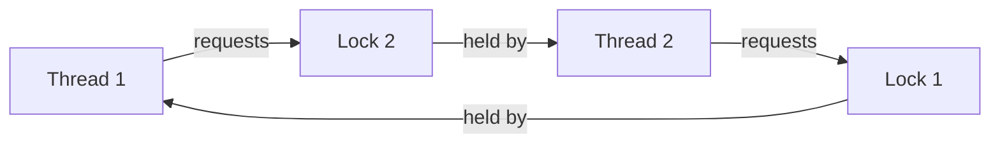

## TL;DR

Deadlock occurs when threads form a circular wait for
resources. All four Coffman conditions must hold
simultaneously. Remove any one condition to prevent
deadlock. Detecting deadlock in a running JVM uses
jstack or ThreadMXBean.

---

### Metadata

| Field | Value |
|-------|-------|
| **ID** | OSY-027 |
| **Difficulty** | ★★☆ Working |
| **Category** | Operating Systems |
| **Tags** | deadlock, Coffman conditions, jstack |
| **Prerequisites** | OSY-017, OSY-018 |

---

### The Problem This Solves

In concurrent systems, threads compete for shared
resources (locks, I/O, database connections). Without
coordination, threads can enter a state where each waits
for a resource held by another, and no thread can
proceed. Deadlock causes application hangs that do not
resolve without intervention.

---

### Textbook Definition

Deadlock is a state in which each member of a group of
threads is waiting for a resource held by another member.
No thread can make progress. E.W. Dijkstra and others
formalized the four necessary conditions (Coffman 1971)
for deadlock to occur.

---

### The Four Coffman Conditions

**All four must hold simultaneously for deadlock to occur:**

```
1. Mutual Exclusion
   At least one resource must be non-shareable.
   Only one thread can hold it at a time.
   Example: a mutex, a file with exclusive write lock.
   
2. Hold and Wait
   A thread holding at least one resource is waiting
   to acquire additional resources held by other threads.
   Example: Thread A holds lock1, trying to acquire lock2.
   
3. No Preemption
   Resources cannot be forcibly taken from threads.
   Only the holding thread can release the resource.
   Example: OS cannot take a mutex from Thread A.
   
4. Circular Wait
   A set of threads T1, T2, ..., Tn exists such that:
   T1 waits for T2's resource,
   T2 waits for T3's resource,
   ...
   Tn waits for T1's resource.
   
   Simplest case (2 threads):
   T1 holds lock1, waiting for lock2
   T2 holds lock2, waiting for lock1
   -> DEADLOCK
```

---

### Classic Deadlock Example (Java)

```java
// BAD: Classic deadlock - two threads, reversed lock order
public class DeadlockDemo {
    private final Object lock1 = new Object();
    private final Object lock2 = new Object();
    
    public void thread1Work() {
        synchronized (lock1) {          // acquires lock1
            System.out.println("T1: acquired lock1");
            Thread.sleep(100);          // gives T2 time
            synchronized (lock2) {      // BLOCKED: T2 has lock2
                System.out.println("T1: acquired lock2");
            }
        }
    }
    
    public void thread2Work() {
        synchronized (lock2) {          // acquires lock2
            System.out.println("T2: acquired lock2");
            Thread.sleep(100);          // gives T1 time
            synchronized (lock1) {      // BLOCKED: T1 has lock1
                System.out.println("T2: acquired lock1");
            }
        }
    }
    
    // Coffman conditions:
    // 1. Mutual exclusion: YES (synchronized blocks)
    // 2. Hold and wait: YES (each holds one, wants other)
    // 3. No preemption: YES (OS can't take monitors)
    // 4. Circular wait: YES (T1->lock2->T2->lock1->T1)
}

// GOOD: Consistent lock ordering prevents circular wait
public class DeadlockFixed {
    private final Object lockA = new Object();
    private final Object lockB = new Object();
    
    // BOTH methods acquire in same order: lockA before lockB
    public void thread1Work() {
        synchronized (lockA) {    // always first
            synchronized (lockB) { // always second
                doWork();
            }
        }
    }
    
    public void thread2Work() {
        synchronized (lockA) {    // always first (same order!)
            synchronized (lockB) { // always second
                doWork();
            }
        }
    }
    // Circular wait condition is eliminated.
}
```

---

### Detecting Deadlock in a Running JVM

```bash
# Method 1: jstack (thread dump to stdout)
jstack -l <PID>

# Output when deadlock detected:
# Found one Java-level deadlock:
# =============================
# "Thread-1":
#   waiting to lock monitor 0x00007f...
#   which is held by "Thread-0"
# "Thread-0":
#   waiting to lock monitor 0x00007f...
#   which is held by "Thread-1"
```

```java
// Method 2: Programmatic detection via ThreadMXBean
ThreadMXBean bean = ManagementFactory.getThreadMXBean();
long[] deadlockedIds = bean.findDeadlockedThreads();
if (deadlockedIds != null) {
    ThreadInfo[] infos = bean.getThreadInfo(deadlockedIds, true, true);
    for (ThreadInfo info : infos) {
        System.out.println(info.toString());
        // Shows: thread name, state, lock it holds, lock it waits for
    }
}
```

```bash
# Method 3: Send SIGQUIT to trigger automatic thread dump
kill -3 <PID>
# JVM logs full thread dump (including deadlock detection)
# to stderr or configured log output
```

---

### Resource Allocation Graph

```
Thread --> Resource : thread requests resource
Resource --> Thread : resource assigned to thread

Deadlock = cycle in this graph

Example cycle (deadlock):
  T1 --> R1: T1 requests R1 (R1 held by T2)
  T2 --> R2: T2 requests R2 (R2 held by T1)
  R1 --> T2: R1 assigned to T2
  R2 --> T1: R2 assigned to T1
  
  Cycle: T1 -> R1 -> T2 -> R2 -> T1
```



---

### Four Prevention Strategies

```
Remove ONE condition to prevent deadlock:

1. Remove Mutual Exclusion:
   Use lock-free data structures (AtomicInteger, etc.)
   Not always possible (some resources are inherently exclusive)
   
2. Remove Hold and Wait:
   Acquire ALL needed locks at once (atomic lock acquisition)
   Or: release all held locks before requesting more
   Problem: reduced concurrency, potential starvation
   
3. Allow Preemption:
   If a thread can't get a new lock, release ALL held locks
   Java: tryLock() with timeout, then retry
   
4. Remove Circular Wait (MOST PRACTICAL):
   Impose a global lock ordering
   All threads acquire locks in the same numeric order
   Thread can never hold lock N and request lock M where M < N
```

---

### Common Misconceptions

| Misconception | Reality |
|---------------|---------|
| "Deadlock is rare in production Java code" | Deadlock is a common production incident, especially with connection pools (thread holds DB conn waiting for cache conn; another thread holds cache conn waiting for DB conn). Most major distributed systems have experienced deadlock incidents |
| "Using only synchronized eliminates deadlock" | synchronized prevents data races but does not prevent deadlock. Nested synchronized blocks in inconsistent order is the classic deadlock recipe |
| "A thread dump always shows deadlock" | jstack shows Java-level mutex deadlock. JVM-level deadlocks in native code (JDBC drivers, etc.) may not appear. ThreadMXBean.findDeadlockedThreads() only detects object monitor deadlocks, not java.util.concurrent lock deadlocks (use findMonitorDeadlockedThreads() for those) |
| "Deadlock only happens with 2 threads" | Deadlock can involve N threads in a cycle. 3-thread cycles: T1->T2->T3->T1 are harder to detect by code review |

---

### Failure Modes and Diagnosis

```
Symptom: Application threads stop responding.
  - Health check endpoints stop returning
  - No log output from worker threads
  - Thread dump shows many BLOCKED threads

Diagnosis:
  1. jstack -l PID > thread_dump.txt
  2. Search for "Found Java-level deadlock"
  3. Identify the cycle: which threads, which locks
  4. Trace lock acquisition code in your codebase

Common production deadlock patterns:
  1. Connection pool exhaustion deadlock:
     Thread A: holds DB conn, waits for Redis conn
     Thread B: holds Redis conn, waits for DB conn
  
  2. Lock order inversion in service layer:
     OrderService acquires OrderLock, then InventoryLock
     InventoryService acquires InventoryLock, then OrderLock
  
  3. Callback deadlock:
     Thread calls sync method with callback;
     callback tries to call another sync method
     on same object (already locked by outer call)
```

---

### Related Keywords

**Builds on:** OSY-017 (Mutex), OSY-018 (Semaphore)

**Leads to:** OSY-028 (Deadlock Prevention, Avoidance,
and Detection), OSY-029 (Race Condition and Critical Section)

**Related:** OSY-030 (Mutex vs Semaphore vs Monitor)

---

### Quick Reference Card

| Property | Value |
|----------|-------|
| Conditions required | All 4 Coffman conditions must hold |
| Best prevention | Lock ordering (eliminates circular wait) |
| Detection in JVM | jstack -l PID |
| Programmatic detection | ThreadMXBean.findDeadlockedThreads() |
| Java pattern most prone | Nested synchronized blocks, inconsistent order |
| Production common cause | Multi-resource pool contention |

---

### Interview Deep-Dive

**Q1 (Easy): What are the 4 Coffman conditions for deadlock?**
Mutual exclusion, hold and wait, no preemption, circular
wait. ALL four must hold simultaneously.

**Q2 (Medium): How do you prevent deadlock in Java code?**
Lock ordering: establish a global ordering (e.g., by
object identity `System.identityHashCode()` or explicit
numbering) and always acquire locks in that order.
Alternatively use `ReentrantLock.tryLock(timeout)` to
allow timeout-based preemption.

**Q3 (Hard): You have a Spring app that deadlocks under load.
You can't reproduce it locally. How do you diagnose it?**
First, take a thread dump via `kill -3 PID` (non-destructive).
Look for "Found Java-level deadlock" in the output.
Identify the involved threads and lock addresses.
Cross-reference with code to find inconsistent lock
acquisition order. If no Java-level deadlock, check
for database deadlocks (search DB logs for "deadlock"
or "waiting for lock"), connection pool exhaustion
(all connections checked out, new requests waiting
forever), or thread starvation in thread pool.
Instrument with `ThreadMXBean` to detect and log
deadlocks programmatically before they cause full hang.
