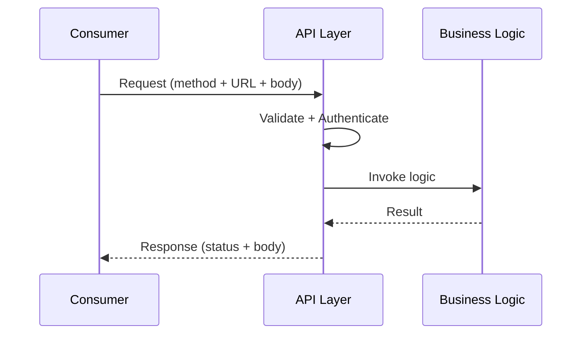
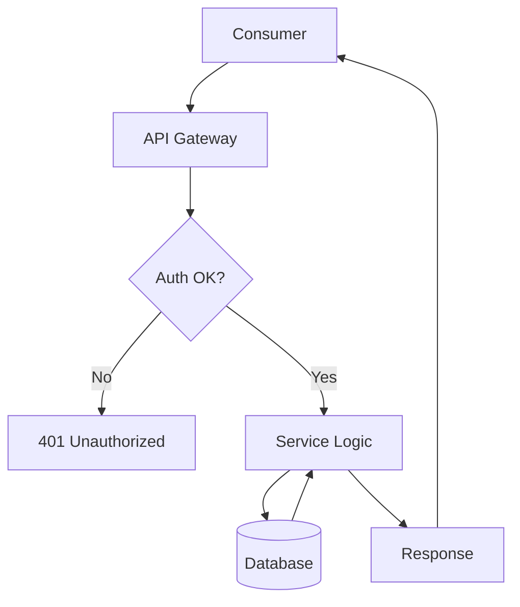

⚡ TL;DR - An API is the formal contract that lets two software
systems exchange data without either needing to know how the
other is built.

---

| #001 | Category: HTTP & APIs | Difficulty: ★☆☆ |
|:---|:---|:---|
| **Depends on:** | - | |
| **Used by:** | Client-Server Model, HTTP, REST | |
| **Related:** | Networking, Protocols | |

---

### 🔥 The Problem This Solves

**WORLD WITHOUT IT:**
Imagine two engineers at different companies who need their
systems to talk to each other. Without any agreement, each
team builds whatever internal data structures they prefer.
Team A stores user data as XML in a proprietary binary format.
Team B expects JSON over a message queue. To connect them,
each team must study the other's codebase, write custom
translation code, and maintain that code forever - any
internal change in either system breaks the integration.

**THE BREAKING POINT:**
When a third system needs to integrate, the chaos compounds.
Every integration is point-to-point. Every internal refactor
cascades into broken integrations. A company with 10 services
needs up to 45 custom connectors. Nobody can change anything
without coordinating with everyone else. The system becomes
immovable - engineers spend more time maintaining glue code
than building features.

**THE INVENTION MOMENT:**
This is exactly why the API was created: a published,
stable, technology-neutral contract that any caller can use
without knowing - or caring - what happens inside.

**EVOLUTION:**
Early systems used proprietary Remote Procedure Calls (RPCs)
in the 1970s-80s, but these were tightly coupled to specific
languages. CORBA and SOAP attempted universal standards in
the 1990s but became notoriously complex. REST emerged in
2000 from Roy Fielding's dissertation, leveraging HTTP as the
universal layer. Today APIs are the fundamental unit of
software integration - every cloud provider, SaaS product,
and mobile app is built as a composition of APIs.

---

### 📘 Textbook Definition

An Application Programming Interface (API) is a formally
defined contract specifying how two software components can
interact - what requests can be made, in what format, with
what data, and what responses to expect. APIs decouple the
interface (what a system does) from the implementation
(how it does it), enabling independent development, deployment,
and evolution of each component. In modern distributed
systems, APIs are almost always network-accessible services
that communicate via HTTP, gRPC, or message protocols.

---

### ⏱️ Understand It in 30 Seconds

**One line:**
An API is the front door of a software system - it defines
what visitors can ask for and what they will receive.

**One analogy:**
> A restaurant menu is an API. You do not enter the kitchen,
> you do not need to know the chef's recipe, and the chef does
> not need to know who you are. You choose from the published
> menu (the API), place an order (the request), and receive
> exactly what was promised (the response). The kitchen can
> change its equipment or recipes without changing the menu.

**One insight:**
The power of an API is not what it exposes - it is what it
HIDES. By publishing only a stable contract and hiding all
implementation details, an API lets both sides evolve
independently. This is the foundation of every scalable
software architecture, from microservices to cloud platforms.

---

### 🔩 First Principles Explanation

**CORE INVARIANTS:**
1. An API is a CONTRACT - both parties commit to honoring it.
   The provider promises to respond in a specified format.
   The caller promises to send requests in a specified format.
2. An API is a BOUNDARY - it separates interface from
   implementation. What happens inside is invisible to callers.
3. An API is STABLE by intent - consumers depend on it not
   changing arbitrarily. Breaking changes are a serious event.

**DERIVED DESIGN:**
Given these invariants, an API must define at minimum:
- What operations are available (endpoints or methods)
- What input each operation expects (parameters, body format)
- What output each operation returns (response format)
- What can go wrong (error codes and conditions)

Everything else - databases, caches, algorithms, programming
languages - is an implementation detail hidden behind the
contract.

**THE TRADE-OFFS:**

**Gain:** Independent deployability. Team A can ship a new
version of their service without coordinating with every
consumer, as long as the API contract is honored.

**Cost:** Contract rigidity. The API becomes a long-lived
commitment. Poorly designed APIs create technical debt that
outlasts the original implementation by years.

**ESSENTIAL vs ACCIDENTAL COMPLEXITY:**

**Essential:** Any two systems communicating over a network
must agree on a protocol. Some form of contract is
unavoidable. This complexity cannot be eliminated.

**Accidental:** SOAP's WSDLs, CORBA's IDL files, elaborate
API management platforms for simple read endpoints - these
add complexity beyond the essential contract problem. Modern
REST+JSON reduces accidental complexity by reusing the
universal HTTP protocol.

---

### 🧪 Thought Experiment

**SETUP:**
You have two microservices: Order Service and Inventory
Service. No API contract exists. The Inventory team decides
to rename a JSON field from `qty` to `available_quantity`
to improve code clarity.

**WHAT HAPPENS WITHOUT AN API:**
The Order Service is calling the internal Inventory method
directly via a shared library. After the rename, the Order
Service still reads `qty`, which is now null. Orders start
being placed for items with zero inventory. The bug only
appears at checkout. Customers complain. Engineers must
coordinate an emergency synchronized deployment.

**WHAT HAPPENS WITH AN API:**
The Inventory Service has a published API contract. The team
wants to rename the field. They check - 47 consumers depend
on `qty`. They introduce `available_quantity` alongside `qty`
(additive change, no breakage), deprecate `qty` in the docs,
wait 90 days for consumers to migrate, then remove it. Each
consumer migrates on their own schedule. Zero incidents.

**THE INSIGHT:**
An API forces change management to be explicit and deliberate.
Without it, internal refactors become invisible landmines.
With it, every change that crosses a boundary is a conscious
decision with a migration path.

---

### 🧠 Mental Model / Analogy

> Think of an API as a power outlet in a wall. The outlet
> publishes a standard contract: voltage, frequency, plug
> shape. Every appliance that follows the standard can use
> any outlet in the country. The electrical grid behind the
> wall can be completely rebuilt - from coal to solar - and
> no appliance needs to change.

Mapping:
- "Outlet standard" → API specification (endpoints, formats)
- "Appliance" → API consumer (mobile app, another service)
- "Electrical grid" → service implementation (database, logic)
- "Rebuilding the grid" → internal refactor or re-platform
- "Plug shape" → data format (JSON, Protobuf, XML)

Where this analogy breaks down: a power outlet has exactly
one interface. Real APIs evolve over time, requiring versioning
strategies that power outlets do not need.

---

### 📶 Gradual Depth - Five Levels

**Level 1 - What it is (anyone can understand):**
An API is how one computer program asks another for help.
Like a waiter taking your order in a restaurant, an API
takes your request to the kitchen (the other system) and
brings back what you asked for.

**Level 2 - How to use it (junior developer):**
As a consumer, you make HTTP requests to API endpoints with
the required parameters and parse the JSON response. The key
skill is reading API documentation to understand what
endpoints exist, what they accept, and what they return -
including error cases.

**Level 3 - How it works (mid-level engineer):**
An API defines a formal contract: HTTP verbs map to
operations (GET for reads, POST for creates), URLs identify
resources, request bodies carry structured data, and
status codes signal success or failure. On the server side,
a request handler decodes the input, invokes business logic,
and serializes the response. The contract hides everything
inside.

**Level 4 - Why it was designed this way (senior/staff):**
The REST architectural style chose HTTP deliberately -
existing infrastructure (caches, load balancers, proxies,
browsers) already understood HTTP semantics. Building new
APIs on HTTP meant free scalability infrastructure. The
decision to use stateless requests (each request contains
all needed context) eliminated server-side session state
at the API layer, enabling horizontal scaling. These
constraints look arbitrary until you trace their lineage.

**Level 5 - Mastery (distinguished engineer):**
The hardest part of API design is not the endpoint design
- it is the BOUNDARY decision: what belongs inside the API
contract, what remains an implementation detail, and how
to evolve the contract over years without breaking consumers.
Stripe maintains API backwards compatibility across a decade
by treating the API as a product. Most teams treat it as
a technical detail. That distinction determines whether an
API becomes infrastructure or a constant maintenance burden.

---

### ⚙️ How It Works (Mechanism)

At its core, every API interaction follows the same pattern:

```
┌───────────────────────────────────────────────────┐
│              API Interaction Model                │
├───────────────────────────────────────────────────┤
│                                                   │
│  Consumer                Provider                 │
│  ────────                ────────                 │
│  1. Form Request  ──────→ 2. Validate Input       │
│  (method + URL +          3. Authenticate Caller  │
│   headers + body)         4. Execute Business     │
│                              Logic                │
│                           5. Serialize Response   │
│  8. Parse Response ←────  6. Set Status Code      │
│  9. Handle Errors         7. Return Response      │
│                                                   │
│  Contract: Shared agreement on steps 1-9         │
│  Hidden:   Everything inside step 4              │
└───────────────────────────────────────────────────┘
```



**Step-by-step walkthrough:**

1. **Request formation:** The consumer constructs a request
   according to the API contract - choosing the correct HTTP
   method, URL path, query parameters, headers, and body.

2. **Transport:** The request travels over the network,
   possibly through load balancers, API gateways, and proxies.
   Each hop may inspect or modify headers.

3. **Authentication:** The provider verifies the caller's
   identity - via API key, JWT, OAuth token, or mTLS
   certificate. Unauthenticated requests are rejected before
   business logic executes.

4. **Validation:** Input is validated against the contract:
   required fields present, types correct, values in range.
   Validation failures return 400 Bad Request immediately.

5. **Business logic:** The core operation executes. The
   consumer cannot see or influence what happens here.

6. **Response serialization:** The result is serialized into
   the contract format (typically JSON) with the appropriate
   HTTP status code.

7. **Response transport:** The response travels back through
   the network. HTTP status codes allow intermediaries (caches,
   proxies) to handle responses without inspecting the body.

8. **Consumer processing:** The consumer reads the status code
   first. 2xx = success, process the body. 4xx = caller error,
   fix the request. 5xx = provider error, retry or alert.

---

### 🔄 The Complete Picture - End-to-End Flow

```
┌─────────────────────────────────────────────────────┐
│              Full API Lifecycle                     │
├─────────────────────────────────────────────────────┤
│                                                     │
│  [Design]→[Contract Published]→[Consumers Onboard] │
│                                       │             │
│                                       ↓             │
│  [Request]→[Gateway]→[Service] ← YOU ARE HERE      │
│                           │                         │
│                           ↓                         │
│             [DB/Cache/External APIs]                │
│                           │                         │
│                           ↓                         │
│           [Response] → [Consumer]                   │
│                                                     │
│  FAILURE PATH:                                      │
│  Service unavailable → 503 → Consumer retries      │
│  Timeout → 504 → Circuit breaker opens             │
│  Bad input → 400 → Consumer fixes request          │
└─────────────────────────────────────────────────────┘
```



**WHAT CHANGES AT SCALE:**
At low load, a single service handling requests directly is
sufficient. At 10,000+ requests/second, an API gateway becomes
essential to enforce rate limits, handle auth centrally, and
route traffic across multiple service instances. At 100,000+
req/s, caching at the API boundary (CDN, reverse proxy) serves
repeated reads without hitting the service at all - the API
layer expands to include distributed edge nodes.

---

### 💻 Code Example

**Example 1 - BAD: Tightly coupled direct database access**

```python
# BAD: Service A directly queries Service B's database.
# Any schema change in B breaks A immediately.

import psycopg2

def get_user_name(user_id):
    conn = psycopg2.connect(host="user-service-db")
    cursor = conn.cursor()
    # Direct DB access - coupling to internal schema
    cursor.execute(
        "SELECT first_name FROM users WHERE id = %s",
        (user_id,)
    )
    return cursor.fetchone()[0]
```

**Example 1 - GOOD: Consume via stable API contract**

```python
# GOOD: Service A calls Service B's published API.
# Internal schema changes are invisible to Service A.

import requests

def get_user_name(user_id):
    response = requests.get(
        f"https://api.users.internal/v1/users/{user_id}",
        headers={"Authorization": f"Bearer {SERVICE_TOKEN}"},
        timeout=(3, 10)
    )
    response.raise_for_status()
    # 'name' is a stable contract field, not a DB column
    return response.json()["name"]
```

---

**Example 2 - Consuming a simple REST API correctly**

```python
import requests

BASE_URL = "https://api.example.com/v1"

def create_order(customer_id, items):
    """POST /orders - create a new order"""
    payload = {
        "customer_id": customer_id,
        "items": items
    }
    headers = {
        "Content-Type": "application/json",
        "Authorization": f"Bearer {API_KEY}"
    }

    response = requests.post(
        f"{BASE_URL}/orders",
        json=payload,
        headers=headers,
        timeout=5
    )

    if response.status_code == 201:
        return response.json()["order_id"]
    elif response.status_code == 400:
        # Caller error - log and fix the request
        raise ValueError(response.json()["error"])
    elif response.status_code >= 500:
        # Provider error - retry with backoff
        raise ServiceUnavailableError(
            f"API returned {response.status_code}"
        )
```

---

**Example 3 - BAD vs GOOD error handling**

```python
# BAD: ignoring status codes entirely
response = requests.post(url, json=payload)
# KeyError if status was 400 or 500
order_id = response.json()["order_id"]

# GOOD: status-first response handling
response = requests.post(url, json=payload)
response.raise_for_status()  # raises for 4xx/5xx
order_id = response.json()["order_id"]
```

---

### ⚖️ Comparison Table

| API Style | Coupling | Flexibility | Performance | Best For |
|:---|:---|:---|:---|:---|
| **REST** | Loose | High | Medium | Public APIs, CRUD ops |
| gRPC | Medium | Medium | High | Internal service calls |
| GraphQL | Loose | Very High | Variable | Flexible client queries |
| SOAP | Tight | Low | Low | Legacy enterprise integr. |
| Direct DB | Very Tight | Low | High | Never across team borders |

How to choose: Use REST for new public or external APIs where
discoverability and browser compatibility matter. Use gRPC for
high-throughput internal service-to-service communication where
you control both sides and performance is critical.

---

### ⚠️ Common Misconceptions

| Misconception | Reality |
|:---|:---|
| An API is just a URL | An API is a full contract: URL + method + request format + response format + error conditions + versioning promise |
| APIs are only for external consumers | Internal APIs between your own services deserve the same design rigor - most breaking changes happen internally |
| Changing a response field is a safe refactor | Any change to the response structure breaks consumers; "internal" is only invisible if the API contract hides it |
| REST is just "using HTTP" | REST has six architectural constraints (statelessness, uniform interface, layered system, etc.) - most APIs violate several |
| More endpoints means a better API | Fewer, well-designed endpoints with clear semantics beat a sprawl of specialized endpoints for every edge case |

---

### 🚨 Failure Modes & Diagnosis

**Breaking Contract Changes Without Versioning**

**Symptom:** Consumers receive `null` values, JSON parse
errors, or unexpected fields. Error rate spikes across
multiple teams simultaneously right after a provider deploy.

**Root Cause:** A provider team renamed a response field,
removed an endpoint, or changed a field's type without
bumping the API version. All consumers pinned to the old
contract break simultaneously.

**Diagnostic Command / Tool:**

```bash
# Check recent changes to API response schemas
git log --oneline --follow api/responses/order.py

# Compare live response against documented schema
curl -s https://api.example.com/v1/orders/1 | \
  python3 -c "import sys,json; \
  d=json.load(sys.stdin); print(sorted(d.keys()))"
```

**Fix:**

```python
# BAD: rename field directly - breaks all consumers
# Before: {"qty": 5}
# After:  {"available_quantity": 5}

# GOOD: additive change with deprecation window
{
    "qty": 5,                  # deprecated, kept 90 days
    "available_quantity": 5    # new field
}
```

**Prevention:** Treat the API contract as a product. Any
removal or rename requires a new version or a deprecation
window. Consumer-driven contract tests (Pact) catch this
in CI before deploy.

---

**Missing Authentication on Sensitive Endpoints**

**Symptom:** Audit logs show unexpected access patterns.
Security review discovers data accessible without credentials.

**Root Cause:** Endpoint added without applying auth
middleware. API gateway not enforcing auth on new routes
by default.

**Diagnostic Command / Tool:**

```bash
# Test for missing auth - should return 401, not 200
curl -s -o /dev/null -w "%{http_code}" \
  https://api.example.com/v1/orders/99999
# If output is 200 without Authorization header: VULNERABLE
```

**Fix:**

```python
# BAD: auth as opt-in (forgot = no auth)
@app.route("/orders/<id>")
def get_order(id):
    return jsonify(order_service.get(id))

# GOOD: auth as opt-out (explicit exemption required)
@app.route("/orders/<id>")
@require_auth  # enforced by default on all routes
def get_order(id):
    return jsonify(order_service.get(id))
```

**Prevention:** Configure API gateway or middleware to require
auth by default. Unauthenticated access requires an explicit
`@public` decorator reviewed in code review.

---

**No Timeout on Outbound API Calls**

**Symptom:** Thread pool exhaustion. Service stops responding
entirely when a dependency is slow. Health checks time out.

**Root Cause:** Default HTTP clients in most languages have
no timeout. A slow upstream API holds threads open indefinitely.
Under load, all threads are waiting and the caller service
becomes unresponsive.

**Diagnostic Command / Tool:**

```bash
# Check active thread states (Java)
jcmd <pid> Thread.print | grep -c WAITING

# Check open TCP connections
ss -tp | grep ESTABLISHED | wc -l
```

**Fix:**

```python
# BAD: no timeout - thread held indefinitely
response = requests.get(url)

# GOOD: explicit connect + read timeouts
response = requests.get(
    url,
    timeout=(3, 10)  # (connect_timeout, read_timeout)
)
```

**Prevention:** Enforce timeout at the HTTP client library
level. Default to 5s read timeout. Tune per dependency SLA.

---

### 🔗 Related Keywords

**Prerequisites (understand these first):**
- `Networking Fundamentals` - APIs ride on TCP/IP networks;
  latency, packet loss, and retries all matter at the API layer
- `HTTP Protocol` - the dominant transport layer for modern APIs

**Builds On This (learn these next):**
- `Client-Server Model` - the architectural pattern APIs formalize
- `REST Principles` - the most widely adopted API style
- `API Endpoint Design Basics` - the practical craft of designing
  good API contracts
- `API Key Authentication` - the first security layer on any
  real-world API

**Alternatives / Comparisons:**
- `gRPC` - binary-serialized, HTTP/2-based API style optimized
  for internal service-to-service communication
- `GraphQL` - query-language API style shifting data shape
  control to the consumer

---

### 📌 Quick Reference Card

```
┌──────────────────────────────────────────────────────────┐
│ WHAT IT IS   │ A contract for how two systems exchange   │
│              │ data without knowing each other's code    │
├──────────────┼───────────────────────────────────────────┤
│ PROBLEM IT   │ Direct coupling makes every internal      │
│ SOLVES       │ change a cross-team coordination crisis   │
├──────────────┼───────────────────────────────────────────┤
│ KEY INSIGHT  │ Power = what it HIDES, not what it        │
│              │ exposes - decoupling enables velocity     │
├──────────────┼───────────────────────────────────────────┤
│ USE WHEN     │ Any time two independently deployed       │
│              │ components must communicate               │
├──────────────┼───────────────────────────────────────────┤
│ AVOID WHEN   │ Same process, same team, same deploy unit │
│              │ - a direct function call is simpler       │
├──────────────┼───────────────────────────────────────────┤
│ ANTI-PATTERN │ Leaking the internal DB schema or object  │
│              │ model directly as the API response        │
├──────────────┼───────────────────────────────────────────┤
│ TRADE-OFF    │ Independent evolution vs contract rigidity│
├──────────────┼───────────────────────────────────────────┤
│ ONE-LINER    │ "The API is the product; the code is      │
│              │ the implementation detail."               │
├──────────────┼───────────────────────────────────────────┤
│ NEXT EXPLORE │ HTTP → REST Principles → Endpoint Design  │
└──────────────────────────────────────────────────────────┘
```

**If you remember only 3 things:**
1. An API is a stable contract - not just a URL. It commits
   the provider to a specific request format, response format,
   and error behavior. Breaking that contract breaks consumers.
2. The power of an API is isolation: the provider can refactor
   completely without breaking any consumer as long as the
   published contract is honored.
3. Never expose your internal data model as your API - it
   couples your database schema to every consumer forever.

**Interview one-liner:**
"An API is a formal contract between two systems: it specifies
what operations are available, what data they accept and return,
and what errors are possible - while hiding all implementation
details. The value is not just communication but independent
evolvability: both sides can change internally as long as the
contract holds."

---

### 💎 Transferable Wisdom

**Reusable Engineering Principle:**
Published contracts enable independent evolution. Any time
you need two components to change independently without
coordinating every deployment, a well-defined contract at
their boundary is the answer - whether that boundary is a
network, a library interface, a database schema, or a team
ownership line.

**Where else this pattern appears:**
- Operating System syscalls - the kernel exposes a stable
  syscall interface so user-space programs never break when
  the kernel internals are rewritten
- Database schemas as contracts - application code treats
  the schema as a stable API; changes follow migration patterns
- USB and PCIe standards - hardware contracts that let
  manufacturers build components independently

**Industry applications:**
- Financial services - open banking APIs (PSD2, Plaid) let
  third-party apps access account data without touching bank
  infrastructure; the API is the regulatory boundary
- Healthcare - HL7 FHIR defines data APIs so providers,
  insurers, and apps can interoperate without sharing systems

---

### 💡 The Surprising Truth

The term "API" predates the internet by more than a decade.
Wilkes, Wheeler, and Gill coined it in 1951 to describe
subroutine libraries for the EDSAC computer - software
interfaces between programs running on the same machine.
The idea that a module should hide its implementation and
publish only a stable interface is over 70 years old. Every
"modern" API design principle - information hiding, stable
contracts, versioning - traces back to this single 1951
insight. The buzzwords change; the principle does not.

---

### ✅ Mastery Checklist

**You've mastered this when you can:**
1. **EXPLAIN** Describe to a non-technical stakeholder why
   renaming an API response field requires a migration plan,
   not just a code commit.
2. **DEBUG** Given a sudden spike in 4xx errors across
   multiple consumer teams immediately after a provider deploy,
   identify the likely root cause and immediate mitigation.
3. **DECIDE** Given a new feature sharing data between two
   services on the same team vs two services on different
   teams, explain when a formal API contract is justified vs
   when a direct function call is better.
4. **BUILD** Design the minimal API contract for a user
   profile service: define the endpoints, request/response
   shapes, status codes, and one versioning decision.
5. **EXTEND** Explain how the API contract principle applies
   to a command-line tool's argument interface - why adding
   a required positional argument is a breaking change
   equivalent to removing an API response field.

---

### 🧠 Think About This Before We Continue

**Q1.** You are the API provider for a payment processing
service. A consumer team asks you to add a `fees_breakdown`
field to your charge response. Six months later, you realize
the calculation was wrong and you need to rename three
sub-fields. 47 consumers now depend on the old names.
How do you manage this migration without causing incidents,
and what would you have done differently at design time?

*Hint: Think about the difference between additive changes
(always safe) and breaking changes (require versioning), and
how Stripe manages a decade of API backwards compatibility.*

**Q2.** At 500 requests/second to your read-heavy API, a
cache layer reduces database load from 90% to 10%. At 50,000
requests/second, what architectural changes to the API itself
become necessary, and what assumptions from your original
design begin to break?

*Hint: Consider where authentication, rate limiting, and
contract validation happen at low vs high scale, and what
moves to the edge.*

**Q3.** Build this: design a minimal API for a todo list
service with three operations (create, list, complete). For
each operation, specify the HTTP method, URL, request body,
success response, and at least two error cases. Then identify
which of your design decisions would be the hardest to change
in two years if requirements evolved.

*Hint: Pay attention to what goes in the URL vs the body,
and whether your response structure leaks your data model.*

---

### 🎯 Interview Deep-Dive

**Q1: What is the difference between an API and a library,
and when would you choose one over the other?**

*Why they ask:* Tests whether the candidate understands
coupling, deployment independence, and network boundaries -
not just "API = HTTP call."

*Strong answer includes:*
- A library is linked at compile/runtime and lives in the
  same process; an API crosses a network boundary with an
  independent deployment lifecycle
- Library calls have no network latency or failure modes;
  APIs introduce timeouts, retries, and partial failures
- Choose a library when both sides always deploy together;
  choose an API when independent deployment or language
  heterogeneity is required
- Microservices replaced shared libraries with APIs to enable
  independent team velocity - at the cost of operational
  complexity and network overhead

**Q2: After a deploy, multiple consumer teams report that
your `user_email` field is now returning null. Your PR shows
you renamed it to `email`. What went wrong, and how do you
prevent this class of error systematically?**

*Why they ask:* Tests understanding of API contract breaking
changes and backwards compatibility in production systems.

*Strong answer includes:*
- Renaming a field is a breaking change - consumers pinned to
  the old name receive null after the rename
- Correct migration: add the new field alongside the old one,
  mark old field deprecated, notify consumers, remove after
  a 90-day migration window
- Systematic prevention: consumer-driven contract tests (Pact)
  catch this in CI before deploy; API versioning provides hard
  isolation for larger changes
- At scale: version headers or URL versioning (/v1/, /v2/)
  give hard isolation when a breaking change is unavoidable

**Q3: Your public API currently accepts requests without any
authentication. Security requires API key auth. How do you
roll this out to 200 existing consumers without breaking
them?**

*Why they ask:* Tests migration strategy for security changes
on live APIs - requires both security knowledge and
production operational care.

*Strong answer includes:*
- Cannot add required auth overnight to a live API - that is
  a breaking change for all existing callers
- Migration path: (1) issue API keys to all existing consumers,
  (2) run "warn mode" where missing keys are logged but not
  rejected, (3) send deprecation notices with a firm deadline,
  (4) enforce after migration window
- Monitor adoption via metrics: percentage of requests with
  valid keys over time; enforce when adoption reaches ~99%
- Use API response headers (`Deprecation`, `Sunset`) to
  communicate the cutover date to consumer developers
