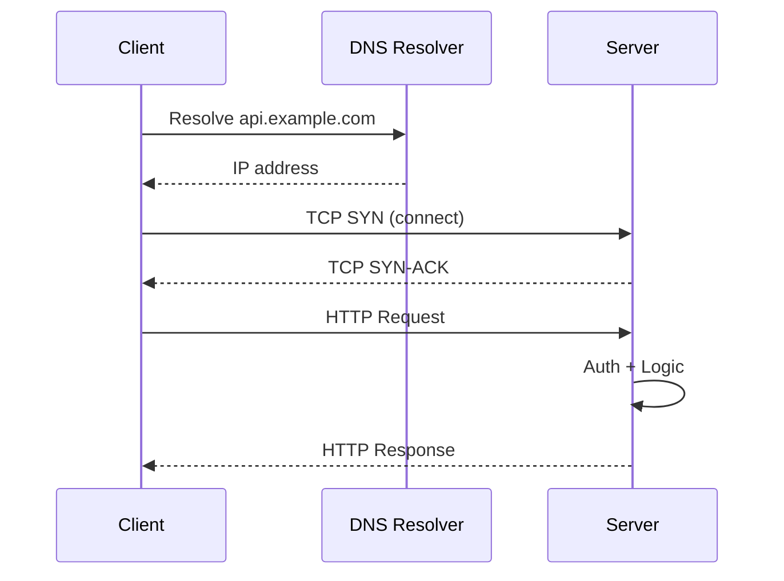
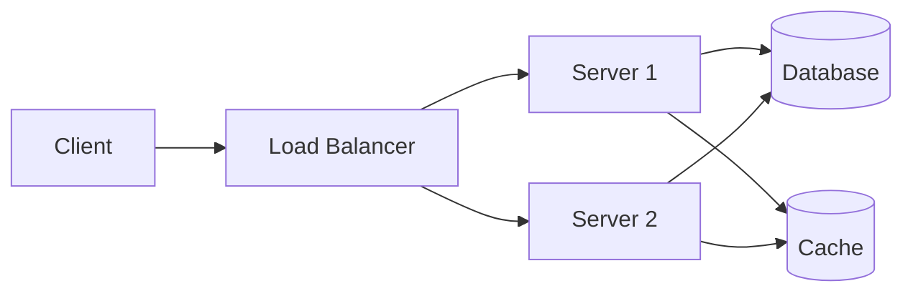

⚡ TL;DR - The client-server model splits every network
interaction into two roles: clients that request, and servers
that respond - making the internet's communication model
predictable and scalable.

---

| #002 | Category: HTTP & APIs | Difficulty: ★☆☆ |
|:---|:---|:---|
| **Depends on:** | The API Problem | |
| **Used by:** | HTTP, REST, API Endpoint Design | |
| **Related:** | Networking, TCP/IP | |

---

### 🔥 The Problem This Solves

**WORLD WITHOUT IT:**
Imagine a network where any computer can initiate
communication with any other computer at any time, in any
format, for any reason. When your laptop receives an incoming
connection, is it a file transfer? A chat message? A database
query? The receiving system has no way to know who is in
charge, what protocol to use, or who should speak first.
Multiplied across millions of machines, this produces chaos.

**THE BREAKING POINT:**
Every peer-to-peer protocol must solve the "who goes first"
problem from scratch. Resources cannot be shared efficiently
without a coordinator. Security is impossible when any node
can push arbitrary data to any other. Networks that tried
fully symmetric models either became insecure (early peer-to-
peer filesharing) or required complex coordination protocols
that failed under load.

**THE INVENTION MOMENT:**
This is exactly why the client-server model was created: a
clear asymmetry - one side requests, the other responds. The
server has resources; the client needs them. The server is
always listening; the client initiates. This single invariant
makes everything else - HTTP, REST, databases, APIs - work.

**EVOLUTION:**
Early mainframe computing (1960s) already used a client-server
model: terminals were clients, mainframes were servers. TCP/IP
(1974) formalized the model for networks. HTTP (1991)
standardized it for the web. REST (2000) applied it to APIs
deliberately. Today every cloud service, mobile app, and
microservice architecture is built on this model - though some
systems (WebSocket, gRPC bidirectional) extend it with two-way
communication while still initializing client-first.

---

### 📘 Textbook Definition

The client-server model is a distributed computing architecture
in which two types of participants have distinct roles: a
client initiates requests for resources or services, and a
server listens for incoming requests and provides responses.
The server maintains resources (data, computation, files) and
the client consumes them. Communication is always
client-initiated in the classic model. Multiple clients can
connect to a single server concurrently, making the model
naturally suited to centralized resource management.

---

### ⏱️ Understand It in 30 Seconds

**One line:**
One side asks, the other answers - the client always speaks
first, the server always waits.

**One analogy:**
> A bank branch is a classic client-server system. The bank
> (server) holds the resource - your money - and waits for
> customers. You (client) walk in and initiate a request:
> "I'd like to withdraw $100." The bank responds to your
> request. The bank never walks to your home to push money
> at you uninitiated. You never store money in your own vault
> and lend it to the bank.

**One insight:**
The power of the model is role clarity: because the server
always waits and the client always initiates, every component
knows exactly what to expect. The server can be scaled
independently. The client can be replaced entirely. Security
policies can be enforced at the server boundary. This
asymmetry is what makes the internet work at scale.

---

### 🔩 First Principles Explanation

**CORE INVARIANTS:**
1. **Role asymmetry:** The client initiates, the server
   responds. Neither party can break this order without
   transitioning to a different model (push, pub/sub).
2. **Server passivity:** A server waits for connections.
   It does not know clients exist until a client connects.
3. **Stateless by default:** In HTTP/REST, each request
   from client to server is independent - the server does
   not remember previous requests unless it explicitly
   stores session state.

**DERIVED DESIGN:**
Given role asymmetry, the server needs a well-known address
(hostname + port) so clients can find it. Clients do not
need well-known addresses because they initiate. The server
needs to handle multiple clients concurrently - hence thread
pools, event loops, and connection queues. The client needs
to encode its request with everything the server needs to
respond - hence HTTP headers, query parameters, and request
bodies.

**THE TRADE-OFFS:**

**Gain:** Centralized resource control, predictable security
model, horizontal scalability of the server tier, and simple
reasoning about who has authority over which data.

**Cost:** The server becomes a single point of failure if not
replicated. The client has no way to receive data unless it
polls - unless the protocol extends to push (WebSocket, SSE).

**ESSENTIAL vs ACCIDENTAL COMPLEXITY:**

**Essential:** Any shared resource requires a coordinator.
Some party must hold the resource and arbitrate access.
This centralization is unavoidable for shared state.

**Accidental:** HTTP's verbose text headers, SOAP's XML
envelope nesting, session cookies for client identification -
these are historical accidents. The essential model requires
only: address + role asymmetry + request/response semantics.

---

### 🧪 Thought Experiment

**SETUP:**
You and 1,000 other people all need to read today's weather
forecast. There is no server - just 1,001 peers with copies
of their own local weather data.

**WHAT HAPPENS WITHOUT CLIENT-SERVER:**
Each of 1,001 peers must broadcast to find who has the most
current forecast. Messages collide. Peers disagree on whose
data is authoritative. You receive 50 different forecasts with
different timestamps. To get the "true" answer requires a
consensus protocol - which requires... a coordinator. You have
reinvented the server.

**WHAT HAPPENS WITH CLIENT-SERVER:**
A single weather server holds the authoritative forecast.
You (client) send one request: `GET /forecast/today`. The
server responds with one authoritative answer. 1,000 clients
can all receive the same answer simultaneously by connecting
to the same server independently.

**THE INSIGHT:**
Shared mutable state requires a single authority. The
client-server model is the minimal architecture that provides
that authority while keeping clients independent. Every
attempt to avoid it either recreates it or sacrifices
consistency.

---

### 🧠 Mental Model / Analogy

> The client-server model is exactly like a phone call to a
> help desk. The help desk (server) sits at a known number,
> headsets on, waiting. You (client) dial the number and
> explain your problem. The help desk answers your specific
> question. They do not call you first - they do not even
> know you exist until you dial.

Mapping:
- "Help desk phone number" → server address (IP + port)
- "Dialing the number" → TCP connection initiation by client
- "Explaining your problem" → HTTP request with method and body
- "Getting your answer" → HTTP response with status and body
- "Help desk staying open" → server listening continuously
- "Multiple customers at once" → concurrent connections

Where this analogy breaks down: a real help desk worker
remembers your account history. HTTP is stateless - the server
has no memory of your previous calls unless it explicitly
stores session data.

---

### 📶 Gradual Depth - Five Levels

**Level 1 - What it is (anyone can understand):**
Think of it as a caller and a recipient: one side always
makes the call, the other always picks up. Your web browser
is the caller (client); Google's computers are the recipients
(servers). The server waits; the client decides when to ask.

**Level 2 - How to use it (junior developer):**
When writing client code, you always initiate: create a
connection, form a request (URL + method + headers + body),
send it, and wait for a response. When writing server code,
you always listen: bind to a port, accept connections, parse
incoming requests, execute logic, and send back a response.
These roles never swap in HTTP.

**Level 3 - How it works (mid-level engineer):**
At the network level, the client opens a TCP connection to
the server's IP and port. The server has a socket listening
(LISTEN state) and accepts the connection. Over that TCP
connection, the client sends an HTTP request (text or binary).
The server processes it and sends an HTTP response. For HTTP/1.1
the connection may be reused (keep-alive). For HTTP/2, one
TCP connection carries multiple concurrent request-response
pairs (multiplexing).

**Level 4 - Why it was designed this way (senior/staff):**
The stateless request model (each request is self-contained)
was a deliberate choice in HTTP/REST. Stateful sessions require
the server to remember client context - this prevents any
server from handling any request (you must route to the same
server). Statelessness enables any server instance to handle
any request, making horizontal scaling trivial. The cost is
that clients must re-send authentication credentials and
context on every request.

**Level 5 - Mastery (distinguished engineer):**
The client-server model has one fundamental weakness: servers
cannot push. The web's stateless request/response model works
perfectly for documents but breaks for real-time use cases.
The extensions to push (WebSocket, SSE, HTTP/2 Server Push,
long polling) all attempt to graft push capability onto a
pull-native architecture. Each introduces different trade-offs
in connection management, resumability, and server load. The
staff engineer knows when the client-server model is the right
tool and when to reach for an event-driven model instead.

---

### ⚙️ How It Works (Mechanism)

```
┌──────────────────────────────────────────────────────┐
│           Client-Server Interaction Flow             │
├──────────────────────────────────────────────────────┤
│                                                      │
│  CLIENT                         SERVER               │
│  ──────                         ──────               │
│  1. Resolve DNS ───────────────→ (server at IP:port) │
│  2. TCP SYN     ───────────────→ 3. TCP SYN-ACK      │
│  4. TCP ACK                        (connection open) │
│  5. HTTP Request ──────────────→ 6. Parse Request    │
│     GET /api/users HTTP/1.1        7. Auth Check     │
│     Host: api.example.com          8. Execute Logic  │
│     Authorization: Bearer ...      9. Build Response │
│  10. Process Response ←─────────  HTTP/1.1 200 OK    │
│      200 OK                        Content-Type: json│
│      {"users": [...]}              {"users": [...]}  │
│                                                      │
│  TCP connection may be reused (keep-alive)          │
└──────────────────────────────────────────────────────┘
```



**Phase breakdown:**

1. **DNS resolution:** Client converts hostname to IP address.
   Cached locally for the TTL duration - DNS is not called on
   every request.

2. **TCP handshake (3-way):** Client sends SYN. Server responds
   SYN-ACK. Client sends ACK. Connection is now established.
   This costs 1 round-trip before any application data is sent.

3. **TLS handshake (if HTTPS):** An additional 1-2 round-trips
   to negotiate cipher suites and exchange certificates.
   TLS 1.3 reduces this to 1 round-trip (0-RTT for resumption).

4. **Request:** Client sends HTTP request over the established
   TCP connection. The request is fully self-contained -
   method, URL, headers, optional body.

5. **Server processing:** Server authenticates, validates,
   executes business logic, reads/writes data stores.

6. **Response:** Server sends HTTP response with status code,
   headers, and optional body. The status code tells the client
   what happened before it reads the body.

7. **Connection management:** HTTP/1.1 keep-alive reuses the
   TCP connection for subsequent requests. HTTP/2 multiplexes
   multiple requests over one connection. HTTP/1.0 closed
   the connection after each response.

---

### 🔄 The Complete Picture - End-to-End Flow

```
┌──────────────────────────────────────────────────────┐
│        Full Client-Server Request Lifecycle          │
├──────────────────────────────────────────────────────┤
│                                                      │
│  [Browser/App] → [DNS] → [TCP] → [TLS] → [HTTP]     │
│                                          │           │
│                              ← YOU ARE HERE         │
│                                          │           │
│                              [Load Balancer]         │
│                                          │           │
│                              [Server Instance]       │
│                                          │           │
│                              [DB / Cache / APIs]     │
│                                          │           │
│                              [HTTP Response]         │
│                                          ↓           │
│                              [Browser/App renders]   │
│                                                      │
│  FAILURE PATH:                                       │
│  Server down → TCP refused → client gets ECONNREF   │
│  Server overloaded → TCP timeout → client retries   │
│  Bad request → 400 → client logs and stops          │
└──────────────────────────────────────────────────────┘
```



**WHAT CHANGES AT SCALE:**
A single server handles ~1,000 concurrent connections with
a typical thread-per-connection model. At 100,000 concurrent
connections, a single-threaded event loop (Node.js, Nginx,
Netty) is essential - threads become too expensive. At 1M+
concurrent connections, connection state itself must be
distributed across multiple machines (sticky sessions, or
fully stateless protocol design).

---

### 💻 Code Example

**Example 1 - BAD: Synchronous blocking client**

```python
# BAD: blocking I/O - one request at a time
# 100 requests × 100ms each = 10 seconds total

import requests

def fetch_all_users(user_ids):
    results = []
    for uid in user_ids:
        # Each request blocks until response received
        r = requests.get(f"https://api.example.com/users/{uid}")
        results.append(r.json())
    return results
```

**Example 1 - GOOD: Async concurrent client**

```python
# GOOD: async I/O - all requests in parallel
# 100 requests × 100ms each = ~100ms total

import asyncio
import aiohttp

async def fetch_user(session, uid):
    url = f"https://api.example.com/users/{uid}"
    async with session.get(url) as response:
        return await response.json()

async def fetch_all_users(user_ids):
    async with aiohttp.ClientSession() as session:
        tasks = [fetch_user(session, uid) for uid in user_ids]
        return await asyncio.gather(*tasks)
```

---

**Example 2 - Minimal HTTP server (Python)**

```python
from http.server import HTTPServer, BaseHTTPRequestHandler
import json

class APIHandler(BaseHTTPRequestHandler):
    def do_GET(self):
        # Server role: listen and respond
        if self.path == "/health":
            self.send_response(200)
            self.send_header("Content-Type", "application/json")
            self.end_headers()
            self.wfile.write(
                json.dumps({"status": "ok"}).encode()
            )
        else:
            self.send_response(404)
            self.end_headers()

    def log_message(self, format, *args):
        pass  # suppress default logging

# Server binds to well-known address and listens
server = HTTPServer(("0.0.0.0", 8080), APIHandler)
server.serve_forever()
```

---

### ⚖️ Comparison Table

| Model | Who Initiates | State | Use Case |
|:---|:---|:---|:---|
| **Client-Server** | Client always | Stateless | Web APIs, CRUD, reads |
| Pub-Sub | Publisher | Stateless | Events, broadcasts |
| WebSocket | Client init, then bidirectional | Stateful | Real-time, chat |
| Peer-to-Peer | Either party | Varies | Torrents, mesh networks |
| Long Polling | Client, repeatedly | Stateless | Poor man's push |

How to choose: use classic client-server for request-response
APIs where the client pulls data on demand. Use WebSocket or SSE
when the server needs to push data to clients without polling.

---

### ⚠️ Common Misconceptions

| Misconception | Reality |
|:---|:---|
| The server knows who the clients are | In stateless HTTP, the server has no memory of clients between requests - it treats every request as new unless session state is explicitly stored |
| Client-server is only for web browsers | Every microservice calling another microservice uses client-server: the caller is the client, the callee is the server |
| Servers are more powerful machines than clients | The roles are logical, not hardware - a laptop can be a server, a datacenter can be a client |
| One machine can only be a client or a server | A single service is often both - a server to its callers and a client to its dependencies (databases, external APIs) |
| Client-server requires TCP | The model describes roles, not transport - UDP, WebRTC, and QUIC also support client-server communication |

---

### 🚨 Failure Modes & Diagnosis

**Server Overload - Too Many Concurrent Connections**

**Symptom:** New connections are refused or time out. Server
CPU pegged at 100%. Response latency climbs then requests fail.

**Root Cause:** Thread-per-connection model with too many
concurrent clients. Each thread consumes ~1MB stack memory;
1,000 threads = ~1GB RAM just for thread stacks. OS context
switching becomes the bottleneck.

**Diagnostic Command / Tool:**

```bash
# Count active connections to server port
ss -s | grep estab

# Count threads in a Java process
jcmd <pid> Thread.print | grep -c "^\"" 

# Check server resource limits
ulimit -n  # max open file descriptors
```

**Fix:**

```bash
# Increase OS connection limits
echo "net.core.somaxconn = 65535" >> /etc/sysctl.conf
sysctl -p

# Use async/event-loop model instead of thread-per-connection
# e.g. switch from Tomcat blocking to Netty or WebFlux
```

**Prevention:** Use an event-driven server (Nginx, Netty,
Node.js, Spring WebFlux) for high-concurrency workloads.
Reserve thread-per-connection for low-concurrency, CPU-bound
workloads.

---

**Connection Leak - Client Does Not Close Connections**

**Symptom:** Server-side connection count grows indefinitely.
Eventually the server refuses new connections with
"Too many open files" error.

**Root Cause:** Client code opens HTTP connections but does not
close them (missing `with` block, missing `close()` call,
exception in finally block). Connections stay CLOSE_WAIT on
the server side.

**Diagnostic Command / Tool:**

```bash
# Count connections in CLOSE_WAIT state (server-side leak)
ss -tp | grep CLOSE_WAIT | wc -l

# Identify which process is holding them
ss -tp | grep CLOSE_WAIT | awk '{print $NF}'
```

**Fix:**

```python
# BAD: connection not guaranteed to close on exception
import requests
session = requests.Session()
response = session.get(url)
# session never closed if exception occurs above

# GOOD: context manager guarantees closure
import requests
with requests.Session() as session:
    response = session.get(url)
    # session.close() called automatically
```

**Prevention:** Always use context managers (`with`) for HTTP
sessions. Set connection pool limits and idle timeouts.

---

**Missing Server-Side Timeout - Slow Client Attack**

**Symptom:** Server threads accumulate in WAITING state.
Memory grows without bound. Legitimate requests start failing.

**Root Cause:** A client sends request headers very slowly
(Slowloris attack or just a slow client). The server holds
a thread open waiting for the complete request body, which
never arrives at normal speed.

**Diagnostic Command / Tool:**

```bash
# Check for threads waiting in read state (Tomcat/Java)
jcmd <pid> Thread.print | grep -A3 "SocketInputStream"

# Monitor slow incoming connections
netstat -n | grep ESTABLISHED | awk '{print $5}' | \
  cut -d: -f1 | sort | uniq -c | sort -rn | head -10
```

**Fix (Nginx config):**

```nginx
# Set timeouts to protect server threads
client_header_timeout 10s;  # time to read request headers
client_body_timeout 10s;    # time between body reads
send_timeout 10s;           # time between response writes
keepalive_timeout 65s;      # idle keep-alive connection
```

**Prevention:** Always configure read timeouts on server-side.
Use a reverse proxy (Nginx) in front of app servers to absorb
slow-client attacks before they reach application threads.

---

### 🔗 Related Keywords

**Prerequisites (understand these first):**
- `The API Problem` - why we need a formal model for
  software communication at all
- `Networking Fundamentals` - TCP/IP layer that client-server
  communication runs on top of

**Builds On This (learn these next):**
- `HTTP Protocol` - the dominant application-layer protocol
  built on the client-server model
- `REST Principles` - applies client-server as one of its
  six architectural constraints
- `API Gateway Pattern` - extends the client-server model
  with a centralized proxy for multiple servers

**Alternatives / Comparisons:**
- `WebSocket` - starts as client-server but transitions to
  bidirectional communication
- `Server-Sent Events (SSE)` - extends HTTP to enable server
  push while remaining client-initiated
- `Pub-Sub Messaging` - replaces direct client-server pairs
  with decoupled publisher and subscriber roles

---

### 📌 Quick Reference Card

```
┌──────────────────────────────────────────────────────────┐
│ WHAT IT IS   │ Architecture where clients always         │
│              │ initiate and servers always respond       │
├──────────────┼───────────────────────────────────────────┤
│ PROBLEM IT   │ Without role clarity, every node must     │
│ SOLVES       │ handle being both initiator and responder │
├──────────────┼───────────────────────────────────────────┤
│ KEY INSIGHT  │ A server can serve millions of clients;   │
│              │ the client never needs a known address    │
├──────────────┼───────────────────────────────────────────┤
│ USE WHEN     │ One party holds resources the other needs │
│              │ on-demand - web APIs, databases, CDNs     │
├──────────────┼───────────────────────────────────────────┤
│ AVOID WHEN   │ Both parties need to initiate at any time │
│              │ - use WebSocket or message broker instead │
├──────────────┼───────────────────────────────────────────┤
│ ANTI-PATTERN │ Building a "server" that calls clients to │
│              │ push data - that's a different model      │
├──────────────┼───────────────────────────────────────────┤
│ TRADE-OFF    │ Centralized control vs single point of    │
│              │ failure; must replicate for HA            │
├──────────────┼───────────────────────────────────────────┤
│ ONE-LINER    │ "The server holds the resource; the       │
│              │ client knows what it needs."              │
├──────────────┼───────────────────────────────────────────┤
│ NEXT EXPLORE │ HTTP → TCP/IP → REST Principles           │
└──────────────────────────────────────────────────────────┘
```

**If you remember only 3 things:**
1. Role clarity is everything: clients always initiate,
   servers always wait. Breaking this is a protocol change,
   not a variation.
2. A service is both client and server simultaneously - it
   acts as server to its callers and as client to its
   dependencies (databases, external APIs).
3. Stateless by default: HTTP servers do not remember clients
   between requests - any state must be explicitly stored and
   sent with every request.

**Interview one-liner:**
"The client-server model assigns asymmetric roles: the client
initiates all communication, the server holds resources and
responds. This asymmetry enables the server to be scaled,
secured, and replaced independently of clients - it is the
foundation on which HTTP, REST, and every web API is built."

---

### 💎 Transferable Wisdom

**Reusable Engineering Principle:**
Role asymmetry simplifies systems. Whenever you have a shared
resource, designate one party as the authoritative holder and
let all others request from it. This single decision provides
a consistent security model, simplifies reasoning about state,
and enables the authority to scale independently.

**Where else this pattern appears:**
- Database connections - the application (client) initiates
  queries; the database (server) holds data and responds;
  the database never pushes data unsolicited
- DNS resolution - your machine (client) asks a resolver
  (server) for IP addresses; the resolver never pushes new
  IP addresses to your machine
- Operating system syscalls - user-space programs (clients)
  request services from the kernel (server) via syscalls;
  the kernel does not push services to programs

**Industry applications:**
- Financial trading platforms - trading systems (clients)
  pull quotes and submit orders to exchange servers; the
  exchange holds the authoritative order book
- Healthcare EMR systems - hospital applications (clients)
  request patient records from record servers; the server
  enforces access controls centrally

---

### 💡 The Surprising Truth

The client-server model was not invented for the web - it
was the dominant computing paradigm of the 1960s mainframe
era. IBM's time-sharing systems in 1967 had dumb terminals
(clients) connected to mainframes (servers) over serial
cables. When the web was designed in 1991, Berners-Lee
deliberately chose this decades-old model over peer-to-peer
alternatives because it was already proven, understood, and
had straightforward security properties. The "modern" web is
built on a computing model that predates the microprocessor.

---

### ✅ Mastery Checklist

**You've mastered this when you can:**
1. **EXPLAIN** Describe to a junior developer why a
   microservice is simultaneously a server (to its callers)
   and a client (to its dependencies) - and what implications
   that has for timeouts and error handling.
2. **DEBUG** Given a service with growing CLOSE_WAIT
   connections and occasional "too many open files" errors,
   diagnose whether the problem is in the client code or the
   server configuration.
3. **DECIDE** Given a use case where users need to receive
   live stock price updates every 500ms, explain why classic
   client-server polling is problematic at scale and which
   alternative model is appropriate.
4. **BUILD** Write a minimal HTTP server in any language that
   handles a GET request, returns a JSON response with the
   correct Content-Type header, and handles the case where
   the requested path does not exist.
5. **EXTEND** Explain how the client-server model applies to
   a database connection pool - which component is the client,
   which is the server, and why the pool exists to manage
   the cost of repeated connection establishment.

---

### 🧠 Think About This Before We Continue

**Q1.** A microservice has 200 downstream dependencies - each
call takes 50ms. A request to the service triggers 10 of
these calls in sequence. What is the wall-clock latency for
a single user request, and how would you redesign the
service to reduce it? At what point does the client-server
request/response model itself become the bottleneck?

*Hint: Think about serial vs parallel execution in the
client role, and what happens when the service holds
connections open while waiting for all 10 dependencies.*

**Q2.** At 10,000 concurrent users, your HTTP server is
healthy. At 100,000 concurrent users, connections start
timing out. A thread dump shows 99% of threads in WAITING
state waiting for database responses. The database is
healthy. What is the bottleneck, and what architectural
changes to the client-server model would you make?

*Hint: Consider the thread-per-connection model, connection
pool sizing, and the difference between I/O-bound and
CPU-bound workloads.*

**Q3.** Build this: design a simple server that handles two
endpoints: `GET /time` (returns current server time) and
`GET /echo?msg=hello` (returns the msg parameter). Use any
language. Then add: what would you need to change to make
this server handle 10,000 concurrent connections instead of
10? List the specific changes.

*Hint: Think about the event loop vs thread-per-connection
trade-off and what changes in the OS socket layer.*

---

### 🎯 Interview Deep-Dive

**Q1: Explain the client-server model. When does the model
break down, and what architectures replace it?**

*Why they ask:* Tests foundational understanding of
distributed systems architecture - not memorized definition
but genuine mental model.

*Strong answer includes:*
- Client initiates, server responds - role asymmetry enables
  independent scaling and clear security boundaries
- Model breaks down when server must push data in real-time
  (chat, live prices, notifications) - polling is wasteful
- Alternatives: WebSocket for bidirectional, SSE for server
  push, message brokers (Kafka) for decoupled event streams
- Many real systems are hybrids: REST for control plane,
  WebSocket for data plane

**Q2: Your API service has 10ms average response time but
P99 is 8 seconds. Logs show connections in WAITING state.
How do you diagnose this?**

*Why they ask:* Tests production debugging skills with the
client-server model under load - a common real-world problem.

*Strong answer includes:*
- P99 vs P50 divergence suggests resource contention, not
  slow logic - focus on thread pool or connection pool
- Check thread dump: how many threads in WAITING vs RUNNABLE?
  WAITING on locks = lock contention; WAITING on I/O = pool
  exhaustion
- Check database connection pool: if all connections are
  active, new requests queue waiting for one to free
- Fix: increase pool size, add async I/O, or add caching to
  reduce dependency calls

**Q3: How would you design a system where 1 million users
need to receive a notification within 5 seconds of an event
occurring? Walk through the client-server implications.**

*Why they ask:* Tests ability to extend the client-server
model to push use cases at real scale.

*Strong answer includes:*
- Classic polling (1M clients polling every 5s) = 200K
  requests/second to the notification service - unsustainable
- WebSocket connections: maintain persistent connections to
  push; requires stateful server, needs connection management
  across server restart (use sticky sessions or external state)
- Fan-out at scale: a single event triggers 1M WebSocket
  writes - needs a pub-sub backbone (Redis Pub/Sub, Kafka)
  to fan out to multiple notification server instances
- Mobile push notifications (APNs/FCM) bypass the model
  entirely by using the OS notification infrastructure
