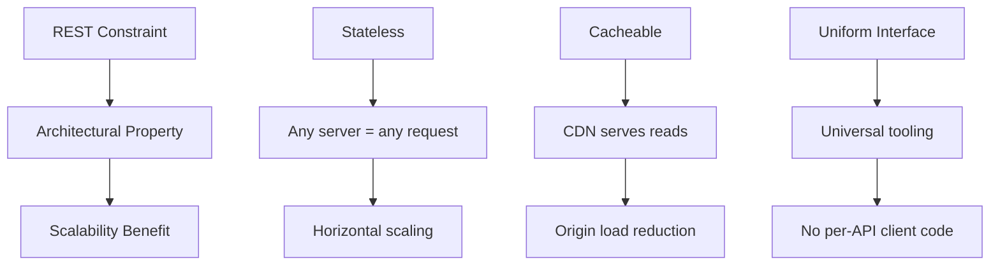

⚡ TL;DR - REST is not a protocol or format - it is six
architectural constraints that define how to use HTTP in a
way that produces scalable, loosely-coupled web services.

---

| #004 | Category: HTTP & APIs | Difficulty: ★☆☆ |
|:---|:---|:---|
| **Depends on:** | The API Problem, Client-Server Model, HTTP | |
| **Used by:** | REST Principles, API Ecosystem, RESTful Design | |
| **Related:** | gRPC, GraphQL, HATEOAS | |

---

### 🔥 The Problem This Solves

**WORLD WITHOUT IT:**
By the late 1990s, the web had hundreds of millions of
documents and thousands of servers - all built using HTTP,
but built inconsistently. Some systems used HTTP verbs
correctly. Others used only POST for everything. Some cached
responses. Others marked everything uncacheable. The web was
working, but nobody knew WHY it was working - or why some
parts scaled beautifully while others collapsed under load.

**THE BREAKING POINT:**
As teams designed APIs on top of HTTP, they made inconsistent
choices. API A used `POST /getUser`. API B used `GET /user/get`.
API C used a custom action header. None of these agreed on
when responses could be cached, whether clients could safely
retry requests, or what URLs meant. The universal protocol
was being used in wildly incompatible ways - losing all the
benefit of universality.

**THE INVENTION MOMENT:**
This is exactly why REST was documented: Roy Fielding's 2000
dissertation identified the six constraints that explained
WHY the web scaled. REST is not a new protocol - it is the
set of rules that the original web architects implicitly
followed when they built something that scaled to billions
of users.

**EVOLUTION:**
REST was described in 2000 but already existed in practice
in HTTP/1.0 and HTTP/1.1. "RESTful APIs" became mainstream
in 2004-2010, displacing SOAP/XML-RPC for public APIs.
Richardson's Maturity Model (2008) gave teams a way to
measure how closely they followed REST's constraints.
Today most "REST APIs" violate at least some constraints -
particularly HATEOAS - but still benefit from the ones they
follow (statelessness, uniform interface).

---

### 📘 Textbook Definition

REST (Representational State Transfer) is an architectural
style for distributed hypermedia systems, described by Roy
Fielding in his 2000 dissertation. It defines six constraints:
client-server separation, statelessness, cacheability,
uniform interface (with four sub-constraints), layered system,
and optional code-on-demand. An API that follows these
constraints is called RESTful. The constraints work together
to produce scalability, visibility, simplicity, and evolvability
without requiring new protocols - by correctly leveraging the
existing properties of HTTP.

---

### ⏱️ Understand It in 30 Seconds

**One line:**
REST is a set of rules for how to use HTTP so that your
API scales, caches, and evolves cleanly.

**One analogy:**
> The web itself is a REST system. Web pages have stable
> URLs (resource identification). You use GET to read them
> (uniform interface). Browsers cache pages (cacheability).
> The server does not remember you between page loads
> (stateless). You can add CDNs and load balancers transparently
> (layered system). REST is the pattern the web already uses -
> applied deliberately to APIs.

**One insight:**
Most "REST APIs" are actually RPC-over-HTTP. They use HTTP
as a transport but ignore REST's constraints - especially
statelessness and uniform interface. The constraints you
follow determine which benefits you get. You do not have to
follow all six to build a useful API - but you should know
which ones you are skipping and what you are giving up.

---

### 🔩 First Principles Explanation

**CORE INVARIANTS - THE SIX CONSTRAINTS:**

1. **Client-Server:** UI concerns separated from data storage
   concerns. Client and server can evolve independently.

2. **Stateless:** Each request from client to server must
   contain all information needed to understand the request.
   No client session state stored on the server.

3. **Cacheable:** Responses must define whether they can be
   cached. Caching eliminates unnecessary client-server
   interactions and improves scalability.

4. **Uniform Interface:** Four sub-constraints:
   - Resource identification in requests (URLs identify resources)
   - Resource manipulation through representations (JSON/XML)
   - Self-descriptive messages (each carries metadata to describe it)
   - HATEOAS (responses include links to related actions)

5. **Layered System:** Client cannot tell whether it is
   connected directly to the origin server or an intermediary.
   Enables load balancers, CDNs, and gateways transparently.

6. **Code-on-Demand (optional):** Servers can send executable
   code to clients (JavaScript in browsers). Not required.

**DERIVED DESIGN:**
Statelessness → any server instance handles any request →
horizontal scaling is trivially correct.
Cacheability → CDNs can cache API responses → reduces origin
load by orders of magnitude.
Uniform interface → any client that understands HTTP can call
any REST API → universal tooling and discoverability.
Layered system → add load balancers, security layers, caches
between client and server → all transparent to both.

**THE TRADE-OFFS:**

**Gain:** Scalability, simplicity, discoverability, and the
ability to add infrastructure layers without changing
application code.

**Cost:** Statelessness forces clients to re-send context
on every request (auth tokens, preferences). HATEOAS
increases payload size. Strict adherence makes some
operations awkward to model as resources.

**ESSENTIAL vs ACCIDENTAL COMPLEXITY:**

**Essential:** Any distributed system must decide where state
lives, how clients find resources, and what operations are
available. These decisions are unavoidable.

**Accidental:** SOAP's XML envelope, WSDLs, and operation-
based addressing - these are complexity artifacts of trying
to hide HTTP behind a different abstraction. REST simply
uses HTTP as-is.

---

### 🧪 Thought Experiment

**SETUP:**
You have two API designs for a user service. API A uses
`POST /userService?action=getUser&id=42`. API B uses
`GET /users/42`.

**WHAT HAPPENS WITH API A (RPC-style):**
A load balancer receives the request. Can it cache it?
No - it uses POST, which is never cached by default, even
though this is a read operation. An intermediary trying to
audit calls sees only `/userService` - it cannot tell which
users are being accessed. If the client retries on network
error, is it safe? The load balancer does not know (POST
might have side effects). The client must re-read the
documentation to understand every operation.

**WHAT HAPPENS WITH API B (RESTful):**
GET is safe and idempotent by definition - the load balancer
can cache the response, retry on failure, and log the
specific resource being accessed. A CDN can serve the
response from its edge cache. Tools that understand HTTP
automatically understand this API without reading docs.

**THE INSIGHT:**
Following REST's uniform interface constraint is not about
aesthetics - it is about letting every HTTP-aware component
in the network (CDN, proxy, load balancer, monitoring tool)
understand and optimize your API traffic automatically.

---

### 🧠 Mental Model / Analogy

> REST is like a building code for houses. You can build
> a house without following it, but a house that follows
> the code is structurally predictable - any inspector,
> contractor, or buyer can reason about it without a custom
> guide. REST is the building code for APIs: follow it and
> every HTTP tool in the ecosystem understands your API
> without custom documentation.

Mapping:
- "Building code" → REST constraints
- "Inspector / contractor" → HTTP intermediaries (CDN, proxy)
- "House that follows code" → RESTful API
- "Structurally predictable" → caching, retries work correctly
- "Custom guide" → API-specific docs needed for non-REST APIs

Where this analogy breaks down: building codes are mandatory.
REST constraints are optional - you choose which to follow
and accept the consequences of each one you skip.

---

### 📶 Gradual Depth - Five Levels

**Level 1 - What it is (anyone can understand):**
REST is a set of rules for designing APIs so that they work
the same way as web pages - with URLs for resources, standard
operations (like reading, creating, deleting), and responses
that can be cached by browsers and networks.

**Level 2 - How to use it (junior developer):**
Use HTTP methods for their intended purpose: GET to read,
POST to create, PUT to replace, PATCH to update, DELETE to
remove. Use nouns in URLs (not verbs): `/orders` not
`/createOrder`. Return appropriate status codes. Each
request should carry its own authentication - do not rely
on server-side sessions.

**Level 3 - How it works (mid-level engineer):**
REST maps CRUD operations to HTTP methods. URL paths identify
resources (nouns). HTTP methods express operations (verbs).
Headers carry metadata (authentication, content preferences,
caching directives). Status codes signal operation outcomes.
Response bodies carry representations. The server maintains
no client session - every request is self-contained.

**Level 4 - Why it was designed this way (senior/staff):**
Fielding was one of the authors of HTTP/1.1. REST is the
retrospective documentation of the constraints he and his
colleagues encoded INTO HTTP - not new constraints applied
ON TOP of HTTP. When he described statelessness, he was
explaining why HTTP was designed without server-side sessions.
When he described cacheability, he was explaining the
Cache-Control header he had just co-designed. REST is the
"why" behind HTTP's "what."

**Level 5 - Mastery (distinguished engineer):**
The most violated REST constraint is HATEOAS - responses
should include hyperlinks to related actions, just like HTML
includes links to related pages. A truly RESTful API needs
no out-of-band documentation for discovery - you can explore
it by following links, just like browsing the web. No team
actually implements this for JSON APIs because clients are
not generic hypermedia browsers. Richardson's Maturity Model
labels this "Level 3" and almost no production APIs reach
it. Understanding WHY HATEOAS matters (and why it is
impractical) separates architects who know REST from
architects who just use HTTP.

---

### ⚙️ Why It Holds True (Formal Basis)

REST's constraints derive from observing what properties
of the web made it scale to billions of users, and then
formalizing those properties as architectural constraints.

```
┌──────────────────────────────────────────────────────┐
│        How REST Constraints Produce Scalability      │
├──────────────────────────────────────────────────────┤
│                                                      │
│  Constraint → Property → Scalability Benefit        │
│  ──────────────────────────────────────────────────  │
│  Stateless → Any server handles any request         │
│           → Horizontal scaling is trivial           │
│                                                      │
│  Cacheable → CDN/proxy serves repeated reads        │
│           → Origin load reduced by orders of mag    │
│                                                      │
│  Uniform Interface → HTTP tools understand API      │
│              → No custom client needed per API      │
│                                                      │
│  Layered System → Add infrastructure transparently  │
│              → Client code never changes for scale  │
└──────────────────────────────────────────────────────┘
```



Each constraint independently produces a scalability benefit.
Together, they compound: a CDN can cache responses (cacheable)
without any special knowledge of the API (uniform interface)
while sitting invisibly between client and origin (layered
system) and processing stateless requests (any server handles
any request).

---

### 🔄 System Design Implications

REST's constraints directly shape system architecture
decisions:

**Statelessness forces externalizing state:**
You cannot store user sessions in the application server's
memory. State must live in the request (JWT) or in an
external store (Redis). This constraint is the reason JWT
tokens exist and the reason Redis is in almost every
production stack.

**Cacheability forces explicit cache semantics:**
Every response must declare its cacheability (`Cache-Control`,
`ETag`, `Last-Modified`). Failing to declare cacheability
means intermediaries make wrong assumptions - either caching
mutable data (stale responses) or not caching immutable data
(wasted origin hits).

**Uniform interface forces resource modeling:**
Before writing any code, you must model your domain as
resources. What are the nouns? What operations make sense
on each noun? This design exercise often reveals domain
modeling problems that would otherwise surface as API
inconsistencies.

What changes at 100x scale: statelessness scales
horizontally by adding more server instances. At 1000x
scale, cacheability becomes the dominant factor - most
traffic should be served from edge caches without touching
the origin at all.

---

### 💻 Code Example

**Example 1 - BAD: RPC-over-HTTP (not RESTful)**

```python
# BAD: Verb-based endpoints, POST for everything,
# no resource identification in URL
# Breaks caching, makes intent opaque

@app.route("/userService", methods=["POST"])
def user_service():
    data = request.json
    action = data.get("action")

    if action == "getUser":
        return jsonify(get_user(data["id"]))
    elif action == "createUser":
        return jsonify(create_user(data))
    elif action == "deleteUser":
        delete_user(data["id"])
        return jsonify({"ok": True})
```

**Example 1 - GOOD: RESTful resource-oriented design**

```python
# GOOD: Noun-based resources, correct HTTP methods,
# proper status codes, stateless

@app.route("/users/<int:user_id>", methods=["GET"])
def get_user(user_id):
    user = db.find_user(user_id)
    if not user:
        return jsonify({"error": "not found"}), 404
    return jsonify(user.to_dict()), 200
    # GET is cacheable - CDN can serve this

@app.route("/users", methods=["POST"])
def create_user():
    data = request.json
    user = db.create_user(data)
    return jsonify(user.to_dict()), 201, {
        "Location": f"/users/{user.id}"
        # 201 = Created, Location points to new resource
    }

@app.route("/users/<int:user_id>", methods=["DELETE"])
def delete_user(user_id):
    db.delete_user(user_id)
    return "", 204  # 204 = No Content (success, no body)
```

---

**Example 2 - Statelessness in practice**

```python
# BAD: Server stores client state in memory
# All requests from one client MUST go to same server
# Breaks horizontal scaling

user_sessions = {}  # server-side session store

@app.route("/dashboard")
def dashboard():
    session_id = request.cookies.get("session_id")
    user = user_sessions.get(session_id)  # server memory
    if not user:
        return redirect("/login")
    return render_dashboard(user)


# GOOD: Client carries its own state in JWT
# Any server instance can handle any request

from flask_jwt_extended import jwt_required, get_jwt_identity

@app.route("/dashboard")
@jwt_required()
def dashboard():
    # JWT validated from request header - no server state
    user_id = get_jwt_identity()
    user = db.get_user(user_id)  # fetch from DB, not memory
    return render_dashboard(user)
```

---

### ⚖️ Comparison Table

| Style | HTTP Method | State | Caching | Best For |
|:---|:---|:---|:---|:---|
| **REST** | Semantic (GET/POST/PUT/DELETE) | Stateless | Yes (explicit) | Public APIs, CRUD, resources |
| RPC-over-HTTP | POST mostly | Stateless | Limited | Legacy integrations |
| GraphQL | POST (query), GET (query) | Stateless | Complex | Flexible client queries |
| gRPC | POST (all) | Stateless | No built-in | High-performance internal |
| SOAP | POST (all) | Varies | No | Enterprise legacy systems |

How to choose: use REST for new public APIs, resource-oriented
CRUD operations, and when HTTP infrastructure (CDNs, caches)
must be leveraged. Use gRPC when you control both sides and
need high-throughput binary serialization. Use GraphQL when
clients need flexible, self-defined query shapes.

---

### ⚠️ Common Misconceptions

| Misconception | Reality |
|:---|:---|
| REST requires JSON | REST is format-agnostic - the same constraints apply to XML, JSON, HTML, or any representation format |
| REST is a protocol | REST is an architectural style - a set of constraints, not a specification or protocol |
| Any HTTP API is RESTful | Using HTTP does not make an API RESTful. POST /getUser violates the uniform interface constraint |
| Stateless means no persistence | Stateless means no client session STATE on the server - persisting data in a database is completely separate |
| REST APIs require HATEOAS | HATEOAS is part of REST's uniform interface constraint, but virtually no production JSON APIs implement it - Richardson Level 2 (URLs + verbs) is the practical standard |

---

### 🚨 Failure Modes & Diagnosis

**Mutating GET Requests (Constraint Violation)**

**Symptom:** Data deleted or corrupted when CDN or proxy
caches and serves a cached response that was supposed to
be idempotent. Or bot traffic floods an endpoint causing
unexpected data changes.

**Root Cause:** A GET endpoint has side effects (deletes a
record, charges a card, increments a counter). CDNs cache
GET responses and serve them without hitting the origin -
bypassing the intended side effect.

**Diagnostic Command / Tool:**

```bash
# Check if a GET endpoint has side effects
curl -s -o /dev/null -w "%{http_code}" \
  "https://api.example.com/users/1/delete"
# Should be 405 Method Not Allowed for DELETE via GET
# If returns 200 and deletes: REST violation
```

**Fix:**

```python
# BAD: GET with side effect
@app.route("/users/<id>/delete")
def delete_user_bad(id):
    db.delete(id)
    return "deleted", 200

# GOOD: DELETE method, proper status
@app.route("/users/<id>", methods=["DELETE"])
def delete_user(id):
    db.delete(id)
    return "", 204
```

**Prevention:** Use GET only for safe, idempotent read
operations. Use POST/PUT/PATCH/DELETE for operations with
side effects. Enforce in API review process.

---

**Non-Stateless Session Coupling**

**Symptom:** After scaling to 3 app server instances, 1/3
of requests fail with "session not found" or users are
randomly logged out. Only works with sticky session routing.

**Root Cause:** Session state stored in application server
memory. When a load balancer routes a request to a different
instance, the session data is not there.

**Diagnostic Command / Tool:**

```bash
# Check if sticky sessions are required
# Hit the API multiple times, check which server responds
for i in {1..10}; do
  curl -s https://api.example.com/session-info \
    -H "Cookie: session_id=test123" \
    | grep server_id
done
# If server_id changes and session breaks: state leak
```

**Fix:**
Move session state out of application memory into an external
store (Redis, Memcached). Each request fetches its own state
from the shared store, making any server instance identical.

**Prevention:** Enforce stateless constraint from day one.
Any server-side session state must live in an external store.

---

**Over-Using POST for All Operations**

**Symptom:** API responses cannot be cached. CDN has 0%
cache hit rate. Every read operation hits the origin.
Load spikes cause cascading failures despite the data
being read-only.

**Root Cause:** All endpoints use POST regardless of whether
the operation is a read or write. POST is never cached by
HTTP intermediaries.

**Diagnostic Command / Tool:**

```bash
# Check cache-ability of responses
curl -sI -X POST \
  -H "Content-Type: application/json" \
  -d '{"action":"getUser","id":1}' \
  https://api.example.com/userService \
  | grep -i "cache-control"
# If "Cache-Control: no-store" or no Cache-Control: POST is
# the wrong method for this read operation
```

**Fix:** Convert read operations from `POST /resource/get` to
`GET /resources/{id}`. This immediately makes them cacheable
by CDNs, proxies, and HTTP clients.

**Prevention:** REST constraint review during API design.
GET for reads, POST for creates, PUT for replaces,
PATCH for updates, DELETE for removes.

---

### 🔗 Related Keywords

**Prerequisites (understand these first):**
- `HTTP Protocol` - REST is built on HTTP semantics -
  you must understand the protocol before the style
- `Client-Server Model` - REST's first constraint

**Builds On This (learn these next):**
- `REST Principles (Roy Fielding)` - the complete six
  constraints with formal analysis
- `RESTful API Design Patterns` - practical application
  of REST constraints
- `REST Resource Design and HATEOAS` - the deepest REST
  constraint and why it is rarely implemented

**Alternatives / Comparisons:**
- `gRPC` - procedure-oriented, binary serialized, does not
  follow REST constraints
- `GraphQL` - query-language style, partially RESTful (uses
  HTTP), but violates uniform interface with single endpoint

---

### 📌 Quick Reference Card

```
┌──────────────────────────────────────────────────────────┐
│ WHAT IT IS   │ Six constraints that explain how to use   │
│              │ HTTP to build scalable, loosely-coupled   │
│              │ web services                              │
├──────────────┼───────────────────────────────────────────┤
│ PROBLEM IT   │ Inconsistent use of HTTP loses all the    │
│ SOLVES       │ caching, scaling, and tooling benefits    │
├──────────────┼───────────────────────────────────────────┤
│ KEY INSIGHT  │ REST is retrospective - it names what     │
│              │ the web already did to scale to billions  │
├──────────────┼───────────────────────────────────────────┤
│ USE WHEN     │ Public or external APIs, resource-based   │
│              │ CRUD, when HTTP infrastructure matters    │
├──────────────┼───────────────────────────────────────────┤
│ AVOID WHEN   │ Action-heavy APIs (workflows, RPC calls)  │
│              │ where resources are not the natural model │
├──────────────┼───────────────────────────────────────────┤
│ ANTI-PATTERN │ POST for all operations - loses caching,  │
│              │ idempotency, and semantic clarity         │
├──────────────┼───────────────────────────────────────────┤
│ TRADE-OFF    │ Scalability and cacheability vs awkward   │
│              │ modeling of non-CRUD operations           │
├──────────────┼───────────────────────────────────────────┤
│ ONE-LINER    │ "REST is the recipe. HTTP is the kitchen. │
│              │ Most APIs are still cooking."             │
├──────────────┼───────────────────────────────────────────┤
│ NEXT EXPLORE │ REST Principles → RESTful Design →        │
│              │ HATEOAS                                   │
└──────────────────────────────────────────────────────────┘
```

**If you remember only 3 things:**
1. REST is not a protocol - it is six constraints on how
   to use HTTP. The constraints you follow determine the
   benefits you get: statelessness → horizontal scaling,
   cacheability → CDN leverage.
2. Most "REST APIs" are actually HTTP APIs that follow
   some constraints but not all. That is fine - just know
   which you are skipping and why.
3. The uniform interface constraint (use HTTP methods for
   their intended meaning) is the most impactful in
   practice - it makes every CDN, proxy, and monitoring
   tool automatically understand your API.

**Interview one-liner:**
"REST is an architectural style defined by six constraints:
client-server, stateless, cacheable, uniform interface,
layered system, and optional code-on-demand. These constraints
work together to produce scalability by making any server
handle any request, enabling CDN caching, and allowing
invisible infrastructure layers. Most 'REST APIs' follow
the first four constraints but skip HATEOAS."

---

### 💎 Transferable Wisdom

**Reusable Engineering Principle:**
The constraints you place on a system determine its properties.
REST demonstrates that you can get scalability, simplicity,
and universality as emergent properties by restricting
yourself to a small set of invariants. Every scalable system
architecture can be analyzed this way: which constraints
produce which properties?

**Where else this pattern appears:**
- Functional programming - constraining functions to have no
  side effects (pure functions) makes programs easier to
  reason about, test, and parallelize - the same trade-off
  as REST's statelessness
- Event sourcing - constraining state mutation to be event-
  only produces auditability, time-travel, and replay
  properties as emergent benefits
- Unix philosophy - constraining programs to do one thing
  and communicate via text streams produces composability
  as an emergent property

**Industry applications:**
- CDN providers (Cloudflare, Fastly) - their entire business
  model depends on REST's cacheability constraint - they
  can only serve content at the edge if HTTP semantics
  tell them when and how to cache
- API management platforms (Kong, Apigee) - built on the
  layered system constraint - they sit invisibly between
  client and origin without requiring changes to either

---

### 💡 The Surprising Truth

Roy Fielding wrote his REST dissertation while simultaneously
being the co-author of HTTP/1.1 (RFC 2616). He was not
describing how he wished HTTP had been designed - he was
documenting the design decisions he had already made and
the reasoning behind them. REST is the design specification
that the HTTP spec committee never published. The "discovery"
of REST by the API community in 2005-2010 was actually
a rediscovery of principles that were already embedded
in HTTP for a decade - they had been invisible because
no one had written them down as architectural constraints.

---

### ✅ Mastery Checklist

**You've mastered this when you can:**
1. **EXPLAIN** Describe to a developer why `POST /getUser`
   is not RESTful and what specific scalability benefit they
   lose by using it instead of `GET /users/{id}`.
2. **DEBUG** Given an API with 100% cache miss rate on a CDN
   despite serving read-heavy traffic, identify which REST
   constraint violation is the likely cause.
3. **DECIDE** Given an API that needs to trigger a complex
   business action (e.g. "process order refund"), explain
   the tradeoffs between modeling this as a resource
   (`POST /refunds`) vs a custom action endpoint
   (`POST /orders/{id}/refund`).
4. **BUILD** Design the REST endpoints for a blog service
   with posts and comments: define URLs, HTTP methods,
   status codes, and identify which operations are
   idempotent vs which are not.
5. **EXTEND** Explain why the REST statelessness constraint
   has the same architectural consequence as shared-nothing
   architecture in database sharding - and what they both
   trade for the ability to scale horizontally.

---

### 🧠 Think About This Before We Continue

**Q1.** A user wants to "star" a repository on GitHub.
This is a state change (user's star count goes from N to N+1).
GitHub models this as `PUT /user/starred/{owner}/{repo}`.
Is this RESTful? What resource is being modified? What HTTP
method is semantically correct? How would you know if the
request was idempotent before reading the docs?

*Hint: Think about what resource the URL identifies, what
PUT means in REST semantics, and how idempotency of PUT
differs from idempotency of POST.*

**Q2.** Your API serves 1 million GET requests per second
for product catalog data. By adding `Cache-Control: max-age=60`
to responses, your origin load drops by 95%. But you now
have a new failure mode: when a product goes out of stock,
you cannot instantly update all 1 million cached copies.
How do you balance REST's cacheability constraint with
the need for near-realtime consistency?

*Hint: Think about cache invalidation mechanisms, surrogate
keys, and the trade-off between stale-while-revalidate,
short TTLs, and push-based invalidation.*

**Q3.** Build this: design a REST API for an email system
with these operations - send email, get email by ID, list
emails in inbox, mark email as read, delete email, search
emails. For each operation: specify the HTTP method, URL,
and whether it is safe (no side effects) and idempotent.
Then identify which operations are hardest to model as
resources and why.

*Hint: Think about what the "resource" is for each operation,
whether the operation changes server state, and how idempotency
maps to HTTP methods.*

---

### 🎯 Interview Deep-Dive

**Q1: What is REST? Is your current API truly RESTful?**

*Why they ask:* Classic opener to separate candidates who
memorized "REST = HTTP + JSON" from those who understand
the constraints - and can self-critically evaluate their
own work.

*Strong answer includes:*
- REST = six constraints: client-server, stateless,
  cacheable, uniform interface, layered, code-on-demand
- Most APIs follow Level 2 of Richardson Maturity Model
  (resources + HTTP verbs) but not HATEOAS (Level 3)
- Candid self-assessment: "Our API is RESTful for CRUD
  operations but uses POST for complex actions like
  `POST /orders/{id}/process` which is RPC-style"
- Pragmatic position: "We follow the constraints that
  give us real benefits and skip HATEOAS because our
  clients are not generic hypermedia browsers"

**Q2: How does REST's statelessness constraint enable
horizontal scaling, and what is the cost?**

*Why they ask:* Tests whether the candidate connects
architectural constraints to concrete engineering decisions
and production trade-offs.

*Strong answer includes:*
- Statelessness: no client session state on the server,
  so any server instance can handle any request
- This means a load balancer can route any request to any
  instance - no sticky sessions required
- Cost: every request must carry its own auth credentials
  and context (JWT tokens, session tokens in cookies,
  repeated headers) - bandwidth overhead per request
- The trade-off: stateless makes scaling trivially horizontal
  at the cost of per-request overhead that is usually
  negligible for most web APIs

**Q3: What is the Richardson Maturity Model and where does
your API sit on it?**

*Why they ask:* Tests depth of REST knowledge and ability
to self-assess - a senior candidate should know this model
and be able to honestly position their work on it.

*Strong answer includes:*
- Level 0: Single URI, all POSTs (SOAP, XML-RPC)
- Level 1: Multiple URIs per resource, still POST everything
- Level 2: Resources + HTTP verbs (the practical standard
  most "REST APIs" achieve)
- Level 3: HATEOAS - responses include hypermedia links to
  next possible actions (almost never implemented in practice)
- Honest positioning: "Our API is Level 2 - we use proper
  verbs and resources but clients need out-of-band docs
  to discover endpoints, which is the HATEOAS gap"
