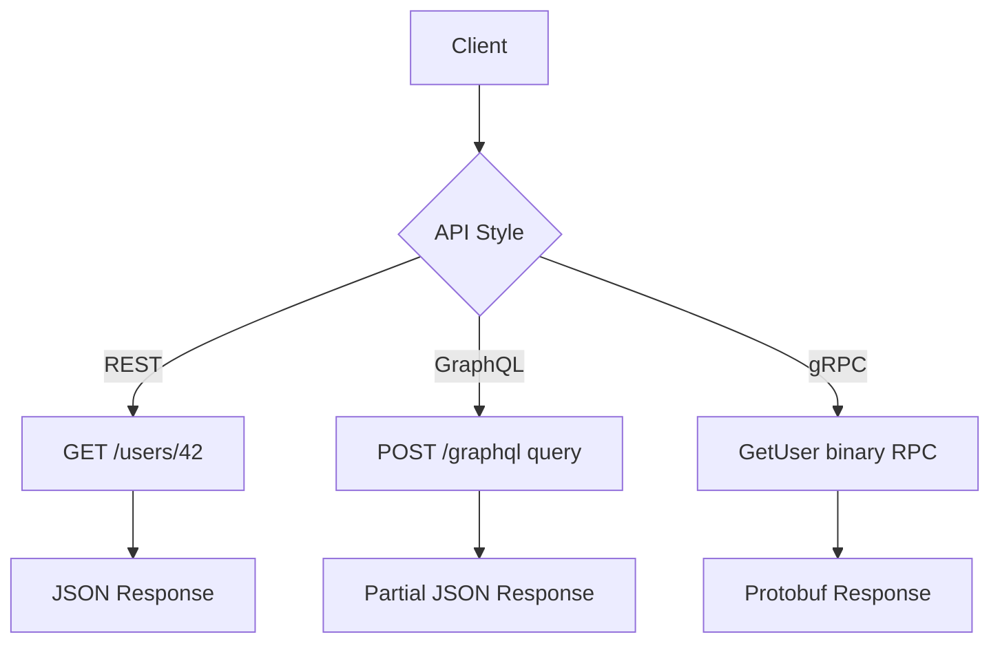
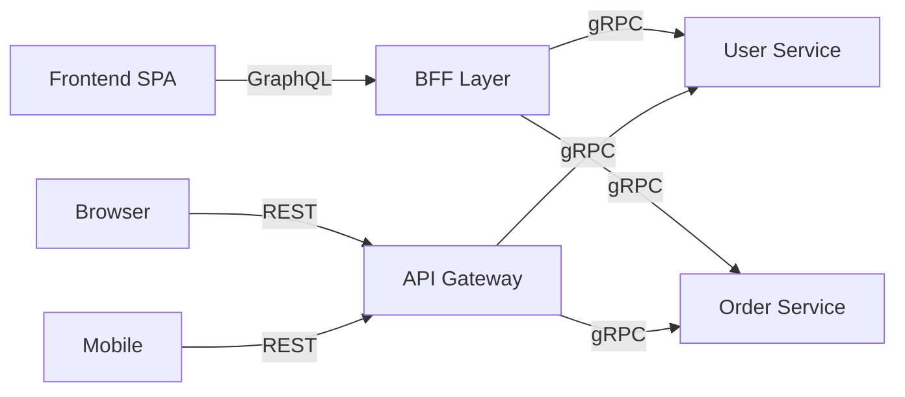

⚡ TL;DR - REST, GraphQL, and gRPC are three different
answers to the same question: how should two systems exchange
data? Each is optimal for a different set of trade-offs.

---

| #005 | Category: HTTP & APIs | Difficulty: ★☆☆ |
|:---|:---|:---|
| **Depends on:** | The API Problem, HTTP, REST | |
| **Used by:** | gRPC, GraphQL, API Decision Framework | |
| **Related:** | RESTful Design, API Versioning, API-First | |

---

### 🔥 The Problem This Solves

**WORLD WITHOUT IT:**
REST APIs solved the SOAP era's complexity, but by 2012 new
problems had emerged. Mobile apps needed to fetch data for
complex screens in one round-trip - REST required multiple
calls. Internal microservices needed typed, low-latency
communication - JSON over HTTP was too slow and too loose.
Data teams needed flexible queries without building a new
endpoint for every client use case. REST was the universal
standard, but it was a poor fit for these new patterns.

**THE BREAKING POINT:**
Facebook engineers in 2012 were building the Facebook iOS
app. A single screen (News Feed) required data from dozens
of REST endpoints - posts, users, likes, comments, ads,
stories. Each had different data shapes. Mobile networks
were slow. Battery was precious. Fetching 30 REST endpoints
to render one screen was not acceptable. Meanwhile, Google
was running hundreds of internal services communicating in
high-throughput, low-latency loops where JSON parsing
overhead was measurable.

**THE INVENTION MOMENT:**
REST served as the default. GraphQL was invented to solve
the "one screen, many data sources, one round-trip" problem.
gRPC was invented to solve the "internal microservice
communication with typed contracts and high throughput"
problem. Neither replaced REST - each filled a gap REST left.

**EVOLUTION:**
REST (2000): universal web API style. gRPC (2015): Google
open-sourced their internal RPC framework. GraphQL (2015):
Facebook open-sourced their query language. By 2020 the
industry had consolidated: REST for public/external APIs,
gRPC for internal service communication, GraphQL for flexible
client-driven data fetching. In 2023+, some teams are
exploring GraphQL for internal APIs and tRPC (TypeScript
RPC) as a typed REST alternative.

---

### 📘 Textbook Definition

The API ecosystem refers to the suite of dominant API styles
used in modern distributed systems. REST (Representational
State Transfer) is an architectural style using HTTP semantics
for resource-oriented interactions. GraphQL is a query
language and runtime that lets clients specify exact data
requirements, served via a single endpoint. gRPC is a
high-performance, contract-first RPC framework using Protocol
Buffers for serialization and HTTP/2 for transport. Each style
optimizes for different constraints: REST for universality,
GraphQL for client flexibility, gRPC for performance.

---

### ⏱️ Understand It in 30 Seconds

**One line:**
REST is a menu (you order what's listed), GraphQL is a
custom order form (you specify exactly what you want),
gRPC is a direct kitchen line (binary, fast, pre-agreed).

**One analogy:**
> Imagine three ways to get information from a city records
> office. REST: you fill out a standard form per record type
> (birth certificate form, tax form) - structured, universal,
> anyone can do it. GraphQL: you write a single custom
> request listing exactly which fields you need from which
> records - efficient but requires knowing the query language.
> gRPC: you have a private terminal connected directly to the
> records system with typed API calls - fast and precise but
> only city employees can use it.

**One insight:**
The best API style is determined by who the client is and
what the most expensive problem is. External, unknown clients
who need discovery: REST. Known clients with complex data
needs: GraphQL. Internal services with performance contracts:
gRPC. Most large systems use all three in different parts
of the architecture.

---

### 🔩 First Principles Explanation

**CORE INVARIANTS OF EACH STYLE:**

**REST:**
- Resources identified by URL
- Operations expressed as HTTP methods
- Stateless requests, each self-contained
- Leverages HTTP infrastructure (caching, proxies)

**GraphQL:**
- Single endpoint (`/graphql`)
- Queries declare exact data shape client needs
- Schema defines all available types and relationships
- Runtime resolves each field independently

**gRPC:**
- Methods defined in .proto schema (Protobuf IDL)
- Binary serialization (Protobuf)
- HTTP/2 transport with bidirectional streaming
- Strongly typed, code-generated client/server stubs

**DERIVED DESIGN:**
Each style's strength is a direct consequence of its core
invariant. REST's URL-based resources make every HTTP tool
understand the API automatically. GraphQL's single endpoint
with schema-defined types lets clients fetch exactly what
they need with one request. gRPC's binary encoding and HTTP/2
multiplexing achieve throughput and latency that text-based
protocols cannot match.

**THE TRADE-OFFS:**

**REST:** Universal tooling, human-readable, cacheable.
Cost: over-fetching (response contains fields client
does not need), under-fetching (multiple round-trips to
assemble related data), no built-in typing.

**GraphQL:** Precise data fetching, single round-trip for
complex screens, self-documenting schema.
Cost: complex caching, N+1 query problem, single POST
endpoint breaks CDN caching, requires GraphQL-aware clients.

**gRPC:** High throughput, low latency, typed contracts,
streaming support.
Cost: binary format (not human-readable), requires HTTP/2,
not browser-native without gRPC-Web proxy, steeper setup.

**ESSENTIAL vs ACCIDENTAL COMPLEXITY:**

**Essential:** Different use cases have legitimately different
optimal communication patterns. This spectrum of trade-offs
is not accidental - it reflects real constraints in different
parts of distributed systems.

**Accidental:** Much API style debate is cargo-culting without
analyzing the actual trade-offs for the specific use case.
The accidental complexity is the tooling fragmentation -
teams must maintain three sets of client libraries, three
documentation systems, three testing setups.

---

### 🧪 Thought Experiment

**SETUP:**
You are building a social feed app. Each feed item needs:
user name, user avatar, post text, post timestamp,
comment count, like count. Data lives in 4 services:
User Service, Post Service, Comment Service, Like Service.

**WHAT HAPPENS WITH REST:**
Client calls `/posts?page=1` → 20 posts with post_id, user_id.
Client calls `/users/{id}` 20 times → 20 user names, avatars.
Client calls `/comments/count?post_ids=...` once → counts.
Client calls `/likes/count?post_ids=...` once → counts.
4 rounds of requests minimum, 41 HTTP calls total.
On mobile, each adds 50-100ms. Rendering waits for all.

**WHAT HAPPENS WITH GRAPHQL:**
Client sends ONE GraphQL query declaring exactly what it
needs - posts, nested user fields, comment count, like count.
GraphQL server executes all 4 service calls IN PARALLEL.
Returns one response with exactly the requested fields.
One HTTP round-trip. No over-fetching. No under-fetching.

**THE INSIGHT:**
REST's one-resource-per-endpoint model creates the N+1
fetching problem for screens that need data from multiple
resources. GraphQL's query model was specifically invented
to solve this pattern without building a custom endpoint
for every screen.

---

### 🧠 Mental Model / Analogy

> Think of three ways to get a report from a research
> library. REST: they have standard report forms - fill in
> Form A for demographics, Form B for financials. Universal,
> anyone can request. GraphQL: you write a custom research
> brief - "I need the population, GDP, and literacy rate
> from countries A, B, C in one response." Precise, but
> you need to know how to write briefs. gRPC: you are a
> staff researcher with direct database access and typed
> query procedures - fast, typed, but only for staff.

Mapping:
- "Standard report forms" → REST endpoints
- "Custom research brief" → GraphQL query
- "Database access + typed procedures" → gRPC service stubs
- "Universal public access" → REST for external APIs
- "Staff researcher" → internal microservice using gRPC

Where this analogy breaks down: all three operate over the
internet - the "direct access" of gRPC is still over HTTP/2,
not a local database connection.

---

### 📶 Gradual Depth - Five Levels

**Level 1 - What it is (anyone can understand):**
REST, GraphQL, and gRPC are three different ways for
programs to communicate. REST is the standard everyone
knows. GraphQL lets you request exactly the data you need.
gRPC is the fastest option for machine-to-machine internal
communication.

**Level 2 - How to use it (junior developer):**
Use REST when you do not control the client or need public
API discoverability. Use GraphQL when building a frontend
that assembles data from multiple entities and you want
to avoid multiple API calls. Use gRPC when building internal
microservices that need high-throughput or streaming.

**Level 3 - How it works (mid-level engineer):**
REST uses HTTP verbs + URL paths to identify resources and
operations. GraphQL uses a POST to `/graphql` with a query
string declaring data shape. gRPC uses .proto files to define
services and message types, generates client/server code,
and communicates over HTTP/2 with Protocol Buffer encoding.
Each layer differs: serialization format, transport model,
schema definition, and error model.

**Level 4 - Why it was designed this way (senior/staff):**
Facebook built GraphQL to solve the N+1 round-trip problem
on mobile - the iOS app needed dozens of REST calls per
screen. Google built gRPC to replace their internal Stubby
framework with an open protocol - Protobuf's 10x size
reduction over JSON matters at Google's traffic volumes.
REST remains dominant for public APIs because browser native
support and CDN infrastructure are worth more than
performance gains of binary protocols for most use cases.

**Level 5 - Mastery (distinguished engineer):**
The real decision is not "which is best" but "which
minimizes pain for this specific context." Large
organizations often run all three: REST for public API
(developer experience + caching), gRPC for internal service
mesh (performance + type safety), GraphQL for BFF layer
(reducing round-trips for frontend teams). The staff engineer
maps use case to style rather than advocating for a
universal winner. The emerging patterns are: GraphQL
federation for composing microservice data graphs, gRPC
transcoding (gRPC that also speaks REST/JSON), and Connect
RPC (gRPC semantics with browser-compatible HTTP/1.1).

---

### ⚙️ How It Works (Mechanism)

```
┌──────────────────────────────────────────────────────┐
│           Three API Styles - Wire Comparison         │
├──────────────────────────────────────────────────────┤
│  REST                                                │
│  ─────                                               │
│  GET /users/42                                       │
│  Host: api.example.com                               │
│  → {"id":42,"name":"Alice","email":"a@ex.com"}      │
│                                                      │
│  GraphQL                                             │
│  ────────                                            │
│  POST /graphql                                       │
│  {"query":"{ user(id:42) { name orders { id } } }"}  │
│  → {"data":{"user":{"name":"Alice",                  │
│     "orders":[{"id":1},{"id":2}]}}}                  │
│                                                      │
│  gRPC (Protobuf over HTTP/2)                         │
│  ───────────────────────────                         │
│  Binary frame: service=UserSvc method=GetUser        │
│  Payload: {user_id: 42} (Protobuf encoded)           │
│  → Binary: {id: 42, name: "Alice"} (Protobuf)        │
└──────────────────────────────────────────────────────┘
```



**REST mechanism:**
URL encodes resource identity. HTTP method encodes operation.
JSON/XML body encodes data. Status code encodes outcome.
Stateless: each request complete. Cacheable: GET responses
cached by infrastructure.

**GraphQL mechanism:**
Schema defines all types and relationships via SDL (Schema
Definition Language). Client sends query specifying exact
fields. Server executes resolvers for each field in parallel.
Single response contains only requested fields. N+1 problem
requires DataLoader for batching resolver calls.

**gRPC mechanism:**
.proto files define services (methods) and messages (types).
Protobuf compiles them to language-specific stubs. Client
calls stub methods as regular function calls. Stubs serialize
arguments to binary Protobuf, send over HTTP/2, deserialize
response. Streaming: client streaming, server streaming,
or bidirectional streaming supported natively.

---

### 🔄 The Complete Picture - End-to-End Flow

```
┌──────────────────────────────────────────────────────┐
│      Modern API Architecture - All Three Styles      │
├──────────────────────────────────────────────────────┤
│                                                      │
│  External Clients          Internal Services         │
│  ────────────────          ─────────────────         │
│  Browser → REST/JSON       Service A ──gRPC──→       │
│  Mobile  → REST/JSON          Service B             │
│  Partner → REST/JSON          Service B ──gRPC──→   │
│                                  Service C          │
│  Frontend App → GraphQL                             │
│     (BFF layer)            Data Pipeline            │
│                            Kafka topics (async)     │
│                                                     │
│  ← YOU ARE HERE: choosing which style per boundary  │
│                                                     │
│  FAILURE PATH:                                      │
│  gRPC unavailable → 503 from service mesh          │
│  GraphQL N+1 → resolver timeout → partial response │
│  REST over-fetching → slow mobile screens          │
└──────────────────────────────────────────────────────┘
```



**WHAT CHANGES AT SCALE:**
At low scale, all three styles are interchangeable. At 10,000
req/s, gRPC's binary encoding and HTTP/2 multiplexing show
measurable throughput advantages over REST for internal
calls. At 100,000 req/s, GraphQL's lack of native HTTP
caching forces complex cache layers (persisted queries, CDN
with query-based caching). At 1M req/s, gRPC's smaller
message size reduces bandwidth costs significantly for
internal service mesh traffic.

---

### ⚖️ Comparison Table

| Criterion | REST | GraphQL | gRPC |
|:---|:---|:---|:---|
| **Schema/Contract** | OpenAPI (optional) | SDL (built-in) | .proto (required) |
| **Serialization** | JSON (text) | JSON (text) | Protobuf (binary) |
| **Transport** | HTTP/1.1 or HTTP/2 | HTTP/1.1 or HTTP/2 | HTTP/2 only |
| **Caching** | Native HTTP caching | Complex, non-standard | No built-in caching |
| **Browser support** | Native | Native | Needs gRPC-Web proxy |
| **Over/under fetching** | Common problem | Solved by design | Less relevant (typed) |
| **Streaming** | Limited (SSE, WS) | Subscriptions | Native bidirectional |
| **Learning curve** | Low | Medium | High |
| **Best use case** | Public/external APIs | Frontend data fetching | Internal microservices |

**Decision Tree:**
- Client is a web browser without proxy? → REST or GraphQL
- Need to cache responses at CDN? → REST (GET endpoints)
- Frontend needs data from 3+ backend services in one call? → GraphQL
- Internal service-to-service, both sides controlled? → gRPC
- Need streaming (server push, bidirectional)? → gRPC or WebSocket
- Building a public developer API? → REST (ubiquitous tooling)

---

### ⚠️ Common Misconceptions

| Misconception | Reality |
|:---|:---|
| gRPC is always faster than REST | gRPC is faster for high-throughput internal calls; for infrequent external calls, setup overhead and lack of caching can make REST faster end-to-end |
| GraphQL replaces REST | GraphQL solves the fetching problem, not the resource modeling problem; most orgs use GraphQL for frontend BFF and REST for public APIs |
| REST is outdated | REST is the correct choice for public APIs requiring universal client support, CDN caching, and discovoverability |
| gRPC requires both sides to be in the same language | gRPC has stubs for 10+ languages; the contract is the .proto file, not the language |
| GraphQL queries are always POST | GraphQL GET queries (for reads) are valid and cacheable; most client libraries use POST by default but GET can be enabled |

---

### 🚨 Failure Modes & Diagnosis

**GraphQL N+1 Problem - Resolver Explosion**

**Symptom:** GraphQL queries that should return in 50ms
take 5 seconds. Database shows thousands of tiny queries
per request. Memory spikes during query resolution.

**Root Cause:** A list query resolves a nested field by
calling a separate database query per item. 100 posts with
1 user field each = 101 database queries (1 for posts +
100 for users). This is the N+1 problem.

**Diagnostic Command / Tool:**

```bash
# Enable slow query log in your GraphQL server
# Apollo Server: set maxComplexity tracing

# Or log database queries during a request
DEBUG=knex:query node server.js

# Count queries per request
SELECT count(*), avg(duration_ms)
FROM query_log
WHERE request_id = 'req_abc123'
GROUP BY request_id;
```

**Fix:**

```javascript
// BAD: N+1 - one query per user in list
const resolvers = {
  Post: {
    author: (post) =>
      // Called for every post - N queries!
      db.users.findById(post.author_id)
  }
};

// GOOD: DataLoader batches all user IDs
const userLoader = new DataLoader(async (ids) => {
  // Called once with all IDs collected
  const users = await db.users.findByIds(ids);
  return ids.map(id => users.find(u => u.id === id));
});

const resolvers = {
  Post: {
    // DataLoader batches and deduplicates automatically
    author: (post) => userLoader.load(post.author_id)
  }
};
```

**Prevention:** Always use DataLoader for nested resolvers
that fetch by ID. Set query complexity limits to fail
fast before N+1 queries execute.

---

**gRPC Service Unavailable - No Retry Logic**

**Symptom:** Cascading failures when one internal service
has a transient outage. Requests fail immediately instead
of retrying. Error rate spikes then recovers, but callers
have already surfaced errors to users.

**Root Cause:** gRPC clients without retry configuration
fail immediately on any error. Transient errors (connection
reset, temporary overload) that would succeed on retry
instead propagate to callers.

**Diagnostic Command / Tool:**

```bash
# Check gRPC error codes in logs
grep "status_code" /var/log/service/grpc.log | \
  grep -E "UNAVAILABLE|DEADLINE_EXCEEDED" | \
  awk '{print $NF}' | sort | uniq -c

# Trace a specific failed call
grpc_cli call api.example.com:50051 \
  UserService.GetUser "user_id: 42"
```

**Fix:**

```go
// GOOD: gRPC client with retry policy
serviceConfig := `{
  "methodConfig": [{
    "name": [{"service": "UserService"}],
    "retryPolicy": {
      "maxAttempts": 3,
      "initialBackoff": "0.1s",
      "maxBackoff": "1s",
      "backoffMultiplier": 2,
      "retryableStatusCodes": ["UNAVAILABLE"]
    }
  }]
}`

conn, _ := grpc.Dial(
  "api.example.com:50051",
  grpc.WithDefaultServiceConfig(serviceConfig),
)
```

**Prevention:** Configure retry policies in gRPC service
config for all transient error codes. Add circuit breaker
for sustained failures to prevent retry storms.

---

**REST Over-Fetching on Mobile**

**Symptom:** Mobile app performance is poor despite fast
backend. Profiling shows 60% of API response bytes are
never read by the client. Battery drain is high on cellular.

**Root Cause:** REST endpoints return full resource
representations. A mobile screen that needs 3 fields
receives a 50-field response. Wasted bandwidth, parsing
overhead, and battery for bytes never used.

**Diagnostic Command / Tool:**

```bash
# Measure response size vs used fields
curl -s https://api.example.com/users/42 | \
  wc -c  # total bytes

# Compare with what the client actually uses
# (requires client-side instrumentation)
```

**Fix options:**
1. Add sparse fieldsets: `GET /users/42?fields=id,name,avatar`
2. Move to GraphQL BFF for the mobile client
3. Create a mobile-specific endpoint: `GET /mobile/feed`

**Prevention:** Design with client bandwidth in mind.
Either use sparse fieldsets (API-045) or adopt a BFF
(API-041) pattern for clients with specific data shape needs.

---

### 🔗 Related Keywords

**Prerequisites (understand these first):**
- `HTTP Protocol` - the shared transport layer beneath all three
- `What REST Actually Means` - the foundational style all others
  are measured against
- `Client-Server Model` - the architectural foundation

**Builds On This (learn these next):**
- `gRPC and Protocol Buffers` - deep dive into the binary
  RPC framework
- `GraphQL Query Language` - full GraphQL schema and query model
- `GraphQL vs REST vs gRPC Decision Framework` - advanced
  decision framework for choosing between them

**Alternatives / Comparisons:**
- `WebSocket` - bidirectional streaming alternative to all three
- `Event-Driven APIs` - asynchronous alternative when request-
  response is the wrong model entirely

---

### 📌 Quick Reference Card

```
┌──────────────────────────────────────────────────────────┐
│ WHAT IT IS   │ Three dominant API styles: REST for       │
│              │ universal, GraphQL for flexible, gRPC for │
│              │ performant service communication          │
├──────────────┼───────────────────────────────────────────┤
│ PROBLEM IT   │ No single API style is optimal for all    │
│ SOLVES       │ use cases - public, internal, and mobile  │
├──────────────┼───────────────────────────────────────────┤
│ KEY INSIGHT  │ The client determines the API style: if   │
│              │ you do not control the client, use REST   │
├──────────────┼───────────────────────────────────────────┤
│ USE WHEN     │ REST=public API, gRPC=internal services,  │
│              │ GraphQL=frontend data aggregation         │
├──────────────┼───────────────────────────────────────────┤
│ AVOID WHEN   │ gRPC for browser clients, GraphQL when    │
│              │ HTTP caching is essential                 │
├──────────────┼───────────────────────────────────────────┤
│ ANTI-PATTERN │ Using one style for everything - public   │
│              │ APIs, internal services, and mobile need  │
│              │ different trade-offs                      │
├──────────────┼───────────────────────────────────────────┤
│ TRADE-OFF    │ REST: universal but verbose; gRPC: fast   │
│              │ but complex; GraphQL: flexible but no CDN │
├──────────────┼───────────────────────────────────────────┤
│ ONE-LINER    │ "Pick the API style that makes the hard   │
│              │ problem easy for your specific client."   │
├──────────────┼───────────────────────────────────────────┤
│ NEXT EXPLORE │ gRPC and Protobuf → GraphQL Query →       │
│              │ API Decision Framework                    │
└──────────────────────────────────────────────────────────┘
```

**If you remember only 3 things:**
1. REST is for public/external APIs: universal tooling,
   HTTP caching, human-readable. Use it when you do not
   control the client.
2. gRPC is for internal microservices: binary encoding,
   typed contracts, streaming. Use it when both sides are
   under your control and throughput matters.
3. GraphQL is for frontend data aggregation: prevents
   over/under-fetching, one round-trip for complex screens.
   Use it for BFF layers between frontends and backend services.

**Interview one-liner:**
"REST, GraphQL, and gRPC each solve a different problem:
REST provides universal external API access with HTTP
infrastructure leverage; gRPC provides high-throughput
internal service communication with typed contracts; GraphQL
lets frontends fetch exactly what they need in one request.
Modern architectures use all three in different layers."

---

### 💎 Transferable Wisdom

**Reusable Engineering Principle:**
Optimal tools differ by context. The best solution for a
known, controlled environment (gRPC for internal services)
is not the best solution for an unknown, uncontrolled
environment (REST for public APIs). Engineering maturity
is recognizing that "which is best?" is always context-
dependent - the question is always "best for whom, under
what constraints?"

**Where else this pattern appears:**
- Database engines: OLAP vs OLTP vs document stores -
  each optimized for a different access pattern; the mistake
  is forcing one to serve all three patterns
- Communication protocols: TCP vs UDP vs QUIC - each
  trades different properties for different use cases;
  no single protocol is universally optimal
- Cache strategies: write-through vs write-behind vs
  read-through - optimal strategy depends on read/write
  ratio and consistency requirements

**Industry applications:**
- Netflix: REST for their public API, gRPC for hundreds
  of internal microservices, internal GraphQL federation
  for their data access layer
- GitHub: REST API v3 for developer ecosystem, GraphQL
  API v4 for their own web UI (avoiding N+1 fetching)

---

### 💡 The Surprising Truth

REST and gRPC were both designed at the same time (2015)
by two of the most sophisticated engineering organizations
in the world - and they made opposite choices: Google
chose binary encoding and strict contracts (gRPC), while
the REST ecosystem doubled down on JSON and flexible
schemas. Both were right for their context. Google runs
internal systems with controlled client/server pairs and
massive throughput requirements. The REST ecosystem runs
public APIs with unknown clients and developer experience
requirements. The choice of binary vs text is not a
correctness question - it is a context question.

---

### ✅ Mastery Checklist

**You've mastered this when you can:**
1. **EXPLAIN** Describe to a non-technical engineering
   manager why the company uses three different API styles
   (REST, gRPC, GraphQL) in different parts of the system
   - and why that is the correct architecture, not "picking
   one winner."
2. **DEBUG** Given a GraphQL query that times out after 5
   seconds but the underlying data fits in 10MB, diagnose
   whether the issue is N+1 resolver calls, missing
   DataLoader, or schema complexity limits.
3. **DECIDE** Given a new internal service that will be
   called 10,000 times per second by 20 other internal
   services, with a known Go/Java client, decide between
   REST and gRPC with explicit reasoning about the trade-offs.
4. **BUILD** Write a minimal .proto definition for a User
   service with GetUser and ListUsers methods, then
   identify what you gain (typed contract, binary encoding)
   vs what you sacrifice (non-human-readable, HTTP/2 only).
5. **EXTEND** Explain how the REST vs gRPC decision mirrors
   the scripting language vs compiled language decision -
   what property in each comparison is traded for what other
   property, and when each wins.

---

### 🧠 Think About This Before We Continue

**Q1.** Your company has a public API (REST) and 50 internal
microservices (gRPC). You want to add a new capability that
internal services expose to external clients. How do you
bridge gRPC and REST? What are the trade-offs of each
bridging approach (Transcoding, API Gateway translation,
maintaining two interface layers)?

*Hint: Consider gRPC-HTTP transcoding (protoc-gen-grpc-
gateway), API gateway REST-to-gRPC translation, and the
maintenance cost of dual interfaces.*

**Q2.** At 100x your current load, which part of your
GraphQL API breaks first - and why? The schema introspection
endpoint, the resolver chain for deeply nested queries,
the DataLoader batching, or the single POST endpoint
preventing CDN caching? How would you fix each?

*Hint: Think about what each component does under increased
load, and what the fix for each requires (persisted queries,
query complexity limits, DataLoader tuning, etc.).*

**Q3.** Build this: using any language, implement a minimal
gRPC server that exposes a `SayHello(name) → greeting`
method using the simplest possible .proto definition. Then
implement the same service as a REST endpoint. List the
files required for each approach, and explain which has
more setup cost and which has less ongoing maintenance cost.

*Hint: Compare the number of files (proto file + generated
stubs vs single endpoint), and think about what changes
when you modify the schema in each case.*

---

### 🎯 Interview Deep-Dive

**Q1: When would you choose gRPC over REST for an API?
What are the specific trade-offs?**

*Why they ask:* Tests whether the candidate can articulate
concrete trade-offs vs generic "gRPC is faster" - shows
engineering judgment over memorized talking points.

*Strong answer includes:*
- gRPC when: both client and server are controlled, high
  throughput or low latency matters, streaming is needed,
  type safety and code generation are valued
- REST when: external/public API, browser client without
  proxy, HTTP caching needed, developer experience is
  primary concern
- Concrete numbers: Protobuf typically 5-10x smaller than
  equivalent JSON; HTTP/2 multiplexing eliminates connection
  overhead; these matter at Google scale, less so for
  typical enterprise workloads
- gRPC cost: binary format requires tools to debug, HTTP/2
  only, no browser support without gRPC-Web, steeper
  learning curve

**Q2: What is the GraphQL N+1 problem, and how does
DataLoader solve it?**

*Why they ask:* GraphQL N+1 is the most common performance
pitfall in GraphQL adoption - tests production experience.

*Strong answer includes:*
- N+1: a list query returning N items, each triggering
  1 additional query for a nested field = N+1 queries total
- Example: 100 posts each fetching their author = 101
  database queries instead of 2 (one for posts, one for
  all users)
- DataLoader solution: accumulates IDs during the current
  event loop tick, then fires one batched query for all
  IDs at the tick boundary
- Additional benefit: DataLoader deduplicates - same ID
  requested multiple times results in one query
- Implementation: DataLoader is per-request, not shared
  across requests - must be created in request context

**Q3: How does the choice between REST and GraphQL affect
your CDN strategy?**

*Why they ask:* Tests systems-level thinking about API
design consequences beyond the API itself - caching
infrastructure.

*Strong answer includes:*
- REST GET endpoints are naturally cacheable by CDNs -
  URL + headers determine cache key
- GraphQL uses POST by default - POST is never cached
  by CDNs without custom configuration
- GraphQL GET queries are cacheable but require clients
  to use GET (most don't by default) and queries to be
  URL-encoded
- Persisted queries: client sends query hash (`?queryId=abc`)
  instead of full query body - enables CDN caching with
  known query shapes
- Practical implication: REST APIs can get 90%+ CDN cache
  hit rates for reads; naive GraphQL APIs hit origin for
  every request
