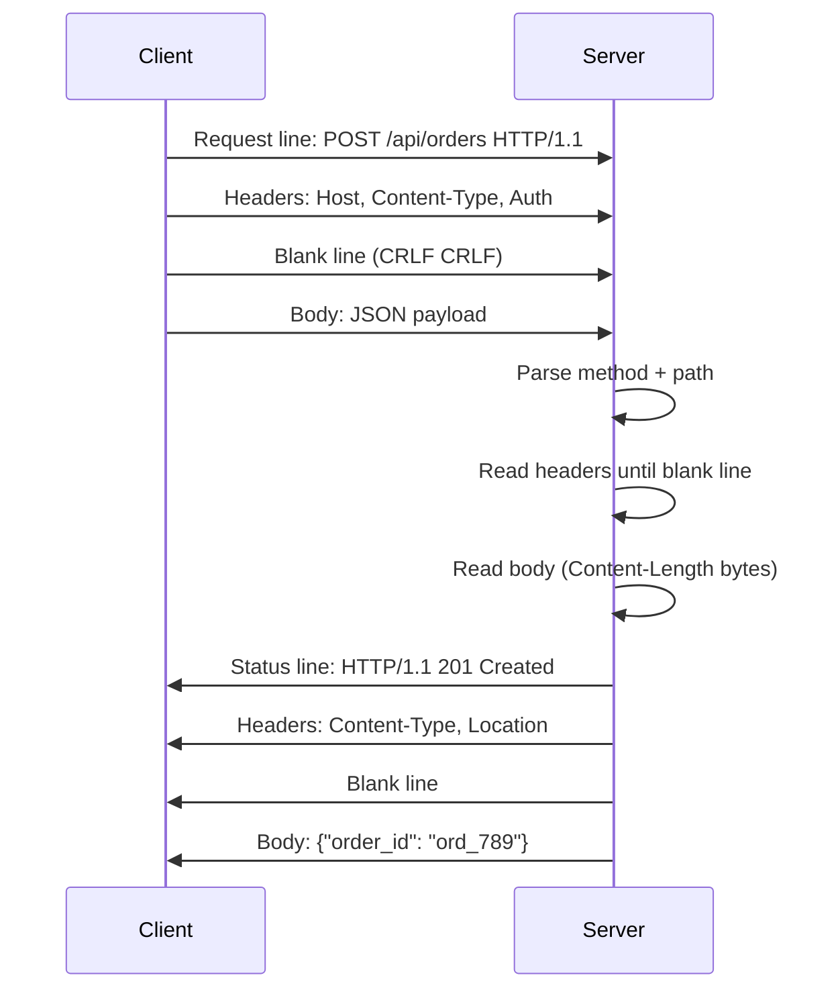
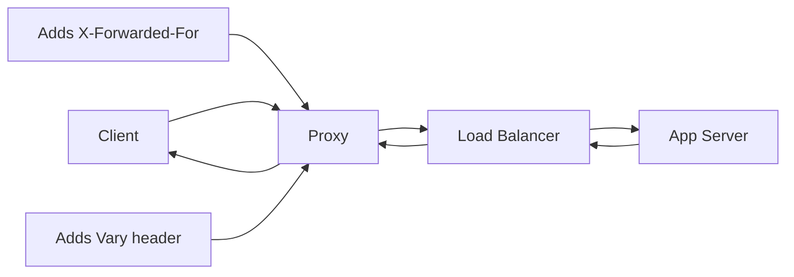

⚡ TL;DR - Every HTTP interaction is two messages: a request
(method + URL + headers + optional body) and a response
(status code + headers + optional body) - understanding their
exact structure is the foundation of all API work.

---

| #006 | Category: HTTP & APIs | Difficulty: ★☆☆ |
|:---|:---|:---|
| **Depends on:** | HTTP Protocol, Client-Server Model | |
| **Used by:** | HTTP Methods, Status Codes, Headers, Content Types | |
| **Related:** | URL/URI Structure, Query Parameters, JSON Format | |

---

### 🔥 The Problem This Solves

**WORLD WITHOUT IT:**
Without a standardized message structure, every server would
need custom parsers for every client. A web browser could not
talk to a web server without knowing the server's proprietary
format. Intermediaries (proxies, load balancers, CDNs) could
not process messages without knowing the application behind
them. Adding a header to one request would require changing
the protocol definition.

**THE BREAKING POINT:**
Early network protocols were rigid binary formats - adding
a field required a protocol version change and coordinating
all implementations simultaneously. SOAP's XML was extensible
but verbose. FTP's command syntax was human-readable but
not extensible for new operations. No format balanced
human-readability, extensibility, and parsability.

**THE INVENTION MOMENT:**
HTTP's message structure was designed to be self-describing.
The line-based text format with named headers meant that any
proxy could read, modify, or cache any message without
understanding the application. Unknown headers are silently
ignored - this single design decision made HTTP infinitely
extensible without breaking existing implementations.

**EVOLUTION:**
HTTP/1.0 introduced headers and response codes. HTTP/1.1
made `Host` header required (enabling virtual hosting) and
added `Transfer-Encoding: chunked`. HTTP/2 replaced text
with binary frames but preserved the same logical structure
(method, path, headers, body) as pseudo-headers. HTTP/3
preserved the same structure again over QUIC. The message
format's logical structure has been stable for 30 years.

---

### 📘 Textbook Definition

An HTTP request message consists of: a request line (HTTP
method, request target URL/path, and HTTP version), request
headers (key-value pairs providing metadata), a blank line
(CRLF) separating headers from body, and an optional message
body. An HTTP response message consists of: a status line
(HTTP version, numeric status code, and reason phrase),
response headers, a blank line, and an optional response
body. In HTTP/2 and HTTP/3, the text request-line and
status-line are replaced by binary pseudo-headers (`:method`,
`:path`, `:status`) but the logical structure is preserved.

---

### ⏱️ Understand It in 30 Seconds

**One line:**
An HTTP request is "what do you want and how?"; a response
is "here is what happened and here is the data."

**One analogy:**
> An HTTP request is like a business letter. It has a
> header block (to/from address = Host header, plus
> other metadata headers), a blank line separating the
> header from the body, and the message body. The response
> is the reply letter: it starts with the outcome (status
> code on the status line), has its own headers, then
> the response body. Both follow a rigid format so any
> postal worker (proxy) can process them.

**One insight:**
The blank line between headers and body is not cosmetic -
it is the protocol delimiter. HTTP parsers read headers
until they see a blank line (CRLF CRLF), then treat
everything after as the body. Understanding this explains
why malformed headers (missing blank line) cause parse
failures, why `Content-Length` must be accurate, and why
chunked transfer encoding works the way it does.

---

### 🔩 First Principles Explanation

**CORE INVARIANTS:**
1. Line-oriented parsing: headers are one per line, blank
   line terminates headers.
2. Self-describing: each header has a name identifying its
   purpose - receivers can skip unknown headers.
3. Method-path-version triplet: the request line uniquely
   identifies the operation, resource, and protocol version.
4. Status code semantics: the three-digit numeric code
   encodes the outcome class - intermediaries act on the
   class (2xx = cache, 3xx = follow redirect) without
   reading the body.

**DERIVED DESIGN:**
The line-based format with named headers makes HTTP parsers
simple - read until CRLF, split on `:`, done. The extensible
header mechanism means new capabilities (authentication,
caching, compression, content negotiation) can be added
by defining new header names without changing the protocol.
The blank line delimiter makes streaming possible - the server
can start sending headers before the body is ready.

**THE TRADE-OFFS:**

**Gain:** Human-readable, extensible, debuggable with basic
tools (`curl -v`, `telnet`), parseable without a schema.

**Cost:** Verbose - repeated headers on every request
(addressed by HTTP/2 HPACK compression). Text parsing is
slower than binary parsing (addressed by HTTP/2 binary
framing).

**ESSENTIAL vs ACCIDENTAL COMPLEXITY:**

**Essential:** Any message format must distinguish metadata
(headers) from payload (body) and identify the operation
and outcome. These structural elements are unavoidable.

**Accidental:** The specific CRLF line endings, text-based
encoding, and reason phrase in the status line are HTTP/1.1
artifacts. HTTP/2 retained the logical structure but moved
to binary encoding, dropping text format entirely.

---

### 🧪 Thought Experiment

**SETUP:**
You want to add rate limit information to your API responses
so clients know how many requests they have remaining.
The current HTTP spec does not define this.

**WHAT HAPPENS WITHOUT EXTENSIBLE HEADERS:**
You would need to define a new protocol version. All clients
must be updated to understand the new version. Intermediaries
that do not understand the new version may strip or corrupt
the response. Rollout requires coordinating all parties.

**WHAT HAPPENS WITH HTTP HEADERS:**
You add two new response headers:
`X-RateLimit-Remaining: 47` and `X-RateLimit-Reset: 1609459200`.
Existing clients that do not read these headers ignore them
safely. New clients that understand them read the remaining
count. Proxies pass them through without modification.
No protocol version change needed. No coordination required.

**THE INSIGHT:**
HTTP's extensible header model allows the protocol to evolve
organically. The invariant that unknown headers are ignored
means every extension is backwards-compatible by default.
This is why HTTP has been used for 30 years without a
breaking protocol change - the extension mechanism is
baked into the fundamental structure.

---

### 🧠 Mental Model / Analogy

> Think of HTTP messages as FedEx shipments. The shipping
> label (request/status line) identifies what kind of
> shipment it is and where it's going. The labels/stickers
> on the box (headers) carry metadata: "Fragile", "Contents:
> Electronics", "Weight: 5kg". The blank space between the
> label area and the box contents separates metadata from
> payload. Everything inside the box (body) is the actual
> data. FedEx workers (proxies) can read and act on the
> labels without opening the box.

Mapping:
- "Shipping label" → request line / status line
- "Labels and stickers" → HTTP headers
- "Blank separator" → CRLF blank line
- "Box contents" → HTTP body
- "FedEx worker" → proxy/CDN/load balancer
- "Contents: Electronics" → `Content-Type` header

Where this analogy breaks down: FedEx labels are attached
to the outside and cannot change. HTTP headers are transmitted
over the wire and any intermediary can add, modify, or remove
headers in transit (proxy headers, X-Forwarded-For, etc.).

---

### 📶 Gradual Depth - Five Levels

**Level 1 - What it is (anyone can understand):**
An HTTP request is a text message your browser sends to a
server saying "give me this page." The server sends back a
text response saying "here it is" or "it doesn't exist."
Both messages follow a standard format: some info at the top
(headers), then the actual content (body).

**Level 2 - How to use it (junior developer):**
When using HTTP libraries, you set the method (GET, POST),
URL, headers (Authorization, Content-Type), and optionally
a body. You receive a response with a status code (200, 404,
500), headers (Content-Type, Cache-Control), and optionally
a body. Always check status code before reading the body.

**Level 3 - How it works (mid-level engineer):**
HTTP/1.1 requests are text: `METHOD path HTTP/1.1\r\n` followed
by `header-name: value\r\n` lines, then `\r\n` (blank line),
then optional body. The `Content-Length` header tells the
receiver how many bytes the body contains. Without it, the
connection must be closed to signal body end (HTTP/1.0).
`Transfer-Encoding: chunked` allows streaming without knowing
the body size upfront.

**Level 4 - Why it was designed this way (senior/staff):**
The blank line (CRLF CRLF) delimiter between headers and body
is the protocol's critical invariant. HTTP parsers are
state machines: read lines until blank line (headers done),
then read bytes for the body length from `Content-Length`,
or read chunks if `Transfer-Encoding: chunked`. This design
enables streaming responses - the server can send headers
immediately (the client knows the content type) and stream
the body progressively. Understanding this explains HTTP
request smuggling attacks, which exploit ambiguity between
`Content-Length` and `Transfer-Encoding` in dual-server
setups.

**Level 5 - Mastery (distinguished engineer):**
HTTP request smuggling (CWE-444) is a critical vulnerability
arising directly from the header structure's parsing rules.
When a front-end proxy and back-end server disagree on where
one request ends and the next begins (due to conflicting
`Content-Length` and `Transfer-Encoding: chunked` headers),
an attacker can smuggle a prefix of a second request inside
the body of the first. The back-end then interprets the
prefix as the start of the next legitimate request, potentially
stealing another user's session or bypassing security
controls. This class of attack has compromised major CDNs
and web application firewalls. The fix is always to have
the back-end server reject ambiguous requests, not to try
to reconcile conflicting length signals.

---

### ⚙️ How It Works (Mechanism)

**HTTP/1.1 Request - exact wire format:**

```
┌─────────────────────────────────────────────────────────┐
│                   HTTP/1.1 Request Wire Format          │
├─────────────────────────────────────────────────────────┤
│                                                         │
│  POST /api/orders HTTP/1.1\r\n          ← Request line  │
│  Host: api.example.com\r\n             ← Required hdr  │
│  Content-Type: application/json\r\n    ← Body format   │
│  Content-Length: 52\r\n               ← Body size      │
│  Authorization: Bearer eyJ...\r\n     ← Auth           │
│  \r\n                                 ← Blank line     │
│  {"customer_id":"c1","total_cents":4999}  ← Body       │
│                                                         │
│  Parse rules:                                           │
│  - Read lines until \r\n\r\n (blank line)               │
│  - Body bytes = Content-Length value                    │
│  - Or: read chunks if Transfer-Encoding: chunked        │
└─────────────────────────────────────────────────────────┘
```

**HTTP/1.1 Response - exact wire format:**

```
┌─────────────────────────────────────────────────────────┐
│                  HTTP/1.1 Response Wire Format          │
├─────────────────────────────────────────────────────────┤
│                                                         │
│  HTTP/1.1 201 Created\r\n              ← Status line    │
│  Content-Type: application/json\r\n   ← Body format    │
│  Content-Length: 42\r\n               ← Body size      │
│  Location: /api/orders/ord_789\r\n    ← New resource   │
│  X-Request-Id: req_abc123\r\n         ← Custom header  │
│  \r\n                                 ← Blank line     │
│  {"order_id":"ord_789","status":"pending"}  ← Body     │
│                                                         │
└─────────────────────────────────────────────────────────┘
```



**Chunked transfer encoding (when body size is unknown upfront):**

```
HTTP/1.1 200 OK
Transfer-Encoding: chunked
Content-Type: text/plain

1a\r\n             ← chunk size in hex (26 bytes)
this is the first chunk\r\n
10\r\n             ← next chunk size (16 bytes)
and the second!\r\n
0\r\n              ← zero = end of stream
\r\n
```

---

### 🔄 The Complete Picture - End-to-End Flow

```
┌─────────────────────────────────────────────────────────┐
│         HTTP Message Lifecycle in the Network           │
├─────────────────────────────────────────────────────────┤
│                                                         │
│  [Client]  →  [Proxy]  →  [LB]  →  [App Server]        │
│  Builds        Adds         Routes    Parses request    │
│  request       X-Forwarded  to server executes logic    │
│                -For header           builds response    │
│                                                         │
│                 ← YOU ARE HERE - request/response       │
│                   structure is the shared contract      │
│                                                         │
│  [App Server] → [LB] → [Proxy] → [Client]               │
│  Sends           Passes  Adds      Reads status         │
│  response        back    Vary hdr  parses body          │
│                                                         │
│  FAILURE PATH:                                          │
│  Malformed headers → 400 Bad Request from any parser    │
│  Missing Content-Length → connection hung or closed     │
│  Mismatch CL and body → partial read / parse error      │
└─────────────────────────────────────────────────────────┘
```



**WHAT CHANGES AT SCALE:**
At low scale, each HTTP message is parsed once by the server.
At high scale, HTTP headers are parsed by every intermediary
in the path - CDN, WAF, load balancer, reverse proxy, app
server. Each adds latency. HTTP/2 header compression (HPACK)
reduces header size by referencing a shared compression table -
repeated headers (Auth, Content-Type, Host) send as
single-byte references instead of full strings.

---

### 💻 Code Example

**Example 1 - BAD: Not setting Content-Type or Content-Length**

```python
# BAD: sending JSON body without Content-Type header
# Server may reject or misparse as text/plain

import socket

def raw_post_bad(host, path, body):
    s = socket.socket()
    s.connect((host, 80))
    request = (
        f"POST {path} HTTP/1.1\r\n"
        f"Host: {host}\r\n"
        f"\r\n"  # Missing Content-Type and Content-Length!
        f"{body}"
    )
    s.sendall(request.encode())
```

**Example 1 - GOOD: Complete HTTP request structure**

```python
# GOOD: complete request with required headers

import socket

def raw_post_good(host, path, json_body):
    body = json_body.encode("utf-8")
    request = (
        f"POST {path} HTTP/1.1\r\n"
        f"Host: {host}\r\n"
        f"Content-Type: application/json\r\n"
        f"Content-Length: {len(body)}\r\n"
        f"Connection: close\r\n"
        f"\r\n"  # blank line - headers/body separator
    ).encode("utf-8") + body

    s = socket.socket()
    s.connect((host, 80))
    s.sendall(request)
    response = b""
    while True:
        chunk = s.recv(4096)
        if not chunk:
            break
        response += chunk
    s.close()
    return response.decode("utf-8")
```

---

**Example 2 - Reading HTTP response status and headers**

```python
import requests

def call_api(url, token):
    response = requests.get(
        url,
        headers={"Authorization": f"Bearer {token}"}
    )

    # Status line: version + code + reason phrase
    print(f"Status: {response.status_code}")  # e.g. 200

    # Response headers
    content_type = response.headers.get("Content-Type", "")
    content_length = response.headers.get("Content-Length")
    cache_control = response.headers.get("Cache-Control")

    print(f"Content-Type: {content_type}")
    print(f"Cache-Control: {cache_control}")

    # Only parse body if content type is JSON
    if "application/json" in content_type:
        return response.json()
    else:
        return response.text
```

---

**Example 3 - Inspecting raw HTTP messages with curl**

```bash
# See full request and response headers (-v = verbose)
curl -v \
  -H "Authorization: Bearer TOKEN" \
  -H "Accept: application/json" \
  https://api.example.com/users/1

# Output shows:
# > GET /users/1 HTTP/2          ← request line
# > host: api.example.com        ← request headers
# > authorization: Bearer TOKEN
# >                              ← blank line
# < HTTP/2 200                   ← status line
# < content-type: application/json  ← response headers
# < content-length: 85
# <                              ← blank line
# {"id":1,"name":"Alice",...}    ← response body
```

---

### ⚖️ Comparison Table

| Element | Request | Response |
|:---|:---|:---|
| First line | `METHOD path HTTP/version` | `HTTP/version STATUS reason` |
| Required headers | `Host` (HTTP/1.1) | Content-Type (if body present) |
| Body delimiter | Blank line after last header | Blank line after last header |
| Body size | `Content-Length` or `Transfer-Encoding: chunked` | Same |
| Body presence | Optional (typically not for GET) | Optional (not for 204/HEAD) |

| HTTP Version | Encoding | Notable Structure Change |
|:---|:---|:---|
| HTTP/1.0 | Text | No keep-alive, connection close per response |
| **HTTP/1.1** | Text | Keep-alive default, chunked encoding, virtual hosting |
| HTTP/2 | Binary | HPACK header compression, binary frames with stream IDs |
| HTTP/3 | Binary | QPACK compression, QUIC transport (UDP-based) |

---

### ⚠️ Common Misconceptions

| Misconception | Reality |
|:---|:---|
| GET requests cannot have a body | Technically allowed but strongly discouraged - proxies, CDNs, and many servers strip or reject GET request bodies |
| The reason phrase (e.g. "OK") is meaningful | The reason phrase is informational only - clients must use the numeric status code, not the text; it can be any string |
| HTTP headers are case-sensitive | HTTP/1.1 header names are case-insensitive (but values may be case-sensitive). HTTP/2 specifies lowercase; frameworks normalize automatically |
| Content-Length must always be present | `Transfer-Encoding: chunked` is the alternative for streaming responses where size is not known upfront |
| The blank line is just formatting | The blank line (CRLF CRLF) is the actual protocol delimiter - missing it causes parse failures and is the attack surface for HTTP request smuggling |

---

### 🚨 Failure Modes & Diagnosis

**HTTP Request Smuggling (Security)**

**Symptom:** Attacker can bypass security controls, poison
shared caches, or steal other users' request data. One user
receives another user's response. WAF rules are bypassed.

**Root Cause:** When a front-end proxy and back-end server
disagree on how to determine request boundaries (one uses
`Content-Length`, the other uses `Transfer-Encoding`), the
attacker crafts a request that appears as one request to
the proxy but as two to the back-end.

**Diagnostic Command / Tool:**

```python
# Test for CL.TE smuggling vulnerability (safe probe)
# Requires careful lab testing only - never against production
# Use Burp Suite's HTTP Request Smuggler extension
# or:
# curl https://portswigger.net/web-security/request-smuggling
# for complete testing guidance
```

**Fix:** Configure back-end server to reject requests with
both `Content-Length` and `Transfer-Encoding` headers.
Prefer HTTP/2 end-to-end (eliminates text parsing ambiguity).

**Prevention:** Never allow both `Content-Length` and
`Transfer-Encoding` in the same request. Enforce this at
the edge proxy.

---

**Malformed Headers - 400 Bad Request**

**Symptom:** Some requests get 400 with no useful error
message. Logs show "malformed header" or "invalid request
line." Only affects specific clients or endpoints.

**Root Cause:** Missing blank line after headers, header
value contains CR or LF characters, or request line has
extra spaces or is missing the HTTP version.

**Diagnostic Command / Tool:**

```bash
# Capture raw request to inspect
nc -l 8080 &  # listen on port 8080
curl http://localhost:8080/test \
  -H "X-Custom: value with newline"
# nc shows exact bytes received including \r\n
```

**Fix:**

```python
# BAD: header value contains newline (header injection)
user_input = "evil\r\nX-Injected: header"
headers = {"X-User": user_input}  # injects extra header

# GOOD: sanitize header values
import re
def safe_header(value):
    # Remove CRLF characters from header values
    return re.sub(r'[\r\n]', '', str(value))
headers = {"X-User": safe_header(user_input)}
```

**Prevention:** Never put unsanitized user input in HTTP
header values. Validate all header values for CR/LF characters.

---

**Missing Content-Length on POST - Hung Connection**

**Symptom:** POST requests hang indefinitely. Server waits
for more data that never arrives. Client times out.

**Root Cause:** Server reads body according to `Content-Length`.
If `Content-Length` is missing or wrong, the server either
reads too few bytes (partial body) or waits for more bytes
than are sent (hung connection).

**Diagnostic Command / Tool:**

```bash
# Check if Content-Length is present and correct
curl -v -X POST \
  -H "Content-Type: application/json" \
  -d '{"test": true}' \
  https://api.example.com/endpoint 2>&1 | \
  grep -E "Content-Length|> POST"
```

**Fix:**

```python
# BAD: manually building request without Content-Length
body = '{"test": true}'
headers = {"Content-Type": "application/json"}
# Missing Content-Length!

# GOOD: library sets Content-Length automatically
import requests
response = requests.post(
    "https://api.example.com/endpoint",
    json={"test": True},  # library sets Content-Type + CL
    timeout=5
)
```

**Prevention:** Always use HTTP library abstractions that
set Content-Length automatically. Avoid raw socket HTTP
construction in application code.

---

### 🔗 Related Keywords

**Prerequisites (understand these first):**
- `HTTP Protocol` - the protocol that defines this message
  structure
- `Client-Server Model` - the architectural context for
  request/response

**Builds On This (learn these next):**
- `HTTP Methods` - the semantics of each HTTP method in the
  request line
- `HTTP Status Codes` - the complete meaning of every
  status code class
- `Request Headers and Response Headers` - deep dive into
  the header section

**Alternatives / Comparisons:**
- `gRPC and Protocol Buffers` - binary alternative to HTTP/1.1
  text messages - same logical structure, very different encoding
- `WebSocket Basics` - upgrades an HTTP connection to a
  bidirectional stream after the initial HTTP handshake

---

### 📌 Quick Reference Card

```
┌──────────────────────────────────────────────────────────┐
│ WHAT IT IS   │ Two message types: request (method+URL+   │
│              │ headers+body) and response (status+       │
│              │ headers+body) - the HTTP exchange unit    │
├──────────────┼───────────────────────────────────────────┤
│ PROBLEM IT   │ Without standard message structure,       │
│ SOLVES       │ proxies and clients cannot interoperate   │
├──────────────┼───────────────────────────────────────────┤
│ KEY INSIGHT  │ The blank line (CRLF CRLF) is the actual  │
│              │ protocol delimiter - not cosmetic         │
├──────────────┼───────────────────────────────────────────┤
│ USE WHEN     │ Always - this IS the HTTP protocol format │
├──────────────┼───────────────────────────────────────────┤
│ AVOID WHEN   │ N/A - but HTTP/2 replaces text format     │
│              │ with binary frames (same logical struct)  │
├──────────────┼───────────────────────────────────────────┤
│ ANTI-PATTERN │ Putting CR/LF in header values (header    │
│              │ injection) or mismatching Content-Length  │
│              │ with actual body size                     │
├──────────────┼───────────────────────────────────────────┤
│ TRADE-OFF    │ Human-readable text vs parsing overhead   │
│              │ (solved by HTTP/2 binary framing)         │
├──────────────┼───────────────────────────────────────────┤
│ ONE-LINER    │ "Method + URL + headers + blank + body =  │
│              │ all HTTP is built on this."               │
├──────────────┼───────────────────────────────────────────┤
│ NEXT EXPLORE │ HTTP Methods → HTTP Status Codes →        │
│              │ Request and Response Headers              │
└──────────────────────────────────────────────────────────┘
```

**If you remember only 3 things:**
1. Request line structure: `METHOD path HTTP/version`.
   Response status line: `HTTP/version code reason`.
   These cannot be optional - they are the first line.
2. The blank line separating headers from body is the
   critical delimiter. Missing it causes parsing failures.
   This is also the HTTP request smuggling attack surface.
3. `Content-Length` (bytes) or `Transfer-Encoding: chunked`
   tells the receiver when the body ends. Without either,
   the receiver does not know when to stop reading.

**Interview one-liner:**
"An HTTP request is: method + path + version on line one,
named headers one per line, CRLF blank line, then optional
body. The response is: version + status code + reason on
line one, headers, blank line, optional body. This structure
has been stable from HTTP/1.0 through HTTP/3 - only the
encoding changed from text to binary in HTTP/2."

---

### 💎 Transferable Wisdom

**Reusable Engineering Principle:**
Self-describing message formats with extensible metadata
separate concerns and enable independent evolution. When
every message carries its own type information (Content-Type),
size (Content-Length), and processing hints (Cache-Control),
each component in the processing pipeline can make correct
decisions without application-specific knowledge. This
principle - metadata in the envelope, not the payload -
appears in every successful messaging system.

**Where else this pattern appears:**
- Email (RFC 2822) - exact same structure: headers separated
  from body by blank line, with extensible X-* headers for
  new metadata
- MIME multipart format - extends HTTP's header model to
  encode mixed content types within a single message
- Kafka message format - key + headers + value; headers
  carry routing metadata that consumers can use without
  parsing the value

**Industry applications:**
- Content Delivery Networks - CDN policy engines read HTTP
  response headers (Cache-Control, Vary, ETag) to make
  caching decisions without understanding the API content
- Web Application Firewalls - inspect HTTP request headers
  and body to detect attack patterns; the standardized
  structure makes WAF rules portable across all HTTP traffic

---

### 💡 The Surprising Truth

HTTP's blank-line delimiter (CRLF CRLF) - which looks like
an arbitrary formatting convention - is actually one of the
most exploited design decisions in web security history.
HTTP request smuggling, one of the most critical web
vulnerabilities of the 2010s, exploits the fact that when
a proxy and a back-end server parse the blank line in
different ways (due to `Content-Length` vs
`Transfer-Encoding` ambiguity), an attacker can craft
messages that appear as one request to one side but two
requests to the other. The 2019 discovery of this class
of attacks at scale earned its discoverer (James Kettle)
a $40,000 bounty from Google alone. The root cause was
there in the spec from day one.

---

### ✅ Mastery Checklist

**You've mastered this when you can:**
1. **EXPLAIN** Draw the exact byte sequence of a POST request
   (method, URL, headers, blank line, body) and explain why
   each element must appear in that specific order.
2. **DEBUG** Given a server log showing `400 Bad Request` on
   a POST endpoint that works from curl but fails from a
   mobile app, identify the most likely header formatting
   issue without seeing the raw request.
3. **DECIDE** For a streaming API that returns a large file
   in chunks, explain whether to use `Content-Length` or
   `Transfer-Encoding: chunked` and why.
4. **BUILD** Write a raw HTTP request as a string (not using
   any library) for `POST /api/users` with a JSON body,
   including all required headers in the correct format.
5. **EXTEND** Explain how HTTP request smuggling exploits
   the blank-line delimiter, and what invariant in the
   message structure makes it possible.

---

### 🧠 Think About This Before We Continue

**Q1.** An HTTP proxy in your network adds an
`X-Forwarded-For` header to every request it forwards.
Your server reads this header to get the client's real IP
for rate limiting. An attacker sends a request with
`X-Forwarded-For: 1.2.3.4` already set. What does your
server see, and how do you correctly read the real client IP
when there are multiple proxies in the chain?

*Hint: Think about how multiple proxies each append to
X-Forwarded-For, and which IP in the list is the one you
actually control.*

**Q2.** A client sends 1,000 API requests per second. Each
request has a 1KB response. HTTP/1.1 with keep-alive uses
one connection. HTTP/2 uses one connection with multiplexing.
What is the difference in TCP handshake overhead, and at
what request rate does the difference become significant?

*Hint: Calculate TCP + TLS handshake cost per connection
in HTTP/1.1 keep-alive vs HTTP/2 - then think about what
breaks keep-alive.*

**Q3.** Build this: using `nc` (netcat) or raw sockets in
any language, send a handcrafted HTTP/1.1 GET request to
`httpbin.org/get` and read the raw response. Print the status
line, all headers, and body separately. What did you have
to know about the message structure to parse the response?

*Hint: Read until `\r\n\r\n` for headers, then read
Content-Length bytes for the body. Handle both cases.*

---

### 🎯 Interview Deep-Dive

**Q1: What is the purpose of the blank line in an HTTP
message, and what can go wrong when it is missing or
duplicated?**

*Why they ask:* Tests deep understanding of HTTP parsing -
separates candidates who know the spec from those who
just use HTTP libraries without understanding the wire format.

*Strong answer includes:*
- The blank line (CRLF CRLF) is the protocol delimiter
  separating headers from body - not formatting
- Missing: server reads into body looking for more headers,
  causing parse failure or hanging waiting for body
- Duplicated/injected: HTTP response splitting / header
  injection attack - attacker injects fake response headers
  by embedding CRLF in a header value
- In HTTP/2: replaced by binary frame boundaries - the blank
  line attack surface is eliminated by design

**Q2: What is the difference between `Content-Length` and
`Transfer-Encoding: chunked`, and when would you use each?**

*Why they ask:* Tests understanding of HTTP streaming and
the real reason both exist - crucial for understanding
long-polling, streaming responses, and chunked upload APIs.

*Strong answer includes:*
- `Content-Length`: known upfront; receiver reads exactly N
  bytes then knows the body is complete
- `Transfer-Encoding: chunked`: unknown size upfront; body
  is sent as a sequence of sized chunks, terminated by a
  zero-length chunk
- Use chunked for: streaming responses (server-sent events,
  file downloads generated on-the-fly), WebSocket upgrade
  responses, any response where size is not known before
  the first byte is sent
- HTTP/2 eliminates this entirely: binary frames with stream
  IDs make body boundaries explicit without Content-Length
  or chunked encoding

**Q3: What is HTTP header injection and how do you prevent it?**

*Why they ask:* Tests security awareness of the HTTP message
structure - OWASP lists header injection as a critical
vulnerability class.

*Strong answer includes:*
- Header injection: user-controlled data placed in a header
  value contains CRLF characters, creating fake headers or
  splitting the HTTP response
- Example: `Location: /page\r\nSet-Cookie: session=evil`
  in a redirect causes the browser to set an attacker-
  controlled cookie
- Prevention: sanitize all header values - strip or reject
  any CR or LF characters before placing user data in headers
- Framework defense: most modern frameworks (Spring, Rails,
  Express) automatically strip CRLF from header values -
  but only for framework-generated headers; be careful with
  raw header setting
