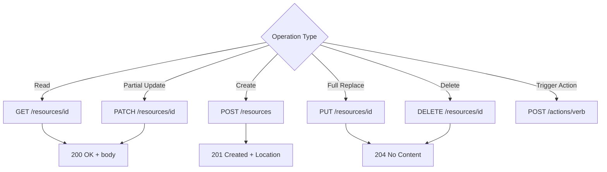
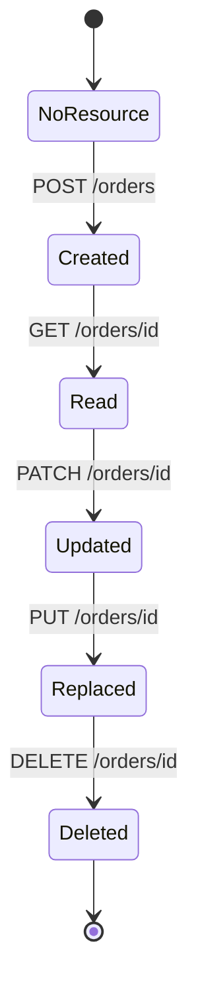

⚡ TL;DR - HTTP methods encode the intent of an operation:
GET reads, POST creates or triggers actions, PUT replaces,
PATCH partially updates, DELETE removes - and the
safety/idempotency properties of each determine how
clients, proxies, and servers must behave.

---

| #007 | Category: HTTP & APIs | Difficulty: ★☆☆ |
|:---|:---|:---|
| **Depends on:** | HTTP Request Structure, HTTP Protocol | |
| **Used by:** | RESTful API Design, Idempotency in APIs, HATEOAS | |
| **Related:** | HTTP Status Codes, URL Structure, REST Principles | |

---

### 🔥 The Problem This Solves

**WORLD WITHOUT IT:**
Before HTTP standardized method semantics, every API had to
invent its own operation vocabulary. SOAP used POST for
everything, embedding the operation name in the XML body.
This meant proxies, CDNs, and caches could not make
automatic decisions about requests - they had no signal
about whether a request was safe to retry (is this "get
user" or "charge card"?), safe to cache, or safe to execute
multiple times if a network failure occurred mid-flight.

**THE BREAKING POINT:**
When a POST request fails mid-flight due to a network error,
should the client retry? If the POST was "create an order",
retrying might create a duplicate order and double-charge
the customer. If it was "get my account balance", retrying
is harmless. Without method semantics, the client has no
general rule - it must know the business logic of every
endpoint to decide whether to retry.

**THE INVENTION MOMENT:**
HTTP's method vocabulary assigns semantic properties to
each method: safe (no side effects), idempotent (same
result if called multiple times). These properties let
clients, proxies, and caches make automatic, correct
decisions about retrying, caching, and pre-fetching -
without knowing the application semantics of each endpoint.

**EVOLUTION:**
HTTP/1.0 defined GET, POST, HEAD. HTTP/1.1 added PUT,
DELETE, CONNECT, OPTIONS, TRACE. PATCH was added in 2010
(RFC 5789) - later than the others, reflecting the need
for partial updates in REST APIs. WebDAV added COPY, MOVE,
LOCK, UNLOCK for file management. The five core methods
(GET, POST, PUT, DELETE, PATCH) cover 99%+ of REST API
design needs.

---

### 📘 Textbook Definition

HTTP methods (also called HTTP verbs) define the operation
a client requests on a resource. The primary methods are:
GET (retrieve a resource, safe and idempotent), POST (submit
data, create a resource, or trigger a non-idempotent action),
PUT (replace a resource entirely, idempotent), PATCH
(partially modify a resource, not necessarily idempotent
unless defined that way), DELETE (remove a resource,
idempotent). A method is "safe" if it does not modify
server state. A method is "idempotent" if executing it
multiple times produces the same result as executing it once.

---

### ⏱️ Understand It in 30 Seconds

**One line:**
GET reads, POST creates/acts, PUT replaces, PATCH updates,
DELETE removes - and the safety/idempotency of each method
tells clients whether they can safely retry.

**One analogy:**
> A library card system: GET is "read this book" (no side
> effects, the book still exists). POST is "place a new hold"
> (creates something - calling it twice creates two holds).
> PUT is "replace your checkout list entirely" (idempotent -
> calling it twice leaves the same result). PATCH is "add
> one book to your current checkout list" (partial update).
> DELETE is "cancel your membership" (idempotent - cancelling
> twice still results in: not a member).

**One insight:**
Safety and idempotency are not just documentation conventions
- they are semantic contracts. A safe method can be called
by browsers pre-fetching links without your permission.
An idempotent method can be automatically retried by the
network layer without asking the application. If you use
POST for a safe operation (like a search), you break every
proxy and cache in the network.

---

### 🔩 First Principles Explanation

**CORE INVARIANTS:**

| Method | Safe | Idempotent | Body in request | Body in response |
|:---|:---|:---|:---|:---|
| GET | Yes | Yes | Should not | Yes |
| HEAD | Yes | Yes | Should not | No |
| POST | No | No | Yes | Yes |
| PUT | No | Yes | Yes | Optional |
| PATCH | No | No* | Yes | Optional |
| DELETE | No | Yes | Optional | Optional |
| OPTIONS | Yes | Yes | Optional | Yes |

*PATCH is not guaranteed idempotent by spec. An RFC 5789
compliant PATCH may be designed to be idempotent (e.g.
"set field X to value Y") or not (e.g. "increment counter
by 1"). Document which applies to each PATCH endpoint.

**SAFETY (no side effects):**
Safe methods are defined to not modify server state.
Consequence: browsers may call GET/HEAD links without user
action (pre-fetching, crawlers, link preview generators).
An endpoint that deletes data when called with GET is
a design defect - it will be accidentally triggered.

**IDEMPOTENCY (repeatable without additional effect):**
Idempotent methods produce the same result whether called
once or N times. Consequence: the network layer can safely
auto-retry idempotent requests after timeouts - the client
will not cause duplicate side effects. POST is not
idempotent - retrying a POST may create multiple records
or charge a card multiple times.

**PRACTICAL DIFFERENCE - PUT vs PATCH:**

```
// PUT replaces the entire resource
PUT /users/42
Body: { "name": "Alice", "email": "alice@new.com",
        "role": "admin" }
// Result: ALL fields overwritten with what was sent

// PATCH updates only specified fields
PATCH /users/42
Body: { "email": "alice@new.com" }
// Result: only email changed; name and role unchanged
```

A common API mistake: clients using PUT must send the
entire resource representation or risk overwriting fields
they did not intend to change with nulls/defaults.

---

### 🧪 Thought Experiment

**SETUP:**
Your mobile app has a button "Follow User". When tapped, it
calls `POST /follow` with `{"user_id": 42}`. On a slow
mobile connection, the POST times out. The app shows an
error. The user taps the button again.

**WHAT HAPPENS:**
The first POST may have succeeded on the server. The timeout
was a network failure, not a server failure. The second POST
now creates a duplicate follow, or increments a follow count,
or triggers a duplicate notification to user 42. The user
sees "following" but user 42 gets two notifications.

**THE INSIGHT:**
POST is not idempotent. The safe pattern for
follow/unfollow (which is logically idempotent - following
someone you already follow is a no-op) is to use PUT or
to design the endpoint with server-side idempotency keys.
The correct REST design for "follow user 42" is:
`PUT /users/me/following/42` - idempotent by both HTTP
semantics and server logic.

---

### 🧠 Mental Model / Analogy

> Think of HTTP methods as verbs on a legal contract.
> GET is "read the contract" - no consequences, done as
> many times as needed. POST is "sign a new contract" -
> each signature creates a new binding agreement; signing
> twice creates two contracts. PUT is "replace the contract
> with this new version" - doing it twice results in the
> same current version. PATCH is "amend section 3 of the
> current contract" - the amendment is applied once.
> DELETE is "void the contract" - voiding an already
> voided contract has no additional effect.

Mapping:
- "Read the contract" → GET - safe, no side effects
- "Sign a new contract" → POST - creates something new
- "Replace with new version" → PUT - replaces entire resource
- "Amend section 3" → PATCH - partial update
- "Void the contract" → DELETE - idempotent removal

Where this analogy breaks down: HTTP methods do not have
legal enforceability - a server can implement GET to delete
data (though this is wrong). The method semantics are
a contract with the HTTP ecosystem (browsers, CDNs,
proxies), not with the programming language.

---

### 📶 Gradual Depth - Five Levels

**Level 1 - What it is (anyone can understand):**
HTTP methods tell the server what you want to do. GET means
"give me data." POST means "here is data, do something with
it." DELETE means "remove this." Like words in a conversation:
they set the intent before the details.

**Level 2 - How to use it (junior developer):**
Use GET for reading/searching. POST for creating or actions.
PUT to replace a full resource. PATCH to update specific
fields. DELETE to remove. Never use GET for operations with
side effects (writing data, triggering actions) - browsers
and crawlers will accidentally execute them.

**Level 3 - How it works (mid-level engineer):**
Methods carry safety and idempotency contracts the HTTP
ecosystem relies on. GET responses are cached by proxies.
GET requests are pre-fetched by browsers. Idempotent methods
(GET, PUT, DELETE) are auto-retried by some HTTP clients.
Non-idempotent POSTs require application-level idempotency
(idempotency keys) to prevent duplicates on retry.

**Level 4 - Why it was designed this way (senior/staff):**
The safety/idempotency model is what makes distributed HTTP
systems work without per-operation coordination. A CDN
caches GET responses without knowing the API. A load balancer
retries timed-out GET requests. A browser pre-fetches GET
links in `<link rel="prefetch">`. If all methods were POST
(as in SOAP and some RPC styles), every network decision
(cache this? retry this? pre-fetch this?) would require
application-level knowledge. HTTP methods are the machine-
readable signal that delegates these decisions to infrastructure.

**Level 5 - Mastery (distinguished engineer):**
The failure mode of ignoring method semantics is subtle and
catastrophic at scale. Google's "Web Accelerator" (2005)
pre-fetched all links on every page using GET requests.
Applications that used GET for destructive operations (like
"delete this item" via a link) had records deleted en masse
when users installed the accelerator. Googlebot crawls the
web using GET - any application that deletes or modifies
state via GET link will have that state modified by
Googlebot. This is not a security problem (Googlebot is
not authenticated) - it is an HTTP contract violation
that becomes a production incident. The HTTP spec is explicit:
any implementation MAY call safe methods without user
interaction, and implementations DO.

---

### ⚙️ How It Works (Mechanism)

```
┌──────────────────────────────────────────────────────┐
│         HTTP Method Decision Tree for API Design     │
├──────────────────────────────────────────────────────┤
│                                                      │
│  What does the operation do?                         │
│                                                      │
│  Read only → GET /resources/{id}                     │
│                                                      │
│  Create new resource → POST /resources               │
│    └─ returns 201 Created + Location header          │
│                                                      │
│  Replace entire resource → PUT /resources/{id}       │
│    └─ returns 200 OK or 204 No Content               │
│                                                      │
│  Update specific fields → PATCH /resources/{id}      │
│    └─ returns 200 OK with updated resource           │
│                                                      │
│  Delete resource → DELETE /resources/{id}            │
│    └─ returns 204 No Content                         │
│                                                      │
│  Trigger action (not a CRUD op) → POST /actions/verb │
│    └─ e.g. POST /payments/capture, POST /emails/send │
└──────────────────────────────────────────────────────┘
```



**Caching behavior:**
- GET: CDNs and proxies cache responses based on URL +
  `Vary` headers. Safe to pre-fetch.
- POST: never cached by default. Caching requires
  explicit `Cache-Control` on the response.
- PUT/PATCH/DELETE: not cached. Invalidate cached GET
  response for the same resource if needed.

---

### 🔄 The Complete Picture - End-to-End Flow

**Order API - all five methods in sequence:**

```
POST /orders              → Create order (201 Created)
GET  /orders/ord_789      → Read order (200 OK)
PATCH /orders/ord_789     → Update status (200 OK)
PUT  /orders/ord_789      → Replace entire order (200 OK)
DELETE /orders/ord_789    → Remove order (204 No Content)
```

```
┌──────────────────────────────────────────────────────┐
│        Method Safety and Idempotency Summary         │
├──────────────────────────────────────────────────────┤
│                                                      │
│  SAFE methods (no side effects):                     │
│  GET, HEAD, OPTIONS, TRACE                           │
│  → Browser may call without user action              │
│  → CDN may cache response                            │
│  → Crawler will index                                │
│                                                      │
│  IDEMPOTENT methods (repeat = same result):          │
│  GET, HEAD, OPTIONS, PUT, DELETE                     │
│  → Network layer may auto-retry after timeout        │
│  → Calling twice = same state as calling once        │
│                                                      │
│  POST: NOT safe, NOT idempotent                      │
│  PATCH: NOT safe, NOT guaranteed idempotent          │
│  → Require application-level idempotency keys        │
│     for safe retries                                 │
│                                                      │
└──────────────────────────────────────────────────────┘
```



---

### 💻 Code Example

**Example 1 - BAD: Using GET for mutations**

```python
# BAD: GET for delete - browsers/crawlers may call this!
@app.route("/users/<id>/delete", methods=["GET"])
def delete_user(id):
    db.users.delete(id)  # WRONG: triggered by Googlebot
    return "Deleted"

# BAD: POST for everything (SOAP-style)
@app.route("/api", methods=["POST"])
def api(request):
    action = request.json["action"]
    if action == "getUser":
        ...  # breaks HTTP caching
    elif action == "createUser":
        ...
```

**Example 1 - GOOD: Correct method for each operation**

```python
# GOOD: REST-correct method usage

from flask import Flask, request, jsonify

app = Flask(__name__)

# READ - safe, idempotent, cacheable
@app.route("/users/<int:user_id>", methods=["GET"])
def get_user(user_id):
    user = db.users.find_by_id(user_id)
    if not user:
        return jsonify({"error": "not found"}), 404
    return jsonify(user.to_dict()), 200

# CREATE - not idempotent, returns 201 + Location
@app.route("/users", methods=["POST"])
def create_user():
    data = request.get_json()
    user = db.users.create(data)
    return jsonify(user.to_dict()), 201, {
        "Location": f"/users/{user.id}"
    }

# FULL REPLACE - idempotent
@app.route("/users/<int:user_id>", methods=["PUT"])
def replace_user(user_id):
    data = request.get_json()
    # Replace ALL fields (not partial update)
    user = db.users.replace(user_id, data)
    return jsonify(user.to_dict()), 200

# PARTIAL UPDATE
@app.route("/users/<int:user_id>", methods=["PATCH"])
def update_user(user_id):
    data = request.get_json()
    # Only update provided fields
    user = db.users.update(user_id, data)
    return jsonify(user.to_dict()), 200

# DELETE - idempotent
@app.route("/users/<int:user_id>", methods=["DELETE"])
def delete_user(user_id):
    db.users.delete(user_id)
    # 204: success with no body
    return "", 204
```

---

**Example 2 - Idempotency key for POST retry safety**

```python
# POST is not idempotent by default.
# Pattern: client sends unique Idempotency-Key header.
# Server stores result keyed by the idempotency key.
# On retry, server returns cached result (no duplicate).

import hashlib

@app.route("/payments", methods=["POST"])
def create_payment():
    idempotency_key = request.headers.get(
        "Idempotency-Key"
    )
    if not idempotency_key:
        return jsonify({"error": "Idempotency-Key required"}),
               400

    # Check if we already processed this key
    cached = cache.get(f"idem:{idempotency_key}")
    if cached:
        return jsonify(cached), 200  # return cached result

    # Process the payment
    result = payments.create(request.get_json())

    # Cache the result with the idempotency key
    cache.set(
        f"idem:{idempotency_key}",
        result,
        ttl=3600  # 1 hour - safe retry window
    )
    return jsonify(result), 201
```

---

**Example 3 - PUT vs PATCH - the full-replace trap**

```python
# SCENARIO: user has {name: "Alice", role: "admin"}
# Client only wants to update email.

# BAD: using PUT but sending only the changed field
# This overwrites name and role with None/default!
response = requests.put(
    "/users/42",
    json={"email": "alice@new.com"}
    # Missing: name, role → they get null/default
)

# GOOD: use PATCH for partial updates
response = requests.patch(
    "/users/42",
    json={"email": "alice@new.com"}
    # Server merges: only email changes
)

# GOOD: if using PUT, fetch first then send complete object
user = requests.get("/users/42").json()
user["email"] = "alice@new.com"
response = requests.put("/users/42", json=user)
```

---

### ⚖️ Comparison Table

| Method | Safe | Idempotent | Cached | Typical Status Codes | Retry Safe? |
|:---|:---|:---|:---|:---|:---|
| GET | Yes | Yes | Yes | 200, 304, 404 | Yes (auto) |
| HEAD | Yes | Yes | Yes | 200, 404 | Yes (auto) |
| POST | No | No | No | 201, 200, 202, 409 | No (need idem key) |
| PUT | No | Yes | No | 200, 204 | Yes |
| PATCH | No | No* | No | 200, 204 | No (need idem key) |
| DELETE | No | Yes | No | 204, 404 | Yes |
| OPTIONS | Yes | Yes | No | 200 | Yes |

*Unless the server explicitly documents PATCH as idempotent
for a specific endpoint.

---

### ⚠️ Common Misconceptions

| Misconception | Reality |
|:---|:---|
| POST is for everything | POST breaks caching and retry safety; use the correct method to get HTTP infrastructure benefits |
| PUT and PATCH are the same | PUT replaces the entire resource; PATCH applies a partial update - using PUT with partial data silently nulls unspecified fields |
| DELETE is immediate | DELETE may be soft-delete; the 204 status tells the client the operation succeeded, not whether the data was physically removed |
| PATCH is always idempotent | PATCH idempotency is per-endpoint; "set field to value" PATCH is idempotent, "increment counter" PATCH is not |
| GET cannot modify state | HTTP spec says GET SHOULD be safe; nothing prevents a server from using GET to modify state - but doing so breaks proxies, caches, and crawlers |

---

### 🚨 Failure Modes & Diagnosis

**PUT overwrites unintended fields**

**Symptom:** Users' data is silently lost. After an update
operation, some fields revert to null or default values.
Bug reports say "my settings keep getting deleted."

**Root Cause:** Client code uses PUT with a partial object
(only the fields it knows about). Server receives PUT and
replaces the full resource with the client's partial view.
Fields the client did not send become null.

**Diagnostic Command / Tool:**

```bash
# Before-and-after diff to diagnose the wipe
curl -s https://api.example.com/users/42 > before.json
# Trigger the problematic update
curl -s https://api.example.com/users/42 > after.json
diff before.json after.json
# Fields that disappear = the silent wipe
```

**Fix:**

```python
# BAD: PUT with partial object (silently wipes other fields)
requests.put("/users/42", json={"email": "new@email.com"})

# GOOD option 1: read-modify-write with PUT
user = requests.get("/users/42").json()
user["email"] = "new@email.com"
requests.put("/users/42", json=user)

# GOOD option 2: change to PATCH for partial updates
requests.patch("/users/42", json={"email": "new@email.com"})
```

**Prevention:** Document PUT as requiring the full resource
representation. Validate on the server that all required
fields are present in PUT requests.

---

**Double charge from POST retry**

**Symptom:** Customer support reports duplicate orders,
duplicate charges, or duplicate emails. Occurs during
high latency periods or mobile network failures.

**Root Cause:** Client retries a POST request after a
timeout. The first POST succeeded on the server but the
response was lost in transit. Server has no way to know
it already processed this request - creates a duplicate.

**Diagnostic Command / Tool:**

```bash
# Find duplicate orders by checking idempotency key
SELECT idempotency_key, COUNT(*) as cnt
FROM orders
GROUP BY idempotency_key
HAVING cnt > 1;

# Check for requests with same body in time window
SELECT created_at, customer_id, amount_cents
FROM orders
WHERE created_at > NOW() - INTERVAL '1 hour'
ORDER BY customer_id, created_at;
```

**Fix:** Add idempotency key support (see code example 2
above). Require clients to send a unique UUID in
`Idempotency-Key` header with every POST.

**Prevention:** Never retry POST requests without idempotency
keys. Use PUT for idempotent resource creation
(`PUT /resources/{client-generated-uuid}`).

---

**Method Not Allowed (405) - Wrong method used**

**Symptom:** 405 Method Not Allowed response on an endpoint
that exists. Common after migrating from POST-everything
RPC style to REST.

**Root Cause:** Client or documentation shows wrong HTTP
method for the endpoint.

**Diagnostic Command / Tool:**

```bash
# OPTIONS request returns allowed methods
curl -X OPTIONS \
  -v https://api.example.com/users/42 2>&1 | \
  grep "Allow:"
# Response: Allow: GET, PUT, PATCH, DELETE
```

**Fix:** Correct the method in the client to match what
the server declares via OPTIONS response `Allow` header,
or add API documentation that shows the allowed methods
per endpoint.

---

### 🔗 Related Keywords

**Prerequisites (understand these first):**
- `HTTP Request and Response Structure` - the message format
  that carries these methods
- `HTTP Protocol` - the protocol context for methods

**Builds On This (learn these next):**
- `HTTP Status Codes` - how server communicates outcome of
  each method call
- `RESTful API Design Patterns` - how methods map to
  resource operations at scale
- `Idempotency in APIs` - deep dive into building idempotent
  endpoints beyond GET/PUT/DELETE

**Alternatives / Comparisons:**
- `gRPC and Protocol Buffers` - RPC model has no HTTP methods;
  operations are defined as typed procedure calls in .proto
- `GraphQL Query Language` - queries vs mutations replace
  the GET vs POST distinction; no equivalent to PUT/DELETE

---

### 📌 Quick Reference Card

```
┌──────────────────────────────────────────────────────────┐
│ WHAT IT IS   │ HTTP vocabulary defining operation intent  │
│              │ and safety/idempotency contracts          │
├──────────────┼───────────────────────────────────────────┤
│ PROBLEM IT   │ Without method semantics, caches/proxies  │
│ SOLVES       │ cannot decide whether to cache or retry   │
├──────────────┼───────────────────────────────────────────┤
│ KEY INSIGHT  │ Safety = browser may call without user    │
│              │ action. Idempotency = network may retry.  │
├──────────────┼───────────────────────────────────────────┤
│ USE WHEN     │ Always match method to semantic: GET=read,│
│              │ POST=create, PUT=replace, PATCH=update,   │
│              │ DELETE=remove                             │
├──────────────┼───────────────────────────────────────────┤
│ AVOID WHEN   │ POST for everything, GET for mutations    │
├──────────────┼───────────────────────────────────────────┤
│ ANTI-PATTERN │ POST for reads (breaks caching), GET for  │
│              │ deletes (triggers on Googlebot crawl),    │
│              │ PUT with partial object (wipes fields)    │
├──────────────┼───────────────────────────────────────────┤
│ TRADE-OFF    │ POST simplicity vs lost HTTP caching and  │
│              │ retry infrastructure benefits             │
├──────────────┼───────────────────────────────────────────┤
│ ONE-LINER    │ "Safe = no side effects. Idempotent = same │
│              │ result on repeat. These contracts power   │
│              │ all HTTP infrastructure."                 │
├──────────────┼───────────────────────────────────────────┤
│ NEXT EXPLORE │ HTTP Status Codes → Idempotency in APIs → │
│              │ RESTful API Design Patterns               │
└──────────────────────────────────────────────────────────┘
```

**If you remember only 3 things:**
1. Safe = no side effects = browser/crawler may call freely.
   Never use GET (or HEAD, OPTIONS) for any operation that
   writes data or triggers actions.
2. Idempotent = same result on repeat. GET, PUT, DELETE are
   idempotent. POST and PATCH are not. For safe POST retries,
   add idempotency keys.
3. PUT replaces the entire resource. PATCH updates only the
   specified fields. Using PUT with a partial object silently
   wipes the fields you did not include.

**Interview one-liner:**
"HTTP methods define the intent of an operation and carry
safety and idempotency contracts. Safe means no side effects -
browsers may call safe methods without user action. Idempotent
means repeating the call produces the same result - networks
may retry idempotent requests. POST is neither, so retrying
POST without an idempotency key can duplicate orders or
charges."

---

### 💎 Transferable Wisdom

**Reusable Engineering Principle:**
Encode intent in the interface, not the payload. When
operations declare their safety and idempotency properties
at the protocol level, every layer of infrastructure can
act on that information without understanding the application.
This is why HTTP's method semantics enable CDN caching,
browser pre-fetching, and network retry - without any
application-specific configuration. Systems that hide
operation type inside opaque payloads force every
intermediary to either trust blindly or parse
application-specific formats.

**Where else this pattern appears:**
- Database transactions: READ vs WRITE operations declared
  explicitly to the query optimizer - enables read replicas
  for reads, write path for writes, without knowing query
  contents
- Message queues: message headers declare idempotency keys
  so consumers can deduplicate without understanding message
  payloads
- Kubernetes API: GET/LIST/WATCH/CREATE/UPDATE/DELETE verbs
  on resources follow the same safety/idempotency model
  as HTTP

**Industry applications:**
- Stripe API design: all Stripe APIs accept idempotency keys
  on POST requests because payment operations must be
  exactly-once - the same reasoning as HTTP method semantics
  applied to business logic
- Kubernetes Operator pattern: reconciliation loops use
  PUT (idempotent) to drive cluster state toward desired
  state - running reconcile() 100 times converges to the
  same result as running it once

---

### 💡 The Surprising Truth

The 2005 "Google Web Accelerator" incident revealed a
class of web application bugs that existed silently until
then. The accelerator pre-fetched all links on a page
using GET requests. Web applications that used GET links
for "delete", "logout", or "remove" operations had those
operations triggered for every user who installed the
accelerator - without the user clicking the link. The
practical consequence: users saw their data deleted when
they simply hovered over links in their browser. This
single incident was the event that drove widespread
adoption of POST-Redirect-GET for destructive operations
and the principle that GET must never have side effects.
The HTTP spec always said GET should be safe - the Web
Accelerator made it production-critical.

---

### ✅ Mastery Checklist

**You've mastered this when you can:**
1. **EXPLAIN** Describe to a junior engineer why using POST
   for all API operations (as SOAP did) is a valid choice
   but has specific costs compared to correct method usage.
2. **DEBUG** Given a bug report of "duplicate orders created
   on mobile during poor connectivity," identify the root
   cause as POST retry without idempotency keys, and propose
   the fix.
3. **DECIDE** For each of these operations, choose the
   correct HTTP method with reasoning: search for users,
   toggle a feature flag, bulk-delete items, change an
   order status, upload a profile photo.
4. **BUILD** Design the complete HTTP interface (method,
   path, status codes) for a user preferences system that
   supports reading all preferences, updating individual
   preferences, and resetting to defaults.
5. **EXTEND** Explain how the HTTP method model relates to
   the Command Query Responsibility Segregation (CQRS)
   architectural pattern - what is the same, what is different.

---

### 🧠 Think About This Before We Continue

**Q1.** You have an API endpoint `POST /search` that takes
a complex search query in the body (too long for a URL).
This is a read operation with no side effects. Explain
the trade-offs of using POST vs GET for this, and what
you lose by using POST. Then propose a solution that
keeps the body while restoring cacheability.

*Hint: Think about CDN caching, idempotency, browser
pre-fetching, and the specific HTTP caching headers that
might be used on a POST response.*

**Q2.** Your team is designing a "like" button API.
A user should be able to like/unlike a post. Liking twice
should not increment the count to 2. Design the HTTP
interface (method, path, body, status codes) for like
and unlike, and explain why you chose those methods.

*Hint: Think about idempotency - PUT to a sub-resource
is a common pattern for this.*

**Q3.** Build this: write a function that makes an
idempotent POST request to any API, using a UUID
idempotency key. The function should store and reuse
the key for the same logical operation (e.g., same
order) and retry up to 3 times on network failure,
but never retry on 4xx errors.

*Hint: Generate the UUID before the request, store
it with the operation, detect network errors vs HTTP
errors, and re-use the same key on retry.*

---

### 🎯 Interview Deep-Dive

**Q1: What is the difference between safe and idempotent
in HTTP methods? Give an example where a method is
idempotent but not safe.**

*Why they ask:* Directly tests whether the candidate
understands HTTP semantics or just memorizes method names.
The "idempotent but not safe" question filters surface-
level knowledge.

*Strong answer includes:*
- Safe: no side effects; the server state does not change
  as a result of the request
- Idempotent: calling N times produces the same result
  as calling once; the server ends up in the same state
- DELETE is the canonical "idempotent but not safe" example:
  DELETE /users/42 modifies state (deletes the user), but
  calling it twice results in the same state (user is gone)
  - first call returns 204, second might return 404 but
  the end state is the same
- PUT is another: PUT /config/setting with value=5 changes
  state but calling it 10 times still results in value=5

**Q2: When would you use PATCH instead of PUT, and
what are the risks of each?**

*Why they ask:* PUT vs PATCH confusion causes real bugs
in production APIs - tests whether the candidate knows
from experience, not from the spec alone.

*Strong answer includes:*
- PUT: replaces the entire resource; client must send the
  complete object; risk: partial object silently wipes fields
- PATCH: applies a partial update; client sends only
  changed fields; risk: semantics are not standard (no
  official PATCH format in the spec - many use JSON Merge
  Patch RFC 7396 or JSON Patch RFC 6902)
- Concrete scenario: mobile app cached user object before
  connectivity loss; user changes only email; on reconnect,
  app uses PATCH to avoid stale-data overwrite with PUT
- Real risk: naive PATCH implementations that just "merge"
  JSON can conflict with concurrent updates - need
  optimistic locking (ETag + If-Match) for correctness

**Q3: A customer reports being charged twice after their
mobile app froze during checkout. The developer says "but
we retried the POST on timeout." What went wrong and how
do you fix it?**

*Why they ask:* A scenario-based question that tests
whether the candidate can trace from HTTP method semantics
to real customer impact.

*Strong answer includes:*
- POST is not idempotent - retrying a timed-out POST may
  execute the operation twice if the first request succeeded
  but the response was lost
- Root cause: no idempotency mechanism on the payment POST
- Fix: require an `Idempotency-Key` header (UUID generated
  client-side before first attempt); server stores result
  keyed by idempotency key; second request with same key
  returns the cached result, not a second charge
- Additional fix: never retry 4xx errors (user error, not
  transient); only retry on network failures and 5xx
- Reference: Stripe, Braintree, and all major payment APIs
  implement this pattern precisely for this reason
