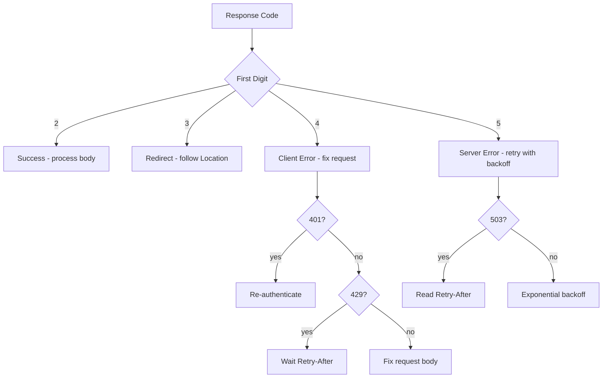

⚡ TL;DR - HTTP status codes are a three-digit numeric
signal that tells every component in the HTTP ecosystem
(clients, proxies, CDNs, retry logic) the class of
outcome - success, redirect, client error, or server error
- before reading a single byte of the response body.

---

| #008 | Category: HTTP & APIs | Difficulty: ★☆☆ |
|:---|:---|:---|
| **Depends on:** | HTTP Request Structure, HTTP Methods | |
| **Used by:** | RESTful API Design, Error Response Design, Retry Strategy | |
| **Related:** | HTTP Headers, Idempotency, API Observability | |

---

### 🔥 The Problem This Solves

**WORLD WITHOUT IT:**
Without a standardized outcome signal, every HTTP client
would need to parse the response body to determine success
or failure - and the format of that body would be different
for every API. A CDN could not decide whether to cache
a response without knowing the API's proprietary error
format. A retry library could not decide whether to retry
without parsing the specific error body. Every intermediary
would need application-specific knowledge.

**THE BREAKING POINT:**
Early network protocols (FTP, SMTP) had numeric reply codes
that infrastructure could act on. HTTP inherited this idea.
Without a machine-readable outcome code, a load balancer
could not fail over after an upstream error, a CDN could
not cache successful responses selectively, and a client
SDK could not distinguish "resource not found" from "server
crashed" without reading and parsing the body.

**THE INVENTION MOMENT:**
HTTP status codes solve the "who needs to know what" problem.
The three-digit code tells infrastructure (CDN, load
balancer, retry logic) the outcome class. The body provides
human-readable details for the application. The first digit
alone (2xx/3xx/4xx/5xx) is enough for most infrastructure
decisions.

**EVOLUTION:**
HTTP/1.0 defined the original code classes. HTTP/1.1 added
dozens of specific codes. Key additions: 429 Too Many
Requests (RFC 6585, 2012) for rate limiting; 422 Unprocessable
Entity for validation errors; 207 Multi-Status for batch
operations (WebDAV); 103 Early Hints (RFC 8297, 2017) for
HTTP preloading. Today the IANA registry contains 60+
registered codes, but the industry clusters around ~20
frequently used ones.

---

### 📘 Textbook Definition

An HTTP status code is a three-digit integer in the HTTP
response status line that indicates the outcome of the
request. The first digit defines the class: 1xx
(informational), 2xx (success), 3xx (redirection), 4xx
(client error), 5xx (server error). The full three-digit
code conveys specific semantics within the class. Status
codes are defined in RFC 9110 (HTTP Semantics) and various
extension RFCs. Custom codes in the 4xx/5xx range are
permitted but should extend standard codes, not replace them.

---

### ⏱️ Understand It in 30 Seconds

**One line:**
The status code is HTTP's machine-readable verdict: 2xx
means success, 3xx means go somewhere else, 4xx means
you made an error, 5xx means the server failed.

**One analogy:**
> HTTP status codes are like a restaurant order system.
> 200 OK: "Here is your food." 201 Created: "Your order was
> placed and confirmed." 301 Moved Permanently: "This
> restaurant moved - here is the new address." 404 Not Found:
> "We do not have that dish." 400 Bad Request: "That is not
> a real menu item." 401 Unauthorized: "You need a reservation
> to sit here." 403 Forbidden: "You are not allowed in the
> VIP section." 429 Too Many Requests: "You have ordered
> 50 items - slow down." 500 Internal Server Error: "The
> kitchen is on fire."

**One insight:**
The status code is the contract between the server and all
of HTTP infrastructure - not just the application client.
A 200 response triggers CDN caching. A 301 triggers browser
URL updates. A 503 with `Retry-After` triggers automatic
retry in client libraries. Returning the wrong code (200
for an error body, 500 for a client mistake) breaks every
layer of infrastructure that depends on this contract.

---

### 🔩 First Principles Explanation

**CORE INVARIANTS:**

**Class semantics (first digit):**
- **1xx** - Informational: request received, processing continues.
  Almost never seen in application APIs.
- **2xx** - Success: request was received, understood, and accepted.
  Infrastructure may cache, application can trust the body.
- **3xx** - Redirection: client must take additional action,
  usually following the `Location` header.
- **4xx** - Client error: the request was malformed or the
  requested action is not permitted. Retrying without modification
  will fail again. Do not retry on 4xx.
- **5xx** - Server error: the server failed to fulfill a valid
  request. The client may retry after a delay.

**The 4xx vs 5xx distinction is critical:**
- 4xx = the client is wrong. Fix the request before retrying.
- 5xx = the server is wrong. Retry after delay, potentially
  with exponential backoff. Trigger alerts.

**Most important codes for API design:**

| Code | Name | Meaning |
|:---|:---|:---|
| 200 | OK | Success, body contains result |
| 201 | Created | New resource created, Location header present |
| 202 | Accepted | Async - processing will happen later |
| 204 | No Content | Success, no body (DELETE, PUT with no return) |
| 301 | Moved Permanently | Permanent URL change; update bookmarks |
| 302 | Found | Temporary redirect (do not update bookmarks) |
| 304 | Not Modified | Conditional GET: cached version is current |
| 400 | Bad Request | Request syntax or data is invalid |
| 401 | Unauthorized | Authentication required (confusingly named) |
| 403 | Forbidden | Authenticated but not authorized |
| 404 | Not Found | Resource does not exist at this URL |
| 405 | Method Not Allowed | Wrong HTTP method for this endpoint |
| 409 | Conflict | State conflict - e.g. duplicate create |
| 410 | Gone | Resource permanently deleted (unlike 404) |
| 422 | Unprocessable Entity | Validation error (well-formed but invalid data) |
| 429 | Too Many Requests | Rate limit exceeded |
| 500 | Internal Server Error | Unexpected server failure |
| 502 | Bad Gateway | Upstream server returned invalid response |
| 503 | Service Unavailable | Server temporarily overloaded |
| 504 | Gateway Timeout | Upstream server timed out |

---

### 🧪 Thought Experiment

**SETUP:**
Your API returns `200 OK` with body `{"error": "User not found"}`
instead of returning `404 Not Found`. This is a common pattern
in legacy APIs and some enterprise APIs that always return 200.

**WHAT HAPPENS:**
1. CDN caches the 200 response. Next request for the same
   non-existent user gets the cached "user not found" error
   from the CDN - even if the user is later created.
2. Client retry library sees 200 and does not retry.
3. Monitoring sees 0% error rate. The dashboard is green
   while users see "user not found" errors.
4. API gateway throttling based on error rate never triggers.
5. The client code must parse every response body to
   determine success vs failure.

**THE INSIGHT:**
Returning 200 for errors breaks every layer of HTTP
infrastructure that depends on status codes. CDN caching
becomes a bug. Monitoring is blind. Retry logic is
disabled. The "always return 200" pattern forces the entire
HTTP ecosystem into a custom, application-specific mode.
This is the precise reason HTTP invented status codes:
to give infrastructure a machine-readable outcome signal
without requiring body parsing.

---

### 🧠 Mental Model / Analogy

> Status codes work like a traffic light system at every
> intersection in the HTTP network. Green light (2xx) means
> proceed - CDN caches, browser renders, client accepts body.
> Yellow light (3xx) means check the `Location` header and
> go there instead. Red light - client's fault (4xx) means
> stop, the driver (client) made an error, do not retry
> without fixing the car. Red light - road's fault (5xx)
> means stop, the road is broken, wait and try again.
>
> The key: every driver (proxy, CDN, load balancer, retry
> library) understands this traffic light. None of them
> need to read the road sign to know what to do.

Mapping:
- "Green light" → 2xx - proceed and process
- "Yellow light" → 3xx - redirect, follow Location
- "Red light - driver's fault" → 4xx - client error
- "Red light - road's fault" → 5xx - server error
- "Traffic light observers" → CDN, proxy, retry logic

Where this analogy breaks down: 401 is called "Unauthorized"
but means "unauthenticated" - it is a naming accident in the
spec. 403 is called "Forbidden" and means "authenticated but
not authorized." The vocabulary does not match intuition.

---

### 📶 Gradual Depth - Five Levels

**Level 1 - What it is (anyone can understand):**
When you make a request to a website, it sends back a number
that tells you what happened. 200 means success. 404 means
the page does not exist. 500 means the server had a problem.
Your browser uses these numbers to show error pages or
redirect you.

**Level 2 - How to use it (junior developer):**
Always check the status code before reading the response
body. Return the most specific code that describes the
outcome. 201 for creates (not just 200). 204 for successful
deletes (no body). 400 for validation errors. 401 when the
token is missing/expired. 403 when the user is authenticated
but lacks permission. 404 for missing resources.

**Level 3 - How it works (mid-level engineer):**
The first digit is the class - infrastructure acts on the
class. CDNs cache 2xx (and some 3xx) responses. Browsers
follow 3xx. Retry libraries retry 5xx with backoff but not
4xx. Rate limiters return 429 with `Retry-After`. The
specific three-digit code communicates semantics to the
application client. Never use 200 for errors - this breaks
the CDN, monitoring, and retry infrastructure.

**Level 4 - Why it was designed this way (senior/staff):**
Status codes separate concerns between infrastructure and
application. The first digit is infrastructure-readable
without body parsing. The three-digit code is application-
readable. This layered design means each layer acts on
the information relevant to it. The CDN only needs to know
"2xx = cacheable" - it does not need the body. The retry
library only needs "5xx = retry, 4xx = do not retry." The
application reads the full code and body together. Breaking
this separation (200-with-error-body) forces every layer
to become application-aware.

**Level 5 - Mastery (distinguished engineer):**
Status code design has subtle consistency rules that affect
API usability at scale. 404 vs 403: returning 403 for a
resource the user is not authorized to see reveals the
resource exists. Returning 404 hides existence (security
through obscurity). Security-sensitive APIs often return 404
for both "not found" and "forbidden" for resources the user
should not know exist. 409 vs 422: 409 Conflict is for
state conflicts (duplicate create, optimistic lock failure);
422 is for semantic validation errors (valid JSON structure,
invalid business logic). 202 Accepted is under-used: for
long-running operations, return 202 immediately with a status
URL in `Location` or body, and let the client poll. This
prevents API timeouts while keeping clients informed.

---

### ⚙️ How It Works (Mechanism)

```
┌──────────────────────────────────────────────────────┐
│          Status Code Processing by Layer             │
├──────────────────────────────────────────────────────┤
│                                                      │
│  Response arrives: HTTP/1.1 404 Not Found            │
│                                                      │
│  Layer 1 - CDN:                                      │
│   First digit = 4 → do not cache this response       │
│   404 specifically → may cache 404 per config        │
│                                                      │
│  Layer 2 - Load Balancer:                            │
│   5xx → mark upstream unhealthy, fail over           │
│   4xx → pass through to client (not LB's problem)    │
│                                                      │
│  Layer 3 - Retry Library:                            │
│   4xx → do not retry                                 │
│   5xx → retry with backoff                           │
│   429 → read Retry-After header, wait, then retry    │
│                                                      │
│  Layer 4 - Monitoring:                               │
│   5xx → increment error counter, alert on threshold  │
│   4xx → increment, but separate counter from 5xx     │
│                                                      │
│  Layer 5 - Application Client:                       │
│   404 → display "not found" message                  │
│   Read error body for user-facing details            │
│                                                      │
└──────────────────────────────────────────────────────┘
```



---

### 🔄 The Complete Picture - End-to-End Flow

**401 vs 403 - Authentication vs Authorization:**

```
Request: GET /documents/secret-doc
Without token:
  → 401 Unauthorized
  → WWW-Authenticate: Bearer realm="api.example.com"
  → Client: acquire token, retry

With token (user lacks permission):
  → 403 Forbidden (resource exists, access denied)
  → OR: 404 Not Found (if resource existence is secret)
  → Client: display permission error

With token (resource does not exist):
  → 404 Not Found
  → Client: display not found error
```

**202 Accepted pattern for long-running operations:**

```
POST /reports/generate
→ 202 Accepted
  Location: /reports/status/job_789
  {"job_id": "job_789", "status": "queued"}

GET /reports/status/job_789
→ 200 OK (while running)
  {"status": "processing", "progress": 45}

GET /reports/status/job_789
→ 200 OK (when complete)
  {"status": "complete",
   "result_url": "/reports/results/rep_456"}
```

---

### 💻 Code Example

**Example 1 - BAD: Always returning 200 for errors**

```python
# BAD: 200 for all outcomes - breaks CDN, monitoring, retry

@app.route("/users/<int:user_id>")
def get_user(user_id):
    user = db.users.find(user_id)
    if not user:
        # WRONG: CDN will cache "not found" as success
        return jsonify({"error": "User not found"}), 200
    return jsonify(user), 200
```

**Example 1 - GOOD: Correct status codes per outcome**

```python
# GOOD: specific codes for each outcome

from flask import Flask, jsonify, request

app = Flask(__name__)

@app.route("/users/<int:user_id>", methods=["GET"])
def get_user(user_id):
    user = db.users.find(user_id)
    if not user:
        return jsonify({
            "error": "not_found",
            "message": f"User {user_id} does not exist"
        }), 404
    return jsonify(user.to_dict()), 200

@app.route("/users", methods=["POST"])
def create_user():
    data = request.get_json()
    errors = validate_user(data)
    if errors:
        return jsonify({
            "error": "validation_failed",
            "details": errors  # list of field errors
        }), 422

    try:
        user = db.users.create(data)
    except DuplicateEmailError:
        return jsonify({
            "error": "conflict",
            "message": "Email already registered"
        }), 409

    return jsonify(user.to_dict()), 201, {
        "Location": f"/users/{user.id}"
    }

@app.route("/users/<int:user_id>", methods=["DELETE"])
def delete_user(user_id):
    db.users.delete(user_id)
    # No body for successful delete
    return "", 204
```

---

**Example 2 - Retry logic based on status codes**

```python
import requests
import time

def call_with_retry(url, method="GET", body=None,
                    max_retries=3):
    for attempt in range(max_retries + 1):
        try:
            response = requests.request(
                method, url, json=body, timeout=5
            )

            # 2xx: success, return response
            if 200 <= response.status_code < 300:
                return response

            # 4xx: client error - do NOT retry
            if 400 <= response.status_code < 500:
                response.raise_for_status()
                return response

            # 429: rate limited - read Retry-After
            if response.status_code == 429:
                retry_after = int(
                    response.headers.get("Retry-After", 60)
                )
                time.sleep(retry_after)
                continue

            # 5xx: server error - retry with backoff
            if attempt < max_retries:
                wait = 2 ** attempt  # exponential backoff
                time.sleep(wait)
                continue

            response.raise_for_status()

        except requests.exceptions.Timeout:
            if attempt < max_retries:
                time.sleep(2 ** attempt)
                continue
            raise

    raise Exception(f"Max retries exceeded for {url}")
```

---

**Example 3 - Handling status codes in client code**

```javascript
// GOOD: handle each status class appropriately

async function apiCall(url, options = {}) {
  const response = await fetch(url, options);

  if (response.status === 204) {
    return null;  // No body expected
  }

  const body = await response.json();

  if (response.status === 401) {
    await refreshToken();
    // Retry with new token
    return apiCall(url, {
      ...options,
      headers: { Authorization: `Bearer ${getToken()}` }
    });
  }

  if (response.status === 404) {
    return null;  // Resource not found - not an error
  }

  if (response.status === 422) {
    throw new ValidationError(body.details);
  }

  if (response.status === 429) {
    const retryAfter = response.headers.get("Retry-After");
    await sleep(parseInt(retryAfter, 10) * 1000);
    return apiCall(url, options);  // Retry after wait
  }

  if (!response.ok) {  // Any 4xx or 5xx
    throw new APIError(response.status, body.message);
  }

  return body;
}
```

---

### ⚖️ Comparison Table

| Code | Trigger | Client Action | Infrastructure Action |
|:---|:---|:---|:---|
| 200 OK | Successful read/update | Process body | CDN may cache |
| 201 Created | Successful create | Read Location header | No caching |
| 204 No Content | Successful delete/update | No body to read | No caching |
| 301 Moved | Permanent URL change | Update URL, follow | CDN updates route |
| 304 Not Modified | ETag/timestamp match | Use cached body | CDN served from cache |
| 400 Bad Request | Malformed request | Fix request | Log client error |
| 401 Unauthorized | Missing/invalid auth | Re-authenticate | No action |
| 403 Forbidden | Authenticated, not authorized | Show permission error | No action |
| 404 Not Found | Resource missing | Show not found | May cache |
| 409 Conflict | State conflict | Handle conflict | No action |
| 422 Unprocessable | Validation error | Show field errors | No action |
| 429 Too Many | Rate limit | Read Retry-After | No action |
| 500 Server Error | Unexpected failure | Retry later | Alert, fail over |
| 503 Unavailable | Overloaded | Read Retry-After | Remove from LB pool |

---

### ⚠️ Common Misconceptions

| Misconception | Reality |
|:---|:---|
| 401 means unauthorized (no permission) | 401 means unauthenticated (no valid credentials presented). 403 means authenticated but not authorized (lacks permission). This is an HTTP spec naming mistake. |
| 404 means server error | 404 is a 4xx (client error) - the client requested a resource that does not exist. It is not a server failure. |
| Always use 200 for success | 201 for creates, 204 for no-body success - using 200 for everything loses semantic meaning and may break Location header expectations |
| 500 means bug in the code | 500 means the server could not handle the request - could be a bug, a crashed dependency, or an infrastructure failure. 5xx is recoverable (retry); 4xx is not |
| 422 and 400 are interchangeable | 400 is for malformed requests (bad JSON, missing required headers). 422 is for semantically invalid requests (valid JSON structure, but "start_date must be before end_date"). Use both correctly. |

---

### 🚨 Failure Modes & Diagnosis

**200-with-error-body kills monitoring**

**Symptom:** API appears healthy (low error rate) in dashboards
but users are getting errors. CDN starts caching error
responses. Customer complaints spike while metrics show 99%
success rate.

**Root Cause:** API returns 200 for errors. Monitoring
counts 200 responses as successes. CDN caches 200 responses
including error bodies. Retry logic does not retry 200
responses.

**Diagnostic Command / Tool:**

```bash
# Find endpoints returning 200 with error bodies
grep '"error"' /var/log/access.log | \
  grep ' 200 ' | \
  awk '{print $7}' | sort | uniq -c | sort -rn

# Or check sampled responses for error patterns
curl -s https://api.example.com/endpoint | \
  python3 -c "
import json, sys
r = json.load(sys.stdin)
print('Has error key:', 'error' in r)
"
```

**Fix:** Return correct 4xx/5xx codes for errors. Migrate
gradually: start with the most impactful endpoints, log both
old and new code, monitor that clients handle new codes.

---

**503 vs 500 - Wrong code for temporary outage**

**Symptom:** During a deployment, clients do not respect
the `Retry-After` header. Traffic keeps hammering the
service during restart. Health checks fail continuously.
Requests do not back off.

**Root Cause:** Service returning 500 during restart
instead of 503. 500 is not the standard code for "I am
temporarily unavailable, please retry." 503 with
`Retry-After` is the correct signal for planned unavailability.

**Diagnostic Command / Tool:**

```bash
# Check what code the service returns during restart
watch -n 1 'curl -s -o /dev/null -w "%{http_code}" \
  https://api.example.com/health'
```

**Fix:**

```python
# GOOD: return 503 with Retry-After during maintenance

@app.before_request
def check_maintenance():
    if is_maintenance_mode():
        response = jsonify({
            "error": "service_unavailable",
            "message": "Scheduled maintenance until 14:00 UTC"
        })
        response.status_code = 503
        response.headers["Retry-After"] = "300"  # 5 min
        return response
```

**Prevention:** Add startup health check endpoints that
return 503 until the service is ready. Use 503 + Retry-After
for graceful degradation, not 500.

---

**401 vs 403 - Wrong security signal**

**Symptom:** API returns 401 when an authenticated user
accesses a resource they are not allowed to see. Clients
loop trying to refresh the token. Or: API returns 403
for missing tokens, blocking legitimate re-auth flows.

**Root Cause:** 401 means "authenticate." Client SDK
interprets 401 as "my token is expired, refresh and retry."
If the real issue is permissions (not authentication), the
SDK refreshes the token, retries, gets 401 again, infinitely.

**Diagnostic Command / Tool:**

```bash
# Test authentication vs authorization paths
# With no token:
curl -v https://api.example.com/admin/users 2>&1 | \
  grep "< HTTP"
# Should return 401

# With valid token, no admin role:
curl -v -H "Authorization: Bearer $USER_TOKEN" \
  https://api.example.com/admin/users 2>&1 | grep "< HTTP"
# Should return 403, not 401
```

**Fix:**

```python
# GOOD: correct 401 vs 403 logic

def check_auth(user, resource, action):
    if not user or not user.is_authenticated:
        # No valid credentials → 401, prompt to authenticate
        return 401, "Authentication required"

    if not user.can(action, resource):
        # Authenticated but lacks permission → 403
        return 403, "Permission denied"

    return 200, None
```

**Prevention:** Add automated tests for both paths on every
protected endpoint.

---

### 🔗 Related Keywords

**Prerequisites (understand these first):**
- `HTTP Request and Response Structure` - the status line
  that carries the status code
- `HTTP Methods` - the operations whose outcomes are
  expressed as status codes

**Builds On This (learn these next):**
- `Error Response Design` - how to design consistent error
  bodies to accompany 4xx/5xx codes
- `API Rate Limiting` - the 429 status code flow in detail
- `API Retry and Backoff Strategy` - how to retry based on
  status code classes

**Alternatives / Comparisons:**
- `gRPC Status Codes` - gRPC has its own code system (16
  codes: OK, NOT_FOUND, PERMISSION_DENIED, etc.) mapped
  from HTTP codes for gRPC-Web
- `GraphQL Error Handling` - GraphQL always returns 200;
  errors are encoded in the response body in the `errors`
  array - the deliberate inversion of HTTP status semantics

---

### 📌 Quick Reference Card

```
┌──────────────────────────────────────────────────────────┐
│ WHAT IT IS   │ Three-digit outcome signal in every HTTP  │
│              │ response; first digit = infrastructure    │
│              │ class; all three = application semantics  │
├──────────────┼───────────────────────────────────────────┤
│ PROBLEM IT   │ Intermediaries need outcome class without │
│ SOLVES       │ parsing application-specific error bodies │
├──────────────┼───────────────────────────────────────────┤
│ KEY INSIGHT  │ 4xx = client error (do not retry without  │
│              │ fix), 5xx = server error (retry w/ backoff│
├──────────────┼───────────────────────────────────────────┤
│ USE WHEN     │ Always - every HTTP response must have a  │
│              │ correct status code for infrastructure    │
│              │ to behave correctly                       │
├──────────────┼───────────────────────────────────────────┤
│ AVOID WHEN   │ Never use 200 for errors, 500 for client  │
│              │ mistakes, or 404 when the real error is   │
│              │ 403 (for non-sensitive resources)         │
├──────────────┼───────────────────────────────────────────┤
│ ANTI-PATTERN │ 200-with-error-body: breaks CDN caching,  │
│              │ monitoring, and retry logic simultaneously │
├──────────────┼───────────────────────────────────────────┤
│ TRADE-OFF    │ Specific codes (422, 409) vs simple codes  │
│              │ (400): specificity helps clients handle   │
│              │ errors correctly but increases surface    │
├──────────────┼───────────────────────────────────────────┤
│ ONE-LINER    │ "Status code = machine-readable verdict   │
│              │ for every layer. Never hide errors in 200."│
├──────────────┼───────────────────────────────────────────┤
│ NEXT EXPLORE │ Error Response Design → Retry Strategy →  │
│              │ API Observability (metrics by code class) │
└──────────────────────────────────────────────────────────┘
```

**If you remember only 3 things:**
1. 4xx = client's fault, do not retry. 5xx = server's fault,
   retry with backoff. This one rule is the foundation of all
   resilient HTTP client logic.
2. 401 = not authenticated (re-authenticate). 403 = authenticated
   but not authorized (cannot retry - fix permissions). These
   are confusingly named but critically different.
3. Never return 200 for errors. It breaks CDN caching,
   monitoring dashboards, and retry libraries simultaneously.

**Interview one-liner:**
"HTTP status codes carry two signals: the first digit tells
infrastructure (CDN, load balancer, retry logic) the outcome
class - 2xx cache, 3xx redirect, 4xx don't retry, 5xx retry.
The full three digits tell the application the specific
outcome. The cardinal sin of API design is returning 200 for
errors - it makes the entire HTTP infrastructure blind."

---

### 💎 Transferable Wisdom

**Reusable Engineering Principle:**
Machine-readable outcome signals enable decentralized
decision-making. When the outcome is encoded in a standard
format that every component understands, each component
can make the correct local decision without centralized
coordination. HTTP status codes let CDN, proxy, retry logic,
monitoring, and application each react appropriately to
the outcome - without any of them needing to consult the
others. Systems that encode outcome only in opaque payloads
force centralized parsing logic into every component.

**Where else this pattern appears:**
- Unix exit codes: 0 = success, non-zero = failure;
  shell scripts act on exit code without reading stdout
- gRPC status codes: same class model (OK, NOT_FOUND,
  PERMISSION_DENIED) applied to binary RPC calls
- SMTP response codes (250 OK, 550 Mailbox not found,
  421 Service not available): same three-digit structure,
  same first-digit class semantics, predates HTTP

**Industry applications:**
- Stripe webhooks: use HTTP status codes from the receiving
  server to determine whether to retry delivery; 2xx = ack,
  non-2xx = retry with backoff up to 72 hours
- Kubernetes health probes: liveness/readiness probes check
  HTTP status codes from /health endpoint; 2xx = healthy,
  non-2xx = unhealthy, remove from load balancer pool

---

### 💡 The Surprising Truth

The 401/403 naming confusion is not an accident or
oversight - it was a deliberate design choice in the
original HTTP spec. The HTTP spec authors named 401
"Unauthorized" even though it means "unauthenticated"
because they designed it with a specific flow: the
`WWW-Authenticate` header on a 401 response would tell
the client exactly how to authenticate. "Unauthorized"
was meant to mean "not yet authorized - here is how to
become authorized." The spec always intended 403 for "I
know who you are and you cannot do this." But the vocabulary
was confusing enough that every major web framework
documentation has a section explaining the difference.
In 25 years, the HTTP community has not been able to rename
them - too many systems depend on the numbers, not the names.

---

### ✅ Mastery Checklist

**You've mastered this when you can:**
1. **EXPLAIN** Without using the spec, explain to a junior
   engineer why 401 and 403 exist as separate codes and how
   a client SDK should handle each differently.
2. **DEBUG** Given a CDN log showing 200 responses with
   bodies containing `"error": "not found"`, explain
   what will happen to those responses and how to detect
   how many users are being affected.
3. **DECIDE** For each outcome - resource not found,
   invalid email format, expired OAuth token, quota
   exceeded, database connection failed, concurrent
   edit conflict - choose the correct HTTP status code.
4. **BUILD** Design a simple API error response schema
   that works with 400, 422, 409, 403, and 404 - using
   consistent fields across all error types while still
   communicating the specific issue.
5. **EXTEND** Explain how GraphQL's decision to always
   return 200 OK is a deliberate inversion of HTTP status
   code semantics, what trade-offs this creates for CDN
   caching and error monitoring, and when it is the
   correct choice.

---

### 🧠 Think About This Before We Continue

**Q1.** Your API currently returns 500 for all server-side
errors (database down, external service timeout, out of
memory, etc.). A customer asks: "Which of your 500 errors
are transient and safe to retry?" You cannot answer because
all are 500. How would you redesign the error codes to
make this information machine-readable for client retry logic?

*Hint: Think about 503 with Retry-After for temporary
unavailability vs 500 for unrecoverable failures. Also
consider custom response headers that add retry metadata
without changing the status code.*

**Q2.** You are building a multi-tenant API. User A requests
`GET /organizations/org_999`. Org 999 exists but belongs to
a different tenant. Should you return 403 (forbidden) or
404 (not found)? What are the security and usability
trade-offs of each choice?

*Hint: Think about information disclosure - 403 confirms the
resource exists, 404 hides that. Consider what this means
for attackers trying to enumerate organization IDs.*

**Q3.** Build this: implement a middleware that automatically
logs all 5xx responses with the request URL, method, and
response body, and all 4xx responses with the request URL,
method, and the error code - but not the request body
(which may contain PII). Then write a test that verifies
400 and 500 are both logged while 200 is not.

*Hint: Use request/response hooks in your web framework's
middleware chain. Be explicit about not logging request
bodies to avoid PII in logs.*

---

### 🎯 Interview Deep-Dive

**Q1: What is the difference between 401 and 403, and
how should a client handle each differently?**

*Why they ask:* A common mistake that causes authentication
loops or permission errors - tests production experience.

*Strong answer includes:*
- 401: unauthenticated (despite the confusing name); the
  request lacks valid credentials; client should authenticate
  (or refresh token) and retry
- 403: authenticated but not authorized; client has a valid
  token but lacks permission for this resource; retrying
  with the same credentials will fail - do not retry
- Client SDK behavior: 401 triggers token refresh + retry
  loop; 403 surfaces a permission error to the user with no
  retry; confusing 401 and 403 creates infinite refresh loops
- `WWW-Authenticate` header on 401 tells the client the
  authentication scheme to use

**Q2: Why is returning 200 with an error body a problem?
Name at least three specific consequences.**

*Why they ask:* Tests whether the candidate understands
the HTTP ecosystem, not just client code.

*Strong answer includes (any 3 of):**
1. CDN caches the "error" response as a successful response
   for the cache TTL, causing future requests to get the
   error from cache even after the problem is fixed
2. Monitoring shows 0% error rate while users get errors
   (error rate dashboard is broken)
3. Retry logic does not retry 200 responses - users get
   errors that could have been resolved on retry
4. API gateway throttling based on error rate never triggers,
   so downstream systems are not protected
5. Client code must parse every response body to determine
   success vs failure - cannot use status code as a first-pass filter

**Q3: When would you use 202 Accepted instead of 200 OK,
and what should the 202 response contain?**

*Why they ask:* Tests understanding of async patterns -
a concrete API design decision with production implications.

*Strong answer includes:*
- Use 202 when the request is accepted but processing is
  async (report generation, video processing, email sending,
  bulk imports)
- 202 signals "I accepted the work, but I do not have the
  result yet" - not to be used when the result is ready
- Response body should contain: a job/task ID, current
  status ("queued"), and a polling URL in `Location` header
  or body
- Client polls the status URL to check progress
- Alternative: include a webhook URL where the server will
  push when complete
- Anti-pattern: using 200 and making the client wait
  synchronously for a 30-second operation - this causes
  proxy timeouts and poor mobile UX
