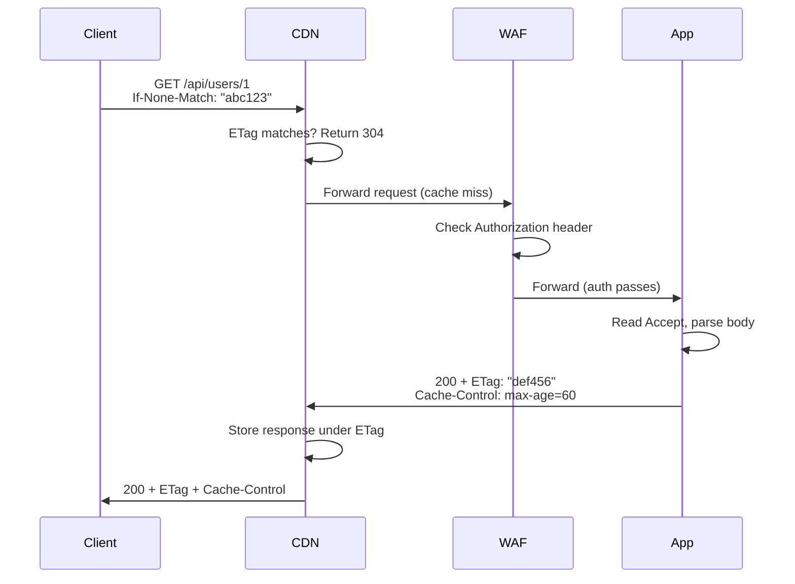

⚡ TL;DR - HTTP headers are the metadata envelope of every
request and response - they carry authentication, content
type, caching instructions, encoding preferences, and
cross-cutting concerns that the body cannot or should not
contain, and understanding them is prerequisite to every
intermediate and advanced HTTP concept.

---

| #010 | Category: HTTP & APIs | Difficulty: ★☆☆ |
|:---|:---|:---|
| **Depends on:** | HTTP Request Structure, HTTP Protocol | |
| **Used by:** | Content Types, Caching, CORS, Auth Schemes, Compression | |
| **Related:** | HTTP Methods, Status Codes, URL Structure | |

---

### 🔥 The Problem This Solves

**WORLD WITHOUT IT:**
If HTTP only had a request line (method + URL) and a body,
every new capability would require a protocol version change.
Adding authentication would require a new field in the request
line. Adding caching directives would require a new protocol.
Adding content type negotiation would require changing the
URL format. Each new feature would break all existing
implementations.

**THE BREAKING POINT:**
Early networking protocols faced exactly this problem. FTP
commands were rigid text commands with fixed argument
positions. Adding a new capability meant updating every
FTP client and server. HTTP's designers needed a protocol
that could evolve without breaking existing implementations
across millions of servers and clients.

**THE INVENTION MOMENT:**
HTTP headers are the extension mechanism that made HTTP
infinitely extensible. The rule that "unknown headers are
silently ignored" means any party can add a new header
for a new purpose, and existing software that does not
understand that header simply ignores it. No protocol version
change needed. No coordination required. This single design
decision made 30 years of HTTP evolution possible.

**EVOLUTION:**
HTTP/1.0 added headers as a new concept (HTTP/0.9 had
no headers). HTTP/1.1 made `Host` required (enabling
virtual hosting). `X-` prefix was a convention for non-standard
headers (later abandoned in RFC 6648, 2012). HTTP/2 made
headers binary-encoded with HPACK compression - the same
semantics, dramatically smaller wire size for repeated headers.
Today there are hundreds of standardized headers plus
thousands of custom `X-*` headers used by various services.

---

### 📘 Textbook Definition

HTTP headers are name-value pairs that precede the body
in HTTP request and response messages. Request headers
carry client metadata: the client's acceptable content
types, encoding preferences, authentication credentials,
caching conditions, and the host being addressed. Response
headers carry server metadata: the format of the response
body, caching instructions, authentication challenges,
rate limit information, and redirect targets. Headers are
extensible by design - unknown headers are ignored by
receivers that do not understand them.

---

### ⏱️ Understand It in 30 Seconds

**One line:**
Headers are the metadata of HTTP - they control how the
message is authenticated, cached, compressed, encoded,
and routed without changing the body format.

**One analogy:**
> HTTP headers are like the Post-it notes stuck on a
> package before shipping. The package itself (the body)
> contains the goods. The Post-it notes say "Handle with
> care" (Content-Type), "From Alice, expires Tuesday"
> (Authorization, Cache-Control), "If the recipient is not
> home, try apartment 4B" (Content-Location), and "This
> can be opened by the shipping company" (X-Forwarded-For
> added by the proxy). None of this changes what is inside
> the box - it is all instructions for handling the box.

**One insight:**
Headers separate mechanism from content. The body carries
application data. Headers carry protocol semantics. This
separation means the same header mechanism works for HTML,
JSON, images, streaming video, binary files, and any future
format - without changing the header system. Every "advanced"
HTTP feature (caching, auth, CORS, compression, content
negotiation) is implemented through headers.

---

### 🔩 First Principles Explanation

**HEADER CATEGORIES:**

**Request headers - what the client sends:**

| Header | Purpose | Example |
|:---|:---|:---|
| `Host` | Target hostname (required) | `api.example.com` |
| `Authorization` | Authentication credentials | `Bearer eyJ...` |
| `Content-Type` | Format of request body | `application/json` |
| `Content-Length` | Size of request body in bytes | `52` |
| `Accept` | Acceptable response formats | `application/json` |
| `Accept-Encoding` | Acceptable compressions | `gzip, br` |
| `Accept-Language` | Preferred languages | `en-US, en;q=0.9` |
| `Cache-Control` | Caching directives for proxies | `no-cache` |
| `If-None-Match` | Conditional GET (ETag) | `"abc123"` |
| `If-Modified-Since` | Conditional GET (timestamp) | `Wed, 21 Oct 2020...` |
| `User-Agent` | Client software identifier | `MyApp/1.0` |
| `X-Request-Id` | Client-generated request trace ID | `req_abc123` |

**Response headers - what the server sends:**

| Header | Purpose | Example |
|:---|:---|:---|
| `Content-Type` | Format of response body | `application/json` |
| `Content-Length` | Size of response body | `85` |
| `Content-Encoding` | Compression applied to body | `gzip` |
| `Cache-Control` | Caching rules | `max-age=3600` |
| `ETag` | Resource version fingerprint | `"abc123"` |
| `Last-Modified` | Resource last change timestamp | `Wed, 21 Oct 2020...` |
| `Location` | Redirect target or new resource | `/users/42` |
| `WWW-Authenticate` | Auth scheme required (for 401) | `Bearer realm="api"` |
| `X-RateLimit-Remaining` | Rate limit remaining | `47` |
| `Retry-After` | Seconds until retry allowed | `60` |
| `Vary` | Which request headers affect response | `Accept-Encoding` |
| `Strict-Transport-Security` | Require HTTPS (HSTS) | `max-age=31536000` |

**HEADER FORMAT RULES:**
- Name: case-insensitive (HTTP/2 requires lowercase)
- Separator: `: ` (colon + space)
- Value: case depends on the header (Authorization is
  case-sensitive, Content-Type media type case-insensitive)
- Multiple values: either multiple header lines with same
  name, or comma-separated in one line (header-specific)
- Never put CR or LF in values (header injection attack)

---

### 🧪 Thought Experiment

**SETUP:**
You want to add request tracing to your microservices so
you can correlate logs across service calls. You need to
pass a trace ID from the initial request through all
downstream service calls.

**WHAT HAPPENS WITHOUT HEADERS:**
You would need to add a `trace_id` field to every request
body schema in every service. Every service must be updated
to read and pass the trace ID in the body. If any service
does not forward it, the trace chain breaks. Adding a
second field (e.g. `span_id`) requires updating all schemas again.

**WHAT HAPPENS WITH HEADERS:**
You add a `X-Trace-Id` header to the initial request.
Each service reads the header, logs it, and adds it to
every downstream HTTP request it makes. A middleware in
each service handles this automatically - no body schema
changes required. Adding `X-Span-Id` later requires
changing only the middleware, not any application code.

**THE INSIGHT:**
Headers are the natural home for cross-cutting concerns
that are not part of the application data model. Authentication,
tracing, caching, compression, content negotiation - all
can be added as headers without touching the body schema.
This is why middleware frameworks work: they intercept
the header layer without changing application logic.

---

### 🧠 Mental Model / Analogy

> Think of an HTTP exchange as a conversation between
> two professional offices. The letter in the envelope
> (body) is the actual business content - the contract,
> report, or invoice. The labels on the envelope (headers)
> tell the mailroom how to handle it: "Confidential"
> (Authorization), "Respond within 30 days" (Cache-Control),
> "If no response, file in archive Z" (ETag/conditional).
> The receiving office can handle the envelope labels
> (cache it, verify it, route it) without reading the
> business content. The business content does not need
> to know about mailing logistics.

Mapping:
- "Business letter" → HTTP body (application data)
- "Envelope labels" → HTTP headers (metadata)
- "Mailroom" → CDN, proxy, load balancer
- "Confidential" → Authorization header
- "30-day response time" → Cache-Control max-age
- "File if no response" → ETag/If-None-Match conditional caching

Where this analogy breaks down: HTTP headers are visible
to every intermediary in the network path (any proxy can
read them). Unlike a physical envelope marked "Confidential,"
HTTP headers are not encrypted before TLS - though TLS
does protect them in transit, they are visible at the
endpoints (client, server, terminating load balancer).

---

### 📶 Gradual Depth - Five Levels

**Level 1 - What it is (anyone can understand):**
HTTP headers are extra instructions attached to every web
request and response. They tell the server "I accept JSON"
or "I have a password." They tell the browser "cache this
for an hour" or "this was moved to a new address." They
are separate from the actual content being sent.

**Level 2 - How to use it (junior developer):**
Set `Content-Type` to match the body format you are sending.
Set `Authorization` to pass your authentication token.
Read `Content-Type` on responses to know how to parse the body.
Never put sensitive data in custom headers that might be
logged (`Authorization` has special handling but `X-Secret`
does not).

**Level 3 - How it works (mid-level engineer):**
Headers are line-separated key-value pairs before the blank
line that separates them from the body. The `Content-Type`
header tells the receiver how to decode the body bytes.
`Cache-Control` tells CDN and browser how long to cache.
`Authorization: Bearer <token>` carries the JWT or OAuth
token. `ETag` + `If-None-Match` enable cache validation
(304 Not Modified avoids re-sending unchanged responses).

**Level 4 - Why it was designed this way (senior/staff):**
The separation of headers from body allows each part of
the HTTP infrastructure to act independently. A CDN reads
only the `Cache-Control` and `ETag` headers to make caching
decisions - it does not need to parse the body. A WAF reads
`Authorization` and `Content-Type` headers to enforce
security policy. An application server reads `Authorization`
and routes to the correct handler. Each layer sees exactly
the information it needs and ignores the rest. If all this
metadata were in the body, every layer would need to parse
the body format to make decisions.

**Level 5 - Mastery (distinguished engineer):**
Header behavior has subtle security and performance
interactions that only surface at scale. The `Vary` header
is a CDN instruction: `Vary: Accept-Encoding` tells the CDN
that the same URL has different cached versions for clients
that accept gzip vs those that do not. Without `Vary: Accept-Encoding`,
a CDN might serve a gzip-compressed response to a client
that does not support gzip. `Vary: *` makes every response
uncacheable (often set by accident). Incorrect `Vary` headers
cause cache poisoning or cache bypass - 100x cache miss rate
under load. The interaction between `Cache-Control`, `ETag`,
`Last-Modified`, `Vary`, and `If-None-Match`/`If-Modified-Since`
forms HTTP's complete caching protocol - and most teams
understand less than 30% of it.

---

### ⚙️ How It Works (Mechanism)

```
┌──────────────────────────────────────────────────────┐
│              Header Processing by Layer              │
├──────────────────────────────────────────────────────┤
│                                                      │
│  REQUEST FLOW                                        │
│  Client → CDN → WAF → LB → App Server               │
│                                                      │
│  CDN reads:    Cache-Control, ETag, If-None-Match    │
│  WAF reads:    Authorization, Content-Type, Origin   │
│  LB reads:     X-Forwarded-For, Host                 │
│  App reads:    Authorization, Content-Type, Accept   │
│                all custom X-* headers                │
│                                                      │
│  RESPONSE FLOW                                       │
│  App Server → LB → CDN → Client                     │
│                                                      │
│  LB adds:      X-Served-By, X-Backend-Port          │
│  CDN adds:     Age, X-Cache, Vary                    │
│  Client uses:  Cache-Control, ETag, Content-Type     │
│                Content-Encoding, Set-Cookie          │
│                                                      │
└──────────────────────────────────────────────────────┘
```



**HTTP/2 header compression (HPACK):**

In HTTP/1.1, headers are repeated in full on every request.
On a typical API call, headers like `Host`, `Authorization`,
`Content-Type` are sent hundreds of times per session.
HTTP/2 HPACK maintains a shared compression table between
client and server. After the first request, `Authorization`
is stored in the table at index N. Subsequent requests
send just the table index (1-2 bytes) instead of the full
header string. Reduces header overhead by 80-90% for
typical API traffic.

---

### 🔄 The Complete Picture - End-to-End Flow

**Conditional GET - cache validation:**

```
Request 1: GET /data
Response 1: 200 OK
            Cache-Control: max-age=60
            ETag: "version-abc"
            Body: {large data object}

[60 seconds pass - cache expires]

Request 2: GET /data
           If-None-Match: "version-abc"

Server: has data changed? NO
Response 2: 304 Not Modified
            (no body sent - client uses cached body)

Server: has data changed? YES
Response 2: 200 OK
            ETag: "version-def"
            Body: {new data object}
```

**Content negotiation:**

```
Client request:
  Accept: application/json, text/html;q=0.9, */*;q=0.8
  Accept-Encoding: gzip, br, deflate;q=0.5
  Accept-Language: en-US, en;q=0.9, fr;q=0.5

Server response:
  Content-Type: application/json; charset=utf-8
  Content-Encoding: gzip
  Content-Language: en-US
  Vary: Accept, Accept-Encoding
  (body: gzip-compressed JSON)
```

---

### 💻 Code Example

**Example 1 - BAD: Ignoring Content-Type header**

```python
# BAD: assume JSON without checking Content-Type

@app.route("/webhook", methods=["POST"])
def webhook():
    # WRONG: direct json parse without checking type
    # Fails if Content-Type is text/plain or form data
    data = request.get_json()
    process(data["event"])  # KeyError if not JSON
```

**Example 1 - GOOD: Check Content-Type before parsing**

```python
# GOOD: validate Content-Type before parsing body

@app.route("/webhook", methods=["POST"])
def webhook():
    content_type = request.headers.get(
        "Content-Type", ""
    )
    if "application/json" not in content_type:
        return jsonify({
            "error": "Content-Type must be application/json"
        }), 415  # 415 Unsupported Media Type

    data = request.get_json(silent=True)
    if data is None:
        return jsonify({"error": "Invalid JSON body"}), 400

    event = data.get("event")
    if not event:
        return jsonify({"error": "Missing event field"}), 422

    process(event)
    return "", 204
```

---

**Example 2 - Setting correct headers for API responses**

```python
from flask import make_response, jsonify
import hashlib
import json

def api_response(data, cache_seconds=0,
                 request_etag=None):
    body = json.dumps(data, sort_keys=True)
    etag = hashlib.md5(body.encode()).hexdigest()

    # 304 Not Modified if ETag matches
    if request_etag and request_etag.strip('"') == etag:
        return make_response("", 304)

    response = make_response(jsonify(data), 200)

    # Content headers
    response.headers["Content-Type"] = "application/json"

    # Caching headers
    if cache_seconds > 0:
        response.headers["Cache-Control"] = (
            f"public, max-age={cache_seconds}"
        )
        response.headers["ETag"] = f'"{etag}"'
    else:
        response.headers["Cache-Control"] = (
            "no-store"
        )

    # Security headers
    response.headers[
        "X-Content-Type-Options"
    ] = "nosniff"

    return response
```

---

**Example 3 - Reading headers for tracing and auth**

```python
# Middleware: extract and validate common headers

import uuid

def get_request_context(request):
    # Auth: Bearer token from Authorization header
    auth_header = request.headers.get("Authorization", "")
    token = None
    if auth_header.startswith("Bearer "):
        token = auth_header[7:]  # "Bearer " is 7 chars

    # Trace: use client-provided or generate new
    trace_id = (
        request.headers.get("X-Request-Id")
        or request.headers.get("X-Trace-Id")
        or str(uuid.uuid4())
    )

    # Client info
    user_agent = request.headers.get("User-Agent", "")
    client_ip = (
        # Trust X-Forwarded-For only from known proxies
        request.headers.get("X-Forwarded-For", "")
            .split(",")[0].strip()
        or request.remote_addr
    )

    return {
        "token": token,
        "trace_id": trace_id,
        "user_agent": user_agent,
        "client_ip": client_ip
    }
```

---

### ⚖️ Comparison Table

| Header Type | Examples | Who reads it | Impact |
|:---|:---|:---|:---|
| **Authentication** | Authorization, WWW-Authenticate | App server, WAF | Access control |
| **Content** | Content-Type, Content-Length, Content-Encoding | All layers | Body parsing |
| **Caching** | Cache-Control, ETag, Expires, Vary | CDN, browser, proxy | Cache behavior |
| **Conditional** | If-None-Match, If-Modified-Since | App server | Saves bandwidth |
| **Routing** | Host, X-Forwarded-For, X-Forwarded-Proto | LB, proxy | Traffic routing |
| **Security** | HSTS, X-Content-Type-Options, CSP | Browser | Browser security |
| **Rate limit** | X-RateLimit-Remaining, Retry-After | Client SDK | Throttling |
| **Tracing** | X-Request-Id, X-Trace-Id, X-Correlation-Id | Logging/monitoring | Observability |

---

### ⚠️ Common Misconceptions

| Misconception | Reality |
|:---|:---|
| `Authorization` header is encrypted in HTTPS | The header is encrypted in transit by TLS, but it is decrypted at the server (and any TLS-terminating proxy) and often logged. HTTPS protects against eavesdropping, not against log exposure. |
| HTTP/2 headers are different fields | HTTP/2 headers have the same names and semantics; only the wire encoding changes (binary HPACK instead of text). All the same cache/auth/content headers apply. |
| Custom `X-` headers are private | Any proxy or intermediary can read, modify, or log any HTTP header. Custom headers are not private unless the data is encrypted within the header value. |
| `Cache-Control: no-cache` means do not cache | `no-cache` means "cache but always revalidate with the server before using." `no-store` means "do not cache at all." This naming causes common security misconfigurations. |
| Headers are case-sensitive | Header names are case-insensitive in HTTP/1.1. HTTP/2 specifies lowercase. `Authorization` and `authorization` are the same header. Header values may be case-sensitive (token values, ETag). |

---

### 🚨 Failure Modes & Diagnosis

**Header injection via user-controlled values**

**Symptom:** Security scanner flags HTTP header injection
vulnerability. Log shows injected headers in responses.
Attacker can set arbitrary response headers (e.g. `Set-Cookie`).

**Root Cause:** Application includes unvalidated user input
in an HTTP response header value. CRLF characters in the
user input create a new header line.

**Diagnostic Command / Tool:**

```bash
# Test for header injection (safe probe)
curl -v "https://api.example.com/redirect?next=test%0d%0aInjected%3a+evil" \
  2>&1 | grep -E "Injected|Location"
# If "Injected: evil" appears, injection is present
```

**Fix:**

```python
# BAD: user input directly in header
user_url = request.args.get("next")
# Attacker sets next = "/\r\nSet-Cookie: session=evil"
response.headers["Location"] = user_url  # injection!

# GOOD: validate and sanitize header values
import re

def safe_redirect(url):
    # Remove all CRLF characters
    url = re.sub(r'[\r\n]', '', url)
    # Validate it is a safe relative URL
    if not url.startswith("/") or url.startswith("//"):
        url = "/default"
    return url

response.headers["Location"] = safe_redirect(
    request.args.get("next", "/")
)
```

---

**`Cache-Control: no-cache` misused - sensitive data cached**

**Symptom:** Sensitive API responses (user data, financial
records) are being served from CDN cache to different users.
Security audit flags private data returned to wrong users.

**Root Cause:** Developer used `Cache-Control: no-cache`
thinking it means "do not cache." It means "cache but
always revalidate." The CDN still stores and serves the
response to other users.

**Diagnostic Command / Tool:**

```bash
# Check actual Cache-Control header on sensitive endpoint
curl -v https://api.example.com/users/me 2>&1 | \
  grep "cache-control"

# Check if CDN is serving cached sensitive data
# by making the same request from two different accounts
# and comparing timestamps/ETags
```

**Fix:**

```python
# BAD: developer thinks this means "don't cache"
response.headers["Cache-Control"] = "no-cache"
# CDN still caches and revalidates!

# GOOD: use no-store for truly sensitive data
response.headers["Cache-Control"] = (
    "no-store, no-cache, must-revalidate, private"
)
# no-store: do not cache anywhere
# private: this is user-specific data
```

**Prevention:** Use `no-store` for sensitive endpoints.
Use `private` for user-specific responses. Use `public` only
for responses that can be shared across all users.

---

**`X-Forwarded-For` header spoofing - IP bypass**

**Symptom:** Rate limiting and IP-based access controls are
bypassed. All requests appear to come from localhost or
trusted IPs. Security audit identifies IP allowlist bypass.

**Root Cause:** Application reads `X-Forwarded-For` directly
without validating that it was set by a trusted proxy.
Attacker sends `X-Forwarded-For: 127.0.0.1` in their
request. Application sees "localhost" and skips rate limiting.

**Diagnostic Command / Tool:**

```bash
# Test if X-Forwarded-For can be spoofed
curl -H "X-Forwarded-For: 127.0.0.1" \
  https://api.example.com/admin/endpoint
```

**Fix:**

```python
# BAD: trusting X-Forwarded-For unconditionally
client_ip = request.headers.get("X-Forwarded-For")

# GOOD: only trust X-Forwarded-For from known proxy IPs
TRUSTED_PROXIES = {"10.0.0.1", "10.0.0.2"}  # your LBs

def get_real_ip(request):
    forwarded_for = request.headers.get(
        "X-Forwarded-For", ""
    )
    # Only trust if request came from a trusted proxy
    if request.remote_addr in TRUSTED_PROXIES:
        # Use the first IP in the chain (original client)
        return forwarded_for.split(",")[0].strip()
    # Otherwise, use the direct connection IP
    return request.remote_addr
```

---

### 🔗 Related Keywords

**Prerequisites (understand these first):**
- `HTTP Request and Response Structure` - the message format
  that contains headers
- `HTTP Protocol` - the context in which headers operate

**Builds On This (learn these next):**
- `HTTP Caching` - deep dive into Cache-Control, ETag,
  and conditional requests
- `CORS` - Cross-Origin Resource Sharing uses headers
  exclusively for its protocol
- `Authentication Schemes` - Bearer Token, Basic Auth
  are all implemented via Authorization header

**Alternatives / Comparisons:**
- `gRPC Metadata` - gRPC uses "metadata" (key-value pairs)
  that serve the same purpose as HTTP headers but are
  transmitted as binary in the HTTP/2 frame
- `HTTP Trailers` - HTTP/2 allows headers to be sent after
  the body (trailers); used for checksums and error status
  in chunked transfers

---

### 📌 Quick Reference Card

```
┌──────────────────────────────────────────────────────────┐
│ WHAT IT IS   │ Key-value metadata pairs sent before body;│
│              │ mechanism for auth, caching, content type,│
│              │ tracing, and all cross-cutting concerns   │
├──────────────┼───────────────────────────────────────────┤
│ PROBLEM IT   │ Without extensible metadata, every new    │
│ SOLVES       │ HTTP capability requires protocol change  │
├──────────────┼───────────────────────────────────────────┤
│ KEY INSIGHT  │ Unknown headers are ignored - this makes  │
│              │ HTTP infinitely extensible                │
├──────────────┼───────────────────────────────────────────┤
│ USE WHEN     │ Always - all HTTP capabilities use headers│
├──────────────┼───────────────────────────────────────────┤
│ AVOID WHEN   │ Never put CR/LF in header values (inj.)  │
│              │ Never log Authorization header values     │
│              │ Never use no-cache for sensitive data     │
├──────────────┼───────────────────────────────────────────┤
│ ANTI-PATTERN │ User input directly in response headers,  │
│              │ no-cache for sensitive data, trusting     │
│              │ X-Forwarded-For unconditionally           │
├──────────────┼───────────────────────────────────────────┤
│ TRADE-OFF    │ Expressiveness vs overhead: HTTP/1.1 repeats│
│              │ headers on every request; HTTP/2 HPACK    │
│              │ compresses repeated headers               │
├──────────────┼───────────────────────────────────────────┤
│ ONE-LINER    │ "Headers are the extension mechanism that │
│              │ made 30 years of HTTP evolution possible" │
├──────────────┼───────────────────────────────────────────┤
│ NEXT EXPLORE │ HTTP Caching → Content Types → CORS →     │
│              │ Authentication Schemes                    │
└──────────────────────────────────────────────────────────┘
```

**If you remember only 3 things:**
1. `no-cache` does NOT mean "do not cache." It means "cache
   but revalidate every time." Use `no-store` for sensitive
   data you never want cached.
2. Never put raw user input in response headers without
   stripping CR (`\r`) and LF (`\n`) characters - this is
   the header injection vulnerability.
3. `X-Forwarded-For` can be spoofed by clients. Only trust
   it when the request comes from a known, trusted proxy IP.

**Interview one-liner:**
"HTTP headers are the extensibility mechanism of the protocol
- unknown headers are silently ignored, which is why new
capabilities (auth, caching, compression, tracing, CORS)
can be added without breaking existing implementations.
The single most dangerous misconception is that
`Cache-Control: no-cache` means 'do not cache' - it means
'cache but always revalidate,' and this difference has
caused data leaks at companies that used it on sensitive
endpoints."

---

### 💎 Transferable Wisdom

**Reusable Engineering Principle:**
Separate metadata from payload in message design. HTTP's
header + body separation means every processing layer can
act on metadata without parsing payload. This principle
appears in every successful distributed system: Kafka
message headers carry routing metadata separate from the
business event payload. AWS SQS message attributes carry
metadata separate from the message body. gRPC metadata
carries request context separate from the Protobuf message.
When you design a message format, put the "about the message"
information in a separate, structured envelope.

**Where else this pattern appears:**
- Email headers (RFC 2822): `From:`, `To:`, `Subject:`,
  `Date:` are separate from the email body - same header/body
  pattern, same extensibility model
- AWS Lambda event context: the event payload is the body,
  the Lambda context (function ARN, timeout, request ID)
  is the metadata layer
- Database connection parameters: connection metadata
  (username, database name, application name) is separate
  from SQL query payload

**Industry applications:**
- Cloudflare uses `CF-Ray` response header to identify
  each request in their network - a custom tracing header
  that clients can use to report issues
- Google Cloud uses `X-Cloud-Trace-Context` header to
  propagate distributed trace IDs across services - inserted
  by GFE (Google Front End) and passed through all services

---

### 💡 The Surprising Truth

The `Cache-Control: no-cache` naming is one of the most
consequential confusing names in web engineering. "no-cache"
does not mean no caching - it means "revalidate before
using the cache." The correct directive to prevent caching
entirely is `no-store`. This confusion has caused real
security incidents: healthcare applications that used
`no-cache` on patient data endpoints, believing they were
preventing caching, were actually caching patient records
in browsers and proxy servers - just validating them on
each access. The RFC authors knew the name was confusing
(HTTP/1.1 was designed in 1997) but it was too late to
change by the time the problem was widely understood.

---

### ✅ Mastery Checklist

**You've mastered this when you can:**
1. **EXPLAIN** Describe the difference between `Cache-Control:
   no-cache`, `no-store`, `private`, and `public` - and give
   a concrete example of when each is the correct choice.
2. **DEBUG** Given a security report that says "user A is
   seeing user B's data from the API," identify that the
   issue is `Cache-Control: public` on a user-specific
   endpoint, and explain the fix.
3. **DECIDE** For each scenario - product catalog, user
   profile, payment receipt, session token - decide the
   correct caching headers and explain the reasoning.
4. **BUILD** Write middleware that adds the correct security
   and tracing headers to every response: HSTS,
   X-Content-Type-Options, X-Request-Id (preserving client-
   provided or generating new).
5. **EXTEND** Explain how HTTP/2 HPACK header compression
   works conceptually - what does the shared compression
   table contain, and how does it reduce header overhead
   for repeated API calls?

---

### 🧠 Think About This Before We Continue

**Q1.** Your API serves both cached public data (product
catalog) and private user data (order history) from the
same domain. A CDN sits in front. What headers do you set
on each response type to ensure public data is cached and
user data is never cached by the CDN, even if the
developer forgets to set specific headers on new endpoints?

*Hint: Think about CDN default behavior, and consider
adding a blanket "default to no-store" policy that catalog
endpoints override explicitly.*

**Q2.** An attacker sends requests with the header
`X-Forwarded-For: 10.0.0.1` (your internal admin network)
to bypass an IP allowlist. Your load balancer adds its
own `X-Forwarded-For` before forwarding. What does the
`X-Forwarded-For` header look like when the request reaches
your application, and how do you correctly extract the
original client IP?

*Hint: X-Forwarded-For is a comma-separated list of IPs
in order of traversal; the last IP is added by the most
recent proxy; only IPs added by proxies YOU control can
be trusted.*

**Q3.** Build this: write a response middleware that checks
the `Accept` header of incoming requests and returns
`Content-Type: application/json` when JSON is preferred
and `Content-Type: text/csv` when CSV is preferred. If
the client accepts both, prefer JSON. If neither is listed,
return 406 Not Acceptable.

---

### 🎯 Interview Deep-Dive

**Q1: What is the difference between `Cache-Control: no-cache`
and `Cache-Control: no-store`? When would you use each?**

*Why they ask:* A common misunderstanding with real security
consequences - directly tests whether the candidate has
operated APIs in production.

*Strong answer includes:*
- `no-cache`: cache the response, but require server
  revalidation before serving from cache. Client sends
  conditional request (If-None-Match or If-Modified-Since)
  on each access. Server returns 304 if unchanged. Good
  for data that changes occasionally but benefits from
  conditional GET optimization.
- `no-store`: never cache anywhere - not in browser, not
  in CDN, not in proxy. Used for sensitive data (financial
  records, health data, authentication responses).
- Common mistake: using `no-cache` on sensitive endpoints
  and assuming it prevents caching - it does not
- Correct pattern for sensitive data: `Cache-Control:
  no-store, private`

**Q2: An attacker is sending requests with
`X-Forwarded-For: 127.0.0.1` to bypass rate limiting
that uses IP addresses. How do you fix this?**

*Why they ask:* Tests security understanding of how
headers can be spoofed - relevant for any API with IP-based
access control or rate limiting.

*Strong answer includes:*
- `X-Forwarded-For` is set by clients and proxies alike;
  clients can set any value they want
- Fix: only trust `X-Forwarded-For` when it comes from
  a known, trusted proxy (your own load balancer or
  CDN), identified by the IP of the direct TCP connection
- Implementation: if `request.remote_addr` is in your
  known proxy list, read and trust `X-Forwarded-For`;
  otherwise, use `request.remote_addr` directly
- For CDN setups: Cloudflare provides `CF-Connecting-IP`
  header (their own signed header) to prevent spoofing -
  prefer vendor-specific headers over `X-Forwarded-For`
  when available

**Q3: How does the `Vary` header affect CDN caching, and
what is the impact of incorrectly setting it?**

*Why they ask:* Tests deep caching knowledge - `Vary` is
poorly understood and causes real production issues.

*Strong answer includes:*
- `Vary: Accept-Encoding` tells the CDN to store separate
  cached versions for clients that send different
  `Accept-Encoding` values (gzip, br, no encoding)
- Without `Vary: Accept-Encoding`: CDN might serve a
  gzip-compressed response to a client that cannot decode
  gzip - broken body
- `Vary: *`: makes every response uncacheable - CDN sees
  this as "cannot cache this, ever"
- `Vary: Authorization`: effectively makes authenticated
  responses uncacheable at CDN (different for each token)
  - often correct for private data but catastrophic if
  accidentally set on public endpoints
- Common mistake: `Vary: User-Agent` creates thousands of
  cache variants (one per browser) - effectively kills CDN
  cache hit rate for no benefit
