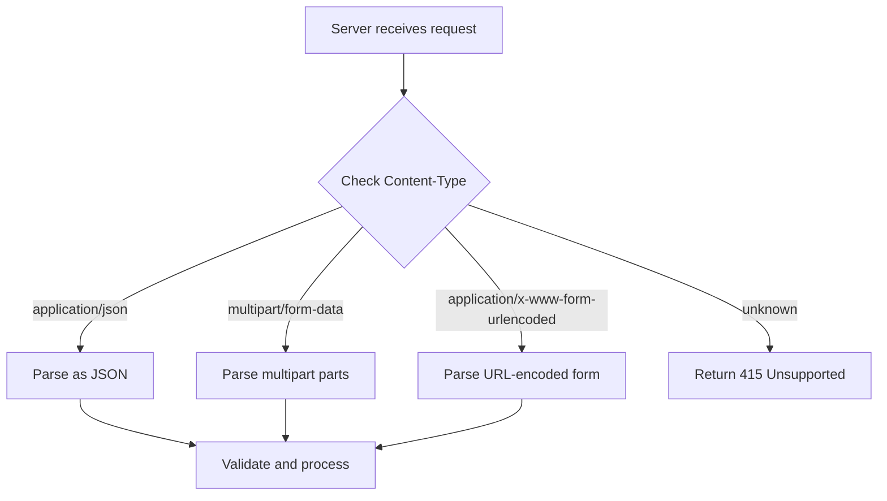
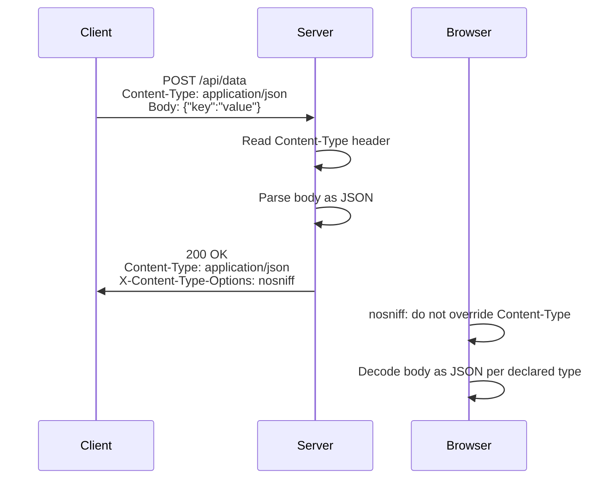

⚡ TL;DR - The `Content-Type` header is the signal that
tells every receiver - browser, server, proxy - what format
the body is in and how to decode it; getting it wrong causes
silent data corruption, XSS vulnerabilities, and
unparseable responses.

---

| #011 | Category: HTTP & APIs | Difficulty: ★☆☆ |
|:---|:---|:---|
| **Depends on:** | HTTP Headers, HTTP Request Structure | |
| **Used by:** | JSON as API Format, HTTP Compression, Content Negotiation | |
| **Related:** | HTTP Methods, Query Parameters, Request Validation | |

---

### 🔥 The Problem This Solves

**WORLD WITHOUT IT:**
Before MIME types, every program sending data over a network
had to agree in advance on the format. FTP transfers were
either ASCII text or binary - the sender and receiver had
to coordinate outside the protocol. Email attachments could
not include the file type - every recipient had to guess
the format from context or file extension. Including a
spreadsheet in an email required the recipient to already
know what software to use to open it.

**THE BREAKING POINT:**
The internet began connecting heterogeneous systems.
A Unix server sending data to a Windows client could not
assume both understood the same file formats. A web server
serving HTML, images, CSS, and JavaScript needed each
browser to know which files were scripts vs styles vs
markup. Without a standard type signal, browsers would
try to render everything as text, execute everything as
script, or require user intervention for every download.

**THE INVENTION MOMENT:**
MIME (Multipurpose Internet Mail Extensions, RFC 2045, 1996)
defined a standard format for content type labels. The
`type/subtype` format was simple, extensible, and human-readable.
HTTP adopted it as the `Content-Type` header. Now any sender
could label its payload and any receiver could act on that
label without prior coordination.

**EVOLUTION:**
MIME was designed for email. HTTP adopted `Content-Type` in
HTTP/1.0. The IANA media type registry was established to
standardize type names. `application/json` was registered
in 2006 (RFC 4627). `application/problem+json` was registered
in 2016 (RFC 7807) for structured API error responses.
`application/vnd.*` types allow vendor-specific formats.
Today there are 2,000+ registered MIME types.

---

### 📘 Textbook Definition

A MIME type (also called media type or content type) is a
two-part label in the format `type/subtype` that identifies
the format of a data payload. The `Content-Type` header
carries the MIME type of the request or response body,
optionally followed by parameters such as `; charset=utf-8`.
The `Accept` header in a request lists the MIME types the
client is willing to receive. Servers use content negotiation
to select a response format from the client's `Accept` list.
The IANA maintains the official registry of media types.

---

### ⏱️ Understand It in 30 Seconds

**One line:**
`Content-Type: application/json` tells the receiver "the
body bytes are JSON, decode them as UTF-8 text and parse
as JSON" - without this label, the receiver must guess or
fail.

**One analogy:**
> MIME types are like the label on a shipping container.
> "Refrigerated goods" (Content-Type: cold/perishable) tells
> the shipping company how to handle the contents. A container
> labeled "electrical equipment" is handled differently from
> one labeled "fragile glass." Without labels, the dock
> workers must open every container to know how to handle it.
> With labels, the entire logistics chain acts correctly on
> every container without opening any of them.

**One insight:**
The `Content-Type` header is a contract about bytes. The
same sequence of bytes can be HTML, JSON, JavaScript, an
image, or a binary file. The `Content-Type` tells the
parser which interpretation to use. Browsers enforce this
contract with MIME sniffing - and the security header
`X-Content-Type-Options: nosniff` exists specifically to
prevent browsers from overriding the declared type, which
is an XSS attack vector.

---

### 🔩 First Principles Explanation

**MIME TYPE STRUCTURE:**

```
Content-Type: application/json; charset=utf-8
              └──────┬──────┘  └─────┬──────┘
               type/subtype       parameters
```

**Top-level types:**

| Type | Meaning | Examples |
|:---|:---|:---|
| `text` | Human-readable text | `text/html`, `text/plain`, `text/csv` |
| `application` | Application-specific binary or text | `application/json`, `application/pdf` |
| `image` | Image data | `image/jpeg`, `image/png`, `image/webp` |
| `audio` | Audio data | `audio/mp3`, `audio/ogg` |
| `video` | Video data | `video/mp4`, `video/webm` |
| `multipart` | Multiple parts, mixed types | `multipart/form-data`, `multipart/mixed` |
| `font` | Font files | `font/woff2` |

**API-critical MIME types:**

| MIME Type | Used for |
|:---|:---|
| `application/json` | JSON API bodies (most common) |
| `application/x-www-form-urlencoded` | HTML form POST data |
| `multipart/form-data` | File uploads with form fields |
| `application/octet-stream` | Binary data, file download |
| `text/event-stream` | Server-Sent Events (SSE) |
| `application/problem+json` | RFC 7807 error responses |
| `application/vnd.api+json` | JSON:API specification format |
| `application/x-protobuf` | Protocol Buffers binary data |
| `text/csv` | CSV data export |
| `application/xml` | XML API responses |

**Parameters:**

| Parameter | Meaning | Example |
|:---|:---|:---|
| `charset` | Character encoding of text | `; charset=utf-8` |
| `boundary` | Separator in multipart bodies | `; boundary=----Boundary` |

---

### 🧪 Thought Experiment

**SETUP:**
Your server returns HTML containing JavaScript in a response
with `Content-Type: text/plain`. A user visits a URL that
triggers this response. What does the browser do?

**DEFAULT BROWSER BEHAVIOR:**
Modern browsers should render `text/plain` as plain text -
the JavaScript is displayed literally, not executed.
The `Content-Type` contract says "this is plain text."

**WITHOUT `X-Content-Type-Options: nosniff`:**
Older browsers and some current ones perform MIME sniffing -
they examine the response body to guess the actual content
type, ignoring the declared `Content-Type`. If the body
looks like HTML with scripts, the browser may execute it
as HTML - even though `Content-Type` said `text/plain`.
An attacker who can control the content of a `text/plain`
response (e.g., via a user-uploaded file served directly)
can execute arbitrary JavaScript in the victim's browser.

**THE INSIGHT:**
`X-Content-Type-Options: nosniff` tells the browser: "do
not override the `Content-Type` I declared - ever." This
prevents MIME-sniffing XSS attacks. Every API response and
user-content endpoint should include this header. This is
why it is in every security hardening checklist.

---

### 🧠 Mental Model / Analogy

> MIME types are the Rosetta Stone of the internet.
> The same sequence of bytes could be a JPEG image,
> a JavaScript file, a PDF, or a binary executable.
> The MIME type is the label that says "decode these
> bytes as a JPEG" vs "decode as JavaScript." Without
> the label, every receiver would need to examine the
> bytes and guess - and different receivers would guess
> differently. With the label, the contract is explicit
> and consistent across all clients.

Mapping:
- "Rosetta Stone" → `Content-Type` header
- "Same bytes, different interpretations" → raw bytes
  of a JPEG vs a misidentified binary
- "Examine and guess" → MIME sniffing
- "XSS via wrong type" → serving JavaScript as text/plain
  without nosniff

Where this analogy breaks down: MIME types are self-declared
by the server - a malicious server can lie about its
content type. The browser ultimately has to make a trust
decision based on the MIME type.

---

### 📶 Gradual Depth - Five Levels

**Level 1 - What it is (anyone can understand):**
Content types tell the browser or server what kind of data
is in a message. `application/json` means "JSON data."
`image/jpeg` means "JPEG picture." Without this label,
the receiver does not know how to display or process the data.

**Level 2 - How to use it (junior developer):**
Always set `Content-Type: application/json` when sending
JSON in a request body. Always check `Content-Type` before
parsing a response. Return `415 Unsupported Media Type`
when a client sends a content type you cannot handle.
Include `charset=utf-8` for text types.

**Level 3 - How it works (mid-level engineer):**
The `Content-Type` header in the request tells the server
the format of the request body. The `Content-Type` header
in the response tells the client the format of the response
body. The `Accept` request header is the client's list of
preferred response formats. Content negotiation: the server
picks a format from the `Accept` list that it can produce.
`multipart/form-data` with a `boundary` parameter is how
file uploads work - each part is separated by the boundary
string.

**Level 4 - Why it was designed this way (senior/staff):**
The `type/subtype` format allows arbitrary extensibility.
IANA registers standard types. Vendors register `application/vnd.*`
types for proprietary formats. Experimental types use
`application/x-*`. The parameter mechanism (`; charset=utf-8`)
allows the same core type to have different processing
parameters. This design means the type system can evolve
(add new types) without changing the header format. The
`Accept` header uses quality values (`q=0.9`) to express
preferences, enabling precise content negotiation between
clients and servers without requiring exact matches.

**Level 5 - Mastery (distinguished engineer):**
MIME type handling has two critical security dimensions.
First: content type confusion attacks - serving user-
uploaded files with wrong Content-Type (e.g., serving an
uploaded HTML file as `text/plain`) can still execute in
some browsers without `nosniff`. Defense: always set
`X-Content-Type-Options: nosniff`. Second: `multipart/form-data`
boundary injection - if an attacker controls part of a
multipart body and can inject the boundary string, they can
terminate one part early and inject a new malicious part.
Defense: generate cryptographically random boundaries,
never use user-controlled values in boundary strings.
At the architecture level: never trust `Content-Type`
from untrusted input - always re-detect the actual format
of uploaded files using magic byte inspection (file
signature), not just the declared MIME type.

---

### ⚙️ How It Works (Mechanism)

**Request with JSON body:**
```
POST /api/users HTTP/1.1
Content-Type: application/json; charset=utf-8
Content-Length: 42

{"name": "Alice", "email": "alice@example.com"}
```

**Multipart file upload:**
```
POST /upload HTTP/1.1
Content-Type: multipart/form-data; boundary=----Boundary7MA4
Content-Length: 248

------Boundary7MA4
Content-Disposition: form-data; name="description"

My photo
------Boundary7MA4
Content-Disposition: form-data; name="file"; filename="photo.jpg"
Content-Type: image/jpeg

<binary JPEG bytes>
------Boundary7MA4--
```



**Content negotiation flow:**

```
Request: Accept: application/json, text/html;q=0.9

Server checks available formats:
- Can produce: application/json → YES, q=1.0
- Can produce: text/html → YES, q=0.9
- Select highest q that server can produce: application/json

Response: Content-Type: application/json
```

---

### 🔄 The Complete Picture - End-to-End Flow

```
┌──────────────────────────────────────────────────────┐
│       Content-Type Processing Chain                  │
├──────────────────────────────────────────────────────┤
│                                                      │
│  Client → [set Content-Type on request body]         │
│         → Server parses request body per type         │
│         → Server builds response body                │
│         → Server sets Content-Type on response       │
│  Client ← [reads Content-Type, decodes body]         │
│         → Browser enforces nosniff (if set)           │
│                                                      │
│  FAILURE PATH:                                        │
│  Wrong Content-Type →                                │
│    Server parses JSON as text → 400 or corrupt data  │
│  Missing Content-Type on POST →                      │
│    Server may return 415 or try to guess             │
│  Missing nosniff →                                   │
│    Browser may MIME-sniff and execute as wrong type  │
└──────────────────────────────────────────────────────┘
```



---

### 💻 Code Example

**Example 1 - BAD: Not setting Content-Type on POST**

```python
# BAD: sending JSON body without Content-Type
import requests

# Server may get raw bytes with no type hint
# Server returns 415 or parses as text/plain
response = requests.post(
    "https://api.example.com/users",
    data='{"name": "Alice"}'  # raw string, no Content-Type
)
```

**Example 1 - GOOD: Correct Content-Type for JSON**

```python
# GOOD: use json= parameter (library sets Content-Type)
import requests

response = requests.post(
    "https://api.example.com/users",
    json={"name": "Alice"}  # sets Content-Type: application/json
)

# OR: set Content-Type explicitly
response = requests.post(
    "https://api.example.com/users",
    data='{"name": "Alice"}',
    headers={"Content-Type": "application/json; charset=utf-8"}
)
```

---

**Example 2 - Validating Content-Type on server (Flask)**

```python
from flask import request, jsonify

@app.route("/api/events", methods=["POST"])
def create_event():
    # Validate Content-Type before parsing
    content_type = request.headers.get("Content-Type", "")

    if "application/json" not in content_type:
        return jsonify({
            "error": "unsupported_media_type",
            "message": (
                "Content-Type must be application/json. "
                f"Received: {content_type}"
            )
        }), 415  # 415 Unsupported Media Type

    data = request.get_json(silent=True)
    if data is None:
        return jsonify({
            "error": "invalid_body",
            "message": "Request body must be valid JSON"
        }), 400

    return jsonify({"id": "evt_123"}), 201
```

---

**Example 3 - Secure file upload with type validation**

```python
import magic  # python-magic library
ALLOWED_TYPES = {
    "image/jpeg", "image/png",
    "image/gif", "image/webp"
}
MAX_FILE_SIZE = 5 * 1024 * 1024  # 5 MB

@app.route("/upload/avatar", methods=["POST"])
def upload_avatar():
    if "file" not in request.files:
        return jsonify({"error": "No file provided"}), 400

    file = request.files["file"]
    file_bytes = file.read()

    # Size check
    if len(file_bytes) > MAX_FILE_SIZE:
        return jsonify({"error": "File too large"}), 413

    # BAD: trust the declared MIME type from client
    # declared_type = file.content_type  # NEVER trust this

    # GOOD: detect actual type from magic bytes
    detected_type = magic.from_buffer(
        file_bytes, mime=True
    )

    if detected_type not in ALLOWED_TYPES:
        return jsonify({
            "error": "unsupported_file_type",
            "detected": detected_type
        }), 415

    # Safe to store and serve
    save_file(file_bytes, detected_type)
    return jsonify({"url": "/uploads/avatar.jpg"}), 201
```

---

### ⚖️ Comparison Table

| Scenario | Content-Type to Use | Notes |
|:---|:---|:---|
| JSON API body | `application/json` | Most common for REST APIs |
| HTML form POST | `application/x-www-form-urlencoded` | Browser default form submit |
| File upload | `multipart/form-data` | Must include `boundary` parameter |
| Plain text | `text/plain; charset=utf-8` | Include charset always |
| CSV download | `text/csv` | Add `Content-Disposition: attachment` |
| Binary file download | `application/octet-stream` | Generic binary |
| Server-Sent Events | `text/event-stream` | SSE streaming |
| gRPC | `application/grpc` | Used by gRPC protocol |
| Protobuf | `application/x-protobuf` | Binary protobuf |
| API error response | `application/problem+json` | RFC 7807 structured errors |

---

### ⚠️ Common Misconceptions

| Misconception | Reality |
|:---|:---|
| `Content-Type` of a request only affects the server | It also affects how proxies, WAFs, and caches handle the request body |
| `Content-Type: application/json` means the body IS valid JSON | The header declares intent; the body may still be malformed. Always validate separately. |
| File type can be trusted from `Content-Type` header | Clients can send any `Content-Type` - always validate with magic byte inspection for security |
| `text/html` and `application/xhtml+xml` are the same | Different parsing rules; `application/xhtml+xml` requires well-formed XML, `text/html` uses HTML5 error recovery |
| `application/x-www-form-urlencoded` is for binary data | Form encoding is for text key-value pairs only; use `multipart/form-data` for binary files |

---

### 🚨 Failure Modes & Diagnosis

**MIME sniffing XSS - serving user content without nosniff**

**Symptom:** Users who upload files can execute JavaScript
in other users' browsers. Security scanner reports XSS via
content type bypass.

**Root Cause:** User uploads an HTML file with JavaScript
embedded. Server serves it with `Content-Type: text/plain`.
Browser MIME-sniffs the body, detects HTML, and renders it
as HTML, executing the JavaScript.

**Diagnostic Command / Tool:**

```bash
# Check if endpoint serves files without nosniff
curl -I https://files.example.com/upload/user123/file.txt \
  | grep -i "x-content-type-options"
# Should return: X-Content-Type-Options: nosniff
# If missing: MIME sniff XSS risk
```

**Fix:**

```python
# Add to all file serving endpoints
@app.after_request
def add_security_headers(response):
    # Prevent MIME sniffing attacks
    response.headers[
        "X-Content-Type-Options"
    ] = "nosniff"
    return response
```

**Prevention:** Always set `X-Content-Type-Options: nosniff`
on every response, especially when serving user-uploaded
content. Never allow HTML to be served from user-uploaded
content endpoints.

---

**Wrong Content-Type returned - client parse failure**

**Symptom:** Clients fail to parse API responses.
`response.json()` throws exceptions. Mobile apps show
blank screens. Error logs show "not valid JSON."

**Root Cause:** Error handler returns plain text with
status 500 but no `Content-Type` header. Client expects
`application/json` for all responses, fails to parse text.

**Diagnostic Command / Tool:**

```bash
# Trigger an error and check Content-Type
curl -v -X POST \
  -H "Content-Type: application/json" \
  -d '{"invalid": true, trigger_error: true}' \
  https://api.example.com/endpoint 2>&1 | \
  grep -E "< HTTP|content-type|{|}"
# Error response must have Content-Type: application/json
```

**Fix:**

```python
# GOOD: consistent Content-Type on ALL responses including errors
@app.errorhandler(500)
def server_error(error):
    return jsonify({
        "error": "internal_server_error",
        "message": "An unexpected error occurred"
    }), 500
# Flask's jsonify automatically sets Content-Type: application/json
```

**Prevention:** Write integration tests that check
`Content-Type` headers on both success AND error responses.

---

**Missing charset declaration - encoding corruption**

**Symptom:** Special characters (accented letters, CJK
characters, emoji) appear corrupted in API responses.
Users with non-ASCII names see garbled data.

**Root Cause:** Response sends UTF-8 bytes but does not
declare charset. Client defaults to ASCII or ISO-8859-1
and misinterprets multi-byte characters.

**Diagnostic Command / Tool:**

```bash
# Check Content-Type includes charset
curl -v https://api.example.com/users/42 2>&1 | \
  grep "content-type"
# Should include: charset=utf-8
```

**Fix:**

```python
# BAD: no charset - client may misinterpret encoding
return Response(json.dumps(data), mimetype="application/json")

# GOOD: explicit charset declaration
return Response(
    json.dumps(data, ensure_ascii=False).encode("utf-8"),
    mimetype="application/json; charset=utf-8"
)
```

---

### 🔗 Related Keywords

**Prerequisites (understand these first):**
- `HTTP Headers` - the mechanism that carries Content-Type
- `HTTP Request Structure` - how Content-Type sits in
  the header block

**Builds On This (learn these next):**
- `JSON as API Data Format` - the most common content type
  in REST APIs explored in depth
- `HTTP Compression` - Content-Encoding header works
  alongside Content-Type to describe encoded bodies
- `Content Negotiation` - the full protocol for selecting
  content types between client and server

**Alternatives / Comparisons:**
- `Protocol Buffers` - gRPC's binary format uses
  `application/grpc` and `application/x-protobuf` - a
  binary alternative to `application/json`
- `multipart/form-data` vs `application/json` for file
  upload - two different patterns for files+metadata

---

### 📌 Quick Reference Card

```
┌──────────────────────────────────────────────────────────┐
│ WHAT IT IS   │ Two-part label (type/subtype) identifying │
│              │ the format of HTTP message bodies         │
├──────────────┼───────────────────────────────────────────┤
│ PROBLEM IT   │ Receivers need to know how to decode body │
│ SOLVES       │ bytes without guessing from content       │
├──────────────┼───────────────────────────────────────────┤
│ KEY INSIGHT  │ Always declare Content-Type; always add   │
│              │ X-Content-Type-Options: nosniff on server │
├──────────────┼───────────────────────────────────────────┤
│ USE WHEN     │ Every request/response with a body needs  │
│              │ Content-Type. No exceptions.              │
├──────────────┼───────────────────────────────────────────┤
│ AVOID WHEN   │ Never trust client-declared Content-Type  │
│              │ for uploaded files - verify with magic    │
│              │ bytes                                     │
├──────────────┼───────────────────────────────────────────┤
│ ANTI-PATTERN │ Serving user uploads without nosniff,     │
│              │ trusting file.content_type from upload    │
├──────────────┼───────────────────────────────────────────┤
│ TRADE-OFF    │ Strict Content-Type validation = better   │
│              │ security and errors, but 415 errors on    │
│              │ clients that forget the header            │
├──────────────┼───────────────────────────────────────────┤
│ ONE-LINER    │ "Content-Type is the decoding contract.   │
│              │ nosniff prevents browser override."       │
├──────────────┼───────────────────────────────────────────┤
│ NEXT EXPLORE │ JSON Format → Content Negotiation →       │
│              │ HTTP Compression                          │
└──────────────────────────────────────────────────────────┘
```

**If you remember only 3 things:**
1. `Content-Type` tells the receiver how to decode the body.
   Missing it = guessing. Wrong it = parse failure or security issue.
2. Never trust the `Content-Type` declared in a file upload
   request. Always detect the actual format from magic bytes.
3. `X-Content-Type-Options: nosniff` prevents browsers from
   guessing a different type than you declared - required on
   all endpoints that serve user-uploaded content.

---

### 💎 Transferable Wisdom

**Reusable Engineering Principle:**
Label data at the source, never rely on downstream inference.
When data is labeled with its format at creation time (Content-Type
on HTTP messages, schema annotations on data, type tags
in serialization formats), every consumer can process
it correctly without knowing the producer's internal state.
Systems that rely on consumers inferring format from content
(MIME sniffing, "looks like JSON so parse it as JSON")
are fragile at their most critical boundary - the point
where untrusted input enters the system.

**Where else this pattern appears:**
- Avro/Protobuf schemas: schema ID in the message header
  allows consumers to deserialize without knowing the
  producer's schema version in advance
- AWS S3 object metadata: `ContentType` stored with each
  object, returned in HEAD/GET responses - same principle
- Docker image manifests: `mediaType` field in every layer
  descriptor tells the container runtime how to handle
  each layer

---

### 💡 The Surprising Truth

The `application/json` MIME type was not registered with
IANA until 2006 (RFC 4627) - 12 years after HTTP/1.0 was
introduced. Before registration, developers used
`text/javascript`, `text/x-json`, and `application/x-json`
interchangeably. This inconsistency is why you still see
old codebases using `text/javascript` as the Content-Type
for JSON responses - it was a legitimate practice before
`application/json` was standardized. The 2013 update (RFC
7158) clarified encoding rules; the final version (RFC
8259, 2017) standardized that JSON must be UTF-8 encoded
with no BOM. That is 23 years from JSON's origin to a
fully standardized MIME type.

---

### ✅ Mastery Checklist

**You've mastered this when you can:**
1. **EXPLAIN** Describe why a browser might execute JavaScript
   from a file served as `text/plain` without `nosniff`,
   and what header prevents this.
2. **DEBUG** Given a client reporting that API error
   responses cannot be parsed, identify the likely cause
   as mismatched Content-Type on error responses and
   explain the fix.
3. **DECIDE** For a file upload endpoint that accepts
   images, documents, and videos, design the complete
   Content-Type validation strategy - what to accept,
   what to reject, and how to verify.
4. **BUILD** Write a middleware that returns 415 for any
   POST/PUT/PATCH request that does not declare
   `application/json` as Content-Type, with a helpful
   error message.
5. **EXTEND** Explain the MIME type confusion attack vector
   in `multipart/form-data` and how to generate safe
   multipart boundaries.

---

### 🎯 Interview Deep-Dive

**Q1: Why should you validate file types using magic bytes
rather than the Content-Type header on file uploads?**

*Why they ask:* Tests security thinking about trusting
client-supplied data vs validating independently.

*Strong answer includes:*
- `Content-Type` in a file upload request is declared by
  the client - any client can claim any type
- A malicious user can upload a PHP script claiming
  `Content-Type: image/jpeg` to bypass filters
- Magic bytes: the first few bytes of a file follow a
  known signature (JPEG always starts `FF D8 FF`, PNG
  starts `89 50 4E 47`, etc.)
- Detection: use `file` command, `python-magic`, or
  `mime-detect` libraries to check actual file signature
- Defense in depth: rename uploaded files (remove extension),
  serve from a separate domain, never execute uploaded files

**Q2: What is MIME sniffing, what attack does it enable,
and how do you prevent it?**

*Why they ask:* Tests knowledge of browser security model
and HTTP headers - directly relevant to serving user content.

*Strong answer includes:*
- MIME sniffing: browser inspects body content to guess
  actual type when declared type seems wrong
- Attack: attacker uploads HTML with embedded JavaScript;
  server serves it as `text/plain` but without `nosniff`
  browser detects HTML and executes the script
- Impact: stored XSS on the uploading domain
- Prevention: `X-Content-Type-Options: nosniff` header on
  all responses - browser respects declared Content-Type only
- Additional defense: serve user uploads from a separate
  sandboxed domain so any XSS cannot access the main
  domain's cookies/localStorage

**Q3: How does `multipart/form-data` work, and when
would you use it vs a JSON body for file upload?**

*Why they ask:* Tests practical knowledge of file upload
patterns - a common real-world API design question.

*Strong answer includes:*
- `multipart/form-data`: body is divided into parts by a
  boundary string; each part has its own `Content-Disposition`
  and `Content-Type`; binary file data is sent as-is (no encoding)
- `application/json` for file upload requires encoding binary
  in Base64, which inflates size by 33% and requires
  server-side decoding
- Use `multipart/form-data` for: large files, direct binary
  upload, file + metadata in one request
- Use JSON with Base64 for: small files, when the API is
  already JSON-only, when the file is a small embedded asset
- Real-world: S3 direct upload uses `multipart/form-data`
  from the browser; REST API file references use JSON
