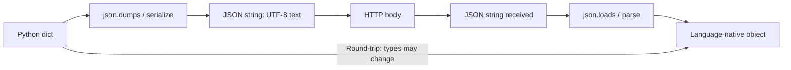

⚡ TL;DR - JSON is the universal API data format because
it is human-readable, natively parsed by JavaScript,
schema-optional, and supported by every language and tool -
but it has specific pitfalls around number precision,
null handling, and date representation that cause silent
data corruption in production.

---

| #013 | Category: HTTP & APIs | Difficulty: ★☆☆ |
|:---|:---|:---|
| **Depends on:** | Content Types, HTTP Request Structure | |
| **Used by:** | REST Design, Error Response Design, GraphQL, Content Negotiation | |
| **Related:** | Query Parameters, Request Validation, gRPC and Protobuf | |

---

### 🔥 The Problem This Solves

**WORLD WITHOUT IT:**
Before JSON, the dominant data format for web services was
XML. XML is verbose, requires a dedicated parser, has complex
namespace rules, and is not natively understood by JavaScript.
SOAP services with XML required generating client stubs from
WSDL schemas. A simple "get user by ID" response in XML
might be 10x the size of the equivalent JSON. Parsing XML
in a browser required ActiveX or plugins on Internet Explorer.

**THE BREAKING POINT:**
The Ajax revolution (2005) required web browsers to receive
and process API responses with JavaScript. XML parsing in
JavaScript was painful - no native support, different
implementation on every browser, complex DOM-based API.
Developers needed a format that JavaScript could parse
natively without a library.

**THE INVENTION MOMENT:**
Douglas Crockford formalized JSON (JavaScript Object Notation)
in 2001 as a subset of JavaScript syntax. A JSON response
could be evaluated directly as JavaScript. Modern parsers
use `JSON.parse()` for safety, but the format was designed
to map exactly to JavaScript's object and array literals.
This made it trivially easy to use in browsers, which made
it trivially easy for APIs to adopt.

**EVOLUTION:**
JSON was informally used from ~2001. MIME type
`application/json` registered in 2006 (RFC 4627). Updated
in 2013 (RFC 7158) and finalized in 2017 (RFC 8259):
JSON must be UTF-8 encoded, no BOM. JSON Schema emerged
to add optional type validation. JSON:API standardized
API response envelope structure. Today, JSON is the default
data format for REST APIs, GraphQL, webhooks, and config
files.

---

### 📘 Textbook Definition

JSON (JavaScript Object Notation) is a lightweight,
text-based data interchange format derived from JavaScript
object literal syntax. It represents data as combinations
of six value types: objects (unordered key-value maps
with string keys), arrays (ordered sequences), strings
(UTF-8 text), numbers (IEEE 754 double-precision float),
booleans (`true`/`false`), and `null`. JSON does not
natively represent dates, binary data, undefined, or
arbitrary-precision integers. RFC 8259 (2017) is the
current specification, requiring UTF-8 encoding.

---

### ⏱️ Understand It in 30 Seconds

**One line:**
JSON is text that represents structured data - objects
with keys and values, arrays of items, strings, numbers,
booleans, and nulls - readable by humans and parseable
by every programming language.

**One analogy:**
> JSON is like a standardized form for exchanging information.
> A paper form has labeled boxes (keys) with filled-in
> values (values). Some boxes contain other forms (nested
> objects). Some boxes have multiple answers (arrays).
> Boxes can be empty (null). Anyone who understands the
> form format can read it, regardless of whether the
> form was filled in by a Java program, a Python script,
> or a JavaScript browser.

**One insight:**
JSON numbers are IEEE 754 doubles. Any integer larger than
2^53 (9,007,199,254,740,992) cannot be represented exactly
as a JSON number. This is why Twitter IDs, Stripe IDs,
and database BIGINT values should be sent as JSON strings,
not numbers. JavaScript's `Number.MAX_SAFE_INTEGER` is
exactly 2^53 - 1. Send `"id": "9007199254740993"` not
`"id": 9007199254740993` for 64-bit IDs.

---

### 🔩 First Principles Explanation

**JSON VALUE TYPES:**

```json
{
  "string": "Alice",
  "number_int": 42,
  "number_float": 3.14,
  "boolean": true,
  "null_value": null,
  "array": [1, 2, 3],
  "object": {
    "nested": "value"
  }
}
```

**What JSON can represent:**
- Objects: `{"key": "value"}` - unordered key-value maps
- Arrays: `[1, 2, "three"]` - ordered, mixed-type allowed
- Strings: `"hello"` - must use `"`, not `'`
- Numbers: `42`, `3.14`, `-1`, `1.5e10` - no integer/float
  distinction in spec
- Booleans: `true`, `false` (lowercase only)
- Null: `null` (lowercase only)

**What JSON cannot represent (and the workaround):**

| Type | JSON has no native type | Convention |
|:---|:---|:---|
| Date/Time | No `Date` type | ISO 8601 string: `"2024-01-15T10:30:00Z"` |
| 64-bit integer | Numbers are doubles (53-bit) | String: `"id": "9007199254740993"` |
| Binary data | No binary type | Base64-encoded string |
| Undefined | No `undefined` | Omit the key (or use `null`) |
| Comments | No comment syntax | Remove before parsing |
| Circular references | No reference syntax | Must break circular refs before serializing |

**SERIALIZATION vs DESERIALIZATION:**
- Serialization: language object → JSON string (stringify)
- Deserialization: JSON string → language object (parse)
- Key risk: type coercion during round-trips
  (Java `Long` → JSON number → JavaScript loses precision)

---

### 🧪 Thought Experiment

**SETUP:**
A payment API returns a charge ID as a JSON number:
`{"charge_id": 9007199254740993}`. A JavaScript client
receives this response and stores the charge ID for later
use. The client then calls `GET /charges/9007199254740993`.
The server says "charge not found."

**WHAT HAPPENS:**
JavaScript parses `9007199254740993` as a floating-point
number. `Number.MAX_SAFE_INTEGER` = 9007199254740991.
9007199254740993 > MAX_SAFE_INTEGER, so JavaScript cannot
represent it exactly. `JSON.parse('9007199254740993')` in
JavaScript = `9007199254740992` (wrong!). The client sends
a GET request with the wrong ID. The server returns 404.

**THE INSIGHT:**
This is not a JavaScript bug - it is a known limitation of
IEEE 754 double-precision floating-point. JSON's number
type is spec'd as double-precision. IDs larger than 2^53 will
be silently truncated by JavaScript parsers. The fix: always
send 64-bit IDs as JSON strings. Twitter, Stripe, and every
other production API that uses 64-bit IDs sends both:
`"id": "9007199254740993", "id_str": "9007199254740993"`.
The `_str` version is the safe one for JavaScript clients.

---

### 🧠 Mental Model / Analogy

> JSON is a container system with exactly six container
> types. A warehouse (object) has labeled shelves (keys)
> holding items. A conveyor belt (array) carries items in
> order. Items can be text tags (strings), numeric counts
> (numbers), yes/no flags (booleans), or empty slots (null).
> Items can themselves be warehouses (nested objects) or
> more conveyor belts (nested arrays). The system has no
> native support for perishables (dates), fragile items
> (binary), or special cargo (64-bit integers) - those
> require custom packing in string containers.

Mapping:
- "Labeled shelves" → JSON object keys
- "Items on shelves" → JSON values
- "Conveyor belt order" → JSON array
- "Custom packing for special cargo" → string encoding
  for dates, binary, 64-bit ints

Where this analogy breaks down: JSON objects have no
guarantee of key order (though modern parsers typically
preserve insertion order). The "labeled shelves" metaphor
implies spatial ordering, which JSON objects do not have.

---

### 📶 Gradual Depth - Five Levels

**Level 1 - What it is (anyone can understand):**
JSON is a text format for representing data as objects
and lists. `{"name": "Alice", "age": 30}` is JSON for
a person. `[1, 2, 3]` is a JSON list of numbers. Every
website and app uses JSON to send data between a server
and a browser or mobile app.

**Level 2 - How to use it (junior developer):**
Use `Content-Type: application/json`. Always parse with
a JSON library - never `eval()`. Send dates as ISO 8601
strings (`2024-01-15T10:30:00Z`). Send large integers
as strings. Check for `null` values before using them.
Do not include comments in JSON (they are invalid).

**Level 3 - How it works (mid-level engineer):**
JSON is text-based UTF-8. Each language has a parser
that converts the text to native types. Type mapping varies
by language: JSON `null` may become `None` (Python),
`nil` (Ruby), or `null` (Java wrapper type). JSON `number`
may become `int`, `long`, `float`, or `BigDecimal`
depending on the target type. Round-trip type fidelity
requires schema knowledge that JSON does not carry itself.
JSON Schema provides optional schema validation.

**Level 4 - Why it was designed this way (senior/staff):**
JSON was designed to be minimal - only the types JavaScript
had natively (as of ES3). This made browser adoption
trivial. The trade-off: no native date type means every
API must invent a date format convention. No integer/float
distinction means parsers must decide how to represent
numbers, leading to precision problems. No binary type
means files must be Base64-encoded (33% size overhead).
These are not oversights - they are the deliberate cost
of maximizing simplicity and browser compatibility. For
use cases where these limitations matter, Protocol Buffers
and MessagePack add native date, int64, and binary types.

**Level 5 - Mastery (distinguished engineer):**
JSON has three non-obvious production failure modes at
scale. First: large integer precision loss (as described
in the thought experiment). Second: number representation
inconsistency across languages - Python serializes
`Decimal("1.1")` as `1.1` but `float(1.1)` as
`1.1000000000000001` - use `json.dumps(data, use_decimal=True)`
or equivalent. Third: `null` ambiguity - is `null` "the
field exists but has no value" or "the field is not
present"? Some APIs use absent key vs `null` to distinguish
these cases; others use explicit flag fields. Inconsistent
`null` semantics across endpoints causes client parsing
bugs. Define and document `null` semantics explicitly.

---

### ⚙️ How It Works (Mechanism)

**JSON parsing pipeline:**

```
Raw bytes (UTF-8):
  {"id": 42, "name": "Alice", "active": true}

1. Lexer tokenizes:
   { "id" : 42 , "name" : "Alice" , "active" : true }
   
2. Parser builds AST:
   Object {
     "id": Number(42)
     "name": String("Alice")
     "active": Boolean(true)
   }

3. Language-specific type mapping:
   Python: {"id": 42, "name": "Alice", "active": True}
   Java:   {"id": 42, "name": "Alice", "active": true}
   JS:     {id: 42, name: "Alice", active: true}
```

**JSON number representations:**

```
42          → integer (parsed as int by most languages)
42.0        → float (parsed as double)
1.5e10      → scientific notation
9007199254740993  → 64-bit int (PRECISION LOST in JS!)
"9007199254740993" → string (safe in all languages)
```



---

### 🔄 The Complete Picture - End-to-End Flow

**JSON in a REST API request and response:**

```
Request:
POST /users HTTP/1.1
Content-Type: application/json; charset=utf-8
Content-Length: 71

{
  "name": "Alice Andersen",
  "email": "alice@example.com",
  "birth_date": "1990-05-15"
}

Response:
HTTP/1.1 201 Created
Content-Type: application/json; charset=utf-8
Location: /users/usr_9007199254740993

{
  "id": "usr_9007199254740993",
  "name": "Alice Andersen",
  "email": "alice@example.com",
  "birth_date": "1990-05-15",
  "created_at": "2024-01-15T10:30:00Z",
  "active": true,
  "profile_image_url": null
}
```

**What to notice:**
- `id` is a string (large integer, safe for all clients)
- `birth_date` is ISO 8601 date string (no native date type)
- `created_at` is ISO 8601 datetime with timezone (UTC, `Z`)
- `profile_image_url` is `null` (not omitted)
- `active` is boolean (lowercase `true`, not `"true"`)

---

### 💻 Code Example

**Example 1 - BAD: Large integer as JSON number**

```python
# BAD: large integer as JSON number - precision lost in JS

user_id = 9007199254740993  # 64-bit ID

# WRONG: sends as number - JavaScript will lose precision
response = {
    "id": user_id,          # JS: 9007199254740992 (wrong!)
    "name": "Alice"
}
return jsonify(response)
```

**Example 1 - GOOD: Large integer as string**

```python
# GOOD: send 64-bit IDs as strings

user_id = 9007199254740993

response = {
    "id": str(user_id),     # JS: "9007199254740993" (correct)
    "name": "Alice"
}
return jsonify(response)
```

---

**Example 2 - Date handling in JSON (Python)**

```python
import json
from datetime import datetime, date, timezone

# BAD: datetime objects are not JSON serializable by default
data = {
    "name": "Alice",
    "birth_date": date(1990, 5, 15),  # TypeError!
    "created_at": datetime.now()       # TypeError!
}
# json.dumps(data) → TypeError: Object of type date is not
# JSON serializable

# GOOD: use ISO 8601 string format
def to_json_safe(obj):
    if isinstance(obj, datetime):
        # Always include timezone (UTC)
        return obj.astimezone(timezone.utc).isoformat()
    if isinstance(obj, date):
        return obj.isoformat()  # "1990-05-15"
    raise TypeError(f"Object of type {type(obj)} "
                    "is not JSON serializable")

data = {
    "name": "Alice",
    "birth_date": date(1990, 5, 15).isoformat(),
    "created_at": (
        datetime.now(timezone.utc).isoformat()
    )
}
json.dumps(data)  # works correctly
```

---

**Example 3 - JSON parsing with validation**

```python
import json
from typing import Optional

def parse_user_from_json(body: bytes) -> dict:
    # Step 1: parse bytes to dict
    try:
        data = json.loads(body)
    except json.JSONDecodeError as e:
        raise ValueError(f"Invalid JSON: {e}")

    # Step 2: validate required fields and types
    if not isinstance(data, dict):
        raise ValueError("JSON body must be an object")

    name = data.get("name")
    if not isinstance(name, str) or not name.strip():
        raise ValueError("'name' must be a non-empty string")

    email = data.get("email")
    if not isinstance(email, str):
        raise ValueError("'email' must be a string")

    # Step 3: handle null safely
    phone: Optional[str] = data.get("phone")
    if phone is not None and not isinstance(phone, str):
        raise ValueError("'phone' must be a string or null")

    return {
        "name": name.strip(),
        "email": email.lower(),
        "phone": phone
    }
```

---

### ⚖️ Comparison Table

| Criterion | JSON | XML | Protocol Buffers | MessagePack |
|:---|:---|:---|:---|:---|
| **Human-readable** | Yes | Yes (verbose) | No (binary) | No (binary) |
| **Native browser support** | Yes | Partial | No | No |
| **Schema required** | No (optional) | DTD/XSD | Yes (.proto) | No |
| **64-bit integer** | String workaround | String or xsd:long | `int64` native | `int64` native |
| **Date/Time** | String convention | xsd:dateTime | No native | Extension |
| **Binary data** | Base64 string | Base64 string | `bytes` native | `bin` native |
| **Size efficiency** | Medium | Large | Very small | Small |
| **Typical use** | REST APIs, webhooks | Legacy/enterprise | gRPC, internal | Low-latency |

---

### ⚠️ Common Misconceptions

| Misconception | Reality |
|:---|:---|
| JSON integers and floats are different types | JSON has one `number` type for all numeric values; the spec defines it as IEEE 754 double-precision |
| JSON strings must use double quotes | JSON strings MUST use double quotes (`"string"`). Single quotes (`'string'`) are invalid JSON and will fail to parse |
| JSON keys can be any type | JSON object keys MUST be strings (with double quotes). `{1: "value"}` is invalid JSON. |
| `null` and `undefined` are equivalent | JSON has `null` but no `undefined`. In JavaScript, `JSON.stringify({key: undefined})` omits the key entirely; `JSON.stringify({key: null})` includes `"key": null`. |
| Comments are allowed in JSON | Standard JSON has no comment syntax. JSON5 and JSONC extensions allow comments, but standard parsers reject them. |

---

### 🚨 Failure Modes & Diagnosis

**64-bit integer precision loss in JavaScript**

**Symptom:** JavaScript client references the wrong resource.
Requests for a specific order ID return "not found."
Database shows the order exists with a slightly different ID.

**Root Cause:** API returns 64-bit integer as JSON number.
JavaScript `JSON.parse()` silently rounds to the nearest
representable double.

**Diagnostic Command / Tool:**

```javascript
// Test in browser console:
const id = 9007199254740993;
console.log(JSON.parse("9007199254740993")); // 9007199254740992
console.log(id === 9007199254740992);         // true! (wrong)
console.log(Number.MAX_SAFE_INTEGER);         // 9007199254740991
```

**Fix:**

```python
# Server-side: send large IDs as strings
response = {
    "id": str(order.id),      # String, not int
    "amount_cents": order.amount  # OK: amounts < 2^53
}
```

**Prevention:** Any ID, timestamp in milliseconds, or
counter from a distributed system may exceed 2^53. Policy:
all IDs are strings in JSON responses.

---

**Timezone-free date causing off-by-one errors**

**Symptom:** Records appear with wrong dates. Customers
in different timezones see different "today" boundaries.
Reporting shows data assigned to wrong days.

**Root Cause:** API stores and returns dates without
timezone information. Clients in UTC-8 receive a UTC
date string and display it without offset, showing a
date one day earlier.

**Diagnostic Command / Tool:**

```python
# Check if response includes timezone
import requests
r = requests.get("https://api.example.com/events/1")
created = r.json()["created_at"]
print(created)
# BAD:  "2024-01-15T00:30:00" (no timezone = ambiguous)
# GOOD: "2024-01-15T00:30:00Z" (Z = UTC, unambiguous)
# GOOD: "2024-01-15T00:30:00+05:30" (explicit offset)
```

**Fix:**

```python
# Always store and return UTC with Z suffix
from datetime import datetime, timezone

def format_dt(dt: datetime) -> str:
    # Ensure UTC, format as ISO 8601 with Z
    if dt.tzinfo is None:
        # Assume UTC if naive (dangerous assumption)
        dt = dt.replace(tzinfo=timezone.utc)
    return dt.astimezone(timezone.utc).strftime(
        "%Y-%m-%dT%H:%M:%SZ"
    )
```

**Prevention:** Always store datetimes in UTC. Always
include timezone in JSON datetime strings. Always validate
client-submitted datetime strings for timezone indicator.

---

**Null vs missing key - semantic ambiguity**

**Symptom:** Clients cannot tell whether a field was
explicitly set to null (user intentionally cleared it)
or was never provided. PATCH updates behave unexpectedly.

**Root Cause:** API uses `null` and missing key
interchangeably. A PATCH request with `{"email": null}`
is treated the same as a PATCH with no `email` field.

**Diagnostic Command / Tool:**

```bash
# Test null vs absent behavior
curl -X PATCH /users/42 \
  -H "Content-Type: application/json" \
  -d '{"phone": null}'
# Should CLEAR phone, not ignore it

curl -X PATCH /users/42 \
  -H "Content-Type: application/json" \
  -d '{}'
# Should NOT change phone (no phone field = no change)
```

**Fix:**

```python
# Distinguish null (clear) from absent (no change)
import json

def apply_patch(user, patch_body: bytes):
    try:
        patch = json.loads(patch_body)
    except json.JSONDecodeError:
        raise ValueError("Invalid JSON")

    for field in ["name", "email", "phone"]:
        if field in patch:  # key present = update/clear
            user[field] = patch[field]  # null = clear
        # key absent = leave unchanged

    return user
```

---

### 🔗 Related Keywords

**Prerequisites (understand these first):**
- `Content Types and MIME Types` - `application/json`
  is the MIME type that signals JSON content
- `HTTP Request Structure` - JSON lives in the body

**Builds On This (learn these next):**
- `REST Principles and Design` - JSON is the default
  body format for REST APIs
- `Error Response Design` - how to structure JSON error
  responses consistently (RFC 7807)
- `GraphQL Query Language` - GraphQL uses JSON for both
  requests and responses

**Alternatives / Comparisons:**
- `gRPC and Protocol Buffers` - binary alternative to
  JSON with native int64, bytes, and schema enforcement
- `Content Negotiation` - how clients and servers
  agree on JSON vs XML vs Protobuf for the same endpoint

---

### 📌 Quick Reference Card

```
┌──────────────────────────────────────────────────────────┐
│ WHAT IT IS   │ Text-based data format with 6 types:      │
│              │ object, array, string, number, bool, null │
├──────────────┼───────────────────────────────────────────┤
│ PROBLEM IT   │ Universal data exchange format that any   │
│ SOLVES       │ language and browser can parse natively   │
├──────────────┼───────────────────────────────────────────┤
│ KEY INSIGHT  │ No native date, binary, or 64-bit int     │
│              │ type - use strings for all three          │
├──────────────┼───────────────────────────────────────────┤
│ USE WHEN     │ Default for REST APIs, webhooks,          │
│              │ configuration files                       │
├──────────────┼───────────────────────────────────────────┤
│ AVOID WHEN   │ High-throughput internal services (use    │
│              │ Protobuf), large binary payloads          │
├──────────────┼───────────────────────────────────────────┤
│ ANTI-PATTERN │ 64-bit integers as JSON numbers, dates    │
│              │ without timezone, null/absent confusion   │
├──────────────┼───────────────────────────────────────────┤
│ TRADE-OFF    │ Human-readable, schema-optional vs        │
│              │ verbose, no native int64/date/binary      │
├──────────────┼───────────────────────────────────────────┤
│ ONE-LINER    │ "IDs and dates are strings in JSON.       │
│              │ Numbers are doubles - 53 bits max."       │
├──────────────┼───────────────────────────────────────────┤
│ NEXT EXPLORE │ REST API Design → Error Response Design → │
│              │ Protocol Buffers (binary alternative)     │
└──────────────────────────────────────────────────────────┘
```

**If you remember only 3 things:**
1. JSON numbers are IEEE 754 doubles. 64-bit integers lose
   precision in JavaScript clients. Always send large IDs
   as JSON strings.
2. JSON has no date type. Use ISO 8601 strings with explicit
   UTC timezone (`"2024-01-15T10:30:00Z"`). Missing timezone
   causes date display bugs across time zones.
3. `null` and absent key have different semantics.
   Define and document the difference in your API, especially
   for PATCH endpoints.

---

### 💎 Transferable Wisdom

**Reusable Engineering Principle:**
Simple, universal formats win over optimal, specialized
formats in cross-system integration. JSON is not the most
efficient encoding (Protobuf is 5-10x smaller), not the
most type-safe (Avro/Thrift have schemas), and not the
most expressive (CBOR has native binary). But JSON is
universally supported, human-readable, and requires no
tooling to inspect. For integration points where simplicity
and universality matter more than efficiency, the simpler
format wins even at significant performance cost. The
trade-off only reverses when performance becomes the
dominant concern (high-throughput internal APIs).

**Where else this pattern appears:**
- CSV: even simpler than JSON, even more universally
  supported; wins for tabular data despite zero type
  safety
- HTTP itself: text-based (vs binary alternatives like
  BEEP) because ubiquitous tooling (`curl`, browser DevTools)
  is worth more than the encoding efficiency

---

### 💡 The Surprising Truth

JSON was not designed to be the world's API format. Douglas
Crockford formalized it as a way to pass JavaScript objects
via URLs in browser-to-server communication in 2001. He
did not invent it - he just recognized that JavaScript
already had object literals that were also valid JavaScript
expressions, made them into a specification, and registered
the MIME type. He has described himself as "discovering"
JSON rather than inventing it. The irony: JSON's defining
property (being a subset of JavaScript) is technically
false - ECMAScript 2019 fixed this by excluding certain
Unicode characters that were valid in JSON but not in
JavaScript string literals. For 18 years, JSON was not
actually a subset of JavaScript.

---

### ✅ Mastery Checklist

**You've mastered this when you can:**
1. **EXPLAIN** Why JavaScript silently loses precision on
   64-bit integers in JSON, what the maximum safe integer
   is, and what the correct fix is for API responses.
2. **DEBUG** Given a report that PATCH requests are
   unexpectedly clearing user fields, identify the null
   vs absent key ambiguity and implement the fix.
3. **DECIDE** For each data type - UUID, monetary amount
   in cents, Unix timestamp in milliseconds, profile photo,
   birth date - choose the correct JSON representation.
4. **BUILD** Write a JSON serializer helper in any language
   that correctly handles: dates (ISO 8601 UTC), 64-bit
   integers (strings), and distinguishes null from missing
   in the output.
5. **EXTEND** Explain why Protocol Buffers is preferred
   over JSON for internal microservice communication at
   high throughput, and under what circumstances the
   verbosity of JSON is worth the performance cost.

---

### 🎯 Interview Deep-Dive

**Q1: Why do large integer IDs in JSON responses cause
bugs in JavaScript clients? What is the fix?**

*Why they ask:* A very specific but extremely common
production bug that tests whether the candidate thinks
about cross-language type systems.

*Strong answer includes:*
- JSON numbers are spec'd as IEEE 754 double-precision
- IEEE 754 double has 53 bits of integer precision
  (2^53 = 9,007,199,254,740,992 is max safe integer)
- `JSON.parse()` in JavaScript converts all numbers to
  native `Number` (a double) - integers > 2^53 are rounded
- Fix: send 64-bit IDs as JSON strings
  (`"id": "9007199254740993"`)
- Why it matters: Twitter IDs, database BIGINTs, Snowflake
  IDs, and distributed system IDs are commonly 64-bit
- Twitter discovered this bug in 2011 and added a `id_str`
  field to their API alongside the numeric `id` field

**Q2: How should you represent dates and times in a JSON
API? What problems arise if you do not include timezone?**

*Why they ask:* Date handling is a common source of bugs
in production APIs - tests whether the candidate has
experienced this in practice.

*Strong answer includes:*
- ISO 8601 strings are the convention: `"2024-01-15T10:30:00Z"`
- `Z` suffix = UTC; `+05:30` = explicit offset
- Without timezone: a user in UTC-8 receiving `"2024-01-15T00:30:00"`
  as "midnight UTC" displays it as the previous day in
  their timezone if they assume local time
- Best practice: always store and transmit in UTC; let
  clients convert to local timezone for display
- Date-only values (birthdays, expiry dates): `"2024-01-15"` is
  fine without timezone since these represent calendar days,
  not moments in time

**Q3: What is the difference between a JSON key being
`null` vs the key being absent? When does this matter?**

*Why they ask:* Tests whether the candidate has designed
or debugged PATCH endpoints and understands JSON null semantics.

*Strong answer includes:*
- Absent key: `{}` - no information about this field
- Null value: `{"phone": null}` - explicit statement
  "this field has no value"
- PATCH semantics: absent = "do not change"; null = "clear
  this field to empty/null"
- Real bug: naive PATCH implementation that merges the
  incoming JSON with the existing record using `dict.update()`
  treats absent and null the same - both clear the field
- Fix: iterate over the patch body's keys, not the expected
  fields; if the key is present (even if null), update;
  if the key is absent, leave unchanged
- Documented convention required: your API must define
  and communicate which behavior it follows
